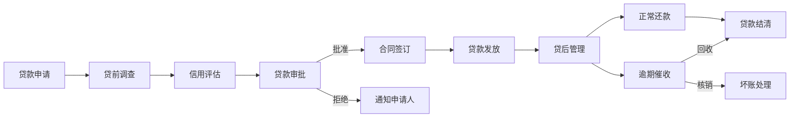
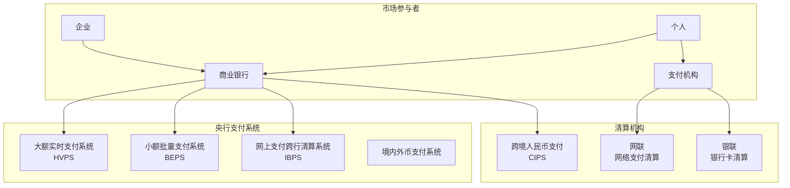
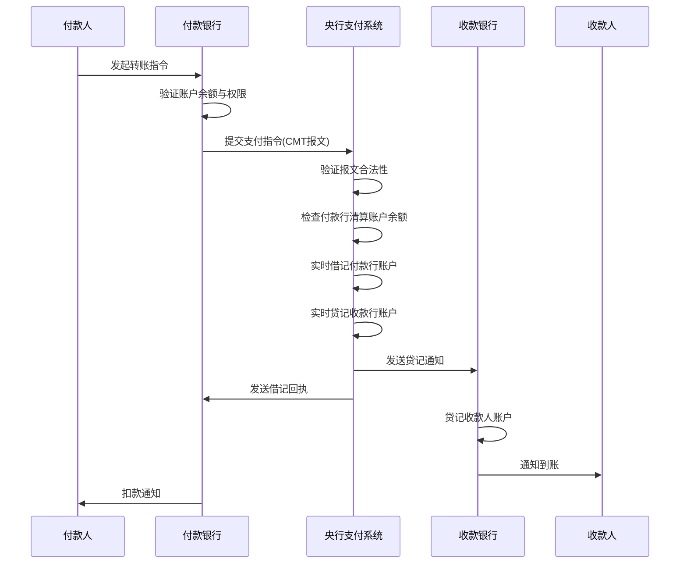

# 银行业务与支付体系

## 银行业务概述

银行是金融体系中最重要的中介机构，通过吸收存款和发放贷款实现信用创造和资金配置。银行业务按性质可分为三大板块：资产业务、负债业务和中间业务。

## 银行业务三大板块

### 资产业务（资金运用）

资产业务是银行运用资金获取收益的业务，是银行收入的主要来源：

| 资产类型 | 说明 | 风险特征 |
|----------|------|----------|
| 贷款 | 向个人和企业发放的信贷资金 | 信用风险、集中度风险 |
| 投资 | 债券、股权等金融资产投资 | 市场风险、流动性风险 |
| 同业拆放 | 向其他金融机构拆出资金 | 交易对手风险 |
| 现金及央行存款 | 库存现金和存放央行款项 | 最低收益，最高流动性 |
| 衍生金融资产 | 期货、期权等衍生品持仓 | 市场风险、操作风险 |

贷款按担保方式分类：

- **信用贷款**：无担保，依赖借款人信用
- **保证贷款**：由第三方提供担保
- **抵押贷款**：以不动产等资产抵押
- **质押贷款**：以存单、债券等动产质押

贷款按期限分类：

- **短期贷款**：1年以内
- **中期贷款**：1-5年
- **长期贷款**：5年以上

### 负债业务（资金来源）

负债业务是银行筹集资金的业务，是资产业务的基础：

| 负债类型 | 说明 | 成本特征 |
|----------|------|----------|
| 活期存款 | 随时支取，不计息或低息 | 成本最低 |
| 定期存款 | 固定期限，利率较高 | 成本较高 |
| 大额存单 | 大面额可转让定期存单 | 成本较高，市场化定价 |
| 同业拆入 | 从其他金融机构借入资金 | 成本随市场波动 |
| 发行债券 | 金融债、同业存单等 | 成本取决于信用评级 |

### 中间业务（服务收入）

中间业务不直接占用银行资金，通过提供服务获取手续费收入：

- **支付结算**：汇款、托收、信用证
- **代理业务**：代收代付、代理保险、代理基金
- **担保承诺**：银行承兑汇票、信用证保兑
- **资产托管**：基金托管、资管计划托管
- **咨询顾问**：财务顾问、投资银行

## 贷款全流程

贷款从申请到最终结清经历完整的生命周期，每个环节都有严格的制度和流程要求：

### 各环节详解

**1. 贷款申请**

借款人提交申请材料，包括身份证明、收入证明、资产证明等。银行对申请进行初步筛选。

**2. 贷前调查**

银行对借款人进行实地调查和信息核实：

- 借款人身份和资质验证
- 经营状况和还款能力评估
- 担保物价值和权属核实
- 用途合规性审查

**3. 信用评估**

基于借款人信息和征信数据进行信用评分：

- 征信报告分析（人行征信、百行征信）
- 收入负债比计算（DTI）
- 信用评分卡评分（A卡）
- 关联方和对外担保情况

**4. 贷款审批**

根据授权层级进行审批决策：

- 审贷分离原则
- 集体审议制度
- 授权管理制度
- 审批条件设定

**5. 贷款发放**

审批通过后执行放款：

- 合同签署和面签
- 担保登记（抵押登记等）
- 放款前提条件落实
- 资金划转和用途监控

**6. 贷后管理**

持续跟踪贷款质量和风险变化：

- 定期检查借款人经营状况
- 还款监控和预警
- 风险分类（五级分类）
- 贷后检查报告

**7. 催收管理**

对逾期贷款进行催收处置：

| 逾期阶段 | 时间 | 催收方式 |
|----------|------|----------|
| 早期逾期 | M1(1-30天) | 短信、电话提醒 |
| 中期逾期 | M2-M3(31-90天) | 上门催收、信函催收 |
| 长期逾期 | M4-M6(91-180天) | 法律催收、委外催收 |
| 呆账 | M6+(180天以上) | 核销处理 |

## 支付体系

支付体系是金融基础设施的核心组成部分，保障资金在各类经济主体之间的安全高效流转。

### 中国支付体系架构

### 央行支付系统

| 系统 | 英文 | 处理方式 | 特点 |
|------|------|----------|------|
| 大额支付系统 | HVPS | 实时全额结算(RTGS) | 5万以上，实时到账 |
| 小额支付系统 | BEPS | 批量净额结算 | 5万以下，批量处理 |
| 网上支付跨行清算 | IBPS | 实时轧差结算 | 支持7x24小时 |
| 境内外币支付 | - | 实时全额结算 | 多币种外币清算 |

### 跨境支付

跨境支付涉及不同国家和地区的货币清算，流程更为复杂：

**SWIFT体系**

SWIFT（环球银行金融电信协会）提供安全可靠的金融信息传输服务：

- 标准化的报文格式（MT/MX系列）
- 覆盖200+国家和地区的11000+机构
- 仅传输信息，不涉及资金清算
- 支持多种金融业务类型

**CIPS体系**

CIPS（跨境银行间支付清算有限责任公司）是人民币跨境支付系统：

- 为人民币跨境业务提供资金清算结算服务
- 采用实时全额结算模式
- 支持与SWIFT报文标准兼容
- 运行时间覆盖主要时区

## 支付清算流程

以下以银行间大额转账为例，展示完整的支付清算流程：

### 清算与结算的区别

| 维度 | 清算(Clearing) | 结算(Settlement) |
|------|----------------|-------------------|
| 定义 | 计算应收应付差额的过程 | 实际资金转移完成债务清偿 |
| 顺序 | 先清算 | 后结算 |
| 结果 | 产生净额或全额应收应付 | 资金完成最终划转 |
| 风险 | 清算风险(计算错误) | 结算风险(资金不足) |

## 账户体系

中国实行银行账户分类管理制度，将个人银行账户分为三类：

| 类别 | 开户方式 | 余额限制 | 消费限额 | 转账限制 | 典型用途 |
|------|----------|----------|----------|----------|----------|
| I类 | 银行柜面面签 | 无限制 | 无限制 | 无限制 | 工资卡、主账户 |
| II类 | 柜面或远程 | 无限制 | 日累1万 | 日累1万 | 日常消费、理财 |
| III类 | 远程开立 | 2000元 | 日累2000元 | 日累2000元 | 小额支付 |

### 账户管理要点

- **实名制**：所有账户必须实名开立，验证身份信息
- **限额管理**：II/III类账户设定交易限额控制风险
- **异常监测**：对账户交易行为进行持续监控
- **睡眠户管理**：长期不动户进行清理或限制

## 核心概念

### 头寸

头寸指银行在央行的清算账户余额，是银行流动性管理的核心指标：

- **多头寸**：清算账户余额充裕，可拆出资金
- **空头寸**：清算账户余额不足，需拆入资金
- **头寸管理**：预测资金流入流出，合理安排头寸

### 备付金

备付金是支付机构为保障客户资金安全而存放在央行的资金：

- **集中存管**：所有支付机构备付金100%集中交存央行
- **不计息**：备付金存款不计付利息
- **用途限制**：仅用于客户备付金支付

### 清算与结算

- **清算**：计算交易双方应收应付资金差额的过程
- **结算**：通过资金划转完成最终债务清偿的过程
- **净额结算**：将多笔交易轧差后结算净额
- **全额结算**：每笔交易逐笔进行资金划转

## 银行业务术语表

| 术语 | 英文 | 定义 |
|------|------|------|
| 存贷比 | LDR | 贷款余额与存款余额之比，反映资金运用程度 |
| 净息差 | NIM | 生息资产收益率与计息负债成本率之差 |
| 不良贷款率 | NPL Ratio | 不良贷款余额与贷款总额之比 |
| 拨备覆盖率 | PCR | 贷款损失准备金与不良贷款之比 |
| 资本充足率 | CAR | 资本与风险加权资产之比 |
| 流动性覆盖率 | LCR | 优质流动性资产与30天净现金流出之比 |
| 基点 | BP | 万分之一，利率变动的计量单位 |
| 同业拆借 | Interbank Lending | 银行间短期资金融通 |
| 票据贴现 | Discount | 将未到期票据转让给银行获取资金 |
| 承兑汇票 | Acceptance Bill | 银行承诺在指定日期无条件支付 |
| 信用证 | L/C | 银行开立的有条件付款承诺 |
| 委托贷款 | Entrusted Loan | 委托人指定借款人的贷款 |
| 银团贷款 | Syndicated Loan | 多家银行联合发放的贷款 |
| 资产证券化 | ABS | 将资产打包发行证券的过程 |
| 表外业务 | OBS | 不计入资产负债表的业务 |
| 零售银行 | Retail Banking | 面向个人客户的银行业务 |
| 对公业务 | Corporate Banking | 面向企业客户的银行业务 |
| 投资银行 | Investment Banking | 证券承销、并购顾问等业务 |
| 私人银行 | Private Banking | 面向高净值客户的财富管理 |
| 银团贷款 | Syndicated Loan | 多家银行联合提供的大额贷款 |

## 银行业务与AI的结合点

| 业务领域 | AI应用 | 技术方案 |
|----------|--------|----------|
| 信贷审批 | 自动化信用评估 | 评分卡+XGBoost+LLM审查 |
| 风险管理 | 交易反欺诈检测 | 规则引擎+异常检测+图分析 |
| 客户服务 | 智能客服 | NLP+知识图谱+LLM |
| 运营优化 | 流程自动化 | OCR+NLP+RPA |
| 合规管理 | 自动化合规检查 | 规则引擎+NLP+知识图谱 |
| 营销获客 | 精准营销推荐 | 用户画像+协同过滤 |
| 投资研究 | 智能研报生成 | NLP+知识图谱+LLM |

## 小结

银行业务是金融体系的核心，涵盖资金筹集、运用和服务的完整链条。支付体系作为金融基础设施的基石，保障着经济活动的正常运转。理解银行业务流程和支付清算机制，是构建金融AI应用特别是风控、反欺诈、合规系统的基础。下一章将深入证券与投资业务领域。
