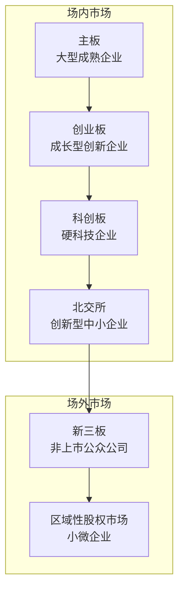

# 证券与投资业务

## 证券市场概述

证券市场是资本市场的重要组成部分，通过发行和交易股票、债券、基金等有价证券，实现资本的优化配置。证券市场为企业提供直接融资渠道，为投资者提供财富增值途径。

## 证券市场结构

中国证券市场形成了多层次市场体系，服务于不同类型和不同发展阶段的企业：

### 各市场定位与要求

| 市场 | 定位 | 上市门槛 | 交易制度 | 投资者门槛 |
|------|------|----------|----------|------------|
| 主板 | 大型蓝筹企业 | 盈利要求高 | T+1，10%涨跌幅 | 无 |
| 创业板 | 成长创新企业 | 盈利/市值/营收 | T+1，20%涨跌幅 | 2年交易经验 |
| 科创板 | 硬科技企业 | 市值/营收/研发投入 | T+1，20%涨跌幅 | 50万+2年经验 |
| 北交所 | 专精特新中小企业 | 市值/营收/盈利 | T+1，30%涨跌幅 | 50万+2年经验 |

## 交易流程

证券交易从开户到交收经历完整的业务链条：

### 开户

投资者开立证券账户和资金账户：

- **证券账户**：记录持有的证券种类和数量（中登公司管理）
- **资金账户**：用于证券交易资金结算（证券公司管理）
- **第三方存管**：资金存放在银行，证券公司不直接接触客户资金

### 委托下单

投资者通过交易终端提交买卖委托：

| 委托类型 | 说明 |
|----------|------|
| 限价委托 | 指定价格买卖 |
| 市价委托 | 以最优价格成交 |
| 条件委托 | 满足条件时触发 |

### 撮合成交

交易所交易系统按照价格优先、时间优先原则进行撮合：

- **集合竞价**：开盘和收盘时段，一次性撮合产生开盘/收盘价
- **连续竞价**：交易时段逐笔撮合成交

### 清算与交收

- **清算**：计算交易各方的应收应付证券和资金
- **交收**：完成证券和资金的实际转移
- **A股交收规则**：T+1，即交易日次日完成交收

## 投资品种

### 股票

股票是公司所有权的凭证，持有者享有相应的权益：

| 分类维度 | 类型 | 说明 |
|----------|------|------|
| 按权利 | 普通股 | 享有投票权和分红权 |
| | 优先股 | 优先分红，无投票权 |
| 按市场 | A股 | 境内发行人民币认购 |
| | B股 | 境内发行外币认购 |
| | H股 | 境内注册香港上市 |
| | 红筹股 | 境外注册香港上市 |

### 债券

债券是债务融资工具，发行人承诺按期支付利息和偿还本金：

| 债券类型 | 发行主体 | 信用风险 | 收益水平 |
|----------|----------|----------|----------|
| 国债 | 财政部 | 最低 | 最低 |
| 政策性金融债 | 政策性银行 | 极低 | 较低 |
| 地方政府债 | 地方政府 | 较低 | 较低 |
| 金融债 | 商业银行 | 较低 | 中等 |
| 企业债 | 央企/国企 | 中等 | 较高 |
| 公司债 | 上市公司 | 较高 | 较高 |
| 可转债 | 上市公司 | 中等 | 中等 |

### 基金

基金是集合投资工具，由专业管理人运作：

- **股票型基金**：80%以上资产投资于股票
- **债券型基金**：80%以上资产投资于债券
- **混合型基金**：股债灵活配置
- **货币市场基金**：投资短期货币工具
- **指数基金**：跟踪特定指数表现
- **ETF**：交易所交易基金，可实时买卖
- **QDII基金**：投资境外市场

### 衍生品

金融衍生品是基于基础资产的金融合约：

| 品种 | 标的 | 交易所 | 功能 |
|------|------|--------|------|
| 股指期货 | 沪深300/中证500/中证1000 | 中金所 | 套期保值、投机 |
| 国债期货 | 2年/5年/10年期国债 | 中金所 | 利率风险管理 |
| ETF期权 | 50ETF/300ETF等 | 上交所/深交所 | 风险对冲、增强收益 |
| 股指期权 | 沪深300/中证1000 | 中金所 | 风险对冲 |
| 商品期货 | 铜、铝、原油、农产品等 | 上期所/大商所/郑商所 | 价格发现、套保 |

## 资产定价模型

### 资本资产定价模型（CAPM）

CAPM描述了资产期望收益与系统性风险之间的关系：

$$E(R_i) = R_f + \beta_i \times (E(R_m) - R_f)$$

其中：
- $E(R_i)$ 是资产i的期望收益率
- $R_f$ 是无风险利率
- $\beta_i$ 是资产i的系统性风险系数
- $E(R_m) - R_f$ 是市场风险溢价

Beta系数的含义：

| Beta值 | 风险特征 | 含义 |
|--------|----------|------|
| Beta = 0 | 无系统性风险 | 收益与市场无关 |
| 0 < Beta < 1 | 低系统性风险 | 波动小于市场 |
| Beta = 1 | 平均系统性风险 | 与市场同步波动 |
| Beta > 1 | 高系统性风险 | 波动大于市场 |

### Black-Scholes期权定价模型

Black-Scholes模型是欧式期权定价的经典模型：

$$C = S_0 N(d_1) - K e^{-rT} N(d_2)$$

$$d_1 = \frac{\ln(S_0/K) + (r + \sigma^2/2)T}{\sigma\sqrt{T}}$$

$$d_2 = d_1 - \sigma\sqrt{T}$$

其中：
- $C$ 是看涨期权价格
- $S_0$ 是标的资产当前价格
- $K$ 是行权价格
- $r$ 是无风险利率
- $T$ 是到期时间
- $\sigma$ 是波动率
- $N(\cdot)$ 是标准正态分布累积函数

模型假设：
- 标的资产价格服从几何布朗运动
- 无风险利率恒定
- 无交易成本和税收
- 允许连续交易和卖空

## 机构投资

### 公募基金

公募基金面向不特定投资者公开发行，受严格监管：

- 投资门槛低（1元起购）
- 信息披露要求严格（季报、半年报、年报）
- 投资范围和比例受合同约束
- 管理费+托管费模式

### 私募基金

私募基金面向合格投资者非公开募集：

| 维度 | 要求 |
|------|------|
| 合格投资者 | 金融资产不低于300万或近3年年均收入不低于50万 |
| 起投金额 | 不低于100万 |
| 投资者人数 | 契约型不超过200人，合伙型不超过50人 |
| 信息披露 | 按合同约定，低于公募要求 |

### 券商资管

证券公司发行的资产管理计划：

- **集合资管**：面向多个投资者
- **定向资管**：面向单一投资者
- **专项资管**：特定目的的资管计划

### 信托

信托以信托方式管理财产，实现风险隔离：

- 委托人将财产委托给受托人
- 受托人按信托合同管理和处分财产
- 受益人享有信托利益
- 信托财产独立于委托人和受托人的固有财产

## 量化交易基础概念

量化交易利用数学模型和计算机程序进行投资决策和交易执行。

### 量化交易分类

| 类型 | 说明 | 持仓周期 | 典型策略 |
|------|------|----------|----------|
| 高频交易 | 极速交易，微秒级 | 毫秒至分钟 | 做市、套利 |
| 统计套利 | 基于统计规律的配对交易 | 分钟至天 | 配对交易、均值回归 |
| CTA策略 | 趋势跟踪和动量策略 | 天至周 | 趋势跟踪、动量反转 |
| 因子投资 | 基于风险因子的选股 | 周至月 | 多因子模型 |
| 事件驱动 | 基于特定事件交易 | 天至月 | 并购套利、财报交易 |

### 量化交易流程

### 关键技术概念

**Alpha与Beta**

- **Alpha**：超额收益，策略超越基准的部分
- **Beta**：市场系统性风险暴露
- **目标**：获取稳定的Alpha，控制Beta暴露

**因子模型**

多因子模型将收益分解为多个风险因子的贡献：

$$r_i = \alpha_i + \beta_{i1}f_1 + \beta_{i2}f_2 + \cdots + \beta_{iK}f_K + \epsilon_i$$

常见因子类别：

| 因子类别 | 典型因子 | 说明 |
|----------|----------|------|
| 价值因子 | PB、PE、股息率 | 低估值股票超额收益 |
| 成长因子 | 营收增速、利润增速 | 高成长股票超额收益 |
| 质量因子 | ROE、资产负债率 | 高质量公司超额收益 |
| 动量因子 | 过去N个月涨幅 | 趋势延续效应 |
| 波动因子 | 历史波动率 | 低波动股票超额收益 |

**回测框架**

回测是验证策略有效性的关键步骤：

- **数据质量**：复权价格、停牌处理、涨跌停限制
- **交易成本**：佣金、滑点、冲击成本
- **前视偏差**：避免使用未来信息
- **过拟合**：参数优化过度导致样本外失效
- **评估指标**：年化收益、夏普比率、最大回撤、Calmar比率

## 证券业务术语表

| 术语 | 英文 | 定义 |
|------|------|------|
| IPO | Initial Public Offering | 首次公开发行 |
| SEO | Seasoned Equity Offering | 增发 |
| PB | Price-to-Book | 市净率 |
| PE | Price-to-Earnings | 市盈率 |
| EPS | Earnings Per Share | 每股收益 |
| ROE | Return on Equity | 净资产收益率 |
| AUM | Assets Under Management | 管理资产规模 |
| NAV | Net Asset Value | 基金净值 |
| Sharpe Ratio | - | 超额收益与波动率之比 |
| Drawdown | - | 从峰值到谷值的最大跌幅 |
| Alpha | - | 超越基准的超额收益 |
| Beta | - | 对市场风险的敏感度 |
| VaR | Value at Risk | 给定置信水平下的最大可能损失 |
| 市值 | Market Cap | 流通股数乘以股价 |
| 换手率 | Turnover Rate | 成交量与流通股本之比 |
| 融资融券 | Margin Trading | 借钱买股票/借股票卖出 |
| 转融通 | - | 证券金融公司的转融通业务 |
| 打新 | IPO Subscription | 申购新股 |
| 龙虎榜 | - | 异常波动股票的买卖席位披露 |
| 涨跌停 | Limit Up/Down | 主板10%/科创板创业板20% |

## 证券业务与AI的结合点

| 业务领域 | AI应用 | 技术方案 |
|----------|--------|----------|
| 投资研究 | 智能研报生成 | NLP+知识图谱+LLM |
| 量化交易 | 因子挖掘与策略优化 | 机器学习+强化学习 |
| 投资者服务 | 智能投顾 | 用户画像+组合优化 |
| 合规风控 | 异常交易监测 | 规则引擎+异常检测 |
| 信用评估 | 债券违约预测 | 评分卡+机器学习 |
| 舆情分析 | 市场情绪监测 | NLP+情感分析 |

## 小结

证券与投资业务是资本市场运作的核心，涵盖证券发行、交易、投资管理和风险定价等完整业务链条。多层次市场体系为不同类型企业提供融资平台，多元化的投资品种满足不同风险偏好需求。量化交易作为AI在证券领域的重要应用方向，正在深刻改变投资决策和交易执行方式。下一章将深入保险业务体系。
