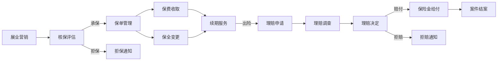
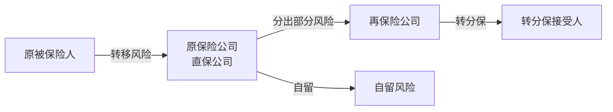

# 保险业务体系

## 保险概述

保险是一种风险转移和分摊机制，通过集合大量同类风险，以合理计算保费的方式，对少数成员遭受的损失进行经济补偿。保险的本质是将个体不确定的风险转化为群体确定的风险成本。

## 保险分类

### 人身险

人身险以人的寿命和身体为保险标的：

| 险种 | 说明 | 保障期间 | 保费特征 |
|------|------|----------|----------|
| 定期寿险 | 约定期限内身故赔付 | 定期(如20年) | 保费较低 |
| 终身寿险 | 终身保障，身故必赔 | 终身 | 保费较高 |
| 生存保险 | 约定期满生存时给付 | 定期 | 储蓄性质 |
| 年金保险 | 按期领取生存金 | 定期或终身 | 长期储蓄 |
| 重大疾病险 | 确诊约定疾病即赔付 | 定期或终身 | 保费较高 |
| 医疗保险 | 报销医疗费用 | 通常1年 | 保费较低 |
| 意外伤害险 | 意外身故/伤残赔付 | 通常1年 | 保费最低 |
| 失能收入险 | 因伤失能时补偿收入 | 定期 | 保费中等 |

### 财产险

财产险以财产及其相关利益为保险标的：

| 险种 | 说明 | 典型场景 |
|------|------|----------|
| 机动车辆险 | 车辆损失和第三者责任 | 强制+商业 |
| 企业财产险 | 企业固定资产损失保障 | 火灾、自然灾害 |
| 家庭财产险 | 家庭财产损失保障 | 火灾、盗窃 |
| 责任保险 | 被保险人对第三方赔偿责任 | 产品责任、雇主责任 |
| 工程保险 | 工程施工风险保障 | 建安工程 |
| 货运保险 | 运输途中货物损失 | 进出口贸易 |
| 农业保险 | 农业生产风险保障 | 自然灾害、疫病 |

### 人身险与财产险对比

| 维度 | 人身险 | 财产险 |
|------|--------|--------|
| 保险标的 | 人的寿命和身体 | 财产及利益 |
| 保险期限 | 长期为主(10-30年) | 短期为主(1年) |
| 保费规模 | 单笔保费较高 | 单笔保费较低 |
| 理赔频率 | 低频高额 | 高频低额 |
| 资金运用 | 长期投资为主 | 短期配置为主 |
| 精算基础 | 生命表 | 损失率表 |

## 保险核心流程

保险业务从展业到理赔经历完整的业务闭环：

### 展业营销

展业是保险销售的起始环节：

- **渠道分类**：个险代理人、银保渠道、互联网渠道、团险渠道
- **客户画像**：风险需求分析、保障缺口评估
- **产品推荐**：基于客户需求的保障方案设计

### 核保

核保是保险公司评估风险、决定是否承保及确定承保条件的过程：

| 核保要素 | 人身险 | 财产险 |
|----------|--------|--------|
| 被保险人 | 年龄、性别、职业、健康 | 财产类型、用途 |
| 风险评估 | 医疗检查、告知问卷 | 实地查勘、历史数据 |
| 承保决定 | 标准体/次标准体/拒保 | 标准承保/条件承保/拒保 |
| 费率厘定 | 生命表+经验费率 | 损失率+附加费率 |

核保结论类型：

- **标准承保**：正常费率承保
- **加费承保**：增加保费承保
- **除外承保**：特定风险除外
- **延期承保**：暂不承保，待条件改善
- **拒保**：不予承保

### 承保与保单管理

承保后进入保单管理阶段：

- **保单生成**：生成正式保险合同
- **犹豫期**：投保人可无条件退保（通常15天）
- **等待期**：保险责任开始前的观察期（医疗险30-90天，重疾险90-180天）
- **保单变更**：受益人变更、保额调整等保全服务

### 理赔

理赔是保险合同义务履行的核心环节：

**理赔流程**

1. 出险通知：投保人/被保险人通知保险公司
2. 立案登记：保险公司登记理赔案件
3. 资料审核：审核理赔申请材料
4. 理赔调查：核实事故真实性和损失程度
5. 理赔决定：赔付或拒赔
6. 保险金给付：将赔款支付给受益人

**理赔调查重点**

- 事故是否在保险期间内发生
- 是否属于保险责任范围
- 是否存在除外责任情形
- 损失程度和金额认定
- 是否存在保险欺诈嫌疑

## 再保险机制

再保险是保险公司的保险，即保险公司将部分风险转移给再保险公司：

### 再保险分类

| 类型 | 说明 | 适用场景 |
|------|------|----------|
| 比例再保险 | 按比例分摊保费和赔款 | 大额风险分散 |
| 非比例再保险 | 超额赔款再保险 | 巨灾风险保障 |
| 临时再保险 | 逐笔协商分保 | 特殊风险 |
| 合约再保险 | 预先约定分保条件 | 常规业务 |
| 预约再保险 | 分保人选择分出，接受人必须接受 | 介于临时和合约之间 |

### 再保险的作用

- **风险分散**：将大额风险分散到全球市场
- **资本释放**：减少资本占用，提高承保能力
- **巨灾保障**：为自然灾害等极端风险提供保障
- **专业技术**：借助再保公司的全球经验和数据

## 保险资金运用

保险公司收取的保费在赔付前形成保险资金，需要进行投资管理以实现保值增值：

### 投资原则

- **安全性**：首要原则，保障偿付能力
- **收益性**：实现资金增值，弥补承保亏损
- **流动性**：满足随时可能发生的赔付需求

### 投资范围

| 资产类别 | 投资比例上限 | 特点 |
|----------|-------------|------|
| 银行存款 | 无限制 | 流动性最高，收益最低 |
| 国债 | 无限制 | 安全性最高 |
| 金融债 | 无限制 | 信用风险较低 |
| 企业债 | 不超过总资产30% | 收益较高 |
| 股票 | 不超过总资产30% | 收益高、波动大 |
| 不动产 | 不超过总资产30% | 长期配置 |
| 长期股权投资 | 不超过总资产30% | 战略投资 |

### 资产负债管理(ALM)

保险资金运用需要匹配负债特征：

- **期限匹配**：长期负债对应长期资产
- **利率敏感度匹配**：资产和负债对利率变化的敏感度一致
- **币种匹配**：减少汇率风险
- **流动性匹配**：保证支付能力

## 保险科技(InsurTech)应用场景

### 产品创新

| 创新方向 | 说明 | 典型案例 |
|----------|------|----------|
| 场景化保险 | 嵌入消费场景的碎片化保障 | 退货运费险、航延险 |
| 互动保险 | 根据行为数据动态定价 | 车联网UBI车险 |
| 参数保险 | 触发条件达成自动理赔 | 农业天气指数保险 |
| 按需保险 | 随时开启/关闭保障 | 共享经济保险 |

### 核保理赔智能化

- **智能核保**：利用AI自动评估风险，替代人工核保
- **OCR识别**：自动识别和提取医疗单据、证件信息
- **智能定损**：计算机视觉识别车辆损伤，自动估算维修费用
- **反欺诈检测**：利用图分析和异常检测识别骗保行为

### 精算与定价

- **动态定价**：基于实时数据的个性化费率
- **大数据精算**：利用多源数据提升精算模型准确性
- **风险预测**：机器学习预测理赔概率和金额

### 客户运营

- **智能客服**：NLP驱动的保险咨询和理赔引导
- **精准营销**：基于用户画像的产品推荐
- **健康管理**：可穿戴设备+健康激励

## 保险业务术语表

| 术语 | 英文 | 定义 |
|------|------|------|
| 保费 | Premium | 投保人支付的费用 |
| 保额 | Sum Insured | 保险公司最高赔付金额 |
| 免赔额 | Deductible | 保险公司不赔的部分 |
| 等待期 | Waiting Period | 保险责任生效前的观察期 |
| 犹豫期 | Cooling-off Period | 可无条件退保的期限 |
| 宽限期 | Grace Period | 逾期未交保费的宽限时间 |
| 现金价值 | Cash Value | 退保时可取回的金额 |
| 责任准备金 | Reserve | 为未来赔付提取的准备金 |
| 偿付能力 | Solvency | 履行赔付义务的能力 |
| 综合成本率 | Combined Ratio | 赔付率+费用率 |
| 赔付率 | Loss Ratio | 赔款与保费之比 |
| 费用率 | Expense Ratio | 运营费用与保费之比 |
| 再保险 | Reinsurance | 保险公司的保险 |
| 分保 | Cession | 将风险转移给再保险公司 |
| 自留额 | Retention | 保险公司自行承担的风险 |
| 代位求偿 | Subrogation | 赔付后代位向责任方追偿 |
| 共同保险 | Coinsurance | 多家保险公司共担风险 |
| 重复保险 | Double Insurance | 同一标的投保多份保险 |
| 最大诚信 | Utmost Good Faith | 保险的基本原则 |
| 保险利益 | Insurable Interest | 投保人对标的的合法利益 |
| 近因原则 | Proximate Cause | 最直接有效的原因决定赔付 |
| 损失补偿 | Indemnity | 以实际损失为限进行补偿 |

## 保险业务与AI的结合点

| 业务领域 | AI应用 | 技术方案 |
|----------|--------|----------|
| 核保 | 智能核保决策 | 规则引擎+机器学习 |
| 定价 | 个性化动态定价 | 大数据+精算模型 |
| 理赔 | 智能定损与自动理赔 | CV+OCR+NLP |
| 反欺诈 | 骗保识别与团伙检测 | 图分析+异常检测 |
| 精算 | 风险预测与准备金优化 | 机器学习+时间序列 |
| 客服 | 智能理赔引导 | NLP+知识图谱+LLM |
| 投资 | 资产配置优化 | 强化学习+组合优化 |

## 小结

保险业务体系以风险管理为核心，从展业营销到理赔服务形成完整闭环。人身险和财产险各有不同的精算基础和业务特征，再保险机制为行业提供风险分散通道。保险科技正在深刻改变保险产品形态、核保理赔效率和客户体验。下一章将深入金融监管与合规框架。
