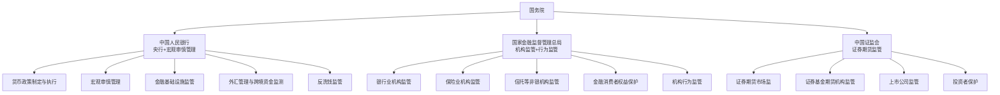
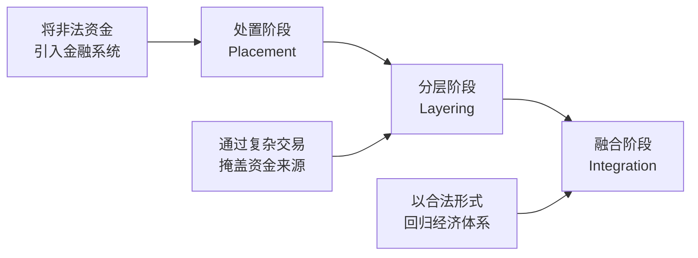
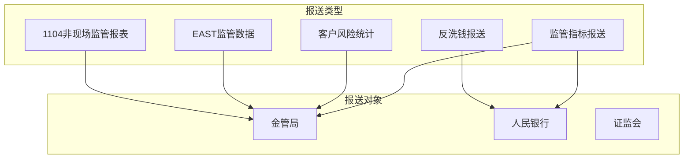

# 金融监管与合规框架

## 监管体系概述

金融监管是维护金融体系稳健运行、保护消费者权益、防范系统性风险的重要制度安排。中国在2023年机构改革后形成了"一行一局一会"的监管架构，实现了中央与地方、机构监管与功能监管的有机结合。

## 中国监管体系

### 监管机构职责

### 各监管机构管辖范围

| 机构 | 监管对象 | 核心法规 | 处罚手段 |
|------|----------|----------|----------|
| 人行 | 银行间市场、支付机构、征信机构 | 中国人民银行法 | 罚款、业务限制 |
| 金管局 | 银行、保险、信托、资管 | 银行业监督管理法、保险法 | 罚款、停业整顿、撤销牌照 |
| 证监会 | 证券公司、基金公司、期货公司 | 证券法、基金法 | 罚款、市场禁入、吊销牌照 |

## 核心法规体系

### 银行业核心法规

| 法规 | 核心内容 | 监管重点 |
|------|----------|----------|
| 商业银行法 | 银行设立、经营、监管基本规则 | 业务范围、资本充足 |
| 银行业监督管理法 | 银行业监管的法律依据 | 风险管理、内控合规 |
| 存款保险条例 | 存款保险制度 | 50万以内全额保障 |
| 商业银行资本管理办法 | 资本充足率要求 | 巴塞尔协议本土化 |

### 证券业核心法规

| 法规 | 核心内容 | 监管重点 |
|------|----------|----------|
| 证券法 | 证券发行与交易基本规则 | 信息披露、内幕交易 |
| 基金法 | 证券投资基金管理 | 投资者保护、份额持有人权益 |
| 期货和衍生品法 | 期货市场与衍生品交易 | 市场操纵、风险控制 |

### 跨领域法规

| 法规 | 核心内容 | 影响范围 |
|------|----------|----------|
| 反洗钱法 | 反洗钱义务与监管 | 全金融机构 |
| 个人信息保护法 | 个人数据处理规范 | 全金融机构 |
| 数据安全法 | 数据分类分级保护 | 全金融机构 |
| 网络安全法 | 网络安全等级保护 | 全金融机构 |
| 金融稳定法 | 金融风险防范化解 | 系统重要性机构 |

## 巴塞尔协议

巴塞尔协议是国际银行监管的核心框架，中国已将巴塞尔协议III的要求本土化实施。

### 巴塞尔协议演进

| 协议 | 时间 | 核心要求 | 监管支柱 |
|------|------|----------|----------|
| 巴塞尔I | 1988 | 资本充足率不低于8% | 最低资本要求 |
| 巴塞尔II | 2004 | 三大支柱框架 | 资本要求+监督检查+市场纪律 |
| 巴塞尔III | 2010 | 提高资本质量和覆盖范围 | 加强三大支柱+宏观审慎 |

### 巴塞尔协议III核心要求

**资本充足率**

| 指标 | 最低要求 | 目标水平 |
|------|----------|----------|
| 核心一级资本充足率 | 5% | 7.5% |
| 一级资本充足率 | 6% | 8.5% |
| 资本充足率 | 8% | 10.5% |

**流动性监管指标**

| 指标 | 要求 | 含义 |
|------|------|------|
| 流动性覆盖率(LCR) | 不低于100% | 30天短期流动性 |
| 净稳定资金比率(NSFR) | 不低于100% | 长期资金结构稳定性 |

**杠杆率**

- 杠杆率 = 一级资本 / 表内外总资产
- 最低要求不低于3%
- 不考虑风险权重，补充资本充足率的不足

### 中国资本管理办法

中国于2023年发布新版《商业银行资本管理办法》，于2024年实施：

- 对接巴塞尔协议III最终版
- 按资产规模分三档实施差异化监管
- 信用风险权重法细化
- 市场风险和操作风险计量方法优化

## 反洗钱AML框架

反洗钱是金融机构的法定义务，也是金融监管的重点领域。

### 反洗钱三阶段

洗钱活动通常经历三个阶段：

### 客户识别(KYC)

KYC是反洗钱的第一道防线，金融机构必须对客户进行充分的身份识别和风险评估：

| KYC环节 | 要求 | 实施 |
|---------|------|------|
| 客户身份识别 | 核实身份信息真实性 | 证件查验、联网核查 |
| 受益所有人识别 | 识别最终受益人 | 股权穿透、实际控制人 |
| 客户风险等级划分 | 按风险等级差异化管控 | 高/中/低风险分类 |
| 持续监控 | 持续更新客户信息 | 定期回顾、触发更新 |

### 大额交易与可疑交易报告

**大额交易报告标准**

| 交易类型 | 报告阈值 |
|----------|----------|
| 现金收支 | 单笔或累计5万元以上 |
| 非自然人转账 | 单笔或累计200万元以上 |
| 自然人转账 | 单笔或累计50万元以上 |
| 跨境转账 | 等值20万元以上 |

**可疑交易识别**

可疑交易的典型特征：

- 与客户身份和经营规模不符的交易
- 短期内频繁大额资金进出
- 结构性拆分交易（将大额交易拆分为小额）
- 资金快进快出，无明显商业目的
- 涉及高风险国家或地区的交易
- 无合理原因的频繁变更账户信息

## 金融数据合规

### 数据分级分类

金融机构需对数据进行分级分类管理：

| 数据等级 | 定义 | 保护要求 | 典型数据 |
|----------|------|----------|----------|
| 核心数据 | 关系国家安全的数据 | 最高等级保护 | 宏观金融数据、系统性风险数据 |
| 重要数据 | 一旦泄露危害重大 | 严格保护 | 大量个人金融信息、敏感经营数据 |
| 一般数据 | 泄露危害有限 | 基本保护 | 公开产品信息、一般业务数据 |

### 个人金融信息保护

| 信息类别 | 示例 | 处理要求 |
|----------|------|----------|
| 账户信息 | 账号、余额、交易记录 | 最小必要原则 |
| 身份信息 | 姓名、证件号、人脸 | 单独同意+加密存储 |
| 财产信息 | 收入、资产、负债 | 敏感个人信息保护 |
| 信用信息 | 征信记录、评分 | 限定用途使用 |
| 金融交易信息 | 交易时间、金额、对手 | 目的限制原则 |

### 跨境数据传输

金融数据跨境传输需满足以下要求：

- 数据出境安全评估
- 向境外提供个人信息需通过安全评估或签订标准合同
- 关键信息基础设施运营者的数据原则上境内存储
- 跨境金融业务中的数据流转合规

### 隐私计算技术

隐私计算为金融数据合规提供了技术手段：

| 技术 | 原理 | 适用场景 | 性能 |
|------|------|----------|------|
| 联邦学习 | 数据不出域，交换模型参数 | 跨机构联合建模 | 中等 |
| 多方安全计算(MPC) | 加密计算，各方无法获知他人输入 | 联合统计、安全查询 | 较低 |
| 差分隐私 | 加入噪声保护个体隐私 | 数据发布、统计分析 | 高 |
| 可信执行环境(TEE) | 硬件隔离的安全计算环境 | 数据安全处理 | 高 |
| 同态加密 | 密文上直接计算 | 云端安全计算 | 最低 |

## 合规检查清单

金融机构需定期开展合规自查，以下为核心检查项：

### 反洗钱合规

- [ ] 客户身份识别制度是否健全并有效执行
- [ ] 客户风险等级划分是否合理并动态调整
- [ ] 大额和可疑交易报告是否及时准确报送
- [ ] 反洗钱内控制度是否完善
- [ ] 反洗钱培训是否按期开展
- [ ] 客户身份资料和交易记录是否按规定保存

### 数据合规

- [ ] 数据分级分类制度是否建立并执行
- [ ] 个人信息收集是否取得合法授权
- [ ] 数据存储和传输是否采取加密措施
- [ ] 数据访问权限是否按最小必要原则设置
- [ ] 数据出境是否通过安全评估
- [ ] 数据泄露应急预案是否制定并演练

### 业务合规

- [ ] 业务经营是否在许可范围内
- [ ] 产品销售是否履行适当性义务
- [ ] 信息披露是否真实准确完整
- [ ] 关联交易是否合规审批和披露
- [ ] 投资者/消费者投诉处理机制是否健全

## 监管报送体系

金融机构需按监管要求定期报送各类报表和报告：

### 主要报送内容

| 报送名称 | 报送频率 | 报送机构 | 主要内容 |
|----------|----------|----------|----------|
| 1104报表 | 月/季/半年/年 | 金管局 | 资本充足、资产质量、流动性等 |
| EAST数据 | 按需/月 | 金管局 | 交易明细、客户信息、信贷数据 |
| 反洗钱报送 | 即时/月 | 人行 | 大额交易、可疑交易报告 |
| 征信数据 | 日/月 | 人行征信中心 | 信贷信息、还款记录 |
| 统计数据 | 月/季 | 人行 | 金融统计数据 |

### 监管报送的挑战

- **数据质量**：多系统数据不一致，需大量数据治理工作
- **报送时效**：部分报表报送时限紧，需自动化处理
- **口径一致**：不同监管报表口径存在差异，需统一数据标准
- **变更频繁**：监管报表格式和内容经常调整

## 合规科技(RegTech)趋势

合规科技利用技术手段降低合规成本、提升合规效率：

| 技术方向 | 应用 | 效果 |
|----------|------|------|
| 自动化报送 | 监管报表自动生成与校验 | 减少人工错误，提升时效 |
| 智能KYC | OCR+活体检测+黑名单 | 加速客户准入 |
| NLP合规审查 | 合同条款自动审查 | 降低人工审查工作量 |
| 异常交易监测 | 机器学习+规则引擎 | 提升可疑交易识别率 |
| 隐私计算 | 联邦学习+MPC | 合规前提下实现数据价值 |

## 小结

金融监管与合规是金融业务运行的制度边界，也是金融机构必须遵守的刚性约束。理解监管框架、核心法规和合规要求，是构建金融AI系统的前提条件。巴塞尔协议提供了银行监管的国际标准，反洗钱框架要求金融机构履行KYC和交易监测义务，数据合规则对金融数据的采集、存储、使用和传输提出了严格要求。合规科技为金融机构提供了提升合规效率的技术路径。
