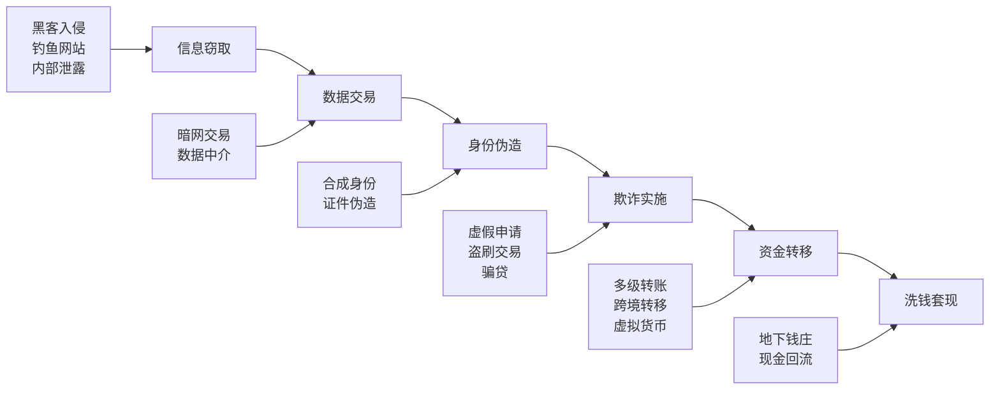

# 反欺诈检测算法

## 欺诈类型

金融欺诈是蓄意通过虚假手段获取经济利益的行为，类型多样且不断演变。了解欺诈类型是构建有效检测系统的基础。

### 主要欺诈类型

| 欺诈类型 | 说明 | 典型手法 | 危害程度 |
|----------|------|----------|----------|
| 身份冒用 | 盗取他人身份信息申请金融产品 | 冒用身份证开户、伪冒贷款 | 高 |
| 卡盗刷 | 窃取银行卡信息进行非法交易 | 侧录磁条、钓鱼网站、CVV泄露 | 高 |
| 钓鱼攻击 | 诱导用户泄露敏感信息 | 伪冒银行短信、虚假APP | 中 |
| 合成身份 | 拼接真实与虚构信息创建新身份 | 真实SSN+虚构姓名+虚构地址 | 极高 |
| 内部欺诈 | 金融机构内部人员参与的欺诈 | 越权操作、虚假交易、数据泄露 | 极高 |
| 首贷欺诈 | 以骗贷为目的的贷款申请 | 虚假资料包装、中介代办 | 高 |
| 账户接管 | 获取账户控制权后转移资金 | 社工攻击、撞库、SIM卡劫持 | 高 |

### 欺诈产业链



## 规则引擎

规则引擎是反欺诈系统的第一道防线，通过预定义的规则快速识别已知欺诈模式。

### 阈值规则

基于单一条件判断的简单规则：

```python
from dataclasses import dataclass, field
from typing import Any
from datetime import datetime, timedelta


@dataclass
class ThresholdRule:
    """阈值规则"""
    name: str
    field: str
    operator: str  # gt, lt, eq, gte, lte
    threshold: Any
    risk_level: str  # high, medium, low
    description: str = ""

    def evaluate(self, data: dict) -> bool:
        """评估规则"""
        value = data.get(self.field)
        if value is None:
            return False
        ops = {
            'gt': lambda v, t: v > t,
            'lt': lambda v, t: v < t,
            'eq': lambda v, t: v == t,
            'gte': lambda v, t: v >= t,
            'lte': lambda v, t: v <= t,
        }
        return ops[self.operator](value, self.threshold)


# 示例阈值规则
threshold_rules = [
    ThresholdRule("大额交易", "amount", "gt", 50000, "high", "单笔交易超过5万"),
    ThresholdRule("深夜交易", "hour", "lt", 6, "medium", "凌晨0-6点交易"),
    ThresholdRule("高频交易", "tx_count_1h", "gt", 10, "high", "1小时内超过10笔交易"),
    ThresholdRule("异地交易", "distance_km", "gt", 500, "high", "与上次交易距离超过500km"),
]
```

### 组合规则

多个条件组合判断的复杂规则：

```python
@dataclass
class CompositeRule:
    """组合规则"""
    name: str
    conditions: list  # list of ThresholdRule
    logic: str  # AND, OR
    risk_level: str
    description: str = ""

    def evaluate(self, data: dict) -> bool:
        """评估组合规则"""
        results = [rule.evaluate(data) for rule in self.conditions]
        if self.logic == "AND":
            return all(results)
        elif self.logic == "OR":
            return any(results)
        return False


# 示例组合规则：大额+异地 = 高风险
composite_rules = [
    CompositeRule(
        name="大额异地交易",
        conditions=[
            ThresholdRule("大额", "amount", "gt", 10000, "high"),
            ThresholdRule("异地", "distance_km", "gt", 300, "high"),
        ],
        logic="AND",
        risk_level="high",
        description="大额且异地交易",
    ),
    CompositeRule(
        name="异常时间高频",
        conditions=[
            ThresholdRule("深夜", "hour", "lt", 6, "medium"),
            ThresholdRule("高频", "tx_count_1h", "gt", 5, "medium"),
        ],
        logic="AND",
        risk_level="high",
        description="深夜时段高频交易",
    ),
]
```

### 时序规则

基于时间序列模式的规则，检测行为异常：

```python
class TemporalRuleEngine:
    """时序规则引擎"""

    def __init__(self):
        self.rules = []

    def add_rule(self, name, check_fn, risk_level, description=""):
        self.rules.append({
            'name': name,
            'check': check_fn,
            'risk_level': risk_level,
            'description': description,
        })

    def evaluate(self, transaction_history: list, current_tx: dict) -> list:
        """评估时序规则"""
        alerts = []
        for rule in self.rules:
            if rule['check'](transaction_history, current_tx):
                alerts.append({
                    'rule_name': rule['name'],
                    'risk_level': rule['risk_level'],
                    'description': rule['description'],
                })
        return alerts


# 定义时序规则检查函数
def check_velocity_1h(history, current_tx):
    """1小时内交易频率异常"""
    cutoff = datetime.fromisoformat(current_tx['timestamp']) - timedelta(hours=1)
    recent = [
        tx for tx in history
        if datetime.fromisoformat(tx['timestamp']) > cutoff
    ]
    return len(recent) > 10


def check_escalating_amounts(history, current_tx):
    """金额逐步递增模式"""
    if len(history) < 3:
        return False
    recent = history[-3:]
    amounts = [tx['amount'] for tx in recent]
    return all(amounts[i] < amounts[i + 1] for i in range(len(amounts) - 1))


def check_location_impossible(history, current_tx):
    """地理位置不可能（速度检测）"""
    if not history:
        return False
    last_tx = history[-1]
    distance = current_tx.get('distance_km', 0)
    time_diff = (
        datetime.fromisoformat(current_tx['timestamp'])
        - datetime.fromisoformat(last_tx['timestamp'])
    ).total_seconds() / 3600
    if time_diff <= 0:
        return False
    speed_km_h = distance / time_diff
    return speed_km_h > 1000  # 超过1000km/h不可能


# 构建时序规则引擎
temporal_engine = TemporalRuleEngine()
temporal_engine.add_rule("高频交易", check_velocity_1h, "high", "1小时内交易超过10笔")
temporal_engine.add_rule("金额递增", check_escalating_amounts, "medium", "近期交易金额逐步递增")
temporal_engine.add_rule("位置不可能", check_location_impossible, "high", "地理位置变化速度异常")
```

## 机器学习方法

### 孤立森林

孤立森林是无监督异常检测的经典算法，特别适合欺诈检测中正负样本极不平衡的场景：

```python
from sklearn.ensemble import IsolationForest
from sklearn.preprocessing import StandardScaler
import numpy as np
import pandas as pd


class IsolationForestDetector:
    """孤立森林欺诈检测器"""

    def __init__(self, contamination=0.01, n_estimators=100, random_state=42):
        self.contamination = contamination
        self.n_estimators = n_estimators
        self.random_state = random_state
        self.model = None
        self.scaler = StandardScaler()
        self.feature_names = None

    def fit(self, X: pd.DataFrame):
        """训练孤立森林模型"""
        self.feature_names = X.columns.tolist()
        X_scaled = self.scaler.fit_transform(X)

        self.model = IsolationForest(
            contamination=self.contamination,
            n_estimators=self.n_estimators,
            max_samples='auto',
            random_state=self.random_state,
            n_jobs=-1,
        )
        self.model.fit(X_scaled)
        return self

    def predict(self, X: pd.DataFrame) -> pd.DataFrame:
        """预测欺诈概率"""
        X_scaled = self.scaler.transform(X)

        # -1为异常，1为正常
        labels = self.model.predict(X_scaled)
        # 异常分数（越负越异常）
        scores = self.model.score_samples(X_scaled)

        result = pd.DataFrame({
            'is_anomaly': labels == -1,
            'anomaly_score': -scores,  # 取反使分数越高越异常
            'fraud_probability': self._score_to_probability(-scores),
        })
        return result

    def _score_to_probability(self, scores):
        """将异常分数转换为概率"""
        from scipy import stats
        # 使用正态分布CDF转换
        return stats.norm.cdf(scores)
```

### One-Class SVM

One-Class SVM通过学习正常数据的边界来检测异常：

```python
from sklearn.svm import OneClassSVM


class OneClassSVMDetector:
    """One-Class SVM欺诈检测器"""

    def __init__(self, nu=0.01, kernel='rbf', gamma='scale'):
        self.nu = nu
        self.kernel = kernel
        self.gamma = gamma
        self.model = None
        self.scaler = StandardScaler()

    def fit(self, X: pd.DataFrame):
        """训练模型"""
        X_scaled = self.scaler.fit_transform(X)
        self.model = OneClassSVM(
            nu=self.nu,
            kernel=self.kernel,
            gamma=self.gamma,
        )
        self.model.fit(X_scaled)
        return self

    def predict(self, X: pd.DataFrame) -> pd.DataFrame:
        """预测"""
        X_scaled = self.scaler.transform(X)
        labels = self.model.predict(X_scaled)
        scores = self.model.score_samples(X_scaled)

        result = pd.DataFrame({
            'is_anomaly': labels == -1,
            'anomaly_score': -scores,
        })
        return result
```

### XGBoost有监督检测

当有标注的欺诈样本时，可以使用有监督方法：

```python
import xgboost as xgb
from sklearn.model_selection import train_test_split
from sklearn.metrics import classification_report, average_precision_score


class XGBoostFraudDetector:
    """XGBoost欺诈检测器"""

    def __init__(self, scale_pos_weight=None):
        self.scale_pos_weight = scale_pos_weight
        self.model = None
        self.feature_names = None

    def fit(self, X: pd.DataFrame, y: pd.Series):
        """训练XGBoost模型"""
        self.feature_names = X.columns.tolist()

        X_train, X_val, y_train, y_val = train_test_split(
            X, y, test_size=0.2, random_state=42, stratify=y
        )

        if self.scale_pos_weight is None:
            self.scale_pos_weight = (y_train == 0).sum() / max((y_train == 1).sum(), 1)

        dtrain = xgb.DMatrix(X_train, label=y_train)
        dval = xgb.DMatrix(X_val, label=y_val)

        params = {
            'objective': 'binary:logistic',
            'eval_metric': 'aucpr',
            'max_depth': 6,
            'learning_rate': 0.05,
            'subsample': 0.8,
            'colsample_bytree': 0.8,
            'scale_pos_weight': self.scale_pos_weight,
            'min_child_weight': 5,
            'random_state': 42,
        }

        self.model = xgb.train(
            params,
            dtrain,
            num_boost_round=500,
            evals=[(dtrain, 'train'), (dval, 'val')],
            early_stopping_rounds=50,
            verbose_eval=False,
        )

        # 验证集评估
        y_val_pred = self.model.predict(dval)
        y_val_binary = (y_val_pred > 0.5).astype(int)
        print("验证集评估结果:")
        print(classification_report(y_val, y_val_binary, target_names=['正常', '欺诈']))
        print(f"PR-AUC: {average_precision_score(y_val, y_val_pred):.4f}")

        return self

    def predict(self, X: pd.DataFrame) -> pd.DataFrame:
        """预测欺诈概率"""
        dtest = xgb.DMatrix(X)
        proba = self.model.predict(dtest)
        return pd.DataFrame({
            'fraud_probability': proba,
            'is_fraud': proba > 0.5,
        })
```

## 图神经网络(GNN)欺诈检测

图神经网络能够挖掘交易网络中的关联关系，有效识别团伙欺诈和复杂欺诈模式。

### 节点分类

将账户/交易作为节点，交易关系作为边，预测节点的欺诈概率：

```python
import torch
import torch.nn.functional as F
from torch_geometric.nn import GATConv, GCNConv
from torch_geometric.data import Data


class GNNFraudDetector(torch.nn.Module):
    """基于GAT的欺诈检测模型"""

    def __init__(self, num_features, hidden_dim=64, num_heads=4, dropout=0.3):
        super().__init__()
        self.conv1 = GATConv(
            num_features, hidden_dim // num_heads,
            heads=num_heads, dropout=dropout
        )
        self.conv2 = GATConv(
            hidden_dim, hidden_dim // num_heads,
            heads=num_heads, dropout=dropout
        )
        self.classifier = torch.nn.Sequential(
            torch.nn.Linear(hidden_dim, 32),
            torch.nn.ReLU(),
            torch.nn.Dropout(dropout),
            torch.nn.Linear(32, 2),
        )

    def forward(self, data):
        x, edge_index = data.x, data.edge_index

        x = F.elu(self.conv1(x, edge_index))
        x = F.dropout(x, p=0.3, training=self.training)
        x = F.elu(self.conv2(x, edge_index))
        x = F.dropout(x, p=0.3, training=self.training)

        return self.classifier(x)


def build_transaction_graph(transactions_df, account_features_df):
    """从交易数据构建图结构"""
    # 节点：账户
    # 边：交易关系
    # 节点特征：账户属性+交易统计特征

    account_ids = sorted(set(
        transactions_df['sender_id'].tolist()
        + transactions_df['receiver_id'].tolist()
    ))
    id_map = {aid: idx for idx, aid in enumerate(account_ids)}
    num_nodes = len(account_ids)

    # 构建边
    edge_index = []
    for _, row in transactions_df.iterrows():
        src = id_map[row['sender_id']]
        dst = id_map[row['receiver_id']]
        edge_index.append([src, dst])
        edge_index.append([dst, src])  # 无向边

    edge_index = torch.tensor(edge_index, dtype=torch.long).t().contiguous()

    # 节点特征
    features = account_features_df.loc[account_ids].values
    x = torch.tensor(features, dtype=torch.float)

    return Data(x=x, edge_index=edge_index, num_nodes=num_nodes)
```

### 团伙检测

利用社区发现算法识别欺诈团伙：

```python
import networkx as nx
from collections import defaultdict


class FraudRingDetector:
    """欺诈团伙检测器"""

    def __init__(self, min_community_size=3, min_density=0.5):
        self.min_community_size = min_community_size
        self.min_density = min_density

    def detect(self, transactions_df):
        """检测欺诈团伙"""
        # 构建网络图
        G = nx.DiGraph()
        for _, row in transactions_df.iterrows():
            G.add_edge(
                row['sender_id'], row['receiver_id'],
                weight=row.get('amount', 1),
                timestamp=row.get('timestamp', ''),
            )

        # 使用Louvain算法进行社区发现
        undirected_G = G.to_undirected()
        communities = nx.community.louvain_communities(undirected_G)

        # 筛选可疑社区
        suspicious_rings = []
        for community in communities:
            if len(community) < self.min_community_size:
                continue

            subgraph = undirected_G.subgraph(community)
            density = nx.density(subgraph)

            if density >= self.min_density:
                # 计算社区的风险指标
                risk_indicators = self._analyze_community(subgraph, transactions_df)
                suspicious_rings.append({
                    'members': list(community),
                    'size': len(community),
                    'density': density,
                    'risk_indicators': risk_indicators,
                })

        return sorted(suspicious_rings, key=lambda x: x['density'], reverse=True)

    def _analyze_community(self, subgraph, transactions_df):
        """分析社区风险指标"""
        members = set(subgraph.nodes())
        member_tx = transactions_df[
            transactions_df['sender_id'].isin(members)
            | transactions_df['receiver_id'].isin(members)
        ]

        indicators = {
            'internal_tx_count': len(member_tx[
                member_tx['sender_id'].isin(members) & member_tx['receiver_id'].isin(members)
            ]),
            'total_amount': member_tx['amount'].sum(),
            'avg_amount': member_tx['amount'].mean(),
            'circular_flow': self._detect_circular_flow(subgraph),
        }
        return indicators

    def _detect_circular_flow(self, subgraph):
        """检测环路资金流"""
        cycles = []
        try:
            for cycle in nx.simple_cycles(subgraph):
                if len(cycle) >= 3:
                    cycles.append(cycle)
        except nx.NetworkXError:
            pass
        return cycles
```

## 实时特征计算

实时反欺诈需要在毫秒级完成特征计算和决策：

### 滑窗统计

```python
from collections import deque
from datetime import datetime, timedelta
import threading


class SlidingWindowFeatureCalculator:
    """滑动窗口特征计算器"""

    def __init__(self, window_sizes=None):
        self.window_sizes = window_sizes or [300, 3600, 86400]  # 5min, 1h, 24h
        self.windows = {}  # user_id -> {window_size -> deque}
        self.lock = threading.Lock()

    def _ensure_window(self, user_id, window_size):
        """确保窗口存在"""
        if user_id not in self.windows:
            self.windows[user_id] = {}
        if window_size not in self.windows[user_id]:
            self.windows[user_id][window_size] = deque()
        return self.windows[user_id][window_size]

    def update(self, user_id, amount, timestamp):
        """更新交易记录"""
        ts = datetime.fromisoformat(timestamp) if isinstance(timestamp, str) else timestamp
        ts_epoch = ts.timestamp()

        with self.lock:
            for size in self.window_sizes:
                window = self._ensure_window(user_id, size)
                window.append({'amount': amount, 'timestamp': ts_epoch})

                # 清理过期记录
                cutoff = ts_epoch - size
                while window and window[0]['timestamp'] < cutoff:
                    window.popleft()

    def get_features(self, user_id):
        """计算实时特征"""
        features = {}
        with self.lock:
            user_windows = self.windows.get(user_id, {})
            for size in self.window_sizes:
                window = user_windows.get(size, deque())
                amounts = [r['amount'] for r in window]

                size_name = f"{size}s"
                features[f'tx_count_{size_name}'] = len(amounts)
                features[f'tx_sum_{size_name}'] = sum(amounts)
                features[f'tx_mean_{size_name}'] = (
                    sum(amounts) / len(amounts) if amounts else 0
                )
                features[f'tx_max_{size_name}'] = max(amounts) if amounts else 0
                features[f'tx_std_{size_name}'] = (
                    (sum(x**2 for x in amounts) / len(amounts)
                     - (sum(amounts) / len(amounts))**2)**0.5
                    if len(amounts) > 1 else 0
                )

        return features
```

### 时序特征

```python
class TemporalFeatureExtractor:
    """时序特征提取器"""

    @staticmethod
    def extract_time_features(timestamp):
        """提取时间特征"""
        ts = datetime.fromisoformat(timestamp) if isinstance(timestamp, str) else timestamp
        return {
            'hour': ts.hour,
            'day_of_week': ts.weekday(),
            'is_weekend': int(ts.weekday() >= 5),
            'is_night': int(ts.hour < 6 or ts.hour > 22),
            'is_business_hour': int(9 <= ts.hour <= 17),
        }

    @staticmethod
    def extract_interval_features(transaction_history):
        """提取时间间隔特征"""
        if len(transaction_history) < 2:
            return {'interval_mean': 0, 'interval_std': 0, 'interval_min': 0}

        timestamps = [
            datetime.fromisoformat(tx['timestamp']).timestamp()
            for tx in transaction_history
        ]
        intervals = [
            timestamps[i] - timestamps[i - 1]
            for i in range(1, len(timestamps))
        ]

        return {
            'interval_mean': sum(intervals) / len(intervals),
            'interval_std': (
                (sum(x**2 for x in intervals) / len(intervals)
                 - (sum(intervals) / len(intervals))**2)**0.5
            ),
            'interval_min': min(intervals),
        }

    @staticmethod
    def extract_behavior_sequence_features(transaction_history, window=10):
        """提取行为序列特征"""
        recent = transaction_history[-window:]
        if not recent:
            return {}

        amounts = [tx['amount'] for tx in recent]
        types = [tx.get('type', 'unknown') for tx in recent]

        return {
            'amount_trend': (
                1 if amounts[-1] > amounts[0] else -1 if amounts[-1] < amounts[0] else 0
            ),
            'amount_change_rate': (
                (amounts[-1] - amounts[0]) / amounts[0] if amounts[0] != 0 else 0
            ),
            'unique_type_count': len(set(types)),
            'dominant_type': max(set(types), key=types.count),
        }
```

## 欺诈检测算法对比表

| 算法 | 类型 | 优势 | 劣势 | 适用场景 |
|------|------|------|------|----------|
| 规则引擎 | 确定性 | 可解释性强、实时性好 | 覆盖面有限、维护成本高 | 已知欺诈模式 |
| 孤立森林 | 无监督 | 无需标注数据、检测新类型 | 误报率较高 | 新型欺诈发现 |
| One-Class SVM | 无监督 | 理论基础扎实 | 计算复杂度高、参数敏感 | 小样本场景 |
| XGBoost | 有监督 | 精度高、特征重要性 | 需要标注数据 | 历史欺诈识别 |
| GNN | 半监督 | 关联分析、团伙检测 | 构图复杂、训练慢 | 团伙欺诈 |
| LLM | 零样本 | 灵活、可推理 | 延迟高、成本高 | 复杂场景审查 |

## 完整代码：孤立森林+规则引擎混合检测

```python
import numpy as np
import pandas as pd
from sklearn.ensemble import IsolationForest
from sklearn.preprocessing import StandardScaler
from dataclasses import dataclass
from typing import Optional
from datetime import datetime


@dataclass
class FraudAlert:
    """欺诈告警"""
    transaction_id: str
    risk_score: float
    risk_level: str
    triggered_rules: list
    ml_score: float
    explanation: str
    timestamp: str


class HybridFraudDetector:
    """混合欺诈检测器：规则引擎 + 孤立森林"""

    def __init__(self, contamination=0.01):
        self.rule_engine = RuleEngine()
        self.if_detector = IsolationForestDetector(contamination=contamination)
        self.scaler = StandardScaler()
        self.feature_columns = [
            'amount', 'hour', 'tx_count_300s', 'tx_sum_300s',
            'tx_count_3600s', 'tx_sum_3600s', 'distance_km',
            'amount_change_rate', 'interval_mean',
        ]
        self._setup_rules()

    def _setup_rules(self):
        """配置规则"""
        self.rule_engine.add_threshold_rule(
            "大额交易", "amount", "gt", 50000, "high", "单笔超过5万"
        )
        self.rule_engine.add_threshold_rule(
            "深夜交易", "hour", "lt", 6, "medium", "凌晨交易"
        )
        self.rule_engine.add_threshold_rule(
            "高频交易", "tx_count_300s", "gt", 5, "high", "5分钟超5笔"
        )
        self.rule_engine.add_threshold_rule(
            "异地交易", "distance_km", "gt", 500, "high", "距离超500km"
        )
        self.rule_engine.add_composite_rule(
            "大额异地",
            [("amount", "gt", 10000), ("distance_km", "gt", 300)],
            "AND", "high", "大额且异地"
        )

    def fit(self, X: pd.DataFrame):
        """训练模型"""
        feature_data = X[self.feature_columns].fillna(0)
        self.if_detector.fit(feature_data)
        return self

    def detect(self, transaction: dict) -> FraudAlert:
        """检测单笔交易"""
        # 规则引擎检测
        rule_alerts = self.rule_engine.evaluate(transaction)

        # ML模型评分
        feature_vector = pd.DataFrame(
            [{col: transaction.get(col, 0) for col in self.feature_columns}]
        )
        ml_result = self.if_detector.predict(feature_vector)

        # 综合评分
        rule_score = self._calculate_rule_score(rule_alerts)
        ml_score = ml_result['fraud_probability'].iloc[0]
        combined_score = 0.4 * rule_score + 0.6 * ml_score

        # 风险等级
        if combined_score >= 0.8:
            risk_level = "high"
        elif combined_score >= 0.5:
            risk_level = "medium"
        else:
            risk_level = "low"

        # 生成解释
        explanation = self._generate_explanation(rule_alerts, ml_score)

        return FraudAlert(
            transaction_id=transaction.get('transaction_id', ''),
            risk_score=combined_score,
            risk_level=risk_level,
            triggered_rules=[a['rule_name'] for a in rule_alerts],
            ml_score=ml_score,
            explanation=explanation,
            timestamp=datetime.now().isoformat(),
        )

    def _calculate_rule_score(self, alerts):
        """计算规则得分"""
        if not alerts:
            return 0.0
        level_scores = {'high': 0.8, 'medium': 0.5, 'low': 0.3}
        max_score = max(level_scores.get(a['risk_level'], 0) for a in alerts)
        return min(max_score, 1.0)

    def _generate_explanation(self, rule_alerts, ml_score):
        """生成检测解释"""
        parts = []
        if rule_alerts:
            parts.append(
                f"触发规则: {', '.join(a['rule_name'] for a in rule_alerts)}"
            )
        if ml_score > 0.7:
            parts.append("机器学习模型判定异常概率较高")
        elif ml_score > 0.4:
            parts.append("机器学习模型判定存在一定异常")
        return "; ".join(parts) if parts else "未发现异常"


class RuleEngine:
    """规则引擎"""

    def __init__(self):
        self.threshold_rules = []
        self.composite_rules = []

    def add_threshold_rule(self, name, field, operator, threshold, risk_level, description=""):
        self.threshold_rules.append(ThresholdRule(
            name=name, field=field, operator=operator,
            threshold=threshold, risk_level=risk_level, description=description,
        ))

    def add_composite_rule(self, name, conditions, logic, risk_level, description=""):
        rules = [
            ThresholdRule(name=f"{field}_{operator}", field=field,
                         operator=operator, threshold=threshold, risk_level=risk_level)
            for field, operator, threshold in conditions
        ]
        self.composite_rules.append(CompositeRule(
            name=name, conditions=rules, logic=logic,
            risk_level=risk_level, description=description,
        ))

    def evaluate(self, data: dict) -> list:
        """评估所有规则"""
        alerts = []
        for rule in self.threshold_rules:
            if rule.evaluate(data):
                alerts.append({
                    'rule_name': rule.name,
                    'risk_level': rule.risk_level,
                    'description': rule.description,
                })
        for rule in self.composite_rules:
            if rule.evaluate(data):
                alerts.append({
                    'rule_name': rule.name,
                    'risk_level': rule.risk_level,
                    'description': rule.description,
                })
        return alerts
```

## 小结

反欺诈检测是金融AI的核心应用，需要综合运用规则引擎、机器学习和图分析等多种技术。规则引擎作为第一道防线快速识别已知模式，孤立森林等无监督方法发现新型欺诈，XGBoost等有监督方法提升检测精度，GNN挖掘团伙欺诈的关联关系。混合检测策略将多种方法融合，实现多层次、全方位的欺诈防护。实时特征计算和毫秒级决策是反欺诈系统的工程关键。
