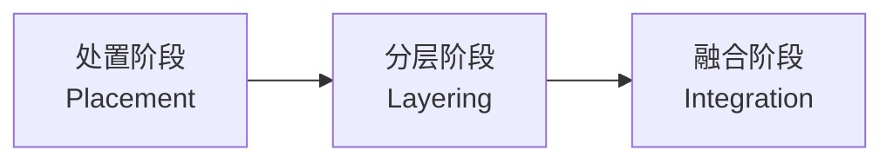
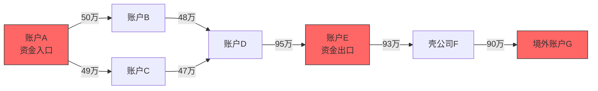

# 反洗钱与可疑交易监测

## 反洗钱概述

反洗钱(Anti-Money Laundering, AML)是金融机构的核心合规义务，旨在防止犯罪收益通过金融系统合法化。洗钱活动不仅助长犯罪，还破坏金融体系稳定，各国监管机构对反洗钱的要求日益严格。

### 反洗钱三阶段

洗钱活动通常经历三个阶段，每个阶段具有不同的交易特征：



| 阶段 | 英文 | 手法 | 交易特征 |
|------|------|------|----------|
| 处置 | Placement | 将非法资金引入金融系统 | 大额现金存入、密集开户 |
| 分层 | Layering | 通过复杂交易掩盖资金来源 | 多层转账、跨境汇款、买卖金融产品 |
| 融合 | Integration | 以合法形式回归经济体系 | 房产购买、投资企业、奢侈品消费 |

### 典型洗钱手法

| 手法 | 说明 | 检测难点 |
|------|------|----------|
| 现金拆分(Structuring/Smurfing) | 将大额现金拆分为小额低于报告阈值 | 单笔金额小，需聚合分析 |
| 空壳公司 | 通过无实际经营的壳公司流转资金 | 公司信息看似合法 |
| 贸易洗钱(TBML) | 虚高或虚低发票价转移资金 | 需要贸易数据验证 |
| 虚拟货币 | 利用加密货币匿名性转移资金 | 链上追踪困难 |
| 地下钱庄 | 非正规渠道跨境转移资金 | 游离于正规体系外 |
| 慈善洗钱 | 利用慈善组织转移资金 | 表面合法 |

## 可疑交易识别规则

### 大额交易规则

根据中国反洗钱法，以下交易必须报告：

| 交易类型 | 阈值 | 报告时限 |
|----------|------|----------|
| 现金收支 | 单笔或当日累计5万元以上 | 5个工作日 |
| 非自然人银行转账 | 单笔或当日累计200万元以上 | 5个工作日 |
| 自然人银行转账 | 单笔或当日累计50万元以上 | 5个工作日 |
| 自然人跨境转账 | 单笔或当日累计20万元以上 | 5个工作日 |

### 频繁交易规则

```python
from dataclasses import dataclass
from datetime import datetime, timedelta
from typing import List, Dict
from collections import defaultdict


@dataclass
class Transaction:
    """交易记录"""
    transaction_id: str
    account_id: str
    counterparty_id: str
    amount: float
    currency: str
    transaction_type: str  # deposit, withdrawal, transfer
    timestamp: str
    location: str = ""
    channel: str = ""  # counter, atm, online, mobile


class FrequentTransactionMonitor:
    """频繁交易监测"""

    def __init__(self):
        self.rules = [
            {'name': '高频小额存入', 'type': 'deposit',
             'window_hours': 24, 'min_count': 5, 'max_amount': 49000},
            {'name': '高频转账', 'type': 'transfer',
             'window_hours': 24, 'min_count': 10, 'max_amount': float('inf')},
            {'name': '频繁跨境汇款', 'type': 'cross_border',
             'window_hours': 168, 'min_count': 3, 'max_amount': float('inf')},
        ]
        self.account_transactions = defaultdict(list)

    def add_transaction(self, tx: Transaction):
        """添加交易记录"""
        self.account_transactions[tx.account_id].append(tx)

    def check(self, account_id: str) -> List[Dict]:
        """检查频繁交易"""
        alerts = []
        transactions = self.account_transactions.get(account_id, [])
        now = datetime.now()

        for rule in self.rules:
            cutoff = now - timedelta(hours=rule['window_hours'])
            matching_tx = [
                tx for tx in transactions
                if (datetime.fromisoformat(tx.timestamp) > cutoff
                    and tx.transaction_type == rule['type']
                    and tx.amount < rule['max_amount'])
            ]

            if len(matching_tx) >= rule['min_count']:
                alerts.append({
                    'rule_name': rule['name'],
                    'account_id': account_id,
                    'count': len(matching_tx),
                    'total_amount': sum(tx.amount for tx in matching_tx),
                    'window_hours': rule['window_hours'],
                    'transactions': [
                        {
                            'id': tx.transaction_id,
                            'amount': tx.amount,
                            'timestamp': tx.timestamp,
                        }
                        for tx in matching_tx
                    ],
                })

        return alerts
```

### 结构性拆分检测

结构性拆分(Smurfing)是最常见的洗钱手法之一，通过将大额交易拆分为多笔小额交易规避报告阈值：

```python
class StructuringDetector:
    """结构性拆分检测器"""

    def __init__(self, report_threshold=50000, tolerance=0.1, window_hours=24):
        self.report_threshold = report_threshold
        self.tolerance = tolerance
        self.window_hours = window_hours
        self.account_transactions = defaultdict(list)

    def add_transaction(self, tx: Transaction):
        """添加交易记录"""
        self.account_transactions[tx.account_id].append(tx)

    def detect(self, account_id: str) -> List[Dict]:
        """检测结构性拆分"""
        transactions = self.account_transactions.get(account_id, [])
        if not transactions:
            return []

        alerts = []
        now = datetime.now()
        cutoff = now - timedelta(hours=self.window_hours)

        recent_tx = sorted(
            [tx for tx in transactions if datetime.fromisoformat(tx.timestamp) > cutoff],
            key=lambda tx: tx.timestamp,
        )

        # 检测策略1: 多笔交易总额接近阈值
        total_amount = sum(tx.amount for tx in recent_tx)
        if (total_amount >= self.report_threshold * (1 - self.tolerance)
                and all(tx.amount < self.report_threshold for tx in recent_tx)):
            alerts.append({
                'pattern': 'total_near_threshold',
                'description': f'{self.window_hours}小时内多笔交易总额{total_amount:.0f}接近报告阈值',
                'total_amount': total_amount,
                'count': len(recent_tx),
                'threshold': self.report_threshold,
            })

        # 检测策略2: 多笔金额相似的小额交易
        amounts = [tx.amount for tx in recent_tx if tx.amount > 0]
        if len(amounts) >= 3:
            mean_amount = sum(amounts) / len(amounts)
            similar_count = sum(
                1 for a in amounts
                if abs(a - mean_amount) / mean_amount < 0.1
            )
            if similar_count >= 3 and similar_count / len(amounts) >= 0.6:
                alerts.append({
                    'pattern': 'similar_amounts',
                    'description': f'多笔金额相近的交易(均值{mean_amount:.0f})',
                    'mean_amount': mean_amount,
                    'similar_count': similar_count,
                })

        # 检测策略3: 金额递减模式(逐步试探阈值)
        if len(amounts) >= 3:
            decreasing_count = sum(
                1 for i in range(1, len(amounts))
                if amounts[i] < amounts[i - 1]
            )
            if decreasing_count / (len(amounts) - 1) >= 0.7:
                alerts.append({
                    'pattern': 'decreasing_amounts',
                    'description': '交易金额呈递减趋势(可能试探阈值)',
                })

        return alerts
```

## 基于图的洗钱网络发现

洗钱活动通常涉及多个账户之间的复杂资金流转，图分析方法能有效揭示隐藏的洗钱网络：



### 图分析代码实现

```python
import networkx as nx
from collections import defaultdict
from typing import Set, List, Dict, Tuple


class MoneyLaunderingGraphAnalyzer:
    """洗钱网络图分析器"""

    def __init__(self):
        self.graph = nx.DiGraph()
        self.transaction_details = {}

    def add_transactions(self, transactions: List[Transaction]):
        """从交易数据构建图"""
        for tx in transactions:
            self.graph.add_edge(
                tx.account_id,
                tx.counterparty_id,
                weight=tx.amount,
                timestamp=tx.timestamp,
                tx_id=tx.transaction_id,
            )
            self.transaction_details[tx.transaction_id] = tx

    def detect_circular_flows(self, min_cycle_length=3) -> List[Dict]:
        """检测环形资金流"""
        cycles = []
        try:
            for cycle in nx.simple_cycles(self.graph):
                if len(cycle) >= min_cycle_length:
                    # 计算环路金额
                    total_amount = 0
                    for i in range(len(cycle)):
                        src = cycle[i]
                        dst = cycle[(i + 1) % len(cycle)]
                        if self.graph.has_edge(src, dst):
                            total_amount += self.graph[src][dst].get('weight', 0)

                    cycles.append({
                        'nodes': cycle,
                        'length': len(cycle),
                        'total_amount': total_amount,
                        'avg_amount': total_amount / len(cycle),
                    })
        except nx.NetworkXError:
            pass

        return sorted(cycles, key=lambda x: x['total_amount'], reverse=True)

    def detect_funnel_patterns(self, threshold_ratio=0.8) -> List[Dict]:
        """检测漏斗模式(多进一出或一进多出)"""
        patterns = []

        for node in self.graph.nodes():
            in_degree = self.graph.in_degree(node)
            out_degree = self.graph.out_degree(node)

            in_amount = sum(
                self.graph[pred][node].get('weight', 0)
                for pred in self.graph.predecessors(node)
            )
            out_amount = sum(
                self.graph[node][succ].get('weight', 0)
                for succ in self.graph.successors(node)
            )

            # 聚合模式：多进少出
            if in_degree >= 3 and out_degree <= 2:
                if in_amount > 0 and out_amount / in_amount > threshold_ratio:
                    patterns.append({
                        'type': 'aggregation',
                        'node': node,
                        'in_degree': in_degree,
                        'out_degree': out_degree,
                        'in_amount': in_amount,
                        'out_amount': out_amount,
                        'retention_ratio': out_amount / in_amount,
                    })

            # 分散模式：少进多出
            if out_degree >= 3 and in_degree <= 2:
                if out_amount > 0 and in_amount / out_amount > threshold_ratio:
                    patterns.append({
                        'type': 'dispersion',
                        'node': node,
                        'in_degree': in_degree,
                        'out_degree': out_degree,
                        'in_amount': in_amount,
                        'out_amount': out_amount,
                        'retention_ratio': in_amount / out_amount,
                    })

        return patterns

    def detect_layering_chains(self, min_length=3, max_time_gap_hours=48) -> List[Dict]:
        """检测分层链条(资金快速多层转移)"""
        chains = []

        # 找到所有出度为1的路径起点
        sources = [
            n for n in self.graph.nodes()
            if self.graph.in_degree(n) == 0 and self.graph.out_degree(n) > 0
        ]

        for source in sources:
            # DFS寻找长链
            visited = set()
            self._dfs_chain(source, [], visited, chains, min_length)

        return chains

    def _dfs_chain(self, node, path, visited, results, min_length):
        """深度优先搜索寻找资金链"""
        visited.add(node)
        path.append(node)

        successors = list(self.graph.successors(node))
        if not successors or len(path) >= 10:
            if len(path) >= min_length:
                chain_amounts = []
                for i in range(len(path) - 1):
                    if self.graph.has_edge(path[i], path[i + 1]):
                        chain_amounts.append(
                            self.graph[path[i]][path[i + 1]].get('weight', 0)
                        )
                results.append({
                    'chain': list(path),
                    'length': len(path),
                    'amounts': chain_amounts,
                    'total_amount': sum(chain_amounts),
                })
        else:
            for succ in successors:
                if succ not in visited:
                    self._dfs_chain(succ, path, visited, results, min_length)

        path.pop()
        visited.discard(node)

    def compute_risk_scores(self) -> Dict[str, float]:
        """计算节点风险评分"""
        risk_scores = {}

        # 使用PageRank识别关键节点
        try:
            pagerank = nx.pagerank(self.graph, weight='weight')
        except nx.NetworkXError:
            pagerank = {n: 0 for n in self.graph.nodes()}

        # 使用度中心性
        degree_centrality = nx.degree_centrality(self.graph)

        # 使用介数中心性
        try:
            betweenness = nx.betweenness_centrality(self.graph, weight='weight')
        except nx.NetworkXError:
            betweenness = {n: 0 for n in self.graph.nodes()}

        for node in self.graph.nodes():
            score = (
                0.3 * pagerank.get(node, 0)
                + 0.3 * degree_centrality.get(node, 0)
                + 0.4 * betweenness.get(node, 0)
            )
            risk_scores[node] = score

        # 归一化到0-1
        max_score = max(risk_scores.values()) if risk_scores else 1
        if max_score > 0:
            risk_scores = {k: v / max_score for k, v in risk_scores.items()}

        return risk_scores
```

## AI在AML中的应用

### 异常检测

基于机器学习的异常检测可以发现传统规则难以覆盖的可疑模式：

```python
import numpy as np
import pandas as pd
from sklearn.ensemble import IsolationForest
from sklearn.preprocessing import StandardScaler


class AMLAnomalyDetector:
    """AML异常检测器"""

    def __init__(self, contamination=0.02):
        self.contamination = contamination
        self.model = IsolationForest(
            contamination=contamination,
            n_estimators=200,
            random_state=42,
        )
        self.scaler = StandardScaler()
        self.feature_columns = None

    def _extract_features(self, transactions_df: pd.DataFrame) -> pd.DataFrame:
        """从交易数据提取特征"""
        features = transactions_df.groupby('account_id').agg(
            tx_count=('transaction_id', 'count'),
            total_amount=('amount', 'sum'),
            avg_amount=('amount', 'mean'),
            max_amount=('amount', 'max'),
            std_amount=('amount', 'std'),
            unique_counterparties=('counterparty_id', 'nunique'),
            night_tx_ratio=('is_night', 'mean'),
            weekend_tx_ratio=('is_weekend', 'mean'),
            cross_border_ratio=('is_cross_border', 'mean'),
            cash_tx_ratio=('is_cash', 'mean'),
        ).fillna(0)

        # 计算衍生特征
        features['amount_concentration'] = features['max_amount'] / features['total_amount']
        features['counterparty_diversity'] = features['unique_counterparties'] / features['tx_count']

        self.feature_columns = features.columns.tolist()
        return features

    def fit(self, transactions_df: pd.DataFrame):
        """训练异常检测模型"""
        features = self._extract_features(transactions_df)
        X = self.scaler.fit_transform(features)
        self.model.fit(X)
        return self

    def predict(self, transactions_df: pd.DataFrame) -> pd.DataFrame:
        """预测可疑账户"""
        features = self._extract_features(transactions_df)
        X = self.scaler.transform(features)

        labels = self.model.predict(X)
        scores = self.model.score_samples(X)

        result = features.copy()
        result['is_suspicious'] = labels == -1
        result['anomaly_score'] = -scores
        return result.sort_values('anomaly_score', ascending=False)
```

### NLP报告解析

利用NLP技术自动解析和生成可疑交易报告：

```python
class SARReportParser:
    """可疑活动报告(SAR)解析器"""

    def __init__(self):
        self.suspicious_indicators = {
            'structuring': ['拆分', '规避', '低于报告', '频繁小额'],
            'layering': ['多层', '快速转移', '转账后提现', '转入转出'],
            'trade_based': ['虚高', '虚低', '发票不符', '贸易异常'],
            'cash_intensive': ['大量现金', '现金存入', '不合理的现金'],
            'identity': ['身份存疑', '虚假资料', '冒用', '证件异常'],
        }

    def parse_transaction_description(self, description: str) -> dict:
        """解析交易描述中的可疑指标"""
        findings = {}
        for category, keywords in self.suspicious_indicators.items():
            matched = [kw for kw in keywords if kw in description]
            if matched:
                findings[category] = matched
        return findings

    def generate_sar_summary(self, account_id: str, alerts: list, graph_findings: dict) -> str:
        """生成SAR报告摘要"""
        summary_parts = [
            f"可疑活动报告 - 账户{account_id}",
            f"报告日期: {datetime.now().strftime('%Y-%m-%d')}",
            "",
            "一、可疑活动概述",
        ]

        if alerts:
            summary_parts.append(f"触发{len(alerts)}条监测规则:")
            for alert in alerts:
                summary_parts.append(f"  - {alert.get('rule_name', '')}: {alert.get('description', '')}")

        if graph_findings.get('circular_flows'):
            summary_parts.append(f"\n发现{len(graph_findings['circular_flows'])}条环形资金流")

        if graph_findings.get('funnel_patterns'):
            summary_parts.append(f"发现{len(graph_findings['funnel_patterns'])}个漏斗模式节点")

        summary_parts.extend([
            "",
            "二、涉及账户",
            f"  主体账户: {account_id}",
        ])

        return "\n".join(summary_parts)
```

## SAR自动生成

可疑活动报告(Suspicious Activity Report, SAR)是金融机构向监管机构报告可疑交易的法律文件：

```python
from datetime import datetime
from typing import List, Optional


class SARReportGenerator:
    """SAR报告自动生成器"""

    def __init__(self):
        self.report_template = {
            'report_type': '可疑交易报告',
            'reporting_institution': '',
            'report_date': '',
            'suspect_info': {},
            'activity_description': '',
            'suspicious_indicators': [],
            'transaction_details': [],
            'network_analysis': {},
            'recommendation': '',
        }

    def generate(self, account_id: str, transaction_data: dict,
                 rule_alerts: list, graph_findings: dict,
                 ml_score: float) -> dict:
        """生成SAR报告"""
        report = self.report_template.copy()
        report['report_date'] = datetime.now().strftime('%Y-%m-%d')

        # 嫌疑人信息
        report['suspect_info'] = {
            'account_id': account_id,
            'account_holder': transaction_data.get('account_holder', ''),
            'account_type': transaction_data.get('account_type', ''),
            'open_date': transaction_data.get('open_date', ''),
            'risk_level': transaction_data.get('risk_level', ''),
        }

        # 可疑活动描述
        report['activity_description'] = self._describe_activity(
            rule_alerts, graph_findings, ml_score
        )

        # 可疑指标
        report['suspicious_indicators'] = self._extract_indicators(
            rule_alerts, graph_findings
        )

        # 交易明细
        report['transaction_details'] = transaction_data.get('transactions', [])

        # 网络分析结果
        report['network_analysis'] = graph_findings

        # 处理建议
        report['recommendation'] = self._generate_recommendation(ml_score)

        return report

    def _describe_activity(self, rule_alerts, graph_findings, ml_score) -> str:
        """描述可疑活动"""
        parts = []

        if rule_alerts:
            rule_names = [a.get('rule_name', '') for a in rule_alerts]
            parts.append(f"该账户触发以下监测规则: {', '.join(rule_names)}")

        if graph_findings.get('circular_flows'):
            parts.append(f"网络分析发现{len(graph_findings['circular_flows'])}条环形资金流，存在资金回流特征")

        if graph_findings.get('funnel_patterns'):
            funnel_types = [
                p['type'] for p in graph_findings['funnel_patterns']
            ]
            parts.append(f"发现{len(funnel_types)}个漏斗模式节点(类型: {', '.join(set(funnel_types))})")

        if ml_score > 0.7:
            parts.append("机器学习模型评估该账户具有高度可疑性")
        elif ml_score > 0.4:
            parts.append("机器学习模型评估该账户存在可疑特征")

        return "。".join(parts) if parts else "综合分析未发现明显可疑活动"

    def _extract_indicators(self, rule_alerts, graph_findings) -> List[str]:
        """提取可疑指标"""
        indicators = []
        for alert in rule_alerts:
            indicators.append(alert.get('description', alert.get('rule_name', '')))
        if graph_findings.get('circular_flows'):
            indicators.append('存在环形资金流')
        if graph_findings.get('funnel_patterns'):
            indicators.append('存在资金聚合或分散模式')
        return indicators

    def _generate_recommendation(self, ml_score) -> str:
        """生成处理建议"""
        if ml_score > 0.8:
            return "建议: 立即冻结账户，向监管机构报告，配合执法调查"
        elif ml_score > 0.6:
            return "建议: 强化监控，限制交易额度，准备SAR报告"
        elif ml_score > 0.4:
            return "建议: 加强关注，提升客户风险等级，持续监控"
        else:
            return "建议: 继续常规监控，记录本次分析结果"
```

## FATF建议与中国反洗钱法要求

### FATF 40项建议核心内容

FATF(金融行动特别工作组)制定了国际反洗钱标准，其40项建议是各国反洗钱立法的基础：

| 类别 | 核心建议 | 中国落实情况 |
|------|----------|-------------|
| 风险评估 | 识别评估本国洗钱风险 | 已完成国家风险评估 |
| 政策协调 | 主管部门协调配合 | 反洗钱工作部际联席会议 |
| KYC | 客户尽职调查 | 反洗钱法明确要求 |
| 可疑交易报告 | 及时报告可疑交易 | 大额和可疑交易报告制度 |
| 法人透明度 | 获取受益所有人信息 | 受益所有人登记制度 |
| 定罪与没收 | 洗钱犯罪定罪 | 刑法第191条 |
| 国际合作 | 司法协助与引渡 | 已加入多项国际公约 |

### 中国反洗钱法核心要求

**注：以下罚款标准依据2025年1月1日施行的新《反洗钱法》，较2006年旧法大幅提高。严重违法的机构罚款可达500万元。**

| 义务 | 要求 | 违规后果 |
|------|------|----------|
| 客户身份识别 | 建立KYC制度 | 机构20-200万，个人2-20万 |
| 客户身份资料保存 | 保存至少5年 | 机构20-200万，个人2-20万 |
| 大额交易报告 | 按规定时限报送 | 机构20-200万，个人2-20万 |
| 可疑交易报告 | 及时分析报送 | 机构50-500万，个人5-50万（严重违法） |
| 内控制度 | 建立反洗钱内控体系 | 机构20-200万，个人2-20万 |
| 培训 | 定期开展反洗钱培训 | 责令限期改正 |

## 完整代码：交易监测规则引擎

```python
from datetime import datetime, timedelta
from typing import List, Dict, Optional
from dataclasses import dataclass, field
from enum import Enum
import json


class RiskLevel(Enum):
    LOW = "low"
    MEDIUM = "medium"
    HIGH = "high"
    CRITICAL = "critical"


@dataclass
class MonitoringRule:
    """监测规则"""
    rule_id: str
    rule_name: str
    rule_type: str  # threshold, composite, temporal, pattern
    description: str
    risk_level: RiskLevel
    parameters: dict = field(default_factory=dict)
    enabled: bool = True


@dataclass
class MonitoringAlert:
    """监测告警"""
    alert_id: str
    rule_id: str
    rule_name: str
    account_id: str
    risk_level: RiskLevel
    details: str
    timestamp: str
    related_transactions: List[str] = field(default_factory=list)


class AMLTransactionMonitor:
    """反洗钱交易监测引擎"""

    def __init__(self):
        self.rules: List[MonitoringRule] = []
        self.alerts: List[MonitoringAlert] = []
        self.account_cache: Dict[str, List[dict]] = {}
        self.alert_counter = 0
        self._init_default_rules()

    def _init_default_rules(self):
        """初始化默认监测规则"""
        default_rules = [
            MonitoringRule("R001", "大额现金交易", "threshold",
                          "单笔现金交易超过5万元", RiskLevel.HIGH,
                          {"field": "amount", "operator": "gt", "threshold": 50000,
                           "type_filter": "cash"}),
            MonitoringRule("R002", "大额转账", "threshold",
                          "单笔转账超过50万元", RiskLevel.HIGH,
                          {"field": "amount", "operator": "gt", "threshold": 500000,
                           "type_filter": "transfer"}),
            MonitoringRule("R003", "高频交易", "temporal",
                          "24小时内同账户交易超过20笔", RiskLevel.MEDIUM,
                          {"window_hours": 24, "min_count": 20}),
            MonitoringRule("R004", "结构性拆分", "pattern",
                          "24小时内多笔交易总额接近报告阈值", RiskLevel.HIGH,
                          {"window_hours": 24, "report_threshold": 50000,
                           "tolerance": 0.1}),
            MonitoringRule("R005", "大额跨境汇款", "threshold",
                          "单笔跨境汇款超过20万元", RiskLevel.HIGH,
                          {"field": "amount", "operator": "gt", "threshold": 200000,
                           "type_filter": "cross_border"}),
            MonitoringRule("R006", "快进快出", "temporal",
                          "资金到账后短时间内转出", RiskLevel.MEDIUM,
                          {"window_minutes": 60, "direction": "in_out"}),
            MonitoringRule("R007", "夜间大额交易", "composite",
                          "夜间时段大额交易", RiskLevel.HIGH,
                          {"conditions": [
                              {"field": "hour", "operator": "lt", "threshold": 6},
                              {"field": "amount", "operator": "gt", "threshold": 100000},
                          ], "logic": "AND"}),
            MonitoringRule("R008", "对手方集中", "pattern",
                          "与同一对手方频繁交易", RiskLevel.MEDIUM,
                          {"window_hours": 72, "min_count": 5,
                           "max_unique_counterparties": 2}),
        ]
        self.rules = default_rules

    def process_transaction(self, tx: dict) -> List[MonitoringAlert]:
        """处理单笔交易，返回触发的告警"""
        account_id = tx.get('account_id', '')
        self._update_cache(account_id, tx)

        triggered_alerts = []
        for rule in self.rules:
            if not rule.enabled:
                continue
            if self._evaluate_rule(rule, tx, account_id):
                alert = self._create_alert(rule, account_id, tx)
                triggered_alerts.append(alert)
                self.alerts.append(alert)

        return triggered_alerts

    def _update_cache(self, account_id: str, tx: dict):
        """更新账户交易缓存"""
        if account_id not in self.account_cache:
            self.account_cache[account_id] = []
        self.account_cache[account_id].append(tx)

        # 保留最近7天数据
        cutoff = datetime.now() - timedelta(days=7)
        self.account_cache[account_id] = [
            t for t in self.account_cache[account_id]
            if datetime.fromisoformat(t['timestamp']) > cutoff
        ]

    def _evaluate_rule(self, rule: MonitoringRule, tx: dict, account_id: str) -> bool:
        """评估规则"""
        if rule.rule_type == 'threshold':
            return self._eval_threshold(rule, tx)
        elif rule.rule_type == 'temporal':
            return self._eval_temporal(rule, tx, account_id)
        elif rule.rule_type == 'composite':
            return self._eval_composite(rule, tx)
        elif rule.rule_type == 'pattern':
            return self._eval_pattern(rule, tx, account_id)
        return False

    def _eval_threshold(self, rule: MonitoringRule, tx: dict) -> bool:
        """评估阈值规则"""
        params = rule.parameters
        field = params.get('field', '')
        threshold = params.get('threshold', 0)
        operator = params.get('operator', 'gt')
        type_filter = params.get('type_filter', '')

        if type_filter and tx.get('transaction_type') != type_filter:
            return False

        value = tx.get(field, 0)
        ops = {'gt': lambda v, t: v > t, 'lt': lambda v, t: v < t,
               'gte': lambda v, t: v >= t, 'eq': lambda v, t: v == t}
        return ops.get(operator, lambda v, t: False)(value, threshold)

    def _eval_temporal(self, rule: MonitoringRule, tx: dict, account_id: str) -> bool:
        """评估时序规则"""
        params = rule.parameters
        window_hours = params.get('window_hours', 24)
        min_count = params.get('min_count', 10)
        window_minutes = params.get('window_minutes', 0)
        direction = params.get('direction', '')

        history = self.account_cache.get(account_id, [])
        now = datetime.fromisoformat(tx['timestamp'])

        if window_minutes:
            cutoff = now - timedelta(minutes=window_minutes)
        else:
            cutoff = now - timedelta(hours=window_hours)

        recent = [t for t in history if datetime.fromisoformat(t['timestamp']) > cutoff]

        if direction == 'in_out':
            deposits = [t for t in recent if t.get('direction') == 'in']
            withdrawals = [t for t in recent if t.get('direction') == 'out']
            if deposits and withdrawals:
                first_deposit = min(
                    datetime.fromisoformat(t['timestamp']) for t in deposits
                )
                first_withdrawal = min(
                    datetime.fromisoformat(t['timestamp']) for t in withdrawals
                )
                return (first_withdrawal - first_deposit).total_seconds() < window_minutes * 60

        return len(recent) >= min_count

    def _eval_composite(self, rule: MonitoringRule, tx: dict) -> bool:
        """评估组合规则"""
        params = rule.parameters
        conditions = params.get('conditions', [])
        logic = params.get('logic', 'AND')

        results = []
        for cond in conditions:
            field = cond.get('field', '')
            threshold = cond.get('threshold', 0)
            operator = cond.get('operator', 'gt')
            value = tx.get(field, 0)
            ops = {'gt': lambda v, t: v > t, 'lt': lambda v, t: v < t,
                   'gte': lambda v, t: v >= t}
            results.append(ops.get(operator, lambda v, t: False)(value, threshold))

        if logic == 'AND':
            return all(results)
        elif logic == 'OR':
            return any(results)
        return False

    def _eval_pattern(self, rule: MonitoringRule, tx: dict, account_id: str) -> bool:
        """评估模式规则"""
        params = rule.parameters
        history = self.account_cache.get(account_id, [])
        now = datetime.fromisoformat(tx['timestamp'])

        # 结构性拆分检测
        if rule.rule_id == 'R004':
            window_hours = params.get('window_hours', 24)
            report_threshold = params.get('report_threshold', 50000)
            tolerance = params.get('tolerance', 0.1)

            cutoff = now - timedelta(hours=window_hours)
            recent = [t for t in history if datetime.fromisoformat(t['timestamp']) > cutoff]
            total = sum(t.get('amount', 0) for t in recent)

            return (total >= report_threshold * (1 - tolerance)
                    and all(t.get('amount', 0) < report_threshold for t in recent))

        # 对手方集中检测
        if rule.rule_id == 'R008':
            window_hours = params.get('window_hours', 72)
            min_count = params.get('min_count', 5)
            max_unique = params.get('max_unique_counterparties', 2)

            cutoff = now - timedelta(hours=window_hours)
            recent = [t for t in history if datetime.fromisoformat(t['timestamp']) > cutoff]
            counterparties = [t.get('counterparty_id') for t in recent if t.get('counterparty_id')]

            return len(recent) >= min_count and len(set(counterparties)) <= max_unique

        return False

    def _create_alert(self, rule: MonitoringRule, account_id: str, tx: dict) -> MonitoringAlert:
        """创建告警"""
        self.alert_counter += 1
        return MonitoringAlert(
            alert_id=f"ALT-{self.alert_counter:06d}",
            rule_id=rule.rule_id,
            rule_name=rule.rule_name,
            account_id=account_id,
            risk_level=rule.risk_level,
            details=f"{rule.description} (交易金额: {tx.get('amount', 0)})",
            timestamp=datetime.now().isoformat(),
            related_transactions=[tx.get('transaction_id', '')],
        )

    def get_account_risk_summary(self, account_id: str) -> dict:
        """获取账户风险汇总"""
        account_alerts = [
            a for a in self.alerts if a.account_id == account_id
        ]
        risk_level_counts = {level.value: 0 for level in RiskLevel}
        for alert in account_alerts:
            risk_level_counts[alert.risk_level.value] += 1

        tx_count = len(self.account_cache.get(account_id, []))
        total_amount = sum(
            t.get('amount', 0) for t in self.account_cache.get(account_id, [])
        )

        # 综合风险评分
        score = (
            risk_level_counts['critical'] * 1.0
            + risk_level_counts['high'] * 0.6
            + risk_level_counts['medium'] * 0.3
            + risk_level_counts['low'] * 0.1
        )
        score = min(score / max(tx_count, 1) * 10, 1.0) if tx_count > 0 else 0

        return {
            'account_id': account_id,
            'total_alerts': len(account_alerts),
            'risk_level_counts': risk_level_counts,
            'transaction_count': tx_count,
            'total_amount': total_amount,
            'risk_score': round(score, 4),
        }
```

## 制裁合规与名单筛查

制裁合规是AML体系中优先级最高的功能之一，涉及跨境业务时尤为关键。

### 主要制裁名单

| 名单 | 发布机构 | 覆盖范围 |
|------|----------|----------|
| SDN名单 (Specially Designated Nationals) | 美国OFAC | 个人、实体、船只 |
| 联合国安理会制裁名单 | 联合国 | 恐怖组织、武器扩散 |
| 欧盟综合制裁名单 | 欧盟理事会 | 个人、实体、国家 |
| 中国阻断办法相关名单 | 中国商务部 | 反制外国法律不当域外适用 |

### 筛查实现要点

- **模糊匹配**：名称变体、拼写错误、音译差异需用模糊匹配算法（Levenshtein距离、Soundex）
- **实时更新**：名单更新后需在24小时内同步到筛查系统
- **误报处理**：典型误报率90%+，需建立白名单和自动消歧机制
- **PEP筛查**：政治公众人物及其关联人需增强型尽职调查

## 小结

反洗钱与可疑交易监测是金融机构的核心合规义务。从基于规则的阈值检测到基于图的网络分析，从结构化拆分识别到环形资金流发现，AML监测需要综合运用多种技术手段。AI技术为AML带来了新的能力：异常检测可以发现未知模式，图分析揭示隐藏网络，NLP辅助报告生成提升效率。完整的交易监测规则引擎是AML系统的基础设施，需要支持阈值、时序、组合和模式等多种规则类型。
