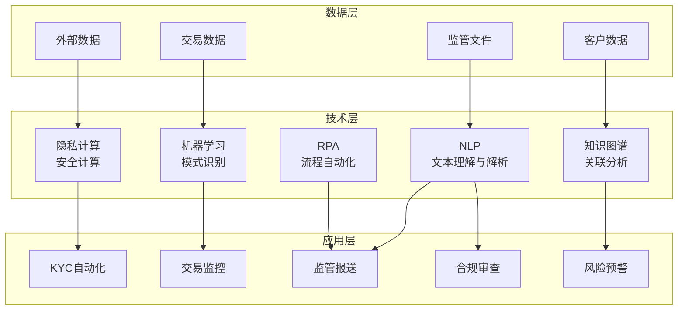

# 合规科技RegTech

## RegTech概述

合规科技(Regulatory Technology, RegTech)是利用新兴技术帮助金融机构更高效地满足监管合规要求的解决方案。RegTech通过自动化、智能化手段，降低合规成本、提升合规效率、减少合规风险。

### RegTech定义与市场规模

| 维度 | 说明 |
|------|------|
| 定义 | 运用新技术促进监管合规的科技解决方案 |
| 核心目标 | 降低合规成本、提升合规效率、减少合规风险 |
| 全球市场规模 | 预计2026年超400亿美元 |
| 中国市场 | 快速增长，监管政策驱动 |
| 投资热度 | 金融科技细分领域增长最快之一 |

### RegTech技术架构



## KYC自动化

KYC(Know Your Customer)是反洗钱和客户准入的基础环节，传统KYC流程耗时耗力，RegTech通过技术手段实现自动化。

### OCR证件识别

```python
from dataclasses import dataclass
from typing import Optional, List
from enum import Enum


class IDType(Enum):
    ID_CARD = "身份证"
    PASSPORT = "护照"
    DRIVERS_LICENSE = "驾驶证"
    MILITARY_ID = "军官证"
    HK_MACAO_PASS = "港澳通行证"


@dataclass
class IDExtractionResult:
    """证件识别结果"""
    id_type: IDType
    name: str
    id_number: str
    gender: Optional[str] = None
    ethnicity: Optional[str] = None
    birth_date: Optional[str] = None
    address: Optional[str] = None
    valid_from: Optional[str] = None
    valid_to: Optional[str] = None
    issuing_authority: Optional[str] = None
    confidence: float = 0.0
    ocr_warnings: List[str] = None

    def __post_init__(self):
        if self.ocr_warnings is None:
            self.ocr_warnings = []


class IDCardValidator:
    """身份证号校验器"""

    @staticmethod
    def validate(id_number: str) -> dict:
        """校验身份证号合法性"""
        result = {'valid': True, 'errors': []}

        if len(id_number) != 18:
            result['valid'] = False
            result['errors'].append('身份证号长度应为18位')
            return result

        # 地区码校验
        area_code = id_number[:6]
        if not IDCardValidator._check_area_code(area_code):
            result['errors'].append('地区码可能无效')

        # 出生日期校验
        birth_date = id_number[6:14]
        if not IDCardValidator._check_birth_date(birth_date):
            result['valid'] = False
            result['errors'].append('出生日期无效')

        # 校验码验证
        weights = [7, 9, 10, 5, 8, 4, 2, 1, 6, 3, 7, 9, 10, 5, 8, 4, 2]
        check_chars = '10X98765432'
        total = sum(
            int(id_number[i]) * weights[i] for i in range(17)
        )
        check_char = check_chars[total % 11]

        if id_number[17].upper() != check_char:
            result['valid'] = False
            result['errors'].append('校验码不匹配')

        return result

    @staticmethod
    def _check_area_code(code: str) -> bool:
        """校验地区码"""
        try:
            area_num = int(code)
            return 110000 <= area_num <= 659004
        except ValueError:
            return False

    @staticmethod
    def _check_birth_date(date_str: str) -> bool:
        """校验出生日期"""
        from datetime import datetime
        try:
            birth = datetime.strptime(date_str, '%Y%m%d')
            return birth.year >= 1900 and birth <= datetime.now()
        except ValueError:
            return False


class KYCAutomationService:
    """KYC自动化服务"""

    def __init__(self):
        self.validator = IDCardValidator()
        self.blacklists = {
            'pep': set(),      # 政治公众人物
            'sanction': set(),  # 制裁名单
            'wanted': set(),    # 通缉名单
        }

    def verify_identity(self, extraction_result: IDExtractionResult) -> dict:
        """身份验证"""
        verification = {
            'passed': True,
            'checks': [],
            'risk_level': 'low',
        }

        # 1. 证件校验
        if extraction_result.id_type == IDType.ID_CARD:
            id_check = self.validator.validate(extraction_result.id_number)
            verification['checks'].append({
                'check_type': 'id_validation',
                'passed': id_check['valid'],
                'details': id_check.get('errors', []),
            })
            if not id_check['valid']:
                verification['passed'] = False

        # 2. 证件有效期检查
        if extraction_result.valid_to:
            from datetime import datetime
            try:
                expiry = datetime.strptime(extraction_result.valid_to, '%Y%m%d')
                if expiry < datetime.now():
                    verification['checks'].append({
                        'check_type': 'expiry',
                        'passed': False,
                        'details': ['证件已过期'],
                    })
                    verification['passed'] = False
            except ValueError:
                pass

        # 3. OCR置信度检查
        if extraction_result.confidence < 0.9:
            verification['checks'].append({
                'check_type': 'ocr_confidence',
                'passed': False,
                'details': [f'OCR置信度较低({extraction_result.confidence:.2f})'],
            })

        # 4. 黑名单检查
        name_check = self._check_blacklists(extraction_result.name)
        id_check = self._check_blacklists(extraction_result.id_number)
        if name_check['matched'] or id_check['matched']:
            verification['checks'].append({
                'check_type': 'blacklist',
                'passed': False,
                'details': name_check.get('matched_lists', []) + id_check.get('matched_lists', []),
            })
            verification['passed'] = False
            verification['risk_level'] = 'high'

        return verification

    def _check_blacklists(self, value: str) -> dict:
        """检查黑名单"""
        matched_lists = []
        for list_name, blacklist in self.blacklists.items():
            if value in blacklist:
                matched_lists.append(list_name)

        return {
            'matched': len(matched_lists) > 0,
            'matched_lists': matched_lists,
        }

    def assess_customer_risk(self, customer_data: dict) -> dict:
        """客户风险评估"""
        risk_factors = []
        risk_score = 0.0

        # 高风险国家/地区
        high_risk_countries = ['KP', 'IR', 'SY', 'CU', 'VE']
        if customer_data.get('nationality') in high_risk_countries:
            risk_factors.append('高风险国家')
            risk_score += 0.3

        # PEP关联
        if customer_data.get('is_pep'):
            risk_factors.append('政治公众人物')
            risk_score += 0.2

        # 高风险行业
        high_risk_industries = ['虚拟货币', '赌博', '武器', '贵金属交易']
        if customer_data.get('industry') in high_risk_industries:
            risk_factors.append('高风险行业')
            risk_score += 0.2

        # 复杂股权结构
        if customer_data.get('ownership_layers', 0) > 3:
            risk_factors.append('复杂股权结构')
            risk_score += 0.15

        risk_level = (
            'high' if risk_score >= 0.5
            else 'medium' if risk_score >= 0.2
            else 'low'
        )

        return {
            'risk_level': risk_level,
            'risk_score': min(risk_score, 1.0),
            'risk_factors': risk_factors,
            'due_diligence_level': (
                'EDD' if risk_level == 'high'
                else 'CDD' if risk_level == 'medium'
                else 'SDD'
            ),
        }
```

### 活体检测

活体检测确保身份验证的当事人为本人：

| 检测方式 | 说明 | 防护能力 |
|----------|------|----------|
| 动作指令 | 要求眨眼、摇头、张嘴 | 防静态照片 |
| 红外检测 | 红外摄像头检测活体热辐射 | 防面具、头套 |
| 深度检测 | 3D结构光获取面部深度信息 | 防平面攻击 |
| 光流检测 | 分析面部微动光流 | 防视频回放 |

### 黑名单匹配

```python
class BlacklistMatcher:
    """黑名单匹配服务"""

    def __init__(self):
        self.exact_match_lists = {
            'un_sanction': set(),      # 联合国制裁名单
            'eu_sanction': set(),      # 欧盟制裁名单
            'ofac_sdnl': set(),        # 美国OFAC制裁名单
            'china_sanction': set(),   # 中国制裁名单
            'pep_list': set(),         # 政治公众人物
            'adverse_media': set(),    # 负面媒体报道
        }
        self.fuzzy_index = {}  # 模糊匹配索引

    def match(self, name: str, id_number: str = None,
              additional_info: dict = None) -> dict:
        """执行黑名单匹配"""
        results = {
            'has_match': False,
            'matches': [],
            'risk_level': 'low',
        }

        # 精确匹配
        for list_name, blacklist in self.exact_match_lists.items():
            if name in blacklist:
                results['matches'].append({
                    'list': list_name,
                    'match_type': 'exact',
                    'matched_value': name,
                })
                results['has_match'] = True

            if id_number and id_number in blacklist:
                results['matches'].append({
                    'list': list_name,
                    'match_type': 'exact',
                    'matched_value': id_number,
                })
                results['has_match'] = True

        # 模糊匹配（姓名相似度）
        fuzzy_matches = self._fuzzy_match_name(name)
        results['matches'].extend(fuzzy_matches)
        if fuzzy_matches:
            results['has_match'] = True

        # 确定风险等级
        if any(m['list'] in ['un_sanction', 'ofac_sdnl'] for m in results['matches']):
            results['risk_level'] = 'critical'
        elif any(m['list'] in ['eu_sanction', 'china_sanction'] for m in results['matches']):
            results['risk_level'] = 'high'
        elif any(m['list'] == 'pep_list' for m in results['matches']):
            results['risk_level'] = 'medium'

        return results

    def _fuzzy_match_name(self, name: str, threshold: float = 0.85) -> list:
        """模糊匹配姓名"""
        matches = []
        for list_name, index in self.fuzzy_index.items():
            for entry in index:
                similarity = self._compute_similarity(name, entry)
                if similarity >= threshold:
                    matches.append({
                        'list': list_name,
                        'match_type': 'fuzzy',
                        'matched_value': entry,
                        'similarity': round(similarity, 4),
                    })
        return matches

    @staticmethod
    def _compute_similarity(s1: str, s2: str) -> float:
        """计算字符串相似度(编辑距离)"""
        if len(s1) < len(s2):
            return BlacklistMatcher._compute_similarity(s2, s1)
        if len(s2) == 0:
            return 0.0

        previous_row = range(len(s2) + 1)
        for i, c1 in enumerate(s1):
            current_row = [i + 1]
            for j, c2 in enumerate(s2):
                insertions = previous_row[j + 1] + 1
                deletions = current_row[j] + 1
                substitutions = previous_row[j] + (c1 != c2)
                current_row.append(min(insertions, deletions, substitutions))
            previous_row = current_row

        max_len = max(len(s1), len(s2))
        return 1 - previous_row[-1] / max_len
```

## 交易监控与合规报告自动化

### 交易监控

```python
from datetime import datetime
from typing import List, Dict


class ComplianceReportGenerator:
    """合规报告生成器"""

    def generate_large_transaction_report(self, transactions: List[dict]) -> dict:
        """生成大额交易报告"""
        report = {
            'report_type': '大额交易报告',
            'report_date': datetime.now().strftime('%Y-%m-%d'),
            'reporting_institution': '',
            'total_count': len(transactions),
            'total_amount': sum(tx.get('amount', 0) for tx in transactions),
            'transactions': [],
        }

        for tx in transactions:
            report['transactions'].append({
                'transaction_id': tx.get('transaction_id', ''),
                'account_id': tx.get('account_id', ''),
                'counterparty': tx.get('counterparty_id', ''),
                'amount': tx.get('amount', 0),
                'currency': tx.get('currency', 'CNY'),
                'transaction_type': tx.get('transaction_type', ''),
                'timestamp': tx.get('timestamp', ''),
                'channel': tx.get('channel', ''),
            })

        return report

    def generate_sar_report(self, suspicious_activity: dict) -> dict:
        """生成可疑交易报告"""
        return {
            'report_type': '可疑交易报告',
            'report_date': datetime.now().strftime('%Y-%m-%d'),
            'subject_info': suspicious_activity.get('subject_info', {}),
            'suspicious_activity': {
                'description': suspicious_activity.get('description', ''),
                'start_date': suspicious_activity.get('start_date', ''),
                'end_date': suspicious_activity.get('end_date', ''),
                'indicators': suspicious_activity.get('indicators', []),
            },
            'transaction_details': suspicious_activity.get('transactions', []),
            'analysis_summary': suspicious_activity.get('analysis_summary', ''),
            'recommendation': suspicious_activity.get('recommendation', ''),
        }
```

## 监管报送

### 1104报表

1104非现场监管报表是银行业最重要的监管报送体系：

| 报表类别 | 包含内容 | 报送频率 |
|----------|----------|----------|
| 基本情况 | 机构信息、经营概况 | 季度 |
| 资本充足 | 资本构成、风险加权资产 | 季度 |
| 资产质量 | 五级分类、逾期情况 | 月度 |
| 流动性 | LCR、NSFR、流动性比例 | 月度 |
| 盈利能力 | 利润、净息差、成本收入比 | 季度 |
| 市场风险 | 利率风险、汇率风险 | 季度 |

### EAST报送

EAST(Examination and Analysis System Technology)是监管数据分析系统：

| 数据域 | 主要内容 | 数据量级 |
|--------|----------|----------|
| 交易流水 | 全量交易明细 | 千万-亿级/月 |
| 客户信息 | 个人/对公客户信息 | 百万-千万级 |
| 信贷合同 | 贷款合同与担保信息 | 百万级 |
| 表外业务 | 担保承诺、委托贷款 | 十万-百万级 |
| 资金业务 | 同业、投资业务信息 | 百万级 |

### 报送自动化

```python
class RegulatoryReportingService:
    """监管报送自动化服务"""

    def __init__(self):
        self.report_templates = {
            '1104': self._template_1104,
            'east': self._template_east,
            'aml': self._template_aml,
        }

    def generate_report(self, report_type: str, data: dict,
                        period: str) -> dict:
        """生成监管报表"""
        template_fn = self.report_templates.get(report_type)
        if not template_fn:
            raise ValueError(f"不支持的报表类型: {report_type}")

        report = template_fn(data, period)

        # 数据校验
        validation_result = self._validate_report(report_type, report)
        report['validation'] = validation_result

        return report

    def _template_1104(self, data: dict, period: str) -> dict:
        """1104报表模板"""
        return {
            'report_type': '1104',
            'period': period,
            'generated_at': datetime.now().isoformat(),
            'data': {
                'capital_adequacy': {
                    'tier1_capital_ratio': data.get('tier1_capital_ratio', 0),
                    'capital_adequacy_ratio': data.get('capital_adequacy_ratio', 0),
                    'risk_weighted_assets': data.get('risk_weighted_assets', 0),
                },
                'asset_quality': {
                    'npl_ratio': data.get('npl_ratio', 0),
                    'provision_coverage_ratio': data.get('pcr', 0),
                    'npl_balance': data.get('npl_balance', 0),
                },
                'liquidity': {
                    'lcr': data.get('lcr', 0),
                    'nsfr': data.get('nsfr', 0),
                    'liquidity_ratio': data.get('liquidity_ratio', 0),
                },
                'profitability': {
                    'net_interest_margin': data.get('nim', 0),
                    'cost_to_income_ratio': data.get('cti', 0),
                    'roa': data.get('roa', 0),
                    'roe': data.get('roe', 0),
                },
            },
        }

    def _template_east(self, data: dict, period: str) -> dict:
        """EAST报送模板"""
        return {
            'report_type': 'EAST',
            'period': period,
            'generated_at': datetime.now().isoformat(),
            'data': {
                'transaction_details': data.get('transactions', []),
                'customer_info': data.get('customers', []),
                'credit_contracts': data.get('credit_contracts', []),
                'off_balance_sheet': data.get('off_balance', []),
                'interbank_business': data.get('interbank', []),
            },
        }

    def _template_aml(self, data: dict, period: str) -> dict:
        """反洗钱报送模板"""
        return {
            'report_type': 'AML',
            'period': period,
            'generated_at': datetime.now().isoformat(),
            'data': {
                'large_amount_reports': data.get('large_amount_reports', []),
                'suspicious_reports': data.get('suspicious_reports', []),
                'customer_risk_classifications': data.get('risk_classifications', []),
            },
        }

    def _validate_report(self, report_type: str, report: dict) -> dict:
        """校验报表数据"""
        validation = {
            'passed': True,
            'errors': [],
            'warnings': [],
        }

        if report_type == '1104':
            data = report.get('data', {})

            # 资本充足率校验
            car = data.get('capital_adequacy', {}).get('capital_adequacy_ratio', 0)
            if car < 0.08:
                validation['errors'].append(f'资本充足率({car:.2%})低于8%监管红线')
                validation['passed'] = False
            elif car < 0.105:
                validation['warnings'].append(f'资本充足率({car:.2%})接近监管红线')

            # 不良贷款率校验
            npl = data.get('asset_quality', {}).get('npl_ratio', 0)
            if npl > 0.05:
                validation['warnings'].append(f'不良贷款率({npl:.2%})较高')

            # LCR校验
            lcr = data.get('liquidity', {}).get('lcr', 0)
            if lcr < 1.0:
                validation['errors'].append(f'流动性覆盖率({lcr:.2%})低于100%')
                validation['passed'] = False

        return validation
```

## NLP在合规中的应用

### 合同审查

NLP技术可以自动化审查合同中的合规风险条款：

```python
import re
from typing import List, Tuple


class ContractComplianceChecker:
    """合同合规审查器"""

    def __init__(self):
        self.compliance_rules = {
            'interest_rate': {
                'patterns': [r'年利率\s*(\d+\.?\d*)\s*%'],
                'check': lambda rate: float(rate) <= 24,
                'description': '贷款利率不得超过24%',
                'law_reference': '最高人民法院关于审理民间借贷案件适用法律若干问题的规定',
            },
            'guarantee_period': {
                'patterns': [r'保证期间\s*[为自]\s*(.+?)(?:。|,|，)'],
                'check': lambda period: '6个月' in period or '二年' in period or '两年' in period,
                'description': '保证期间约定需明确',
                'law_reference': '民法典第692条',
            },
            'privacy_clause': {
                'patterns': [r'个人信息', r'数据保护', r'隐私'],
                'check': lambda match: bool(match),
                'description': '合同应包含个人信息保护条款',
                'law_reference': '个人信息保护法',
            },
            'penalty_clause': {
                'patterns': [r'违约金\s*(\d+\.?\d*)\s*%'],
                'check': lambda rate: float(rate) <= 30,
                'description': '违约金比例不得超过30%',
                'law_reference': '民法典第585条',
            },
            'arbitration_clause': {
                'patterns': [r'仲裁', r'诉讼'],
                'check': lambda match: bool(match),
                'description': '合同应包含争议解决条款',
                'law_reference': '民事诉讼法',
            },
        }

    def check_contract(self, contract_text: str) -> dict:
        """审查合同合规性"""
        results = {
            'total_rules': len(self.compliance_rules),
            'passed': 0,
            'failed': 0,
            'warnings': 0,
            'details': [],
        }

        for rule_name, rule in self.compliance_rules.items():
            detail = {
                'rule': rule_name,
                'description': rule['description'],
                'status': 'not_found',
                'findings': [],
            }

            for pattern in rule['patterns']:
                matches = re.findall(pattern, contract_text)
                if matches:
                    for match in matches:
                        is_compliant = rule['check'](match)
                        detail['findings'].append({
                            'matched_text': match,
                            'compliant': is_compliant,
                        })
                        if is_compliant:
                            detail['status'] = 'passed'
                        else:
                            detail['status'] = 'failed'

            if detail['status'] == 'not_found':
                detail['status'] = 'warning'
                results['warnings'] += 1
            elif detail['status'] == 'passed':
                results['passed'] += 1
            else:
                results['failed'] += 1

            results['details'].append(detail)

        return results
```

### 监管文件解析

```python
class RegulatoryDocumentParser:
    """监管文件解析器"""

    def __init__(self):
        self.document_types = {
            'notice': '通知',
            'guideline': '指引',
            'measure': '办法',
            'opinion': '意见',
            'rule': '规定',
        }

    def parse_regulatory_document(self, text: str) -> dict:
        """解析监管文件"""
        result = {
            'document_info': self._extract_document_info(text),
            'key_requirements': self._extract_requirements(text),
            'effective_date': self._extract_effective_date(text),
            'affected_entities': self._extract_affected_entities(text),
            'compliance_checklist': [],
        }

        # 生成合规检查清单
        result['compliance_checklist'] = self._generate_checklist(
            result['key_requirements']
        )

        return result

    def _extract_document_info(self, text: str) -> dict:
        """提取文件基本信息"""
        info = {}
        # 提取标题
        title_match = re.search(r'关于(.+?)的(?:通知|指引|办法|意见|规定)', text)
        if title_match:
            info['title'] = title_match.group(0)
            info['subject'] = title_match.group(1)

        # 提取发布机构
        issuer_match = re.search(r'([^，。]+?(?:银保监|证监会|人民银行|金管局))', text)
        if issuer_match:
            info['issuer'] = issuer_match.group(1)

        return info

    def _extract_requirements(self, text: str) -> List[dict]:
        """提取关键要求"""
        requirements = []

        # 匹配"应当""必须""不得"等合规关键词
        patterns = [
            (r'([^。]{0,50}应当[^。]+。)', 'mandatory'),
            (r'([^。]{0,50}必须[^。]+。)', 'mandatory'),
            (r'([^。]{0,50}不得[^。]+。)', 'prohibited'),
            (r'([^。]{0,50}禁止[^。]+。)', 'prohibited'),
            (r'([^。]{0,50}可以[^。]+。)', 'permissive'),
        ]

        for pattern, req_type in patterns:
            matches = re.findall(pattern, text)
            for match in matches:
                requirements.append({
                    'text': match.strip(),
                    'type': req_type,
                })

        return requirements

    def _extract_effective_date(self, text: str) -> str:
        """提取生效日期"""
        date_match = re.search(r'自(\d{4})年(\d{1,2})月(\d{1,2})日起?.*?(?:施行|实施|生效)', text)
        if date_match:
            return f"{date_match.group(1)}-{date_match.group(2):0>2}-{date_match.group(3):0>2}"
        return ''

    def _extract_affected_entities(self, text: str) -> List[str]:
        """提取适用对象"""
        entities = []
        entity_patterns = ['商业银行', '证券公司', '保险公司', '基金公司', '支付机构', '信托公司']
        for entity in entity_patterns:
            if entity in text:
                entities.append(entity)
        return entities

    def _generate_checklist(self, requirements: List[dict]) -> List[dict]:
        """生成合规检查清单"""
        checklist = []
        for i, req in enumerate(requirements, 1):
            checklist.append({
                'item_id': f'CHK-{i:03d}',
                'requirement': req['text'],
                'type': req['type'],
                'status': 'pending',
            })
        return checklist
```

## 隐私计算在金融合规中的应用

### 联邦学习

联邦学习允许多个机构在不共享原始数据的前提下联合训练模型：

```python
import numpy as np
from typing import List, Dict


class FederatedAveraging:
    """联邦平均算法实现"""

    def __init__(self, num_clients: int, model_dim: int):
        self.num_clients = num_clients
        self.model_dim = model_dim
        self.global_weights = np.zeros(model_dim)

    def aggregate(self, client_weights: List[np.ndarray],
                  client_samples: List[int]) -> np.ndarray:
        """聚合各客户端模型参数"""
        total_samples = sum(client_samples)
        weighted_sum = np.zeros(self.model_dim)

        for weights, n_samples in zip(client_weights, client_samples):
            weight_factor = n_samples / total_samples
            weighted_sum += weight_factor * weights

        self.global_weights = weighted_sum
        return self.global_weights

    def distribute(self) -> np.ndarray:
        """分发全局模型参数"""
        return self.global_weights.copy()


class VerticalFederatedLearning:
    """纵向联邦学习（特征分区）"""

    def __init__(self):
        self.alignment_cache = {}

    def privacy_preserving_alignment(self, party_a_ids: List[str],
                                      party_b_ids: List[str]) -> List[str]:
        """隐私保护的样本对齐（基于PSI协议）"""
        # 使用哈希实现隐私集合求交
        set_a = set(hash(id_) for id_ in party_a_ids)
        set_b = set(hash(id_) for id_ in party_b_ids)
        common_hashes = set_a & set_b

        # 返回对齐后的ID（实际中需要更安全的协议）
        aligned_ids = [
            id_ for id_ in party_a_ids
            if hash(id_) in common_hashes
        ]
        return aligned_ids
```

### 多方安全计算(MPC)

```python
class SecretSharing:
    """秘密分享方案(Shamir)"""

    @staticmethod
    def split(secret: float, n_shares: int, threshold: int) -> List[tuple]:
        """将秘密分割为n份，至少需要threshold份才能恢复"""
        # 生成随机多项式: f(x) = secret + a1*x + a2*x^2 + ...
        coefficients = [secret] + [
            np.random.randn() for _ in range(threshold - 1)
        ]

        shares = []
        for i in range(1, n_shares + 1):
            x = i
            y = sum(c * (x ** j) for j, c in enumerate(coefficients))
            shares.append((x, y))

        return shares

    @staticmethod
    def reconstruct(shares: List[tuple]) -> float:
        """从份额恢复秘密(Lagrange插值)"""
        secret = 0.0
        n = len(shares)

        for i in range(n):
            xi, yi = shares[i]
            numerator = 1.0
            denominator = 1.0

            for j in range(n):
                if i != j:
                    xj, _ = shares[j]
                    numerator *= -xj
                    denominator *= (xi - xj)

            secret += yi * (numerator / denominator)

        return secret
```

## 合规科技技术栈对比表

| 技术方向 | 核心技术 | 成熟度 | 应用深度 | 主要挑战 |
|----------|----------|--------|----------|----------|
| OCR识别 | CV+深度学习 | 高 | 广泛 | 模糊/损伤证件 |
| 活体检测 | 3D结构光+AI | 高 | 广泛 | 新型攻击手段 |
| 规则引擎 | 决策树+推理 | 高 | 广泛 | 规则维护成本 |
| 异常检测 | 机器学习 | 中 | 快速增长 | 误报率控制 |
| 图分析 | GNN+社区发现 | 中 | 增长期 | 图规模和实时性 |
| NLP审查 | LLM+NER | 中 | 增长期 | 领域专业性 |
| 联邦学习 | 隐私计算 | 低 | 试点期 | 性能和通信开销 |
| MPC | 密码学 | 低 | 试点期 | 计算效率 |
| 区块链 | 分布式账本 | 低 | 探索期 | 性能与合规 |

## 小结

合规科技(RegTech)是金融科技的重要分支，通过技术手段解决金融机构日益增长的合规压力。KYC自动化通过OCR、活体检测和黑名单匹配实现客户准入的自动化；监管报送自动化提升1104、EAST等报表的生成效率和准确性；NLP技术在合同审查和监管文件解析中发挥重要作用；隐私计算为跨机构数据协作提供了合规的技术基础。RegTech仍在快速发展中，大语言模型等新技术将进一步拓展其应用边界。
