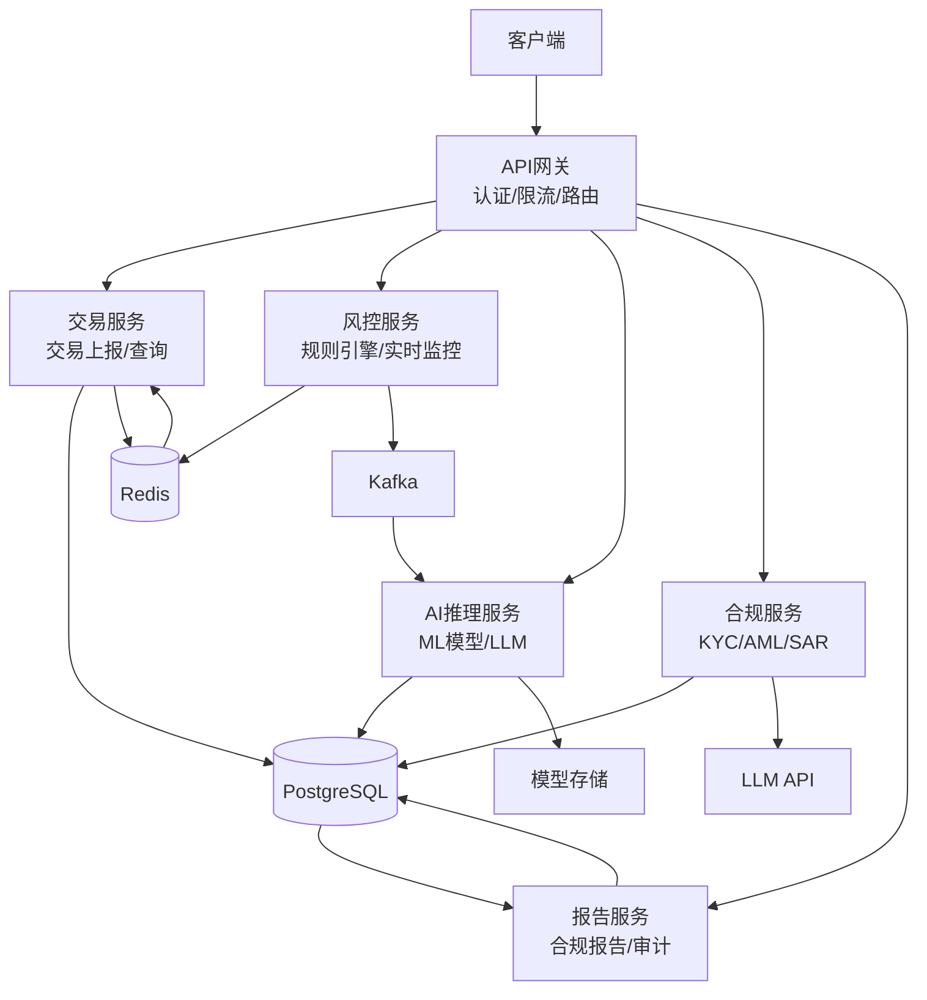
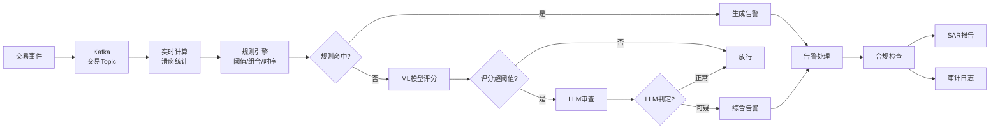

# 系统架构设计

## 项目概述

本项目构建一个实时交易监控+AI欺诈检测+合规审查的一体化平台，旨在为金融机构提供端到端的风险管理能力。系统整合规则引擎、机器学习模型和大语言模型，实现从交易上报到风险决策的全流程自动化。

### 核心能力

| 能力 | 说明 |
|------|------|
| 实时交易监控 | 毫秒级交易处理与风险判断 |
| AI欺诈检测 | 规则引擎+ML模型+LLM审查多层防御 |
| 合规审查 | KYC/AML/SAR全流程自动化 |
| 可视化看板 | 交易趋势、风险分布、告警统计实时展示 |
| 审计追踪 | 全操作留痕，满足监管要求 |

## 技术栈

| 层次 | 技术选型 | 说明 |
|------|----------|------|
| Web框架 | FastAPI | 高性能异步Python框架 |
| ORM | SQLAlchemy 2.0 | 类型安全的数据库操作 |
| 数据库 | PostgreSQL | 关系型主数据库 |
| 缓存 | Redis | 实时计数器、会话、队列 |
| 消息队列 | Kafka | 交易事件流式处理 |
| ML模型 | XGBoost | 欺诈评分模型 |
| AI服务 | LLM API | 合规审查与报告生成 |
| 前端 | React + Ant Design Pro | 管理后台界面 |
| 可视化 | ECharts | 数据图表展示 |
| 部署 | Docker Compose | 容器化部署 |

## 系统架构图



### 熔断降级与容错设计

金融级系统必须具备完善的容错机制，确保下游服务故障时业务不中断。

#### 熔断器模式

```python
from enum import Enum
from datetime import datetime, timedelta
import threading

class CircuitState(Enum):
    CLOSED = "closed"       # 正常通行
    OPEN = "open"           # 熔断，直接降级
    HALF_OPEN = "half_open" # 探测恢复

class CircuitBreaker:
    """熔断器 - 保护下游故障不影响整体系统"""

    def __init__(
        self,
        failure_threshold: int = 5,
        recovery_timeout: int = 30,
        half_open_max_calls: int = 3,
    ):
        self.failure_threshold = failure_threshold
        self.recovery_timeout = timedelta(seconds=recovery_timeout)
        self.half_open_max_calls = half_open_max_calls

        self._state = CircuitState.CLOSED
        self._failure_count = 0
        self._success_count = 0
        self._last_failure_time: datetime | None = None
        self._half_open_calls = 0
        self._lock = threading.Lock()

    @property
    def state(self) -> CircuitState:
        with self._lock:
            if self._state == CircuitState.OPEN:
                if (self._last_failure_time
                    and datetime.now() - self._last_failure_time > self.recovery_timeout):
                    self._state = CircuitState.HALF_OPEN
                    self._half_open_calls = 0
            return self._state

    def record_success(self):
        with self._lock:
            if self._state == CircuitState.HALF_OPEN:
                self._success_count += 1
                if self._success_count >= self.half_open_max_calls:
                    self._state = CircuitState.CLOSED
                    self._failure_count = 0
            self._failure_count = 0

    def record_failure(self):
        with self._lock:
            self._failure_count += 1
            self._last_failure_time = datetime.now()
            if self._failure_count >= self.failure_threshold:
                self._state = CircuitState.OPEN
```

#### 降级策略

| 下游服务 | 故障时降级策略 | 影响 |
|----------|----------------|------|
| AI模型服务 | 降级为纯规则引擎评分 | 准确率下降，但不中断交易 |
| LLM审查服务 | 跳过LLM审查，仅规则+模型评分 | 缺少解释性，但不影响核心决策 |
| Redis缓存 | 降级为数据库直查 | 延迟增加，需限流保护 |
| Kafka消息队列 | 降级为同步处理 | 吞吐下降，需限流 |

#### 超时配置

```python
# 各服务超时配置
TIMEOUT_CONFIG = {
    "rule_engine": 0.05,    # 规则引擎50ms
    "ml_model": 0.1,        # ML模型100ms
    "llm_review": 3.0,      # LLM审查3s（异步）
    "redis": 0.01,          # Redis 10ms
    "database": 0.5,        # 数据库500ms
}

# 总体SLA：交易评分 < 200ms（规则+ML），LLM异步补充
```

## 微服务拆分

### 服务划分原则

- 按业务领域拆分，每个服务独立部署
- 服务间通过REST API和消息队列通信
- 共享数据库但服务间不直接访问对方数据表
- 每个服务拥有独立的配置和日志

### 服务详情

| 服务 | 职责 | 核心API | 依赖 |
|------|------|---------|------|
| 交易服务 | 交易上报、查询、统计 | /api/v1/transactions | PostgreSQL, Redis |
| 风控服务 | 实时规则引擎、交易监控 | /api/v1/fraud/* | Redis, Kafka |
| AI推理服务 | ML模型推理、LLM审查 | /api/v1/ai/* | Model Store, LLM API |
| 合规服务 | KYC/AML检查、SAR报告 | /api/v1/compliance/* | PostgreSQL, LLM API |
| 报告服务 | 合规报告生成、审计日志 | /api/v1/reports/* | PostgreSQL |

## 数据流架构



### 数据流处理步骤

1. **交易上报**：客户端提交交易数据到API网关
2. **事件发布**：交易服务将交易事件发布到Kafka
3. **实时计算**：风控服务消费事件，计算滑窗统计特征
4. **规则匹配**：规则引擎评估预定义的阈值、组合和时序规则
5. **ML评分**：未命中规则的交易进入ML模型进行欺诈评分
6. **LLM审查**：中高风险交易提交LLM进行上下文分析
7. **综合决策**：融合规则、ML和LLM结果做出最终决策
8. **合规处理**：触发告警的交易进入合规检查流程
9. **报告生成**：合规服务生成SAR报告和审计日志

### 特征存储与模型治理

#### Feature Store（特征存储）

实时欺诈检测需要低延迟特征服务，且训练与推理的特征必须一致。

```python
from dataclasses import dataclass
from datetime import datetime

@dataclass
class FeatureDefinition:
    name: str
    dtype: str
    description: str
    source: str           # 来源表/流
    freshness_sla: int    # 数据新鲜度SLA（秒）
    default_value: any    # 特征缺失时的默认值

# 反欺诈核心特征定义
FRAUD_FEATURES = [
    FeatureDefinition("txn_amount_1h", "float", "1小时内交易总额", "redis_counter", 60, 0.0),
    FeatureDefinition("txn_count_1h", "int", "1小时内交易次数", "redis_counter", 60, 0),
    FeatureDefinition("unique_merchant_24h", "int", "24小时不同商户数", "redis_set", 300, 0),
    FeatureDefinition("device_risk_score", "float", "设备风险评分", "feature_compute", 3600, 0.5),
    FeatureDefinition("ip_reputation", "float", "IP信誉评分", "external_api", 86400, 0.5),
    FeatureDefinition("amount_deviation", "float", "金额偏离历史均值", "feature_compute", 3600, 0.0),
    FeatureDefinition("geo_distance_km", "float", "与常用位置距离", "feature_compute", 300, 0.0),
    FeatureDefinition("time_since_last_txn", "int", "距上次交易秒数", "redis_counter", 60, 9999),
]

class FeatureStore:
    """特征存储 - 统一训练与推理的特征计算逻辑"""

    async def get_features(
        self, account_id: str, feature_names: list[str]
    ) -> dict[str, any]:
        """获取实时特征（推理时使用）"""
        features = {}
        for name in feature_names:
            feat_def = next(f for f in FRAUD_FEATURES if f.name == name)
            try:
                value = await self._fetch_feature(account_id, feat_def)
                features[name] = value
            except Exception:
                features[name] = feat_def.default_value
        return features

    def compute_training_features(self, df: pd.DataFrame) -> pd.DataFrame:
        """计算训练特征（离线使用，逻辑与在线一致）"""
        # 与在线特征计算保持一致的逻辑
        pass
```

#### Model Registry（模型注册中心）

```python
@dataclass
class ModelVersion:
    model_id: str
    version: str
    algorithm: str
    training_data_hash: str
    training_data_range: tuple[str, str]  # (start_date, end_date)
    metrics: dict          # {"auc": 0.95, "ks": 0.72}
    status: str             # development/staging/production/archived
    approved_by: str | None
    deployed_at: datetime | None

class ModelRegistry:
    """模型注册中心 - 管理模型全生命周期"""

    def register(self, model: ModelVersion) -> str:
        """注册新模型版本"""
        if model.status == "production":
            raise ValueError("不能直接注册为production，需走审批流程")
        # 保存模型元数据
        return self._save(model)

    def promote(self, model_id: str, version: str, approver: str) -> None:
        """模型晋升（staging → production）"""
        model = self._get(model_id, version)
        if model.status != "staging":
            raise ValueError(f"只有staging模型可晋升，当前状态: {model.status}")

        # 灰度验证通过后才允许晋升
        canary = self._get_canary_result(model_id, version)
        if not canary.get("passed"):
            raise ValueError("灰度验证未通过，不可晋升")

        # 归档当前production模型
        self._archive_production(model_id)

        # 晋升新模型
        model.status = "production"
        model.approved_by = approver
        model.deployed_at = datetime.now()
        self._save(model)
```

## API设计概览

### RESTful API设计原则

- 使用名词复数表示资源集合
- HTTP方法语义：GET查询、POST创建、PUT更新、DELETE删除
- 统一响应格式和错误码
- API版本控制：/api/v1/

### 统一响应格式

```python
from pydantic import BaseModel
from typing import Optional, Any, List
from datetime import datetime


class APIResponse(BaseModel):
    """统一API响应格式"""
    code: int = 0
    message: str = "success"
    data: Optional[Any] = None
    timestamp: datetime = datetime.now()


class PaginatedResponse(BaseModel):
    """分页响应格式"""
    items: List[Any] = []
    total: int = 0
    page: int = 1
    page_size: int = 20
    total_pages: int = 0


class ErrorResponse(BaseModel):
    """错误响应格式"""
    code: int
    message: str
    detail: Optional[str] = None
```

### 核心API端点

| 方法 | 路径 | 说明 |
|------|------|------|
| POST | /api/v1/transactions | 交易上报 |
| GET | /api/v1/transactions | 交易查询(分页) |
| GET | /api/v1/transactions/{id} | 交易详情 |
| POST | /api/v1/transactions/batch | 批量交易导入 |
| POST | /api/v1/fraud/score | 实时欺诈评分 |
| POST | /api/v1/fraud/explain | 欺诈解释 |
| GET | /api/v1/fraud/rules | 规则列表 |
| PUT | /api/v1/fraud/rules/{id} | 规则更新 |
| GET | /api/v1/fraud/alerts | 欺诈告警列表 |
| POST | /api/v1/compliance/kyc | KYC检查 |
| POST | /api/v1/compliance/aml | AML检查 |
| POST | /api/v1/compliance/sar | 生成SAR报告 |
| GET | /api/v1/compliance/reports | 合规报告列表 |
| GET | /api/v1/reports/dashboard | 仪表盘数据 |
| GET | /api/v1/reports/audit-logs | 审计日志 |

## 安全设计

### 认证鉴权

```python
from datetime import datetime, timedelta
from typing import Optional
from jose import JWTError, jwt
from passlib.context import CryptContext
from fastapi import Depends, HTTPException, status
from fastapi.security import OAuth2PasswordBearer


SECRET_KEY = "your-secret-key-change-in-production"
ALGORITHM = "HS256"
ACCESS_TOKEN_EXPIRE_MINUTES = 30

pwd_context = CryptContext(schemes=["bcrypt"], deprecated="auto")
oauth2_scheme = OAuth2PasswordBearer(tokenUrl="/api/v1/auth/token")


class TokenData(BaseModel):
    username: Optional[str] = None
    role: Optional[str] = None


def create_access_token(data: dict, expires_delta: Optional[timedelta] = None) -> str:
    """创建JWT令牌"""
    to_encode = data.copy()
    expire = datetime.utcnow() + (expires_delta or timedelta(minutes=ACCESS_TOKEN_EXPIRE_MINUTES))
    to_encode.update({"exp": expire})
    return jwt.encode(to_encode, SECRET_KEY, algorithm=ALGORITHM)


def verify_token(token: str = Depends(oauth2_scheme)) -> TokenData:
    """验证JWT令牌"""
    credentials_exception = HTTPException(
        status_code=status.HTTP_401_UNAUTHORIZED,
        detail="无效的认证凭据",
        headers={"WWW-Authenticate": "Bearer"},
    )
    try:
        payload = jwt.decode(token, SECRET_KEY, algorithms=[ALGORITHM])
        username: str = payload.get("sub")
        role: str = payload.get("role")
        if username is None:
            raise credentials_exception
        return TokenData(username=username, role=role)
    except JWTError:
        raise credentials_exception


def require_role(allowed_roles: list):
    """角色权限装饰器"""
    def role_checker(current_user: TokenData = Depends(verify_token)):
        if current_user.role not in allowed_roles:
            raise HTTPException(
                status_code=status.HTTP_403_FORBIDDEN,
                detail="权限不足",
            )
        return current_user
    return role_checker
```

### 数据加密

- **传输加密**：所有API通信使用HTTPS/TLS 1.3
- **存储加密**：敏感字段(身份证号、银行卡号)使用AES-256加密存储
- **密钥管理**：使用环境变量或密钥管理服务，不硬编码密钥

### 审计日志

所有关键操作记录审计日志，满足监管追溯要求：

```python
class AuditLogger:
    """审计日志记录器"""

    @staticmethod
    def log(
        action: str,
        user: str,
        resource_type: str,
        resource_id: str,
        detail: str = "",
        ip_address: str = "",
    ):
        """记录审计日志"""
        log_entry = {
            "timestamp": datetime.now().isoformat(),
            "action": action,
            "user": user,
            "resource_type": resource_type,
            "resource_id": resource_id,
            "detail": detail,
            "ip_address": ip_address,
        }
        # 写入审计日志表
        return log_entry
```

## 部署架构

### Docker Compose配置概览

```yaml
services:
  api:
    build: .
    ports:
      - "8000:8000"
    environment:
      - DATABASE_URL=postgresql://postgres:password@db:5432/fraud_db
      - REDIS_URL=redis://redis:6379/0
      - KAFKA_BOOTSTRAP_SERVERS=kafka:9092
    depends_on:
      - db
      - redis
      - kafka

  db:
    image: postgres:16
    environment:
      POSTGRES_DB: fraud_db
      POSTGRES_USER: postgres
      POSTGRES_PASSWORD: password
    volumes:
      - pgdata:/var/lib/postgresql/data

  redis:
    image: redis:7-alpine
    ports:
      - "6379:6379"

  kafka:
    image: confluentinc/cp-kafka:7.5.0
    depends_on:
      - zookeeper
    environment:
      KAFKA_BROKER_ID: 1
      KAFKA_ZOOKEEPER_CONNECT: zookeeper:2181
      KAFKA_ADVERTISED_LISTENERS: PLAINTEXT://kafka:9092

  zookeeper:
    image: confluentinc/cp-zookeeper:7.5.0
    environment:
      ZOOKEEPER_CLIENT_PORT: 2181

  frontend:
    build: ./frontend
    ports:
      - "3000:80"
    depends_on:
      - api

volumes:
  pgdata:
```

### 项目目录结构

```
fraud-compliance-platform/
├── app/
│   ├── main.py                 # FastAPI应用入口
│   ├── config.py               # 配置管理
│   ├── database.py             # 数据库连接
│   ├── models/                 # SQLAlchemy模型
│   │   ├── user.py
│   │   ├── account.py
│   │   ├── transaction.py
│   │   ├── fraud.py
│   │   ├── compliance.py
│   │   └── audit.py
│   ├── schemas/                # Pydantic模式
│   │   ├── transaction.py
│   │   ├── fraud.py
│   │   ├── compliance.py
│   │   └── report.py
│   ├── services/               # 业务逻辑
│   │   ├── transaction_service.py
│   │   ├── fraud_engine.py
│   │   ├── ai_engine.py
│   │   ├── compliance_service.py
│   │   └── report_service.py
│   ├── routers/                # API路由
│   │   ├── auth.py
│   │   ├── transactions.py
│   │   ├── fraud.py
│   │   ├── compliance.py
│   │   └── reports.py
│   └── utils/                  # 工具函数
│       ├── redis_client.py
│       ├── kafka_client.py
│       └── audit_logger.py
├── alembic/                    # 数据库迁移
├── ml/                         # ML模型代码
│   ├── train.py
│   ├── predict.py
│   └── models/
├── frontend/                   # React前端
├── docker-compose.yml
├── Dockerfile
├── requirements.txt
└── .env
```

## 小结

本章完成了反欺诈与合规系统的整体架构设计。系统采用微服务架构，按业务领域拆分为交易服务、风控服务、AI推理服务、合规服务和报告服务。数据流采用事件驱动架构，通过Kafka实现交易事件的流式处理。安全设计覆盖认证鉴权、数据加密和审计日志三个维度。Docker Compose提供便捷的本地开发和部署方案。后续章节将深入各服务的具体实现。
