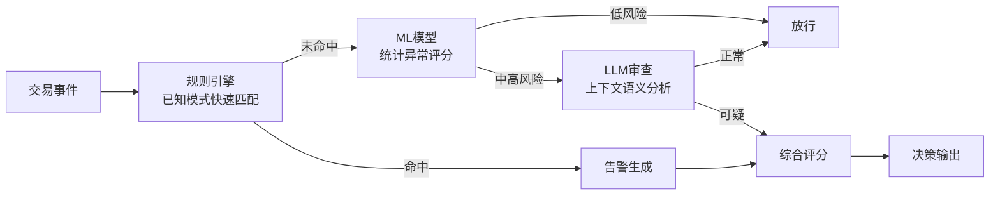

# 反欺诈AI引擎

## AI引擎架构

反欺诈AI引擎采用四层递进架构，从规则引擎到LLM审查逐层深入，实现多层次风险识别：



| 层级 | 技术 | 延迟 | 准确率 | 覆盖面 |
|------|------|------|--------|--------|
| 规则引擎 | 阈值/组合/时序规则 | < 5ms | 高(已知模式) | 窄 |
| ML模型 | XGBoost/LightGBM | < 50ms | 较高 | 较广 |
| LLM审查 | 大语言模型 | 1-5s | 高(复杂场景) | 广 |
| 综合评分 | 加权融合 | - | 最高 | 最广 |

## 特征工程

### 特征类别

```python
# app/services/feature_engineering.py
import numpy as np
import pandas as pd
from datetime import datetime, timedelta
from typing import List, Dict
from collections import defaultdict


class FeatureEngineer:
    """交易特征工程"""

    def __init__(self, redis_client=None):
        self.redis = redis_client

    def extract_features(self, transaction: dict, history: list = None) -> dict:
        """提取完整特征集"""
        features = {}

        # 1. 基础交易特征
        features.update(self._basic_features(transaction))

        # 2. 交易频率特征
        features.update(self._frequency_features(transaction))

        # 3. 金额统计特征
        features.update(self._amount_features(transaction))

        # 4. 时间特征
        features.update(self._time_features(transaction))

        # 5. 行为序列特征
        if history:
            features.update(self._sequence_features(transaction, history))

        return features

    def _basic_features(self, tx: dict) -> dict:
        """基础交易特征"""
        return {
            "amount": tx.get("amount", 0),
            "hour": tx.get("timestamp", datetime.now()).hour
            if isinstance(tx.get("timestamp"), datetime) else 0,
            "is_weekend": tx.get("is_weekend", False),
            "is_night": tx.get("is_night", False),
            "channel_encoded": self._encode_channel(tx.get("channel", "")),
            "type_encoded": self._encode_type(tx.get("transaction_type", "")),
        }

    def _frequency_features(self, tx: dict) -> dict:
        """交易频率特征"""
        account_id = tx.get("account_id", "")
        features = {}

        for window_name, seconds in [("300s", 300), ("3600s", 3600), ("86400s", 86400)]:
            if self.redis:
                count = self.redis.get_counter(f"tx:count:{account_id}:{seconds}")
                amount_sum = self.redis.get_float(f"tx:amount:{account_id}:{seconds}")
            else:
                count = tx.get(f"tx_count_{window_name}", 0)
                amount_sum = tx.get(f"tx_amount_{window_name}", 0)

            features[f"tx_count_{window_name}"] = count
            features[f"tx_amount_sum_{window_name}"] = amount_sum
            features[f"tx_amount_avg_{window_name}"] = (
                amount_sum / max(count, 1)
            )

        return features

    def _amount_features(self, tx: dict) -> dict:
        """金额统计特征"""
        amount = tx.get("amount", 0)
        account_id = tx.get("account_id", "")

        features = {
            "amount_log": np.log1p(amount),
            "amount_zscore": 0.0,  # 需要历史均值和标准差
        }

        # 如果Redis有统计数据，计算Z-Score
        if self.redis:
            stats = self.redis.get_hash(f"stats:{account_id}")
            if stats:
                mean = float(stats.get("amount_mean", amount))
                std = float(stats.get("amount_std", 1))
                features["amount_zscore"] = (amount - mean) / max(std, 1)

        return features

    def _time_features(self, tx: dict) -> dict:
        """时间特征"""
        ts = tx.get("timestamp", datetime.now())
        if isinstance(ts, str):
            ts = datetime.fromisoformat(ts)

        return {
            "hour": ts.hour,
            "day_of_week": ts.weekday(),
            "is_weekend": int(ts.weekday() >= 5),
            "is_night": int(ts.hour < 6 or ts.hour >= 22),
            "is_business_hour": int(9 <= ts.hour <= 17 and ts.weekday() < 5),
            "is_month_end": int(ts.day >= 28),
        }

    def _sequence_features(self, tx: dict, history: list) -> dict:
        """行为序列特征"""
        if not history:
            return {}

        recent_amounts = [h.get("amount", 0) for h in history[-10:]]
        recent_types = [h.get("transaction_type", "") for h in history[-10:]]

        features = {
            "recent_tx_count": len(history),
            "amount_trend": self._compute_trend(recent_amounts),
            "amount_change_rate": (
                (recent_amounts[-1] - recent_amounts[0]) / max(recent_amounts[0], 1)
                if len(recent_amounts) >= 2 else 0
            ),
            "unique_type_ratio": len(set(recent_types)) / max(len(recent_types), 1),
        }

        # 时间间隔特征
        if len(history) >= 2:
            timestamps = []
            for h in history[-5:]:
                ts = h.get("timestamp", "")
                if isinstance(ts, str):
                    timestamps.append(datetime.fromisoformat(ts).timestamp())
                elif isinstance(ts, datetime):
                    timestamps.append(ts.timestamp())

            if len(timestamps) >= 2:
                intervals = [
                    timestamps[i] - timestamps[i - 1]
                    for i in range(1, len(timestamps))
                ]
                features["interval_mean"] = np.mean(intervals)
                features["interval_std"] = np.std(intervals) if len(intervals) > 1 else 0
                features["interval_min"] = min(intervals)

        return features

    @staticmethod
    def _compute_trend(values: list) -> float:
        """计算趋势值(-1到1)"""
        if len(values) < 2:
            return 0.0
        increasing = sum(1 for i in range(1, len(values)) if values[i] > values[i - 1])
        decreasing = sum(1 for i in range(1, len(values)) if values[i] < values[i - 1])
        total = len(values) - 1
        if total == 0:
            return 0.0
        return (increasing - decreasing) / total

    @staticmethod
    def _encode_channel(channel: str) -> int:
        """渠道编码"""
        mapping = {"online": 1, "mobile": 2, "atm": 3, "counter": 4, "": 0}
        return mapping.get(channel, 0)

    @staticmethod
    def _encode_type(tx_type: str) -> int:
        """交易类型编码"""
        mapping = {"deposit": 1, "withdrawal": 2, "transfer": 3, "payment": 4, "cross_border": 5}
        return mapping.get(tx_type, 0)
```

## XGBoost欺诈评分模型

### 模型训练

```python
# ml/train.py
import numpy as np
import pandas as pd
import xgboost as xgb
from sklearn.model_selection import train_test_split, StratifiedKFold
from sklearn.metrics import (
    roc_auc_score, classification_report,
    average_precision_score, f1_score
)
import joblib
import json
from pathlib import Path


FEATURE_COLUMNS = [
    "amount", "amount_log", "amount_zscore",
    "hour", "day_of_week", "is_weekend", "is_night", "is_business_hour",
    "tx_count_300s", "tx_count_3600s", "tx_count_86400s",
    "tx_amount_sum_300s", "tx_amount_sum_3600s", "tx_amount_sum_86400s",
    "tx_amount_avg_300s", "tx_amount_avg_3600s", "tx_amount_avg_86400s",
    "channel_encoded", "type_encoded",
    "recent_tx_count", "amount_trend", "amount_change_rate",
    "unique_type_ratio", "interval_mean", "interval_std", "interval_min",
]


def generate_training_data(n_samples: int = 50000, fraud_ratio: float = 0.02) -> pd.DataFrame:
    """生成模拟训练数据"""
    np.random.seed(42)
    n_fraud = int(n_samples * fraud_ratio)
    n_normal = n_samples - n_fraud

    # 正常交易
    normal_data = {
        "amount": np.random.lognormal(8, 1.5, n_normal),
        "hour": np.random.choice(range(8, 22), n_normal),
        "is_night": 0,
        "tx_count_300s": np.random.poisson(0.5, n_normal),
        "tx_count_3600s": np.random.poisson(3, n_normal),
        "tx_count_86400s": np.random.poisson(8, n_normal),
        "is_fraud": np.zeros(n_normal, dtype=int),
    }

    # 欺诈交易
    fraud_data = {
        "amount": np.random.lognormal(10, 2, n_fraud),
        "hour": np.random.choice(list(range(0, 6)) + list(range(22, 24)), n_fraud),
        "is_night": 1,
        "tx_count_300s": np.random.poisson(4, n_fraud),
        "tx_count_3600s": np.random.poisson(15, n_fraud),
        "tx_count_86400s": np.random.poisson(40, n_fraud),
        "is_fraud": np.ones(n_fraud, dtype=int),
    }

    df = pd.concat([pd.DataFrame(normal_data), pd.DataFrame(fraud_data)], ignore_index=True)
    df = df.sample(frac=1, random_state=42).reset_index(drop=True)

    # 衍生特征
    df["amount_log"] = np.log1p(df["amount"])
    df["is_weekend"] = np.random.choice([0, 1], len(df), p=[0.7, 0.3])
    df["day_of_week"] = np.random.randint(0, 7, len(df))
    df["is_business_hour"] = ((df["hour"] >= 9) & (df["hour"] <= 17)).astype(int)
    df["tx_amount_sum_3600s"] = df["tx_count_3600s"] * df["amount"] / 3
    df["tx_amount_sum_86400s"] = df["tx_count_86400s"] * df["amount"] / 8
    df["tx_amount_sum_300s"] = df["tx_count_300s"] * df["amount"] / 0.5
    df["tx_amount_avg_300s"] = df["tx_amount_sum_300s"] / (df["tx_count_300s"] + 1)
    df["tx_amount_avg_3600s"] = df["tx_amount_sum_3600s"] / (df["tx_count_3600s"] + 1)
    df["tx_amount_avg_86400s"] = df["tx_amount_sum_86400s"] / (df["tx_count_86400s"] + 1)
    df["amount_zscore"] = (df["amount"] - df["amount"].mean()) / df["amount"].std()
    df["channel_encoded"] = np.random.randint(0, 5, len(df))
    df["type_encoded"] = np.random.randint(0, 6, len(df))
    df["recent_tx_count"] = df["tx_count_86400s"]
    df["amount_trend"] = np.random.uniform(-0.5, 0.5, len(df))
    df["amount_change_rate"] = np.random.uniform(-0.3, 0.3, len(df))
    df["unique_type_ratio"] = np.random.uniform(0.2, 1.0, len(df))
    df["interval_mean"] = np.random.exponential(3600, len(df))
    df["interval_std"] = df["interval_mean"] * 0.3
    df["interval_min"] = df["interval_mean"] * 0.1

    return df


def train_fraud_model(df: pd.DataFrame, model_path: str = "ml/models/fraud_model.json"):
    """训练欺诈检测模型"""
    X = df[FEATURE_COLUMNS]
    y = df["is_fraud"]

    X_train, X_test, y_train, y_test = train_test_split(
        X, y, test_size=0.2, random_state=42, stratify=y
    )

    scale_pos_weight = (y_train == 0).sum() / max((y_train == 1).sum(), 1)

    params = {
        "objective": "binary:logistic",
        "eval_metric": "aucpr",
        "max_depth": 6,
        "learning_rate": 0.05,
        "subsample": 0.8,
        "colsample_bytree": 0.8,
        "min_child_weight": 10,
        "scale_pos_weight": scale_pos_weight,
        "reg_alpha": 0.1,
        "reg_lambda": 1.0,
        "random_state": 42,
    }

    dtrain = xgb.DMatrix(X_train, label=y_train)
    dtest = xgb.DMatrix(X_test, label=y_test)

    model = xgb.train(
        params,
        dtrain,
        num_boost_round=500,
        evals=[(dtrain, "train"), (dtest, "test")],
        early_stopping_rounds=50,
        verbose_eval=100,
    )

    # 评估
    y_pred = model.predict(dtest)
    y_binary = (y_pred > 0.5).astype(int)

    print("\n===== 模型评估 =====")
    print(classification_report(y_test, y_binary, target_names=["正常", "欺诈"]))
    print(f"AUC: {roc_auc_score(y_test, y_pred):.4f}")
    print(f"PR-AUC: {average_precision_score(y_test, y_pred):.4f}")

    # 保存模型
    Path(model_path).parent.mkdir(parents=True, exist_ok=True)
    model.save_model(model_path)

    # 保存特征列表
    with open(Path(model_path).parent / "feature_columns.json", "w") as f:
        json.dump(FEATURE_COLUMNS, f)

    print(f"\n模型已保存到: {model_path}")
    return model


def cross_validate(df: pd.DataFrame, n_splits: int = 5):
    """交叉验证"""
    X = df[FEATURE_COLUMNS]
    y = df["is_fraud"]

    skf = StratifiedKFold(n_splits=n_splits, shuffle=True, random_state=42)
    auc_scores = []
    pr_auc_scores = []

    for fold, (train_idx, val_idx) in enumerate(skf.split(X, y)):
        X_train, X_val = X.iloc[train_idx], X.iloc[val_idx]
        y_train, y_val = y.iloc[train_idx], y.iloc[val_idx]

        scale_pos_weight = (y_train == 0).sum() / max((y_train == 1).sum(), 1)

        dtrain = xgb.DMatrix(X_train, label=y_train)
        dval = xgb.DMatrix(X_val, label=y_val)

        params = {
            "objective": "binary:logistic",
            "eval_metric": "auc",
            "max_depth": 6,
            "learning_rate": 0.05,
            "subsample": 0.8,
            "colsample_bytree": 0.8,
            "scale_pos_weight": scale_pos_weight,
            "random_state": 42,
        }

        model = xgb.train(
            params, dtrain, num_boost_round=300,
            evals=[(dval, "val")],
            early_stopping_rounds=30,
            verbose_eval=False,
        )

        y_pred = model.predict(dval)
        auc = roc_auc_score(y_val, y_pred)
        pr_auc = average_precision_score(y_val, y_pred)
        auc_scores.append(auc)
        pr_auc_scores.append(pr_auc)
        print(f"Fold {fold + 1}: AUC={auc:.4f}, PR-AUC={pr_auc:.4f}")

    print(f"\n平均AUC: {np.mean(auc_scores):.4f} +/- {np.std(auc_scores):.4f}")
    print(f"平均PR-AUC: {np.mean(pr_auc_scores):.4f} +/- {np.std(pr_auc_scores):.4f}")


if __name__ == "__main__":
    df = generate_training_data()
    model = train_fraud_model(df)
    print("\n===== 交叉验证 =====")
    cross_validate(df)
```

### 模型推理

```python
# ml/predict.py
import xgboost as xgb
import numpy as np
import json
from pathlib import Path


class FraudModelPredictor:
    """欺诈模型推理器"""

    def __init__(self, model_path: str = "ml/models/fraud_model.json"):
        self.model_path = model_path
        self.model = None
        self.feature_columns = None
        self._load_model()

    def _load_model(self):
        """加载模型"""
        model_dir = Path(self.model_path).parent
        if Path(self.model_path).exists():
            self.model = xgb.Booster()
            self.model.load_model(self.model_path)

            feature_path = model_dir / "feature_columns.json"
            if feature_path.exists():
                with open(feature_path) as f:
                    self.feature_columns = json.load(f)
            print(f"模型加载成功: {self.model_path}")
        else:
            print(f"模型文件不存在: {self.model_path}")

    def predict(self, features: dict) -> dict:
        """预测欺诈概率"""
        if self.model is None:
            return {"fraud_probability": 0.0, "is_fraud": False, "error": "模型未加载"}

        # 构建特征向量
        feature_vector = []
        for col in self.feature_columns:
            feature_vector.append(features.get(col, 0))

        dmatrix = xgb.DMatrix(np.array([feature_vector]))
        prob = self.model.predict(dmatrix)[0]

        return {
            "fraud_probability": float(prob),
            "is_fraud": prob > 0.5,
            "risk_level": self._score_to_risk_level(prob),
        }

    def predict_batch(self, features_list: list[dict]) -> list[dict]:
        """批量预测"""
        if self.model is None:
            return [{"fraud_probability": 0.0, "is_fraud": False}] * len(features_list)

        vectors = []
        for features in features_list:
            vector = [features.get(col, 0) for col in self.feature_columns]
            vectors.append(vector)

        dmatrix = xgb.DMatrix(np.array(vectors))
        probs = self.model.predict(dmatrix)

        return [
            {
                "fraud_probability": float(p),
                "is_fraud": p > 0.5,
                "risk_level": self._score_to_risk_level(p),
            }
            for p in probs
        ]

    @staticmethod
    def _score_to_risk_level(score: float) -> str:
        """评分转风险等级"""
        if score >= 0.8:
            return "critical"
        elif score >= 0.6:
            return "high"
        elif score >= 0.3:
            return "medium"
        return "low"

    def get_feature_importance(self, top_n: int = 10) -> list[dict]:
        """获取特征重要性"""
        if self.model is None:
            return []

        importance = self.model.get_score(importance_type="gain")
        sorted_importance = sorted(
            importance.items(), key=lambda x: x[1], reverse=True
        )[:top_n]

        return [
            {"feature": name, "importance": round(score, 4)}
            for name, score in sorted_importance
        ]
```

## 规则引擎与AI模型融合策略

> **重要架构决策**：LLM审查不放在实时交易决策路径中。交易评分由规则引擎+ML模型在200ms内完成，LLM审查用于异步事后复核（Post-Transaction Review），对高风险交易生成详细风险解释和合规审查意见。

#### 实时决策路径（< 200ms）

```
交易事件 → 规则引擎(50ms) + ML模型(100ms) → 融合评分 → 通过/拒绝/人工审核
```

#### 异步复核路径（1-5s）

```
高风险交易 → Kafka → LLM审查服务 → 风险解释 + 合规意见 → 更新告警详情 → 通知分析师
```

```python
class AsyncReviewService:
    """异步事后复核服务 - LLM审查不在关键路径"""

    async def submit_for_review(
        self,
        transaction_id: str,
        fraud_score: float,
        rule_results: dict,
        ml_features: dict,
    ) -> str:
        """提交高风险交易进行异步LLM复核"""
        review_id = f"REV-{uuid4().hex[:8]}"

        # 写入Kafka，由消费者异步处理
        await self.kafka_producer.send(
            topic="fraud-review-requests",
            value={
                "review_id": review_id,
                "transaction_id": transaction_id,
                "fraud_score": fraud_score,
                "rule_results": rule_results,
                "feature_summary": self._summarize_features(ml_features),
                "submitted_at": datetime.now().isoformat(),
            },
        )
        return review_id

    async def process_review(self, event: dict) -> dict:
        """消费Kafka消息，执行LLM审查"""
        review = await self.llm_review(
            transaction_id=event["transaction_id"],
            fraud_score=event["fraud_score"],
            rule_results=event["rule_results"],
            feature_summary=event["feature_summary"],
        )

        # 更新告警详情
        await self.update_alert_with_review(
            event["transaction_id"], review
        )

        # 通知分析师
        await self.notify_analyst(event["transaction_id"], review)

        return review
```

```python
# app/services/ai_engine.py
from datetime import datetime
from typing import Optional
import uuid

from app.services.fraud_engine import RuleEngine
from app.services.feature_engineering import FeatureEngineer
from ml.predict import FraudModelPredictor


class FraudAIEngine:
    """反欺诈AI引擎 - 规则+ML+LLM融合"""

    def __init__(self, redis_client=None, llm_client=None):
        self.rule_engine = RuleEngine()
        self.feature_engineer = FeatureEngineer(redis_client)
        self.ml_predictor = FraudModelPredictor()
        self.llm_client = llm_client

        # 融合权重
        self.rule_weight = 0.3
        self.ml_weight = 0.5
        self.llm_weight = 0.2

    def evaluate(self, transaction: dict, history: list = None) -> dict:
        """综合评估交易风险"""
        results = {
            "transaction_id": transaction.get("transaction_id", ""),
            "timestamp": datetime.utcnow().isoformat(),
            "rule_result": None,
            "ml_result": None,
            "llm_result": None,
            "final_score": 0.0,
            "final_risk_level": "low",
            "should_block": False,
            "explanation": "",
        }

        # 第一层：规则引擎
        rule_alerts = self.rule_engine.evaluate(transaction)
        if rule_alerts:
            results["rule_result"] = {
                "triggered": True,
                "alerts": rule_alerts,
                "max_risk_level": max(
                    a.get("risk_level", "low") for a in rule_alerts
                ),
            }
            # 如果规则命中critical级别，直接阻断
            if any(a.get("risk_level") == "critical" for a in rule_alerts):
                results["final_score"] = 1.0
                results["final_risk_level"] = "critical"
                results["should_block"] = True
                results["explanation"] = self._generate_rule_explanation(rule_alerts)
                return results

        # 第二层：ML模型评分
        features = self.feature_engineer.extract_features(transaction, history)
        ml_result = self.ml_predictor.predict(features)
        results["ml_result"] = ml_result

        # 如果ML评分很低，直接放行
        if ml_result["fraud_probability"] < 0.1:
            results["final_score"] = self._compute_fusion_score(
                rule_alerts, ml_result, None
            )
            results["final_risk_level"] = self._score_to_risk_level(results["final_score"])
            results["explanation"] = "ML模型评估为低风险"
            return results

        # 中高风险交易提交异步LLM审查
        if ml_result["fraud_probability"] >= 0.3 or (
            rule_alerts and any(a.get("risk_level") in ["high", "critical"] for a in rule_alerts)
        ):
            AsyncReviewService.submit_for_review(
                transaction, history, rule_alerts, ml_result
            )

        # 综合评分（仅规则+ML，不含LLM）
        results["final_score"] = self._compute_fusion_score(
            rule_alerts, ml_result, None
        )
        results["final_risk_level"] = self._score_to_risk_level(results["final_score"])
        results["should_block"] = results["final_score"] >= 0.8
        results["explanation"] = self._generate_explanation(
            rule_alerts, ml_result, None
        )

        return results

    def _compute_fusion_score(self, rule_alerts, ml_result, llm_result) -> float:
        """计算融合评分"""
        # 规则评分
        rule_score = 0.0
        if rule_alerts:
            level_map = {"critical": 1.0, "high": 0.7, "medium": 0.4, "low": 0.2}
            rule_score = max(
                level_map.get(a.get("risk_level", "low"), 0.2) for a in rule_alerts
            )

        # ML评分
        ml_score = ml_result.get("fraud_probability", 0.0) if ml_result else 0.0

        # LLM评分
        llm_score = 0.0
        if llm_result:
            llm_score = llm_result.get("risk_score", 0.0)

        # 加权融合
        total_weight = self.rule_weight + self.ml_weight + self.llm_weight
        if llm_result:
            score = (
                self.rule_weight * rule_score
                + self.ml_weight * ml_score
                + self.llm_weight * llm_score
            ) / total_weight
        else:
            # 无LLM结果时重新分配权重
            adjusted_total = self.rule_weight + self.ml_weight
            score = (
                self.rule_weight * rule_score
                + self.ml_weight * ml_score
            ) / adjusted_total

        return round(min(score, 1.0), 4)

    def _llm_review(self, transaction, history, rule_alerts, ml_result) -> dict:
        """LLM审查"""
        if not self.llm_client:
            return None

        prompt = self._build_llm_prompt(transaction, history, rule_alerts, ml_result)
        try:
            response = self.llm_client.analyze(prompt)
            return {
                "risk_score": response.get("risk_score", 0.5),
                "analysis": response.get("analysis", ""),
                "recommendation": response.get("recommendation", ""),
                "indicators": response.get("indicators", []),
            }
        except Exception as e:
            return {"error": str(e), "risk_score": 0.5}

    def _build_llm_prompt(self, transaction, history, rule_alerts, ml_result) -> str:
        """构建LLM审查提示"""
        parts = [
            "请分析以下交易是否存在欺诈风险：",
            f"交易金额: {transaction.get('amount', 0)} 元",
            f"交易类型: {transaction.get('transaction_type', '')}",
            f"交易时间: {transaction.get('timestamp', '')}",
            f"交易渠道: {transaction.get('channel', '')}",
            f"交易地点: {transaction.get('location', '')}",
        ]

        if rule_alerts:
            parts.append(f"触发的风控规则: {[a['rule_name'] for a in rule_alerts]}")

        if ml_result:
            parts.append(f"ML模型评分: {ml_result.get('fraud_probability', 0):.4f}")

        if history:
            parts.append(f"近期交易笔数: {len(history)}")

        parts.extend([
            "",
            "请从以下维度分析：",
            "1. 交易金额是否与账户日常行为匹配",
            "2. 交易时间、地点是否异常",
            "3. 是否存在结构性拆分等洗钱特征",
            "4. 综合风险评分(0-1)及建议",
            "",
            "请以JSON格式返回: {risk_score, analysis, recommendation, indicators}",
        ])

        return "\n".join(parts)

    @staticmethod
    def _score_to_risk_level(score: float) -> str:
        """评分转风险等级"""
        if score >= 0.8:
            return "critical"
        elif score >= 0.6:
            return "high"
        elif score >= 0.3:
            return "medium"
        return "low"

    def _generate_rule_explanation(self, rule_alerts: list) -> str:
        """生成规则解释"""
        alert_names = [a.get("rule_name", "") for a in rule_alerts]
        return f"触发风控规则: {', '.join(alert_names)}"

    def _generate_explanation(self, rule_alerts, ml_result, llm_result) -> str:
        """生成综合解释"""
        parts = []

        if rule_alerts:
            alert_names = [a.get("rule_name", "") for a in rule_alerts]
            parts.append(f"规则引擎: 触发{', '.join(alert_names)}")

        if ml_result:
            prob = ml_result.get("fraud_probability", 0)
            parts.append(f"ML模型: 欺诈概率{prob:.2%}")

        if llm_result and "analysis" in llm_result:
            parts.append(f"LLM审查: {llm_result['analysis'][:100]}")

        return "; ".join(parts)
```

## LLM合规审查

### LLM客户端

```python
# app/services/llm_client.py
import json
import os
from typing import Optional
import httpx


class LLMClient:
    """LLM API客户端"""

    def __init__(self):
        self.api_key = os.getenv("LLM_API_KEY", "")
        self.api_url = os.getenv("LLM_API_URL", "https://api.openai.com/v1/chat/completions")
        self.model = os.getenv("LLM_MODEL", "gpt-4")

    def analyze(self, prompt: str, max_tokens: int = 1000) -> dict:
        """调用LLM进行分析"""
        headers = {
            "Authorization": f"Bearer {self.api_key}",
            "Content-Type": "application/json",
        }

        payload = {
            "model": self.model,
            "messages": [
                {
                    "role": "system",
                    "content": (
                        "你是一名专业的金融反欺诈分析师。"
                        "请基于提供的交易信息进行风险分析，"
                        "并以JSON格式返回分析结果。"
                    ),
                },
                {"role": "user", "content": prompt},
            ],
            "max_tokens": max_tokens,
            "temperature": 0.1,
        }

        try:
            with httpx.Client(timeout=30.0) as client:
                response = client.post(self.api_url, headers=headers, json=payload)
                response.raise_for_status()
                content = response.json()["choices"][0]["message"]["content"]

                # 尝试解析JSON
                try:
                    return json.loads(content)
                except json.JSONDecodeError:
                    return {
                        "risk_score": 0.5,
                        "analysis": content,
                        "recommendation": "需要人工审查",
                        "indicators": [],
                    }
        except httpx.HTTPError as e:
            return {"error": str(e), "risk_score": 0.5, "analysis": "LLM调用失败"}

    def generate_sar_description(self, alert_data: dict) -> str:
        """LLM辅助生成SAR报告描述"""
        prompt = f"""基于以下告警信息，生成可疑活动报告的详细描述：

交易信息: 金额{alert_data.get('amount', 0)}元, 类型{alert_data.get('transaction_type', '')}
触发规则: {alert_data.get('triggered_rules', [])}
ML评分: {alert_data.get('ml_score', 0)}
账户历史: 近24小时交易{alert_data.get('recent_tx_count', 0)}笔

请以正式的合规报告风格撰写，包含：
1. 可疑活动概述
2. 具体可疑特征
3. 建议采取的措施"""

        result = self.analyze(prompt, max_tokens=2000)
        return result.get("analysis", "生成失败，需人工填写")
```

## 模型服务API

```python
# app/routers/fraud.py
from fastapi import APIRouter, Depends, HTTPException, Query
from sqlalchemy.orm import Session
from typing import Optional
from datetime import datetime

from app.database import get_db
from app.models.fraud import FraudRule, FraudAlert, AlertStatus
from app.schemas.common import APIResponse
from pydantic import BaseModel, Field


router = APIRouter(prefix="/api/v1/fraud", tags=["反欺诈AI引擎"])


class FraudScoreRequest(BaseModel):
    """欺诈评分请求"""
    transaction_id: str = Field(..., description="交易ID")
    account_id: int = Field(..., description="账户ID")
    amount: float = Field(..., gt=0, description="交易金额")
    transaction_type: str = Field(..., description="交易类型")
    channel: Optional[str] = Field(None, description="交易渠道")
    location: Optional[str] = Field(None, description="交易地点")
    timestamp: datetime = Field(..., description="交易时间")


class FraudExplainRequest(BaseModel):
    """欺诈解释请求"""
    transaction_id: str = Field(..., description="交易ID")
    include_llm: bool = Field(default=True, description="是否包含LLM审查")


class RuleUpdateRequest(BaseModel):
    """规则更新请求"""
    name: Optional[str] = None
    description: Optional[str] = None
    parameters: Optional[dict] = None
    enabled: Optional[bool] = None
    risk_level: Optional[str] = None


# AI引擎实例（实际应用中通过依赖注入）
_ai_engine = None


def get_ai_engine():
    global _ai_engine
    if _ai_engine is None:
        from app.services.ai_engine import FraudAIEngine
        _ai_engine = FraudAIEngine()
    return _ai_engine


@router.post("/score", response_model=APIResponse, summary="实时欺诈评分")
def score_transaction(
    request: FraudScoreRequest,
    engine=Depends(get_ai_engine),
):
    """对交易进行实时欺诈评分"""
    transaction = {
        "transaction_id": request.transaction_id,
        "account_id": request.account_id,
        "amount": request.amount,
        "transaction_type": request.transaction_type,
        "channel": request.channel,
        "location": request.location,
        "timestamp": request.timestamp,
        "hour": request.timestamp.hour,
        "is_night": request.timestamp.hour < 6 or request.timestamp.hour >= 22,
        "is_weekend": request.timestamp.weekday() >= 5,
    }

    result = engine.evaluate(transaction)

    return APIResponse(data={
        "transaction_id": request.transaction_id,
        "risk_score": result["final_score"],
        "risk_level": result["final_risk_level"],
        "should_block": result["should_block"],
        "explanation": result["explanation"],
        "rule_triggered": result["rule_result"] is not None,
        "ml_score": result["ml_result"].get("fraud_probability", 0) if result["ml_result"] else 0,
    })


@router.post("/explain", response_model=APIResponse, summary="欺诈解释")
def explain_fraud(
    request: FraudExplainRequest,
    engine=Depends(get_ai_engine),
):
    """获取欺诈评分的详细解释"""
    transaction = {"transaction_id": request.transaction_id}
    result = engine.evaluate(transaction)

    explanation = {
        "transaction_id": request.transaction_id,
        "final_score": result["final_score"],
        "risk_level": result["final_risk_level"],
        "rule_analysis": result["rule_result"],
        "ml_analysis": result["ml_result"],
        "llm_analysis": result["llm_result"] if request.include_llm else None,
        "explanation": result["explanation"],
    }

    return APIResponse(data=explanation)


@router.get("/rules", response_model=APIResponse, summary="规则列表")
def list_rules(
    enabled: Optional[bool] = Query(None),
    db: Session = Depends(get_db),
):
    """获取欺诈检测规则列表"""
    query = db.query(FraudRule)
    if enabled is not None:
        query = query.filter(FraudRule.enabled == enabled)

    rules = query.order_by(FraudRule.priority).all()
    return APIResponse(data=[
        {
            "id": r.id,
            "rule_id": r.rule_id,
            "name": r.name,
            "rule_type": r.rule_type.value if hasattr(r.rule_type, 'value') else r.rule_type,
            "description": r.description,
            "risk_level": r.risk_level,
            "parameters": r.parameters,
            "enabled": r.enabled,
            "priority": r.priority,
            "hit_count": r.hit_count,
            "false_positive_count": r.false_positive_count,
        }
        for r in rules
    ])


@router.put("/rules/{rule_id}", response_model=APIResponse, summary="规则更新")
def update_rule(
    rule_id: int,
    request: RuleUpdateRequest,
    db: Session = Depends(get_db),
):
    """更新欺诈检测规则"""
    rule = db.query(FraudRule).filter(FraudRule.id == rule_id).first()
    if not rule:
        raise HTTPException(status_code=404, detail="规则不存在")

    if request.name is not None:
        rule.name = request.name
    if request.description is not None:
        rule.description = request.description
    if request.parameters is not None:
        rule.parameters = request.parameters
    if request.enabled is not None:
        rule.enabled = request.enabled
    if request.risk_level is not None:
        rule.risk_level = request.risk_level
    rule.updated_at = datetime.utcnow()

    db.commit()

    return APIResponse(data={
        "id": rule.id,
        "rule_id": rule.rule_id,
        "name": rule.name,
        "enabled": rule.enabled,
    })


@router.get("/alerts", response_model=APIResponse, summary="欺诈告警列表")
def list_alerts(
    status: Optional[str] = Query(None),
    risk_level: Optional[str] = Query(None),
    page: int = Query(1, ge=1),
    page_size: int = Query(20, ge=1, le=100),
    db: Session = Depends(get_db),
):
    """查询欺诈告警列表"""
    import math
    query = db.query(FraudAlert)

    if status:
        query = query.filter(FraudAlert.status == status)
    if risk_level:
        query = query.filter(FraudAlert.risk_level == risk_level)

    total = query.count()
    total_pages = math.ceil(total / page_size)
    alerts = (
        query.order_by(FraudAlert.created_at.desc())
        .offset((page - 1) * page_size)
        .limit(page_size)
        .all()
    )

    return APIResponse(data={
        "items": [
            {
                "id": a.id,
                "alert_id": a.alert_id,
                "transaction_id": a.transaction_id,
                "risk_score": a.risk_score,
                "risk_level": a.risk_level,
                "ml_score": a.ml_score,
                "status": a.status.value if hasattr(a.status, 'value') else a.status,
                "triggered_rules": a.triggered_rules,
                "explanation": a.explanation,
                "assigned_to": a.assigned_to,
                "created_at": a.created_at.isoformat() if a.created_at else None,
            }
            for a in alerts
        ],
        "total": total,
        "page": page,
        "page_size": page_size,
        "total_pages": total_pages,
    })
```

## 模型训练Pipeline

```python
# ml/pipeline.py
"""模型训练Pipeline - 数据准备、训练、评估、注册"""
import os
from datetime import datetime
from pathlib import Path

from ml.train import generate_training_data, train_fraud_model, cross_validate


class ModelTrainingPipeline:
    """模型训练Pipeline"""

    def __init__(self, model_dir: str = "ml/models"):
        self.model_dir = model_dir
        self.timestamp = datetime.now().strftime("%Y%m%d_%H%M%S")

    def run(self, n_samples: int = 50000, fraud_ratio: float = 0.02):
        """执行完整的训练流程"""
        print(f"===== 模型训练Pipeline - {self.timestamp} =====")

        # Step 1: 数据准备
        print("\n[Step 1] 生成训练数据...")
        df = generate_training_data(n_samples, fraud_ratio)
        print(f"数据量: {len(df)}, 欺诈比例: {df['is_fraud'].mean():.4f}")

        # Step 2: 交叉验证
        print("\n[Step 2] 交叉验证...")
        cross_validate(df)

        # Step 3: 训练最终模型
        print("\n[Step 3] 训练最终模型...")
        model_path = os.path.join(
            self.model_dir, f"fraud_model_{self.timestamp}.json"
        )
        model = train_fraud_model(df, model_path)

        # Step 4: 更新生产模型
        print("\n[Step 4] 更新生产模型...")
        production_path = os.path.join(self.model_dir, "fraud_model.json")
        model.save_model(production_path)
        print(f"生产模型已更新: {production_path}")

        print(f"\n===== Pipeline完成 =====")


if __name__ == "__main__":
    pipeline = ModelTrainingPipeline()
    pipeline.run()
```

## 小结

反欺诈AI引擎采用四层递进架构，从规则引擎快速匹配到ML模型统计评分，再到LLM上下文审查，实现了多层次的风险识别能力。特征工程提取交易频率、金额统计、时间和行为序列四大类特征。XGBoost模型训练流程包含数据生成、交叉验证和模型保存。FraudAIEngine类将规则、ML和LLM三层结果进行加权融合，输出综合风险评分。模型服务API提供实时评分、欺诈解释和规则管理等功能。下一章将实现合规检查与报告服务。
