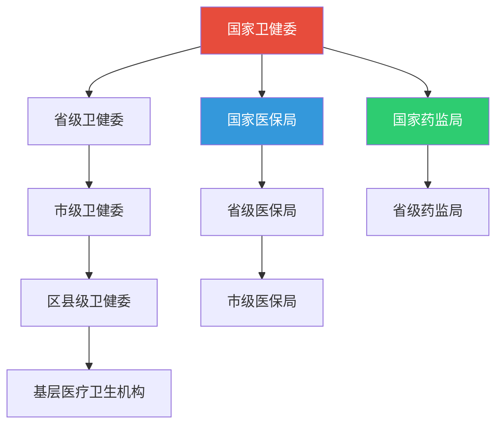
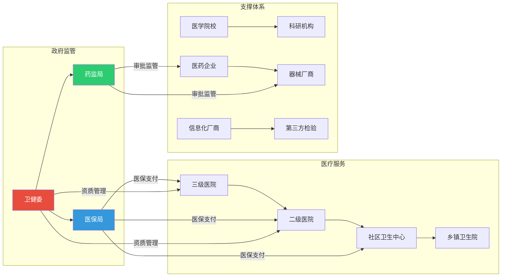
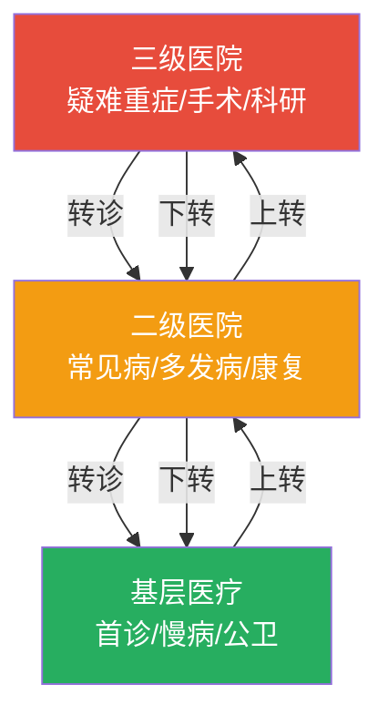
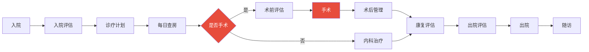
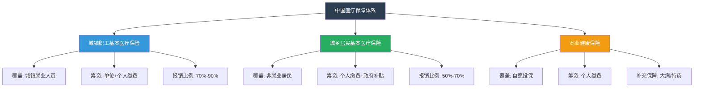
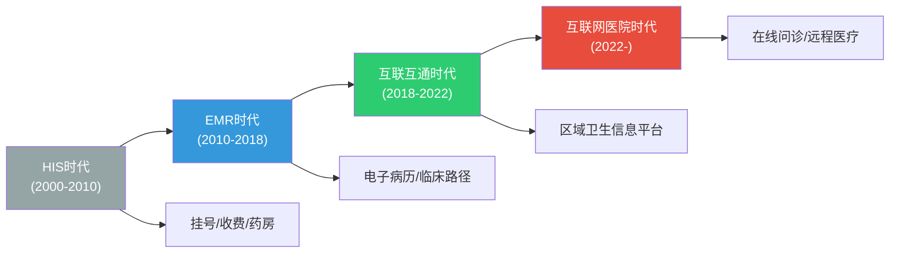

# 医疗体系全景

## 中国医疗体系架构

中国医疗体系采用"政府主导、多方参与"的模式，形成了从国家到基层的四级架构。

### 体系层级



| 层级 | 机构 | 职责 |
|------|------|------|
| 国家级 | 国家卫健委 | 制定全国卫生政策、行业标准、资源配置 |
| 省级 | 省卫健委 | 区域卫生规划、医疗机构准入审批 |
| 市级 | 市卫健委 | 医疗服务监管、公共卫生应急 |
| 区县级 | 区县卫健委 | 基层医疗管理、基本公共卫生服务 |

### 医疗行业参与者关系图



## 医院分级制度

中国医院实行分级管理制度，按功能、任务、规模分为三级十等。

### 医院等级划分

| 等级 | 全称 | 床位数 | 功能定位 | 典型代表 |
|------|------|--------|----------|----------|
| 三级特等 | 三级特等医院 | 1000+ | 全国性疑难重症诊疗中心 | 北京协和医院 |
| 三级甲等 | 三级甲等医院 | 500+ | 省/区域医疗中心，医教研一体 | 省人民医院 |
| 三级乙等 | 三级乙等医院 | 500+ | 市级医疗中心 | 市中心医院 |
| 二级甲等 | 二级甲等医院 | 250+ | 县/区级医疗中心 | 县人民医院 |
| 二级乙等 | 二级乙等医院 | 100+ | 社区综合医疗 | 区级医院 |
| 一级 | 一级医院 | 20+ | 社区/乡镇基本医疗 | 社区卫生中心 |

### 分级诊疗体系



分级诊疗的核心原则是"基层首诊、双向转诊、急慢分治、上下联动"。

## 医疗服务场景

### 门诊服务场景

门诊是医院最主要的医疗服务场景，日均接诊量是衡量医院规模的核心指标。

```
患者就诊流程：
挂号 → 候诊 → 就诊(问诊+查体) → 检查/检验 → 诊断 → 处方 → 取药 → 离院
```

| 场景 | 核心环节 | AI应用点 |
|------|----------|----------|
| 普通门诊 | 挂号→就诊→处方 | 智能分诊、辅助诊断 |
| 急诊 | 分诊→抢救→检查→处置 | 急重症识别、风险预测 |
| 专科门诊 | 专科检查→诊断→治疗 | 影像AI、检验智能审核 |
| 体检中心 | 登记→检查→报告 | 影像筛查、异常预警 |

### 住院服务场景



### 手术场景

| 阶段 | 内容 | AI应用 |
|------|------|--------|
| 术前 | 评估、方案制定、知情同意 | 手术风险预测、方案推荐 |
| 术中 | 麻醉、手术操作、生命体征监测 | 术中导航、风险预警 |
| 术后 | 监护、并发症预防、康复 | 并发症预测、康复计划生成 |

### 慢病管理场景

慢病管理是基层医疗的核心任务，涉及长期随访和健康干预。

```python
# 慢病管理随访计划示例
CHRONIC_DISEASE_FOLLOW_UP = {
    "高血压": {
        "follow_up_interval_days": 30,
        "check_items": ["血压测量", "心率", "用药依从性评估"],
        "alert_threshold": {
            "systolic_high": 180,    # mmHg
            "systolic_low": 90,
            "diastolic_high": 110,
            "diastolic_low": 60,
        },
        "lifestyle_advice": ["低盐饮食", "规律运动", "戒烟限酒", "心理平衡"],
    },
    "糖尿病": {
        "follow_up_interval_days": 90,
        "check_items": ["空腹血糖", "糖化血红蛋白(HbA1c)", "足部检查", "视网膜检查"],
        "alert_threshold": {
            "fasting_glucose_high": 11.1,   # mmol/L
            "hba1c_high": 9.0,             # %
        },
        "lifestyle_advice": ["饮食控制", "规律运动", "血糖监测", "足部护理"],
    },
    "冠心病": {
        "follow_up_interval_days": 60,
        "check_items": ["心电图", "血脂", "肝肾功能", "用药调整"],
        "alert_threshold": {
            "ldl_high": 3.4,   # mmol/L
        },
    },
}
```

## 医疗保障体系

### 三大医疗保障制度



| 保障类型 | 参保对象 | 缴费方式 | 门诊报销 | 住院报销 | 封顶线 |
|----------|----------|----------|----------|----------|--------|
| 职工医保 | 在职职工 | 单位8%+个人2% | 50%-70% | 85%-95% | 年工资6倍 |
| 居民医保 | 城乡居民 | 个人+财政补贴 | 50%-60% | 60%-75% | 20-30万 |
| 大病保险 | 参保人员 | 医保基金划拨 | - | 额外50%-60% | 无上限 |

### 医保支付方式改革

当前医保支付正从"按项目付费"向"按病种付费(DRG/DIP)"转型。

| 支付方式 | 含义 | 优缺点 |
|----------|------|--------|
| 按项目付费 | 按医疗服务项目逐项结算 | 诱导过度医疗，已逐步取消 |
| 按病种付费(DRG) | 按诊断相关组定额支付 | 控费效果好，可能推诿重症 |
| 按病种分值付费(DIP) | 基于大数据的病种分值付费 | 更精细，适合基层推广 |
| 按人头付费 | 按管理人数预付 | 适合慢病管理，需防服务不足 |

## 医疗信息化演进

中国医疗信息化经历了从单机系统到互联网医院的四个阶段。

### 演进路线



### 各阶段特征

| 阶段 | 时间 | 核心系统 | 关键标准 | 数据特征 |
|------|------|----------|----------|----------|
| HIS | 2000-2010 | 医院信息系统 | 无统一标准 | 结构化，孤岛 |
| EMR | 2010-2018 | 电子病历系统 | 病历书写规范 | 半结构化 |
| 互联互通 | 2018-2022 | 区域卫生信息平台 | HL7 FHIR | 标准化共享 |
| 互联网医院 | 2022- | 智慧医疗平台 | 互联网诊疗规范 | 多模态融合 |

### 核心信息系统

```python
# 医院信息系统架构示例
HOSPITAL_INFORMATION_SYSTEMS = {
    "HIS": {
        "full_name": "Hospital Information System",
        "中文名": "医院信息系统",
        "核心功能": ["挂号管理", "收费管理", "药房管理", "住院管理"],
        "用户": "全院",
    },
    "EMR": {
        "full_name": "Electronic Medical Record",
        "中文名": "电子病历系统",
        "核心功能": ["病历书写", "医嘱管理", "临床路径", "病历质控"],
        "用户": "临床医生",
    },
    "LIS": {
        "full_name": "Laboratory Information System",
        "中文名": "检验信息系统",
        "核心功能": ["检验申请", "标本管理", "结果审核", "报告发布"],
        "用户": "检验科",
    },
    "PACS": {
        "full_name": "Picture Archiving and Communication System",
        "中文名": "影像归档与通信系统",
        "核心功能": ["影像采集", "存储管理", "阅片诊断", "报告生成"],
        "用户": "放射科",
    },
    "RIS": {
        "full_name": "Radiology Information System",
        "中文名": "放射科信息系统",
        "核心功能": ["检查预约", "检查调度", "报告管理", "统计查询"],
        "user": "放射科",
    },
    "CIS": {
        "full_name": "Clinical Information System",
        "中文名": "临床信息系统",
        "核心功能": ["医嘱处理", "临床路径", "护理记录", "手术麻醉"],
        "用户": "临床科室",
    },
}
```

## 医疗行业核心术语表

| 术语 | 英文 | 含义 |
|------|------|------|
| 门诊 | Outpatient | 不需住院的诊疗服务 |
| 住院 | Inpatient | 需住院观察治疗的诊疗服务 |
| 分级诊疗 | Hierarchical Diagnosis and Treatment | 按疾病轻重缓急分级就医 |
| 双向转诊 | Two-way Referral | 上下级医院间转诊制度 |
| 临床路径 | Clinical Pathway | 标准化诊疗流程 |
| DRG | Diagnosis Related Groups | 诊断相关组，医保支付方式 |
| DIP | Diagnosis-Intervention Packet | 病种分值付费 |
| 三医联动 | Three-Medical Linkage | 医疗、医保、医药联动改革 |
| 医联体 | Medical Consortium | 区域医疗联合体 |
| 医共体 | Medical Community | 县域医疗共同体 |
| 总药师制度 | Chief Pharmacist System | 医院药事管理改革 |
| VTE | Venous Thromboembolism | 静脉血栓栓塞症 |
| ADR | Adverse Drug Reaction | 药品不良反应 |
| MDRO | Multidrug-Resistant Organism | 多重耐药菌 |
| HIS | Hospital Information System | 医院信息系统 |
| EMR | Electronic Medical Record | 电子病历 |
| EHR | Electronic Health Record | 电子健康档案 |
| PACS | Picture Archiving and Communication System | 影像归档与通信系统 |
| LIS | Laboratory Information System | 检验信息系统 |
| DICOM | Digital Imaging and Communications in Medicine | 医学数字成像通信标准 |
| HL7 | Health Level Seven | 卫生信息交换标准 |
| FHIR | Fast Healthcare Interoperability Resources | 快速医疗互操作资源 |
| ICD-10 | International Classification of Diseases 10th | 国际疾病分类第十次修订本 |
| SNOMED CT | Systematized Nomenclature of Medicine - Clinical Terms | 医学系统命名法-临床术语 |
| CPOE | Computerized Physician Order Entry | 计算机化医嘱录入 |
| CDSS | Clinical Decision Support System | 临床决策支持系统 |
