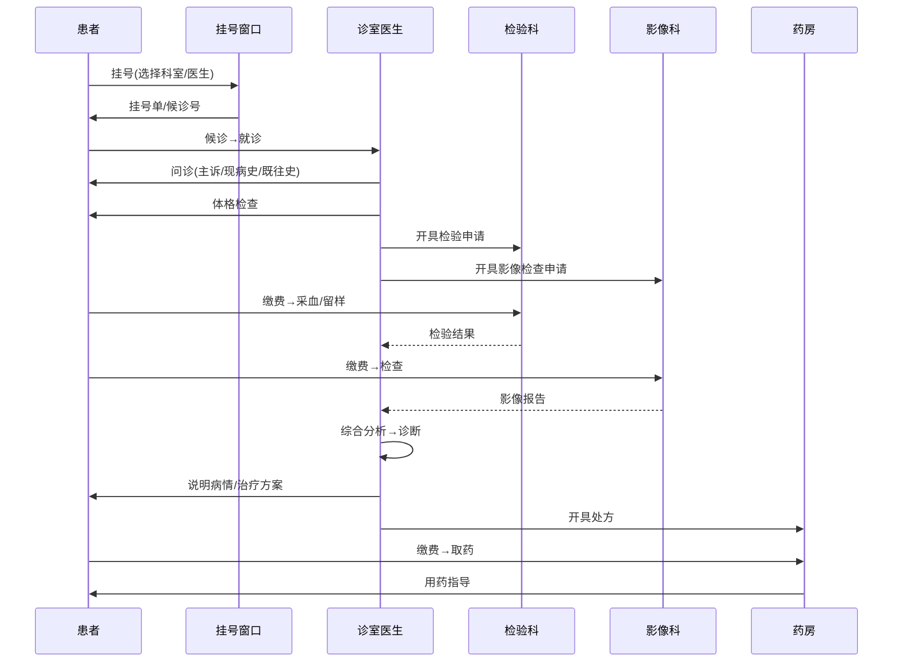
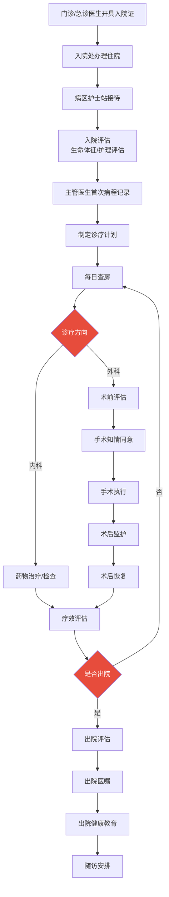
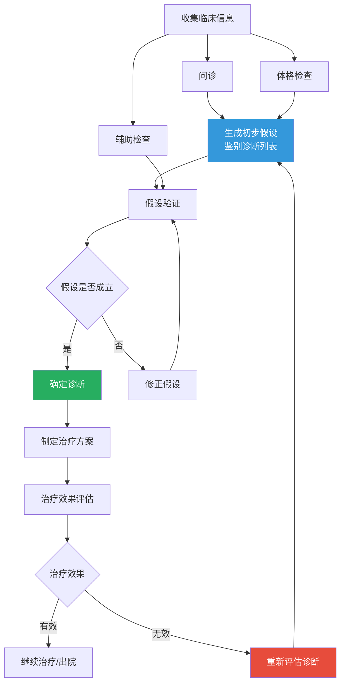
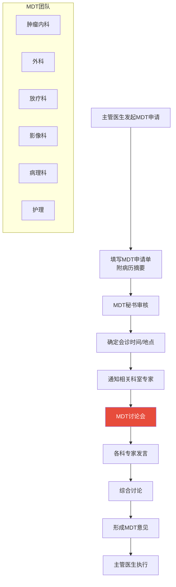
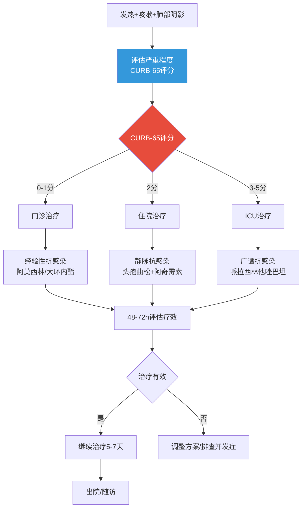

# 临床诊疗流程

## 门诊诊疗流程

门诊是医院最常见的医疗服务场景，每天处理大量患者的诊疗需求。

### 门诊全流程



### 问诊内容结构

```python
from pydantic import BaseModel, Field
from typing import Optional
from datetime import date
from enum import Enum

class PainSeverity(str, Enum):
    mild = "轻度"
    moderate = "中度"
    severe = "重度"

class ChiefComplaint(BaseModel):
    """主诉模型"""
    chief_complaint: str = Field(..., description="主要症状及持续时间，如：反复上腹痛3天")
    onset_time: str = Field(..., description="起病时间，如：3天前")
    duration: str = Field(..., description="持续时间，如：间歇性，每次2-3小时")

class PresentIllness(BaseModel):
    """现病史模型"""
    onset_manner: str = Field(..., description="起病方式：急性/慢性/隐匿")
    cause_or_trigger: Optional[str] = Field(None, description="诱因，如：饱餐后")
    symptom_details: list[str] = Field(default_factory=list, description="症状详细描述")
    symptom_progression: str = Field(..., description="病情演变")
    negative_symptoms: list[str] = Field(default_factory=list, description="鉴别诊断相关阴性症状")
    treatment_history: Optional[str] = Field(None, description="就诊及治疗经过")
    general_condition: str = Field(..., description="一般情况：饮食/睡眠/大小便/体重")

class PastHistory(BaseModel):
    """既往史模型"""
    chronic_diseases: list[str] = Field(default_factory=list, description="慢性疾病")
    surgeries: list[str] = Field(default_factory=list, description="手术史")
    allergies: list[str] = Field(default_factory=list, description="过敏史：药物/食物")
    transfusion_history: Optional[str] = Field(None, description="输血史")
    infectious_diseases: list[str] = Field(default_factory=list, description="传染病史")

class PersonalHistory(BaseModel):
    """个人史模型"""
    birth_place: Optional[str] = Field(None, description="出生地")
    occupation: Optional[str] = Field(None, description="职业")
    smoking: Optional[str] = Field(None, description="吸烟史")
    drinking: Optional[str] = Field(None, description="饮酒史")
    marital_status: Optional[str] = Field(None, description="婚姻状况")

class FamilyHistory(BaseModel):
    """家族史模型"""
    hereditary_diseases: list[str] = Field(default_factory=list, description="家族遗传病")
    family_chronic: list[str] = Field(default_factory=list, description="家族慢病史")

class MedicalInterview(BaseModel):
    """完整问诊记录"""
    chief_complaint: ChiefComplaint
    present_illness: PresentIllness
    past_history: PastHistory
    personal_history: PersonalHistory
    family_history: FamilyHistory
```

## 住院诊疗流程

住院诊疗比门诊更为复杂，涉及多科室协作和持续监护。

### 住院全流程



### 查房制度

| 查房类型 | 频率 | 参与人员 | 内容 |
|----------|------|----------|------|
| 主任查房 | 每周1-2次 | 科主任+医疗组 | 疑难病例讨论、诊疗方案制定 |
| 主治查房 | 每日1次 | 主治医师+住院医师 | 病情评估、治疗方案调整 |
| 住院总查房 | 每日2次 | 住院医师 | 日常病情观察、医嘱执行 |
| 护理查房 | 每日3次 | 责任护士 | 生命体征、护理措施 |

## 临床决策过程

临床决策是医生综合患者信息做出诊断和治疗选择的核心过程。

### 诊断推理流程



### 鉴别诊断思维

鉴别诊断是临床思维的核心，通过排除法逐步缩小诊断范围。

```python
from dataclasses import dataclass, field
from typing import Optional

@dataclass
class DifferentialDiagnosis:
    """鉴别诊断模型"""
    disease_name: str
    icd10_code: str
    probability: float  # 0.0 - 1.0
    supporting_evidence: list[str] = field(default_factory=list)
    against_evidence: list[str] = field(default_factory=list)
    required_exams: list[str] = field(default_factory=list)
    key_differentiator: str = ""

@dataclass
class DiagnosisProcess:
    """诊断过程模型"""
    chief_complaint: str
    differential_list: list[DifferentialDiagnosis] = field(default_factory=list)

    def add_differential(self, dd: DifferentialDiagnosis):
        self.differential_list.append(dd)
        self.differential_list.sort(key=lambda x: x.probability, reverse=True)

    def get_top_differentials(self, n: int = 3) -> list[DifferentialDiagnosis]:
        return self.differential_list[:n]

    def refine_by_exam_result(self, exam_name: str, result: str):
        """根据检查结果调整鉴别诊断排序"""
        for dd in self.differential_list:
            if exam_name in dd.required_exams:
                # 如果检查结果支持该诊断，提高概率
                if result in dd.supporting_evidence:
                    dd.probability = min(1.0, dd.probability * 1.3)
                elif result in dd.against_evidence:
                    dd.probability = max(0.0, dd.probability * 0.5)

        self.differential_list.sort(key=lambda x: x.probability, reverse=True)

# 使用示例：胸痛鉴别诊断
chest_pain_ddx = DiagnosisProcess(
    chief_complaint="突发胸痛2小时",
    differential_list=[
        DifferentialDiagnosis(
            disease_name="急性心肌梗死",
            icd10_code="I21.9",
            probability=0.45,
            supporting_evidence=["胸骨后压榨性疼痛", "心电图ST段抬高", "肌钙蛋白升高"],
            against_evidence=["胸膜摩擦音", "深呼吸加重"],
            required_exams=["心电图", "心肌酶谱", "冠脉造影"],
            key_differentiator="心电图+心肌标志物",
        ),
        DifferentialDiagnosis(
            disease_name="主动脉夹层",
            icd10_code="I71.0",
            probability=0.20,
            supporting_evidence=["撕裂样疼痛", "血压不对称", "纵隔增宽"],
            against_evidence=["心电图无ST抬高", "心肌酶正常"],
            required_exams=["增强CT", "超声心动图"],
            key_differentiator="CT血管造影",
        ),
        DifferentialDiagnosis(
            disease_name="肺栓塞",
            icd10_code="I26.9",
            probability=0.15,
            supporting_evidence=["呼吸困难", "D-二聚体升高", "低氧血症"],
            against_evidence=["无下肢深静脉血栓"],
            required_exams=["D-二聚体", "CT肺动脉造影", "下肢静脉超声"],
            key_differentiator="CTPA",
        ),
        DifferentialDiagnosis(
            disease_name="气胸",
            icd10_code="J93.9",
            probability=0.10,
            supporting_evidence=["突发胸痛", "呼吸音减弱", "叩诊鼓音"],
            required_exams=["胸部X线", "胸部CT"],
            key_differentiator="胸部影像",
        ),
    ],
)
```

## 诊疗规范

### 临床路径

临床路径是针对某一疾病的标准化的诊疗流程，规范医疗行为、控制医疗质量。

```python
from pydantic import BaseModel, Field
from typing import Optional
from datetime import date, timedelta
from enum import Enum

class PathwayStage(str, Enum):
    admission = "入院"
    preop = "术前"
    operation = "手术日"
    postop_day1 = "术后第1天"
    postop_day2_3 = "术后第2-3天"
    discharge = "出院日"

class ClinicalPathwayStep(BaseModel):
    """临床路径步骤"""
    stage: PathwayStage
    day_range: str
    medical_orders: list[str] = Field(default_factory=list, description="医嘱")
    nursing_orders: list[str] = Field(default_factory=list, description="护理")
    exam_orders: list[str] = Field(default_factory=list, description="检查")
    diet_orders: list[str] = Field(default_factory=list, description="饮食")
    activity_orders: list[str] = Field(default_factory=list, description="活动")
    discharge_criteria: Optional[list[str]] = Field(None, description="出院标准")

# 急性阑尾炎临床路径示例
APPENDICTOMY_PATHWAY: list[ClinicalPathwayStep] = [
    ClinicalPathwayStep(
        stage=PathwayStage.admission,
        day_range="入院日",
        medical_orders=[
            "外科护理常规",
            "二级护理",
            "禁食水",
            "静脉补液(乳酸林格液 500ml qd)",
            "头孢呋辛 1.5g ivgtt bid(预防性抗感染)",
            "甲硝唑 0.5g ivgtt bid",
        ],
        exam_orders=[
            "血常规+CRP",
            "尿常规",
            "肝肾功能+电解质",
            "凝血功能",
            "腹部超声",
            "心电图",
            "胸部X线",
        ],
        diet_orders=["禁食水"],
        activity_orders=["卧床休息"],
    ),
    ClinicalPathwayStep(
        stage=PathwayStage.preop,
        day_range="术前日",
        medical_orders=[
            "术前禁食8h、禁饮4h",
            "备皮",
            "留置导尿",
            "签署手术知情同意书",
            "签署麻醉知情同意书",
            "交叉配血",
        ],
        exam_orders=["复查血常规(必要时)"],
        diet_orders=["禁食水"],
        activity_orders=["卧床休息"],
    ),
    ClinicalPathwayStep(
        stage=PathwayStage.operation,
        day_range="手术日",
        medical_orders=[
            "全麻下阑尾切除术",
            "术后心电监护6h",
            "吸氧3L/min",
            "持续补液",
            "头孢呋辛+甲硝唑抗感染",
            "必要时止痛(布洛芬口服)",
        ],
        nursing_orders=["观察生命体征q1h x 6h", "观察腹部体征", "记录引流情况"],
        diet_orders=["术后6h后少量饮水", "无不适后流质饮食"],
        activity_orders=["术后6h后半卧位", "鼓励早期下床活动"],
    ),
    ClinicalPathwayStep(
        stage=PathwayStage.postop_day1,
        day_range="术后第1天",
        medical_orders=[
            "停心电监护",
            "继续抗感染治疗",
            "停留置导尿(如已拔除则忽略)",
        ],
        exam_orders=["血常规(观察感染指标)"],
        diet_orders=["半流质饮食"],
        activity_orders=["鼓励下床活动"],
    ),
    ClinicalPathwayStep(
        stage=PathwayStage.discharge,
        day_range="术后第2-3天",
        medical_orders=[
            "出院带药：头孢克洛 0.25g tid x 3天",
        ],
        discharge_criteria=[
            "体温正常>24h",
            "腹痛缓解",
            "血常规白细胞恢复正常",
            "切口无感染征象",
            "能正常进食",
        ],
        diet_orders=["普通饮食，忌辛辣刺激"],
        activity_orders=["正常活动，避免剧烈运动1个月"],
    ),
]
```

### 循证医学与诊疗指南

循证医学(Evidence-Based Medicine, EBM)是临床决策的基石，强调将最佳研究证据与临床经验及患者意愿相结合。

| 证据等级 | 研究类型 | 可靠性 |
|----------|----------|--------|
| Ia | 随机对照试验(RCT)的Meta分析 | 最高 |
| Ib | 至少一个RCT | 高 |
| IIa | 至少一个设计良好的非随机对照研究 | 中高 |
| IIb | 至少一个设计良好的准实验研究 | 中 |
| III | 设计良好的非实验性描述研究 | 中低 |
| IV | 专家委员会报告/权威意见 | 低 |

## 多学科会诊(MDT)

多学科会诊(Multidisciplinary Team)是针对疑难复杂病例，由多个相关学科专家共同参与的诊疗讨论。

### MDT流程



### MDT代码模型

```python
from pydantic import BaseModel, Field
from typing import Optional
from datetime import datetime
from enum import Enum

class MDTStatus(str, Enum):
    requested = "已申请"
    scheduled = "已安排"
    in_progress = "进行中"
    completed = "已完成"
    cancelled = "已取消"

class MDTRequest(BaseModel):
    """MDT会诊申请"""
    patient_id: str
    requesting_doctor: str
    requesting_department: str
    chief_complaint: str
    diagnosis_preliminary: str
    reason_for_mdt: str = Field(..., description="申请MDT的理由")
    required_departments: list[str] = Field(..., description="需要参加的科室")
    clinical_summary: str = Field(..., description="临床摘要")
    imaging_summary: Optional[str] = Field(None, description="影像摘要")
    pathology_summary: Optional[str] = Field(None, description="病理摘要")
    key_questions: list[str] = Field(..., description="需要MDT解决的核心问题")
    status: MDTStatus = MDTStatus.requested
    created_at: datetime = Field(default_factory=datetime.now)

class MDTOpinion(BaseModel):
    """MDT会诊意见"""
    department: str
    expert_name: str
    opinion: str
    recommendation: str

class MDTReport(BaseModel):
    """MDT会诊报告"""
    mdt_id: str
    patient_id: str
    date: datetime
    participants: list[str]
    opinions: list[MDTOpinion]
    consensus: str = Field(..., description="MDT共识意见")
    treatment_plan: str = Field(..., description="治疗方案")
    follow_up_plan: str = Field(..., description="随访计划")
    next_mdt_date: Optional[datetime] = Field(None, description="下次MDT时间")
```

## 常见病种诊疗路径示例

### 社区获得性肺炎(CAP)诊疗路径



### 2型糖尿病诊疗路径

| 阶段 | 检查项目 | 治疗方案 | 目标 |
|------|----------|----------|------|
| 初诊 | 空腹血糖、HbA1c、OGTT、血脂 | 生活方式干预+二甲双胍 | HbA1c < 7% |
| 3个月复查 | HbA1c、肝肾功能 | 二甲双胍不达标则加用二线药 | HbA1c < 7% |
| 强化治疗 | HbA1c、并发症筛查 | 三线药/胰岛素 | HbA1c < 7% |
| 年度评估 | 眼底、尿微量白蛋白、足部 | 综合管理+并发症治疗 | 预防并发症 |

```python
# CURB-65评分计算
class CURB65Score(BaseModel):
    """社区获得性肺炎严重程度评分"""
    confusion: bool = Field(False, description="意识障碍")
    urea: bool = Field(False, description="尿素氮 > 7 mmol/L")
    respiratory_rate: bool = Field(False, description="呼吸频率 >= 30次/分")
    blood_pressure: bool = Field(False, description="收缩压<90 或 舒张压<=60 mmHg")
    age_65_plus: bool = Field(False, description="年龄 >= 65岁")

    @property
    def score(self) -> int:
        return sum([
            self.confusion, self.urea,
            self.respiratory_rate, self.blood_pressure,
            self.age_65_plus,
        ])

    @property
    def treatment_setting(self) -> str:
        s = self.score
        if s <= 1:
            return "门诊治疗"
        elif s == 2:
            return "短期住院或密切随访"
        else:
            return "住院治疗(3-5分考虑ICU)"

    @property
    def mortality_risk(self) -> str:
        risks = {
            0: "低风险(死亡率<1%)",
            1: "低风险(死亡率<1%)",
            2: "中等风险(死亡率约9%)",
            3: "高风险(死亡率约15%)",
            4: "高风险(死亡率约40%)",
            5: "极高风险(死亡率>50%)",
        }
        return risks.get(self.score, "无法评估")
```

## 诊疗流程中的AI切入点

| 环节 | AI应用 | 技术方案 | 成熟度 |
|------|--------|----------|--------|
| 分诊 | 智能导诊 | NLP症状识别+科室匹配 | 高 |
| 问诊 | 智能问诊 | 知识图谱+LLM追问 | 中 |
| 检查 | 影像AI阅片 | CNN检测/分割 | 高 |
| 诊断 | 辅助诊断 | CDSS+LLM | 中 |
| 处方 | 合理用药审核 | 规则引擎+ML | 高 |
| 随访 | 智能随访 | NLP+自动外呼 | 中 |
