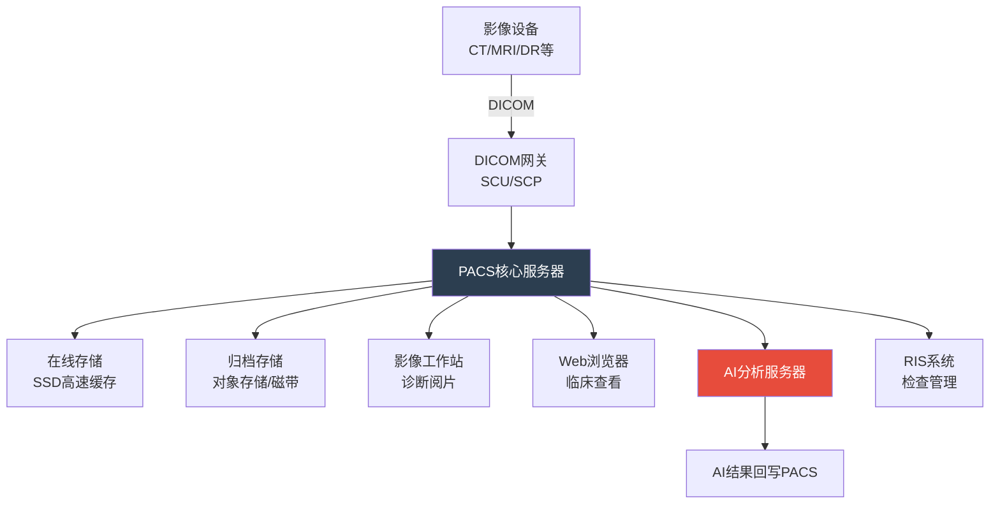

# 医学影像与检验

## 影像学分类

医学影像是临床诊断的重要支撑，不同成像方式各有其适用范围和优劣势。

### 影像学模态对比

| 模态 | 英文 | 原理 | 适用场景 | 分辨率 | 辐射 | 费用 |
|------|------|------|----------|--------|------|------|
| X线 | X-Ray | X射线穿透成像 | 骨折、肺部筛查 | 低-中 | 有 | 低 |
| CT | Computed Tomography | X射线断层重建 | 肿瘤、出血、骨折 | 高 | 有 | 中 |
| MRI | Magnetic Resonance Imaging | 磁场+射频信号 | 软组织、神经、关节 | 极高 | 无 | 高 |
| 超声 | Ultrasound | 声波反射成像 | 产科、腹部、心脏 | 中 | 无 | 低 |
| PET-CT | Positron Emission Tomography | 正电子衰变+CT | 肿瘤代谢、分期 | 中 | 有 | 极高 |
| 内镜 | Endoscopy | 光学成像 | 消化道、呼吸道 | 高 | 无 | 中 |

### 影像检查选择决策

```python
from enum import Enum
from pydantic import BaseModel, Field
from typing import Optional

class ImagingModality(str, Enum):
    XRAY = "X线"
    CT = "CT"
    MRI = "MRI"
    ULTRASOUND = "超声"
    PET_CT = "PET-CT"
    ENDOSCOPY = "内镜"

class BodyRegion(str, Enum):
    HEAD = "头颅"
    CHEST = "胸部"
    ABDOMEN = "腹部"
    SPINE = "脊柱"
    EXTREMITY = "四肢"
    PELVIS = "盆腔"

# 影像检查推荐规则
IMAGING_RECOMMENDATIONS = {
    ("头颅", "外伤"): [ImagingModality.CT, "快速排除颅内出血"],
    ("头颅", "肿瘤"): [ImagingModality.MRI, "软组织分辨率高"],
    ("头颅", "卒中"): [ImagingModality.CT, "快速鉴别出血/缺血"],
    ("胸部", "筛查"): [ImagingModality.XRAY, "经济便捷"],
    ("胸部", "肺结节"): [ImagingModality.CT, "高分辨率薄层CT"],
    ("腹部", "肝胆"): [ImagingModality.ULTRASOUND, "首选无创检查"],
    ("腹部", "肿瘤分期"): [ImagingModality.CT, "增强CT评估范围"],
    ("腹部", "胆管"): [ImagingModality.MRI, "MRCP显示胆管系统"],
    ("脊柱", "椎间盘"): [ImagingModality.MRI, "显示软组织压迫"],
    ("脊柱", "骨折"): [ImagingModality.CT, "骨结构显示清晰"],
    ("盆腔", "产科"): [ImagingModality.ULTRASOUND, "安全无辐射"],
    ("盆腔", "前列腺"): [ImagingModality.MRI, "多参数MRI评估"],
}

def recommend_imaging(body_region: BodyRegion, clinical_indication: str) -> dict:
    """根据临床适应症推荐影像检查"""
    key = (body_region.value, clinical_indication)
    if key in IMAGING_RECOMMENDATIONS:
        modality, reason = IMAGING_RECOMMENDATIONS[key]
        return {"推荐检查": modality.value, "推荐理由": reason}
    return {"推荐检查": "CT", "推荐理由": "通用性检查，可根据具体情况调整"}
```

## 影像诊断流程

### 完整影像诊断工作流


### 影像报告结构

```python
from pydantic import BaseModel, Field
from typing import Optional
from datetime import datetime

class ImagingReport(BaseModel):
    """影像报告结构"""
    # 基本信息
    report_id: str
    patient_id: str
    patient_name: str
    exam_date: datetime
    report_date: datetime

    # 检查信息
    exam_type: str = Field(..., description="检查类型：CT/MRI/超声等")
    body_part: str = Field(..., description="检查部位")
    contrast: bool = Field(False, description="是否增强")
    contrast_agent: Optional[str] = Field(None, description="对比剂名称及剂量")

    # 报告内容
    technique: str = Field(..., description="检查方法描述")
    findings: str = Field(..., description="影像所见")
    impression: str = Field(..., description="影像诊断/印象")
    recommendation: Optional[str] = Field(None, description="建议")

    # 诊断医生
    reporting_doctor: str
    reviewing_doctor: str

    # AI辅助
    ai_assisted: bool = Field(False, description="是否使用AI辅助")
    ai_findings: Optional[list[dict]] = Field(None, description="AI检测结果")

# 示例：胸部CT报告
chest_ct_report = ImagingReport(
    report_id="R20260607001",
    patient_id="P20240001",
    patient_name="张某某",
    exam_date=datetime(2026, 6, 7, 10, 30),
    report_date=datetime(2026, 6, 7, 11, 15),
    exam_type="CT",
    body_part="胸部",
    contrast=True,
    contrast_agent="碘海醇 100ml 静脉注射",
    technique="胸部CT平扫+增强，层厚5mm，薄层1.0mm重建",
    findings=(
        "右肺上叶尖段见一枚磨玻璃结节，大小约8mm x 6mm，边缘毛糙，"
        "可见短毛刺征，增强后轻度强化。余肺野清晰，未见明显实变影及结节。"
        "双侧肺门及纵隔未见明显肿大淋巴结。心脏大小形态正常，"
        "主动脉未见明显增宽。双侧胸腔未见积液。"
    ),
    impression=(
        "右肺上叶尖段磨玻璃结节，大小约8mm，考虑早期肺腺癌可能，"
        "建议3个月后复查CT或进一步PET-CT检查。"
    ),
    recommendation="建议3个月后复查胸部薄层CT，或行PET-CT进一步评估",
    reporting_doctor="李某某",
    reviewing_doctor="王某某",
    ai_assisted=True,
    ai_findings=[
        {
            "type": "肺结节检测",
            "location": "右肺上叶尖段",
            "size": "8.2mm x 6.1mm",
            "confidence": 0.92,
            "classification": "磨玻璃结节",
            "lung_rads": "4A",
        },
    ],
)
```

## DICOM标准与PACS系统

### DICOM标准

DICOM(Digital Imaging and Communications in Medicine)是医学影像的通用标准格式。

```python
import struct
from dataclasses import dataclass
from typing import Optional

@dataclass
class DICOMTag:
    """DICOM数据元素标签"""
    group: int
    element: int
    vr: str  # Value Representation
    value: str

    @property
    def tag_str(self) -> str:
        return f"({self.group:04X},{self.element:04X})"

# DICOM常用标签
DICOM_COMMON_TAGS = {
    (0x0008, 0x0060): "Modality",           # 检查模态
    (0x0008, 0x0020): "Study Date",          # 检查日期
    (0x0010, 0x0010): "Patient Name",        # 患者姓名
    (0x0010, 0x0020): "Patient ID",          # 患者ID
    (0x0020, 0x000D): "Study Instance UID",  # 检查唯一标识
    (0x0020, 0x000E): "Series Instance UID", # 序列唯一标识
    (0x0008, 0x0018): "SOP Instance UID",    # 实例唯一标识
    (0x0028, 0x0010): "Rows",               # 图像行数
    (0x0028, 0x0011): "Columns",             # 图像列数
    (0x0028, 0x0100): "Bits Allocated",      # 每像素位数
    (0x0028, 0x1050): "Window Center",       # 窗位
    (0x0028, 0x1051): "Window Width",        # 窗宽
}

# DICOM模态代码
DICOM_MODALITIES = {
    "CT": "Computed Tomography",
    "MR": "Magnetic Resonance",
    "XR": "X-Ray Radiography",
    "US": "Ultrasound",
    "PT": "PET",
    "NM": "Nuclear Medicine",
    "MG": "Mammography",
    "DX": "Digital Radiography",
    "RF": "Radio Fluoroscopy",
    "ES": "Endoscopy",
}
```

### PACS系统架构



```python
# PACS存储路由配置
PACS_STORAGE_POLICY = {
    "hot_storage": {
        "type": "SSD",
        "retention_days": 90,
        "modalities": ["CT", "MR", "PT"],
        "compression": "none",
    },
    "warm_storage": {
        "type": "HDD",
        "retention_days": 365,
        "modalities": "all",
        "compression": "JPEG2000 lossless",
    },
    "cold_storage": {
        "type": "Object Storage",
        "retention_days": None,  # 永久保存(法定30年)
        "modalities": "all",
        "compression": "JPEG2000 lossy",
    },
}

# DICOM路由规则
DICOM_ROUTING_RULES = [
    {
        "source_ae_title": "CT_SCANNER_01",
        "destination": ["PACS_PRIMARY", "AI_SERVER"],
        "modalities": ["CT"],
        "priority": "HIGH",
    },
    {
        "source_ae_title": "MR_SCANNER_01",
        "destination": ["PACS_PRIMARY"],
        "modalities": ["MR"],
        "priority": "HIGH",
    },
    {
        "source_ae_title": "DR_*",
        "destination": ["PACS_PRIMARY"],
        "modalities": ["DX", "CR"],
        "priority": "NORMAL",
    },
]
```

## 检验科分类

### 检验专业分组

| 分组 | 英文 | 检验项目 | 标本类型 | 周转时间 |
|------|------|----------|----------|----------|
| 血液学 | Hematology | 血常规、凝血、血型 | 全血 | 30min-2h |
| 生化 | Clinical Biochemistry | 肝功、肾功、血糖、血脂 | 血清 | 2-4h |
| 免疫 | Immunology | 乙肝五项、HIV、肿瘤标志物 | 血清 | 4-8h |
| 微生物 | Microbiology | 血培养、药敏试验 | 血/尿/痰 | 1-5天 |
| 分子诊断 | Molecular Diagnostics | PCR、基因检测 | 全血/组织 | 1-7天 |
| 病理 | Pathology | 组织病理、细胞学 | 组织/脱落细胞 | 3-7天 |
| 尿液 | Urinalysis | 尿常规、尿培养 | 尿液 | 30min-2h |

### 常见检验项目参考范围

```python
from pydantic import BaseModel, Field
from typing import Optional

class LabReferenceRange(BaseModel):
    """检验项目参考范围"""
    item_name: str
    item_code: str
    unit: str
    normal_range_male: str
    normal_range_female: str
    critical_low: Optional[float] = None
    critical_high: Optional[float] = None
    specimen_type: str
    department: str

# 常见检验项目参考范围
LAB_REFERENCE_RANGES: list[LabReferenceRange] = [
    LabReferenceRange(
        item_name="白细胞计数", item_code="WBC", unit="10^9/L",
        normal_range_male="3.5-9.5", normal_range_female="3.5-9.5",
        critical_low=2.0, critical_high=30.0,
        specimen_type="全血", department="血液学",
    ),
    LabReferenceRange(
        item_name="血红蛋白", item_code="HGB", unit="g/L",
        normal_range_male="130-175", normal_range_female="115-150",
        critical_low=50.0, critical_high=200.0,
        specimen_type="全血", department="血液学",
    ),
    LabReferenceRange(
        item_name="血小板计数", item_code="PLT", unit="10^9/L",
        normal_range_male="125-350", normal_range_female="125-350",
        critical_low=30.0, critical_high=1000.0,
        specimen_type="全血", department="血液学",
    ),
    LabReferenceRange(
        item_name="空腹血糖", item_code="GLU", unit="mmol/L",
        normal_range_male="3.9-6.1", normal_range_female="3.9-6.1",
        critical_low=2.2, critical_high=22.2,
        specimen_type="血清", department="生化",
    ),
    LabReferenceRange(
        item_name="糖化血红蛋白", item_code="HbA1c", unit="%",
        normal_range_male="4.0-6.0", normal_range_female="4.0-6.0",
        critical_high=14.0,
        specimen_type="全血", department="生化",
    ),
    LabReferenceRange(
        item_name="丙氨酸氨基转移酶", item_code="ALT", unit="U/L",
        normal_range_male="9-50", normal_range_female="7-40",
        critical_high=500.0,
        specimen_type="血清", department="生化",
    ),
    LabReferenceRange(
        item_name="肌酐", item_code="CREA", unit="umol/L",
        normal_range_male="57-111", normal_range_female="41-81",
        critical_high=707.0,
        specimen_type="血清", department="生化",
    ),
    LabReferenceRange(
        item_name="C反应蛋白", item_code="CRP", unit="mg/L",
        normal_range_male="0-10", normal_range_female="0-10",
        critical_high=100.0,
        specimen_type="血清", department="免疫",
    ),
    LabReferenceRange(
        item_name="D-二聚体", item_code="D-Dimer", unit="mg/L FEU",
        normal_range_male="0-0.55", normal_range_female="0-0.55",
        critical_high=5.0,
        specimen_type="血浆", department="血液学",
    ),
]

def interpret_lab_result(item_code: str, value: float, gender: str) -> dict:
    """解读检验结果"""
    for ref in LAB_REFERENCE_RANGES:
        if ref.item_code == item_code:
            range_str = ref.normal_range_male if gender == "male" else ref.normal_range_female
            low_str, high_str = range_str.split("-")
            low, high = float(low_str), float(high_str)

            if value < low:
                level = "偏低"
                if ref.critical_low and value <= ref.critical_low:
                    level = "危急值(低)"
            elif value > high:
                level = "偏高"
                if ref.critical_high and value >= ref.critical_high:
                    level = "危急值(高)"
            else:
                level = "正常"

            return {
                "项目": ref.item_name,
                "结果": f"{value} {ref.unit}",
                "参考范围": range_str + f" {ref.unit}",
                "解读": level,
            }

    return {"项目": item_code, "解读": "未找到参考范围"}
```

## LIS系统与检验流程

### LIS系统架构


### 检验危急值管理

检验危急值(Critical Value)是可能危及患者生命的检验结果，必须立即报告临床。

```python
from pydantic import BaseModel
from datetime import datetime
from typing import Optional

class CriticalValueAlert(BaseModel):
    """危急值报告"""
    patient_id: str
    patient_name: str
    department: str
    bed_no: str
    test_item: str
    test_code: str
    result_value: float
    unit: str
    critical_threshold: str
    reporting_technician: str
    reporting_time: datetime
    receiving_doctor: Optional[str] = None
    receiving_time: Optional[datetime] = None
    status: str = "未通知"  # 未通知/已通知/已确认

    def confirm_receipt(self, doctor_name: str):
        """确认接收危急值"""
        self.receiving_doctor = doctor_name
        self.receiving_time = datetime.now()
        self.status = "已确认"

# 危急值规则引擎
def check_critical_value(test_code: str, value: float, patient_info: dict) -> Optional[CriticalValueAlert]:
    """检查检验结果是否为危急值"""
    CRITICAL_RULES = {
        "K": {"low": 2.8, "high": 6.2, "unit": "mmol/L", "name": "钾离子"},
        "Na": {"low": 120, "high": 160, "unit": "mmol/L", "name": "钠离子"},
        "GLU": {"low": 2.2, "high": 22.2, "unit": "mmol/L", "name": "血糖"},
        "WBC": {"low": 2.0, "high": 30.0, "unit": "10^9/L", "name": "白细胞"},
        "PLT": {"low": 30.0, "high": 1000.0, "unit": "10^9/L", "name": "血小板"},
        "HGB": {"low": 50.0, "high": 200.0, "unit": "g/L", "name": "血红蛋白"},
        "CREA": {"low": None, "high": 707.0, "unit": "umol/L", "name": "肌酐"},
        "TNI": {"low": None, "high": 2.0, "unit": "ng/mL", "name": "肌钙蛋白I"},
        "PT_INR": {"low": None, "high": 5.0, "unit": "", "name": "凝血酶原INR"},
    }

    if test_code not in CRITICAL_RULES:
        return None

    rule = CRITICAL_RULES[test_code]
    is_critical = False
    threshold_desc = ""

    if rule["low"] is not None and value <= rule["low"]:
        is_critical = True
        threshold_desc = f"<= {rule['low']}"
    if rule["high"] is not None and value >= rule["high"]:
        is_critical = True
        threshold_desc = f">= {rule['high']}"

    if is_critical:
        return CriticalValueAlert(
            patient_id=patient_info.get("patient_id", ""),
            patient_name=patient_info.get("name", ""),
            department=patient_info.get("department", ""),
            bed_no=patient_info.get("bed_no", ""),
            test_item=rule["name"],
            test_code=test_code,
            result_value=value,
            unit=rule["unit"],
            critical_threshold=threshold_desc,
            reporting_technician=patient_info.get("technician", "系统自动"),
            reporting_time=datetime.now(),
        )

    return None
```

## 医学影像AI应用场景

### 影像AI应用全景

| 应用场景 | 影像模态 | AI任务 | 代表产品/研究 | 临床价值 |
|----------|----------|--------|---------------|----------|
| 肺结节检测 | CT | 检测+分类 | 推想科技、依图医疗 | 早期肺癌筛查 |
| 眼底糖网筛查 | 眼底照相 | 分类 | Google Health、Airdoc | 糖尿病视网膜病变筛查 |
| 皮肤病变分类 | 皮肤镜 | 分类 | Stanford DermAI | 恶性黑色素瘤识别 |
| 骨龄评估 | X线(左手) | 回归 | 飞利浦、联影 | 儿童生长发育评估 |
| 乳腺钼靶筛查 | 钼靶 | 检测+分类 | Google、IBM | 乳腺癌早期筛查 |
| 脑出血检测 | CT | 检测+分割 | Viz.ai | 急诊快速分诊 |
| 冠脉斑块分析 | CT冠脉造影 | 分割+分类 | Cleerly、HeartFlow | 冠心病风险评估 |
| 病理切片分析 | 数字病理 | 检测+分类 | Paige、PathAI | 肿瘤病理辅助诊断 |
| 骨折检测 | X线 | 检测 | ImageBiopsy Lab | 急诊骨折筛查 |
| 牙齿分割 | CBCT | 分割 | 联影、美亚光电 | 口腔正畸规划 |

### 影像AI性能评估指标

```python
from pydantic import BaseModel, Field
from typing import Optional

class SegmentationMetrics(BaseModel):
    """医学影像分割评估指标"""
    dice_coefficient: float = Field(..., description="Dice系数，0-1，越高越好")
    iou: float = Field(..., description="交并比(IoU/Jaccard)，0-1")
    sensitivity: float = Field(..., description="敏感度/召回率")
    specificity: float = Field(..., description="特异度")
    hausdorff_distance: float = Field(..., description="Hausdorff距离(mm)，越低越好")
    avg_surface_distance: Optional[float] = Field(None, description="平均表面距离(mm)")

class DetectionMetrics(BaseModel):
    """医学影像检测评估指标"""
    sensitivity: float = Field(..., description="敏感度/召回率")
    fps_per_scan: float = Field(..., description="每扫描假阳性数")
    mAP: float = Field(..., description="平均精度均值")
    ap_50: Optional[float] = Field(None, description="IoU=0.5时的AP")
    ap_75: Optional[float] = Field(None, description="IoU=0.75时的AP")
    froc_score: Optional[float] = Field(None, description="FROC分数")

class ClassificationMetrics(BaseModel):
    """医学影像分类评估指标"""
    auc: float = Field(..., description="AUC-ROC曲线下面积")
    accuracy: float = Field(..., description="准确率")
    sensitivity: float = Field(..., description="敏感度")
    specificity: float = Field(..., description="特异度")
    ppv: float = Field(..., description="阳性预测值(精确率)")
    npv: float = Field(..., description="阴性预测值")
    f1_score: float = Field(..., description="F1分数")

# 各场景典型性能基准
AI_PERFORMANCE_BENCHMARKS = {
    "肺结节检测": DetectionMetrics(
        sensitivity=0.95, fps_per_scan=1.0, mAP=0.85, froc_score=0.87,
    ),
    "眼底糖网筛查": ClassificationMetrics(
        auc=0.97, accuracy=0.92, sensitivity=0.95, specificity=0.90,
        ppv=0.88, npv=0.96, f1_score=0.91,
    ),
    "骨龄评估": {
        "mae_months": 6.0,  # 平均绝对误差6个月
        "rmse_months": 8.5,
    },
    "脑出血检测": DetectionMetrics(
        sensitivity=0.98, fps_per_scan=0.2, mAP=0.92,
    ),
}
```

### 影像AI LUNG-RADS分级

```python
# 肺结节LUNG-RADS分级标准(简化版)
LUNG_RADS = {
    "1": {
        "category": "阴性",
        "description": "无结节或确定性良性结节",
        "management": "12个月后年度筛查",
        "malignancy_probability": "<1%",
    },
    "2": {
        "category": "良性表现或行为",
        "description": "实性结节<6mm / 含脂肪/钙化的特征性良性结节",
        "management": "12个月后年度筛查",
        "malignancy_probability": "<1%",
    },
    "3": {
        "category": "良性可能",
        "description": "实性结节6-8mm / 磨玻璃结节<30mm",
        "management": "6个月后复查CT",
        "malignancy_probability": "1-2%",
    },
    "4A": {
        "category": "可疑恶性",
        "description": "实性结节8-14mm / 磨玻璃结节>=30mm / 部分实性结节<15mm实性成分",
        "management": "3个月后复查CT / PET-CT / 活检",
        "malignancy_probability": "5-15%",
    },
    "4B": {
        "category": "高度可疑恶性",
        "description": "实性结节>=15mm / 部分实性结节>=15mm实性成分",
        "management": "PET-CT / 活检 / 手术",
        "malignancy_probability": ">15%",
    },
}

def classify_lung_nodule(
    nodule_type: str,  # 实性/磨玻璃/部分实性
    size_mm: float,
) -> dict:
    """根据结节特征判定LUNG-RADS分级"""
    if nodule_type == "实性":
        if size_mm < 6:
            return LUNG_RADS["2"]
        elif size_mm < 8:
            return LUNG_RADS["3"]
        elif size_mm < 15:
            return LUNG_RADS["4A"]
        else:
            return LUNG_RADS["4B"]
    elif nodule_type == "磨玻璃":
        if size_mm < 30:
            return LUNG_RADS["3"]
        else:
            return LUNG_RADS["4A"]
    elif nodule_type == "部分实性":
        solid_component = size_mm * 0.5  # 简化估算
        if solid_component < 15:
            return LUNG_RADS["4A"]
        else:
            return LUNG_RADS["4B"]

    return LUNG_RADS["1"]
```

## 检验指标解读参考

### 常见检验组合解读

| 检验组合 | 包含项目 | 临床意义 |
|----------|----------|----------|
| 血常规 | WBC+RBC+HGB+PLT | 感染、贫血、出血性疾病筛查 |
| 肝功能 | ALT+AST+ALB+TBIL+ALP | 肝脏损伤评估 |
| 肾功能 | BUN+CREA+UA | 肾脏滤过功能评估 |
| 血脂 | TC+TG+LDL-C+HDL-C | 心血管风险评估 |
| 凝血四项 | PT+APTT+TT+FIB | 凝血功能评估 |
| 心肌酶谱 | CK+CKMB+LDH+AST | 心肌损伤评估 |
| 甲状腺功能 | TSH+FT3+FT4 | 甲状腺功能评估 |
| 肿瘤标志物 | AFP+CEA+CA125+CA199+PSA | 肿瘤筛查与监测 |
