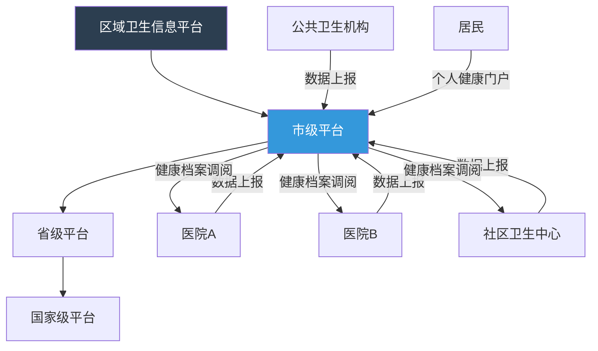
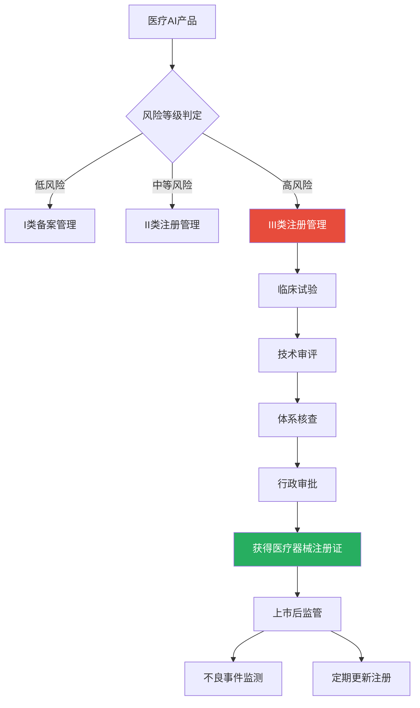

# 医疗信息化与合规

## 医院信息系统架构

### 核心信息系统概览

```mermaid
graph TD
    A[临床服务层] --> A1[EMR 电子病历]
    A --> A2[CIS 临床信息系统]
    A --> A3[PACS 影像系统]
    A --> A4[LIS 检验系统]
    A --> A5[RIS 放射信息]
    A --> A6[手术麻醉系统]
    A --> A7[ICU监护系统]

    B[运营管理层] --> B1[HIS 医院信息系统]
    B --> B2[HRP 医院资源规划]
    B --> B3[财务管理系统]
    B --> B4[物资管理系统]
    B --> B5[人事管理系统]

    C[患者服务层] --> C1[预约挂号]
    C --> C2[自助服务]
    C --> C3[互联网医院]
    C --> C4[移动护理]
    C --> C5[随访管理]

    D[数据交换层] --> D1[集成平台]
    D --> D2[HL7引擎]
    D --> D3[数据仓库]
    D --> D4[主数据管理]

    E[安全合规层] --> E1[统一认证]
    E --> E2[访问控制]
    E --> E3[数据加密]
    E --> E4[审计日志]
    E --> E5[脱敏处理]

    D1 --> A1
    D1 --> B1
    D1 --> C1
    E1 --> A1
    E1 --> B1

    style A fill:#e74c3c,color:#fff
    style B fill:#3498db,color:#fff
    style C fill:#27ae60,color:#fff
    style D fill:#f39c12,color:#fff
    style E fill:#9b59b6,color:#fff
```



### 系统间集成方式

```python
from enum import Enum
from pydantic import BaseModel, Field
from typing import Optional

class IntegrationMode(str, Enum):
    POINT_TO_POINT = "点对点"
    HUB_SPOKE = "中心辐射"
    ESB = "企业服务总线"
    API_GATEWAY = "API网关"
    MESSAGE_QUEUE = "消息队列"

class SystemInterface(BaseModel):
    """系统接口定义"""
    source_system: str
    target_system: str
    interface_type: str  # HL7/DICOM/REST/FHIR
    data_flow: str  # 实时/定时/事件驱动
    description: str

# 医院系统间典型接口
SYSTEM_INTERFACES: list[SystemInterface] = [
    SystemInterface(
        source_system="HIS", target_system="EMR",
        interface_type="HL7", data_flow="实时",
        description="患者基本信息、就诊信息同步",
    ),
    SystemInterface(
        source_system="EMR", target_system="LIS",
        interface_type="HL7", data_flow="实时",
        description="检验申请下发、结果回传",
    ),
    SystemInterface(
        source_system="EMR", target_system="PACS",
        interface_type="DICOM/HL7", data_flow="实时",
        description="影像检查申请、报告回传",
    ),
    SystemInterface(
        source_system="HIS", target_system="药房系统",
        interface_type="HL7", data_flow="实时",
        description="处方传输、发药确认",
    ),
    SystemInterface(
        source_system="EMR", target_system="CDSS",
        interface_type="REST API", data_flow="实时",
        description="临床决策支持请求与结果",
    ),
    SystemInterface(
        source_system="集成平台", target_system="区域卫生平台",
        interface_type="FHIR", data_flow="定时",
        description="区域数据上报与共享",
    ),
]
```

## 电子病历(EMR)标准

### HL7 FHIR标准

FHIR(Fast Healthcare Interoperability Resources)是HL7组织发布的最新医疗数据交换标准。

```python
from pydantic import BaseModel, Field
from typing import Optional
from datetime import datetime
from enum import Enum

class FHIRResourceType(str, Enum):
    Patient = "Patient"
    Encounter = "Encounter"
    Condition = "Condition"
    Observation = "Observation"
    MedicationRequest = "MedicationRequest"
    DiagnosticReport = "DiagnosticReport"
    Procedure = "Procedure"

class FHIRCodeableConcept(BaseModel):
    """FHIR可编码概念"""
    coding_system: str = Field(..., description="编码体系URI")
    code: str = Field(..., description="编码值")
    display: str = Field(..., description="显示名称")

class FHIRHumanName(BaseModel):
    """FHIR R4 HumanName复合类型"""
    family: str = Field(..., description="姓")
    given: list[str] = Field(default_factory=list, description="名")
    prefix: Optional[list[str]] = Field(None, description="称谓前缀")
    suffix: Optional[list[str]] = Field(None, description="后缀")
    text: Optional[str] = Field(None, description="全名文本表示")
    use: Optional[str] = Field(None, description="usual/official/temp/nickname/anonymous/old/maiden")

class FHIRIdentifier(BaseModel):
    """FHIR R4 Identifier复合类型"""
    system: str = Field(..., description="标识符体系URI，如urn:oid:2.16.840.1.113883.2.23.1.19.1")
    value: str = Field(..., description="标识符值，如身份证号、医保号")
    use: Optional[str] = Field(None, description="usual/official/temp/secondary/old")
    type_code: Optional[FHIRCodeableConcept] = Field(None, description="标识符类型")

class FHIRPatient(BaseModel):
    """FHIR Patient资源 - 符合FHIR R4规范"""
    resource_type: str = "Patient"
    id: str
    name: list[FHIRHumanName] = Field(..., description="患者姓名列表(FHIR R4要求为HumanName复合类型列表)")
    gender: str
    birth_date: str
    identifier: list[FHIRIdentifier] = Field(..., description="患者标识符列表(FHIR R4要求为Identifier复合类型列表)")
    telecom: Optional[list[dict]] = Field(None, description="联系方式列表")
    address: Optional[list[dict]] = Field(None, description="地址列表")

    # FHIR R4数据类型要求说明：
    # - name字段必须为HumanName列表，每个元素包含family(姓)、given(名)等子字段
    # - identifier字段必须为Identifier列表，每个元素包含system(体系URI)、value(值)等子字段
    # - 不可简化为str，否则无法表达多标识符、姓名的姓/名拆分等语义

class FHIREncounter(BaseModel):
    """FHIR Encounter资源(就诊)"""
    resource_type: str = "Encounter"
    id: str
    status: str = "finished"
    encounter_class: str = Field(..., description="AMB/IMP/EMER")
    patient_id: str
    practitioner_id: str
    period_start: datetime
    period_end: Optional[datetime] = None
    reason: Optional[str] = None
    diagnosis: Optional[list[dict]] = None

class FHIRCondition(BaseModel):
    """FHIR Condition资源(诊断/病情)"""
    resource_type: str = "Condition"
    id: str
    patient_id: str
    encounter_id: str
    clinical_status: str = "active"
    verification_status: str = "confirmed"
    code: FHIRCodeableConcept
    onset_datetime: Optional[datetime] = None

class FHIRObservation(BaseModel):
    """FHIR Observation资源(检验/观察)"""
    resource_type: str = "Observation"
    id: str
    status: str = "final"
    category: str  # laboratory/vital-signs/imaging
    code: FHIRCodeableConcept
    patient_id: str
    encounter_id: str
    effective_datetime: datetime
    value: Optional[str] = None
    value_quantity: Optional[dict] = None
    interpretation: Optional[str] = None

# FHIR资源示例
fhir_patient = FHIRPatient(
    id="patient-001",
    name=[
        FHIRHumanName(
            family="张",
            given=["某某"],
            text="张某某",
            use="official",
        ),
    ],
    gender="male",
    birth_date="1980-05-15",
    identifier=[
        FHIRIdentifier(
            system="urn:oid:2.16.840.1.113883.2.23.1.19.1",
            value="110101198005150012",
            use="official",
        ),
    ],
    telecom=[{"system": "phone", "value": "13800138000"}],
)

fhir_condition = FHIRCondition(
    id="condition-001",
    patient_id="patient-001",
    encounter_id="encounter-001",
    code=FHIRCodeableConcept(
        coding_system="http://hl7.org/fhir/sid/icd-10",
        code="J18.9",
        display="社区获得性肺炎",
    ),
    onset_datetime=datetime(2026, 6, 5),
)
```

### 病历书写规范

```python
from pydantic import BaseModel, Field
from typing import Optional
from datetime import datetime
from enum import Enum

class RecordType(str, Enum):
    ADMISSION = "入院记录"
    FIRST_COURSE = "首次病程记录"
    DAILY_COURSE = "日常病程记录"
    SURGICAL = "手术记录"
    CONSULTATION = "会诊记录"
    DISCHARGE = "出院记录"
    DEATH = "死亡记录"

class MedicalRecord(BaseModel):
    """电子病历"""
    record_id: str
    patient_id: str
    encounter_id: str
    record_type: RecordType
    title: str
    content: str
    author_id: str
    author_name: str
    created_at: datetime = Field(default_factory=datetime.now)
    signed_at: Optional[datetime] = None
    co_signer: Optional[str] = None

    @property
    def is_signed(self) -> bool:
        return self.signed_at is not None

class AdmissionRecord(BaseModel):
    """入院记录结构"""
    patient_info: str = Field(..., description="一般项目")
    chief_complaint: str = Field(..., description="主诉")
    present_illness: str = Field(..., description="现病史")
    past_history: str = Field(..., description="既往史")
    personal_history: str = Field(..., description="个人史")
    family_history: str = Field(..., description="家族史")
    physical_examination: str = Field(..., description="体格检查")
    auxiliary_examination: str = Field(..., description="辅助检查")
    initial_diagnosis: str = Field(..., description="初步诊断")

# 病历质控规则
RECORD_QUALITY_RULES = {
    "入院记录": {
        "must_contain": ["主诉", "现病史", "既往史", "体格检查", "初步诊断"],
        "time_limit_hours": 24,  # 入院24h内完成
        "min_length": 200,       # 最少字数
    },
    "首次病程记录": {
        "must_contain": ["病例特点", "拟诊讨论", "诊疗计划"],
        "time_limit_hours": 8,   # 入院8h内完成
        "min_length": 300,
    },
    "日常病程记录": {
        "frequency": "至少每2-3天一次",
        "must_contain": ["病情变化", "处理措施"],
        "time_limit_hours": None,
    },
    "手术记录": {
        "must_contain": ["手术日期", "术前诊断", "术后诊断", "手术方式", "术中经过", "术中出血"],
        "time_limit_hours": 24,  # 术后24h内完成
    },
    "出院记录": {
        "must_contain": ["入院诊断", "出院诊断", "诊疗经过", "出院医嘱", "随访要求"],
        "time_limit_hours": None,  # 出院时完成
    },
}
```

## 互联互通标准化

### 区域卫生信息平台



### 数据互联互通标准

| 标准体系 | 标准名称 | 应用范围 |
|----------|----------|----------|
| 数据标准 | 卫生信息数据元目录 | 数据元定义与编码 |
| 术语标准 | ICD-10、SNOMED CT | 疾病、手术编码 |
| 传输标准 | HL7 V2/V3、FHIR | 系统间数据交换 |
| 影像标准 | DICOM | 医学影像存储与传输 |
| 安全标准 | 等保2.0 | 信息系统安全等级 |
| 文档标准 | HL7 CDA | 临床文档架构 |

## 医疗数据合规

### 法律法规体系

```python
from pydantic import BaseModel, Field
from enum import Enum

class ComplianceLaw(str, Enum):
    PRACTITIONER_LAW = "中华人民共和国执业医师法"
    PIIPL = "中华人民共和国个人信息保护法"
    DATA_SECURITY_LAW = "中华人民共和国数据安全法"
    HEALTH_DATA_MGMT = "国家健康医疗大数据标准、安全和服务管理办法"
    NETWORK_SECURITY_LAW = "中华人民共和国网络安全法"
    MEDICAL_INSTITUTION_REG = "医疗机构管理条例"
    MEDICAL_RECORD_MGMT = "医疗机构病历管理规定"

class DataCategory(str, Enum):
    """健康医疗数据分类"""
    PUBLIC = "公开数据"
    INTERNAL = "内部数据"
    SENSITIVE = "敏感数据"
    CRITICAL = "重要数据"

class DataSubject(str, Enum):
    """数据主体权利"""
    ACCESS = "知情权"
    CONSENT = "同意权"
    WITHDRAW = "撤回同意权"
    DELETE = "删除权"
    PORTABILITY = "数据可携权"

# 医疗数据合规要求
COMPLIANCE_REQUIREMENTS = {
    "个人信息保护法": {
        "处理基础": "个人同意/法定义务/公共利益",
        "敏感信息": "健康信息属于敏感个人信息",
        "同意要求": "需取得个人单独同意",
        "存储期限": "实现处理目的最短时间",
        "跨境传输": "需通过安全评估",
    },
    "健康医疗数据管理办法": {
        "数据采集": "遵循合法、正当、必要原则",
        "数据存储": "境内存储，出境需安全评估",
        "数据使用": "脱敏后方可用于临床研究",
        "数据共享": "需患者授权或法律法规要求",
    },
    "病历管理规定": {
        "保管期限": "住院病历>=30年",
        "门诊病历": ">=15年",
        "患者权利": "有权复印病历",
        "隐私保护": "严禁泄露患者隐私",
    },
}
```

## 数据安全

### 患者隐私保护

```python
import re
import hashlib
from typing import Optional
from pydantic import BaseModel, Field

class DataMaskingRule(BaseModel):
    """数据脱敏规则"""
    field_name: str
    masking_type: str  # mask/hash/replace/remove
    description: str

# 脱敏规则配置
MASKING_RULES: list[DataMaskingRule] = [
    DataMaskingRule(field_name="姓名", masking_type="mask", description="保留姓，名用*替代"),
    DataMaskingRule(field_name="身份证号", masking_type="mask", description="保留前3后4，中间用*替代"),
    DataMaskingRule(field_name="手机号", masking_type="mask", description="保留前3后4，中间用*替代"),
    DataMaskingRule(field_name="住址", masking_type="mask", description="保留到区，详细地址用*替代"),
    DataMaskingRule(field_name="联系方式", masking_type="hash", description="SHA256哈希"),
]

def mask_name(name: str) -> str:
    """姓名脱敏：张某某 -> 张*某"""
    if len(name) <= 1:
        return name
    return name[0] + "*" * (len(name) - 1) if len(name) == 2 else name[0] + "*" * (len(name) - 2) + name[-1]

def mask_id_card(id_card: str) -> str:
    """身份证号脱敏：110101199001010012 -> 110***********0012"""
    if len(id_card) < 8:
        return "***"
    return id_card[:3] + "*" * (len(id_card) - 7) + id_card[-4:]

def mask_phone(phone: str) -> str:
    """手机号脱敏：13800138000 -> 138****8000"""
    if len(phone) < 7:
        return "***"
    return phone[:3] + "****" + phone[-4:]

def mask_address(address: str) -> str:
    """地址脱敏：保留到区级"""
    # 匹配省市区
    pattern = r"^(.*?[省市自治区].*?[市区县])"
    match = re.match(pattern, address)
    if match:
        return match.group(1) + "***"
    return "***"

class PatientDataMasker:
    """患者数据脱敏处理器"""

    @staticmethod
    def mask_patient_data(patient_data: dict, fields_to_mask: list[str] = None) -> dict:
        """对患者数据进行脱敏处理"""
        if fields_to_mask is None:
            fields_to_mask = ["name", "id_card", "phone", "address"]

        masked_data = patient_data.copy()
        masking_map = {
            "name": mask_name,
            "id_card": mask_id_card,
            "phone": mask_phone,
            "address": mask_address,
        }

        for field in fields_to_mask:
            if field in masked_data and field in masking_map:
                masked_data[field] = masking_map[field](masked_data[field])

        return masked_data

# 使用示例
raw_patient = {
    "name": "张某某",
    "id_card": "110101198005150012",
    "phone": "13800138000",
    "address": "北京市东城区某某街道某某小区1号楼101",
    "diagnosis": "社区获得性肺炎",
    "admission_date": "2026-06-05",
}

masked_patient = PatientDataMasker.mask_patient_data(raw_patient)
# 结果:
# {
#     "name": "张*某",
#     "id_card": "110************0012",
#     "phone": "138****8000",
#     "address": "北京市东城区***",
#     "diagnosis": "社区获得性肺炎",
#     "admission_date": "2026-06-05",
# }
```

### 数据分级分类

```python
from pydantic import BaseModel, Field
from enum import Enum
from typing import Optional

class DataSensitivityLevel(str, Enum):
    """数据敏感级别"""
    L1_PUBLIC = "L1-公开"
    L2_INTERNAL = "L2-内部"
    L3_SENSITIVE = "L3-敏感"
    L4_CRITICAL = "L4-重要"

class HealthDataClassification(BaseModel):
    """健康医疗数据分类"""
    category: str
    sensitivity: DataSensitivityLevel
    examples: list[str]
    access_control: str
    encryption_required: bool
    audit_required: bool
    retention_years: int

# 医疗数据分类标准
DATA_CLASSIFICATION: list[HealthDataClassification] = [
    HealthDataClassification(
        category="患者身份信息",
        sensitivity=DataSensitivityLevel.L4_CRITICAL,
        examples=["姓名", "身份证号", "手机号", "住址"],
        access_control="最小权限，仅主治及以上医师",
        encryption_required=True,
        audit_required=True,
        retention_years=30,
    ),
    HealthDataClassification(
        category="临床诊疗数据",
        sensitivity=DataSensitivityLevel.L3_SENSITIVE,
        examples=["诊断", "医嘱", "手术记录", "检验结果"],
        access_control="科室权限，主治及以上医师",
        encryption_required=True,
        audit_required=True,
        retention_years=30,
    ),
    HealthDataClassification(
        category="医学影像数据",
        sensitivity=DataSensitivityLevel.L3_SENSITIVE,
        examples=["CT影像", "MRI影像", "X线影像", "超声影像"],
        access_control="科室权限，诊断医师",
        encryption_required=True,
        audit_required=True,
        retention_years=15,
    ),
    HealthDataClassification(
        category="药品信息",
        sensitivity=DataSensitivityLevel.L2_INTERNAL,
        examples=["药品目录", "库存信息", "采购信息"],
        access_control="药房/药剂科权限",
        encryption_required=False,
        audit_required=True,
        retention_years=10,
    ),
    HealthDataClassification(
        category="医院运营数据",
        sensitivity=DataSensitivityLevel.L2_INTERNAL,
        examples=["门诊量", "手术量", "收入数据"],
        access_control="管理部门权限",
        encryption_required=False,
        audit_required=False,
        retention_years=10,
    ),
    HealthDataClassification(
        category="公共卫生数据",
        sensitivity=DataSensitivityLevel.L1_PUBLIC,
        examples=["疾病统计", "疫苗覆盖率", "传染病报告"],
        access_control="脱敏后公开",
        encryption_required=False,
        audit_required=False,
        retention_years=30,
    ),
]
```

## 人类遗传资源管理

### 人类遗传资源管理

涉及中国人类遗传资源（HGR）的医学AI项目须遵守《人类遗传资源管理条例》：

- **采集审批**：采集中国人类遗传资源需科技部审批
- **存储要求**：须在境内存储，不得向境外提供
- **国际合作**：与外方合作需审批，且中方需拥有成果知识产权
- **数据出境**：HGR数据出境需额外审批，与一般个人数据出境不同
- **处罚**：未经审批擅自采集/出境，最高罚款1000万元

对AI项目的实际影响：
- 使用中国患者数据训练模型前须获得HGR采集许可
- 与境外机构联合研发需国际合作审批
- 模型部署到境外服务器需HGR出境审批

## 医疗器械监管与AI三类证

### 医疗AI产品监管框架



### 医疗AI产品分类

| 分类 | 风险等级 | 典型产品 | 审批机构 | 上市路径 |
|------|----------|----------|----------|----------|
| I类 | 低 | 非诊断用健康App | 市药监局备案 | 备案制 |
| II类 | 中 | 心电分析软件、辅助阅片软件 | 省药监局注册 | 注册制 |
| III类 | 高 | 独立诊断AI、手术导航AI | 国家药监局注册 | 注册制+临床试验 |

### AI医疗器械审批要点

```python
from pydantic import BaseModel, Field
from typing import Optional
from datetime import date

class AI MedicalDeviceRegistration(BaseModel):
    """AI医疗器械注册信息"""
    product_name: str
    model_type: str  # 辅助诊断/辅助检测/辅助分诊
    risk_classification: str  # II/III
    algorithm_type: str  # 深度学习/传统ML/规则
    training_data_description: str
    clinical_evaluation_method: str
    intended_use: str
    contraindications: str
    performance_metrics: dict
    approval_date: Optional[date] = None
    approval_number: Optional[str] = None

# 已获批AI医疗产品(示例)
APPROVED_AI_DEVICES = [
    {
        "product_name": "肺结节CT影像辅助检测软件",
        "company": "推想科技",
        "classification": "III类",
        "approval_year": 2020,
        "function": "辅助检测肺结节，标注位置和特征",
    },
    {
        "product_name": "糖网眼底图像辅助诊断软件",
        "company": "Airdoc",
        "classification": "III类",
        "approval_year": 2020,
        "function": "辅助诊断糖尿病视网膜病变",
    },
    {
        "product_name": "心电分析软件",
        "company": "数创科技",
        "classification": "II类",
        "approval_year": 2021,
        "function": "辅助分析心电图异常",
    },
]
```

## 合规检查清单与数据脱敏规范

### AI医疗产品合规检查清单

```python
from pydantic import BaseModel, Field
from typing import Optional

class ComplianceCheckItem(BaseModel):
    """合规检查项"""
    category: str
    item: str
    requirement: str
    is_required: bool
    status: str = "未检查"  # 未检查/通过/不通过/不适用
    remark: Optional[str] = None

# AI医疗产品合规检查清单
AI_COMPLIANCE_CHECKLIST: list[ComplianceCheckItem] = [
    # 数据合规
    ComplianceCheckItem(
        category="数据合规", item="数据来源合法性",
        requirement="训练数据来源合法，已获得授权或为公开数据集",
        is_required=True,
    ),
    ComplianceCheckItem(
        category="数据合规", item="数据脱敏",
        requirement="训练/测试数据中患者信息已脱敏",
        is_required=True,
    ),
    ComplianceCheckItem(
        category="数据合规", item="数据标注质量",
        requirement="数据标注由具备资质的医师完成，有标注质控流程",
        is_required=True,
    ),
    ComplianceCheckItem(
        category="数据合规", item="数据集多样性",
        requirement="训练数据覆盖不同人群、设备、医院",
        is_required=True,
    ),
    # 产品合规
    ComplianceCheckItem(
        category="产品合规", item="医疗器械分类",
        requirement="已确定医疗器械分类(I/II/III类)并走相应审批路径",
        is_required=True,
    ),
    ComplianceCheckItem(
        category="产品合规", item="临床试验",
        requirement="III类产品需完成临床试验，II类视情况",
        is_required=True,
    ),
    ComplianceCheckItem(
        category="产品合规", item="算法透明度",
        requirement="提供算法原理说明、特征重要性分析",
        is_required=True,
    ),
    ComplianceCheckItem(
        category="产品合规", item="人机交互设计",
        requirement="AI结果仅辅助参考，最终决策由医生做出",
        is_required=True,
    ),
    # 安全合规
    ComplianceCheckItem(
        category="安全合规", item="等保测评",
        requirement="信息系统通过等保2.0三级测评",
        is_required=True,
    ),
    ComplianceCheckItem(
        category="安全合规", item="数据加密",
        requirement="传输加密(TLS) + 存储加密(AES-256)",
        is_required=True,
    ),
    ComplianceCheckItem(
        category="安全合规", item="访问控制",
        requirement="基于角色的访问控制(RBAC)，最小权限原则",
        is_required=True,
    ),
    ComplianceCheckItem(
        category="安全合规", item="审计日志",
        requirement="所有数据访问操作记录日志，保留>=6个月",
        is_required=True,
    ),
    # 标识与说明
    ComplianceCheckItem(
        category="标识说明", item="AI辅助标识",
        requirement="产品界面明确标注'AI辅助诊断结果，仅供参考'",
        is_required=True,
    ),
    ComplianceCheckItem(
        category="标识说明", item="使用说明",
        requirement="提供适应症、禁忌症、局限性的明确说明",
        is_required=True,
    ),
    ComplianceCheckItem(
        category="标识说明", item="版本管理",
        requirement="AI模型版本管理，更新需重新评估和审批",
        is_required=True,
    ),
]
```

### 数据脱敏规范代码

```python
import re
import json
from typing import Any
from pydantic import BaseModel, Field
from enum import Enum

class MaskingStrategy(str, Enum):
    REPLACE = "替换"
    MASK = "掩码"
    HASH = "哈希"
    REMOVE = "删除"
    GENERALIZE = "泛化"

class FieldMaskingConfig(BaseModel):
    """字段脱敏配置"""
    field_path: str
    strategy: MaskingStrategy
    params: dict = {}

# 临床数据脱敏配置
CLINICAL_DATA_MASKING_CONFIG: list[FieldMaskingConfig] = [
    FieldMaskingConfig(
        field_path="patient.name",
        strategy=MaskingStrategy.MASK,
        params={"keep_first": 1, "keep_last": 1, "mask_char": "*"},
    ),
    FieldMaskingConfig(
        field_path="patient.id_card",
        strategy=MaskingStrategy.MASK,
        params={"keep_start": 3, "keep_end": 4, "mask_char": "*"},
    ),
    FieldMaskingConfig(
        field_path="patient.phone",
        strategy=MaskingStrategy.MASK,
        params={"keep_start": 3, "keep_end": 4, "mask_char": "*"},
    ),
    FieldMaskingConfig(
        field_path="patient.address",
        strategy=MaskingStrategy.GENERALIZE,
        params={"level": "district"},  # 只保留到区
    ),
    FieldMaskingConfig(
        field_path="patient.emergency_contact",
        strategy=MaskingStrategy.REMOVE,
    ),
    FieldMaskingConfig(
        field_path="record.author_signature",
        strategy=MaskingStrategy.HASH,
        params={"algorithm": "sha256"},
    ),
]

class ClinicalDataMasker:
    """临床数据脱敏引擎"""

    def __init__(self, config: list[FieldMaskingConfig]):
        self.config = {c.field_path: c for c in config}

    def mask_value(self, value: str, strategy: MaskingStrategy, params: dict) -> str:
        """根据策略脱敏单个值"""
        if strategy == MaskingStrategy.MASK:
            keep_start = params.get("keep_start", 0)
            keep_end = params.get("keep_end", 0)
            mask_char = params.get("mask_char", "*")
            if len(value) <= keep_start + keep_end:
                return mask_char * len(value)
            return value[:keep_start] + mask_char * (len(value) - keep_start - keep_end) + value[-keep_end:] if keep_end else value[:keep_start] + mask_char * (len(value) - keep_start)

        elif strategy == MaskingStrategy.HASH:
            import hashlib
            algo = params.get("algorithm", "sha256")
            return hashlib.new(algo, value.encode()).hexdigest()

        elif strategy == MaskingStrategy.REMOVE:
            return "[已移除]"

        elif strategy == MaskingStrategy.GENERALIZE:
            level = params.get("level", "district")
            if level == "district":
                match = re.match(r"^(.*?[省市].*?[区县])", value)
                return match.group(1) if match else "[已泛化]"
            return "[已泛化]"

        return value

    def mask_record(self, record: dict) -> dict:
        """脱敏整条记录"""
        masked = json.loads(json.dumps(record))  # deep copy

        for field_path, config in self.config.items():
            parts = field_path.split(".")
            current = masked
            for part in parts[:-1]:
                if part in current:
                    current = current[part]
                else:
                    break
            last_key = parts[-1]
            if last_key in current and isinstance(current[last_key], str):
                current[last_key] = self.mask_value(
                    current[last_key], config.strategy, config.params
                )

        return masked

# 使用示例
masker = ClinicalDataMasker(CLINICAL_DATA_MASKING_CONFIG)

raw_record = {
    "patient": {
        "name": "李某某",
        "id_card": "310101199001010012",
        "phone": "13912345678",
        "address": "上海市黄浦区南京东路100号",
        "emergency_contact": "王某某 13800001111",
    },
    "record": {
        "author_signature": "Dr. Zhang Wei",
        "diagnosis": "急性阑尾炎",
    },
}

masked_record = masker.mask_record(raw_record)
# 结果:
# {
#     "patient": {
#         "name": "李*某",
#         "id_card": "310************0012",
#         "phone": "139****5678",
#         "address": "上海市黄浦区",
#         "emergency_contact": "[已移除]",
#     },
#     "record": {
#         "author_signature": "a1b2c3d4...(sha256)",
#         "diagnosis": "急性阑尾炎",
#     },
# }
```
