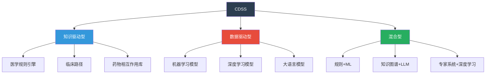
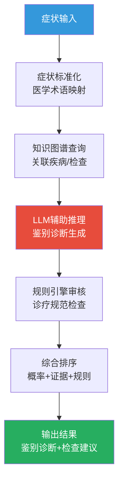

# 临床决策支持

## CDSS定义与分类

临床决策支持系统(Clinical Decision Support System, CDSS)是辅助医护人员做出临床决策的信息系统。

### CDSS分类

| 类型 | 原理 | 优势 | 局限 | 典型应用 |
|------|------|------|------|----------|
| 知识驱动型 | 预定义规则+知识库 | 可解释、确定性强 | 知识维护成本高、覆盖有限 | 合理用药审核、临床路径 |
| 数据驱动型 | ML/DL从数据中学习 | 发现隐含模式、可扩展 | 黑箱、需大量数据 | 影像AI诊断、风险预测 |
| 混合型 | 规则+ML/LLM | 兼具可解释性和智能性 | 架构复杂 | LLM辅助诊断+规则审核 |



## 知识库方法

### 医学规则引擎

```python
from pydantic import BaseModel, Field
from typing import Optional, Any
from enum import Enum
from datetime import datetime

class RuleSeverity(str, Enum):
    INFO = "提示"
    WARNING = "警告"
    CRITICAL = "严重"

class ClinicalRule(BaseModel):
    """临床规则定义"""
    rule_id: str
    name: str
    category: str  # 用药审核/诊疗规范/检查建议
    severity: RuleSeverity
    conditions: list[dict]  # 触发条件
    action: str  # 触发动作
    evidence: str  # 证据来源
    reference: Optional[str] = None

class RuleEngine:
    """医学规则引擎"""

    def __init__(self):
        self.rules: list[ClinicalRule] = []
        self._load_default_rules()

    def _load_default_rules(self):
        """加载默认临床规则"""
        self.rules = [
            # 合理用药规则
            ClinicalRule(
                rule_id="DRUG-001",
                name="青霉素过敏禁忌",
                category="用药审核",
                severity=RuleSeverity.CRITICAL,
                conditions=[
                    {"field": "patient.allergies", "operator": "contains", "value": "青霉素"},
                    {"field": "prescription.drug_class", "operator": "in", "value": ["青霉素类"]},
                ],
                action="患者对青霉素过敏，禁止使用青霉素类药物",
                evidence="药品说明书",
            ),
            ClinicalRule(
                rule_id="DRUG-002",
                name="肾功能不全剂量调整",
                category="用药审核",
                severity=RuleSeverity.WARNING,
                conditions=[
                    {"field": "patient.egfr", "operator": "<", "value": 30},
                    {"field": "prescription.drug_name", "operator": "in", "value": ["二甲双胍"]},
                ],
                action="患者eGFR<30，二甲双胍禁忌使用",
                evidence="二甲双胍临床应用专家共识",
            ),
            ClinicalRule(
                rule_id="DRUG-003",
                name="华法林+阿司匹林联用警告",
                category="用药审核",
                severity=RuleSeverity.WARNING,
                conditions=[
                    {"field": "prescription.drugs", "operator": "contains_all", "value": ["华法林", "阿司匹林"]},
                ],
                action="华法林与阿司匹林联用显著增加出血风险，需密切监测INR",
                evidence="ACCP抗栓指南",
            ),
            # 诊疗规范规则
            ClinicalRule(
                rule_id="CARE-001",
                name="高血压初诊检查建议",
                category="诊疗规范",
                severity=RuleSeverity.INFO,
                conditions=[
                    {"field": "diagnosis.code", "operator": "starts_with", "value": "I10"},
                    {"field": "encounter.type", "operator": "==", "value": "初诊"},
                ],
                action="建议完善：血常规、尿常规、生化、心电图、眼底检查",
                evidence="中国高血压防治指南",
            ),
            ClinicalRule(
                rule_id="CARE-002",
                name="糖尿病年度并发症筛查",
                category="诊疗规范",
                severity=RuleSeverity.INFO,
                conditions=[
                    {"field": "diagnosis.code", "operator": "starts_with", "value": "E11"},
                    {"field": "encounter.type", "operator": "==", "value": "年度随访"},
                ],
                action="建议完善：眼底检查、尿微量白蛋白、足部检查、神经传导",
                evidence="中国2型糖尿病防治指南",
            ),
            # 检查建议规则
            ClinicalRule(
                rule_id="EXAM-001",
                name="胸痛心电图检查",
                category="检查建议",
                severity=RuleSeverity.WARNING,
                conditions=[
                    {"field": "chief_complaint", "operator": "contains", "value": "胸痛"},
                    {"field": "ordered_exams", "operator": "not_contains", "value": "心电图"},
                ],
                action="胸痛患者应立即行心电图检查排除急性冠脉综合征",
                evidence="胸痛诊断与鉴别诊断专家共识",
            ),
        ]

    def evaluate(self, patient_data: dict, encounter_data: dict, prescription_data: dict) -> list[dict]:
        """评估所有规则，返回触发的规则"""
        context = {
            "patient": patient_data,
            "encounter": encounter_data,
            "prescription": prescription_data,
        }
        triggered = []

        for rule in self.rules:
            if self._evaluate_conditions(rule.conditions, context):
                triggered.append({
                    "rule_id": rule.rule_id,
                    "name": rule.name,
                    "category": rule.category,
                    "severity": rule.severity.value,
                    "action": rule.action,
                    "evidence": rule.evidence,
                })

        return triggered

    def _evaluate_conditions(self, conditions: list[dict], context: dict) -> bool:
        """评估规则条件(所有条件必须满足)"""
        for condition in conditions:
            field_path = condition["field"]
            operator = condition["operator"]
            expected = condition["value"]

            actual = self._get_field_value(field_path, context)
            if not self._compare(actual, operator, expected):
                return False
        return True

    def _get_field_value(self, field_path: str, context: dict) -> Any:
        """从上下文中获取字段值"""
        parts = field_path.split(".")
        value = context
        for part in parts:
            if isinstance(value, dict) and part in value:
                value = value[part]
            else:
                return None
        return value

    def _compare(self, actual: Any, operator: str, expected: Any) -> bool:
        """比较操作"""
        if actual is None:
            return False

        if operator == "contains":
            return expected in str(actual)
        elif operator == "not_contains":
            return expected not in str(actual)
        elif operator == "contains_all":
            return all(item in actual for item in expected)
        elif operator == "in":
            return actual in expected
        elif operator == "==":
            return actual == expected
        elif operator == "<":
            return float(actual) < float(expected)
        elif operator == ">":
            return float(actual) > float(expected)
        elif operator == "starts_with":
            return str(actual).startswith(str(expected))

        return False
```

### 临床路径知识库

```python
from pydantic import BaseModel, Field
from typing import Optional

class ClinicalPathwayKnowledge(BaseModel):
    """临床路径知识库"""
    disease_name: str
    icd10_code: str
    entry_criteria: list[str]
    standard_orders: list[str]
    key_exams: list[str]
    treatment_options: list[dict]
    discharge_criteria: list[str]
    follow_up_plan: str

# 临床路径知识库
CLINICAL_PATHWAYS = {
    "J18.9": ClinicalPathwayKnowledge(
        disease_name="社区获得性肺炎",
        icd10_code="J18.9",
        entry_criteria=["发热", "咳嗽咳痰", "肺部阴影"],
        severity_stratification={
            "门诊治疗": "CURB-65 <= 2",
            "住院治疗": "CURB-65 >= 3 或 PSI Class IV+",
            "ICU收治": "CURB-65 >= 4",
        },
        standard_orders=[
            "血常规+CRP",
            "肝肾功能+电解质",
            "胸部CT",
            "血培养(住院患者)",
            "动脉血气(重症)",
        ],
        key_exams=["胸部影像", "炎症指标", "病原学"],
        treatment_options=[
            {
                "scenario": "门诊-无合并症",
                "antibiotic": "阿莫西林 1g tid",
                "duration": "5-7天",
            },
            {
                "scenario": "住院-无合并症",
                "antibiotic": "头孢曲松 2g qd + 阿奇霉素 0.5g qd",
                "duration": "7-10天",
            },
            {
                "scenario": "住院-有合并症",
                "antibiotic": "哌拉西林他唑巴坦 4.5g q8h",
                "duration": "7-14天",
            },
        ],
        discharge_criteria=[
            "体温正常>24h",
            "呼吸频率<24次/分",
            "心率<100次/分",
            "收缩压>90mmHg",
            "血氧饱和度>90%",
            "可口服药物",
        ],
        follow_up_plan="出院后2周门诊复查，4-6周复查胸部CT",
    ),
}
```

## AI方法

### LLM辅助诊断

```python
from pydantic import BaseModel, Field
from typing import Optional
from enum import Enum

class DiagnosisSuggestion(BaseModel):
    """诊断建议"""
    disease_name: str
    icd10_code: Optional[str] = None
    probability: float = Field(ge=0, le=1)
    reasoning: str
    supporting_evidence: list[str]
    recommended_exams: list[str]
    is_ai_generated: bool = True

class AIDiagnosisResult(BaseModel):
    """AI辅助诊断结果"""
    session_id: str
    patient_id: str
    chief_complaint: str
    differential_diagnoses: list[DiagnosisSuggestion]
    exam_suggestions: list[str]
    treatment_suggestions: list[str]
    confidence_note: str = "AI辅助分析结果仅供参考，不构成诊断依据"
    disclaimer: str = "本结果由AI辅助生成，最终诊断须由执业医师确认"

# LLM辅助诊断Prompt模板
DIAGNOSIS_PROMPT_TEMPLATE = """你是一位经验丰富的临床医师助手。根据以下患者信息，提供鉴别诊断建议。

## 患者信息
- 主诉：{chief_complaint}
- 现病史：{present_illness}
- 既往史：{past_history}
- 体格检查：{physical_exam}
- 辅助检查：{auxiliary_exam}

## 任务
1. 列出3-5个最可能的鉴别诊断，按可能性排序
2. 每个诊断给出：
   - 诊断名称及ICD-10编码
   - 支持该诊断的依据
   - 不支持该诊断的依据
   - 需要进一步完善的检查
3. 给出初步治疗建议

## 重要声明
你的分析仅供临床参考，不能替代医师的临床判断。所有AI辅助结果必须由执业医师审核确认。

请以JSON格式输出结果。"""

def build_diagnosis_prompt(
    chief_complaint: str,
    present_illness: str,
    past_history: str = "无特殊",
    physical_exam: str = "未提供",
    auxiliary_exam: str = "未提供",
) -> str:
    """构建辅助诊断Prompt"""
    return DIAGNOSIS_PROMPT_TEMPLATE.format(
        chief_complaint=chief_complaint,
        present_illness=present_illness,
        past_history=past_history,
        physical_exam=physical_exam,
        auxiliary_exam=auxiliary_exam,
    )
```

### 症状-疾病映射

```python
from pydantic import BaseModel, Field
from typing import Optional

class SymptomDiseaseMapping(BaseModel):
    """症状-疾病映射关系"""
    symptom: str
    disease: str
    icd10_code: str
    probability_weight: float = Field(..., ge=0, le=1, description="该症状对该疾病的提示权重")
    is_key_symptom: bool = False

# 症状-疾病知识库(简化版)
SYMPTOM_DISEASE_MAP: list[SymptomDiseaseMapping] = [
    # 胸痛相关
    SymptomDiseaseMapping(symptom="胸骨后压榨性疼痛", disease="急性心肌梗死", icd10_code="I21.9", probability_weight=0.7, is_key_symptom=True),
    SymptomDiseaseMapping(symptom="胸痛+呼吸困难", disease="肺栓塞", icd10_code="I26.9", probability_weight=0.5, is_key_symptom=True),
    SymptomDiseaseMapping(symptom="撕裂样胸痛", disease="主动脉夹层", icd10_code="I71.0", probability_weight=0.6, is_key_symptom=True),
    # 发热相关
    SymptomDiseaseMapping(symptom="发热+咳嗽+肺部阴影", disease="社区获得性肺炎", icd10_code="J18.9", probability_weight=0.8, is_key_symptom=True),
    SymptomDiseaseMapping(symptom="发热+右上腹痛", disease="急性胆囊炎", icd10_code="K81.0", probability_weight=0.6, is_key_symptom=True),
    SymptomDiseaseMapping(symptom="发热+转移性右下腹痛", disease="急性阑尾炎", icd10_code="K35.9", probability_weight=0.85, is_key_symptom=True),
    # 头痛相关
    SymptomDiseaseMapping(symptom="突发剧烈头痛", disease="蛛网膜下腔出血", icd10_code="I60.9", probability_weight=0.6, is_key_symptom=True),
    SymptomDiseaseMapping(symptom="头痛+发热+颈强直", disease="化脓性脑膜炎", icd10_code="G00.9", probability_weight=0.7, is_key_symptom=True),
    # 腹痛相关
    SymptomDiseaseMapping(symptom="上腹痛+反酸", disease="胃溃疡", icd10_code="K25.9", probability_weight=0.5),
    SymptomDiseaseMapping(symptom="左上腹疼痛+血淀粉酶升高", disease="急性胰腺炎", icd10_code="K85.9", probability_weight=0.8, is_key_symptom=True),
]

def map_symptoms_to_diseases(symptoms: list[str]) -> list[dict]:
    """根据症状列表映射可能的疾病"""
    disease_scores: dict[str, float] = {}
    disease_details: dict[str, dict] = {}

    for symptom in symptoms:
        for mapping in SYMPTOM_DISEASE_MAP:
            if symptom in mapping.symptom or mapping.symptom in symptom:
                disease = mapping.disease
                if disease not in disease_scores:
                    disease_scores[disease] = 0.0
                    disease_details[disease] = {
                        "icd10": mapping.icd10_code,
                        "matched_symptoms": [],
                        "key_symptoms_matched": 0,
                    }
                disease_scores[disease] += mapping.probability_weight
                disease_details[disease]["matched_symptoms"].append(symptom)
                if mapping.is_key_symptom:
                    disease_details[disease]["key_symptoms_matched"] += 1

    # 归一化得分
    max_score = max(disease_scores.values()) if disease_scores else 1.0
    results = []
    for disease, score in sorted(disease_scores.items(), key=lambda x: x[1], reverse=True):
        details = disease_details[disease]
        results.append({
            "disease": disease,
            "icd10_code": details["icd10"],
            "probability": round(score / max_score, 2),
            "matched_symptoms": details["matched_symptoms"],
            "key_symptoms_matched": details["key_symptoms_matched"],
        })

    return results[:5]  # 返回Top5
```

## 辅助诊断流程



### 辅助诊断API

```python
from pydantic import BaseModel, Field
from typing import Optional
from datetime import datetime

class SymptomInput(BaseModel):
    """症状输入"""
    symptoms: list[str] = Field(..., min_length=1, description="症状列表")
    duration: Optional[str] = Field(None, description="症状持续时间")
    severity: Optional[str] = Field(None, description="严重程度")
    additional_info: Optional[str] = Field(None, description="补充说明")

class DifferentialDiagnosisOutput(BaseModel):
    """鉴别诊断输出"""
    disease: str
    icd10_code: str
    probability: float
    supporting_evidence: list[str]
    against_evidence: list[str]
    recommended_exams: list[str]
    key_differentiator: str

class DiagnosisSession(BaseModel):
    """诊断会话"""
    session_id: str
    patient_id: str
    symptoms: list[str]
    differential_diagnoses: list[DifferentialDiagnosisOutput]
    exam_suggestions: list[str]
    ai_disclaimer: str = "AI辅助分析结果，仅供参考，最终诊断由执业医师确认"
    created_at: datetime = Field(default_factory=datetime.now)

class CDSSService:
    """临床决策支持服务"""

    def __init__(self, rule_engine: RuleEngine):
        self.rule_engine = rule_engine

    def analyze_symptoms(
        self,
        patient_id: str,
        symptom_input: SymptomInput,
        patient_data: dict,
    ) -> DiagnosisSession:
        """症状分析：生成鉴别诊断"""
        # 1. 症状-疾病映射
        disease_candidates = map_symptoms_to_diseases(symptom_input.symptoms)

        # 2. 构建鉴别诊断
        differentials = []
        for candidate in disease_candidates[:5]:
            differentials.append(DifferentialDiagnosisOutput(
                disease=candidate["disease"],
                icd10_code=candidate["icd10_code"],
                probability=candidate["probability"],
                supporting_evidence=candidate["matched_symptoms"],
                against_evidence=[],
                recommended_exams=self._get_recommended_exams(candidate["disease"]),
                key_differentiator=self._get_key_differentiator(candidate["disease"]),
            ))

        # 3. 生成检查建议
        exam_suggestions = self._generate_exam_suggestions(
            symptom_input.symptoms, differentials,
        )

        return DiagnosisSession(
            session_id=f"DX-{datetime.now().strftime('%Y%m%d%H%M%S')}",
            patient_id=patient_id,
            symptoms=symptom_input.symptoms,
            differential_diagnoses=differentials,
            exam_suggestions=exam_suggestions,
        )

    def suggest_exams(
        self,
        diagnosis: str,
        patient_data: dict,
    ) -> list[dict]:
        """根据诊断建议检查项目"""
        EXAM_SUGGESTION_RULES = {
            "急性心肌梗死": [
                {"exam": "心电图", "urgency": "紧急", "reason": "快速鉴别ST段抬高"},
                {"exam": "心肌酶谱(肌钙蛋白)", "urgency": "紧急", "reason": "确诊指标"},
                {"exam": "冠脉造影", "urgency": "紧急", "reason": "确定梗死部位"},
            ],
            "社区获得性肺炎": [
                {"exam": "血常规+CRP", "urgency": "常规", "reason": "评估感染程度"},
                {"exam": "胸部CT", "urgency": "常规", "reason": "确认肺部病变"},
                {"exam": "血培养", "urgency": "住院必须", "reason": "病原学诊断"},
            ],
            "急性阑尾炎": [
                {"exam": "血常规+CRP", "urgency": "常规", "reason": "评估感染程度"},
                {"exam": "腹部超声", "urgency": "常规", "reason": "确认阑尾肿大"},
                {"exam": "腹部CT", "urgency": "可选", "reason": "超声阴性时"},
            ],
        }
        return EXAM_SUGGESTION_RULES.get(diagnosis, [])

    def _get_recommended_exams(self, disease: str) -> list[str]:
        """获取推荐检查"""
        disease_exams = {
            "急性心肌梗死": ["心电图", "心肌酶谱", "冠脉造影", "心脏超声"],
            "社区获得性肺炎": ["血常规+CRP", "胸部CT", "血培养", "血气分析"],
            "急性阑尾炎": ["血常规+CRP", "腹部超声", "尿常规", "腹部CT"],
            "肺栓塞": ["D-二聚体", "CTPA", "下肢静脉超声", "心脏超声"],
            "主动脉夹层": ["增强CT血管造影", "心脏超声", "X线"],
        }
        return disease_exams.get(disease, [])

    def _get_key_differentiator(self, disease: str) -> str:
        """获取关键鉴别点"""
        differentiators = {
            "急性心肌梗死": "心电图ST段改变+心肌标志物升高",
            "肺栓塞": "D-二聚体升高+CTPA充盈缺损",
            "主动脉夹层": "增强CT示内膜瓣/真假腔",
            "社区获得性肺炎": "肺部浸润影+炎症指标升高",
            "急性阑尾炎": "转移性右下腹痛+麦氏点压痛",
        }
        return differentiators.get(disease, "需结合临床综合判断")

    def _generate_exam_suggestions(
        self,
        symptoms: list[str],
        differentials: list[DifferentialDiagnosisOutput],
    ) -> list[str]:
        """生成综合检查建议"""
        all_exams = set()
        for dd in differentials:
            all_exams.update(dd.recommended_exams)
        return sorted(list(all_exams))
```

## 合理用药审核

```python
from pydantic import BaseModel, Field
from typing import Optional
from enum import Enum

class AlertType(str, Enum):
    ALLERGY = "过敏禁忌"
    INTERACTION = "配伍禁忌"
    DOSAGE = "剂量异常"
    DUPLICATE = "重复用药"
    INDICATION = "适应症"
    CONTRAINDICATION = "禁忌症"

class MedicationAlertDetail(BaseModel):
    """用药审查详情"""
    alert_type: AlertType
    severity: str  # 提示/警告/严重/禁止
    drug_name: str
    message: str
    suggestion: Optional[str] = None
    reference: Optional[str] = None

class MedicationReviewResult(BaseModel):
    """用药审查结果"""
    prescription_id: str
    is_safe: bool
    alerts: list[MedicationAlertDetail]
    reviewed_at: str

class PrescriptionReviewService:
    """处方审核服务"""

    def __init__(self):
        self.allergy_db = self._load_allergy_database()
        self.interaction_db = self._load_interaction_database()
        self.dosage_db = self._load_dosage_database()
        self.contraindication_db = self._load_contraindication_database()

    def review(self, prescription_data: dict, patient_data: dict) -> MedicationReviewResult:
        """完整处方审核"""
        alerts = []
        drugs = prescription_data.get("items", [])

        # 1. 过敏检查
        alerts.extend(self._check_allergies(drugs, patient_data))

        # 2. 配伍禁忌
        alerts.extend(self._check_interactions(drugs))

        # 3. 剂量审查
        alerts.extend(self._check_dosage(drugs, patient_data))

        # 4. 重复用药
        alerts.extend(self._check_duplicates(drugs))

        # 5. 禁忌症
        alerts.extend(self._check_contraindications(drugs, patient_data))

        is_safe = not any(a.severity in ["严重", "禁止"] for a in alerts)

        return MedicationReviewResult(
            prescription_id=prescription_data.get("prescription_id", ""),
            is_safe=is_safe,
            alerts=alerts,
            reviewed_at=datetime.now().isoformat(),
        )

    def _check_allergies(self, drugs: list, patient_data: dict) -> list[MedicationAlertDetail]:
        """过敏检查"""
        alerts = []
        patient_allergies = patient_data.get("allergies", [])

        ALLERGY_CROSS_REACTIVITY = {
            "青霉素": ["阿莫西林", "氨苄西林", "哌拉西林", "青霉素V钾"],
            "磺胺": ["磺胺甲噁唑", "复方新诺明"],
            "碘造影剂": ["碘海醇", "碘佛醇", "碘普罗胺"],
        }

        for allergen in patient_allergies:
            cross_reactive_drugs = ALLERGY_CROSS_REACTIVITY.get(allergen, [])
            for drug in drugs:
                if drug.get("drug_name") in cross_reactive_drugs:
                    alerts.append(MedicationAlertDetail(
                        alert_type=AlertType.ALLERGY,
                        severity="禁止",
                        drug_name=drug["drug_name"],
                        message=f"患者对{allergen}过敏，禁用{drug['drug_name']}",
                        suggestion="更换为替代药物",
                        reference="药品说明书/过敏史记录",
                    ))
        return alerts

    def _check_interactions(self, drugs: list) -> list[MedicationAlertDetail]:
        """配伍禁忌检查"""
        alerts = []
        INTERACTION_DB = {
            frozenset(["华法林", "阿司匹林"]): ("严重", "出血风险显著增加"),
            frozenset(["甲氨蝶呤", "布洛芬"]): ("严重", "甲氨蝶呤毒性增加"),
            frozenset(["ACEI", "螺内酯"]): ("警告", "高钾血症风险"),
            frozenset(["地高辛", "胺碘酮"]): ("警告", "地高辛血药浓度升高"),
        }

        drug_names = [d.get("drug_name") for d in drugs]
        for i in range(len(drug_names)):
            for j in range(i + 1, len(drug_names)):
                pair = frozenset([drug_names[i], drug_names[j]])
                if pair in INTERACTION_DB:
                    severity, message = INTERACTION_DB[pair]
                    alerts.append(MedicationAlertDetail(
                        alert_type=AlertType.INTERACTION,
                        severity=severity,
                        drug_name=f"{drug_names[i]}+{drug_names[j]}",
                        message=message,
                    ))
        return alerts

    def _check_dosage(self, drugs: list, patient_data: dict) -> list[MedicationAlertDetail]:
        """剂量审查"""
        alerts = []
        MAX_DOSAGE = {
            "阿莫西林": {"adult": 4000, "unit": "mg/day"},
            "二甲双胍": {"adult": 2550, "unit": "mg/day"},
            "阿托伐他汀": {"adult": 80, "unit": "mg/day"},
            "布洛芬": {"adult": 2400, "unit": "mg/day"},
            "奥美拉唑": {"adult": 40, "unit": "mg/day"},
        }

        for drug in drugs:
            drug_name = drug.get("drug_name")
            daily_dose = drug.get("daily_dose_mg", 0)

            if drug_name in MAX_DOSAGE:
                max_dose = MAX_DOSAGE[drug_name]["adult"]
                if daily_dose > max_dose:
                    alerts.append(MedicationAlertDetail(
                        alert_type=AlertType.DOSAGE,
                        severity="严重",
                        drug_name=drug_name,
                        message=f"日剂量{daily_dose}{MAX_DOSAGE[drug_name]['unit']}超过最大推荐剂量{max_dose}{MAX_DOSAGE[drug_name]['unit']}",
                        suggestion=f"建议调整至不超过{max_dose}{MAX_DOSAGE[drug_name]['unit']}/天",
                    ))

        # 肾功能不全剂量调整
        egfr = patient_data.get("egfr", 100)
        if egfr < 30:
            for drug in drugs:
                if drug.get("drug_name") == "二甲双胍":
                    alerts.append(MedicationAlertDetail(
                        alert_type=AlertType.CONTRAINDICATION,
                        severity="禁止",
                        drug_name="二甲双胍",
                        message=f"eGFR={egfr}<30，二甲双胍禁忌",
                        suggestion="更换为胰岛素或其他降糖方案",
                        reference="二甲双胍临床应用专家共识",
                    ))
        return alerts

    def _check_duplicates(self, drugs: list) -> list[MedicationAlertDetail]:
        """重复用药检查"""
        alerts = []
        DRUG_CLASS_MAP = {
            "阿莫西林": "青霉素类",
            "头孢呋辛": "头孢菌素类",
            "布洛芬": "NSAIDs",
            "对乙酰氨基酚": "解热镇痛药",
            "奥美拉唑": "PPI",
            "兰索拉唑": "PPI",
        }

        class_drugs: dict[str, list[str]] = {}
        for drug in drugs:
            drug_name = drug.get("drug_name")
            drug_class = DRUG_CLASS_MAP.get(drug_name)
            if drug_class:
                if drug_class not in class_drugs:
                    class_drugs[drug_class] = []
                class_drugs[drug_class].append(drug_name)

        for drug_class, drug_list in class_drugs.items():
            if len(drug_list) > 1:
                alerts.append(MedicationAlertDetail(
                    alert_type=AlertType.DUPLICATE,
                    severity="警告",
                    drug_name="+".join(drug_list),
                    message=f"同类别({drug_class})药物重复使用",
                    suggestion="保留一种即可",
                ))
        return alerts

    def _check_contraindications(self, drugs: list, patient_data: dict) -> list[MedicationAlertDetail]:
        """禁忌症检查"""
        alerts = []
        CONTRAINDICATIONS = {
            "妊娠": {
                "异维A酸": "致畸",
                "华法林": "致畸",
                "甲氨蝶呤": "致畸",
                "利巴韦林": "致畸",
                "ACEI": "胎儿损伤",
                "喹诺酮类": "软骨损伤",
            },
            "G6PD缺乏症": {
                "伯氨喹": "溶血",
                "磺胺类": "溶血",
                "呋喃妥因": "溶血",
            },
        }

        patient_conditions = patient_data.get("conditions", [])
        for condition in patient_conditions:
            if condition in CONTRAINDICATIONS:
                for drug in drugs:
                    drug_name = drug.get("drug_name")
                    if drug_name in CONTRAINDICATIONS[condition]:
                        alerts.append(MedicationAlertDetail(
                            alert_type=AlertType.CONTRAINDICATION,
                            severity="禁止",
                            drug_name=drug_name,
                            message=f"{condition}患者禁用{drug_name}，原因：{CONTRAINDICATIONS[condition][drug_name]}",
                            suggestion="更换为安全替代药物",
                        ))
        return alerts

    # 数据库加载方法(模拟)
    def _load_allergy_database(self) -> dict:
        return {}

    def _load_interaction_database(self) -> dict:
        return {}

    def _load_dosage_database(self) -> dict:
        return {}

    def _load_contraindication_database(self) -> dict:
        return {}
```

## CDSS集成方式

### 独立系统 vs 嵌入EMR

| 集成方式 | 优势 | 劣势 | 适用场景 |
|----------|------|------|----------|
| 独立系统 | 部署灵活、不影响EMR | 医生需切换系统 | 新建医院、试点项目 |
| 嵌入EMR | 工作流无缝集成 | 开发成本高 | 成熟医院信息化环境 |
| API服务 | 松耦合、多端调用 | 需网络稳定 | 混合架构 |

### CDSS嵌入EMR的集成架构

```python
from fastapi import FastAPI, HTTPException
from pydantic import BaseModel, Field
from typing import Optional
from datetime import datetime

app = FastAPI(title="CDSS Service", version="1.0.0")

# --- Request/Response Models ---

class CDSSSymptomRequest(BaseModel):
    """CDSS症状分析请求"""
    patient_id: str
    symptoms: list[str]
    duration: Optional[str] = None
    severity: Optional[str] = None
    present_illness: Optional[str] = None
    past_history: Optional[str] = None

class CDSSDiagnosisRequest(BaseModel):
    """CDSS诊断请求"""
    patient_id: str
    encounter_id: str
    symptoms: list[str]
    lab_results: Optional[dict] = None
    imaging_findings: Optional[str] = None

class CDSSPrescriptionCheckRequest(BaseModel):
    """CDSS处方审核请求"""
    patient_id: str
    prescription_id: str
    drugs: list[dict]
    patient_allergies: list[str] = []
    patient_conditions: list[str] = []
    patient_egfr: Optional[float] = None
    patient_age: Optional[int] = None

class CDSSResponse(BaseModel):
    """CDSS通用响应"""
    status: str = "success"
    data: dict
    ai_disclaimer: str = "AI辅助结果仅供参考，不构成诊断或治疗依据，最终决策由执业医师确认"
    timestamp: str = Field(default_factory=lambda: datetime.now().isoformat())

# --- API Endpoints ---

@app.post("/api/v1/cdss/symptom-analysis", response_model=CDSSResponse)
async def analyze_symptoms(request: CDSSSymptomRequest):
    """症状分析：根据症状生成鉴别诊断"""
    service = CDSSService(RuleEngine())
    symptom_input = SymptomInput(
        symptoms=request.symptoms,
        duration=request.duration,
        severity=request.severity,
    )
    result = service.analyze_symptoms(
        patient_id=request.patient_id,
        symptom_input=symptom_input,
        patient_data={"past_history": request.past_history or ""},
    )
    return CDSSResponse(data=result.model_dump())

@app.post("/api/v1/cdss/differential-diagnosis", response_model=CDSSResponse)
async def generate_differential_diagnosis(request: CDSSDiagnosisRequest):
    """鉴别诊断：结合症状和检查结果生成鉴别诊断"""
    disease_candidates = map_symptoms_to_diseases(request.symptoms)
    return CDSSResponse(data={
        "patient_id": request.patient_id,
        "differential_diagnoses": disease_candidates,
    })

@app.post("/api/v1/cdss/exam-suggestion", response_model=CDSSResponse)
async def suggest_exams(request: CDSSDiagnosisRequest):
    """检查建议：根据当前诊断建议进一步检查"""
    service = CDSSService(RuleEngine())
    suggestions = []
    disease_candidates = map_symptoms_to_diseases(request.symptoms)
    for candidate in disease_candidates[:3]:
        exams = service.suggest_exams(candidate["disease"], {})
        suggestions.append({
            "disease": candidate["disease"],
            "exams": exams,
        })
    return CDSSResponse(data={"suggestions": suggestions})

@app.post("/api/v1/cdss/prescription-check", response_model=CDSSResponse)
async def check_prescription(request: CDSSPrescriptionCheckRequest):
    """处方审核：合理用药审查"""
    service = PrescriptionReviewService()
    result = service.review(
        prescription_data={
            "prescription_id": request.prescription_id,
            "items": request.drugs,
        },
        patient_data={
            "allergies": request.patient_allergies,
            "conditions": request.patient_conditions,
            "egfr": request.patient_egfr or 100,
            "age": request.patient_age or 30,
        },
    )
    return CDSSResponse(data=result.model_dump())
```

## CDSS部署与运维注意事项

1. **AI辅助声明**：所有CDSS输出必须包含"AI辅助，仅供参考"的声明
2. **规则更新**：医学知识持续更新，规则引擎需要定期维护
3. **误报管理**：过高的误报率会导致"报警疲劳"，需优化阈值
4. **临床流程嵌入**：CDSS必须嵌入临床工作流，而非作为独立系统
5. **审计追踪**：所有CDSS建议被采纳/拒绝的记录需要保存
6. **模型监控**：定期评估模型性能，检测数据漂移
7. **法规合规**：CDSS作为II/III类医疗器械需获得相应注册证
