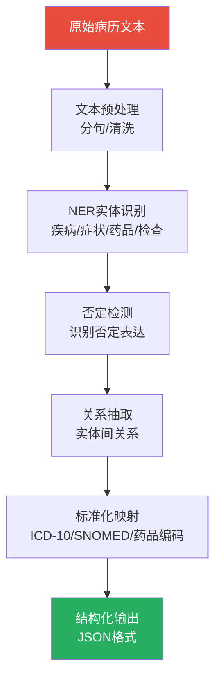

# NLP与电子病历

## 电子病历结构化挑战

电子病历(EMR)中大量信息以自由文本形式存在，结构化是AI应用的基础前提。

### 非结构化问题

| 问题 | 示例 | 影响 |
|------|------|------|
| 表述不规范 | "BP 120/80" vs "血压120/80mmHg" | 信息提取困难 |
| 缩写歧义 | "CA"可能是癌症/钙/心脏骤停 | 实体识别混淆 |
| 否定表达 | "无发热"、"未见明显积液" | 误提取为阳性 |
| 条件表达 | "若有发热可服用" | 误提取为已发生 |
| 模糊描述 | "大约3cm"、"稍偏高" | 定量分析困难 |
| 病史嵌套 | "5年前患肺结核已治愈" | 时序信息复杂 |


## 医学NLP任务

### 命名实体识别(NER)

医学NER需要识别文本中的疾病、症状、药品、检查等实体。

```python
from pydantic import BaseModel, Field
from enum import Enum
from typing import Optional

class EntityType(str, Enum):
    DISEASE = "疾病"
    SYMPTOM = "症状"
    MEDICINE = "药品"
    EXAM = "检查"
    BODY_PART = "身体部位"
    DOSAGE = "剂量"
    FREQUENCY = "频次"
    DURATION = "持续时间"
    NEGATION = "否定词"

class Entity(BaseModel):
    """识别出的实体"""
    text: str = Field(..., description="原文中的文本")
    entity_type: EntityType
    start_pos: int = Field(..., description="起始位置")
    end_pos: int = Field(..., description="结束位置")
    confidence: float = Field(ge=0, le=1)
    normalized_code: Optional[str] = Field(None, description="标准化编码")
    is_negated: bool = Field(False, description="是否被否定")

class NERResult(BaseModel):
    """NER识别结果"""
    text: str
    entities: list[Entity]
    processed_at: str

# NER标注示例
NER_EXAMPLES = [
    {
        "text": "患者因反复上腹痛3天入院，既往有胃溃疡病史，否认高血压、糖尿病。",
        "entities": [
            {"text": "上腹痛", "type": "症状", "start": 6, "end": 9},
            {"text": "3天", "type": "持续时间", "start": 9, "end": 11},
            {"text": "胃溃疡", "type": "疾病", "start": 17, "end": 20},
            {"text": "高血压", "type": "疾病", "start": 24, "end": 27, "is_negated": True},
            {"text": "糖尿病", "type": "疾病", "start": 28, "end": 31, "is_negated": True},
            {"text": "否认", "type": "否定词", "start": 22, "end": 24},
        ],
    },
    {
        "text": "给予头孢呋辛1.5g静脉滴注bid，奥美拉唑40mg静脉推注qd。",
        "entities": [
            {"text": "头孢呋辛", "type": "药品", "start": 2, "end": 6},
            {"text": "1.5g", "type": "剂量", "start": 6, "end": 10},
            {"text": "静脉滴注", "type": "给药途径", "start": 10, "end": 14},
            {"text": "bid", "type": "频次", "start": 14, "end": 17},
            {"text": "奥美拉唑", "type": "药品", "start": 18, "end": 22},
            {"text": "40mg", "type": "剂量", "start": 22, "end": 26},
            {"text": "静脉推注", "type": "给药途径", "start": 26, "end": 30},
            {"text": "qd", "type": "频次", "start": 30, "end": 32},
        ],
    },
]
```

### 关系抽取

```python
from enum import Enum
from pydantic import BaseModel, Field
from typing import Optional

class RelationType(str, Enum):
    CAUSES = "导致"           # 疾病导致症状
    TREATS = "治疗"           # 药品治疗疾病
    DIAGNOSED_BY = "诊断"     # 疾病由检查诊断
    HAS_SYMPTOM = "有症状"    # 疾病的典型症状
    CONTRAINDICATED = "禁忌"   # 药品禁忌疾病
    SIDE_EFFECT = "不良反应"   # 药品的不良反应

class Relation(BaseModel):
    """实体关系"""
    subject: str
    subject_type: str
    relation: RelationType
    object: str
    object_type: str
    confidence: float = Field(ge=0, le=1)
    source_sentence: Optional[str] = None

# 医学关系抽取示例
MEDICAL_RELATIONS = [
    Relation(subject="阿莫西林", subject_type="药品", relation=RelationType.TREATS, object="社区获得性肺炎", object_type="疾病", confidence=0.95),
    Relation(subject="社区获得性肺炎", subject_type="疾病", relation=RelationType.HAS_SYMPTOM, object="发热", object_type="症状", confidence=0.90),
    Relation(subject="社区获得性肺炎", subject_type="疾病", relation=RelationType.HAS_SYMPTOM, object="咳嗽", object_type="症状", confidence=0.92),
    Relation(subject="社区获得性肺炎", subject_type="疾病", relation=RelationType.DIAGNOSED_BY, object="胸部CT", object_type="检查", confidence=0.88),
    Relation(subject="华法林", subject_type="药品", relation=RelationType.SIDE_EFFECT, object="出血", object_type="症状", confidence=0.85),
    Relation(subject="二甲双胍", subject_type="药品", relation=RelationType.CONTRAINDICATED, object="肾功能不全", object_type="疾病", confidence=0.92),
]
```

### 文本分类

```python
from pydantic import BaseModel, Field
from enum import Enum

class RecordCategory(str, Enum):
    ADMISSION = "入院记录"
    PROGRESS = "病程记录"
    SURGICAL = "手术记录"
    DISCHARGE = "出院记录"
    CONSULTATION = "会诊记录"

class PathologyGrade(str, Enum):
    BENIGN = "良性"
    BORDERLINE = "交界性"
    MALIGNANT = "恶性"

class TextClassificationResult(BaseModel):
    """文本分类结果"""
    text: str
    predicted_category: str
    confidence: float
    all_scores: dict[str, float]

# 病历文本分类任务
RECORD_CLASSIFICATION_TASKS = {
    "病历类型分类": {
        "categories": ["入院记录", "病程记录", "手术记录", "出院记录"],
        "model": "BERT-based classifier",
    },
    "病历质控分类": {
        "categories": ["合格", "缺陷-缺项", "缺陷-描述不规范", "缺陷-时限超期"],
        "model": "BERT + rules",
    },
    "病理报告分级": {
        "categories": ["良性", "交界性", "恶性"],
        "model": "BioBERT fine-tuned",
    },
}
```

## 预训练模型

### 医学领域预训练模型对比

| 模型 | 训练数据 | 语言 | 参数量 | 适用任务 |
|------|----------|------|--------|----------|
| BioBERT | PubMed摘要+PMC全文 | 英文 | 110M | 英文医学NER/关系抽取 |
| PubMedBERT | PubMed全文 | 英文 | 110M | 英文医学理解 |
| ClinicalBERT | MIMIC-III临床笔记 | 英文 | 110M | 英文临床文本 |
| RoBERTa-wwm-ext-medical | 中文医学文献 | 中文 | 102M | 中文医学NER/分类 |
| MC-BERT | 中文医学百科+文献 | 中文 | 110M | 中文医学NLP |
| CMedBERT | 中文医学文献+病历 | 中文 | 110M | 中文医学NER |

### 使用Hugging Face Transformers进行医学NER

```python
from transformers import (
    AutoTokenizer,
    AutoModelForTokenClassification,
    pipeline,
)
from pydantic import BaseModel, Field
from typing import Optional

# 加载中文医学NER模型
class MedicalNER:
    """基于预训练模型的医学NER"""

    # 实体类型标签映射
    LABEL_MAP = {
        0: "O",
        1: "B-DISEASE", 2: "I-DISEASE",
        3: "B-SYMPTOM", 4: "I-SYMPTOM",
        5: "B-MEDICINE", 6: "I-MEDICINE",
        7: "B-EXAM", 8: "I-EXAM",
        9: "B-BODY_PART", 10: "I-BODY_PART",
    }

    def __init__(self, model_name: str = "'emilyalsentzer/Bio_ClinicalBERT'"):
        """初始化NER模型"""
        self.tokenizer = AutoTokenizer.from_pretrained(model_name)
        self.model = AutoModelForTokenClassification.from_pretrained(model_name)
        self.ner_pipeline = pipeline(
            "ner",
            model=self.model,
            tokenizer=self.tokenizer,
            aggregation_strategy="simple",
        )

    def extract_entities(self, text: str) -> list[Entity]:
        """提取医学实体"""
        raw_results = self.ner_pipeline(text)
        entities = []

        for result in raw_results:
            entity_type_str = result.get("entity_group", result.get("entity", ""))
            entity_type = self._map_label_to_type(entity_type_str)

            if entity_type:
                entities.append(Entity(
                    text=result["word"],
                    entity_type=entity_type,
                    start_pos=result.get("start", 0),
                    end_pos=result.get("end", 0),
                    confidence=result.get("score", 0.0),
                    is_negated=self._check_negation(text, result.get("start", 0)),
                ))

        return entities

    def _map_label_to_type(self, label: str) -> Optional[EntityType]:
        """映射标签到实体类型"""
        label_mapping = {
            "DISEASE": EntityType.DISEASE,
            "SYMPTOM": EntityType.SYMPTOM,
            "MEDICINE": EntityType.MEDICINE,
            "EXAM": EntityType.EXAM,
            "BODY_PART": EntityType.BODY_PART,
        }
        for key, entity_type in label_mapping.items():
            if key in label.upper():
                return entity_type
        return None

    def _check_negation(self, text: str, pos: int) -> bool:
        """简单的否定检测"""
        negation_words = ["无", "否认", "未", "未见", "没有", "无"]
        window = text[max(0, pos - 20):pos]
        return any(neg in window for neg in negation_words)
```

## 病历结构化Pipeline

### 完整Pipeline架构



### Pipeline代码实现

```python
import re
from pydantic import BaseModel, Field
from typing import Optional
from datetime import datetime
from enum import Enum

class StructuredSymptom(BaseModel):
    """结构化症状"""
    symptom_name: str
    body_part: Optional[str] = None
    duration: Optional[str] = None
    severity: Optional[str] = None
    is_negated: bool = False
    onset: Optional[str] = None
    original_text: str

class StructuredDisease(BaseModel):
    """结构化疾病"""
    disease_name: str
    icd10_code: Optional[str] = None
    is_primary: bool = False
    is_negated: bool = False
    original_text: str

class StructuredMedication(BaseModel):
    """结构化用药"""
    drug_name: str
    dosage: Optional[str] = None
    route: Optional[str] = None
    frequency: Optional[str] = None
    duration_days: Optional[int] = None
    atc_code: Optional[str] = None

class StructuredExam(BaseModel):
    """结构化检查"""
    exam_name: str
    result: Optional[str] = None
    is_abnormal: Optional[bool] = None
    original_text: str

class StructuredMedicalRecord(BaseModel):
    """结构化病历"""
    record_id: str
    patient_id: str
    chief_complaint: Optional[str] = None
    symptoms: list[StructuredSymptom] = Field(default_factory=list)
    diseases: list[StructuredDisease] = Field(default_factory=list)
    medications: list[StructuredMedication] = Field(default_factory=list)
    exams: list[StructuredExam] = Field(default_factory=list)
    negated_findings: list[str] = Field(default_factory=list)
    processed_at: str = Field(default_factory=lambda: datetime.now().isoformat())

class EMRStructuringPipeline:
    """病历结构化Pipeline"""

    def __init__(self):
        self.negation_words = ["无", "否认", "未", "未见", "没有", "阴性"]
        self.symptom_keywords = [
            "疼痛", "发热", "咳嗽", "咳痰", "呼吸困难", "恶心", "呕吐",
            "腹泻", "便秘", "头痛", "头晕", "乏力", "水肿", "出血",
        ]
        self.disease_keywords = [
            "肺炎", "高血压", "糖尿病", "冠心病", "溃疡", "肝炎",
            "阑尾炎", "骨折", "肿瘤", "梗死",
        ]
        self.dosage_pattern = re.compile(r'(\d+\.?\d*)\s*(mg|g|ml|ug|IU|U)')
        self.frequency_pattern = re.compile(r'\b(qd|bid|tid|qid|q8h|q12h|qn|prn|stat)\b', re.IGNORECASE)

        # ICD-10编码映射(简化版)
        self.icd10_mapping = {
            "社区获得性肺炎": "J18.9",
            "高血压": "I10",
            "2型糖尿病": "E11.9",
            "急性阑尾炎": "K35.9",
            "胃溃疡": "K25.9",
            "冠心病": "I25.1",
            "急性心肌梗死": "I21.9",
        }

    def process(self, record_id: str, patient_id: str, text: str) -> StructuredMedicalRecord:
        """处理病历文本，输出结构化数据"""
        # 1. 文本预处理
        cleaned_text = self._preprocess(text)

        # 2. 提取各类型实体
        symptoms = self._extract_symptoms(cleaned_text)
        diseases = self._extract_diseases(cleaned_text)
        medications = self._extract_medications(cleaned_text)
        exams = self._extract_exams(cleaned_text)
        negated = self._extract_negated(cleaned_text)

        # 3. 提取主诉
        chief_complaint = self._extract_chief_complaint(cleaned_text)

        return StructuredMedicalRecord(
            record_id=record_id,
            patient_id=patient_id,
            chief_complaint=chief_complaint,
            symptoms=symptoms,
            diseases=diseases,
            medications=medications,
            exams=exams,
            negated_findings=negated,
        )

    def _preprocess(self, text: str) -> str:
        """文本预处理"""
        text = re.sub(r'\s+', ' ', text)  # 合并多余空格
        text = text.strip()
        return text

    def _extract_chief_complaint(self, text: str) -> Optional[str]:
        """提取主诉"""
        match = re.search(r'主诉[：:](.*?)(?:\n|现病史)', text)
        if match:
            return match.group(1).strip()
        return None

    def _extract_symptoms(self, text: str) -> list[StructuredSymptom]:
        """提取症状"""
        symptoms = []
        for keyword in self.symptom_keywords:
            pattern = re.compile(rf'([^\s，。]+{keyword})')
            matches = pattern.findall(text)
            for match in matches:
                is_negated = self._is_negated(text, match)
                if not is_negated:
                    # 尝试提取持续时间
                    duration = None
                    duration_match = re.search(rf'(\d+[天月年小时周])[^。]*{re.escape(match)}', text)
                    if duration_match:
                        duration = duration_match.group(1)

                    symptoms.append(StructuredSymptom(
                        symptom_name=match,
                        duration=duration,
                        is_negated=False,
                        original_text=match,
                    ))
        return symptoms

    def _extract_diseases(self, text: str) -> list[StructuredDisease]:
        """提取疾病"""
        diseases = []
        for keyword in self.disease_keywords:
            pattern = re.compile(rf'([^\s，。]*{keyword})')
            matches = pattern.findall(text)
            for match in matches:
                is_negated = self._is_negated(text, match)
                if not is_negated:
                    icd10 = self.icd10_mapping.get(match)
                    diseases.append(StructuredDisease(
                        disease_name=match,
                        icd10_code=icd10,
                        is_primary=False,
                        is_negated=False,
                        original_text=match,
                    ))
        return diseases

    def _extract_medications(self, text: str) -> list[StructuredMedication]:
        """提取用药信息"""
        medications = []
        med_pattern = re.compile(r'([\u4e00-\u9fa5]{2,6}(?:胶囊|片|注射液|颗粒|缓释片|分散片))')
        matches = med_pattern.findall(text)

        for med_name in matches:
            # 查找该药品附近的剂量和频次
            context = text[max(0, text.find(med_name) - 10):text.find(med_name) + 50]

            dosage = None
            dosage_match = self.dosage_pattern.search(context)
            if dosage_match:
                dosage = dosage_match.group(0)

            frequency = None
            freq_match = self.frequency_pattern.search(context)
            if freq_match:
                frequency = freq_match.group(0).lower()

            medications.append(StructuredMedication(
                drug_name=med_name,
                dosage=dosage,
                frequency=frequency,
            ))

        return medications

    def _extract_exams(self, text: str) -> list[StructuredExam]:
        """提取检查"""
        exams = []
        exam_keywords = [
            "血常规", "尿常规", "肝功能", "肾功能", "血糖", "血脂",
            "心电图", "胸部CT", "腹部超声", "心脏超声", "胃镜", "肠镜",
        ]
        for keyword in exam_keywords:
            if keyword in text:
                # 尝试提取检查结果
                context_start = text.find(keyword)
                context = text[context_start:context_start + 100]
                result_match = re.search(r'[：:](.*?)(?:\n|。)', context)
                result = result_match.group(1).strip() if result_match else None

                exams.append(StructuredExam(
                    exam_name=keyword,
                    result=result,
                    original_text=keyword,
                ))
        return exams

    def _extract_negated(self, text: str) -> list[str]:
        """提取否定发现"""
        negated = []
        for neg_word in self.negation_words:
            pattern = re.compile(rf'{neg_word}([\u4e00-\u9fa5]+)')
            matches = pattern.findall(text)
            negated.extend(matches)
        return negated

    def _is_negated(self, text: str, target: str) -> bool:
        """检查目标是否被否定"""
        pos = text.find(target)
        if pos < 0:
            return False
        window = text[max(0, pos - 20):pos]
        return any(neg in window for neg in self.negation_words)


# 使用示例
pipeline = EMRStructuringPipeline()

sample_text = """主诉：反复上腹痛3天。
现病史：患者3天前无明显诱因出现上腹痛，呈阵发性，伴恶心，无呕吐，无发热。
既往史：胃溃疡病史5年，否认高血压、糖尿病。否认药物过敏史。
体格检查：上腹压痛(+)，无反跳痛，Murphy征阴性。
辅助检查：血常规WBC 12.5x10^9/L，CRP 45mg/L。腹部超声示胆囊壁毛糙。
处置：给予奥美拉唑胶囊40mg bid，铝碳酸镁片1.0g tid。"""

result = pipeline.process("R20260607001", "P20240001", sample_text)
```

## LLM在病历中的应用

### 病历摘要生成

```python
from pydantic import BaseModel, Field

class DischargeSummary(BaseModel):
    """出院摘要"""
    patient_id: str
    admission_diagnosis: str
    discharge_diagnosis: str
    hospital_course: str  # 住院经过
    discharge_condition: str  # 出院情况
    discharge_orders: str  # 出院医嘱
    follow_up: str  # 随访

# LLM生成病历摘要的Prompt
SUMMARY_PROMPT = """请根据以下住院病历内容，生成出院摘要。

## 病历内容
{record_content}

## 输出格式
请按以下格式输出：
1. 入院诊断：
2. 出院诊断：
3. 住院经过：(简要描述诊疗过程，100-200字)
4. 出院情况：(描述出院时患者状况)
5. 出院医嘱：(用药+注意事项)
6. 随访安排：

## 要求
- 住院经过需涵盖关键诊疗节点
- 出院医嘱需包含药物名称、剂量、用法
- 随访需明确时间和检查项目
- 语言简洁、术语准确"""

def generate_discharge_summary(record_content: str) -> str:
    """使用LLM生成出院摘要(接口示例)"""
    prompt = SUMMARY_PROMPT.format(record_content=record_content)
    # 实际调用LLM API
    # response = llm_client.chat(prompt=prompt)
    # return response
    return prompt  # 返回构建的prompt作为示例
```

### 病历质量评估

```python
from pydantic import BaseModel, Field
from typing import Optional
from enum import Enum

class QualityIssueType(str, Enum):
    MISSING_ITEM = "缺项"
    NONSTANDARD = "不规范"
    OVERTIME = "超时"
    INCONSISTENT = "不一致"
    INCOMPLETE = "不完整"

class QualityIssue(BaseModel):
    """病历质量问题"""
    issue_type: QualityIssueType
    field_name: str
    description: str
    severity: str  # 轻微/一般/严重
    suggestion: Optional[str] = None

class RecordQualityReport(BaseModel):
    """病历质控报告"""
    record_id: str
    total_issues: int
    issues: list[QualityIssue]
    quality_score: float = Field(ge=0, le=100)
    is_qualified: bool

class RecordQualityChecker:
    """病历质量检查器"""

    def check(self, record: StructuredMedicalRecord) -> RecordQualityReport:
        """检查病历质量"""
        issues = []

        # 1. 缺项检查
        if not record.chief_complaint:
            issues.append(QualityIssue(
                issue_type=QualityIssueType.MISSING_ITEM,
                field_name="主诉",
                description="缺少主诉",
                severity="严重",
                suggestion="主诉为必填项",
            ))

        if not record.symptoms:
            issues.append(QualityIssue(
                issue_type=QualityIssueType.MISSING_ITEM,
                field_name="症状",
                description="缺少症状描述",
                severity="一般",
            ))

        if not record.diseases:
            issues.append(QualityIssue(
                issue_type=QualityIssueType.MISSING_ITEM,
                field_name="诊断",
                description="缺少诊断",
                severity="严重",
            ))

        # 2. ICD编码检查
        for disease in record.diseases:
            if not disease.icd10_code and not disease.is_negated:
                issues.append(QualityIssue(
                    issue_type=QualityIssueType.NONSTANDARD,
                    field_name=f"诊断-{disease.disease_name}",
                    description=f"诊断{disease.disease_name}缺少ICD-10编码",
                    severity="一般",
                    suggestion="请补充ICD-10编码",
                ))

        # 3. 用药信息完整性
        for med in record.medications:
            if not med.dosage:
                issues.append(QualityIssue(
                    issue_type=QualityIssueType.INCOMPLETE,
                    field_name=f"用药-{med.drug_name}",
                    description=f"{med.drug_name}缺少剂量",
                    severity="严重",
                ))
            if not med.frequency:
                issues.append(QualityIssue(
                    issue_type=QualityIssueType.INCOMPLETE,
                    field_name=f"用药-{med.drug_name}",
                    description=f"{med.drug_name}缺少用法频次",
                    severity="严重",
                ))

        # 计算质量分
        score = 100.0
        for issue in issues:
            if issue.severity == "严重":
                score -= 10
            elif issue.severity == "一般":
                score -= 5
            else:
                score -= 2
        score = max(0, score)

        return RecordQualityReport(
            record_id=record.record_id,
            total_issues=len(issues),
            issues=issues,
            quality_score=score,
            is_qualified=score >= 80,
        )
```

## 医学术语标准化

### ICD-10编码映射

```python
from pydantic import BaseModel, Field
from typing import Optional

class ICD10Mapping(BaseModel):
    """ICD-10编码映射"""
    chinese_name: str
    icd10_code: str
    english_name: Optional[str] = None
    category: str

# 常见疾病ICD-10映射表
ICD10_CODE_MAP: dict[str, str] = {
    # 呼吸系统
    "社区获得性肺炎": "J18.9",
    "慢性阻塞性肺疾病": "J44.1",
    "支气管哮喘": "J45.9",
    "肺结核": "A16.2",
    "肺癌": "C34.9",
    "上呼吸道感染": "J06.9",
    "急性支气管炎": "J20.9",

    # 心血管系统
    "高血压": "I10",
    "冠心病": "I25.1",
    "急性心肌梗死": "I21.9",
    "心房颤动": "I48",
    "心力衰竭": "I50.9",

    # 消化系统
    "胃溃疡": "K25.9",
    "急性阑尾炎": "K35.9",
    "急性胆囊炎": "K81.0",
    "急性胰腺炎": "K85.9",
    "肝硬化": "K74.9",

    # 内分泌系统
    "2型糖尿病": "E11.9",
    "甲状腺功能亢进": "E05.9",
    "甲状腺功能减退": "E03.9",

    # 神经系统
    "脑梗死": "I63.9",
    "脑出血": "I61.9",
    "癫痫": "G40.9",

    # 肿瘤
    "乳腺癌": "C50.9",
    "结肠癌": "C18.9",
    "肝癌": "C22.9",
    "胃癌": "C16.9",
}

def standardize_disease_name(raw_name: str) -> Optional[ICD10Mapping]:
    """标准化疾病名称到ICD-10编码"""
    # 精确匹配
    if raw_name in ICD10_CODE_MAP:
        return ICD10Mapping(
            chinese_name=raw_name,
            icd10_code=ICD10_CODE_MAP[raw_name],
        )

    # 模糊匹配(简化版)
    for name, code in ICD10_CODE_MAP.items():
        if raw_name in name or name in raw_name:
            return ICD10Mapping(
                chinese_name=name,
                icd10_code=code,
            )

    return None

# 药品编码映射(简化版)
DRUG_CODE_MAP: dict[str, str] = {
    "阿莫西林": "J01CA04",
    "头孢呋辛": "J01DC02",
    "阿奇霉素": "J01FA10",
    "奥美拉唑": "A02BC01",
    "二甲双胍": "A10BA02",
    "阿托伐他汀": "C10AA05",
    "氨氯地平": "C08CA01",
    "布洛芬": "M01AE01",
    "华法林": "B01AA03",
    "低分子肝素": "B01AB05",
}
```

## 完整代码：病历NER+结构化示例

```python
from fastapi import FastAPI, HTTPException
from pydantic import BaseModel, Field
from typing import Optional
from datetime import datetime

app = FastAPI(title="Medical NLP Service", version="1.0.0")

class EMRProcessRequest(BaseModel):
    """病历处理请求"""
    record_id: str
    patient_id: str
    text: str

class EMRProcessResponse(BaseModel):
    """病历处理响应"""
    record_id: str
    patient_id: str
    structured_data: StructuredMedicalRecord
    quality_report: RecordQualityReport
    processed_at: str
    ai_disclaimer: str = "AI辅助结构化结果，须经医师审核确认"

pipeline = EMRStructuringPipeline()
quality_checker = RecordQualityChecker()

@app.post("/api/v1/emr/process", response_model=EMRProcessResponse)
async def process_emr(request: EMRProcessRequest):
    """处理电子病历：NER + 结构化 + 质控"""
    # 1. 结构化
    structured = pipeline.process(
        record_id=request.record_id,
        patient_id=request.patient_id,
        text=request.text,
    )

    # 2. ICD-10编码标准化
    for disease in structured.diseases:
        if not disease.icd10_code and not disease.is_negated:
            mapping = standardize_disease_name(disease.disease_name)
            if mapping:
                disease.icd10_code = mapping.icd10_code

    # 3. 质控检查
    quality_report = quality_checker.check(structured)

    return EMRProcessResponse(
        record_id=request.record_id,
        patient_id=request.patient_id,
        structured_data=structured,
        quality_report=quality_report,
        processed_at=datetime.now().isoformat(),
    )

@app.post("/api/v1/emr/ner", response_model=dict)
async def extract_entities(text: str):
    """仅执行NER实体识别"""
    # 实际中调用NER模型
    structured = pipeline.process("temp", "temp", text)
    return {
        "entities": [
            {
                "type": "symptom",
                "items": [s.model_dump() for s in structured.symptoms],
            },
            {
                "type": "disease",
                "items": [d.model_dump() for d in structured.diseases],
            },
            {
                "type": "medication",
                "items": [m.model_dump() for m in structured.medications],
            },
            {
                "type": "exam",
                "items": [e.model_dump() for e in structured.exams],
            },
        ],
        "negated_findings": structured.negated_findings,
    }
```
