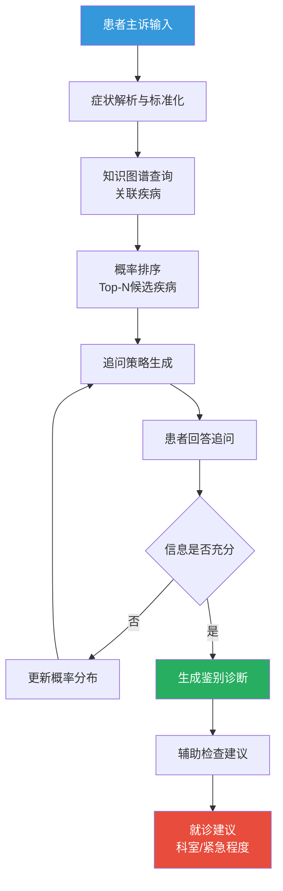
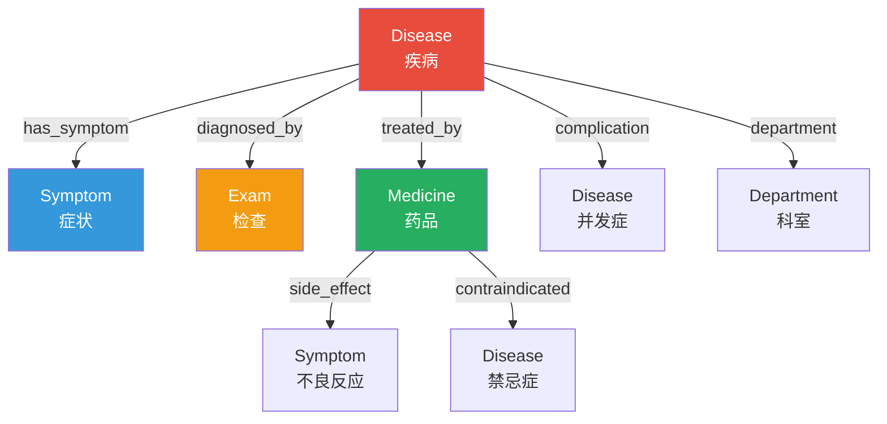
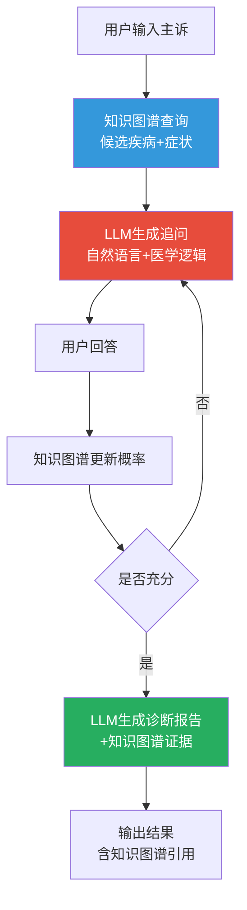

# 智能问诊与知识图谱

## 智能问诊流程

智能问诊通过结构化的症状采集和推理，辅助医生完成初步诊断。

### 问诊全流程



### 智能问诊系统核心逻辑

```python
from pydantic import BaseModel, Field
from typing import Optional
from datetime import datetime
from enum import Enum

class UrgencyLevel(str, Enum):
    EMERGENCY = "紧急-立即就医"
    URGENT = "急迫-24小时内就医"
    ROUTINE = "常规-可预约就诊"
    SELF_CARE = "自我管理-可暂观察"

class QuestionType(str, Enum):
    SYMPTOM_CONFIRM = "症状确认"
    SYMPTOM_DETAIL = "症状详情"
    HISTORY = "既往史"
    ASSOCIATED_SYMPTOM = "伴随症状"
    SEVERITY = "严重程度"

class FollowUpQuestion(BaseModel):
    """追问问题"""
    question_id: str
    question_type: QuestionType
    question_text: str
    options: list[str] = Field(default_factory=list)
    target_diseases: list[str] = Field(default_factory=list, description="该问题旨在鉴别的疾病")
    reasoning: str = Field(..., description="为什么问这个问题")

class TriageResult(BaseModel):
    """分诊结果"""
    recommended_department: str
    urgency: UrgencyLevel
    reason: str

class ConsultationSession(BaseModel):
    """问诊会话"""
    session_id: str
    patient_id: str
    chief_complaint: str
    symptoms: list[str] = Field(default_factory=list)
    follow_up_questions: list[FollowUpQuestion] = Field(default_factory=list)
    answers: list[dict] = Field(default_factory=list)
    differential_diagnoses: list[dict] = Field(default_factory=list)
    triage_result: Optional[TriageResult] = None
    status: str = "进行中"
    created_at: datetime = Field(default_factory=datetime.now)
    ai_disclaimer: str = "智能问诊结果仅供参考，不能替代医师面诊"
```

## 问诊策略

### 症状驱动策略

基于患者报告的症状，匹配最可能的疾病并生成追问。

```python
class SymptomDrivenStrategy:
    """症状驱动问诊策略"""

    # 症状-疾病关联表(带权重)
    SYMPTOM_DISEASE_WEIGHTS = {
        "胸痛": {
            "急性心肌梗死": 0.7,
            "主动脉夹层": 0.4,
            "肺栓塞": 0.3,
            "气胸": 0.2,
            "肋间神经痛": 0.1,
        },
        "腹痛": {
            "急性阑尾炎": 0.5,
            "急性胆囊炎": 0.3,
            "急性胰腺炎": 0.3,
            "胃溃疡": 0.2,
            "肠梗阻": 0.2,
        },
        "头痛": {
            "偏头痛": 0.4,
            "紧张性头痛": 0.3,
            "蛛网膜下腔出血": 0.2,
            "高血压脑病": 0.1,
        },
        "发热": {
            "社区获得性肺炎": 0.4,
            "上呼吸道感染": 0.3,
            "尿路感染": 0.2,
            "败血症": 0.1,
        },
    }

    def generate_questions(self, symptoms: list[str]) -> list[FollowUpQuestion]:
        """根据症状生成追问"""
        questions = []
        question_id = 1

        for symptom in symptoms:
            if symptom == "胸痛":
                questions.extend([
                    FollowUpQuestion(
                        question_id=f"Q{question_id}",
                        question_type=QuestionType.SYMPTOM_DETAIL,
                        question_text="胸痛的位置在哪里？",
                        options=["胸骨后", "左胸部", "右胸部", "全胸"],
                        target_diseases=["急性心肌梗死", "主动脉夹层"],
                        reasoning="胸骨后压榨痛提示心肌缺血，撕裂样痛提示夹层",
                    ),
                    FollowUpQuestion(
                        question_id=f"Q{question_id + 1}",
                        question_type=QuestionType.SYMPTOM_DETAIL,
                        question_text="胸痛的性质是怎样的？",
                        options=["压榨性/紧缩感", "撕裂样", "刺痛", "隐痛"],
                        target_diseases=["急性心肌梗死", "主动脉夹层"],
                        reasoning="压榨性痛提示心梗，撕裂样痛提示夹层",
                    ),
                    FollowUpQuestion(
                        question_id=f"Q{question_id + 2}",
                        question_type=QuestionType.ASSOCIATED_SYMPTOM,
                        question_text="是否伴有以下症状？",
                        options=["大汗淋漓", "恶心呕吐", "呼吸困难", "向左臂放射"],
                        target_diseases=["急性心肌梗死"],
                        reasoning="伴随症状有助于鉴别诊断",
                    ),
                ])
                question_id += 3

            elif symptom == "腹痛":
                questions.extend([
                    FollowUpQuestion(
                        question_id=f"Q{question_id}",
                        question_type=QuestionType.SYMPTOM_DETAIL,
                        question_text="腹痛的位置在哪里？",
                        options=["上腹", "右上腹", "右下腹", "全腹", "脐周"],
                        target_diseases=["急性阑尾炎", "急性胆囊炎", "急性胰腺炎"],
                        reasoning="右下腹提示阑尾炎，右上腹提示胆囊炎，上腹提示胰腺炎或胃病",
                    ),
                    FollowUpQuestion(
                        question_id=f"Q{question_id + 1}",
                        question_type=QuestionType.SYMPTOM_DETAIL,
                        question_text="腹痛是持续性的还是阵发性的？",
                        options=["持续性", "阵发性", "持续性伴阵发加重"],
                        target_diseases=["急性阑尾炎", "肠梗阻"],
                        reasoning="持续性痛提示炎症，阵发性提示梗阻",
                    ),
                ])
                question_id += 2

        return questions
```

### 概率驱动策略

```python
import numpy as np
from typing import Optional

class ProbabilityDrivenStrategy:
    """概率驱动问诊策略：选择最能区分候选疾病的问题"""

    def __init__(self, disease_symptom_matrix: dict):
        """
        Args:
            disease_symptom_matrix: 疾病-症状概率矩阵
                {disease: {symptom: P(symptom|disease)}}
        """
        self.matrix = disease_symptom_matrix

    def select_next_question(
        self,
        current_probabilities: dict[str, float],
        asked_questions: list[str],
    ) -> Optional[FollowUpQuestion]:
        """选择信息增益最大的下一个问题"""
        if not current_probabilities:
            return None

        # 获取当前最可能的两个疾病
        sorted_diseases = sorted(
            current_probabilities.items(), key=lambda x: x[1], reverse=True,
        )
        top_diseases = [d[0] for d in sorted_diseases[:3]]

        # 找到区分这些疾病最有价值的症状
        best_symptom = None
        best_discrimination = 0.0

        all_symptoms = set()
        for disease in top_diseases:
            if disease in self.matrix:
                all_symptoms.update(self.matrix[disease].keys())

        for symptom in all_symptoms:
            if symptom in asked_questions:
                continue

            # 计算该症状对候选疾病的区分度
            probs = []
            for disease in top_diseases:
                if disease in self.matrix and symptom in self.matrix[disease]:
                    probs.append(self.matrix[disease][symptom])
                else:
                    probs.append(0.0)

            # 用方差衡量区分度
            discrimination = np.var(probs)
            if discrimination > best_discrimination:
                best_discrimination = discrimination
                best_symptom = symptom

        if best_symptom:
            return FollowUpQuestion(
                question_id=f"AUTO-{len(asked_questions) + 1}",
                question_type=QuestionType.ASSOCIATED_SYMPTOM,
                question_text=f"您是否有{best_symptom}？",
                options=["是", "否", "不确定"],
                target_diseases=top_diseases[:3],
                reasoning=f"该症状可帮助区分{', '.join(top_diseases[:3])}",
            )
        return None

    def update_probabilities(
        self,
        current_probs: dict[str, float],
        symptom: str,
        answer: bool,
    ) -> dict[str, float]:
        """根据患者回答更新疾病概率(贝叶斯更新)"""
        updated = {}
        for disease, prob in current_probs.items():
            if disease in self.matrix and symptom in self.matrix[disease]:
                p_symptom_given_disease = self.matrix[disease][symptom]
            else:
                p_symptom_given_disease = 0.01  # 平滑

            if answer:
                likelihood = p_symptom_given_disease
            else:
                likelihood = 1 - p_symptom_given_disease

            updated[disease] = prob * likelihood

        # 归一化
        total = sum(updated.values())
        if total > 0:
            updated = {k: v / total for k, v in updated.items()}

        return updated
```

## 医学知识图谱构建

### 知识图谱数据模型



### Neo4j知识图谱实现

```python
from neo4j import GraphDatabase
from pydantic import BaseModel, Field
from typing import Optional
from enum import Enum

class NodeType(str, Enum):
    DISEASE = "Disease"
    SYMPTOM = "Symptom"
    MEDICINE = "Medicine"
    EXAM = "Exam"
    DEPARTMENT = "Department"
    BODY_PART = "BodyPart"

class RelationType(str, Enum):
    HAS_SYMPTOM = "HAS_SYMPTOM"
    TREATED_BY = "TREATED_BY"
    DIAGNOSED_BY = "DIAGNOSED_BY"
    DEPARTMENT_OF = "DEPARTMENT_OF"
    SIDE_EFFECT = "SIDE_EFFECT"
    CONTRAINDICATED = "CONTRAINDICATED"
    COMPLICATION = "COMPLICATION"
    INTERACTION = "INTERACTION"

class MedicalKnowledgeGraph:
    """医学知识图谱Neo4j实现"""

    def __init__(self, uri: str = "bolt://localhost:7687", user: str = "neo4j", password: str = "password"):
        self.driver = GraphDatabase.driver(uri, auth=(user, password))

    def close(self):
        self.driver.close()

    def init_schema(self):
        """初始化图数据库Schema"""
        with self.driver.session() as session:
            # 创建约束(唯一性)
            session.run("CREATE CONSTRAINT IF NOT EXISTS FOR (d:Disease) REQUIRE d.name IS UNIQUE")
            session.run("CREATE CONSTRAINT IF NOT EXISTS FOR (s:Symptom) REQUIRE s.name IS UNIQUE")
            session.run("CREATE CONSTRAINT IF NOT EXISTS FOR (m:Medicine) REQUIRE m.name IS UNIQUE")
            session.run("CREATE CONSTRAINT IF NOT EXISTS FOR (e:Exam) REQUIRE e.name IS UNIQUE")
            session.run("CREATE CONSTRAINT IF NOT EXISTS FOR (dept:Department) REQUIRE dept.name IS UNIQUE")

    def add_disease(self, name: str, icd10: str, description: str = ""):
        """添加疾病节点"""
        with self.driver.session() as session:
            session.run(
                "MERGE (d:Disease {name: $name}) SET d.icd10 = $icd10, d.description = $desc",
                name=name, icd10=icd10, desc=description,
            )

    def add_symptom(self, name: str, description: str = ""):
        """添加症状节点"""
        with self.driver.session() as session:
            session.run(
                "MERGE (s:Symptom {name: $name}) SET s.description = $desc",
                name=name, desc=description,
            )

    def add_medicine(self, name: str, atc_code: str = "", category: str = ""):
        """添加药品节点"""
        with self.driver.session() as session:
            session.run(
                "MERGE (m:Medicine {name: $name}) SET m.atc_code = $atc, m.category = $cat",
                name=name, atc=atc_code, cat=category,
            )

    def add_exam(self, name: str, category: str = ""):
        """添加检查节点"""
        with self.driver.session() as session:
            session.run(
                "MERGE (e:Exam {name: $name}) SET e.category = $cat",
                name=name, cat=category,
            )

    def add_department(self, name: str):
        """添加科室节点"""
        with self.driver.session() as session:
            session.run("MERGE (dept:Department {name: $name})", name=name)

    def link_disease_symptom(self, disease: str, symptom: str, weight: float = 1.0, is_key: bool = False):
        """关联疾病-症状"""
        with self.driver.session() as session:
            session.run(
                """MATCH (d:Disease {name: $disease})
                   MATCH (s:Symptom {name: $symptom})
                   MERGE (d)-[r:HAS_SYMPTOM]->(s)
                   SET r.weight = $weight, r.is_key = $is_key""",
                disease=disease, symptom=symptom, weight=weight, is_key=is_key,
            )

    def link_disease_medicine(self, disease: str, medicine: str, is_first_line: bool = False):
        """关联疾病-药品"""
        with self.driver.session() as session:
            session.run(
                """MATCH (d:Disease {name: $disease})
                   MATCH (m:Medicine {name: $medicine})
                   MERGE (d)-[r:TREATED_BY]->(m)
                   SET r.is_first_line = $is_first_line""",
                disease=disease, medicine=medicine, is_first_line=is_first_line,
            )

    def link_disease_exam(self, disease: str, exam: str, is_routine: bool = False):
        """关联疾病-检查"""
        with self.driver.session() as session:
            session.run(
                """MATCH (d:Disease {name: $disease})
                   MATCH (e:Exam {name: $exam})
                   MERGE (d)-[r:DIAGNOSED_BY]->(e)
                   SET r.is_routine = $is_routine""",
                disease=disease, exam=exam, is_routine=is_routine,
            )

    def link_disease_department(self, disease: str, department: str):
        """关联疾病-科室"""
        with self.driver.session() as session:
            session.run(
                """MATCH (d:Disease {name: $disease})
                   MATCH (dept:Department {name: $department})
                   MERGE (d)-[:DEPARTMENT_OF]->(dept)""",
                disease=disease, department=department,
            )

    def link_medicine_side_effect(self, medicine: str, symptom: str, frequency: str = ""):
        """关联药品-不良反应"""
        with self.driver.session() as session:
            session.run(
                """MATCH (m:Medicine {name: $medicine})
                   MATCH (s:Symptom {name: $symptom})
                   MERGE (m)-[r:SIDE_EFFECT]->(s)
                   SET r.frequency = $freq""",
                medicine=medicine, symptom=symptom, freq=frequency,
            )

    def link_medicine_contraindication(self, medicine: str, disease: str):
        """关联药品-禁忌症"""
        with self.driver.session() as session:
            session.run(
                """MATCH (m:Medicine {name: $medicine})
                   MATCH (d:Disease {name: $disease})
                   MERGE (m)-[:CONTRAINDICATED]->(d)""",
                medicine=medicine, disease=disease,
            )

    # --- 查询方法 ---

    def get_diseases_by_symptoms(self, symptoms: list[str]) -> list[dict]:
        """根据症状查询可能的疾病"""
        with self.driver.session() as session:
            result = session.run(
                """MATCH (d:Disease)-[r:HAS_SYMPTOM]->(s:Symptom)
                   WHERE s.name IN $symptoms
                   RETURN d.name AS disease, d.icd10 AS icd10,
                          count(s) AS matched_symptoms,
                          sum(r.weight) AS total_weight,
                          collect(s.name) AS matched_list
                   ORDER BY total_weight DESC
                   LIMIT 10""",
                symptoms=symptoms,
            )
            return [dict(record) for record in result]

    def get_symptoms_of_disease(self, disease: str) -> list[dict]:
        """查询疾病的症状"""
        with self.driver.session() as session:
            result = session.run(
                """MATCH (d:Disease {name: $disease})-[r:HAS_SYMPTOM]->(s:Symptom)
                   RETURN s.name AS symptom, r.weight AS weight, r.is_key AS is_key
                   ORDER BY r.weight DESC""",
                disease=disease,
            )
            return [dict(record) for record in result]

    def get_treatment_for_disease(self, disease: str) -> list[dict]:
        """查询疾病的治疗药物"""
        with self.driver.session() as session:
            result = session.run(
                """MATCH (d:Disease {name: $disease})-[r:TREATED_BY]->(m:Medicine)
                   RETURN m.name AS medicine, m.atc_code AS atc_code,
                          m.category AS category, r.is_first_line AS is_first_line
                   ORDER BY r.is_first_line DESC""",
                disease=disease,
            )
            return [dict(record) for record in result]

    def get_exams_for_disease(self, disease: str) -> list[dict]:
        """查询疾病的检查项目"""
        with self.driver.session() as session:
            result = session.run(
                """MATCH (d:Disease {name: $disease})-[r:DIAGNOSED_BY]->(e:Exam)
                   RETURN e.name AS exam, e.category AS category, r.is_routine AS is_routine
                   ORDER BY r.is_routine DESC""",
                disease=disease,
            )
            return [dict(record) for record in result]

    def get_differential_diagnosis(self, disease: str) -> list[dict]:
        """查询鉴别诊断(共享症状的疾病)"""
        with self.driver.session() as session:
            result = session.run(
                """MATCH (d1:Disease {name: $disease})-[:HAS_SYMPTOM]->(s:Symptom)<-[:HAS_SYMPTOM]-(d2:Disease)
                   WHERE d1 <> d2
                   RETURN d2.name AS disease, d2.icd10 AS icd10,
                          count(s) AS shared_symptoms,
                          collect(s.name) AS shared_list
                   ORDER BY shared_symptoms DESC
                   LIMIT 5""",
                disease=disease,
            )
            return [dict(record) for record in result]

    def find_path_between_diseases(self, disease1: str, disease2: str) -> list[dict]:
        """查找两个疾病之间的关系路径"""
        with self.driver.session() as session:
            result = session.run(
                """MATCH path = shortestPath(
                       (d1:Disease {name: $d1})-[*..5]-(d2:Disease {name: $d2})
                   )
                   RETURN [node in nodes(path) | labels(node)[0] + ':' + node.name] AS path_nodes,
                          [rel in relationships(path) | type(rel)] AS path_rels""",
                d1=disease1, d2=disease2,
            )
            return [dict(record) for record in result]
```

### 知识图谱初始化数据

```python
def seed_knowledge_graph(kg: MedicalKnowledgeGraph):
    """初始化医学知识图谱数据"""
    kg.init_schema()

    # 添加科室
    departments = ["呼吸内科", "心内科", "消化内科", "内分泌科", "神经内科", "普外科", "骨科", "急诊科"]
    for dept in departments:
        kg.add_department(dept)

    # 添加疾病
    diseases = [
        ("社区获得性肺炎", "J18.9", "肺实质的急性感染"),
        ("急性心肌梗死", "I21.9", "冠状动脉急性闭塞致心肌坏死"),
        ("急性阑尾炎", "K35.9", "阑尾的急性炎症"),
        ("2型糖尿病", "E11.9", "胰岛素抵抗伴相对胰岛素不足"),
        ("高血压", "I10", "动脉血压持续升高"),
        ("急性胰腺炎", "K85.9", "胰腺的急性炎症"),
        ("胃溃疡", "K25.9", "胃黏膜的慢性溃疡"),
    ]
    for name, icd10, desc in diseases:
        kg.add_disease(name, icd10, desc)

    # 添加症状
    symptoms = [
        "发热", "咳嗽", "咳痰", "呼吸困难", "胸痛", "腹痛", "恶心", "呕吐",
        "腹泻", "头痛", "头晕", "乏力", "多饮", "多尿", "消瘦",
        "上腹痛", "右下腹痛", "转移性腹痛", "反酸", "烧心",
    ]
    for symptom in symptoms:
        kg.add_symptom(symptom)

    # 添加药品
    medicines = [
        ("阿莫西林", "J01CA04", "青霉素类"),
        ("头孢曲松", "J01DD04", "头孢菌素类"),
        ("阿奇霉素", "J01FA10", "大环内酯类"),
        ("奥美拉唑", "A02BC01", "PPI"),
        ("二甲双胍", "A10BA02", "双胍类"),
        ("阿托伐他汀", "C10AA05", "他汀类"),
        ("氨氯地平", "C08CA01", "CCB"),
        ("美托洛尔", "C07AB02", "beta受体阻滞剂"),
    ]
    for name, atc, cat in medicines:
        kg.add_medicine(name, atc, cat)

    # 添加检查
    exams = [
        ("血常规", "检验"), ("胸部CT", "影像"), ("心电图", "功能检查"),
        ("腹部超声", "影像"), ("心肌酶谱", "检验"), ("血淀粉酶", "检验"),
        ("空腹血糖", "检验"), ("糖化血红蛋白", "检验"),
    ]
    for name, cat in exams:
        kg.add_exam(name, cat)

    # 建立疾病-症状关系
    disease_symptoms = [
        ("社区获得性肺炎", "发热", 0.9, True),
        ("社区获得性肺炎", "咳嗽", 0.92, True),
        ("社区获得性肺炎", "咳痰", 0.8, False),
        ("社区获得性肺炎", "呼吸困难", 0.5, False),
        ("急性心肌梗死", "胸痛", 0.9, True),
        ("急性心肌梗死", "呼吸困难", 0.4, False),
        ("急性心肌梗死", "恶心", 0.3, False),
        ("急性阑尾炎", "腹痛", 0.95, True),
        ("急性阑尾炎", "转移性腹痛", 0.7, True),
        ("急性阑尾炎", "右下腹痛", 0.85, True),
        ("急性阑尾炎", "发热", 0.7, False),
        ("2型糖尿病", "多饮", 0.5, False),
        ("2型糖尿病", "多尿", 0.5, False),
        ("2型糖尿病", "消瘦", 0.4, False),
        ("2型糖尿病", "乏力", 0.4, False),
        ("高血压", "头痛", 0.4, False),
        ("高血压", "头晕", 0.5, False),
        ("急性胰腺炎", "腹痛", 0.95, True),
        ("急性胰腺炎", "恶心", 0.8, False),
        ("急性胰腺炎", "呕吐", 0.7, False),
        ("胃溃疡", "上腹痛", 0.85, True),
        ("胃溃疡", "反酸", 0.6, False),
        ("胃溃疡", "烧心", 0.5, False),
    ]
    for disease, symptom, weight, is_key in disease_symptoms:
        kg.link_disease_symptom(disease, symptom, weight, is_key)

    # 建立疾病-药品关系
    disease_medicines = [
        ("社区获得性肺炎", "阿莫西林", True),
        ("社区获得性肺炎", "阿奇霉素", True),
        ("社区获得性肺炎", "头孢曲松", False),
        ("2型糖尿病", "二甲双胍", True),
        ("高血压", "氨氯地平", True),
        ("高血压", "美托洛尔", False),
        ("胃溃疡", "奥美拉唑", True),
    ]
    for disease, medicine, is_first_line in disease_medicines:
        kg.link_disease_medicine(disease, medicine, is_first_line)

    # 建立疾病-检查关系
    disease_exams = [
        ("社区获得性肺炎", "血常规", True),
        ("社区获得性肺炎", "胸部CT", True),
        ("急性心肌梗死", "心电图", True),
        ("急性心肌梗死", "心肌酶谱", True),
        ("急性阑尾炎", "血常规", True),
        ("急性阑尾炎", "腹部超声", True),
        ("2型糖尿病", "空腹血糖", True),
        ("2型糖尿病", "糖化血红蛋白", True),
    ]
    for disease, exam, is_routine in disease_exams:
        kg.link_disease_exam(disease, exam, is_routine)

    # 建立疾病-科室关系
    disease_departments = [
        ("社区获得性肺炎", "呼吸内科"),
        ("急性心肌梗死", "心内科"),
        ("急性阑尾炎", "普外科"),
        ("2型糖尿病", "内分泌科"),
        ("高血压", "心内科"),
        ("急性胰腺炎", "消化内科"),
        ("胃溃疡", "消化内科"),
    ]
    for disease, dept in disease_departments:
        kg.link_disease_department(disease, dept)

    # 建立药品-禁忌症关系
    kg.link_medicine_contraindication("二甲双胍", "肾功能不全")

    # 建立药品-不良反应关系
    kg.link_medicine_side_effect("阿莫西林", "腹泻", "常见")
    kg.link_medicine_side_effect("阿莫西林", "皮疹", "少见")
```

## 知识图谱推理

### 路径查找推理

```python
class KnowledgeGraphReasoner:
    """知识图谱推理引擎"""

    def __init__(self, kg: MedicalKnowledgeGraph):
        self.kg = kg

    def reason_disease_from_symptoms(self, symptoms: list[str]) -> list[dict]:
        """从症状推理可能的疾病"""
        candidates = self.kg.get_diseases_by_symptoms(symptoms)

        results = []
        for candidate in candidates:
            disease = candidate["disease"]
            # 获取该疾病的全部症状用于比较
            all_symptoms = self.kg.get_symptoms_of_disease(disease)
            total_symptoms = len(all_symptoms)
            matched = candidate["matched_symptoms"]
            coverage = matched / total_symptoms if total_symptoms > 0 else 0

            results.append({
                "disease": disease,
                "icd10": candidate.get("icd10", ""),
                "matched_symptoms": candidate["matched_list"],
                "match_count": matched,
                "total_symptoms": total_symptoms,
                "coverage": round(coverage, 2),
                "weight": round(candidate["total_weight"], 2),
            })

        return sorted(results, key=lambda x: x["weight"], reverse=True)

    def generate_differential_reasoning(self, disease: str) -> dict:
        """生成鉴别诊断推理过程"""
        # 获取疾病的症状
        symptoms = self.kg.get_symptoms_of_disease(disease)
        # 获取鉴别诊断
        differentials = self.kg.get_differential_diagnosis(disease)
        # 获取推荐检查
        exams = self.kg.get_exams_for_disease(disease)
        # 获取治疗药物
        medicines = self.kg.get_treatment_for_disease(disease)

        return {
            "primary_disease": disease,
            "symptoms": symptoms,
            "differential_diagnoses": differentials,
            "recommended_exams": exams,
            "treatment_medicines": medicines,
        }

    def recommend_follow_up(self, disease: str, current_symptoms: list[str]) -> list[str]:
        """推荐追问(该疾病的症状中患者尚未报告的)"""
        disease_symptoms = self.kg.get_symptoms_of_disease(disease)
        unasked = [
            s["symptom"] for s in disease_symptoms
            if s["symptom"] not in current_symptoms and s.get("is_key", False)
        ]
        return unasked[:3]  # 最多追问3个关键症状
```

## LLM+知识图谱协同问诊

### 协同架构



### 协同问诊实现

```python
from pydantic import BaseModel, Field
from typing import Optional
from datetime import datetime

class IntelligentConsultationService:
    """LLM+知识图谱协同问诊服务"""

    def __init__(self, kg: MedicalKnowledgeGraph):
        self.kg = kg
        self.reasoner = KnowledgeGraphReasoner(kg)
        self.symptom_strategy = SymptomDrivenStrategy()

    # LLM问诊Prompt模板
    CONSULTATION_PROMPT = """你是一位智能问诊助手，正在辅助患者进行初步症状分析。

## 当前信息
- 主诉：{chief_complaint}
- 已知症状：{known_symptoms}
- 知识图谱推理结果：{kg_results}

## 你的任务
1. 用通俗易懂的语言向患者追问{num_questions}个关键问题
2. 问题应基于知识图谱的推理结果，重点关注有助于鉴别诊断的信息
3. 避免使用过多医学术语
4. 如果患者描述了紧急症状（如胸痛、呼吸困难、意识障碍），立即建议就医

## 重要声明
你是辅助问诊系统，不能做出最终诊断。所有建议仅供参考，需由执业医师确认。

请以JSON格式输出追问问题。"""

    DIAGNOSIS_PROMPT = """你是一位智能问诊助手，根据收集的信息生成初步分析。

## 患者信息
- 主诉：{chief_complaint}
- 症状详情：{symptom_details}
- 知识图谱推荐疾病：{kg_diseases}
- 推荐检查：{kg_exams}
- 推荐科室：{kg_departments}

## 任务
1. 总结患者的主要症状
2. 列出最可能的3个疾病及理由（引用知识图谱数据）
3. 推荐需要完善的检查
4. 给出就诊建议（科室+紧急程度）

## 重要声明
- 分析结果仅供参考，不构成诊断依据
- 紧急情况请立即就医
- 最终诊断由执业医师确认

请以JSON格式输出。"""

    def start_consultation(
        self,
        patient_id: str,
        chief_complaint: str,
        initial_symptoms: list[str],
    ) -> ConsultationSession:
        """开始问诊会话"""
        session_id = f"CX-{datetime.now().strftime('%Y%m%d%H%M%S')}"

        # 知识图谱推理
        kg_results = self.reasoner.reason_disease_from_symptoms(initial_symptoms)

        # 生成追问
        follow_up_questions = self.symptom_strategy.generate_questions(initial_symptoms)

        # 分诊
        triage = self._triage(chief_complaint, initial_symptoms, kg_results)

        return ConsultationSession(
            session_id=session_id,
            patient_id=patient_id,
            chief_complaint=chief_complaint,
            symptoms=initial_symptoms,
            follow_up_questions=follow_up_questions,
            triage_result=triage,
        )

    def process_answer(
        self,
        session: ConsultationSession,
        question_id: str,
        answer: str,
    ) -> ConsultationSession:
        """处理患者回答，更新会话状态"""
        # 记录回答
        session.answers.append({
            "question_id": question_id,
            "answer": answer,
        })

        # 解析回答中的症状
        new_symptoms = self._parse_answer_to_symptoms(answer)
        session.symptoms.extend(new_symptoms)

        # 更新推理
        kg_results = self.reasoner.reason_disease_from_symptoms(session.symptoms)
        session.differential_diagnoses = kg_results

        # 生成新的追问（如果需要）
        if len(session.answers) < 5:  # 最多追问5轮
            for result in kg_results[:1]:
                follow_ups = self.reasoner.recommend_follow_up(
                    result["disease"], session.symptoms,
                )
                for i, fu in enumerate(follow_ups):
                    session.follow_up_questions.append(FollowUpQuestion(
                        question_id=f"FU-{len(session.answers) + i + 1}",
                        question_type=QuestionType.ASSOCIATED_SYMPTOM,
                        question_text=f"您是否有{fu}？",
                        options=["是", "否", "不确定"],
                        target_diseases=[result["disease"]],
                        reasoning=f"该症状是{result['disease']}的关键症状",
                    ))

        # 更新分诊
        session.triage_result = self._triage(
            session.chief_complaint, session.symptoms, kg_results,
        )

        return session

    def generate_diagnosis_report(self, session: ConsultationSession) -> dict:
        """生成诊断报告"""
        kg_results = self.reasoner.reason_disease_from_symptoms(session.symptoms)

        report = {
            "session_id": session.session_id,
            "chief_complaint": session.chief_complaint,
            "collected_symptoms": session.symptoms,
            "differential_diagnoses": kg_results[:5],
            "triage": session.triage_result.model_dump() if session.triage_result else None,
            "ai_disclaimer": "本报告由AI辅助生成，仅供参考，不构成诊断依据。最终诊断须由执业医师确认。",
        }

        # 添加知识图谱推荐的检查和药品
        if kg_results:
            top_disease = kg_results[0]["disease"]
            report["recommended_exams"] = self.kg.get_exams_for_disease(top_disease)
            report["recommended_medicines"] = self.kg.get_treatment_for_disease(top_disease)

        return report

    def _triage(
        self,
        chief_complaint: str,
        symptoms: list[str],
        kg_results: list[dict],
    ) -> TriageResult:
        """智能分诊"""
        # 紧急症状
        EMERGENCY_KEYWORDS = ["胸痛", "呼吸困难", "意识丧失", "大出血", "剧烈头痛"]
        URGENT_KEYWORDS = ["高热", "持续呕吐", "严重腹痛", "心悸"]

        for keyword in EMERGENCY_KEYWORDS:
            if keyword in chief_complaint or keyword in symptoms:
                return TriageResult(
                    recommended_department="急诊科",
                    urgency=UrgencyLevel.EMERGENCY,
                    reason=f"存在紧急症状：{keyword}，需立即就医",
                )

        for keyword in URGENT_KEYWORDS:
            if keyword in chief_complaint or keyword in symptoms:
                return TriageResult(
                    recommended_department="急诊科",
                    urgency=UrgencyLevel.URGENT,
                    reason=f"存在急迫症状：{keyword}，建议24小时内就医",
                )

        # 根据知识图谱推理结果推荐科室
        if kg_results:
            top_disease = kg_results[0]["disease"]
            dept_result = self.kg.get_diseases_by_symptoms(symptoms)
            # 简化：返回第一个匹配疾病的科室
            with self.kg.driver.session() as session:
                departments = session.run(
                    "MATCH (d:Disease {name: $disease})-[:DEPARTMENT_OF]->(dept:Department) RETURN dept.name AS dept",
                    disease=top_disease,
                )
                for record in departments:
                    return TriageResult(
                        recommended_department=record["dept"],
                        urgency=UrgencyLevel.ROUTINE,
                        reason=f"根据症状分析，建议{record['dept']}就诊",
                    )

        return TriageResult(
            recommended_department="全科",
            urgency=UrgencyLevel.ROUTINE,
            reason="建议全科或内科初步评估",
        )

    def _parse_answer_to_symptoms(self, answer: str) -> list[str]:
        """从回答中解析症状(简化版)"""
        SYMPTOM_VOCAB = [
            "发热", "咳嗽", "咳痰", "胸痛", "腹痛", "头痛", "头晕",
            "恶心", "呕吐", "腹泻", "呼吸困难", "乏力", "水肿",
            "上腹痛", "右下腹痛", "反酸", "烧心",
        ]
        found = []
        for symptom in SYMPTOM_VOCAB:
            if symptom in answer:
                found.append(symptom)
        return found
```

### 知识图谱问答API

```python
from fastapi import FastAPI
from pydantic import BaseModel, Field
from typing import Optional
from datetime import datetime

app = FastAPI(title="Medical KG Q&A Service", version="1.0.0")

class ConsultationRequest(BaseModel):
    """问诊请求"""
    patient_id: str
    chief_complaint: str
    symptoms: list[str]

class ConsultationResponse(BaseModel):
    """问诊响应"""
    session_id: str
    differential_diagnoses: list[dict]
    follow_up_questions: list[dict]
    triage: Optional[dict] = None
    ai_disclaimer: str = "智能问诊结果仅供参考，不能替代医师面诊"

class AnswerRequest(BaseModel):
    """回答请求"""
    session_id: str
    question_id: str
    answer: str

class DiagnosisReportResponse(BaseModel):
    """诊断报告响应"""
    session_id: str
    report: dict
    ai_disclaimer: str = "本报告由AI辅助生成，不构成诊断依据"

# 全局服务实例(实际中应使用依赖注入)
kg = MedicalKnowledgeGraph()
consultation_service = IntelligentConsultationService(kg)
sessions: dict[str, ConsultationSession] = {}

@app.post("/api/v1/consultation/start", response_model=ConsultationResponse)
async def start_consultation(request: ConsultationRequest):
    """开始智能问诊"""
    session = consultation_service.start_consultation(
        patient_id=request.patient_id,
        chief_complaint=request.chief_complaint,
        initial_symptoms=request.symptoms,
    )
    sessions[session.session_id] = session

    return ConsultationResponse(
        session_id=session.session_id,
        differential_diagnoses=session.differential_diagnoses,
        follow_up_questions=[q.model_dump() for q in session.follow_up_questions],
        triage=session.triage_result.model_dump() if session.triage_result else None,
    )

@app.post("/api/v1/consultation/answer", response_model=ConsultationResponse)
async def answer_question(request: AnswerRequest):
    """回答追问"""
    session = sessions.get(request.session_id)
    if not session:
        from fastapi import HTTPException
        raise HTTPException(status_code=404, detail="Session not found")

    session = consultation_service.process_answer(
        session=session,
        question_id=request.question_id,
        answer=request.answer,
    )

    return ConsultationResponse(
        session_id=session.session_id,
        differential_diagnoses=session.differential_diagnoses,
        follow_up_questions=[q.model_dump() for q in session.follow_up_questions],
        triage=session.triage_result.model_dump() if session.triage_result else None,
    )

@app.get("/api/v1/consultation/{session_id}/report", response_model=DiagnosisReportResponse)
async def get_diagnosis_report(session_id: str):
    """获取诊断报告"""
    session = sessions.get(session_id)
    if not session:
        from fastapi import HTTPException
        raise HTTPException(status_code=404, detail="Session not found")

    report = consultation_service.generate_diagnosis_report(session)
    return DiagnosisReportResponse(session_id=session_id, report=report)
```
