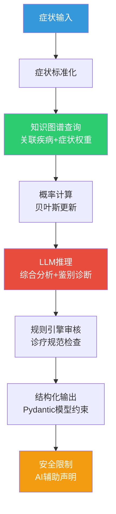

# AI辅助诊断服务

## AI诊断引擎架构



## Pydantic模型定义

```python
# app/schemas/diagnosis.py
from pydantic import BaseModel, Field
from typing import Optional
from datetime import datetime
from enum import Enum

class SymptomInput(BaseModel):
    """症状输入"""
    symptoms: list[str] = Field(..., min_length=1, max_length=20, description="症状列表")
    duration: Optional[str] = Field(None, description="持续时间")
    severity: Optional[str] = Field(None, description="严重程度")
    patient_age: Optional[int] = Field(None, ge=0, le=150, description="患者年龄")
    patient_gender: Optional[str] = Field(None, description="患者性别")
    additional_info: Optional[str] = Field(None, description="补充说明")

class DifferentialDiagnosisItem(BaseModel):
    """鉴别诊断项"""
    disease_name: str = Field(..., description="疾病名称")
    icd10_code: Optional[str] = Field(None, description="ICD-10编码")
    probability: float = Field(..., ge=0, le=1, description="概率估计")
    confidence_level: str = Field(..., description="高/中/低")
    supporting_evidence: list[str] = Field(default_factory=list, description="支持依据")
    against_evidence: list[str] = Field(default_factory=list, description="不支持依据")
    key_differentiator: str = Field("", description="关键鉴别点")

class ExamSuggestionItem(BaseModel):
    """检查建议项"""
    exam_name: str
    urgency: str = Field("常规", description="紧急/常规/可选")
    reason: str
    target_disease: Optional[str] = None

class TreatmentSuggestion(BaseModel):
    """治疗建议"""
    disease_name: str
    first_line_medicines: list[str] = Field(default_factory=list)
    non_pharmacological: list[str] = Field(default_factory=list)
    precautions: list[str] = Field(default_factory=list)

class DiagnosisAnalysisRequest(BaseModel):
    """综合分析请求"""
    patient_id: str
    symptoms: list[str]
    lab_results: Optional[list[dict]] = Field(None, description="检验结果列表")
    imaging_findings: Optional[str] = Field(None, description="影像发现")
    past_history: Optional[str] = None

class DiagnosisAnalysisResponse(BaseModel):
    """综合分析响应"""
    session_id: str
    patient_id: str
    differential_diagnoses: list[DifferentialDiagnosisItem]
    exam_suggestions: list[ExamSuggestionItem]
    treatment_suggestions: list[TreatmentSuggestion]
    reasoning_summary: str
    confidence_note: str = "AI辅助分析，概率估计基于知识图谱推理，仅供参考"
    ai_disclaimer: str = "本结果由AI辅助生成，不构成诊断依据，最终诊断须由执业医师确认"
    analyzed_at: str

class DiagnosisHistoryItem(BaseModel):
    """诊断历史项"""
    session_id: str
    patient_id: str
    top_diagnosis: str
    probability: float
    created_at: str

class DiagnosisHistoryResponse(BaseModel):
    """诊断历史响应"""
    total: int
    items: list[DiagnosisHistoryItem]
```

## 知识图谱查询服务

```python
# app/services/knowledge_graph_service.py
from neo4j import GraphDatabase
from typing import Optional
from pydantic import BaseModel

class KGDiseaseCandidate(BaseModel):
    """知识图谱疾病候选"""
    disease_name: str
    icd10_code: Optional[str] = None
    matched_symptoms: list[str]
    total_symptoms: int
    weight: float
    coverage: float

class KnowledgeGraphService:
    """医学知识图谱查询服务"""

    def __init__(self, uri: str = "bolt://localhost:7687", user: str = "neo4j", password: str = "password"):
        self.driver = GraphDatabase.driver(uri, auth=(user, password))

    def close(self):
        self.driver.close()

    def query_diseases_by_symptoms(self, symptoms: list[str]) -> list[KGDiseaseCandidate]:
        """根据症状查询候选疾病"""
        with self.driver.session() as session:
            result = session.run(
                """MATCH (d:Disease)-[r:HAS_SYMPTOM]->(s:Symptom)
                   WHERE s.name IN $symptoms
                   WITH d, collect(s.name) AS matched, count(s) AS match_count, sum(r.weight) AS total_weight
                   MATCH (d)-[r2:HAS_SYMPTOM]->(s2:Symptom)
                   WITH d, matched, match_count, total_weight, count(s2) AS total_symptoms
                   RETURN d.name AS disease, d.icd10 AS icd10,
                          matched, match_count, total_weight, total_symptoms
                   ORDER BY total_weight DESC
                   LIMIT 10""",
                symptoms=symptoms,
            )

            candidates = []
            for record in result:
                disease_data = dict(record)
                match_count = disease_data["match_count"]
                total_symptoms = disease_data["total_symptoms"]
                coverage = match_count / total_symptoms if total_symptoms > 0 else 0

                candidates.append(KGDiseaseCandidate(
                    disease_name=disease_data["disease"],
                    icd10_code=disease_data["icd10"],
                    matched_symptoms=disease_data["matched"],
                    total_symptoms=total_symptoms,
                    weight=disease_data["total_weight"],
                    coverage=round(coverage, 2),
                ))

            return candidates

    def query_symptoms_of_disease(self, disease_name: str) -> list[dict]:
        """查询疾病的全部症状"""
        with self.driver.session() as session:
            result = session.run(
                """MATCH (d:Disease {name: $disease})-[r:HAS_SYMPTOM]->(s:Symptom)
                   RETURN s.name AS symptom, r.weight AS weight, r.is_key AS is_key
                   ORDER BY r.weight DESC""",
                disease=disease_name,
            )
            return [dict(record) for record in result]

    def query_treatment_for_disease(self, disease_name: str) -> list[dict]:
        """查询疾病的治疗药物"""
        with self.driver.session() as session:
            result = session.run(
                """MATCH (d:Disease {name: $disease})-[r:TREATED_BY]->(m:Medicine)
                   RETURN m.name AS medicine, m.atc AS atc_code,
                          m.category AS category, r.is_first_line AS is_first_line
                   ORDER BY r.is_first_line DESC""",
                disease=disease_name,
            )
            return [dict(record) for record in result]

    def query_exams_for_disease(self, disease_name: str) -> list[dict]:
        """查询疾病的检查项目"""
        with self.driver.session() as session:
            result = session.run(
                """MATCH (d:Disease {name: $disease})-[r:DIAGNOSED_BY]->(e:Exam)
                   RETURN e.name AS exam, e.category AS category, r.is_routine AS is_routine
                   ORDER BY r.is_routine DESC""",
                disease=disease_name,
            )
            return [dict(record) for record in result]

    def query_department_for_disease(self, disease_name: str) -> Optional[str]:
        """查询疾病所属科室"""
        with self.driver.session() as session:
            result = session.run(
                """MATCH (d:Disease {name: $disease})-[:DEPARTMENT_OF]->(dept:Department)
                   RETURN dept.name AS department""",
                disease=disease_name,
            )
            record = result.single()
            return record["department"] if record else None

    def query_differential_diagnosis(self, disease_name: str) -> list[dict]:
        """查询鉴别诊断(共享症状的疾病)"""
        with self.driver.session() as session:
            result = session.run(
                """MATCH (d1:Disease {name: $disease})-[:HAS_SYMPTOM]->(s:Symptom)<-[:HAS_SYMPTOM]-(d2:Disease)
                   WHERE d1 <> d2
                   RETURN d2.name AS disease, d2.icd10 AS icd10,
                          count(s) AS shared_count, collect(s.name) AS shared_symptoms
                   ORDER BY shared_count DESC
                   LIMIT 5""",
                disease=disease_name,
            )
            return [dict(record) for record in result]
```

## LLM辅助诊断Prompt设计

```python
# app/services/llm_service.py
from pydantic import BaseModel, Field
from typing import Optional
import json

class LLMConfig(BaseModel):
    """LLM配置"""
    api_key: str
    base_url: str = "https://api.openai.com/v1"
    model: str = "gpt-4"
    temperature: float = 0.3
    max_tokens: int = 2000

class LLMDiagnosisService:
    """LLM辅助诊断服务"""

    SYSTEM_PROMPT = """你是一位资深临床医师助手，负责根据患者症状和检查结果提供AI辅助诊断分析。

## 核心原则
1. 所有分析仅供临床参考，不能替代医师的临床判断
2. 必须基于循证医学证据进行推理
3. 鉴别诊断需按可能性排序
4. 对紧急情况需明确提示
5. 不得遗漏严重疾病(穷尽鉴别)

## 输出要求
- 以JSON格式输出
- 所有诊断需包含ICD-10编码
- 概率为0-1之间的数值
- 必须包含AI辅助声明"""

    DIFFERENTIAL_DIAGNOSIS_PROMPT = """请根据以下信息进行鉴别诊断分析：

## 患者基本信息
- 年龄：{age}岁
- 性别：{gender}

## 症状
{symptoms_detail}

## 知识图谱推理结果
{kg_results}

## 检验结果
{lab_results}

## 影像发现
{imaging_findings}

## 请输出以下JSON格式：
{{
    "differential_diagnoses": [
        {{
            "disease_name": "疾病名称",
            "icd10_code": "ICD-10编码",
            "probability": 0.0-1.0,
            "confidence_level": "高/中/低",
            "supporting_evidence": ["依据1", "依据2"],
            "against_evidence": ["不支持1"],
            "key_differentiator": "关键鉴别点"
        }}
    ],
    "reasoning_summary": "推理过程概述",
    "urgency_note": "紧急提示(如有)"
}}"""

    EXAM_SUGGESTION_PROMPT = """根据以下鉴别诊断，推荐需要完善的检查：

## 鉴别诊断
{differential_diagnoses}

## 知识图谱推荐检查
{kg_exams}

## 请输出以下JSON格式：
{{
    "exam_suggestions": [
        {{
            "exam_name": "检查名称",
            "urgency": "紧急/常规/可选",
            "reason": "推荐理由",
            "target_disease": "针对的疾病"
        }}
    ]
}}"""

    COMPREHENSIVE_ANALYSIS_PROMPT = """请对以下患者进行全面分析：

## 患者信息
- ID：{patient_id}
- 年龄/性别：{age}/{gender}

## 主诉与症状
{symptoms_section}

## 检验结果
{lab_section}

## 影像发现
{imaging_section}

## 知识图谱推理
{kg_section}

## 请输出综合分析报告(JSON格式)：
{{
    "differential_diagnoses": [...],
    "exam_suggestions": [...],
    "treatment_suggestions": [
        {{
            "disease_name": "对应疾病",
            "first_line_medicines": ["一线用药1", "一线用药2"],
            "non_pharmacological": ["非药物措施1"],
            "precautions": ["注意事项1"]
        }}
    ],
    "reasoning_summary": "详细推理过程",
    "urgency_note": "紧急提示(如有)"
}}

## 重要
- 必须在输出末尾包含AI辅助声明
- 概率仅为基于当前信息的估计
- 所有治疗建议需标明"须遵医嘱" """

    def __init__(self, config: LLMConfig):
        self.config = config

    async def generate_differential_diagnosis(
        self,
        symptoms: list[str],
        kg_results: list[dict],
        patient_age: int = 30,
        patient_gender: str = "未知",
        lab_results: str = "暂无",
        imaging_findings: str = "暂无",
    ) -> dict:
        """LLM生成鉴别诊断"""
        symptoms_detail = "\n".join(f"- {s}" for s in symptoms)
        kg_results_str = "\n".join(
            f"- {r['disease_name']} (权重: {r.get('weight', 0):.2f}, 匹配: {r.get('coverage', 0):.0%})"
            for r in kg_results
        )

        prompt = self.DIFFERENTIAL_DIAGNOSIS_PROMPT.format(
            age=patient_age,
            gender=patient_gender,
            symptoms_detail=symptoms_detail,
            kg_results=kg_results_str,
            lab_results=lab_results,
            imaging_findings=imaging_findings,
        )

        # 实际调用LLM API
        response = await self._call_llm(prompt)
        return self._parse_json_response(response)

    async def generate_exam_suggestions(
        self,
        differential_diagnoses: list[dict],
        kg_exams: list[dict],
    ) -> list[dict]:
        """LLM生成检查建议"""
        dd_str = "\n".join(
            f"- {d['disease_name']} (概率: {d.get('probability', 0):.2f})"
            for d in differential_diagnoses
        )
        kg_exams_str = "\n".join(
            f"- {e.get('exam', e.get('name', ''))}"
            for e in kg_exams
        )

        prompt = self.EXAM_SUGGESTION_PROMPT.format(
            differential_diagnoses=dd_str,
            kg_exams=kg_exams_str,
        )

        response = await self._call_llm(prompt)
        result = self._parse_json_response(response)
        return result.get("exam_suggestions", [])

    async def _call_llm(self, prompt: str) -> str:
        """调用LLM API(示例接口)"""
        # 实际实现:
        # import httpx
        # async with httpx.AsyncClient() as client:
        #     response = await client.post(
        #         f"{self.config.base_url}/chat/completions",
        #         headers={"Authorization": f"Bearer {self.config.api_key}"},
        #         json={
        #             "model": self.config.model,
        #             "messages": [
        #                 {"role": "system", "content": self.SYSTEM_PROMPT},
        #                 {"role": "user", "content": prompt},
        #             ],
        #             "temperature": self.config.temperature,
        #             "max_tokens": self.config.max_tokens,
        #         },
        #     )
        #     return response.json()["choices"][0]["message"]["content"]
        return "{}"  # 占位返回

    def _parse_json_response(self, response: str) -> dict:
        """解析LLM返回的JSON"""
        try:
            # 提取JSON部分
            if "```json" in response:
                json_str = response.split("```json")[1].split("```")[0]
            elif "```" in response:
                json_str = response.split("```")[1].split("```")[0]
            else:
                json_str = response
            return json.loads(json_str.strip())
        except (json.JSONDecodeError, IndexError):
            return {"error": "Failed to parse LLM response", "raw": response}
```

## AI诊断服务核心逻辑

```python
# app/services/diagnosis_service.py
from sqlalchemy.ext.asyncio import AsyncSession
from typing import Optional
from datetime import datetime
import json

from app.services.knowledge_graph_service import KnowledgeGraphService, KGDiseaseCandidate
from app.services.llm_service import LLMDiagnosisService, LLMConfig
from app.services.cache_service import CacheService
from app.schemas.diagnosis import (
    SymptomInput, DifferentialDiagnosisItem, ExamSuggestionItem,
    TreatmentSuggestion, DiagnosisAnalysisRequest, DiagnosisAnalysisResponse,
)

class DiagnosisService:
    """AI辅助诊断服务"""

    # 置信度等级阈值
    CONFIDENCE_HIGH = 0.7
    CONFIDENCE_MEDIUM = 0.4

    def __init__(
        self,
        db: AsyncSession,
        kg_service: KnowledgeGraphService,
        llm_service: LLMDiagnosisService,
        cache_service: CacheService,
    ):
        self.db = db
        self.kg = kg_service
        self.llm = llm_service
        self.cache = cache_service

    async def analyze_symptoms(
        self,
        patient_id: str,
        symptom_input: SymptomInput,
    ) -> DiagnosisAnalysisResponse:
        """症状分析：知识图谱+LLM"""
        session_id = f"DX-{datetime.now().strftime('%Y%m%d%H%M%S')}"

        # 1. 知识图谱查询候选疾病
        kg_candidates = self.kg.query_diseases_by_symptoms(symptom_input.symptoms)

        # 2. 转换为鉴别诊断
        differentials = self._kg_candidates_to_differentials(kg_candidates)

        # 3. 生成检查建议
        exam_suggestions = self._generate_exam_suggestions(differentials, kg_candidates)

        # 4. 生成治疗建议
        treatment_suggestions = self._generate_treatment_suggestions(differentials)

        # 5. 推理摘要
        reasoning = self._build_reasoning_summary(symptom_input.symptoms, differentials)

        # 6. 缓存结果
        result_data = DiagnosisAnalysisResponse(
            session_id=session_id,
            patient_id=patient_id,
            differential_diagnoses=differentials,
            exam_suggestions=exam_suggestions,
            treatment_suggestions=treatment_suggestions,
            reasoning_summary=reasoning,
            analyzed_at=datetime.now().isoformat(),
        )
        await self.cache.cache_diagnosis_result(session_id, result_data.model_dump())

        return result_data

    async def comprehensive_analysis(
        self,
        request: DiagnosisAnalysisRequest,
    ) -> DiagnosisAnalysisResponse:
        """综合分析：症状+检验+影像"""
        session_id = f"DX-{datetime.now().strftime('%Y%m%d%H%M%S')}"

        # 1. 知识图谱推理
        kg_candidates = self.kg.query_diseases_by_symptoms(request.symptoms)

        # 2. LLM综合分析(含检验和影像)
        lab_str = json.dumps(request.lab_results, ensure_ascii=False) if request.lab_results else "暂无"
        imaging_str = request.imaging_findings or "暂无"

        llm_result = await self.llm.generate_differential_diagnosis(
            symptoms=request.symptoms,
            kg_results=[c.model_dump() for c in kg_candidates],
            patient_age=30,
            patient_gender="未知",
            lab_results=lab_str,
            imaging_findings=imaging_str,
        )

        # 3. 合并知识图谱和LLM结果
        differentials = self._merge_kg_and_llm_results(kg_candidates, llm_result)

        # 4. 生成检查建议
        top_disease = differentials[0].disease_name if differentials else None
        kg_exams = self.kg.query_exams_for_disease(top_disease) if top_disease else []
        llm_exams = await self.llm.generate_exam_suggestions(
            [d.model_dump() for d in differentials], kg_exams,
        )
        exam_suggestions = self._merge_exam_suggestions(kg_exams, llm_exams)

        # 5. 治疗建议
        treatment_suggestions = self._generate_treatment_suggestions(differentials)

        # 6. 推理摘要
        reasoning = self._build_comprehensive_reasoning(
            request.symptoms, differentials, request.lab_results, request.imaging_findings,
        )

        result = DiagnosisAnalysisResponse(
            session_id=session_id,
            patient_id=request.patient_id,
            differential_diagnoses=differentials,
            exam_suggestions=exam_suggestions,
            treatment_suggestions=treatment_suggestions,
            reasoning_summary=reasoning,
            analyzed_at=datetime.now().isoformat(),
        )

        await self.cache.cache_diagnosis_result(session_id, result.model_dump())
        return result

    def _kg_candidates_to_differentials(
        self,
        candidates: list[KGDiseaseCandidate],
    ) -> list[DifferentialDiagnosisItem]:
        """将知识图谱候选转换为鉴别诊断"""
        if not candidates:
            return []

        max_weight = max(c.weight for c in candidates)

        differentials = []
        for candidate in candidates[:5]:
            # 归一化概率
            probability = round(candidate.weight / max_weight, 2) if max_weight > 0 else 0.0
            confidence = self._probability_to_confidence(probability)

            # 获取该疾病的关键鉴别点
            symptoms = self.kg.query_symptoms_of_disease(candidate.disease_name)
            key_symptoms = [s["symptom"] for s in symptoms if s.get("is_key", False)]
            differentiator = "、".join(key_symptoms[:3]) if key_symptoms else "需结合检查综合判断"

            # 评估支持/不支持证据
            supporting = candidate.matched_symptoms
            against = [
                s["symptom"] for s in symptoms
                if s["symptom"] not in candidate.matched_symptoms and s.get("is_key", False)
            ]

            differentials.append(DifferentialDiagnosisItem(
                disease_name=candidate.disease_name,
                icd10_code=candidate.icd10_code,
                probability=probability,
                confidence_level=confidence,
                supporting_evidence=supporting,
                against_evidence=against[:3],
                key_differentiator=differentiator,
            ))

        return differentials

    def _probability_to_confidence(self, probability: float) -> str:
        """概率转置信度等级"""
        if probability >= self.CONFIDENCE_HIGH:
            return "高"
        elif probability >= self.CONFIDENCE_MEDIUM:
            return "中"
        return "低"

    def _generate_exam_suggestions(
        self,
        differentials: list[DifferentialDiagnosisItem],
        kg_candidates: list[KGDiseaseCandidate],
    ) -> list[ExamSuggestionItem]:
        """生成检查建议"""
        suggestions = []
        seen_exams = set()

        for dd in differentials[:3]:
            kg_exams = self.kg.query_exams_for_disease(dd.disease_name)
            for exam in kg_exams:
                exam_name = exam.get("exam", exam.get("name", ""))
                if exam_name not in seen_exams:
                    urgency = "紧急" if dd.probability >= 0.7 else "常规"
                    suggestions.append(ExamSuggestionItem(
                        exam_name=exam_name,
                        urgency=urgency,
                        reason=f"用于{dd.disease_name}的诊断评估",
                        target_disease=dd.disease_name,
                    ))
                    seen_exams.add(exam_name)

        return suggestions

    def _generate_treatment_suggestions(
        self,
        differentials: list[DifferentialDiagnosisItem],
    ) -> list[TreatmentSuggestion]:
        """生成治疗建议"""
        suggestions = []

        TREATMENT_DB = {
            "社区获得性肺炎": TreatmentSuggestion(
                disease_name="社区获得性肺炎",
                first_line_medicines=["阿莫西林", "阿奇霉素"],
                non_pharmacological=["休息", "多饮水", "营养支持"],
                precautions=["抗感染疗程5-7天", "随访复查胸部CT"],
            ),
            "急性心肌梗死": TreatmentSuggestion(
                disease_name="急性心肌梗死",
                first_line_medicines=["阿司匹林", "氯吡格雷", "肝素"],
                non_pharmacological=["卧床休息", "心电监护", "吸氧"],
                precautions=["尽快再灌注治疗", "12小时内PCI"],
            ),
            "急性阑尾炎": TreatmentSuggestion(
                disease_name="急性阑尾炎",
                first_line_medicines=["头孢呋辛", "甲硝唑"],
                non_pharmacological=["禁食", "补液"],
                precautions=["手术切除是根治方法", "抗感染为术前准备"],
            ),
            "2型糖尿病": TreatmentSuggestion(
                disease_name="2型糖尿病",
                first_line_medicines=["二甲双胍"],
                non_pharmacological=["饮食控制", "规律运动", "血糖监测"],
                precautions=["目标HbA1c<7%", "注意低血糖风险"],
            ),
            "高血压": TreatmentSuggestion(
                disease_name="高血压",
                first_line_medicines=["氨氯地平", "依那普利"],
                non_pharmacological=["低盐饮食", "规律运动", "限酒"],
                precautions=["目标血压<140/90mmHg", "需长期用药"],
            ),
            "胃溃疡": TreatmentSuggestion(
                disease_name="胃溃疡",
                first_line_medicines=["奥美拉唑", "枸橼酸铋钾"],
                non_pharmacological=["规律饮食", "避免刺激性食物"],
                precautions=["疗程6-8周", "检测幽门螺杆菌"],
            ),
        }

        for dd in differentials[:3]:
            if dd.disease_name in TREATMENT_DB:
                suggestions.append(TREATMENT_DB[dd.disease_name])
            else:
                suggestions.append(TreatmentSuggestion(
                    disease_name=dd.disease_name,
                    first_line_medicines=["请遵医嘱"],
                    non_pharmacological=["请咨询专科医师"],
                    precautions=["以上为AI辅助建议，须由执业医师确认"],
                ))

        return suggestions

    def _merge_kg_and_llm_results(
        self,
        kg_candidates: list[KGDiseaseCandidate],
        llm_result: dict,
    ) -> list[DifferentialDiagnosisItem]:
        """合并知识图谱和LLM结果"""
        # 以知识图谱结果为基础
        differentials = self._kg_candidates_to_differentials(kg_candidates)

        # 如果LLM返回了有效结果，用LLM调整概率
        if "differential_diagnoses" in llm_result:
            llm_diagnoses = llm_result["differential_diagnoses"]
            for llm_dd in llm_diagnoses:
                disease_name = llm_dd.get("disease_name", "")
                # 检查是否在知识图谱结果中
                found = False
                for dd in differentials:
                    if dd.disease_name == disease_name:
                        # 综合调整概率(取平均)
                        llm_prob = llm_dd.get("probability", 0)
                        dd.probability = round((dd.probability + llm_prob) / 2, 2)
                        dd.confidence_level = self._probability_to_confidence(dd.probability)
                        # 补充LLM的证据
                        if llm_dd.get("supporting_evidence"):
                            dd.supporting_evidence.extend(llm_dd["supporting_evidence"])
                        found = True
                        break

                if not found and llm_dd.get("probability", 0) >= 0.1:
                    # LLM发现了新疾病
                    differentials.append(DifferentialDiagnosisItem(
                        disease_name=disease_name,
                        icd10_code=llm_dd.get("icd10_code"),
                        probability=llm_dd.get("probability", 0.1),
                        confidence_level=self._probability_to_confidence(llm_dd.get("probability", 0.1)),
                        supporting_evidence=llm_dd.get("supporting_evidence", []),
                        against_evidence=llm_dd.get("against_evidence", []),
                        key_differentiator=llm_dd.get("key_differentiator", ""),
                    ))

        # 重新排序
        differentials.sort(key=lambda x: x.probability, reverse=True)
        return differentials[:5]

    def _merge_exam_suggestions(
        self,
        kg_exams: list[dict],
        llm_exams: list[dict],
    ) -> list[ExamSuggestionItem]:
        """合并知识图谱和LLM的检查建议"""
        suggestions = []
        seen = set()

        for exam in kg_exams:
            name = exam.get("exam", exam.get("name", ""))
            if name not in seen:
                suggestions.append(ExamSuggestionItem(
                    exam_name=name,
                    urgency="常规" if exam.get("is_routine") else "可选",
                    reason=f"知识图谱推荐",
                    target_disease="",
                ))
                seen.add(name)

        for exam in llm_exams:
            name = exam.get("exam_name", exam.get("name", ""))
            if name not in seen:
                suggestions.append(ExamSuggestionItem(
                    exam_name=name,
                    urgency=exam.get("urgency", "常规"),
                    reason=exam.get("reason", "LLM推荐"),
                    target_disease=exam.get("target_disease", ""),
                ))
                seen.add(name)

        return suggestions

    def _build_reasoning_summary(
        self,
        symptoms: list[str],
        differentials: list[DifferentialDiagnosisItem],
    ) -> str:
        """构建推理摘要"""
        if not differentials:
            return f"患者症状({', '.join(symptoms)})未匹配到明确疾病，建议完善检查。"

        top = differentials[0]
        summary = (
            f"患者主诉{', '.join(symptoms)}，"
            f"知识图谱推理最可能诊断为{top.disease_name}("
            f"概率{top.probability:.0%}，置信度{top.confidence_level})。"
        )

        if len(differentials) > 1:
            others = ", ".join(
                f"{d.disease_name}({d.probability:.0%})"
                for d in differentials[1:3]
            )
            summary += f"需鉴别：{others}。"

        summary += "AI辅助分析结果仅供参考，最终诊断须由执业医师确认。"
        return summary

    def _build_comprehensive_reasoning(
        self,
        symptoms: list[str],
        differentials: list[DifferentialDiagnosisItem],
        lab_results: Optional[list[dict]],
        imaging_findings: Optional[str],
    ) -> str:
        """构建综合推理摘要"""
        summary = self._build_reasoning_summary(symptoms, differentials)

        if lab_results:
            abnormal = [
                f"{r.get('test_name', '')}: {r.get('result_value', '')} {r.get('unit', '')}"
                for r in lab_results
                if r.get("is_abnormal")
            ]
            if abnormal:
                summary += f"\n异常检验：{'; '.join(abnormal)}。"

        if imaging_findings:
            summary += f"\n影像发现：{imaging_findings}。"

        return summary
```

## AI诊断API路由

```python
# app/routers/diagnosis.py
from fastapi import APIRouter, Depends, HTTPException, Query
from sqlalchemy.ext.asyncio import AsyncSession
from typing import Optional
from datetime import datetime

from app.database import get_db
from app.schemas.diagnosis import (
    SymptomInput, DifferentialDiagnosisItem,
    DiagnosisAnalysisRequest, DiagnosisAnalysisResponse,
    DiagnosisHistoryResponse, DiagnosisHistoryItem,
    ExamSuggestionItem,
)
from app.services.diagnosis_service import DiagnosisService
from app.services.knowledge_graph_service import KnowledgeGraphService
from app.services.llm_service import LLMDiagnosisService, LLMConfig
from app.services.cache_service import CacheService
from app.core.security import get_current_user, require_role, UserRole, User

router = APIRouter(prefix="/api/v1/diagnosis", tags=["AI辅助诊断"])

# 服务实例化(实际中应使用依赖注入)
def get_diagnosis_service(db: AsyncSession = Depends(get_db)) -> DiagnosisService:
    kg = KnowledgeGraphService()
    llm = LLMDiagnosisService(LLMConfig(api_key="sk-placeholder"))
    cache = CacheService()
    return DiagnosisService(db=db, kg_service=kg, llm_service=llm, cache_service=cache)

@router.post("/symptoms", response_model=DiagnosisAnalysisResponse)
async def analyze_symptoms(
    patient_id: str,
    symptom_input: SymptomInput,
    service: DiagnosisService = Depends(get_diagnosis_service),
    current_user: User = Depends(require_role(UserRole.DOCTOR)),
):
    """症状分析：基于知识图谱+LLM的鉴别诊断"""
    return await service.analyze_symptoms(patient_id, symptom_input)

@router.post("/differential", response_model=list[DifferentialDiagnosisItem])
async def generate_differential_diagnosis(
    symptoms: list[str],
    service: DiagnosisService = Depends(get_diagnosis_service),
    current_user: User = Depends(require_role(UserRole.DOCTOR)),
):
    """生成鉴别诊断列表"""
    kg_candidates = service.kg.query_diseases_by_symptoms(symptoms)
    return service._kg_candidates_to_differentials(kg_candidates)

@router.post("/suggest-exam", response_model=list[ExamSuggestionItem])
async def suggest_exams(
    disease_name: str,
    service: DiagnosisService = Depends(get_diagnosis_service),
    current_user: User = Depends(require_role(UserRole.DOCTOR)),
):
    """根据诊断建议检查项目"""
    kg_exams = service.kg.query_exams_for_disease(disease_name)
    return [
        ExamSuggestionItem(
            exam_name=e.get("exam", e.get("name", "")),
            urgency="常规" if e.get("is_routine") else "可选",
            reason=f"用于{disease_name}的诊断评估",
            target_disease=disease_name,
        )
        for e in kg_exams
    ]

@router.post("/analyze", response_model=DiagnosisAnalysisResponse)
async def comprehensive_analysis(
    request: DiagnosisAnalysisRequest,
    service: DiagnosisService = Depends(get_diagnosis_service),
    current_user: User = Depends(require_role(UserRole.DOCTOR)),
):
    """综合分析：症状+检验+影像的AI辅助诊断"""
    return await service.comprehensive_analysis(request)

@router.get("/history", response_model=DiagnosisHistoryResponse)
async def get_diagnosis_history(
    patient_id: Optional[str] = Query(None),
    page: int = Query(1, ge=1),
    page_size: int = Query(20, ge=1, le=100),
    service: DiagnosisService = Depends(get_diagnosis_service),
    current_user: User = Depends(get_current_user),
):
    """获取诊断历史"""
    # 实际中从数据库查询
    return DiagnosisHistoryResponse(total=0, items=[], page=page, page_size=page_size)
```

## 诊断置信度评估

```python
# app/services/confidence_evaluator.py
from pydantic import BaseModel, Field
from typing import Optional

class ConfidenceAssessment(BaseModel):
    """置信度评估"""
    overall_confidence: float = Field(..., ge=0, le=1)
    data_quality_score: float = Field(..., ge=0, le=1, description="数据质量得分")
    evidence_strength: str  # 强/中/弱
    limitations: list[str] = Field(default_factory=list)
    recommendations: list[str] = Field(default_factory=list)

class ConfidenceEvaluator:
    """诊断置信度评估器"""

    def evaluate(
        self,
        symptom_count: int,
        has_lab_results: bool,
        has_imaging: bool,
        kg_match_count: int,
        top_probability: float,
    ) -> ConfidenceAssessment:
        """评估诊断置信度"""
        score = 0.0
        limitations = []
        recommendations = []

        # 症状信息充分性(0-0.3)
        if symptom_count >= 5:
            score += 0.3
        elif symptom_count >= 3:
            score += 0.2
            limitations.append("症状信息不够充分")
            recommendations.append("建议完善追问获取更多症状信息")
        else:
            score += 0.1
            limitations.append("症状信息严重不足")
            recommendations.append("强烈建议完善症状采集")

        # 辅助检查支撑(0-0.3)
        if has_lab_results and has_imaging:
            score += 0.3
        elif has_lab_results or has_imaging:
            score += 0.2
            limitations.append("辅助检查不完整")
            recommendations.append("建议补充检验或影像检查")
        else:
            score += 0.0
            limitations.append("缺少辅助检查支撑")
            recommendations.append("强烈建议完善辅助检查")

        # 知识图谱匹配度(0-0.2)
        if kg_match_count >= 3:
            score += 0.2
        elif kg_match_count >= 1:
            score += 0.1
        else:
            limitations.append("症状与知识图谱匹配度低")
            recommendations.append("考虑罕见病或非典型表现")

        # 诊断概率(0-0.2)
        if top_probability >= 0.7:
            score += 0.2
        elif top_probability >= 0.4:
            score += 0.1
        else:
            limitations.append("无高概率诊断，鉴别范围大")
            recommendations.append("需更多信息缩小鉴别范围")

        if score >= 0.7:
            evidence_strength = "强"
        elif score >= 0.4:
            evidence_strength = "中"
        else:
            evidence_strength = "弱"

        return ConfidenceAssessment(
            overall_confidence=round(score, 2),
            data_quality_score=round(score * 0.8, 2),
            evidence_strength=evidence_strength,
            limitations=limitations,
            recommendations=recommendations,
        )
```

## LLM输出结构化约束

```python
# app/services/structured_output.py
from pydantic import BaseModel, Field, field_validator
from typing import Optional
from enum import Enum

class UrgencyLevel(str, Enum):
    EMERGENCY = "紧急"
    URGENT = "急迫"
    ROUTINE = "常规"

class StructuredDiagnosisOutput(BaseModel):
    """LLM输出的结构化约束模型"""
    differential_diagnoses: list[DifferentialDiagnosisItem] = Field(
        ..., min_length=1, max_length=5,
        description="鉴别诊断列表，1-5个",
    )
    exam_suggestions: list[ExamSuggestionItem] = Field(
        default_factory=list, max_length=10,
        description="检查建议，最多10项",
    )
    treatment_suggestions: list[TreatmentSuggestion] = Field(
        default_factory=list, max_length=5,
    )
    reasoning_summary: str = Field(
        ..., min_length=50, max_length=1000,
        description="推理过程摘要",
    )
    urgency_level: UrgencyLevel = Field(
        UrgencyLevel.ROUTINE,
        description="紧急程度",
    )
    ai_disclaimer: str = Field(
        default="本结果由AI辅助生成，不构成诊断依据，最终诊断须由执业医师确认",
        description="AI辅助声明(固定文本)",
    )

    @field_validator("differential_diagnoses")
    @classmethod
    def validate_diagnoses(cls, v):
        """验证鉴别诊断：概率之和不超过1.0(近似)"""
        total_prob = sum(d.probability for d in v)
        if total_prob > 1.5:  # 允许一定重叠
            # 重新归一化
            for d in v:
                d.probability = round(d.probability / total_prob, 2)
        return v

    @field_validator("reasoning_summary")
    @classmethod
    def validate_reasoning(cls, v):
        """推理摘要必须包含AI声明"""
        if "执业医师" not in v and "仅供参考" not in v:
            v += " (AI辅助分析结果仅供参考)"
        return v
```

## 安全限制

```python
# app/core/ai_safety.py
from pydantic import BaseModel

class AISafetyCheck:
    """AI安全检查"""

    # 不得由AI独立诊断的疾病(需紧急就医)
    EMERGENCY_KEYWORDS = [
        "急性心肌梗死", "主动脉夹层", "肺栓塞", "脑出血",
        "严重过敏", "心脏骤停", "大出血",
    ]

    # AI输出必须包含的安全声明
    MANDATORY_DISCLAIMER = "AI辅助分析结果，仅供参考，不构成诊断依据，最终诊断须由执业医师确认"

    @classmethod
    def check_emergency(cls, symptoms: list[str], diagnoses: list[dict]) -> dict:
        """检查是否有紧急情况"""
        all_text = " ".join(symptoms + [d.get("disease_name", "") for d in diagnoses])

        for keyword in cls.EMERGENCY_KEYWORDS:
            if keyword in all_text:
                return {
                    "is_emergency": True,
                    "message": f"检测到可能的紧急情况({keyword})，请立即就医！",
                    "recommendation": "请立即前往急诊科或拨打120",
                }

        return {"is_emergency": False}

    @classmethod
    def append_disclaimer(cls, text: str) -> str:
        """在输出中附加安全声明"""
        if cls.MANDATORY_DISCLAIMER not in text:
            return text + "\n\n" + cls.MANDATORY_DISCLAIMER
        return text

    @classmethod
    def validate_output(cls, output: dict) -> dict:
        """验证AI输出合规性"""
        # 确保包含disclaimer
        if "ai_disclaimer" not in output:
            output["ai_disclaimer"] = cls.MANDATORY_DISCLAIMER

        # 确保概率合理
        if "differential_diagnoses" in output:
            for dd in output["differential_diagnoses"]:
                prob = dd.get("probability", 0)
                if prob > 0.95:
                    dd["probability"] = 0.95  # AI诊断概率上限
                    dd["confidence_level"] = "中"  # 即使高概率也标记为中

        return output
```

### 临床验证框架

AI辅助诊断系统上线前必须完成严格的临床验证：

#### 核心评估指标

| 指标 | 计算方式 | 要求 |
|------|----------|------|
| 灵敏度 (Sensitivity) | TP / (TP + FN) | ≥ 90% (危急重症) |
| 特异度 (Specificity) | TN / (TN + FP) | ≥ 85% |
| 阳性预测值 (PPV) | TP / (TP + FP) | 按疾病设定 |
| 阴性预测值 (NPV) | TN / (TN + FN) | ≥ 95% (排除性诊断) |
| AUROC | ROC曲线下面积 | ≥ 0.85 |
| 概率校准 | Brier Score / 校准曲线 | 预测概率与实际一致 |

#### 验证数据集要求

- 样本量：按疾病流行率计算，确保统计功效 ≥ 80%
- 数据来源：至少3家独立医疗机构
- 标注标准：双医师标注+仲裁机制，Cohen's Kappa ≥ 0.8
- 时间窗口：包含至少12个月的连续病例
- 人口学覆盖：覆盖不同年龄、性别、地区

#### 持续监测

- 月度性能报告：各项指标趋势
- 数据漂移检测：输入数据分布的KS检验
- 模型衰减预警：性能低于基线时自动告警
- 不良事件上报：误诊/漏诊案例的追溯与改进

### 临床安全机制

#### CURB-65 肺炎严重程度评分

```python
# CURB-65 肺炎严重程度评分
CURB_65_CRITERIA = {
    "C": {"name": "Confusion", "description": "新发意识模糊", "score": 1},
    "U": {"name": "Urea", "description": "血尿素氮 > 7 mmol/L", "score": 1},
    "R": {"name": "Respiratory rate", "description": "呼吸频率 ≥ 30次/分", "score": 1},
    "B": {"name": "Blood pressure", "description": "收缩压 < 90 mmHg 或 舒张压 < 60 mmHg", "score": 1},
    "65": {"name": "Age ≥ 65", "description": "年龄 ≥ 65岁", "score": 1},
}

def compute_curb65_score(confusion: bool, urea: float, rr: int,
                         sbp: float, dbp: float, age: int) -> int:
    """计算CURB-65评分 (0-5分)

    0-1分: 门诊治疗
    2分: 短期住院观察
    3-5分: 住院治疗，考虑ICU
    """
    score = 0
    if confusion: score += 1
    if urea > 7: score += 1
    if rr >= 30: score += 1
    if sbp < 90 or dbp < 60: score += 1
    if age >= 65: score += 1
    return score
```

#### AI诊断安全约束

```python
class ClinicalSafetyGuard:
    """AI诊断安全守卫 - 确保AI不能替代医生决策"""
    
    # 禁止AI直接诊断的疾病
    AI_ONLY_DIAGNOSIS_PROHIBITED = [
        "恶性肿瘤", "急性心肌梗死", "脑卒中",
        "肺栓塞", "主动脉夹层", "严重过敏反应",
    ]
    
    # 必须医生确认的场景
    MANDATORY_PHYSICIAN_REVIEW = [
        "高危评分(CURB-65>=4, NEWS2>=7)",
        "多个鉴别诊断概率相近(差异<0.1)",
        "AI置信度低于中等",
        "患者为老年人(>=75)或儿童(<14)",
        "涉及精神科诊断",
    ]
    
    @staticmethod
    def validate_diagnosis_output(output: dict) -> dict:
        """验证AI诊断输出，注入安全约束"""
        safety = {
            "ai_disclaimer": "本诊断建议由AI系统生成，仅供临床参考，不构成最终诊断。"
                           "最终诊断须由执业医师结合患者实际情况确认。",
            "requires_confirmation": False,
            "override_allowed": True,
        }
        
        # 检查是否涉及禁止直接诊断的疾病
        for dd in output.get("differential_diagnoses", []):
            for prohibited in ClinicalSafetyGuard.AI_ONLY_DIAGNOSIS_PROHIBITED:
                if prohibited in dd.get("disease_name", ""):
                    safety["requires_confirmation"] = True
                    safety["override_allowed"] = False
                    safety["reason"] = f"'{prohibited}'类诊断必须由医师确认，AI不可直接判定"
        
        # 检查是否需要医生审核
        if output.get("confidence") == "低":
            safety["requires_confirmation"] = True
        
        output["safety"] = safety
        return output
```

#### 医师确认工作流

```python
class DiagnosisConfirmationWorkflow:
    """诊断确认工作流"""
    
    async def submit_for_confirmation(
        self,
        diagnosis_id: str,
        ai_suggestion: dict,
        requesting_doctor: str,
    ) -> dict:
        """提交AI诊断建议供医师确认"""
        confirmation = {
            "confirmation_id": f"CONF-{uuid4().hex[:8]}",
            "diagnosis_id": diagnosis_id,
            "ai_suggestion": ai_suggestion,
            "status": "pending",
            "requested_by": requesting_doctor,
            "created_at": datetime.now(),
        }
        
        # 根据紧急程度设定确认超时
        if ai_suggestion.get("urgency") == "emergency":
            confirmation["sla_minutes"] = 30
        elif ai_suggestion.get("urgency") == "urgent":
            confirmation["sla_minutes"] = 120
        else:
            confirmation["sla_minutes"] = 1440  # 24小时
        
        await self.db.save(confirmation)
        await self._notify_reviewer(confirmation)
        return confirmation
    
    async def confirm_or_reject(
        self,
        confirmation_id: str,
        reviewer_doctor: str,
        decision: str,  # confirmed / rejected / modified
        final_diagnosis: dict | None = None,
        notes: str | None = None,
    ) -> dict:
        """医师确认或拒绝AI诊断"""
        confirmation = await self.db.get(confirmation_id)
        
        confirmation["status"] = decision
        confirmation["reviewed_by"] = reviewer_doctor
        confirmation["reviewed_at"] = datetime.now()
        confirmation["reviewer_notes"] = notes
        
        if decision == "modified" and final_diagnosis:
            confirmation["final_diagnosis"] = final_diagnosis
        elif decision == "confirmed":
            confirmation["final_diagnosis"] = confirmation["ai_suggestion"]
        
        await self.db.update(confirmation)
        return confirmation
```
```
