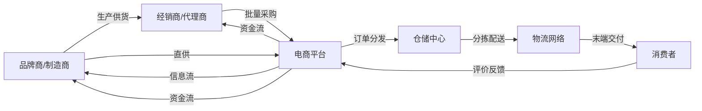
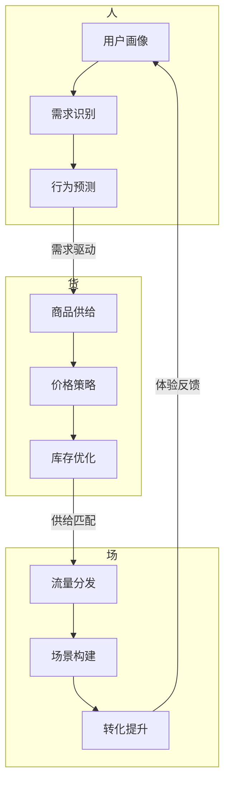
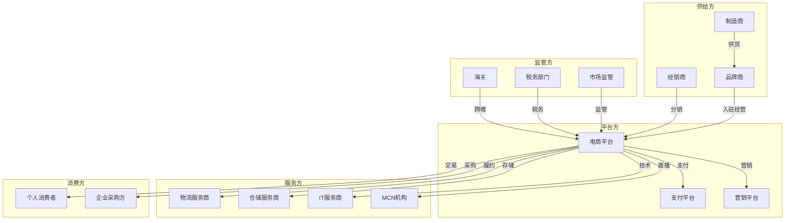

# 电商生态全景

## 电商模式分类

电子商务经过二十余年的发展，已从单一的线上交易演变为多元化的商业生态。不同模式对应不同的商业逻辑、用户画像和运营策略。

### B2C (Business to Consumer)

企业直接面向消费者销售商品的模式，是最主流的电商形态。

- 代表平台：京东自营、天猫、亚马逊
- 特点：商品品质有保障，售后服务完善，客单价较高
- 核心竞争力：供应链管理能力、品牌背书、物流体验
- 盈利模式：商品差价 + 平台佣金 + 广告收入

### B2B (Business to Business)

企业间的商品交易模式，涵盖原材料采购、批发分销等场景。

- 代表平台：1688、阿里国际站、敦煌网
- 特点：交易金额大、决策链长、合同周期长
- 核心竞争力：供应链深度、行业资源整合
- 盈利模式：会员费 + 交易佣金 + 增值服务

### C2C (Consumer to Consumer)

消费者之间的二手交易或个人经营模式。

- 代表平台：淘宝、闲鱼、转转
- 特点：商品多样性高、价格弹性大、信任成本高
- 核心竞争力：流量分发效率、信用评价体系
- 盈利模式：广告收入 + 增值服务费

### O2O (Online to Offline)

线上引流、线下消费的本地生活服务模式。

- 代表平台：美团、大众点评、饿了么
- 特点：即时性强、地域属性明显、履约依赖线下
- 核心竞争力：本地供给密度、配送时效、用户粘性
- 盈利模式：佣金 + 广告 + 配送费

### 社交电商

依托社交关系链进行商品传播和交易的模式。

- 代表平台：拼多多、小红书、云集
- 特点：获客成本低、裂变传播快、信任传递强
- 核心竞争力：社交裂变机制、内容种草能力
- 盈利模式：商品差价 + 平台佣金 + 广告

### 直播电商

通过实时视频直播进行商品展示和销售的模式。

- 代表平台：抖音电商、快手电商、淘宝直播
- 特点：冲动消费比例高、转化率优于图文、互动性强
- 核心竞争力：主播IP、内容生产能力、流量获取
- 盈利模式：坑位费 + 佣金 + 品牌广告

### 跨境电商

跨越国境的电子商务交易模式。

- 代表平台：SHEIN、速卖通、Temu、TikTok Shop
- 特点：涉及海关/汇率/国际物流，复杂度高
- 核心竞争力：供应链全球化能力、本地化运营
- 盈利模式：商品差价 + 平台服务费

## 电商产业链

电商产业链从商品生产到消费者手中，涉及多个环节的协同。

产业链核心环节：

- **上游**：品牌商、制造商、原料供应商，负责商品生产和品牌建设
- **中游**：电商平台、经销商、仓储服务商，负责商品流通和交易撮合
- **下游**：物流配送、售后服务，负责履约交付和用户满意度
- **消费者**：终端用户，需求反馈驱动产业链运转

产业链中存在三种核心流动：

| 流动类型 | 方向 | 说明 |
|---------|------|------|
| 信息流 | 双向 | 商品信息、订单信息、库存信息、用户反馈 |
| 物流 | 上游→下游 | 商品从生产端到消费端的物理移动 |
| 资金流 | 下游→上游 | 支付、结算、退款等资金流转 |

## 主流平台对比

| 维度 | 淘宝/天猫 | 京东 | 拼多多 | 抖音电商 |
|------|----------|------|--------|---------|
| 核心模式 | C2C+B2C | B2C自营+平台 | 社交电商 | 直播/内容电商 |
| 用户画像 | 全年龄段、全品类 | 中高收入、品质导向 | 价格敏感、下沉市场 | 年轻群体、兴趣驱动 |
| 核心优势 | 品类最全、生态成熟 | 物流体验、正品保障 | 极致性价比、社交裂变 | 内容种草、冲动转化 |
| 物流体系 | 第三方为主 | 自建物流(京东物流) | 极兔等第三方 | 第三方物流 |
| 变现模式 | 广告+佣金 | 商品差价+佣金+物流 | 广告+佣金 | 广告+佣金+坑位费 |
| 流量来源 | 搜索+推荐 | 搜索+会员 | 社交分享 | 算法推荐+直播 |
| GMV体量 | 约8万亿 | 约3.5万亿 | 约4万亿 | 约3万亿 |

## 电商核心指标

### 交易类指标

| 指标 | 英文 | 计算方式 | 说明 |
|------|------|---------|------|
| GMV | Gross Merchandise Volume | 成交总额(含未付款) | 衡量平台交易规模 |
| 客单价 | Average Order Value | GMV / 订单数 | 单笔订单平均金额 |
| 转化率 | Conversion Rate | 成交用户数 / 访客数 | 流量到成交的效率 |
| 复购率 | Repurchase Rate | 复购用户数 / 总成交用户数 | 用户粘性和满意度 |
| ROI | Return on Investment | 收益 / 投入成本 | 营销投入产出比 |
| 毛利率 | Gross Margin | (收入-成本) / 收入 | 盈利能力基础指标 |

### 流量类指标

| 指标 | 计算方式 | 说明 |
|------|---------|------|
| UV | 独立访客数 | 去重后的访问用户数 |
| PV | 页面浏览量 | 用户浏览页面的总次数 |
| 跳出率 | 只访问一个页面就离开的比例 | 落地页吸引力 |
| 人均浏览深度 | PV / UV | 用户浏览参与度 |
| 停留时长 | 用户在站内的平均时间 | 内容吸引力 |

### 履约类指标

| 指标 | 计算方式 | 说明 |
|------|---------|------|
| 发货时效 | 下单到发货的平均时间 | 仓储响应效率 |
| 配送时效 | 发货到签收的平均时间 | 物流效率 |
| 妥投率 | 成功投递 / 总投递 | 配送服务质量 |
| 退货率 | 退货订单 / 总订单 | 商品质量和描述相符度 |
| 破损率 | 破损件 / 总配送件 | 包装和运输质量 |

## 电商运营模型：人货场

"人货场"是电商运营的核心分析框架，三者相互影响、动态平衡。

### 人（用户）

用户是电商生态的核心驱动力，运营围绕用户全生命周期展开。

- **用户获取**：搜索流量、推荐流量、社交裂变、广告投放
- **用户激活**：新手礼包、首单优惠、个性化推荐
- **用户留存**：会员体系、积分商城、内容社区
- **用户变现**：交叉销售、向上销售、精准营销
- **用户传播**：口碑推荐、社交分享、KOL种草

### 货（商品）

商品是电商交易的本体，货的运营决定供给质量和效率。

- **选品策略**：趋势选品、数据选品、差异化选品
- **定价策略**：成本定价、竞争定价、动态定价
- **库存管理**：安全库存、智能补货、滞销处理
- **商品运营**：标题优化、详情页设计、评价管理

### 场（场景）

场景是用户与商品交互的触点，决定转化效率。

- **搜索场景**：关键词搜索、筛选排序、搜索推荐
- **推荐场景**：个性化推荐、猜你喜欢、关联推荐
- **内容场景**：直播带货、短视频种草、图文评测
- **社交场景**：拼团、砍价、好友推荐

### 人货场关系

## 电商生态参与者关系图

## 电商术语表

| 术语 | 全称 | 含义 |
|------|------|------|
| GMV | Gross Merchandise Volume | 成交总额，包含已付款和未付款订单 |
| SKU | Stock Keeping Unit | 最小库存单元，如"红色M码T恤" |
| SPU | Standard Product Unit | 标准产品单元，如"T恤" |
| AOI | Average Order Items | 平均每单商品件数 |
| AOV | Average Order Value | 平均订单金额(客单价) |
| CAC | Customer Acquisition Cost | 用户获取成本 |
| LTV | Lifetime Value | 用户生命周期价值 |
| CLV | Customer Lifetime Value | 客户生命周期价值 |
| CPS | Cost Per Sale | 按销售额付费 |
| CPM | Cost Per Mille | 千次展示成本 |
| CPC | Cost Per Click | 毉次点击成本 |
| ROAS | Return On Ad Spend | 广告支出回报率 |
| DAU | Daily Active Users | 日活跃用户数 |
| MAU | Monthly Active Users | 月活跃用户数 |
| ARPU | Average Revenue Per User | 每用户平均收入 |
| WMS | Warehouse Management System | 仓储管理系统 |
| OMS | Order Management System | 订单管理系统 |
| ERP | Enterprise Resource Planning | 企业资源计划 |
| CRM | Customer Relationship Management | 客户关系管理 |
| SaaS | Software as a Service | 软件即服务 |
| VMI | Vendor Managed Inventory | 供应商管理库存 |
| JIT | Just In Time | 准时制生产/配送 |
| 3PL | Third Party Logistics | 第三方物流 |
| FBA | Fulfillment by Amazon | 亚马逊物流服务 |
| DTC | Direct to Consumer | 品牌直连消费者 |
| SEO | Search Engine Optimization | 搜索引擎优化 |
| SEM | Search Engine Marketing | 搜索引擎营销 |
| KOL | Key Opinion Leader | 关键意见领袖 |
| KOC | Key Opinion Consumer | 关键意见消费者 |
| UGC | User Generated Content | 用户生成内容 |
| PGC | Professional Generated Content | 专业生成内容 |
