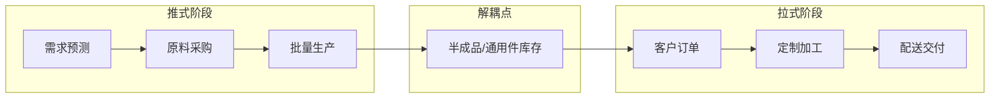
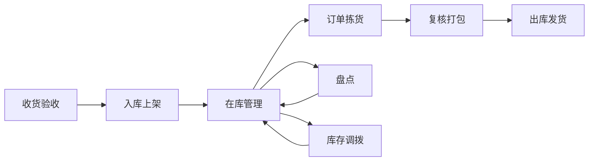
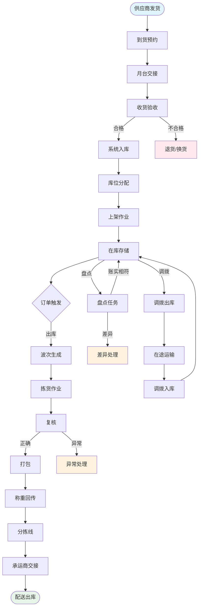

# 供应链与仓储体系

## 供应链五流

供应链是一个复杂的网络系统，其核心是五种流动的协调与优化。理解这五流是供应链管理的基础。

### 信息流

信息流是供应链的神经系统，驱动各环节的决策与协同。

- **方向**：双向流动，需求信息从下游向上游传递，供给信息从上游向下游传递
- **内容**：订单信息、库存信息、预测数据、促销计划、异常通知
- **挑战**：信息延迟、信息失真(牛鞭效应)、信息孤岛
- **优化方向**：实时数据共享、需求预测前移、端到端可视

### 物流

物流是供应链的物理载体，实现商品的空间位移。

- **方向**：上游→下游(正向物流)、下游→上游(逆向物流)
- **内容**：原材料运输、成品配送、退货回收
- **挑战**：运输成本、时效要求、破损率控制
- **优化方向**：路径优化、仓网规划、多式联运

### 资金流

资金流是供应链的血液，保障各环节的资金周转。

- **方向**：下游→上游(正向)，与物流方向相反
- **内容**：货款结算、账期管理、供应链金融
- **挑战**：账期压力、汇率波动、融资成本
- **优化方向**：账期优化、供应链金融、动态折扣

### 商流

商流是商品所有权的转移过程，是供应链的价值核心。

- **方向**：上游→下游，与物流方向一致
- **内容**：采购合同、销售合同、物权转移
- **挑战**：渠道冲突、价格体系、授权管理
- **优化方向**：渠道整合、直营模式、DTC转型

### 价值流

价值流是供应链中价值增值的过程，是供应链优化的目标。

- **方向**：随商流逐步增值
- **内容**：加工增值、品牌增值、服务增值
- **挑战**：增值环节识别、非增值活动消除
- **优化方向**：精益管理、价值链分析、差异化增值

## 供应链模式

### 推式供应链 (Push Model)

以预测和计划驱动，根据市场需求预测提前生产和备货。

- **运作逻辑**：预测→计划→生产→备货→销售
- **适用场景**：需求稳定、季节性商品、标准化产品
- **优势**：规模效应、生产效率高、交付及时
- **劣势**：库存风险高、响应变化慢、牛鞭效应显著

### 拉式供应链 (Pull Model)

以实际需求驱动，根据订单触发生产和配送。

- **运作逻辑**：订单→生产→配送
- **适用场景**：定制化产品、需求波动大、高价值商品
- **优势**：库存水平低、响应灵活、减少浪费
- **劣势**：交付周期长、规模效应弱、产能利用率低

### 推拉结合供应链 (Push-Pull Model)

在供应链解耦点之前采用推式，之后采用拉式，兼顾效率和灵活性。

- **运作逻辑**：推式(备货半成品)→解耦点→拉式(按需定制)
- **适用场景**：大规模定制、延迟策略、模块化产品
- **优势**：兼顾规模效应和灵活性
- **劣势**：解耦点选择复杂、管理难度高
- **电商典型应用**：面料批量采购(推)→按订单成衣(拉)



## 仓储体系

### 仓储层级

电商仓储体系通常采用多级架构，平衡时效和成本。

| 层级 | 名称 | 功能 | 典型面积 | 覆盖范围 |
|------|------|------|---------|---------|
| L1 | 总仓/中央仓 | 全品类存储、集中采购 | 5万-20万平米 | 全国 |
| L2 | 区域仓 | 区域配送、品类分仓 | 1万-5万平米 | 省域/城市群 |
| L3 | 前置仓 | 即时配送、高频商品 | 300-2000平米 | 城市/社区 |
| L4 | 门店仓 | 门店+仓储一体 | 50-500平米 | 社区/商圈 |

各级仓库的定位差异：

- **总仓**：承接供应商入库，大批量存储，向区域仓调拨
- **区域仓**：承接区域订单，品类侧重明显，向末端配送
- **前置仓**：承接即时订单，SKU精简(300-3000)，时效优先
- **门店仓**：线上线下融合，到店自提+同城配送

### 仓储选址关键因素

- 靠近目标消费群体(时效)
- 交通便利性(高速/机场/港口)
- 土地和人力成本(经济性)
- 供应商地理位置(入库成本)
- 区域政策优惠(税收/补贴)

## 仓储管理核心流程

### 完整流程



### 收货验收

- 检查送货单与采购单一致性
- 商品外观、数量、质量抽检
- 录入收货记录，生成入库单
- 异常处理：短缺、破损、错发

### 入库上架

- 分配库位：基于商品属性(尺寸/重量/周转率)
- 上架策略：固定库位 vs 动态库位
- ABC分类上架：A类商品靠近拣货区
- 批次管理：生产日期、保质期、供应商批次

### 在库管理

- 库位管理：库位编码、多货多位
- 批次管理：FIFO/FEFO策略
- 库存预警：高低储预警、保质期预警
- 盘点管理：动盘、循环盘、全盘

### 订单拣货

- 拣货策略：摘果式(按订单)、播种式(按批量)
- 波次规划：按区域/时段/优先级分组
- 路径优化：S型、U型、Z型路径
- 设备选型：PDA/语音/AGV/AMR

### 复核打包

- 商品与订单核对(扫码复核)
- 包装材料选择(尺寸/防护)
- 贴面单、称重、物流交接
- 异常处理：缺货、错拣

### 出库发货

- 物流分拣：按承运商/线路分拣
- 交接签收：与物流公司交接
- 在途跟踪：物流轨迹实时同步
- 签收确认：消费者确认收货

## WMS系统核心功能

仓储管理系统(WMS)是仓储运营的核心IT系统。

| 功能模块 | 核心能力 | 关键指标 |
|---------|---------|---------|
| 入库管理 | 收货、质检、上架 | 入库及时率、上架准确率 |
| 出库管理 | 拣货、复核、打包、发货 | 发货及时率、拣货准确率 |
| 库存管理 | 库存查询、调拨、冻结 | 库存准确率、账实相符率 |
| 盘点管理 | 动盘、循环盘、全盘 | 盘点差异率 |
| 批次管理 | FIFO/FEFO、效期预警 | 效期预警及时率 |
| 库位管理 | 库位分配、库位优化 | 库位利用率 |
| 补货管理 | 库位间补货触发与执行 | 补货及时率 |
| 绩效管理 | 人员KPI统计与分析 | 人均产出、差错率 |
| 对接集成 | ERP/OMS/TMS数据对接 | 数据同步及时率 |

## 库存管理策略

### 安全库存

安全库存是为应对需求和供应的不确定性而设置的缓冲库存。

基本计算公式：

```
安全库存 = Z * sqrt(需求标准差^2 * 平均提前期 + 平均需求^2 * 提前期标准差^2)
```

其中Z为服务水平对应的标准正态分位数。

| 服务水平 | Z值 | 适用场景 |
|---------|-----|---------|
| 90% | 1.28 | 低价值、易补充商品 |
| 95% | 1.65 | 一般商品 |
| 98% | 2.05 | 重要商品 |
| 99% | 2.33 | 关键商品/缺货损失大 |

### 补货策略

| 策略 | 逻辑 | 适用场景 | 优势 | 劣势 |
|------|------|---------|------|------|
| 连续检查(s,Q) | 库存降至s时订购Q | 高价值、需求稳定 | 库存水平低 | 监控成本高 |
| 周期检查(R,S) | 每R期检查，补至S | 中低价值、多SKU | 管理简单 | 库存波动大 |
| 连续检查(s,S) | 库存降至s时补至S | 需求波动较大 | 灵活性好 | 参数调优复杂 |
| Kanban | 基于看板触发补货 | 制造业、重复生产 | 可视化、简单 | 不适合多品种 |

### ABC分类管理

根据商品价值和销量贡献进行差异化管理。

| 分类 | 价值占比 | 数量占比 | 管理策略 |
|------|---------|---------|---------|
| A类 | 70-80% | 10-20% | 重点管理、高频盘点、精确预测 |
| B类 | 15-25% | 20-30% | 常规管理、定期盘点 |
| C类 | 5-10% | 50-70% | 简化管理、低频盘点、批量处理 |

## 供应链协同

### VMI (Vendor Managed Inventory)

供应商管理库存，由供应商根据共享的销售和库存信息自主管理补货。

- **核心思想**：将库存管理决策权交给更了解供应能力的供应商
- **信息共享**：销售数据、库存水位、预测信息
- **适用场景**：大型零售商与核心供应商之间
- **优势**：降低买方库存、减少缺货、提高周转
- **风险**：供应商承担库存风险、信息泄露

### JIT (Just In Time)

准时制生产/配送，在需要的时间将需要的数量送到需要的地点。

- **核心思想**：零库存理想，消除一切浪费
- **实施条件**：稳定需求、可靠供应、高质量、短距离
- **适用场景**：汽车制造、快消品高频配送
- **优势**：降低库存成本、减少浪费、暴露问题
- **风险**：抗风险能力弱、供应链中断影响大

### CPFR (Collaborative Planning, Forecasting and Replenishment)

协同计划、预测与补货，供应链各方共同制定计划和预测。

- **核心思想**：通过深度协同消除牛鞭效应
- **流程**：战略规划→需求预测→供应预测→补货执行
- **适用场景**：品牌商与零售商的深度合作
- **优势**：预测精度提升、库存优化、缺货减少
- **挑战**：信任建立、系统集成、利益分配

## 仓储流程Mermaid图



## 供应链协同模式对比

| 维度 | VMI | JIT | CPFR |
|------|-----|-----|------|
| 核心目标 | 降低买方库存 | 零库存 | 协同预测与补货 |
| 决策主体 | 供应商 | 需求方 | 共同决策 |
| 信息共享程度 | 中等 | 低 | 高 |
| 实施难度 | 中等 | 高 | 很高 |
| 适用关系 | 稳定合作 | 紧密合作 | 战略合作 |
| 库存归属 | 买方(或协议) | 供应商 | 各自 |
| 典型应用 | 零售补货 | 汽车制造 | 快消品联合计划 |
| 关键成功因素 | 数据共享及时 | 供应稳定性 | 信任与系统对接 |

### S&OP产销协同

S&OP是供应链管理的核心决策流程，协调需求端（销售预测）与供给端（产能、库存、采购）：

#### S&OP月度循环

| 阶段 | 周次 | 关键活动 | 输出 |
|------|------|----------|------|
| 数据准备 | 第1周 | 更新销售数据、库存水位、产能状态 | 数据报告 |
| 需求规划 | 第2周 | 销售团队更新预测，市场输入促销计划 | 需求共识 |
| 供给规划 | 第3周 | 采购/生产评估供应能力，识别缺口 | 供给方案 |
| 预备会议 | 第4周 | 跨部门对齐，解决分歧 | 协调方案 |
| 高管决策 | 第4周 | 管理层审批最终计划 | 执行授权 |

#### AI在S&OP中的价值

- 需求预测自动化替代人工Excel预测
- 供给缺口自动识别与补货建议
- 场景模拟：促销/断供/价格变化的供应链影响
- 异常预警：预测偏差超阈值时自动升级
