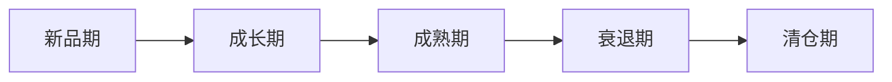
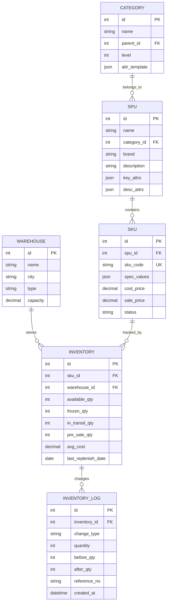

# 商品与库存管理

## 商品体系

### SPU与SKU

商品体系的基石是SPU和SKU的概念，两者构成了电商商品管理的数据基础。

**SPU (Standard Product Unit)** - 标准产品单元

SPU是商品信息聚合的最小单位，表示一组具有共同属性的商品集合。例如"iPhone 15"是一个SPU，它包含了颜色、存储容量等可变属性的定义。

**SKU (Stock Keeping Unit)** - 库存量单位

SKU是库存进出的最小计量单位，是物理上不可再分的最小商品单元。例如"iPhone 15 256GB 蓝色"是一个SKU，对应具体的库存数量和价格。

```
SPU: iPhone 15
├── SKU: iPhone 15 128GB 蓝色
├── SKU: iPhone 15 128GB 粉色
├── SKU: iPhone 15 256GB 蓝色
├── SKU: iPhone 15 256GB 粉色
└── SKU: iPhone 15 512GB 蓝色
```

SPU与SKU的关键区别：

| 维度 | SPU | SKU |
|------|-----|-----|
| 粒度 | 粗(产品级) | 细(规格级) |
| 唯一标识 | 产品ID | SKU编码 |
| 价格 | 价格区间 | 具体价格 |
| 库存 | 无直接库存 | 有具体库存数 |
| 属性 | 共性属性 | 规格属性+共性属性 |
| 运营 | 商品详情页 | 库存管理、价格管理 |

### 品类树

品类树是商品分类的层级结构，支持从宏观到微观的商品组织。

```
一级品类(根品类)
├── 二级品类
│   ├── 三级品类
│   │   └── 四级品类(叶品类)
│   └── 三级品类
└── 二级品类
    └── ...
```

品类树设计原则：

- **MECE原则**：相互独立、完全穷尽
- **深度控制**：通常3-4层，最深不超过5层
- **叶品类关联**：叶品类关联属性模板和运营规则
- **可扩展性**：支持品类的新增和调整

### 属性模型

商品属性模型定义了商品信息的结构化描述方式。

| 属性类型 | 说明 | 示例 |
|---------|------|------|
| 关键属性 | 品类下必填属性，影响SKU区分 | 手机:品牌、型号 |
| 销售属性 | 产生SKU规格的属性 | 颜色、尺码、版本 |
| 描述属性 | 补充商品描述的属性 | 材质、产地、净含量 |
| 特有属性 | 某品类特有的属性 | 手机:屏幕尺寸、电池容量 |

属性模型的核心设计：

```
品类 → 绑定属性模板
属性模板 → 包含多个属性定义
属性定义 → 属性名 + 属性值类型(文本/数值/枚举) + 是否必填 + 是否为销售属性
SKU → 销售属性值组合确定
SPU → 关键属性 + 描述属性
```

## 商品生命周期

商品从引入市场到退出市场，经历完整的生命周期，每个阶段需要不同的运营策略。



### 新品期 (Introduction)

- **特征**：销量低、认知度低、推广成本高
- **库存策略**：小批量试销，严格控制首批备货量
- **定价策略**：撇脂定价或渗透定价
- **运营重点**：种草推广、评价积累、流量导入
- **核心指标**：加购率、收藏率、首评速度

### 成长期 (Growth)

- **特征**：销量快速增长、口碑形成、竞争者进入
- **库存策略**：加大备货深度，确保不断货
- **定价策略**：逐步调整至市场均衡价格
- **运营重点**：扩大流量、提升转化、品类占位
- **核心指标**：销量增速、搜索排名、转化率

### 成熟期 (Maturity)

- **特征**：销量稳定、增长放缓、竞争激烈
- **库存策略**：维持合理库存，关注周转
- **定价策略**：竞争定价、促销拉动
- **运营重点**：利润最大化、防御竞品、客户留存
- **核心指标**：利润率、复购率、市场份额

### 衰退期 (Decline)

- **特征**：销量下降、需求转移、利润压缩
- **库存策略**：停止补货，加速去库存
- **定价策略**：逐步降价清仓
- **运营重点**：减少损失、引导替代品、用户迁移
- **核心指标**：库存周转天数、清仓速度

### 清仓期 (Clearance)

- **特征**：尾货处理、接近退市
- **库存策略**：极致清仓，可接受折损
- **定价策略**：底价出清、组合销售
- **运营重点**：快速回笼资金、腾出仓储空间
- **核心指标**：清仓完成率、折损率

## 库存类型

电商库存包含多种状态，不同状态对应不同的可用性和管理要求。

| 库存类型 | 含义 | 可售性 | 典型场景 |
|---------|------|--------|---------|
| 可用库存 | 当前可售的库存数量 | 可售 | 正常销售 |
| 在途库存 | 已采购但未到货的库存 | 不可售 | 补货运输中 |
| 预售库存 | 以预售方式出售的库存 | 有条件可售 | 新品预售、大促预售 |
| 冻结库存 | 因各种原因暂时不可售的库存 | 不可售 | 质量问题、盘点冻结 |
| 调拨库存 | 仓间调拨中的库存 | 不可售 | 仓间调拨在途 |
| 退货库存 | 消费者退回待处理的库存 | 待定 | 待质检后决定 |
| 残次库存 | 有质量问题的库存 | 不可售 | 待报废或返厂 |

### 库存扣减规则

库存的可用数量计算：

```
可用库存 = 总库存 - 已占库存 - 冻结库存 - 预售占用量

可售库存 = 可用库存 - 安全库存预留
```

库存扣减时机选择：

| 策略 | 扣减时机 | 优势 | 劣势 | 适用场景 |
|------|---------|------|------|---------|
| 下单减库存 | 提交订单时 | 防止超卖 | 恶意占库存 | 限量商品 |
| 付款减库存 | 支付完成时 | 不占库存 | 可能超卖 | 一般商品 |
| 预扣+确认 | 下单预扣，付款确认 | 兼顾防超卖和释放 | 逻辑复杂 | 高并发场景 |

## 库存核算

### 先进先出 (FIFO)

假设先入库的商品先出库，适用于价格趋势上涨的商品。

- 期末库存价值接近当前市价
- 销售成本反映较早的采购价格
- 适用于保质期敏感的商品

### 加权平均法

以所有批次的加权平均单价核算库存价值。

```
加权平均单价 = (期初库存金额 + 本期入库金额) / (期初库存数量 + 本期入库数量)

期末库存价值 = 期末库存数量 * 加权平均单价
```

- 库存价值平滑波动
- 计算简便，适合多批次小批量
- 适用于价格波动不大的商品

### 移动加权平均法

每次入库后重新计算平均单价，实时反映库存成本变化。

```
新加权平均单价 = (原库存金额 + 本次入库金额) / (原库存数量 + 本次入库数量)
```

### 核算方法对比

| 维度 | FIFO | 加权平均 | 移动加权平均 |
|------|------|---------|------------|
| 成本反映 | 较早成本 | 平均成本 | 近似当前成本 |
| 利润影响 | 通胀时利润偏高 | 平滑 | 较准确 |
| 计算复杂度 | 低 | 低 | 中 |
| 实时性 | 低 | 低 | 高 |
| 适用场景 | 价格上涨期 | 稳定价格 | 价格波动大 |

## 库存周转分析

### 周转率

库存周转率衡量库存流转的速度，是库存管理效率的核心指标。

```
库存周转率 = 销售成本 / 平均库存价值

平均库存价值 = (期初库存价值 + 期末库存价值) / 2
```

### 周转天数

周转天数表示库存从入库到售出的平均时间。

```
库存周转天数 = 365 / 库存周转率

或

库存周转天数 = 平均库存价值 / (销售成本 / 365)
```

### 库龄分析

库龄分析是按商品在库时间进行分组统计，识别滞销风险。

| 库龄区间 | 风险等级 | 建议措施 |
|---------|---------|---------|
| 0-30天 | 正常 | 正常销售 |
| 31-60天 | 关注 | 加强推广 |
| 61-90天 | 预警 | 促销降价 |
| 91-180天 | 滞销 | 折扣清仓 |
| 180天以上 | 严重滞销 | 底价出清/报废 |

库龄分析的价值：

- 识别滞销品，及时采取清理措施
- 评估库存健康度，优化采购决策
- 计算库存折损准备，反映真实库存价值
- 指导品类规划和选品策略

### 周转分析维度

| 分析维度 | 目的 | 典型问题 |
|---------|------|---------|
| 按SKU | 识别单品周转效率 | 哪些SKU周转过慢 |
| 按品类 | 评估品类库存结构 | 哪个品类库存积压 |
| 按仓库 | 评估仓储效率 | 哪个仓库周转偏低 |
| 按时间 | 跟踪趋势变化 | 周转率是否在改善 |

## 库存成本

库存成本是电商运营的重要成本构成，全面理解库存成本有助于做出更优的库存决策。

| 成本类型 | 构成 | 占比(参考) | 优化方向 |
|---------|------|-----------|---------|
| 采购成本 | 商品进价、运输费、关税 | 60-80% | 供应商谈判、集中采购 |
| 仓储成本 | 仓租、设备折旧、人工、水电 | 5-15% | 仓网优化、自动化 |
| 资金占用 | 库存资金的时间价值、融资利息 | 5-10% | 加速周转、减少积压 |
| 损耗成本 | 过期、破损、丢失、贬值 | 2-8% | 库龄管理、防护措施 |
| 管理成本 | 人员、系统、盘点 | 2-5% | 系统化、流程优化 |

### 库存持有成本模型

```
年度库存持有成本 = 平均库存价值 * 持有成本率

持有成本率 = 资金成本率 + 仓储费率 + 损耗费率 + 保险费率 + 管理费率
           ≈ 20% - 30% / 年
```

## 滞销品处理策略

### 滞销品识别

```
滞销品判定规则(满足任一):
1. 库龄 > 90天 且 近30天销量 < 5件
2. 库存 > 近90天销量 * 2
3. 周转天数 > 品类平均周转天数 * 3
```

### 处理策略矩阵

| 库龄 | 库存量 | 处理策略 | 预期折损 |
|------|--------|---------|---------|
| 60-90天 | 高 | 站内促销+优惠券 | 10-20% |
| 60-90天 | 低 | 搭配热销品组合销售 | 5-10% |
| 90-180天 | 高 | 折扣专区+直播清仓 | 30-50% |
| 90-180天 | 低 | 内购/员工福利 | 40-60% |
| >180天 | 任意 | 批量处理/报废 | 60-100% |

### 滞销品预防措施

- **新品试销**：小批量验证市场需求后再大批量采购
- **销量监控**：实时跟踪销量趋势，早期预警
- **预测优化**：提高需求预测精度，从源头减少滞销
- **供应商协议**：退换货条款、寄售模式
- **品类规划**：合理规划SKU宽度，避免过度铺货

## 商品库存数据模型

### 核心数据实体



### 库存快照与统计分析

库存管理需要定期记录快照，支撑历史分析和趋势预测。

| 统计维度 | 指标 | 用途 |
|---------|------|------|
| 日快照 | 各SKU每日库存水位 | 周转分析、预警 |
| 周统计 | 周均库存、周转率 | 运营复盘 |
| 月统计 | 月度周转天数、库龄分布 | 财务核算 |
| 品类统计 | 品类库存占比、周转对比 | 品类优化 |

### 库存预警规则

| 预警类型 | 触发条件 | 处理建议 |
|---------|---------|---------|
| 缺货预警 | 可用库存 < 安全库存 | 紧急补货 |
| 滞销预警 | 库龄 > 60天且销量<阈值 | 促销清仓 |
| 积压预警 | 库存 > 峰值预测*1.5 | 停止补货 |
| 效期预警 | 距效期 < 安全天数 | 优先出库/促销 |
| 高储预警 | 库位利用率 > 95% | 仓间调拨/扩容 |
