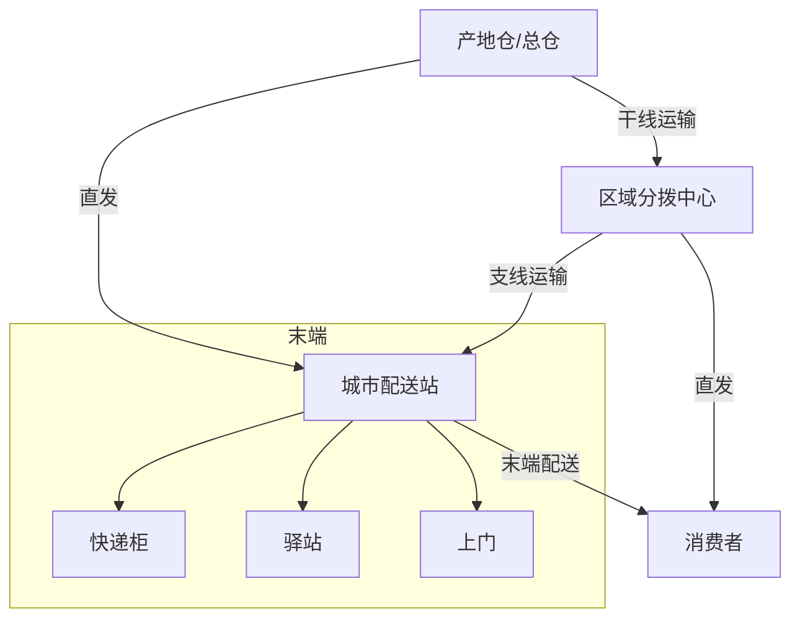
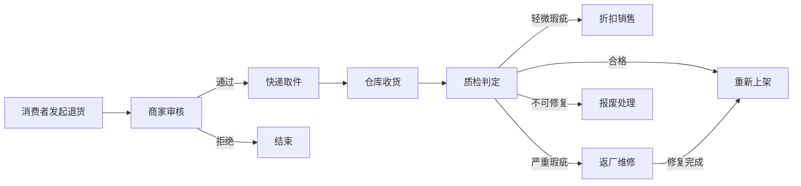

# 物流与配送体系

## 物流模式

电商物流是连接商品与消费者的关键环节，不同的物流模式在成本、时效和服务质量上各有侧重。

### 自建物流

企业自建仓储和配送网络，实现对物流全链路的自主管控。

- **代表企业**：京东物流、顺丰、亚马逊
- **特点**：重资产投入，服务品质可控，时效稳定
- **优势**：端到端可控、服务标准化、品牌体验好
- **劣势**：投入巨大、规模效应门槛高、灵活性差
- **适用条件**：日订单量百万级以上，对时效要求极高

### 第三方物流 (3PL)

将物流业务外包给专业物流公司，聚焦核心业务。

- **代表企业**：四通一达(圆通/中通/申通/韵达/百世)、极兔
- **特点**：轻资产运营，按量付费，网络覆盖广
- **优势**：成本低、弹性强、覆盖面广
- **劣势**：服务质量不稳定、异常处理慢、数据不透明
- **适用场景**：中小卖家、非时效敏感品类

### 仓配一体

仓储与配送一体化运营，商品从仓库直接发货到消费者。

- **运作方式**：商品提前入仓→消费者下单→仓库拣货打包→配送上门
- **代表企业**：京东物流、菜鸟仓配
- **优势**：时效快(当日/次日达)、履约可控
- **劣势**：需要多仓布局、库存分散、资金占用大
- **适用场景**：高频消费品、标品、时效敏感品类

### 云仓

基于云计算和分布式仓储的共享物流模式，多商家共享仓储资源。

- **运作方式**：商家将商品分散存储在多个云仓→系统智能分配最近的仓库发货
- **代表企业**：菜鸟云仓、京东云仓
- **优势**：降低单商家仓储门槛、就近发货提升时效
- **劣势**：系统对接复杂、库存管理难度大
- **适用场景**：多渠道销售、中小商家、多SKU

### 物流模式对比

| 维度 | 自建物流 | 3PL | 仓配一体 | 云仓 |
|------|---------|-----|---------|------|
| 投入成本 | 极高 | 低 | 高 | 中 |
| 时效控制 | 最优 | 一般 | 优 | 良 |
| 服务品质 | 最优 | 不稳定 | 优 | 良 |
| 覆盖范围 | 有限 | 广 | 有限 | 较广 |
| 弹性扩展 | 差 | 优 | 一般 | 良 |
| 数据可控 | 完全 | 有限 | 完全 | 部分 |
| 适用规模 | 大型 | 全规模 | 大中型 | 中小型 |

## 配送网络

电商配送网络采用多级节点架构，实现从仓库到消费者的高效履约。

```
产地仓/总仓 → 区域分拨中心 → 城市配送站 → 末端网点 → 消费者
```



### 产地仓/总仓

- **功能**：大批量存储、供应商集中入库
- **位置**：靠近生产基地或交通枢纽
- **特点**：面积大(5-20万平米)、品类全、批量作业

### 区域分拨中心 (RDC)

- **功能**：区域集散、分拣转运、短期缓存
- **位置**：区域交通枢纽，覆盖1-3个省份
- **特点**：分拣能力强、中转时效高

### 城市配送站

- **功能**：末端分拣、快递员派件起点
- **位置**：城市各区域，覆盖3-5公里半径
- **特点**：小面积、高频次、人工作业为主

### 网络优化要点

- 仓网层级与节点数量的平衡
- 干线/支线/末端运力的匹配
- 分拨中心选址与覆盖范围优化
- 多仓备货策略与调拨效率

## 最后一公里

最后一公里配送是物流链路中成本最高、最复杂的环节，占配送总成本的30-50%。

### 快递柜

- **代表**：丰巢、菜鸟驿站(柜)
- **优势**：无人值守、24小时可取、成本低
- **劣势**：尺寸限制、超时收费、无验货
- **适用**：小件商品、上班族、标准化商品

### 驿站

- **代表**：菜鸟驿站、妈妈驿站、兔喜超市
- **优势**：可暂存大件、有服务人员、可验货
- **劣势**：营业时间限制、取件排队
- **适用**：中等尺寸商品、社区集中配送

### 上门配送

- **代表**：京东快递、顺丰
- **优势**：体验最好、可当面验货、可安装调试
- **劣势**：成本最高、需预约时间、重复派送
- **适用**：大件商品、高价值商品、冷链商品

### 最后一公里创新模式

| 模式 | 说明 | 优势 | 挑战 |
|------|------|------|------|
| 无人车配送 | 自动驾驶小车社区配送 | 降低人工成本 | 路权、安全、载重 |
| 无人机配送 | 短距离空中配送 | 极快时效 | 法规、天气、载重 |
| 社区团购 | 自提点集中取货 | 极低成本 | 时效差、品类有限 |
| 即时配送 | 同城1小时达 | 时效极好 | 成本高、距离受限 |
| 开放驿站 | 多品牌共用取件点 | 资源共享 | 利益分配复杂 |

## 物流核心指标

| 指标 | 计算方式 | 行业基准 | 说明 |
|------|---------|---------|------|
| 全链路时效 | 下单到签收时间 | 2-5天 | 整体配送效率 |
| 仓内时效 | 下单到出库时间 | 2-8小时 | 仓储响应速度 |
| 妥投率 | 成功投递/总投递 | >98% | 配送服务质量 |
| 破损率 | 破损件/总件数 | <0.1% | 包装和运输质量 |
| 丢失率 | 丢失件/总件数 | <0.01% | 安全性指标 |
| 单票成本 | 总物流成本/总票数 | 3-8元 | 成本效率 |
| 签收时效 | 到达配送站到签收 | 2-4小时 | 末端效率 |
| 异常率 | 异常件/总件数 | <1% | 整体稳定性 |

## 路径优化

### VRP问题 (Vehicle Routing Problem)

车辆路径优化问题是物流领域的经典优化问题，目标是在满足约束条件下最小化总运输成本。

**基本VRP**：给定一组客户点和车队，规划最优配送路线。

**常见变体**：

| 变体 | 额外约束 | 典型场景 |
|------|---------|---------|
| CVRP | 车辆容量限制 | 快递配送 |
| VRPTW | 时间窗约束 | 生鲜配送 |
| VRPPD | 取送货并存 | 逆向物流 |
| MDVRP | 多车场 | 区域配送 |
| SVRP | 随机需求 | 日常配送 |

### 求解方法

| 方法 | 类型 | 适用规模 | 求解质量 | 速度 |
|------|------|---------|---------|------|
| 精确算法 | 分支定界/割平面 | <100点 | 最优 | 慢 |
| 节约算法 | 启发式 | 100-500点 | 较好 | 快 |
| 遗传算法 | 元启发式 | 500-2000点 | 好 | 中 |
| 模拟退火 | 元启发式 | 500-2000点 | 好 | 中 |
| OR-Tools | 混合 | 1000+点 | 好 | 快 |

### 简化路径优化示例

```python
import numpy as np
from typing import List, Tuple

def calculate_distance(p1: Tuple[float, float], p2: Tuple[float, float]) -> float:
    """计算两点之间的欧几里得距离"""
    return np.sqrt((p1[0] - p2[0])**2 + (p1[1] - p2[1])**2)

def nearest_neighbor_route(
    depot: Tuple[float, float],
    customers: List[Tuple[float, float]],
    capacity: int,
    demands: List[int]
) -> List[List[int]]:
    """
    最近邻启发式求解CVRP

    Args:
        depot: 仓库坐标
        customers: 客户坐标列表
        capacity: 车辆容量
        demands: 各客户需求量

    Returns:
        路线列表，每条路线为客户索引列表
    """
    n = len(customers)
    unvisited = set(range(n))
    routes = []

    while unvisited:
        route = []
        remaining_capacity = capacity
        current_pos = depot

        while True:
            best_customer = None
            best_dist = float('inf')

            for c in unvisited:
                if demands[c] <= remaining_capacity:
                    dist = calculate_distance(current_pos, customers[c])
                    if dist < best_dist:
                        best_dist = dist
                        best_customer = c

            if best_customer is None:
                break

            route.append(best_customer)
            remaining_capacity -= demands[best_customer]
            current_pos = customers[best_customer]
            unvisited.remove(best_customer)

        if route:
            routes.append(route)

    return routes

# 使用示例
depot = (0, 0)
customers = [(2, 3), (5, 1), (3, 7), (8, 4), (1, 6)]
demands = [3, 5, 2, 4, 6]
capacity = 10

routes = nearest_neighbor_route(depot, customers, capacity, demands)
for i, route in enumerate(routes):
    print(f"路线{i+1}: 客户{route}, 总需求: {sum(demands[c] for c in route)}")
```

## 逆向物流

逆向物流处理商品从消费者回流到商家的全过程，包括退货、换货、维修等。

### 逆向物流流程



### 逆向物流成本构成

| 成本项 | 占比 | 说明 |
|--------|------|------|
| 运输成本 | 30-40% | 取件+返仓运费 |
| 质检人工 | 15-25% | 检验、测试人工 |
| 商品折损 | 20-30% | 包装损坏、商品贬值 |
| 系统处理 | 5-10% | 退款、入库系统成本 |
| 仓储占用 | 10-15% | 退件暂存空间 |

### 退货率优化

| 品类 | 平均退货率 | 主要退货原因 | 优化措施 |
|------|-----------|------------|---------|
| 服装 | 15-30% | 尺码不合/色差 | 尺码助手/视频展示 |
| 鞋靴 | 10-20% | 尺码偏差 | 试穿服务/尺码对照 |
| 3C数码 | 3-8% | 功能不符 | 规格详情/视频评测 |
| 食品 | 1-3% | 品质问题 | 保质期保障/包装加固 |
| 家具 | 5-10% | 尺寸/色差 | AR展示/上门测量 |

## 跨境物流

跨境物流比国内物流复杂度高得多，涉及国际运输、清关、本地配送等多个环节。

### 主要模式

| 模式 | 时效 | 成本 | 适用场景 |
|------|------|------|---------|
| 海外仓 | 2-5天 | 中(前置备货) | 高频商品、时效敏感 |
| 集运/专线 | 7-15天 | 中低 | 中等时效要求 |
| 邮政小包 | 15-45天 | 低 | 轻小件、低价商品 |
| 国际快递 | 3-7天 | 高 | 高价值、紧急 |
| FBA | 2-5天 | 中 | 亚马逊卖家 |

### 海外仓模式


- **优势**：时效快(本地配送)、退换货便利、用户体验好
- **劣势**：备货成本高、库存风险大、需要本地运营能力
- **关键决策**：备货量、SKU选择、仓址选择

### 清关要点

| 要素 | 说明 |
|------|------|
| HS编码 | 商品海关编码，决定税率和监管条件 |
| 关税 | 进口关税，影响成本结构 |
| 增值税/消费税 | 目的国国内税 |
| 合规认证 | 产品认证(CE/FCC/FDA等) |
| 申报价值 | 影响税费和赔偿 |

## 物流术语表

| 术语 | 全称 | 含义 |
|------|------|------|
| 3PL | Third Party Logistics | 第三方物流 |
| 4PL | Fourth Party Logistics | 第四方物流(供应链集成商) |
| RDC | Regional Distribution Center | 区域分拨中心 |
| FDC | Front Distribution Center | 前置配送中心 |
| DC | Distribution Center | 配送中心 |
| COD | Cash On Delivery | 货到付款 |
| POD | Proof of Delivery | 签收证明 |
| TMS | Transport Management System | 运输管理系统 |
| OMS | Order Management System | 订单管理系统 |
| VRP | Vehicle Routing Problem | 车辆路径问题 |
| CVRP | Capacitated VRP | 带容量约束的车辆路径问题 |
| VRPTW | VRP with Time Windows | 带时间窗的车辆路径问题 |
| SLA | Service Level Agreement | 服务水平协议 |
| TAT | Turn Around Time | 周转时间 |
| ETA | Estimated Time of Arrival | 预计到达时间 |
| FTL | Full Truck Load | 整车运输 |
| LTL | Less Than Truck Load | 零担运输 |
| Cross-docking | 越库作业 | 不入库直接分拣转运 |
| Milk Run | 循环取货 | 沿固定路线多点取货/送货 |
