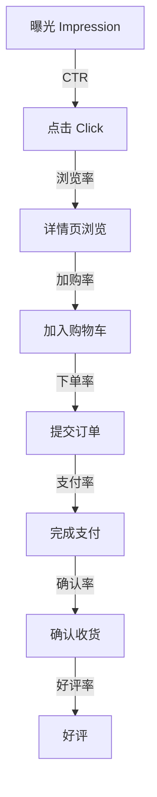
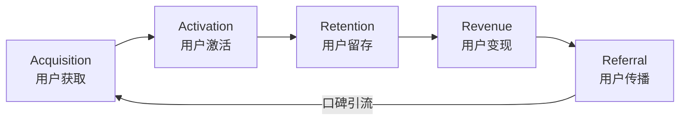
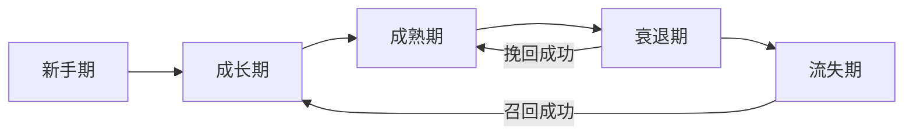
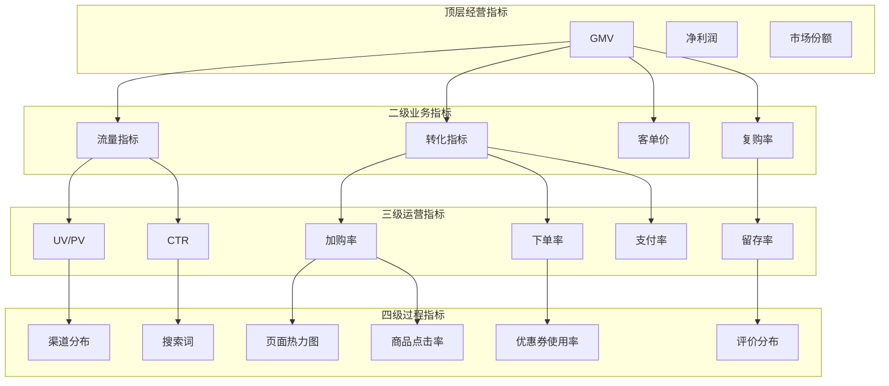

# 电商数据与运营

## 电商数据体系

电商数据是驱动业务决策的基础资产，按照来源和用途可分为四大类。

### 交易数据

交易数据记录了商业活动的核心结果，是电商运营最基础的数据类型。

| 数据类型 | 核心字段 | 来源系统 | 更新频率 |
|---------|---------|---------|---------|
| 订单数据 | 订单号、用户ID、下单时间、订单金额、状态 | OMS | 实时 |
| 支付数据 | 支付流水号、支付方式、支付金额、支付时间 | 支付系统 | 实时 |
| 退款数据 | 退款单号、退款原因、退款金额、退款时间 | 售后系统 | 实时 |
| 发票数据 | 发票号、开票金额、税率 | 财务系统 | T+1 |

### 用户行为数据

用户行为数据记录了消费者在平台上的所有交互行为，是理解用户需求的关键。

| 数据类型 | 核心字段 | 采集方式 | 更新频率 |
|---------|---------|---------|---------|
| 浏览数据 | 页面路径、停留时长、来源渠道 | 埋点SDK | 实时 |
| 搜索数据 | 搜索词、筛选条件、结果点击 | 搜索日志 | 实时 |
| 加购数据 | 加购商品、加购时间、加购路径 | 埋点SDK | 实时 |
| 收藏数据 | 收藏商品、收藏店铺 | 业务系统 | 实时 |
| 分享数据 | 分享渠道、分享内容 | 埋点SDK | 实时 |
| 评价数据 | 评分、评语、晒图 | 评价系统 | T+1 |

### 商品数据

商品数据是电商平台的供给基础，支撑商品运营和推荐系统。

| 数据类型 | 核心字段 | 来源系统 | 更新频率 |
|---------|---------|---------|---------|
| 基础数据 | SPU/SKU信息、品类、属性 | 商品系统 | 变更时 |
| 价格数据 | 售价、成本价、促销价 | 价格系统 | 变更时 |
| 库存数据 | 可用库存、在途库存、冻结库存 | WMS | 实时 |
| 销量数据 | 日/周/月销量、销量趋势 | 数据仓库 | T+1 |
| 评价数据 | 评分、好评率、评价数 | 评价系统 | T+1 |

### 供应链数据

供应链数据支撑库存管理和采购决策，是电商后端运营的数据基础。

| 数据类型 | 核心字段 | 来源系统 | 更新频率 |
|---------|---------|---------|---------|
| 采购数据 | 采购单、供应商、交期、价格 | SRM | 变更时 |
| 仓储数据 | 库存水位、库龄、周转率 | WMS | T+1 |
| 物流数据 | 运单、轨迹、时效、异常 | TMS | 实时 |
| 供应商数据 | 评分、交付率、质量合格率 | SRM | 周/月 |

## 数据分析维度

### 流量分析

流量分析是了解用户来源和行为模式的基础。

**流量来源分析**：

| 来源类型 | 渠道 | 特点 | 核心指标 |
|---------|------|------|---------|
| 自然流量 | 搜索、直接访问 | 免费、质量高 | SEO排名、直接访问占比 |
| 付费流量 | SEM、信息流、联盟 | 成本可控、规模可扩 | CPC、ROI、转化率 |
| 社交流量 | 微信、微博、小红书 | 裂变潜力大 | 分享率、K因子 |
| 推荐流量 | 站内推荐、Push | 精准、转化高 | CTR、转化率 |
| 内容流量 | 直播、短视频 | 互动性强、冲动消费 | 观看时长、转化率 |

**流量质量评估**：

```
流量价值 = UV * 转化率 * 客单价

流量成本 = 总投放费用 / UV

流量ROI = (GMV - 投放费用) / 投放费用
```

### 转化漏斗

转化漏斗是电商最核心的分析模型，展示用户从进入到成交的全流程效率。



**各环节关键指标**：

| 漏斗环节 | 核心指标 | 行业参考值 | 优化方向 |
|---------|---------|-----------|---------|
| 曝光→点击 | CTR(点击率) | 2-8% | 主图优化、标题优化 |
| 点击→加购 | 加购率 | 5-15% | 详情页优化、价格策略 |
| 加购→下单 | 下单率 | 20-40% | 优惠券触发、库存保障 |
| 下单→支付 | 支付率 | 70-90% | 支付方式丰富、催付策略 |
| 支付→确认 | 确认率 | 85-95% | 物流时效、商品质量 |
| 确认→好评 | 好评率 | 90-98% | 商品质量、售后服务 |

### 用户分群

用户分群是精细化运营的基础，通过对用户进行标签化分类实现精准触达。

**常见分群维度**：

| 维度 | 分群方式 | 应用场景 |
|------|---------|---------|
| 价值维度 | 高/中/低价值 | 差异化服务与营销 |
| 活跃维度 | 高/中/低活跃 | 唤醒/留存策略 |
| 生命周期 | 新客/老客/沉睡/流失 | 生命周期运营 |
| 品类偏好 | 品类偏好标签 | 品类交叉推荐 |
| 价格敏感度 | 价格敏感/不敏感 | 优惠券策略 |

### 商品分析

商品分析围绕商品的销售表现和运营效率展开。

| 分析维度 | 核心指标 | 分析目的 |
|---------|---------|---------|
| 销售分析 | 销量、销售额、增速 | 识别爆款和滞销品 |
| 转化分析 | 点击率、加购率、转化率 | 优化商品呈现 |
| 库存分析 | 周转率、库龄、缺货率 | 优化库存结构 |
| 价格分析 | 价格弹性、竞品价差 | 优化定价策略 |
| 评价分析 | 好评率、差评原因 | 改善产品质量 |

## 运营方法论

### AARRR模型

AARRR是用户增长的经典框架，定义了用户从获取到传播的五个阶段。



| 阶段 | 核心目标 | 关键指标 | 典型策略 |
|------|---------|---------|---------|
| 获取(Acquisition) | 获取新用户 | 新增UV、获客成本 | 渠道投放、SEO优化、社交裂变 |
| 激活(Activation) | 引导首次消费 | 首单转化率、激活率 | 新人礼包、首单优惠、引导流程 |
| 留存(Retention) | 提升用户粘性 | 次日/7日/30日留存 | 会员体系、内容运营、Push |
| 变现(Revenue) | 提升用户价值 | ARPU、复购率 | 精准推荐、交叉销售、会员升级 |
| 传播(Referral) | 用户自发传播 | 分享率、K因子 | 邀请有礼、拼团、社交互动 |

### RFM分析

RFM模型通过三个维度评估用户价值，是用户分群的重要方法。

| 维度 | 含义 | 计算方式 | 业务含义 |
|------|------|---------|---------|
| Recency | 最近一次消费距今天数 | 当前日期 - 最近消费日期 | 越近越活跃 |
| Frequency | 消费频次 | 统计期内消费次数 | 越高越忠诚 |
| Monetary | 消费金额 | 统计期内消费总额 | 越高越有价值 |

**RFM用户分群**：

| R | F | M | 用户类型 | 运营策略 |
|---|---|---|---------|---------|
| 高 | 高 | 高 | 重要价值用户 | VIP服务、专属权益 |
| 高 | 低 | 高 | 重要发展用户 | 提频促销、品类推荐 |
| 高 | 高 | 低 | 重要保持用户 | 向上销售、客单提升 |
| 低 | 高 | 高 | 重要挽留用户 | 唤醒触达、专属优惠 |
| 低 | 低 | 高 | 一般价值用户 | 定期触达、复购激励 |
| 低 | 高 | 低 | 一般保持用户 | 低价引流、性价比推荐 |
| 高 | 低 | 低 | 一般发展用户 | 体验优化、引导复购 |
| 低 | 低 | 低 | 流失用户 | 低成本触达或放弃 |

### 用户生命周期

用户生命周期描述了用户与平台关系的演进过程。



| 阶段 | 时间范围 | 核心指标 | 运营重点 |
|------|---------|---------|---------|
| 新手期 | 首次消费后0-7天 | 首单满意度、二单率 | 新手引导、满意度保障 |
| 成长期 | 7-30天 | 复购率、品类扩展 | 品类推荐、优惠刺激 |
| 成熟期 | 30天以上活跃 | ARPU、复购频次 | 会员权益、精准营销 |
| 衰退期 | 活跃度持续下降 | 活跃度趋势 | 唤醒策略、专属优惠 |
| 流失期 | 超过N天未消费 | 流失率 | 召回策略、低成本触达 |

## 营销工具

### 优惠券

| 类型 | 适用场景 | 核心参数 | 效果特点 |
|------|---------|---------|---------|
| 满减券 | 提升客单价 | 门槛金额、减免金额 | 提客单效果明确 |
| 折扣券 | 刺激转化 | 折扣比例、上限 | 适合新品推广 |
| 无门槛券 | 新客激活 | 面额 | 转化率高但成本大 |
| 品类券 | 品类运营 | 品类范围、门槛 | 精准品类引导 |

### 满减

```
满减设计关键参数:
- 门槛金额: 影响客单价提升幅度
- 减免金额: 影响吸引力与利润
- 层级设计: 满100减10, 满200减25, 满300减40
- 叠加规则: 是否可与优惠券叠加
```

### 秒杀

秒杀是限时限量低价促销，核心挑战是高并发下的系统稳定性和公平性。

- **技术挑战**：瞬时高并发、库存防超卖、防刷防黄牛
- **运营要点**：选品(高关注度+低价格)、时间段选择、预热节奏
- **核心指标**：秒杀参与率、售罄速度、转化率

### 拼团

拼团通过社交裂变实现低成本获客。

- **模式**：普通拼团(2-5人)、阶梯团(人数越多越便宜)、抽奖团
- **核心参数**：成团人数、拼团时效、拼团价格
- **关键指标**：成团率、裂变系数、获客成本

### 直播

直播电商将内容与交易融合，是增长最快的电商业态。

- **模式**：品牌自播、达人直播、店铺直播
- **核心指标**：观看人数、在线峰值、转化率、GMV
- **运营要素**：选品排品、主播话术、流量投放、互动设计

## 大促运营

### 618/双11备货策略

大促备货是电商供应链最复杂的决策，需要在缺货风险和库存积压之间取得平衡。

**备货量计算**：

```
备货量 = 预测销量 * (1 + 安全系数) - 当前库存 - 在途库存

安全系数 = f(预测误差, 缺货成本, 库存折损率)
```

**备货分层策略**：

| 商品分类 | 备货深度 | 逻辑 |
|---------|---------|------|
| 核心爆款 | 预测*120%-150% | 绝不断货，缺货损失极大 |
| 主力商品 | 预测*100%-120% | 适度超额，保障供应 |
| 长尾商品 | 预测*80%-100% | 控制风险，宁可少备 |
| 试销新品 | 小批量试销 | 验证市场，快速补货 |

### 流量预估

大促流量通常达到日常的5-20倍，需要提前规划容量。

```
峰值QPS = 日均QPS * 峰值系数 * 增长系数

峰值系数: 通常3-5(大促当天)
增长系数: 基于同比/环比增长趋势
```

### 峰值应对

| 层面 | 策略 | 具体措施 |
|------|------|---------|
| 应用层 | 弹性扩容 | 提前扩容、自动伸缩、预热 |
| 数据层 | 读写分离 | 缓存预热、限流降级 |
| 业务层 | 削峰填谷 | 预售定金、购物车缓存、异步下单 |
| 前端层 | 静态化 | CDN加速、页面静态化、懒加载 |
| 安全层 | 防刷防爬 | 风控规则、验证码、限流 |

## 数据驱动决策

### 报表体系

| 报表类型 | 更新频率 | 使用者 | 核心内容 |
|---------|---------|--------|---------|
| 实时大屏 | 秒级/分钟级 | 管理层/运营 | GMV、订单量、转化率 |
| 日报 | T+1 | 运营/产品 | 前日核心指标、环比变化 |
| 周报 | 周 | 运营主管 | 周度趋势、目标达成 |
| 月报 | 月 | 管理层 | 月度经营分析、目标回顾 |
| 专题分析 | 按需 | 分析师 | 深度分析、归因、建议 |

### BI看板

BI看板将关键指标可视化，支撑实时监控和快速决策。

**核心看板设计**：

| 看板 | 核心指标 | 更新频率 | 典型用户 |
|------|---------|---------|---------|
| 经营大盘 | GMV、订单量、UV、转化率 | 实时 | 管理层 |
| 流量看板 | 各渠道UV、CTR、成本 | 实时 | 市场运营 |
| 交易看板 | 订单量、客单价、支付率 | 实时 | 交易运营 |
| 商品看板 | 爆款排行、库存预警 | 小时级 | 商品运营 |
| 供应链看板 | 库存周转、缺货率 | 日级 | 供应链 |

### 归因分析

归因分析确定各触点对转化的贡献，优化营销资源配置。

| 归因模型 | 逻辑 | 适用场景 |
|---------|------|---------|
| 首次触达 | 100%归因首次接触渠道 | 品牌认知阶段 |
| 末次触达 | 100%归因末次接触渠道 | 效果广告评估 |
| 线性归因 | 各触点均等分配 | 全链路评估 |
| 时间衰减 | 越近的触点权重越高 | 短决策周期商品 |
| 马尔可夫链 | 基于转移概率计算 | 数据充足的成熟业务 |

## 电商数据指标体系



这一分层指标体系的核心原则是：

- **顶层指标**反映经营结果，面向管理层决策
- **二级指标**拆解业务驱动力，定位增长方向
- **三级指标**跟踪运营效率，支撑日常优化
- **四级指标**记录过程细节，支持深度分析

每个下层指标都能向上追溯，形成完整的指标树。当顶层指标出现波动时，可以逐层下钻定位具体原因，实现从"发现问题"到"定位原因"的数据驱动闭环。
