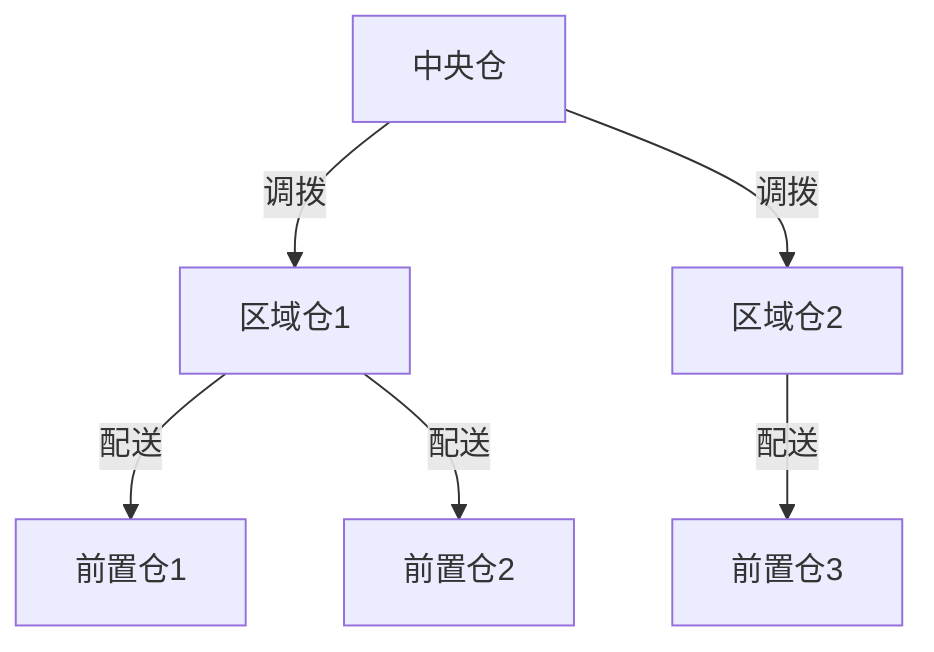

# 库存优化模型

## 经典库存模型

库存优化的核心是在库存持有成本和缺货成本之间寻找最优平衡点。经典库存模型提供了不同场景下的理论框架。

### EOQ模型 (Economic Order Quantity)

EOQ是最基础的库存模型，在确定性需求下求解最优订货批量。

```
总成本 TC = 订货成本 + 持有成本

TC = (D/Q) * S + (Q/2) * H

其中:
D = 年需求量
Q = 每次订货量
S = 每次订货的固定成本
H = 单位年持有成本

最优订货量:
Q* = sqrt(2 * D * S / H)

最优订货次数:
N* = D / Q*

最优订货周期:
T* = Q* / D (年)
```

**EOQ假设条件**：

- 需求恒定且已知
- 提前期固定
- 不允许缺货
- 单位持有成本不变
- 即时补货(订货一次性到齐)

### (s, S)模型

连续检查策略，当库存降至再订货点s时，订货使库存恢复至S。

```
订货触发条件: 库存位置 <= s
订货量: Q = S - 库存位置

其中:
s = 提前期需求 + 安全库存
S = s + EOQ (或其他最优批量)
```

- **适用场景**：高价值商品、需求波动较大
- **优势**：响应及时、库存水平可控
- **劣势**：需要持续监控库存

### (R, S)模型

周期检查策略，每隔R期检查库存并订货至目标水平S。

```
检查周期: 每R期检查一次
订货量: Q = S - 当前库存位置

其中:
R = 检查间隔(由EOQ推导或经验设定)
S = 检查周期+提前期内的需求 + 安全库存
```

- **适用场景**：中低价值商品、多SKU管理
- **优势**：管理简单、可批量处理
- **劣势**：库存波动大、可能错过最佳补货时机

### Base Stock模型

基准库存策略，每售出一个单位即补货一个单位。

```
基准库存水平: S = 提前期需求 + 安全库存
每次订货量: Q = 1 (或实际出库量)
```

- **适用场景**：高价值低需求、定制化商品
- **优势**：库存水平最低
- **劣势**：订货频率极高、订货成本大

### 经典模型对比

| 维度 | EOQ | (s,S) | (R,S) | Base Stock |
|------|-----|-------|-------|------------|
| 检查方式 | 不适用 | 连续 | 周期 | 连续 |
| 订货触发 | 固定批量 | 库存<=s | 每R期 | 每次出库 |
| 订货量 | 固定Q | S-库存位置 | S-库存位置 | 出库量 |
| 库存水平 | 中 | 中低 | 中高 | 最低 |
| 管理复杂度 | 低 | 高 | 低 | 高 |
| 适用商品 | 稳定需求 | 重要商品 | 常规商品 | 高价值低频 |

## 安全库存计算

安全库存是应对需求和供应不确定性的缓冲，是库存优化中最关键的参数之一。

### 基本公式

```
安全库存 SS = Z * σ_L

其中:
Z = 服务水平对应的标准正态分位数
σ_L = 提前期内需求的标准差

当需求和提前期都存在不确定性时:
σ_L = sqrt(L * σ_d^2 + d^2 * σ_LT^2)

其中:
L = 平均提前期
σ_d = 日需求标准差
d = 平均日需求
σ_LT = 提前期标准差
```

### 服务水平与安全库存

| 服务水平 | Z值 | 安全库存倍数 | 适用场景 |
|---------|-----|------------|---------|
| 85% | 1.04 | 低 | 低价值、易补货 |
| 90% | 1.28 | 中低 | 一般商品 |
| 95% | 1.65 | 中 | 重要商品 |
| 97% | 1.88 | 中高 | 核心商品 |
| 99% | 2.33 | 高 | 关键商品/缺货损失大 |

### 不同服务水平下的成本权衡

```
缺货成本 = 缺货概率 * 单次缺货成本 * 年需求量
安全库存持有成本 = 安全库存量 * 单位年持有成本

最优服务水平 = 使 (缺货成本 + 安全库存持有成本) 最小的服务水平
```

## 多级库存优化

### 级库存 vs 安装库存

多级库存系统中，库存决策需要考虑各级之间的关联效应。

**安装库存**：仅考虑本级的库存水平

```
安装库存 = 本级在库 + 本级在途
```

**级库存**：考虑本级及下游所有库存的总和

```
级库存 = 本级在库 + 本级在途 + 所有下游在库 + 所有下游在途
```

### 多级优化策略



| 策略 | 优化目标 | 方法 | 复杂度 |
|------|---------|------|--------|
| 独立优化 | 各级独立最优 | 各级分别计算安全库存 | 低 |
| 级库存优化 | 系统全局最优 | 基于级库存的(s,S)策略 | 中 |
| 近似优化 | 兼顾精度和效率 | 保证库存理论近似 | 中高 |
| 仿真优化 | 复杂场景最优 | 蒙特卡洛仿真 | 高 |

### 关键决策

- **库存放置**：在哪个层级存放哪些SKU
- **调拨策略**：何时从上级向下级调拨
- **风险汇聚**：中央仓集中存储 vs 分散存储
- **订单合并**：多SKU合并订货降低订货成本

## 补货策略

### 连续检查 (Continuous Review)

实时监控库存水位，当库存降至触发点时立即补货。

```
触发条件: 库存位置(IP) <= s
IP = 在库 + 在途 - 欠交

补货量: Q = S - IP

参数计算:
s = d * L + SS  (提前期需求 + 安全库存)
S = s + Q_opt   (触发点 + 最优批量)
```

### 周期检查 (Periodic Review)

定期检查库存，根据当前库存水平决定补货量。

```
检查周期: T (天/周)
补货量: Q = S - IP

参数计算:
T = EOQ / d (基于EOQ的最优检查周期)
S = d * (T + L) + SS  (检查周期+提前期需求+安全库存)
```

### 策略选择指南

| 商品特征 | 推荐策略 | 原因 |
|---------|---------|------|
| 高价值、需求波动大 | (s,S)连续检查 | 精确控制，减少资金占用 |
| 中等价值、SKU多 | (R,S)周期检查 | 管理成本低，可批量操作 |
| 低价值、需求稳定 | (R,S)长周期 | 极简管理，经济批量补货 |
| 高频快消品 | (s,S)连续+高频 | 确保不缺货 |
| 季节性商品 | 动态参数调整 | 随季节调整参数 |

## ABC-XYZ矩阵分类管理

ABC-XYZ矩阵将商品按价值贡献和需求稳定性两个维度进行分类，实现差异化的库存管理策略。

### ABC分类(价值维度)

| 类别 | 价值占比 | 数量占比 | 说明 |
|------|---------|---------|------|
| A | 70-80% | 10-20% | 少数高价值商品 |
| B | 15-25% | 20-30% | 中等价值商品 |
| C | 5-10% | 50-70% | 大量低价值商品 |

### XYZ分类(需求稳定性维度)

| 类别 | 需求变异系数(CV) | 说明 |
|------|-----------------|------|
| X | CV < 0.5 | 需求稳定，预测准确 |
| Y | 0.5 <= CV < 1.0 | 需求有波动，可预测 |
| Z | CV >= 1.0 | 需求极不稳定，难预测 |

### ABC-XYZ矩阵策略

| | X(稳定) | Y(波动) | Z(不稳定) |
|---|---------|---------|----------|
| A(高价值) | AX: 精细预测+(s,S) | AY: 弹性预测+高安全库存 | AZ: 按单补货+极低库存 |
| B(中价值) | BX: 标准预测+(R,S) | BY: 季节调整+中安全库存 | BZ: 低库存+快速补货 |
| C(低价值) | CX: 简单预测+批量补货 | CY: 品类级预测+批量 | CZ: 最小库存/按需 |

```python
def classify_abc_xyz(
    sales_data: dict,
    value_data: dict,
    abc_thresholds: tuple = (0.8, 0.95),
    xyz_thresholds: tuple = (0.5, 1.0),
) -> dict:
    """
    ABC-XYZ分类

    Args:
        sales_data: {sku_id: [销量序列]}
        value_data: {sku_id: 总价值}
        abc_thresholds: ABC分界(累计价值占比)
        xyz_thresholds: XYZ分界(变异系数)

    Returns:
        {sku_id: {"abc": "A/B/C", "xyz": "X/Y/Z", "cv": float}}
    """
    # ABC分类
    sorted_items = sorted(value_data.items(), key=lambda x: x[1], reverse=True)
    total_value = sum(v for _, v in sorted_items)
    cumulative = 0
    abc_map = {}
    for sku, value in sorted_items:
        cumulative += value
        ratio = cumulative / total_value
        if ratio <= abc_thresholds[0]:
            abc_map[sku] = "A"
        elif ratio <= abc_thresholds[1]:
            abc_map[sku] = "B"
        else:
            abc_map[sku] = "C"

    # XYZ分类
    xyz_map = {}
    cv_map = {}
    for sku, sales in sales_data.items():
        if len(sales) < 2 or np.mean(sales) == 0:
            cv = float("inf")
        else:
            cv = float(np.std(sales) / np.mean(sales))
        cv_map[sku] = cv
        if cv < xyz_thresholds[0]:
            xyz_map[sku] = "X"
        elif cv < xyz_thresholds[1]:
            xyz_map[sku] = "Y"
        else:
            xyz_map[sku] = "Z"

    # 组合
    results = {}
    for sku in value_data:
        results[sku] = {
            "abc": abc_map.get(sku, "C"),
            "xyz": xyz_map.get(sku, "Z"),
            "cv": round(cv_map.get(sku, float("inf")), 3),
        }
    return results
```

## 库存优化线性规划模型

对于多商品多仓库的库存优化问题，可以使用线性规划求解全局最优解。

```
目标: min Σ_i Σ_j (持有成本_ij * I_ij + 缺货成本_ij * B_ij + 订货成本_ij * δ_ij)

约束条件:
1. 库存平衡: I_ij(t+1) = I_ij(t) + Q_ij(t) - D_ij(t) + B_ij(t)
2. 容量约束: Σ_i v_i * I_ij <= C_j (仓库容量)
3. 预算约束: Σ_i Σ_j c_i * Q_ij <= B (采购预算)
4. 服务水平: P(D_ij <= I_ij + Q_ij) >= α_i (服务水平约束)
5. 非负约束: I_ij, B_ij, Q_ij >= 0

其中:
I_ij = 仓库j中商品i的库存
B_ij = 仓库j中商品i的缺货量
Q_ij = 仓库j中商品i的补货量
δ_ij = 是否订货(0/1)
```

## 完整代码：安全库存计算+补货建议引擎

```python
import numpy as np
from pydantic import BaseModel, Field
from typing import Optional, List, Dict
from enum import Enum
from datetime import datetime, timedelta


class ReplenishStrategy(str, Enum):
    CONTINUOUS_SS = "continuous_ss"      # (s,S)连续检查
    PERIODIC_RS = "periodic_rs"          # (R,S)周期检查
    EOQ = "eoq"                          # EOQ固定批量


class SafetyStockRequest(BaseModel):
    """安全库存计算请求"""
    sku_id: str = Field(..., description="SKU标识")
    avg_daily_demand: float = Field(..., gt=0, description="平均日需求")
    demand_std: float = Field(..., ge=0, description="日需求标准差")
    avg_lead_time: float = Field(..., gt=0, description="平均提前期(天)")
    lead_time_std: float = Field(..., ge=0, description="提前期标准差(天)")
    service_level: float = Field(default=0.95, gt=0, lt=1, description="目标服务水平")


class SafetyStockResponse(BaseModel):
    """安全库存计算响应"""
    sku_id: str
    safety_stock: float
    reorder_point: float
    avg_lead_time_demand: float
    service_level: float
    z_score: float


class ReplenishRequest(BaseModel):
    """补货建议请求"""
    sku_id: str = Field(..., description="SKU标识")
    warehouse_id: str = Field(..., description="仓库标识")
    current_inventory: float = Field(..., ge=0, description="当前库存")
    in_transit: float = Field(default=0, ge=0, description="在途库存")
    backorder: float = Field(default=0, ge=0, description="欠交数量")
    avg_daily_demand: float = Field(..., gt=0, description="平均日需求")
    demand_std: float = Field(..., ge=0, description="日需求标准差")
    avg_lead_time: float = Field(..., gt=0, description="平均提前期(天)")
    lead_time_std: float = Field(..., ge=0, description="提前期标准差")
    ordering_cost: float = Field(default=50, gt=0, description="每次订货成本")
    holding_cost_rate: float = Field(default=0.25, gt=0, description="年持有成本率")
    unit_cost: float = Field(..., gt=0, description="单位成本")
    service_level: float = Field(default=0.95, gt=0, lt=1, description="目标服务水平")
    review_period: Optional[int] = Field(default=None, description="检查周期(天), 仅周期检查模式")
    strategy: ReplenishStrategy = Field(default=ReplenishStrategy.CONTINUOUS_SS)


class ReplenishResponse(BaseModel):
    """补货建议响应"""
    sku_id: str
    warehouse_id: str
    strategy: str
    need_replenish: bool
    suggested_quantity: float
    safety_stock: float
    reorder_point: float
    inventory_position: float
    current_inventory: float
    estimated_stockout_date: Optional[str]
    estimated_arrival_date: Optional[str]


class InventoryOptimizer:
    """库存优化引擎"""

    # 服务水平→Z值映射
    SERVICE_LEVEL_Z = {
        0.85: 1.04, 0.90: 1.28, 0.95: 1.65,
        0.97: 1.88, 0.98: 2.05, 0.99: 2.33,
        0.995: 2.58, 0.999: 3.09,
    }

    def get_z_score(self, service_level: float) -> float:
        """获取服务水平对应的Z值"""
        if service_level in self.SERVICE_LEVEL_Z:
            return self.SERVICE_LEVEL_Z[service_level]
        # 线性插值
        levels = sorted(self.SERVICE_LEVEL_Z.keys())
        for i in range(len(levels) - 1):
            if levels[i] <= service_level <= levels[i + 1]:
                ratio = (service_level - levels[i]) / (levels[i + 1] - levels[i])
                return self.SERVICE_LEVEL_Z[levels[i]] + ratio * (
                    self.SERVICE_LEVEL_Z[levels[i + 1]] - self.SERVICE_LEVEL_Z[levels[i]]
                )
        return 2.33  # 默认99%

    def calculate_safety_stock(self, req: SafetyStockRequest) -> SafetyStockResponse:
        """
        计算安全库存

        考虑需求和提前期双重不确定性
        """
        z = self.get_z_score(req.service_level)
        d = req.avg_daily_demand
        sigma_d = req.demand_std
        L = req.avg_lead_time
        sigma_lt = req.lead_time_std

        # 提前期需求标准差
        sigma_l = np.sqrt(L * sigma_d ** 2 + d ** 2 * sigma_lt ** 2)

        safety_stock = z * sigma_l
        lead_time_demand = d * L
        reorder_point = lead_time_demand + safety_stock

        return SafetyStockResponse(
            sku_id=req.sku_id,
            safety_stock=round(safety_stock, 1),
            reorder_point=round(reorder_point, 1),
            avg_lead_time_demand=round(lead_time_demand, 1),
            service_level=req.service_level,
            z_score=round(z, 2),
        )

    def generate_replenish_advice(self, req: ReplenishRequest) -> ReplenishResponse:
        """生成补货建议"""
        # 计算安全库存
        ss_req = SafetyStockRequest(
            sku_id=req.sku_id,
            avg_daily_demand=req.avg_daily_demand,
            demand_std=req.demand_std,
            avg_lead_time=req.avg_lead_time,
            lead_time_std=req.lead_time_std,
            service_level=req.service_level,
        )
        ss_result = self.calculate_safety_stock(ss_req)

        # 计算库存位置
        inventory_position = req.current_inventory + req.in_transit - req.backorder

        if req.strategy == ReplenishStrategy.CONTINUOUS_SS:
            return self._continuous_ss_replenish(req, ss_result, inventory_position)
        elif req.strategy == ReplenishStrategy.PERIODIC_RS:
            return self._periodic_rs_replenish(req, ss_result, inventory_position)
        elif req.strategy == ReplenishStrategy.EOQ:
            return self._eoq_replenish(req, ss_result, inventory_position)

    def _continuous_ss_replenish(
        self, req: ReplenishRequest, ss_result: SafetyStockResponse, ip: float
    ) -> ReplenishResponse:
        """(s,S)连续检查补货"""
        s = ss_result.reorder_point  # 再订货点
        eoq = self._calculate_eoq(req)
        S = s + eoq  # 目标库存水平

        need_replenish = ip <= s
        quantity = max(S - ip, 0) if need_replenish else 0

        # 预计缺货日期
        stockout_date = self._estimate_stockout_date(req, ip)

        # 预计到货日期
        arrival_date = None
        if need_replenish and quantity > 0:
            arrival_date = (datetime.now() + timedelta(days=req.avg_lead_time)).strftime("%Y-%m-%d")

        return ReplenishResponse(
            sku_id=req.sku_id,
            warehouse_id=req.warehouse_id,
            strategy="continuous_ss",
            need_replenish=need_replenish,
            suggested_quantity=round(quantity, 0),
            safety_stock=ss_result.safety_stock,
            reorder_point=round(s, 1),
            inventory_position=round(ip, 1),
            current_inventory=req.current_inventory,
            estimated_stockout_date=stockout_date,
            estimated_arrival_date=arrival_date,
        )

    def _periodic_rs_replenish(
        self, req: ReplenishRequest, ss_result: SafetyStockResponse, ip: float
    ) -> ReplenishResponse:
        """(R,S)周期检查补货"""
        R = req.review_period or 7  # 默认7天检查周期
        d = req.avg_daily_demand
        L = req.avg_lead_time
        z = self.get_z_score(req.service_level)
        sigma_d = req.demand_std
        sigma_lt = req.lead_time_std

        # 检查周期+提前期的需求标准差
        sigma_rl = np.sqrt((R + L) * sigma_d ** 2 + d ** 2 * sigma_lt ** 2)
        S = d * (R + L) + z * sigma_rl

        quantity = max(S - ip, 0)

        stockout_date = self._estimate_stockout_date(req, ip)
        arrival_date = None
        if quantity > 0:
            arrival_date = (datetime.now() + timedelta(days=L)).strftime("%Y-%m-%d")

        return ReplenishResponse(
            sku_id=req.sku_id,
            warehouse_id=req.warehouse_id,
            strategy="periodic_rs",
            need_replenish=quantity > 0,
            suggested_quantity=round(quantity, 0),
            safety_stock=ss_result.safety_stock,
            reorder_point=round(S - d * R, 1),
            inventory_position=round(ip, 1),
            current_inventory=req.current_inventory,
            estimated_stockout_date=stockout_date,
            estimated_arrival_date=arrival_date,
        )

    def _eoq_replenish(
        self, req: ReplenishRequest, ss_result: SafetyStockResponse, ip: float
    ) -> ReplenishResponse:
        """EOQ补货"""
        eoq = self._calculate_eoq(req)
        need_replenish = ip <= ss_result.reorder_point
        quantity = eoq if need_replenish else 0

        stockout_date = self._estimate_stockout_date(req, ip)
        arrival_date = None
        if need_replenish:
            arrival_date = (datetime.now() + timedelta(days=req.avg_lead_time)).strftime("%Y-%m-%d")

        return ReplenishResponse(
            sku_id=req.sku_id,
            warehouse_id=req.warehouse_id,
            strategy="eoq",
            need_replenish=need_replenish,
            suggested_quantity=round(quantity, 0),
            safety_stock=ss_result.safety_stock,
            reorder_point=ss_result.reorder_point,
            inventory_position=round(ip, 1),
            current_inventory=req.current_inventory,
            estimated_stockout_date=stockout_date,
            estimated_arrival_date=arrival_date,
        )

    def _calculate_eoq(self, req: ReplenishRequest) -> float:
        """计算经济订货批量"""
        D = req.avg_daily_demand * 365  # 年需求
        S = req.ordering_cost
        H = req.unit_cost * req.holding_cost_rate
        if H == 0:
            return D
        return np.sqrt(2 * D * S / H)

    def _estimate_stockout_date(
        self, req: ReplenishRequest, ip: float
    ) -> Optional[str]:
        """预估缺货日期"""
        if req.avg_daily_demand == 0:
            return None
        days_until_stockout = ip / req.avg_daily_demand
        if days_until_stockout <= req.avg_lead_time:
            stockout_date = datetime.now() + timedelta(days=days_until_stockout)
            return stockout_date.strftime("%Y-%m-%d")
        return None


# 使用示例
if __name__ == "__main__":
    optimizer = InventoryOptimizer()

    # 安全库存计算
    ss_req = SafetyStockRequest(
        sku_id="SKU001",
        avg_daily_demand=50,
        demand_std=15,
        avg_lead_time=5,
        lead_time_std=1.5,
        service_level=0.95,
    )
    ss_result = optimizer.calculate_safety_stock(ss_req)
    print(f"安全库存: {ss_result.safety_stock}, 再订货点: {ss_result.reorder_point}")

    # 补货建议
    rep_req = ReplenishRequest(
        sku_id="SKU001",
        warehouse_id="WH001",
        current_inventory=200,
        in_transit=50,
        avg_daily_demand=50,
        demand_std=15,
        avg_lead_time=5,
        lead_time_std=1.5,
        unit_cost=100,
        ordering_cost=200,
        holding_cost_rate=0.25,
        service_level=0.95,
        strategy=ReplenishStrategy.CONTINUOUS_SS,
    )
    rep_result = optimizer.generate_replenish_advice(rep_req)
    print(f"需补货: {rep_result.need_replenish}, 建议量: {rep_result.suggested_quantity}")
```

## 库存策略对比表

| 维度 | (s,S)连续 | (R,S)周期 | EOQ | Base Stock |
|------|----------|----------|-----|------------|
| 检查频率 | 实时 | 每R期 | 触发时 | 实时 |
| 安全库存 | 低 | 较高 | 低 | 低 |
| 管理成本 | 高(实时监控) | 低 | 低 | 高 |
| 订货频率 | 不固定 | 固定 | 固定 | 极高 |
| 适用价值 | 高价值 | 中低价值 | 稳定需求 | 极高价值 |
| 需求波动适应 | 好 | 一般 | 差 | 好 |
| 缺货风险 | 低 | 中 | 中 | 低(如果S足够) |
| 系统要求 | WMS实时 | 简单 | 简单 | WMS实时 |
| 多SKU批量 | 难 | 易 | 一般 | 难 |
| 推荐场景 | 核心商品 | 常规商品 | 稳定标品 | 定制/高价值 |
