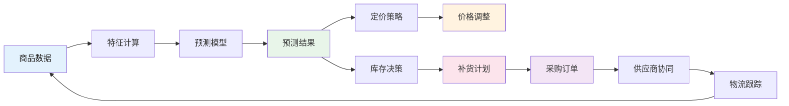

# 系统架构设计

## 项目概述

智能供应链系统是一个集销量预测、智能定价、库存优化和供应链协同于一体的一体化平台。系统旨在通过AI技术赋能电商供应链的各核心环节，实现从数据到决策的全链路智能化。

### 核心能力

| 能力模块 | 功能 | AI技术 |
|---------|------|--------|
| 销量预测 | SKU级/品类级销量预测 | Prophet、XGBoost |
| 智能定价 | 动态定价、促销优化 | 价格弹性模型、MAB |
| 库存优化 | 安全库存、补货建议 | 统计模型、线性规划 |
| 供应链协同 | 供应商评估、采购优化 | 评估模型、优化算法 |
| LLM分析 | 自然语言查询与分析 | 大语言模型 |

### 技术栈

| 层级 | 技术选型 | 说明 |
|------|---------|------|
| Web框架 | FastAPI | 高性能异步Python Web框架 |
| ORM | SQLAlchemy 2.0 | 支持异步的Python ORM |
| 数据库 | PostgreSQL | 关系型数据存储 |
| 缓存 | Redis | 实时库存/价格缓存 |
| 任务队列 | Celery + Redis | 异步任务(模型训练、批量预测) |
| 预测引擎 | Prophet + XGBoost | 时间序列+机器学习预测 |
| LLM | OpenAI API | 自然语言分析报告 |
| 容器化 | Docker + Docker Compose | 开发和部署环境 |

## 系统架构图

```mermaid
graph TB
    subgraph 前端
        UI[React + Ant Design]
    end

    subgraph API网关
        GW[FastAPI Gateway]
    end

    subgraph 核心服务
        P[商品服务<br/>Product Service]
        F[预测服务<br/>Forecast Service]
        PR[定价服务<br/>Pricing Service]
        I[库存服务<br/>Inventory Service]
        SC[协同服务<br/>Supply Chain Service]
    end

    subgraph 异步任务
        CL[Celery Worker]
        FL[Flower监控]
    end

    subgraph 数据层
        DB[(PostgreSQL)]
        RD[(Redis)]
    end

    subgraph AI引擎
        PH[Prophet Engine]
        XG[XGBoost Engine]
        PE[定价引擎]
        IE[库存优化引擎]
    end

    subgraph LLM
        LLM[LLM分析服务]
    end

    UI --> GW
    GW --> P
    GW --> F
    GW --> PR
    GW --> I
    GW --> SC

    F --> PH
    F --> XG
    PR --> PE
    I --> IE
    SC --> LLM
    F --> LLM
    PR --> LLM

    P --> DB
    P --> RD
    F --> DB
    PR --> DB
    PR --> RD
    I --> DB
    I --> RD
    SC --> DB

    CL --> PH
    CL --> XG
    CL --> DB
    FL --> CL
```

## 微服务拆分

### 商品服务 (Product Service)

管理商品基础信息、SKU规格和品类结构。

| 接口 | 方法 | 功能 |
|------|------|------|
| /api/v1/products | GET | 查询商品列表 |
| /api/v1/products/{id} | GET | 获取商品详情 |
| /api/v1/products | POST | 创建商品 |
| /api/v1/products/{id} | PUT | 更新商品 |
| /api/v1/skus | GET | 查询SKU列表 |
| /api/v1/categories | GET | 获取品类树 |

### 预测服务 (Forecast Service)

提供销量预测的模型训练、推理和评估功能。

| 接口 | 方法 | 功能 |
|------|------|------|
| /api/v1/forecast/train | POST | 训练预测模型 |
| /api/v1/forecast/predict | POST | 生成预测 |
| /api/v1/forecast/results | GET | 查询预测结果 |
| /api/v1/forecast/batch | POST | 批量预测 |
| /api/v1/forecast/accuracy | GET | 预测准确率 |

### 定价服务 (Pricing Service)

提供智能定价、促销优化和价格历史管理。

| 接口 | 方法 | 功能 |
|------|------|------|
| /api/v1/pricing/calculate | POST | 计算建议价格 |
| /api/v1/pricing/rules | POST | 管理定价规则 |
| /api/v1/pricing/history | GET | 价格历史 |
| /api/v1/pricing/promotion | POST | 促销定价 |

### 库存服务 (Inventory Service)

提供库存优化、预警和补货建议。

| 接口 | 方法 | 功能 |
|------|------|------|
| /api/v1/inventory/optimize | POST | 库存优化建议 |
| /api/v1/inventory/alerts | GET | 库存预警 |
| /api/v1/inventory/replenish | POST | 补货建议 |
| /api/v1/inventory/analysis | GET | 库存分析 |

### 协同服务 (Supply Chain Service)

供应商管理、采购优化和供应链看板。

| 接口 | 方法 | 功能 |
|------|------|------|
| /api/v1/suppliers | POST | 供应商管理 |
| /api/v1/purchase/orders | POST | 采购订单 |
| /api/v1/purchase/optimize | GET | 采购优化建议 |
| /api/v1/supply-chain/dashboard | GET | 供应链看板 |

### 熔断降级与容错设计

供应链系统涉及采购决策，下游故障时必须保证核心业务连续性。

#### 降级策略

| 服务 | 故障场景 | 降级策略 | 影响 |
|------|----------|----------|------|
| Prophet预测服务 | 训练超时/资源不足 | 降级为移动平均基线预测 | 精度下降，但可出结果 |
| XGBoost预测服务 | 模型加载失败 | 降级为Prophet单模型 | 缺少特征维度 |
| 定价引擎 | 规则冲突/数据缺失 | 降级为成本加成定价 | 利润率可能非最优 |
| 库存优化服务 | 计算超时 | 降级为安全库存公式 | 缺少全局优化 |
| LLM分析服务 | API不可用 | 跳过自然语言分析 | 缺少解读，不影响数值结果 |

```python
import asyncio
from functools import wraps

def with_fallback(fallback_func, timeout_seconds: int = 30):
    """带降级的异步调用装饰器"""
    def decorator(func):
        @wraps(func)
        async def wrapper(*args, **kwargs):
            try:
                return await asyncio.wait_for(
                    func(*args, **kwargs),
                    timeout=timeout_seconds,
                )
            except (asyncio.TimeoutError, Exception) as e:
                logger.warning(
                    f"{func.__name__} failed: {e}, falling back to {fallback_func.__name__}"
                )
                return await fallback_func(*args, **kwargs)
        return wrapper
    return decorator

# 使用示例
@with_fallback(fallback_func=moving_average_forecast, timeout_seconds=30)
async def prophet_forecast(sku_id: str, history: pd.DataFrame) -> dict:
    """Prophet预测 - 超时降级为移动平均"""
    return await prophet_engine.predict(sku_id, history)
```

## 数据流



**数据流转说明**：

1. **商品数据**：商品基础信息、历史销量、库存状态
2. **特征计算**：日历特征、统计特征、促销标记
3. **预测模型**：Prophet/XGBoost模型训练和推理
4. **预测结果**：未来N天的销量预测
5. **定价策略**：基于预测结果和弹性模型计算建议价格
6. **库存决策**：基于预测结果计算安全库存和补货点
7. **价格调整**：执行价格变更，记录价格历史
8. **补货计划**：生成具体的补货量和补货时间
9. **采购订单**：将补货计划转化为采购订单
10. **供应商协同**：向供应商下发订单，跟踪交付
11. **物流跟踪**：跟踪在途库存，更新库存状态
12. **闭环**：实际销售数据反馈，持续优化模型

### 事件驱动架构

供应链各服务间通过消息队列解耦，实现异步通信和事件溯源。

#### 消息队列（Kafka）

```python
from dataclasses import dataclass
from enum import Enum
from datetime import datetime

class SupplyChainEvent(str, Enum):
    ORDER_CREATED = "order.created"
    ORDER_SHIPPED = "order.shipped"
    INVENTORY_UPDATED = "inventory.updated"
    INVENTORY_LOW = "inventory.low"
    FORECAST_UPDATED = "forecast.updated"
    PRICE_CHANGED = "price.changed"
    PURCHASE_ORDER_CREATED = "purchase_order.created"
    SUPPLIER_DELIVERED = "supplier.delivered"

@dataclass
class EventMessage:
    event_type: SupplyChainEvent
    aggregate_id: str         # 实体ID（SKU/订单/仓库名）
    payload: dict
    timestamp: datetime
    correlation_id: str       # 关联ID，链路追踪
    source_service: str

# 事件消费示例
class InventoryEventConsumer:
    """库存事件消费者 - 触发补货流程"""

    async def handle_inventory_low(self, event: EventMessage):
        """库存低于安全水位 → 触发补货建议"""
        sku_id = event.aggregate_id
        warehouse_id = event.payload["warehouse_id"]
        current_qty = event.payload["current_quantity"]
        safety_stock = event.payload["safety_stock"]

        # 计算补货量
        replenish_plan = await self.replenish_engine.calculate(
            sku_id=sku_id,
            warehouse_id=warehouse_id,
            current_qty=current_qty,
            safety_stock=safety_stock,
        )

        # 发布补货事件
        await self.event_bus.publish(EventMessage(
            event_type=SupplyChainEvent.PURCHASE_ORDER_CREATED,
            aggregate_id=replenish_plan.plan_id,
            payload=replenish_plan.to_dict(),
            timestamp=datetime.now(),
            correlation_id=event.correlation_id,
            source_service="inventory-service",
        ))
```

#### Docker Compose添加Kafka

```yaml
services:
  zookeeper:
    image: confluentinc/cp-zookeeper:7.5.0
    environment:
      ZOOKEEPER_CLIENT_PORT: 2181

  kafka:
    image: confluentinc/cp-kafka:7.5.0
    depends_on: [zookeeper]
    ports:
      - "9092:9092"
    environment:
      KAFKA_BROKER_ID: 1
      KAFKA_ZOOKEEPER_CONNECT: zookeeper:2181
      KAFKA_ADVERTISED_LISTENERS: PLAINTEXT://kafka:9092
      KAFKA_AUTO_CREATE_TOPICS_ENABLE: "true"
```

## Celery异步任务设计

### 任务类型

| 任务 | 队列 | 超时 | 说明 |
|------|------|------|------|
| forecast.train | ml | 3600s | Prophet/XGBoost模型训练 |
| forecast.predict | ml | 600s | 单SKU预测 |
| forecast.batch | ml | 1800s | 批量SKU预测 |
| inventory.check_alerts | default | 300s | 库存预警检查 |
| inventory.update_snapshot | default | 600s | 库存快照更新 |
| price.sync | default | 120s | 价格同步 |

### Celery配置

```python
from celery import Celery
from celery.schedules import crontab

celery_app = Celery(
    "supply_chain",
    broker="redis://localhost:6379/0",
    backend="redis://localhost:6379/1",
)

celery_app.conf.update(
    task_serializer="json",
    accept_content=["json"],
    result_serializer="json",
    timezone="Asia/Shanghai",
    enable_utc=True,
    task_track_started=True,
    task_acks_late=True,
    worker_prefetch_multiplier=1,
    task_routes={
        "app.tasks.forecast.*": {"queue": "ml"},
        "app.tasks.inventory.*": {"queue": "default"},
        "app.tasks.pricing.*": {"queue": "default"},
    },
    beat_schedule={
        "check-inventory-alerts": {
            "task": "app.tasks.inventory.check_alerts",
            "schedule": crontab(minute="*/30"),
        },
        "update-inventory-snapshot": {
            "task": "app.tasks.inventory.update_snapshot",
            "schedule": crontab(hour=1, minute=0),
        },
        "sync-prices": {
            "task": "app.tasks.pricing.sync",
            "schedule": crontab(minute="*/15"),
        },
    },
)
```

## API设计概览

### 统一响应格式

```python
from pydantic import BaseModel
from typing import Optional, Generic, TypeVar

T = TypeVar("T")

class APIResponse(BaseModel, Generic[T]):
    code: int = 0
    message: str = "success"
    data: Optional[T] = None

class PageResponse(BaseModel, Generic[T]):
    code: int = 0
    message: str = "success"
    data: Optional[list] = None
    total: int = 0
    page: int = 1
    page_size: int = 20
```

### 认证与权限

```python
from fastapi import Depends, HTTPException, Security
from fastapi.security import APIKeyHeader
from sqlalchemy.ext.asyncio import AsyncSession

api_key_header = APIKeyHeader(name="X-API-Key")

async def get_api_key(api_key: str = Security(api_key_header)) -> str:
    if api_key != os.getenv("API_KEY"):
        raise HTTPException(status_code=403, detail="Invalid API Key")
    return api_key

async def get_db() -> AsyncSession:
    async with async_session() as session:
        yield session
```

## 安全设计

### 安全层级

| 层级 | 措施 | 说明 |
|------|------|------|
| 网络层 | HTTPS、防火墙 | 传输加密、访问控制 |
| 应用层 | API Key认证、速率限制 | 接口鉴权、防刷 |
| 数据层 | 数据加密、SQL注入防护 | 敏感数据加密、参数化查询 |
| 业务层 | 操作日志、权限控制 | 审计追踪、最小权限 |

### API速率限制

```python
from slowapi import Limiter
from slowapi.util import get_remote_address

limiter = Limiter(key_func=get_remote_address)

# 在路由上应用限流
@router.post("/forecast/train")
@limiter.limit("10/minute")
async def train_model(request: Request, ...):
    ...
```

## 部署架构

### Docker Compose

```yaml
version: "3.8"

services:
  api:
    build: .
    ports:
      - "8000:8000"
    environment:
      - DATABASE_URL=postgresql+asyncpg://postgres:password@db:5432/supply_chain
      - REDIS_URL=redis://redis:6379/0
      - CELERY_BROKER_URL=redis://redis:6379/0
    depends_on:
      - db
      - redis
    restart: unless-stopped

  celery_worker:
    build: .
    command: celery -A app.celery_app worker -Q ml,default --loglevel=info --concurrency=2
    environment:
      - DATABASE_URL=postgresql+asyncpg://postgres:password@db:5432/supply_chain
      - REDIS_URL=redis://redis:6379/0
      - CELERY_BROKER_URL=redis://redis:6379/0
    depends_on:
      - db
      - redis
    restart: unless-stopped

  celery_beat:
    build: .
    command: celery -A app.celery_app beat --loglevel=info
    environment:
      - CELERY_BROKER_URL=redis://redis:6379/0
    depends_on:
      - redis
    restart: unless-stopped

  flower:
    build: .
    command: celery -A app.celery_app flower --port=5555
    ports:
      - "5555:5555"
    environment:
      - CELERY_BROKER_URL=redis://redis:6379/0
    depends_on:
      - redis
    restart: unless-stopped

  db:
    image: postgres:16
    environment:
      - POSTGRES_DB=supply_chain
      - POSTGRES_PASSWORD=password
    ports:
      - "5432:5432"
    volumes:
      - pgdata:/var/lib/postgresql/data
    restart: unless-stopped

  redis:
    image: redis:7-alpine
    ports:
      - "6379:6379"
    volumes:
      - redisdata:/data
    restart: unless-stopped

volumes:
  pgdata:
  redisdata:
```

### 项目目录结构

```
supply_chain_platform/
├── app/
│   ├── __init__.py
│   ├── main.py                 # FastAPI应用入口
│   ├── config.py               # 配置管理
│   ├── database.py             # 数据库连接
│   ├── celery_app.py           # Celery配置
│   ├── models/                 # SQLAlchemy模型
│   │   ├── __init__.py
│   │   ├── product.py
│   │   ├── inventory.py
│   │   ├── supplier.py
│   │   ├── order.py
│   │   └── forecast.py
│   ├── schemas/                # Pydantic模式
│   │   ├── __init__.py
│   │   ├── product.py
│   │   ├── inventory.py
│   │   └── forecast.py
│   ├── routers/                # API路由
│   │   ├── __init__.py
│   │   ├── products.py
│   │   ├── forecast.py
│   │   ├── pricing.py
│   │   ├── inventory.py
│   │   └── supply_chain.py
│   ├── services/               # 业务逻辑
│   │   ├── __init__.py
│   │   ├── forecast_engine.py
│   │   ├── pricing_engine.py
│   │   └── inventory_optimizer.py
│   └── tasks/                  # Celery任务
│       ├── __init__.py
│       ├── forecast.py
│       ├── inventory.py
│       └── pricing.py
├── migrations/                 # Alembic迁移
├── tests/
├── Dockerfile
├── docker-compose.yml
├── requirements.txt
├── .env
└── alembic.ini
```
