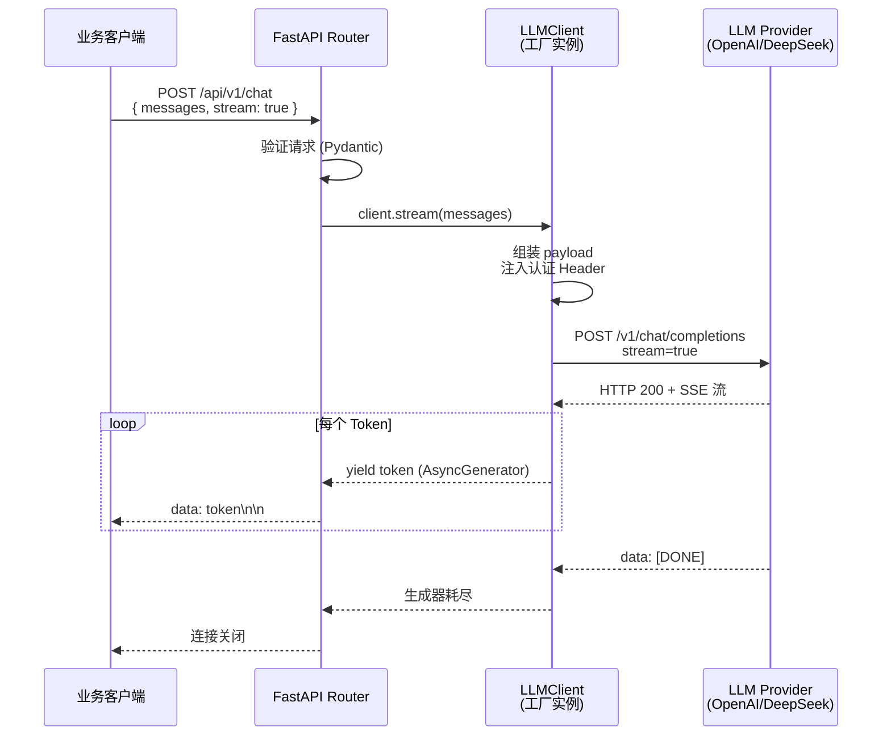
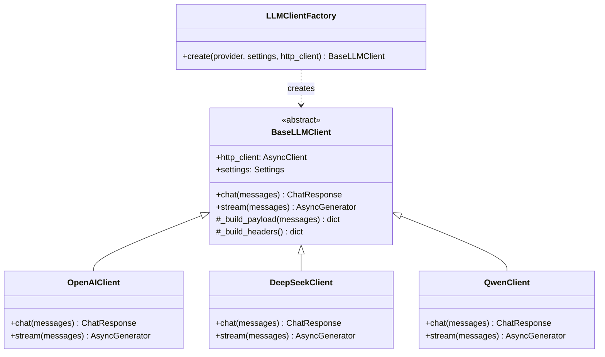
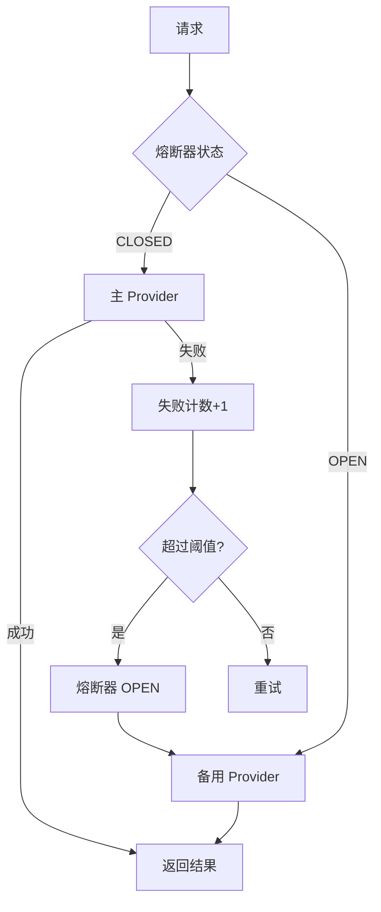

# L1 · LLM 统一客户端

> **模块定位**：这是整个 AI 服务栈的第一层——把 DeepSeek、OpenAI、通义千问等各种 LLM Provider 的差异抹平，对上层业务暴露一个统一的接口。切换模型只改 `.env` 配置，业务代码零修改。

## 一、为什么需要统一客户端？

### 没有它会发生什么

想象一下，产品初期只用了 OpenAI，代码到处是这样的调用：

```python
import openai

client = openai.OpenAI(api_key="sk-xxx")
resp = client.chat.completions.create(
    model="gpt-4o-mini",
    messages=[{"role": "user", "content": prompt}]
)
```

三个月后，公司决定接入 DeepSeek 降本。你打开 IDE，发现这段调用散落在 12 个文件的 47 个地方。DeepSeek 虽然兼容 OpenAI 协议，但 `base_url` 不同、默认模型不同、Token 计费逻辑不同……你改了两周，还漏了几处，线上偶尔还在调 OpenAI 烧美金。

半年后，老板说"再接入一个本地部署的通义千问"，通义千问的 API 格式还稍有不同……

**这就是没有统一客户端的噩梦**：

| 问题 | 后果 |
|------|------|
| Provider 接口不统一 | 每次切换都要改大量业务代码 |
| 连接管理散乱 | 每次请求都新建连接，延迟高、资源泄漏 |
| 重试逻辑重复 | 每个调用点都要手写 try/except/retry |
| 配置硬编码 | api_key 散落各处，安全风险 |
| 流式输出复杂 | 每处都要自己处理 SSE 协议 |

### 统一客户端的价值

```
一处封装 → 处处复用
配置驱动 → 零代码切换
连接池单例 → 性能提升 10x
统一重试 → 故障自愈
统一日志 → 可观测性
```

---

## 二、架构全貌

### 2.1 请求流转图



### 2.2 工厂模式结构图



**工厂模式的运行逻辑**：`LLMClientFactory.create()` 读取 `settings.provider`，返回对应的子类实例。上层代码只持有 `BaseLLMClient` 引用，完全不知道底层是哪个 Provider。改 `.env` 里的 `PROVIDER=deepseek`，重启服务，Done。

---

## 三、项目结构

```
L1_llm_client/
├── .env                    # 配置文件（不提交 Git）
├── app/
│   ├── main.py             # FastAPI 入口 + lifespan 生命周期
│   ├── core/
│   │   ├── config.py       # pydantic-settings 读取 .env
│   │   ├── logging.py      # structlog 结构化日志
│   │   └── llm_client.py   # 统一 LLM 客户端（工厂模式）
│   └── api/v1/
│       └── chat.py         # FastAPI 路由，流式 / 非流式
└── requirements.txt
```

`.env` 示例：

```ini
PROVIDER=deepseek
API_KEY=sk-your-deepseek-key
BASE_URL=https://api.deepseek.com/v1
MODEL=deepseek-chat
MAX_TOKENS=2048
TEMPERATURE=0.7
```

---

## 四、逐步构建思路（5 步走）

> 这一节像教程一样，带你从零开始，每一步都能跑起来。

### Step 1：先写死一个能跑的 OpenAI 请求

在动架构之前，先让最简单的版本跑通。这是"极简可运行原型"的思维——不要一上来就设计抽象，先把一个真实的端到端链路跑通，然后再重构。

```python
# 最简版本，验证 API 调通
import httpx
import asyncio
import json

async def call_openai(prompt: str):
    async with httpx.AsyncClient() as client:
        response = await client.post(
            "https://api.openai.com/v1/chat/completions",
            headers={
                "Authorization": "Bearer sk-your-key",
                "Content-Type": "application/json",
            },
            json={
                "model": "gpt-4o-mini",
                "messages": [{"role": "user", "content": prompt}],
                "max_tokens": 1024,
            },
            timeout=60.0,
        )
        data = response.json()
        return data["choices"][0]["message"]["content"]

# 测试
result = asyncio.run(call_openai("你好，介绍一下自己"))
print(result)
```

**这一步的目的**：确认网络、API Key、基础调用都没问题，不要在第一步就引入太多依赖。

---

### Step 2：抽象成 BaseClient + 工厂模式

Step 1 的代码直接放进项目就是定时炸弹。现在把 Provider 逻辑封装成类，用工厂模式隔离各 Provider 的差异。

```python
# app/core/llm_client.py

from abc import ABC, abstractmethod
from typing import AsyncGenerator
import httpx
import json


class BaseLLMClient(ABC):
    """所有 LLM Provider 的抽象基类"""

    def __init__(self, http_client: httpx.AsyncClient, api_key: str,
                 base_url: str, model: str, max_tokens: int, temperature: float):
        self.http_client = http_client
        self.api_key = api_key
        self.base_url = base_url
        self.model = model
        self.max_tokens = max_tokens
        self.temperature = temperature

    def _build_headers(self) -> dict:
        return {
            "Authorization": f"Bearer {self.api_key}",
            "Content-Type": "application/json",
        }

    def _build_payload(self, messages: list, stream: bool = False) -> dict:
        return {
            "model": self.model,
            "messages": messages,
            "max_tokens": self.max_tokens,
            "temperature": self.temperature,
            "stream": stream,
        }

    @abstractmethod
    async def chat(self, messages: list) -> str:
        """非流式调用"""
        ...

    @abstractmethod
    async def stream(self, messages: list) -> AsyncGenerator[str, None]:
        """流式调用，逐 Token yield"""
        ...


class OpenAICompatibleClient(BaseLLMClient):
    """OpenAI 及兼容协议（DeepSeek、通义千问等）的通用实现"""

    async def chat(self, messages: list) -> str:
        url = f"{self.base_url}/chat/completions"
        response = await self.http_client.post(
            url,
            headers=self._build_headers(),
            json=self._build_payload(messages, stream=False),
        )
        response.raise_for_status()
        data = response.json()
        return data["choices"][0]["message"]["content"]

    async def stream(self, messages: list) -> AsyncGenerator[str, None]:
        url = f"{self.base_url}/chat/completions"
        async with self.http_client.stream(
            "POST", url,
            headers=self._build_headers(),
            json=self._build_payload(messages, stream=True),
        ) as response:
            if response.status_code >= 400:
                await response.aread()  # 读取错误体
            response.raise_for_status()
            async for line in response.aiter_lines():
                if line.startswith("data: "):
                    data = line[6:]
                    if data == "[DONE]":
                        break
                    chunk = json.loads(data)
                    token = chunk["choices"][0]["delta"].get("content", "")
                    if token:
                        yield token


def create_llm_client(provider: str, http_client: httpx.AsyncClient, **kwargs) -> BaseLLMClient:
    """工厂函数：根据 provider 名称创建对应客户端"""
    providers = {
        "openai": OpenAICompatibleClient,
        "deepseek": OpenAICompatibleClient,  # DeepSeek 兼容 OpenAI 协议
        "qwen": OpenAICompatibleClient,      # 通义千问新版也兼容
        # 未来: "anthropic": AnthropicClient,  格式不同，需单独实现
    }
    client_class = providers.get(provider)
    if not client_class:
        raise ValueError(f"不支持的 Provider: {provider}，支持列表: {list(providers.keys())}")
    return client_class(http_client=http_client, **kwargs)
```

**关键设计决策**：DeepSeek 和 OpenAI 都使用 `OpenAICompatibleClient`，因为 DeepSeek 协议完全兼容 OpenAI。工厂函数负责"路由"，子类负责"实现"，两者解耦。

---

### Step 3：加连接池 + lifespan

Step 2 的问题：每次请求都可能创建新的 HTTP 连接，TCP 握手成本高。解决方案是在应用启动时创建一个连接池，所有请求共用。

**类比**：连接池就像停车场。没有停车场时，每辆车要停都得现找地方（TCP 握手）；有了停车场，车来了直接找空位（复用连接）。停车场有固定容量（`max_connections`），长时间不用的位子收回（`max_keepalive_connections`）。

```python
# app/main.py

from contextlib import asynccontextmanager
from fastapi import FastAPI
import httpx
from app.core.config import get_settings
from app.core.llm_client import create_llm_client
from app.api.v1.chat import router as chat_router

settings = get_settings()


@asynccontextmanager
async def lifespan(app: FastAPI):
    # ===== 启动阶段 =====
    # 创建共享 HTTP 连接池（整个应用生命周期只有一个）
    http_client = httpx.AsyncClient(
        timeout=httpx.Timeout(
            connect=10.0,   # TCP 连接超时：10秒
            read=120.0,     # 读取超时：120秒（流式输出需要更长时间）
            write=30.0,     # 写入超时：30秒
            pool=5.0,       # 等待连接池空位超时：5秒
        ),
        limits=httpx.Limits(
            max_connections=100,            # 最大并发连接数
            max_keepalive_connections=20,   # 最大保持活跃连接数
        ),
    )

    # 创建 LLM 客户端实例（注入共享连接池）
    llm_client = create_llm_client(
        provider=settings.provider,
        http_client=http_client,
        api_key=settings.api_key,
        base_url=settings.base_url,
        model=settings.model,
        max_tokens=settings.max_tokens,
        temperature=settings.temperature,
    )

    # 挂载到 app.state，路由层可以通过 request.app.state 访问
    app.state.http_client = http_client
    app.state.llm_client = llm_client

    yield  # ← 应用正常运行期间停在这里

    # ===== 关闭阶段 =====
    # 优雅关闭：等待所有进行中的请求完成，释放连接
    await http_client.aclose()


app = FastAPI(title="LLM 统一客户端", lifespan=lifespan)
app.include_router(chat_router, prefix="/api/v1")
```

**lifespan 的 yield 用法**：`lifespan` 是一个异步上下文管理器。`yield` 之前是"启动逻辑"，`yield` 之后是"关闭逻辑"。FastAPI 在应用启动时执行到 `yield` 暂停，应用关闭时从 `yield` 后面继续执行清理代码。这比旧的 `@app.on_event("startup")` 更清晰，因为启动和关闭逻辑在同一个函数里，上下文共享（比如 `http_client` 变量）。

---

### Step 4：加流式输出

流式输出是 LLM 应用的标配体验。用户不需要等模型生成完整响应再看到结果，而是像打字机一样逐字显示。

```python
# app/api/v1/chat.py

from fastapi import APIRouter, Request
from fastapi.responses import StreamingResponse
from pydantic import BaseModel

router = APIRouter()


class Message(BaseModel):
    role: str   # "system" | "user" | "assistant"
    content: str


class ChatRequest(BaseModel):
    messages: list[Message]
    stream: bool = False


@router.post("/chat")
async def chat(body: ChatRequest, request: Request):
    client = request.app.state.llm_client
    messages = [m.model_dump() for m in body.messages]

    if body.stream:
        # 流式模式：返回 StreamingResponse，媒体类型是 text/event-stream（SSE 协议）
        async def event_stream():
            async for token in client.stream(messages):
                # SSE 格式：每条消息以 "data: " 开头，以 "\n\n" 结尾
                yield f"data: {token}\n\n"
            yield "data: [DONE]\n\n"

        return StreamingResponse(event_stream(), media_type="text/event-stream")
    else:
        # 非流式模式：等待完整响应
        content = await client.chat(messages)
        return {"content": content}
```

**为什么用 `AsyncGenerator`**：流式输出是"边生产边消费"——LLM 每生成一个 Token，立刻传给前端，不需要等全部生成完。`AsyncGenerator` 用 `yield` 暂停生成、用 `async for` 消费，正好适合这种推流模式。

---

### Step 5：加配置管理 + 重试 + 日志

现在把配置管理、重试机制和结构化日志都补上，让代码达到生产级别。

**配置管理**（`app/core/config.py`）：

```python
from functools import lru_cache
from pydantic_settings import BaseSettings, SettingsConfigDict
from pydantic import Field


class Settings(BaseSettings):
    # 告诉 pydantic-settings：从 .env 文件读取配置
    model_config = SettingsConfigDict(
        env_file=".env",
        env_file_encoding="utf-8",
        case_sensitive=False,   # 环境变量名大小写不敏感
    )

    # provider / api_key / base_url 等
    provider: str = Field(default="openai", description="LLM Provider 名称")
    api_key: str = Field(..., description="API Key，必填，无默认值")
    base_url: str = Field(default="https://api.openai.com/v1")
    model: str = Field(default="gpt-4o-mini")
    max_tokens: int = Field(default=2048, ge=1, le=32768)
    temperature: float = Field(default=0.7, ge=0.0, le=2.0)


@lru_cache(maxsize=1)
def get_settings() -> Settings:
    """单例：只解析一次 .env，后续从缓存返回"""
    return Settings()
```

**重试机制**（在 `llm_client.py` 中增强）：

```python
from tenacity import (
    retry,
    stop_after_attempt,
    wait_exponential,
    retry_if_exception_type,
    before_sleep_log,
)
import logging

logger = logging.getLogger(__name__)


class OpenAICompatibleClient(BaseLLMClient):

    @retry(
        # 最多重试 3 次（加上首次共 4 次请求）
        stop=stop_after_attempt(3),
        # 指数退避：第1次等1s，第2次等2s，第3次等4s，最多等10s
        wait=wait_exponential(multiplier=1, min=1, max=10),
        # 只在 HTTP 错误时重试（5xx 服务端错误），4xx 客户端错误不重试
        retry=retry_if_exception_type(httpx.HTTPStatusError),
        # 每次重试前打日志
        before_sleep=before_sleep_log(logger, logging.WARNING),
    )
    async def _chat_with_retry(self, messages: list) -> str:
        url = f"{self.base_url}/chat/completions"
        response = await self.http_client.post(
            url,
            headers=self._build_headers(),
            json=self._build_payload(messages, stream=False),
        )
        response.raise_for_status()
        data = response.json()
        return data["choices"][0]["message"]["content"]

    async def chat(self, messages: list) -> str:
        return await self._chat_with_retry(messages)
```

**结构化日志**（`app/core/logging.py`）：

```python
import structlog
import logging


def setup_logging(log_level: str = "INFO"):
    """配置 structlog 结构化日志"""
    structlog.configure(
        processors=[
            structlog.contextvars.merge_contextvars,
            structlog.stdlib.add_log_level,
            structlog.stdlib.add_logger_name,
            structlog.processors.TimeStamper(fmt="iso"),
            structlog.dev.ConsoleRenderer(),  # 开发环境友好输出
            # 生产环境改为：structlog.processors.JSONRenderer()
        ],
        wrapper_class=structlog.make_filtering_bound_logger(
            logging.getLevelName(log_level)
        ),
        logger_factory=structlog.PrintLoggerFactory(),
    )


# 使用示例
log = structlog.get_logger()
log.info("llm_request", provider="deepseek", model="deepseek-chat", tokens=1024)
# 输出：{"event": "llm_request", "provider": "deepseek", "model": "deepseek-chat", "tokens": 1024, ...}
```

---

## 五、Python 语法深度解析

> 这一节专门为有 C# 后端基础但没做过 Python AI 的工程师准备。每个语法点都和 C# 对比解释。

### 5.1 `async/await` 协程机制

**C# 视角**：C# 的 `async/await` 和 Python 的 `async/await` 思想一致，但底层实现不同。

| 对比维度 | C# | Python |
|----------|-----|--------|
| 异步模型 | 多线程 + 异步 IO（可用多核） | 单线程事件循环（GIL 限制） |
| 适合场景 | CPU 密集 + IO 密集 | IO 密集（网络请求、文件读写） |
| 异步框架 | .NET Runtime | asyncio + uvicorn |

**Python 协程的关键理解**：

```python
# 这是一个"协程函数"，调用它不会立刻执行，而是返回一个协程对象
async def fetch_data():
    # await 让出 CPU 控制权，等待 IO 完成时再唤醒
    result = await some_io_operation()
    return result

# 必须在事件循环中运行协程
# asyncio.run() 创建事件循环，执行协程，结束时关闭循环
asyncio.run(fetch_data())
```

**形象理解**：想象一个咖啡师（事件循环）服务多位顾客。顾客 A 点了需要等待的拿铁（IO 操作），咖啡师不会傻站着等，而是去服务顾客 B（处理其他协程）。拿铁做好了（IO 完成），咖啡师再回来继续服务 A。

**为什么 FastAPI 用 `async def`**：FastAPI 底层基于 Starlette + uvicorn（ASGI 服务器），原生支持异步。用 `async def` 定义路由，可以同时处理数千个并发请求，而不需要为每个请求开一个线程。

```python
# 同步版本：每个请求占用一个线程，100 并发 = 100 个线程
@app.post("/chat")
def chat_sync(body: ChatRequest):
    result = requests.post(...)  # 阻塞，占用线程
    return result

# 异步版本：一个线程处理数千并发
@app.post("/chat")
async def chat_async(body: ChatRequest):
    result = await client.post(...)  # 等待时让出 CPU
    return result
```

---

### 5.2 `AsyncGenerator` + `yield`：流式输出的核心

**普通生成器（同步）**：

```python
def count_up():
    yield 1
    yield 2
    yield 3

for n in count_up():
    print(n)  # 逐个打印 1, 2, 3
```

**异步生成器**：

```python
async def token_stream():
    # 模拟从网络逐个接收 token
    for token in ["你", "好", "世", "界"]:
        await asyncio.sleep(0.1)  # 模拟网络等待
        yield token               # 产出一个 token

# 消费异步生成器，必须用 async for
async def consume():
    async for token in token_stream():
        print(token, end="", flush=True)
```

**流式输出为什么必须用它**：

LLM 的流式输出本质是 HTTP SSE（Server-Sent Events）。服务器持续发送 `data: token\n\n` 格式的数据，客户端逐条读取。

```python
async def stream(self, messages: list) -> AsyncGenerator[str, None]:
    async with self.http_client.stream("POST", url, json=payload) as response:
        # aiter_lines() 是异步迭代器，每读到一行就 yield
        async for line in response.aiter_lines():
            if line.startswith("data: "):
                data = line[6:]
                if data == "[DONE]":
                    break                         # 结束流
                chunk = json.loads(data)
                token = chunk["choices"][0]["delta"].get("content", "")
                if token:
                    yield token                   # 把 token 传给上层
```

**返回类型标注**：`AsyncGenerator[str, None]` 表示这个异步生成器产出 `str` 类型，没有 `send()` 值（`None`）。

**C# 类比**：类似于 C# 的 `IAsyncEnumerable<string>`，用 `await foreach` 消费：

```csharp
// C# 版本
async IAsyncEnumerable<string> StreamTokens() {
    await foreach (var line in response.Content.ReadAsAsyncEnumerable()) {
        yield return ParseToken(line);
    }
}

await foreach (var token in StreamTokens()) {
    Console.Write(token);
}
```

---

### 5.3 `httpx.AsyncClient`：为什么不用 `requests`？

**`requests` 的问题**：

```python
# requests 是同步库！
import requests
response = requests.post(url, json=payload)  # 这行会阻塞整个线程！
```

在 FastAPI 的异步环境里用 `requests`，就像在协程里睡觉——整个事件循环都被阻塞了，所有并发请求都得等。

**`httpx` 的优势**：

```python
import httpx

# 异步客户端：不阻塞事件循环
async with httpx.AsyncClient() as client:
    response = await client.post(url, json=payload)
```

**连接池工作原理**：

```
TCP 连接建立过程（没有连接池）：
  1. DNS 查询           ~10ms
  2. TCP 三次握手       ~20ms (RTT)
  3. TLS 握手           ~40ms (TLS 1.3)
  4. 发送请求           ~1ms
  总计：每次请求多花 ~70ms

有连接池：
  1. 从池里取出已建立的连接  ~0.1ms
  2. 发送请求               ~1ms
  总计：节省 70ms，性能提升显著
```

**连接池参数详解**：

```python
httpx.Limits(
    max_connections=100,           # 最多同时建立 100 个 TCP 连接
    max_keepalive_connections=20,  # 空闲时保持 20 个连接备用（其余关闭）
    keepalive_expiry=30,           # 空闲连接 30 秒后自动关闭
)

httpx.Timeout(
    connect=10.0,   # 建立 TCP 连接最多等 10 秒
    read=120.0,     # 等待响应数据最多 120 秒（流式输出很重要！）
    write=30.0,     # 发送请求数据最多 30 秒
    pool=5.0,       # 等待连接池空位最多 5 秒（满了就报错，避免雪崩）
)
```

---

### 5.4 `pydantic-settings`：配置自动注入的原理

**C# 中的配置**：用 `IConfiguration` + `appsettings.json` + `IOptions<T>` 注入配置。

**Python 的对应写法**：

```python
from pydantic_settings import BaseSettings, SettingsConfigDict
from pydantic import Field

class Settings(BaseSettings):
    model_config = SettingsConfigDict(
        env_file=".env",          # 从 .env 文件读取
        env_file_encoding="utf-8",
        case_sensitive=False,     # API_KEY 和 api_key 等价
    )

    # Field(...) 中的 ... 表示必填项，没有默认值
    api_key: str = Field(..., description="API Key")

    # ge/le 是 Pydantic 的验证器
    max_tokens: int = Field(default=2048, ge=1, le=32768)
    temperature: float = Field(default=0.7, ge=0.0, le=2.0)
```

**自动注入的优先级**（高 → 低）：

```
1. 操作系统环境变量（export API_KEY=xxx）
2. .env 文件
3. Field 的 default 值
```

**工作原理**：`pydantic-settings` 在 `Settings()` 实例化时：

1. 读取 `.env` 文件，解析为字典
2. 合并操作系统环境变量（优先级更高）
3. 用 Pydantic 类型系统做类型转换和验证（`"2048"` → `int(2048)`）
4. 如果验证失败（如 temperature=3.0 超出范围），启动时立刻报错

这意味着如果配置有误，应用根本起不来，而不是在运行时才出错。

---

### 5.5 `@asynccontextmanager` + `lifespan`

**C# 类比**：相当于 `IHostedService` 的 `StartAsync` + `StopAsync`，但更简洁。

```csharp
// C# 版本
public class HttpClientService : IHostedService {
    public Task StartAsync(CancellationToken ct) {
        // 启动逻辑
        _client = new HttpClient();
        return Task.CompletedTask;
    }
    public Task StopAsync(CancellationToken ct) {
        // 关闭逻辑
        _client.Dispose();
        return Task.CompletedTask;
    }
}
```

```python
# Python 版本：同一函数，用 yield 分割启动和关闭
@asynccontextmanager
async def lifespan(app: FastAPI):
    # --- 启动逻辑 ---
    client = httpx.AsyncClient(...)
    app.state.llm_client = create_llm_client(...)

    yield  # ← 应用运行期间暂停在这里

    # --- 关闭逻辑 ---
    await client.aclose()  # 优雅关闭，等待所有 in-flight 请求完成
```

**`@asynccontextmanager` 的原理**：这个装饰器把一个异步生成器函数变成异步上下文管理器（实现了 `__aenter__` 和 `__aexit__`）。`yield` 之前的代码在 `__aenter__` 时执行，`yield` 之后的代码在 `__aexit__` 时执行。

---

### 5.6 `tenacity` 重试：指数退避的原理

**为什么要重试**：LLM Provider API 并不 100% 可靠。网络抖动、Provider 偶发 503、Rate Limit 都会导致请求失败。简单重试能自愈 80% 的瞬时故障。

**指数退避**：

```
第 1 次失败 → 等 1 秒 → 第 2 次请求
第 2 次失败 → 等 2 秒 → 第 3 次请求
第 3 次失败 → 等 4 秒 → 第 4 次请求（最后一次）
第 4 次失败 → 抛出异常，放弃
```

等待时间按 2 的幂次增长，避免在 Provider 故障时大量请求同时涌入（叫"惊群效应"），给 Provider 一定的恢复时间。

```python
from tenacity import (
    retry,
    stop_after_attempt,
    wait_exponential,
    retry_if_exception_type,
)

@retry(
    stop=stop_after_attempt(3),        # 最多尝试 3 次（不包含首次）
    wait=wait_exponential(
        multiplier=1,   # 基础乘数
        min=1,          # 最短等待 1 秒
        max=10,         # 最长等待 10 秒（指数增长有上限）
    ),
    retry=retry_if_exception_type(httpx.HTTPStatusError),
    # 注意：只重试 5xx（服务端错误），不重试 4xx（客户端错误）
    # 4xx 说明是请求本身的问题，重试也没用
)
async def _call_with_retry(self, messages): ...
```

**C# 类比**：类似 Polly 库的 `Policy.Handle<HttpRequestException>().WaitAndRetryAsync(...)`。

---

## 六、生产级要点（有坑必讲）

### 6.1 连接池大小怎么根据 QPS 计算

**公式**：

```
所需连接数 = QPS × 平均响应时间(秒)
```

例如：
- QPS = 50 请求/秒
- 平均响应时间 = 3 秒（含 LLM 生成时间）
- 所需连接数 = 50 × 3 = 150

但要留 20% 余量，所以 `max_connections=180`。

**流式输出的特殊性**：流式响应时，一个连接被占用的时间 = 整个生成时间（可能 10-30 秒），不是普通 HTTP 的"收到响应就释放"。要用"最长流式时间"来计算：

```
流式场景：max_connections = QPS × 最长生成时间 × 余量系数
         = 50 × 15 × 1.2
         = 900  ← 这通常是不现实的
```

实践中，流式场景通常需要：
1. 控制并发（消息队列 + 限流）
2. 分批处理，而不是无限增大连接池

### 6.2 流式输出的 per-token 超时问题

标准的 `read` 超时是"从请求开始到最后一个字节到达"的总时间。流式输出可能持续 1-2 分钟，但**并不代表连接断掉了**——只是在慢慢产出 Token。

```python
# 错误配置：read=30.0 会在 30 秒后超时，切断流式响应
httpx.Timeout(read=30.0)

# 正确配置：流式场景要给足够的读取时间
httpx.Timeout(connect=10.0, read=120.0, write=30.0, pool=5.0)
```

**另一个坑**：区分"连接超时"和"空闲超时"。如果 LLM 在生成中间突然停止发送 Token（卡住了），你希望多久后超时？可以用 `httpx` 的 `timeout` + 心跳检测：

```python
# 检测流式输出中间卡住的情况
import asyncio

async def stream_with_timeout(generator, per_token_timeout=30.0):
    """每个 token 必须在 per_token_timeout 内到达，否则超时"""
    async for token in generator:
        yield token
```

### 6.3 多 Provider 共用一个连接池的注意事项

当你同时调用 OpenAI 和 DeepSeek（如做 A/B 测试），两个 Provider 共用同一个 `AsyncClient` 的连接池。这时要注意：

```python
# 问题：OpenAI 请求占满连接池，DeepSeek 请求等待
# max_connections=100，OpenAI 用了 90 个，DeepSeek 只能用 10 个

# 解决方案 1：为每个 Provider 创建独立的 AsyncClient
clients = {
    "openai": httpx.AsyncClient(limits=httpx.Limits(max_connections=60)),
    "deepseek": httpx.AsyncClient(limits=httpx.Limits(max_connections=60)),
}

# 解决方案 2：使用单一连接池但配置足够大，靠超时和限流控制
```

### 6.4 `[DONE]` 边界处理

OpenAI 协议规定流式结束标志是 `data: [DONE]`，但实际使用中有几个边界情况：

```python
async for line in response.aiter_lines():
    if not line:          # 空行是 SSE 分隔符，跳过
        continue
    if not line.startswith("data: "):  # 可能有 comment 行，跳过
        continue

    data = line[6:]

    if data == "[DONE]":  # 正常结束
        break

    # 防御：有些 Provider 在 [DONE] 后还会发空 data，加 try/except
    try:
        chunk = json.loads(data)
    except json.JSONDecodeError:
        continue          # 跳过无法解析的行，不中断流

    token = chunk["choices"][0]["delta"].get("content", "")
    if token:             # content 可能是空字符串（role=assistant 的首条消息）
        yield token
```

**另一个坑**：HTTP 5xx 错误时，`response.aiter_lines()` 返回的是错误 HTML，不是 SSE。必须先检查状态码：

```python
async with self.http_client.stream("POST", url, ...) as response:
    if response.status_code >= 400:
        # 先读完响应体（否则连接不会被正确关闭）
        await response.aread()
    response.raise_for_status()  # 现在再抛异常
```

---

## 七、扩展思路

### 7.1 Token 计费统计

```python
class TokenUsageMiddleware:
    """在 LLM 响应后记录 Token 使用量"""

    async def stream_with_count(self, generator) -> AsyncGenerator[str, None]:
        total_tokens = 0
        async for token in generator:
            total_tokens += len(token.split())  # 粗略估算，精确需用 tiktoken
            yield token

        # 流结束后写入计费系统
        await self.billing_service.record(
            provider=self.provider,
            model=self.model,
            tokens=total_tokens,
            timestamp=datetime.utcnow(),
        )
```

精确 Token 计数需要用 `tiktoken`（OpenAI 官方 tokenizer）：

```python
import tiktoken

encoder = tiktoken.encoding_for_model("gpt-4o-mini")
token_count = len(encoder.encode(text))
```

### 7.2 熔断器（Circuit Breaker）

当 Provider API 持续故障时，不应该继续发送请求（徒增超时等待）。熔断器模式：

```
状态机：CLOSED → OPEN → HALF_OPEN → CLOSED

CLOSED（正常）：请求正常通过
OPEN（熔断）：失败次数超过阈值，直接拒绝请求（快速失败），等待恢复时间
HALF_OPEN（试探）：恢复时间过后，允许少量请求测试 Provider 是否恢复
```

推荐使用 `pybreaker` 库：

```python
import pybreaker

breaker = pybreaker.CircuitBreaker(
    fail_max=5,           # 连续 5 次失败则熔断
    reset_timeout=30,     # 30 秒后进入 HALF_OPEN
)

@breaker
async def call_provider(self, messages):
    return await self._chat_with_retry(messages)
```

### 7.3 支持 Anthropic Claude API

Anthropic Claude 的 API 格式与 OpenAI 不兼容，需要单独实现：

```python
class AnthropicClient(BaseLLMClient):
    """Anthropic Claude API 客户端（格式与 OpenAI 不同）"""

    def _build_payload(self, messages: list, stream: bool = False) -> dict:
        # Anthropic 格式：system 消息单独传，不在 messages 里
        system = next((m["content"] for m in messages if m["role"] == "system"), "")
        user_messages = [m for m in messages if m["role"] != "system"]

        return {
            "model": self.model,
            "max_tokens": self.max_tokens,
            "system": system,
            "messages": user_messages,
            "stream": stream,
        }

    def _build_headers(self) -> dict:
        return {
            "x-api-key": self.api_key,         # ← 不是 Authorization Bearer
            "anthropic-version": "2023-06-01",  # ← Anthropic 特有
            "Content-Type": "application/json",
        }

    async def stream(self, messages: list) -> AsyncGenerator[str, None]:
        url = f"{self.base_url}/messages"  # ← 端点也不同
        async with self.http_client.stream("POST", url, ...) as response:
            async for line in response.aiter_lines():
                if line.startswith("data: "):
                    data = json.loads(line[6:])
                    # Anthropic SSE 事件格式也不同
                    if data.get("type") == "content_block_delta":
                        token = data["delta"].get("text", "")
                        if token:
                            yield token
                    elif data.get("type") == "message_stop":
                        break

# 注册到工厂
providers = {
    ...,
    "anthropic": AnthropicClient,
}
```

### 7.4 Provider 自动降级

当主 Provider 不可用时，自动切换到备用 Provider：

```python
class FallbackLLMClient(BaseLLMClient):
    """支持自动降级的 LLM 客户端"""

    def __init__(self, primary: BaseLLMClient, fallback: BaseLLMClient):
        self.primary = primary
        self.fallback = fallback

    async def chat(self, messages: list) -> str:
        try:
            return await self.primary.chat(messages)
        except (httpx.HTTPStatusError, httpx.TimeoutException) as e:
            log.warning(
                "primary_provider_failed",
                error=str(e),
                falling_back_to=self.fallback.__class__.__name__,
            )
            return await self.fallback.chat(messages)

# 使用
client = FallbackLLMClient(
    primary=create_llm_client("openai", ...),
    fallback=create_llm_client("deepseek", ...),
)
```

**更完整的降级策略**：结合熔断器，在主 Provider 熔断时直接走备用 Provider，避免每次都等超时：



---

## 八、快速上手

### 安装依赖

```bash
pip install fastapi uvicorn httpx pydantic-settings tenacity structlog
```

### 配置 `.env`

```ini
PROVIDER=deepseek
API_KEY=sk-your-key
BASE_URL=https://api.deepseek.com/v1
MODEL=deepseek-chat
MAX_TOKENS=2048
TEMPERATURE=0.7
```

### 启动服务

```bash
uvicorn app.main:app --reload --port 8000
```

### 测试非流式调用

```bash
curl -X POST http://localhost:8000/api/v1/chat \
  -H "Content-Type: application/json" \
  -d '{
    "messages": [{"role": "user", "content": "你好，用一句话介绍你自己"}],
    "stream": false
  }'
```

### 测试流式调用

```bash
curl -X POST http://localhost:8000/api/v1/chat \
  -H "Content-Type: application/json" \
  -d '{
    "messages": [{"role": "user", "content": "请写一首关于秋天的短诗"}],
    "stream": true
  }' \
  --no-buffer
```

### 切换到 OpenAI（只改 .env）

```ini
PROVIDER=openai
API_KEY=sk-your-openai-key
BASE_URL=https://api.openai.com/v1
MODEL=gpt-4o-mini
```

重启服务，业务代码零改动。这就是统一客户端的价值所在。

---

## 九、总结

| 技术选型 | 为什么选它 |
|----------|-----------|
| `FastAPI` | 原生 async、自动 OpenAPI 文档、Pydantic 验证 |
| `httpx.AsyncClient` | 异步 HTTP 客户端、内置连接池、支持流式响应 |
| `pydantic-settings` | 类型安全的配置管理、.env 自动注入、启动时验证 |
| `tenacity` | 声明式重试、指数退避、条件重试 |
| `structlog` | 结构化日志、JSON 格式、便于日志聚合 |
| 工厂模式 | Provider 扩展开放、业务代码封闭修改 |

**核心设计原则**：

1. **依赖倒置**：业务代码依赖 `BaseLLMClient` 抽象，不依赖具体 Provider
2. **单例连接池**：一个 `AsyncClient` 供全应用复用，避免重复握手
3. **配置驱动**：所有变化封装在 `.env`，代码本身是稳定的
4. **防御性编程**：重试、熔断、错误边界处理，让服务在 Provider 不稳定时仍能优雅降级
