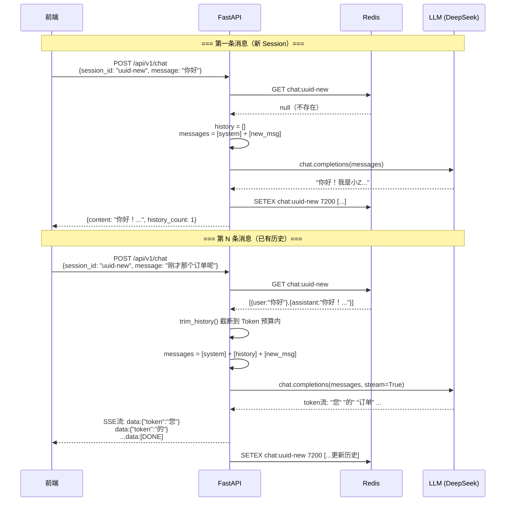

# L2 · Prompt 工程与多轮对话系统

> **场景背景**：Zuru 客服机器人需要记住对话上下文——用户说"刚才那个订单有问题"，机器人要知道"那个订单"是什么；用户说"帮我取消"，机器人要知道取消的是什么。本文从工程角度拆解：无状态的 LLM 如何实现"有记忆"，以及 Prompt 工程如何让机器人既聪明又"守规矩"。

## 1. 模块定位与核心痛点

### 1.1 LLM 本质上是无状态的

这是理解多轮对话工程的关键起点。每次调用 LLM API，模型**不记得上一次对话说了什么**。它只看到你这次传入的 `messages` 数组，仅此而已。

```
第1轮：你发送 "我叫张三"  → 模型回复 "你好，张三！"
第2轮：你发送 "我叫什么名字？"
       → 模型（没有上下文）："我不知道你叫什么名字"  ❌
       → 模型（有上下文）："你叫张三！"              ✓
```

**"有记忆"的秘密**：工程侧每次调用时，把历史对话一起打包发给模型。模型并不是真的记住了，而是你每次都帮它"复习"了一遍。

```
第2轮实际发给模型的是：
messages = [
    {"role": "user",      "content": "我叫张三"},
    {"role": "assistant", "content": "你好，张三！"},
    {"role": "user",      "content": "我叫什么名字？"},  # 新消息
]
```

### 1.2 Session 管理的工程挑战

| 挑战 | 具体问题 | 解决方案 |
|------|----------|----------|
| **状态存储** | 历史消息存哪里？内存重启丢失 | Redis 持久化，TTL 自动过期 |
| **Token 上限** | 历史越来越长，超出上下文窗口 | Token 预算截断算法 |
| **并发隔离** | 多个用户同时聊天，历史不能串 | session_id 作为 Key 隔离 |
| **流式存历史** | 流式输出边输出边拼接，何时保存？ | 流结束后在 generator 里保存 |
| **TTL 设计** | 超时多久合适？过短用户在聊却断了 | 2小时，每次消息后重置 |

### 1.3 整体模块架构

```
┌─────────────────────────────────────────────────────┐
│                   FastAPI 服务                       │
│                                                     │
│  POST /api/v1/chat                                  │
│       │                                             │
│       ├─ 1. 从 Redis 取历史（chat:{session_id}）    │
│       ├─ 2. Token 预算截断（保留最近 N 轮）         │
│       ├─ 3. 拼装 messages（system + history + new） │
│       ├─ 4. 调 LLM API（流式 or 非流式）           │
│       └─ 5. 保存完整历史回 Redis（重置 TTL）        │
│                                                     │
└─────────────────────────────────────────────────────┘
         │                        │
    Redis（历史）           LLM（DeepSeek）
```

---

## 2. Prompt 工程核心技法

> 这是本文的重点章节。Prompt 写得好不好，直接决定机器人能不能用。下面用真实的客服对话示例来对比有/无技巧的效果差距。

### 2.1 Zero-Shot vs Few-Shot：什么时候用哪个？

#### Zero-Shot（零样本）

直接告诉模型做什么，不给例子。适合**任务描述清晰、模型已有相关训练**的场景。

```python
# Zero-Shot：直接描述任务
prompt = """
你是 Zuru 智能客服助手。
用户询问了一个问题，请判断意图类别：
- order_query：订单查询
- return_request：退换货申请
- complaint：投诉
- other：其他

用户输入："{user_message}"

请直接返回意图类别，不要解释。
"""
```

**效果**：对于"我的快递到哪了？"这类标准表述，Zero-Shot 完全够用，准确率 95%+。

#### Few-Shot（少样本）

给几个示例，让模型学习你想要的"风格"。适合：
- 任务有特定格式要求，描述不如举例直接
- 模型容易理解错的边界情况
- 需要控制输出风格（语气、长度、结构）

```python
# Few-Shot：给示例教会模型
prompt = """
你是 Zuru 智能客服助手，帮用户判断意图。

示例：
用户：我的快递还没到 → 意图：order_query
用户：这个质量太差了，我要投诉 → 意图：complaint
用户：我想退货，但已经拆封了，能退吗？ → 意图：return_request
用户：你们有没有白色款？ → 意图：other

现在判断：
用户："{user_message}" → 意图：
"""
```

**Few-Shot 解决的真实问题**：

```
用户说："这产品烂透了，要求退款"

Zero-Shot 模型：可能返回 complaint（因为"烂透了"像投诉）
Few-Shot 模型：返回 return_request（有"退款"才是关键意图）

加一个示例就能搞定：
用户：这破东西质量差，我要退款 → 意图：return_request
```

#### 选择指南

```
任务清晰 + 格式简单 → Zero-Shot（省 Token）
边界情况多 + 格式复杂 → Few-Shot（3-5个示例足够）
需要特定语气/风格 → Few-Shot（用例子展示风格）
训练数据够 → 微调（超出 Prompt 工程范畴）
```

---

### 2.2 Chain-of-Thought（CoT）：让模型先想后说

CoT 的核心思想：**复杂问题不要让模型直接给答案，先让它推理**。就像你考试时要求写解题过程——过程写对了，答案也不会跑偏。

#### 无 CoT vs 有 CoT 的效果对比

**场景**：用户投诉订单少发了一件商品，机器人要判断是否需要补发还是退款。

```
用户：我买了三件T恤，收到只有两件，而且都是L码的，但我订的是一件M一件L一件XL
```

**无 CoT 的回复（直接给答案）**：

```
Prompt：
"根据用户描述，给出处理方案"

模型回复：
"您好！对于您反映的少件问题，我们将为您补发缺失的商品。
请确认您的收货地址是否正确，我们会尽快安排发货。"

❌ 问题：
- 没搞清楚到底缺了什么（缺的是 M 码还是 XL 码？或者 L 码多发了一件？）
- 直接说补发，但可能应该先核实仓库记录
```

**有 CoT 的回复（先推理再答）**：

```
Prompt：
"请先分析用户的问题情况，然后给出处理方案。

分析步骤：
1. 用户购买了什么？
2. 实际收到了什么？
3. 差异是什么？
4. 最可能的原因是什么？
5. 最佳处理方案是什么？"

模型推理过程：
"分析：
1. 购买：M码×1 + L码×1 + XL码×1，共3件
2. 收到：L码×2，共2件
3. 差异：缺少M码1件和XL码1件，多了L码1件（或者仅缺少M码和XL码）
4. 最可能原因：拣货时把M码和XL码都拣成了L码
5. 处理方案：
   - 需要补发 M码×1 和 XL码×1
   - 多收到的 L码 可以选择退回或留用（协商）

回复用户：
您好！根据您的描述，您订购了M、L、XL各一件，但收到的是两件L码，
缺少了M码和XL码各一件。我来帮您处理：
1. 将为您补发 M码 和 XL码 各一件
2. 多收到的 L码，您可以选择退回（我们承担运费）或者以优惠价留用
请问您希望如何处理多收到的那件L码？"

✓ 推理清晰，方案准确，还发现了额外的处理细节
```

#### CoT 的写法技巧

**方式一：零样本 CoT（最省力）**

```python
# 在 Prompt 末尾加一句话
"请一步步思考，然后给出最终答案。"
# 或
"Let's think step by step."
# 或（中文客服场景）
"请先分析用户的实际问题，再给出解决方案。"
```

**方式二：结构化推理模板**

```python
system_prompt = """
你是 Zuru 客服机器人。处理复杂问题时，请按以下格式输出：

<thinking>
[在这里分析问题：用户诉求是什么？历史背景是什么？
最佳方案是什么？有没有需要确认的信息？]
</thinking>

<response>
[这里才是回复给用户的内容，语气友好，方案清晰]
</response>
"""
```

::: tip 何时使用 CoT？
- **需要 CoT**：复杂投诉处理、多条件判断（退货政策核查）、需要计算的问题（退款金额）
- **不需要 CoT**：简单问候、FAQ 查询、意图分类（反而拖慢响应）
:::

---

### 2.3 System Prompt 设计：定义机器人的"人格"

System Prompt 是整个对话的基础设定，它决定了：
- **机器人是谁**（人格、名字、角色）
- **能做什么**（能力范围）
- **不能做什么**（能力边界）
- **怎么说话**（语气、风格、长度）

#### 一个完整的客服 System Prompt 模板

```
你是 Zuru 官方智能客服助手"小Z"。Zuru 是一家专注于家居生活用品的电商品牌。

## 你的人格设定
- 称呼：可以叫你"小Z"或"客服小Z"
- 语气：专业但亲切，像一个有耐心的老朋友，不是冷冰冰的机器
- 说话方式：简洁清晰，不废话，但遇到复杂问题会主动多解释
- 态度：永远站在用户立场，哪怕用户情绪激动也保持冷静

## 你能做的事
1. 查询订单状态（需要用户提供订单号或绑定手机号）
2. 解释退换货政策（7天无理由退换，15天质量问题包换）
3. 受理退换货申请（生成工单，推送给人工处理）
4. 解答产品使用问题（基于产品手册知识库）
5. 处理常见投诉（记录并升级给人工）

## 你不能做的事（边界很重要）
- 不能承诺任何超出标准政策的补偿（如"给你多退20%"）
- 不能告诉用户内部系统信息、员工信息
- 不能处理涉及法律纠纷的问题（直接转人工）
- 不能假装是人类（如果用户直接问"你是AI吗"，如实回答）
- 不能处理其他品牌的产品问题

## 回答格式规范
- 首句先确认用户的问题/感受（避免让用户感觉没被理解）
- 中间给出解决方案，步骤用数字列表
- 末尾询问"还有其他问题吗？"或给出下一步指引
- 单次回复不超过 200 字（除非用户明确需要详细说明）

## 特殊场景处理
- 用户情绪激动/使用攻击性语言：先共情，不争辩，主动提出转人工
- 用户问到不确定的信息：明确说"这个我需要帮您确认一下"，不猜测
- 用户提到要"投诉"：认真对待，立刻记录诉求，给出工单号

## 当前日期
{current_date}（用于计算售后期限等）
```

#### System Prompt 设计的关键原则

**1. 能力边界要明确，而不是含糊**

```
❌ 含糊："尽力帮助用户解决问题"
✓ 明确："只处理 Zuru 品牌产品的售后问题，其他品牌问题直接说无法处理"
```

**2. 风格要可测试，而不是主观描述**

```
❌ 主观："回答要友好"
✓ 可测试："每次回答先用一句话确认用户的情感，例如'我理解这让您很困扰'"
```

**3. 边界情况要预设处理方式**

```
✓ 提前定义："如果用户问的问题超出我的能力范围，
  回复格式：'这个问题我需要转给专业的人工客服来处理，
  预计等待时间 X 分钟，是否继续？'"
```

---

### 2.4 结构化输出：让后端直接解析意图

**痛点**：LLM 输出是自然语言，后端要从中提取结构化信息（如：意图是什么、订单号是多少）。

**没有结构化输出时（噩梦写法）**：

```python
# 模型输出："用户想要查询订单号为202312001的快递状态"
# 后端不得不用正则...
import re
pattern = r'订单号[为是：:]\s*(\d+)'
order_no = re.search(pattern, response).group(1)
# 如果模型说"单号是：202312001"呢？正则又得改...
```

**结构化输出（工程正确做法）**：

```python
# Prompt 里强制要求 JSON 格式
system_prompt = """
你是意图识别助手。分析用户消息，输出 JSON，格式如下：
{
  "intent": "order_query|return_request|complaint|other",
  "entities": {
    "order_no": "订单号，如果没提到则为 null",
    "product_name": "产品名，如果没提到则为 null",
    "issue_type": "问题类型描述，如果没有则为 null"
  },
  "sentiment": "positive|neutral|negative",
  "needs_human": true 或 false,
  "reply": "对用户的回复内容"
}
只输出 JSON，不要其他文字。
"""

# 调用时设置 temperature=0
response = await client.chat.completions.create(
    model="deepseek-chat",
    messages=messages,
    temperature=0,              # 关键：结构化输出必须设为 0
    response_format={"type": "json_object"},  # OpenAI/DeepSeek 支持
)

# 后端直接解析，不用正则
import json
result = json.loads(response.choices[0].message.content)
intent = result["intent"]       # "order_query"
order_no = result["entities"]["order_no"]  # "202312001" 或 None
needs_human = result["needs_human"]        # True/False
```

**为什么 temperature=0 是标配？**

| temperature | 效果 | 适用场景 |
|-------------|------|----------|
| 0.0 | 确定性输出，几乎每次一样 | 结构化输出、代码生成、分类 |
| 0.3-0.7 | 平衡创意与准确性 | 对话回复、内容生成 |
| 0.8-1.0 | 高度随机，创意十足 | 故事创作、头脑风暴 |

> 结构化输出用 `temperature=1` 的后果：有时输出 `{"intent": "order_query"}`，有时输出带解释文字的 JSON，后端直接 500。

#### Few-Shot 加强结构化稳定性

即使有 `response_format`，也建议在 Prompt 里加 Few-Shot 示例，大幅减少格式错误：

```python
system_prompt = """
...（上面的格式要求）...

示例1：
用户："我的快递到哪了，单号202312001"
输出：{"intent": "order_query", "entities": {"order_no": "202312001", ...}, ...}

示例2：
用户："这破东西质量太差了我要退款！"
输出：{"intent": "return_request", "entities": {...}, "sentiment": "negative", "needs_human": true, ...}
"""
```

---

### 2.5 Prompt 模板管理：为什么不能硬编码

**不能硬编码的理由**：

```python
# ❌ 硬编码在代码里（灾难）
async def get_intent(message: str):
    system = "你是意图识别助手，输出 JSON..."  # 改一次要走 CI/CD 部署
    ...
```

**问题清单**：
- 修改 Prompt 要改代码，走完整的 Code Review + 部署流程（一个措辞调整要等 1 小时）
- 无法做 A/B 测试（同时跑两个版本的 Prompt 对比效果）
- 多语言支持困难（Prompt 和代码混在一起）
- 非开发人员（产品、运营）无法参与 Prompt 调优

**YAML 管理的正确姿势**：

```yaml
# prompts/customer_service.yaml

intent_detection:
  version: "v2.1"
  description: "客服意图识别，支持订单、退货、投诉"
  system: |
    你是 Zuru 客服意图识别助手。
    分析用户消息，输出以下 JSON 格式：
    {
      "intent": "order_query|return_request|complaint|other",
      "entities": { ... },
      "sentiment": "positive|neutral|negative",
      "needs_human": true 或 false,
      "reply": "对用户的回复"
    }
    只输出 JSON，不要其他文字。
  examples:
    - user: "我的快递到哪了"
      output: '{"intent": "order_query", ...}'
    - user: "我要退货"  
      output: '{"intent": "return_request", ...}'
  temperature: 0
  max_tokens: 500

main_chat:
  version: "v1.3"
  description: "主对话系统提示词"
  system: |
    你是 Zuru 官方智能客服助手"小Z"。
    ...（完整 system prompt）...
  temperature: 0.7
  max_tokens: 1000
```

```python
# prompt_manager.py
import yaml
from pathlib import Path

class PromptManager:
    def __init__(self, prompts_dir: str = "prompts"):
        self._cache = {}
        self._dir = Path(prompts_dir)
    
    def get(self, name: str, version: str = None) -> dict:
        """获取 Prompt 配置，支持按版本获取"""
        if name not in self._cache:
            path = self._dir / f"{name}.yaml"
            with open(path, encoding="utf-8") as f:
                self._cache[name] = yaml.safe_load(f)
        return self._cache[name]
    
    def reload(self, name: str):
        """热重载（改 Prompt 不用重启服务）"""
        self._cache.pop(name, None)

prompt_mgr = PromptManager()

# 使用
config = prompt_mgr.get("customer_service")
system_prompt = config["main_chat"]["system"]
temperature = config["main_chat"]["temperature"]
```

**YAML 管理的额外好处**：
- 产品经理可以直接在 Git 里提 PR 改 Prompt，无需改代码
- 版本字段方便回溯（哪个 Prompt 版本效果最好）
- 同一份 Prompt 在不同环境可以有不同参数（测试环境 temperature 高一点方便测边界）

---

## 3. 多轮对话架构设计

### 3.1 完整流程序列图



### 3.2 消息构建逻辑

```python
def build_messages(
    system_prompt: str,
    history: list[dict],
    new_message: str,
) -> list[dict]:
    """
    构建发给 LLM 的完整消息列表
    
    结构：[system] + [trimmed_history] + [new_user_message]
    """
    messages = [
        {"role": "system", "content": system_prompt}
    ]
    # 历史消息（已经过 Token 预算截断）
    messages.extend(history)
    # 本轮用户新消息
    messages.append({"role": "user", "content": new_message})
    return messages
```

---

## 4. 核心代码：逐步构建

### Step 1：单轮对话接口（无状态）

最简版本，先跑通核心链路：

```python
# main.py - 第一步：最简单的无状态接口
from fastapi import FastAPI
from pydantic import BaseModel
from openai import AsyncOpenAI

app = FastAPI()
client = AsyncOpenAI(
    api_key="your-key",
    base_url="https://api.deepseek.com",  # DeepSeek 兼容 OpenAI 接口
)

SYSTEM_PROMPT = """你是 Zuru 客服助手小Z，专业、亲切、简洁。"""

class ChatRequest(BaseModel):
    message: str

@app.post("/api/v1/chat")
async def chat(request: ChatRequest):
    messages = [
        {"role": "system", "content": SYSTEM_PROMPT},
        {"role": "user", "content": request.message},
    ]
    response = await client.chat.completions.create(
        model="deepseek-chat",
        messages=messages,
        temperature=0.7,
    )
    return {"content": response.choices[0].message.content}

# 这一步能跑通：curl -X POST http://localhost:8000/api/v1/chat \
#   -H "Content-Type: application/json" \
#   -d '{"message": "你好"}'
```

---

### Step 2：引入 session_id，Redis 存历史

```python
# 新增依赖
import redis.asyncio as aioredis
import json
import uuid
from pydantic import BaseModel, Field

# 初始化 Redis
redis_client = aioredis.from_url("redis://localhost:6379", decode_responses=True)

# ---- Redis 操作函数 ----

async def get_history(session_id: str) -> list[dict]:
    """从 Redis 取对话历史，不存在返回空列表"""
    raw = await redis_client.get(f"chat:{session_id}")
    if not raw:
        return []
    return json.loads(raw)

async def save_history(session_id: str, messages: list[dict]):
    """
    保存对话历史到 Redis
    
    setex = set + expire 的原子操作，确保数据和 TTL 同时设置
    TTL 7200 = 2小时，每次对话后重置（滑动过期）
    """
    await redis_client.setex(
        f"chat:{session_id}",
        7200,                                   # TTL：2小时
        json.dumps(messages, ensure_ascii=False) # 中文不转义，节省空间
    )

# ---- API 更新 ----

class ChatRequest(BaseModel):
    session_id: str = Field(default_factory=lambda: str(uuid.uuid4()))
    message: str

@app.post("/api/v1/chat")
async def chat(request: ChatRequest):
    # 1. 取历史
    history = await get_history(request.session_id)
    
    # 2. 构建消息
    messages = [{"role": "system", "content": SYSTEM_PROMPT}]
    messages.extend(history)
    messages.append({"role": "user", "content": request.message})
    
    # 3. 调 LLM
    response = await client.chat.completions.create(
        model="deepseek-chat",
        messages=messages,
        temperature=0.7,
    )
    assistant_reply = response.choices[0].message.content
    
    # 4. 更新并保存历史
    history.append({"role": "user", "content": request.message})
    history.append({"role": "assistant", "content": assistant_reply})
    await save_history(request.session_id, history)
    
    return {
        "content": assistant_reply,
        "session_id": request.session_id,
        "history_count": len(history) // 2,  # 轮数 = 消息数 / 2
    }
```

---

### Step 3：Token 预算管理（防止超出上下文窗口）

```python
# pip install tiktoken
import tiktoken

# DeepSeek 使用 cl100k_base 编码（与 GPT-4 相同）
ENCODER = tiktoken.get_encoding("cl100k_base")

# DeepSeek-chat 上下文窗口 32K，预留给新消息和输出各 1000
MAX_HISTORY_TOKENS = 30_000

def count_tokens(text: str) -> int:
    """精确计算文本的 Token 数"""
    return len(ENCODER.encode(text))

def trim_history(
    history: list[dict],
    max_tokens: int = MAX_HISTORY_TOKENS,
    system_prompt: str = "",
) -> list[dict]:
    """
    从最新消息往前取，直到 Token 预算用完。
    
    为什么从后往前？保留最近的对话比保留最早的更有价值。
    用户说"刚才那个"，"刚才"指最近的，不是10轮前的。
    """
    # 先扣除 system prompt 占用的 Token
    system_tokens = count_tokens(system_prompt)
    # 再留 500 给本次新消息和模型输出的缓冲
    budget = max_tokens - system_tokens - 500
    
    result = []
    used_tokens = 0
    
    # reversed() 从最新消息往前遍历（不修改原列表）
    for msg in reversed(history):
        msg_tokens = count_tokens(msg["content"])
        if used_tokens + msg_tokens > budget:
            break  # 预算不足，停止
        # insert(0, ...) 插到头部，保持时间顺序
        result.insert(0, msg)
        used_tokens += msg_tokens
    
    trimmed_count = len(history) - len(result)
    if trimmed_count > 0:
        print(f"[Token截断] 丢弃了最早的 {trimmed_count} 条消息，保留 {len(result)} 条")
    
    return result

# 在 chat 接口里使用
history = await get_history(request.session_id)
history = trim_history(history, system_prompt=SYSTEM_PROMPT)  # ← 加这一行
```

---

### Step 4：流式 SSE 输出（流结束后保存历史）

```python
from fastapi.responses import StreamingResponse

class ChatRequest(BaseModel):
    session_id: str = Field(default_factory=lambda: str(uuid.uuid4()))
    message: str
    stream: bool = False       # 是否流式输出
    temperature: float = 0.7

@app.post("/api/v1/chat")
async def chat(request: ChatRequest):
    history = await get_history(request.session_id)
    history = trim_history(history, system_prompt=SYSTEM_PROMPT)
    
    messages = build_messages(SYSTEM_PROMPT, history, request.message)
    
    if request.stream:
        return await stream_chat(request, messages, history)
    else:
        return await normal_chat(request, messages, history)

async def stream_chat(request: ChatRequest, messages: list, history: list):
    """
    流式输出 + 流结束后保存历史
    
    关键挑战：流式输出是一个 generator，边输出边推送给前端。
    但我们需要在所有 token 输出完后，才能知道完整的回复内容，才能保存历史。
    解决：在 generator 函数里用 nonlocal 收集完整回复，yield [DONE] 后保存。
    """
    full_response = ""  # 在外层定义，用于收集完整回复
    
    async def generate():
        nonlocal full_response  # 声明使用外层变量（而不是创建新的局部变量）
        
        try:
            stream = await client.chat.completions.create(
                model="deepseek-chat",
                messages=messages,
                temperature=request.temperature,
                stream=True,
            )
            
            async for chunk in stream:
                delta = chunk.choices[0].delta.content
                if delta:
                    full_response += delta  # 累积完整回复
                    # SSE 格式：data: {json}\n\n（注意两个\n，缺一不可！）
                    yield f"data: {json.dumps({'token': delta}, ensure_ascii=False)}\n\n"
            
            # 所有 token 发完，发送结束标志
            yield "data: [DONE]\n\n"
            
        finally:
            # 无论正常结束还是异常，都保存已获得的历史
            # （哪怕只输出了一半，也保存一半，比丢失强）
            if full_response:
                new_history = history + [
                    {"role": "user", "content": request.message},
                    {"role": "assistant", "content": full_response},
                ]
                await save_history(request.session_id, new_history)
    
    return StreamingResponse(
        generate(),
        media_type="text/event-stream",
        headers={
            "Cache-Control": "no-cache",
            "X-Accel-Buffering": "no",  # 关闭 Nginx 缓冲，确保实时推送
        }
    )

async def normal_chat(request: ChatRequest, messages: list, history: list):
    """非流式：等完整回复后一次性返回"""
    response = await client.chat.completions.create(
        model="deepseek-chat",
        messages=messages,
        temperature=request.temperature,
    )
    
    assistant_reply = response.choices[0].message.content
    usage = response.usage
    
    new_history = history + [
        {"role": "user", "content": request.message},
        {"role": "assistant", "content": assistant_reply},
    ]
    await save_history(request.session_id, new_history)
    
    return {
        "content": assistant_reply,
        "session_id": request.session_id,
        "model": response.model,
        "history_count": len(new_history) // 2,
        "prompt_tokens": usage.prompt_tokens,
        "completion_tokens": usage.completion_tokens,
        "total_tokens": usage.total_tokens,
    }
```

---

### Step 5：前端集成（session_id 持久化）

```tsx
// CustomerChat.tsx - React 前端
import { useRef, useState, useCallback } from "react";

interface Message {
  role: "user" | "assistant";
  content: string;
}

export function CustomerChat() {
  // useRef 而不是 useState：
  // - session_id 改变不需要触发重渲染
  // - 在同一个对话组件生命周期内持久存在
  // - 不会因为重渲染丢失（useState 有时候会）
  const sessionIdRef = useRef<string>(crypto.randomUUID());
  
  const [messages, setMessages] = useState<Message[]>([]);
  const [input, setInput] = useState("");
  const [isStreaming, setIsStreaming] = useState(false);

  const sendMessage = useCallback(async () => {
    if (!input.trim() || isStreaming) return;
    
    const userMessage = input.trim();
    setInput("");
    setIsStreaming(true);
    
    // 立即显示用户消息（乐观更新）
    setMessages(prev => [...prev, { role: "user", content: userMessage }]);
    
    // 预先添加空的 assistant 消息（用于流式填充）
    setMessages(prev => [...prev, { role: "assistant", content: "" }]);
    
    try {
      const response = await fetch("/api/v1/chat", {
        method: "POST",
        headers: { "Content-Type": "application/json" },
        body: JSON.stringify({
          session_id: sessionIdRef.current,  // 始终用同一个 session_id
          message: userMessage,
          stream: true,
          temperature: 0.7,
        }),
      });
      
      if (!response.body) throw new Error("No response body");
      
      // 读取 SSE 流
      const reader = response.body.getReader();
      const decoder = new TextDecoder();
      
      while (true) {
        const { done, value } = await reader.read();
        if (done) break;
        
        const lines = decoder.decode(value).split("\n");
        for (const line of lines) {
          if (!line.startsWith("data: ")) continue;
          const data = line.slice(6);  // 去掉 "data: " 前缀
          if (data === "[DONE]") break;
          
          try {
            const { token } = JSON.parse(data);
            // 将 token 追加到最后一条 assistant 消息
            setMessages(prev => {
              const updated = [...prev];
              updated[updated.length - 1] = {
                role: "assistant",
                content: updated[updated.length - 1].content + token,
              };
              return updated;
            });
          } catch {
            // 忽略解析错误（可能是空行等）
          }
        }
      }
    } catch (error) {
      console.error("Chat error:", error);
      // 移除空的 assistant 消息
      setMessages(prev => prev.slice(0, -1));
    } finally {
      setIsStreaming(false);
    }
  }, [input, isStreaming]);

  return (
    <div className="chat-container">
      <div className="messages">
        {messages.map((msg, i) => (
          <div key={i} className={`message ${msg.role}`}>
            {msg.content}
            {msg.role === "assistant" && isStreaming && i === messages.length - 1 && (
              <span className="cursor-blink">|</span>
            )}
          </div>
        ))}
      </div>
      <div className="input-area">
        <input
          value={input}
          onChange={e => setInput(e.target.value)}
          onKeyDown={e => e.key === "Enter" && sendMessage()}
          disabled={isStreaming}
          placeholder="输入您的问题..."
        />
        <button onClick={sendMessage} disabled={isStreaming}>
          {isStreaming ? "回复中..." : "发送"}
        </button>
      </div>
    </div>
  );
}
```

---

## 5. Python 语法深度解析

> 对于从 C# 转来的开发者，这些 Python 特性可能比较陌生。下面用 C# 类比来快速理解。

### 5.1 `redis.asyncio`：异步 Redis 客户端

**C# 类比**：`StackExchange.Redis` 的 `IDatabase` → `redis.asyncio.Redis`

```python
import redis.asyncio as aioredis

# 创建连接池（类似 C# 的 ConnectionMultiplexer.Connect）
redis_client = aioredis.from_url(
    "redis://localhost:6379",
    decode_responses=True,  # 返回 str 而不是 bytes（C# 默认就是字符串）
    max_connections=10,
)

# setex vs set + expire 的区别：
# set + expire：两个命令，非原子，极端情况下 set 成功但 expire 失败 → 数据永不过期
# setex：原子操作，数据和 TTL 同时设置，要么都成功要么都失败

# ❌ 非原子（有隐患）
await redis_client.set(f"chat:{session_id}", json_str)
await redis_client.expire(f"chat:{session_id}", 7200)
# 如果进程在两行之间崩了，数据永远不会过期

# ✓ 原子操作（推荐）
await redis_client.setex(f"chat:{session_id}", 7200, json_str)

# 版本说明（重要！）
# Python 3.11+ 推荐：import redis.asyncio as aioredis
# 旧版本用：import aioredis（独立库，已被 redis-py 官方接管，不再维护）
# pip install redis[asyncio]  # 正确的安装命令
```

### 5.2 `nonlocal`：闭包中修改外层变量

**C# 类比**：C# 的闭包可以直接捕获并修改外层变量。Python 的限制更严格——读可以，改变量绑定不行，需要 `nonlocal` 声明。

```python
# C# 对比（可以直接修改）：
# string fullResponse = "";
# async IAsyncEnumerable<string> Generate() {
#     fullResponse += token;  // C# 直接改，没问题
#     yield return token;
# }

# Python 的问题：
full_response = ""

async def generate():
    full_response += "hello"  # ❌ UnboundLocalError！
    # Python 看到赋值操作，认为 full_response 是局部变量
    # 但在赋值前就读取了它（+=），所以报错

# Python 的解决方案：nonlocal 声明
full_response = ""

async def generate():
    nonlocal full_response  # 声明：我用的是外层的 full_response，不是创建新的
    full_response += "hello"  # ✓ 正确
    yield full_response

# 为什么不用 global？
# global 是模块级别变量，nonlocal 是最近的外层函数变量
# 流式场景里 full_response 定义在 stream_chat 函数里（不是模块级），用 nonlocal
```

**更安全的替代方案（避免 nonlocal 的争议）**：

```python
# 用可变对象（列表或字典）代替基本类型，不需要 nonlocal
state = {"full_response": ""}

async def generate():
    # 修改字典的值，不是重新绑定变量，不需要 nonlocal
    state["full_response"] += token
    yield f"data: {token}\n\n"
```

### 5.3 `json.dumps/loads`：为什么 Redis 存字符串

**C# 类比**：`JsonSerializer.Serialize` / `JsonSerializer.Deserialize`

```python
# Redis 本质上是一个 key-value 存储，value 只能是字符串（或字节）
# 不能直接存 Python 的 list 或 dict

# ❌ 不能直接存列表
messages = [{"role": "user", "content": "你好"}]
await redis.set("key", messages)  # TypeError: value must be str or bytes

# ✓ 序列化为 JSON 字符串再存
await redis.set("key", json.dumps(messages, ensure_ascii=False))
# ensure_ascii=False：中文不转成 \u5c0f 这样的转义，节省空间，可读性好

# 取出时反序列化
raw = await redis.get("key")
messages = json.loads(raw)  # 还原为 Python 列表

# 为什么不用 pickle？
# pickle 是 Python 特有的序列化格式，其他语言读不了
# JSON 是通用格式，后续如果要用 Go/Java 读 Redis 里的数据，JSON 更兼容
```

### 5.4 `reversed()` + `for`：从尾部遍历

**C# 类比**：`list.AsEnumerable().Reverse()` 或 `for (int i = list.Count - 1; i >= 0; i--)`

```python
history = [msg1, msg2, msg3, msg4, msg5]  # 时间顺序

# ❌ 不推荐：创建反转副本（浪费内存）
for msg in history[::-1]:  # 切片会复制整个列表
    ...

# ✓ 推荐：reversed() 返回迭代器，不复制列表
for msg in reversed(history):
    # 遍历顺序：msg5, msg4, msg3, msg2, msg1
    ...

# 在 Token 预算截断里的用法：
result = []
for msg in reversed(history):
    tokens = count_tokens(msg["content"])
    if used_tokens + tokens > budget:
        break
    result.insert(0, msg)  # 插到头部，维持时间顺序
    used_tokens += tokens

# result 最终是最近的 N 条消息，按时间正序排列
```

### 5.5 `tiktoken`：为什么需要精确计算 Token 数

**核心问题**：不同的词/符号消耗的 Token 数不同，不能用字符数估算。

```python
import tiktoken

enc = tiktoken.get_encoding("cl100k_base")  # GPT-4 / DeepSeek 用的编码

# 实验：Token 数 ≠ 字符数
texts = [
    "Hello",           # 1 token
    "Hello world",     # 2 tokens
    "你好",             # 2 tokens（中文每个字约 1 token）
    "ChatGPT",         # 1 token（常见词是 1 个 token）
    "supercalifragilistic",  # 7 tokens（罕见长词被拆分）
]

for text in texts:
    tokens = enc.encode(text)
    print(f"{text!r:30} → {len(tokens)} tokens: {tokens}")

# 为什么不能用字符数估算：
# "Hello" = 5字符 = 1 token（1:5 的字/token 比）
# "你好" = 2字符 = 2 tokens（1:1 的字/token 比）
# 中英文混合时，用字符数估算误差可以达到 5 倍

# 在截断历史时，用 tiktoken 精确计算，防止：
# - 截断不足：实际超了上下文窗口，API 报错
# - 截断过多：明明还有预算，却把有用的历史截掉了

# C# 类比：
# tiktoken 相当于 C# 里调用 tokenizer.CountTokens(text)
# 不同之处在于 tiktoken 是官方开源的，精度有保证
```

---

## 6. 踩坑记录

### 坑 1：流结束后才能保存历史

**问题**：流式输出时，想在每个 token 发出后立刻保存历史，但此时对话还没结束。

**错误做法**：
```python
async def generate():
    async for chunk in stream:
        token = chunk.choices[0].delta.content
        yield f"data: {token}\n\n"
        # ❌ 在这里保存：每个 token 都触发一次 Redis 写入，性能爆炸
        await save_history(...)
```

**正确做法**：用 `finally` 块，在 generator 完全结束（或异常中断）后保存。

```python
async def generate():
    nonlocal full_response
    try:
        async for chunk in stream:
            token = chunk.choices[0].delta.content or ""
            full_response += token
            yield f"data: {json.dumps({'token': token})}\n\n"
        yield "data: [DONE]\n\n"
    finally:
        # 无论正常结束还是用户断开连接，都执行
        if full_response:
            await save_history(session_id, updated_history)
```

---

### 坑 2：SSE 的 `\n\n` 分隔符不能少

**SSE 协议规范**：每条事件必须以两个换行符 `\n\n` 结尾，浏览器用它来判断一条事件是否结束。

```python
# ❌ 少了一个 \n，前端永远收不到事件（数据在缓冲区积累）
yield f"data: {json.dumps({'token': token})}\n"

# ✓ 正确：data: ... \n\n
yield f"data: {json.dumps({'token': token})}\n\n"

# 完整的 SSE 格式（可选字段）：
# id: 123\n          <- 事件ID（可选）
# event: token\n     <- 事件类型（可选）
# data: {...}\n      <- 数据（必须）
# \n                 <- 空行表示事件结束（必须）
```

**调试方法**：用 `curl` 测试 SSE 输出是否正确：
```bash
curl -N -X POST http://localhost:8000/api/v1/chat \
  -H "Content-Type: application/json" \
  -d '{"message": "你好", "stream": true}'
# -N 禁用缓冲，实时看到输出
```

---

### 坑 3：Session TTL 设多久合适？

**过短的影响**（如 5 分钟）：
```
用户："帮我查一下订单202312001"
机器人："您的订单202312001状态是已发货..."
用户（10分钟后回来）："刚才说的那个，预计什么时候到？"
机器人："抱歉，我不知道您刚才说的是什么订单..."   ❌ 用户很烦
```

**过长的影响**（如 24 小时）：
- Redis 内存占用增大（每个 session 可能存几 KB 到几十 KB）
- 隔天的对话继续，但上下文已经过时（昨天的订单问题可能已解决）

**推荐策略**：

```python
# 2小时滑动过期（每次消息后重置）
# 覆盖绝大多数连续对话场景（咨询一般不超过 2 小时）
TTL = 7200  # 2小时

# 每次保存时都重置 TTL（setex 自动重置）
await redis_client.setex(f"chat:{session_id}", TTL, json_str)

# 进阶：超长 session 主动摘要
# 历史超过 50 轮（100 条消息），先摘要成一段描述，清空历史，再存
# 避免单个 session 数据无限增长
```

---

### 坑 4：`aioredis` 版本问题

**历史**：`aioredis` 原本是独立的异步 Redis 库，后来被官方 `redis-py` 收并，以 `redis.asyncio` 的形式发布。

```python
# ❌ 旧写法（aioredis 独立库，Python 3.11+ 有兼容问题）
import aioredis
redis = await aioredis.create_redis_pool("redis://localhost")  # 旧 API

# ✓ 新写法（Python 3.11+，redis-py 4.2+）
import redis.asyncio as aioredis
redis_client = aioredis.from_url("redis://localhost:6379", decode_responses=True)

# 安装命令
# pip install redis[asyncio]  # 包含异步支持的 redis-py
# 不要：pip install aioredis  # 已过时
```

**检查版本**：
```bash
pip show redis
# 确认版本 >= 4.2.0
```

---

### 坑 5：Nginx 缓冲导致 SSE 假死

部署到生产环境后，本地测试 SSE 流式很正常，但通过 Nginx 反代后，前端长时间没有任何输出，最后一次性全部显示。

**原因**：Nginx 默认开启缓冲，会把响应数据先缓冲再发送。

**修复**：在响应头里告诉 Nginx 关闭缓冲。

```python
return StreamingResponse(
    generate(),
    media_type="text/event-stream",
    headers={
        "Cache-Control": "no-cache",
        "X-Accel-Buffering": "no",  # 告诉 Nginx 不要缓冲此响应
        "Connection": "keep-alive",
    }
)
```

或者在 Nginx 配置里全局设置：
```nginx
location /api/v1/chat {
    proxy_pass http://127.0.0.1:8000;
    proxy_buffering off;          # 关闭代理缓冲
    proxy_cache off;              # 关闭代理缓存
    proxy_read_timeout 300s;      # SSE 长连接，超时时间要长
}
```

---

## 7. 扩展思路

### 7.1 情感分析：负面情绪自动升级人工

```python
SENTIMENT_PROMPT = """
分析用户消息的情感，输出 JSON：
{"sentiment": "positive|neutral|negative", "intensity": 1-5, "needs_human": true/false}

needs_human=true 的条件：负面情绪强度 >= 4，或出现"投诉"/"律师"/"曝光"等关键词

只输出 JSON。
"""

async def check_sentiment(message: str) -> dict:
    response = await client.chat.completions.create(
        model="deepseek-chat",
        messages=[
            {"role": "system", "content": SENTIMENT_PROMPT},
            {"role": "user", "content": message},
        ],
        temperature=0,
        response_format={"type": "json_object"},
    )
    return json.loads(response.choices[0].message.content)

# 在 chat 接口里
sentiment = await check_sentiment(request.message)
if sentiment["needs_human"]:
    # 触发转人工流程
    await notify_human_agent(request.session_id, request.message)
    return {"content": "我理解您现在很困扰，我来帮您联系专属客服，请稍等..."}
```

---

### 7.2 Prompt A/B 测试

```python
import random

class PromptABTest:
    """
    随机分配用户到不同的 Prompt 版本，收集效果数据
    """
    def __init__(self):
        self.variants = {
            "v1": {"weight": 0.5, "prompt": PROMPT_V1},
            "v2": {"weight": 0.5, "prompt": PROMPT_V2},
        }
    
    def get_variant(self, session_id: str) -> tuple[str, str]:
        """基于 session_id 哈希分组，确保同一用户始终使用同一版本"""
        hash_val = int(hashlib.md5(session_id.encode()).hexdigest(), 16)
        cumulative = 0
        for name, config in self.variants.items():
            cumulative += config["weight"]
            if (hash_val % 100) / 100 < cumulative:
                return name, config["prompt"]
        return "v1", PROMPT_V1

ab_test = PromptABTest()
variant_name, system_prompt = ab_test.get_variant(request.session_id)

# 记录到数据库，后续分析各版本的满意度/解决率
await log_ab_result(session_id=request.session_id, variant=variant_name)
```

---

### 7.3 对话摘要：历史过长时先压缩

```python
SUMMARY_PROMPT = """
将以下对话历史压缩成一段 100-200 字的摘要，保留所有关键信息：
- 用户的主要诉求
- 已确认的关键信息（订单号、产品名等）
- 已达成的解决方案
- 尚未解决的问题

对话历史：
{history}

输出摘要（纯文本，不要格式）：
"""

async def compress_history_if_needed(
    session_id: str,
    history: list[dict],
    threshold: int = 40,  # 超过 40 条消息就压缩
) -> list[dict]:
    if len(history) < threshold:
        return history
    
    # 把历史格式化成文本
    history_text = "\n".join(
        f"{msg['role'].upper()}: {msg['content']}"
        for msg in history[:-10]  # 最后10条保持原样
    )
    
    # 调 LLM 生成摘要
    response = await client.chat.completions.create(
        model="deepseek-chat",
        messages=[{
            "role": "user",
            "content": SUMMARY_PROMPT.format(history=history_text)
        }],
        temperature=0.3,
    )
    summary = response.choices[0].message.content
    
    # 用摘要替换旧历史，保留最近 10 条
    compressed = [
        {"role": "system", "content": f"[对话历史摘要]\n{summary}"},
    ] + history[-10:]
    
    await save_history(session_id, compressed)
    return compressed
```

---

### 7.4 接入企微机器人 Webhook

```python
import httpx

WECOM_WEBHOOK = "https://qyapi.weixin.qq.com/cgi-bin/webhook/send?key=xxx"

async def send_to_wecom(message: str, session_id: str):
    """将需要升级的对话推送到企微群"""
    async with httpx.AsyncClient() as client:
        await client.post(WECOM_WEBHOOK, json={
            "msgtype": "markdown",
            "markdown": {
                "content": f"""**🚨 客服升级通知**
                
**Session ID**: `{session_id}`
**用户消息**: {message}
**时间**: {datetime.now().strftime('%Y-%m-%d %H:%M:%S')}

请点击处理：[查看对话](https://admin.example.com/session/{session_id})
"""
            }
        })
```

---

## 8. 完整 API 规格

```
POST /api/v1/chat

请求体：
{
  "session_id": "uuid",        // 会话 ID，首次可不传（自动生成）
  "message": "用户消息",        // 必填
  "stream": true,              // 是否流式输出，默认 false
  "temperature": 0.7           // 温度，默认 0.7
}

非流式响应：
{
  "content": "回复内容",
  "session_id": "xxx",
  "model": "deepseek-chat",
  "history_count": 3,          // 当前对话轮数
  "prompt_tokens": 120,
  "completion_tokens": 85,
  "total_tokens": 205
}

流式响应（SSE）：
data: {"token": "你"}
data: {"token": "好"}
data: {"token": "！"}
data: [DONE]
```

::: tip 关键设计决策回顾
1. **Redis key 格式** `chat:{session_id}`：便于用 `SCAN chat:*` 统计活跃 session 数
2. **TTL 滑动重置**：每次消息都 `setex`，确保活跃对话不会超时
3. **Token 预算截断**：从尾部往前取，保留最近的上下文
4. **流式 + `finally` 保存历史**：确保历史不丢失，哪怕用户中途断开
5. **`temperature=0` 用于结构化输出**：保证 JSON 格式稳定，不随机变形
:::
