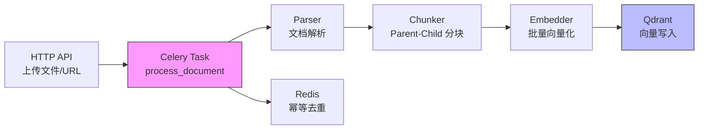
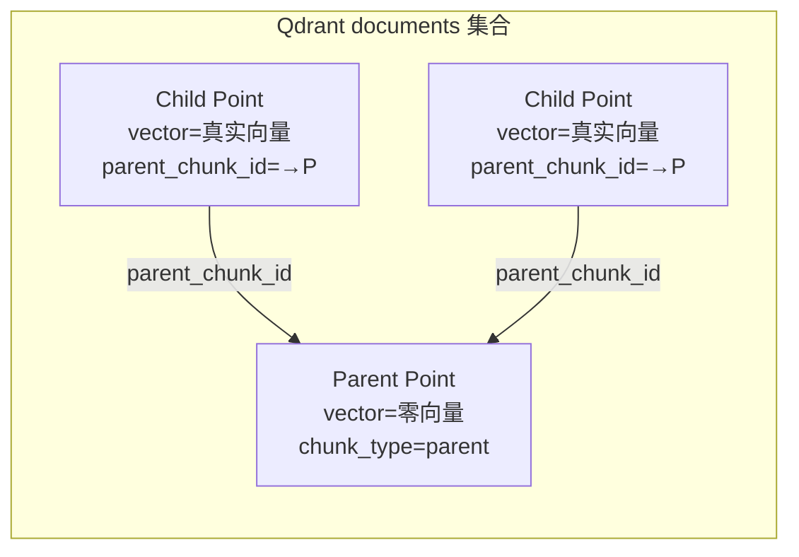

# L3 · 文档解析与向量存储流水线

> **场景背景**：Zuru 仓库里有 300+ 份 PDF 产品手册、100+ 份 Word 工艺文件，还有内网 Wiki 页面。在用户能问"T3000 型号的保修期多久"之前，必须先把这些文档全部"喂"进系统。L3 负责这一层：解析 → 分块 → 向量化 → 存储。

---

## 1. 模块定位

### 1.1 为什么这一层最基础

RAG 系统的质量，70% 取决于入库质量。后续的检索再好、LLM 再强，都弥补不了入库阶段把文档拆烂、向量维度算错、或者重复入库三份导致的噪声。

这一层有几个强制要求：
- **异步处理**：PDF 解析 + Embedding 可能需要 10-60 秒，不能阻塞 HTTP 接口
- **幂等**：同一份文档重复上传，只入库一次
- **多格式**：PDF、DOCX、Excel、Markdown、网页 URL 都要支持
- **多租户**：不同部门的文档数据隔离

### 1.2 流水线全貌



```
上传者视角的时序：
  POST /api/v1/ingest/file
    → 立刻返回 { task_id, doc_id, status: "queued" }
    → 后台 Celery Worker 执行解析/向量化/写入（10-60s）
  GET /api/v1/ingest/status/{task_id}
    → 轮询任务状态：PENDING → STARTED → SUCCESS / FAILURE
```

---

## 2. 项目结构

```
L3_doc_pipeline/
├── app/
│   ├── main.py                     # FastAPI 入口 + lifespan
│   ├── core/
│   │   ├── config.py               # pydantic-settings 配置
│   │   ├── embedder.py             # 异步 Embedding 客户端
│   │   ├── vector_store.py         # Qdrant 封装
│   │   ├── chunker.py              # Parent-Child 分块器
│   │   └── parsers/
│   │       ├── base.py             # ParsedPage + BaseParser 抽象
│   │       ├── pdf_parser.py       # pymupdf
│   │       ├── docx_parser.py      # python-docx
│   │       ├── web_parser.py       # playwright
│   │       ├── md_parser.py        # markdown
│   │       └── excel_parser.py     # openpyxl
│   ├── api/v1/
│   │   ├── ingest.py               # 上传文件/URL 接口
│   │   └── search.py               # 向量搜索接口
│   ├── tasks/
│   │   └── ingest.py               # Celery 任务：完整入库流水线
│   └── models/
│       └── schemas.py              # Pydantic 请求/响应模型
├── celery_app.py                   # Celery 实例配置
├── .env                            # 配置文件
└── start.ps1                       # 一键启动脚本
```

`.env` 关键配置：

```ini
# Embedding（SiliconFlow / OpenAI 均可）
EMBED_API_KEY=sk-your-key
EMBED_BASE_URL=https://api.siliconflow.cn/v1
EMBED_MODEL=Qwen/Qwen3-Embedding-8B
EMBED_DIMENSIONS=1024

# Qdrant（向量数据库）
QDRANT_URL=http://localhost:6333
QDRANT_COLLECTION=documents

# Redis（Celery broker + 去重 Set）
REDIS_URL=redis://localhost:6381/0

# 分块参数
PARENT_CHUNK_TOKENS=512
CHILD_CHUNK_TOKENS=128
CHUNK_OVERLAP_TOKENS=32
```

---

## 3. 文档解析层

### 3.1 统一数据结构

所有解析器都返回 `list[ParsedPage]`，上层代码不感知格式差异：

```python
# app/core/parsers/base.py

@dataclass
class ParsedPage:
    page_num: int           # 从 1 开始（网页固定为 1）
    text: str               # 该页原始全文
    paragraphs: list[str]   # 按段落分割后的文本列表


class BaseParser(ABC):
    @abstractmethod
    def parse(self, source: str | bytes) -> list[ParsedPage]:
        """
        source: 文件路径（url 解析时）或 bytes（文件上传时）
        return: 按页/逻辑块组织，每页一个 ParsedPage
        """
```

`paragraphs` 字段是分块器的主要输入。PDF 有真实的段落边界（双换行分割），DOCX 直接用 `doc.paragraphs`，网页则是 `<p>` 标签提取。

### 3.2 PDF 解析（pymupdf）

```python
# app/core/parsers/pdf_parser.py

import fitz  # pymupdf 包名是 pymupdf，import 名是 fitz

class PdfParser(BaseParser):
    def parse(self, source: str | bytes) -> list[ParsedPage]:
        # bytes 模式：从内存直接打开，不落盘
        if isinstance(source, bytes):
            doc = fitz.open(stream=source, filetype="pdf")
        else:
            doc = fitz.open(source)

        pages = []
        for page_idx in range(len(doc)):
            page = doc[page_idx]
            text = page.get_text("text").strip()

            # 扫描版图片页：无可提取文字，跳过
            if not text:
                continue

            # 按双换行符切段落
            paragraphs = [p.strip() for p in re.split(r"\n{2,}", text) if p.strip()]
            pages.append(ParsedPage(
                page_num=page_idx + 1,
                text=text,
                paragraphs=paragraphs,
            ))

        doc.close()
        return pages
```

**扫描版问题**：`page.get_text()` 对图片 PDF 返回空字符串。当前实现直接跳过，需要 OCR 时可以在此处接入 `paddleocr`：

```python
# 检测是否需要 OCR
if not text:
    # 可选：交给 OCR 处理
    # ocr_result = ocr_engine.ocr(page.get_pixmap().tobytes())
    # text = "\n".join(line[1][0] for line in ocr_result[0] if line)
    continue  # 当前：跳过图片页
```

### 3.3 DOCX 解析（python-docx）

```python
# app/core/parsers/docx_parser.py

class DocxParser(BaseParser):
    def parse(self, source: str | bytes) -> list[ParsedPage]:
        if isinstance(source, bytes):
            doc = Document(io.BytesIO(source))
        else:
            doc = Document(source)

        # doc.paragraphs 包含所有段落对象，.text 是段落文字
        paragraphs = [p.text.strip() for p in doc.paragraphs if p.text.strip()]

        if not paragraphs:
            return []

        # Word 文档没有"页"的概念，整篇作为 page_num=1
        full_text = "\n\n".join(paragraphs)
        return [ParsedPage(page_num=1, text=full_text, paragraphs=paragraphs)]
```

Word 文档不像 PDF 有物理页码，整篇作为单一逻辑单元处理。`doc.paragraphs` 的顺序与文档顺序一致，但**表格内的文字不在 `paragraphs` 里**，需要额外遍历 `doc.tables`。

### 3.4 格式路由

API 层根据文件的 MIME type 或扩展名决定用哪个解析器：

```python
# app/api/v1/ingest.py

_ALLOWED_MIME_TYPES = {
    "application/pdf": "pdf",
    "application/vnd.openxmlformats-officedocument.wordprocessingml.document": "docx",
    "application/vnd.openxmlformats-officedocument.spreadsheetml.sheet": "xlsx",
    "text/markdown": "md",
}
_EXT_TO_TYPE = {"pdf": "pdf", "docx": "docx", "xlsx": "xlsx", "md": "md"}

# 先按 MIME 判断，MIME 不准时靠扩展名兜底
content_type = file.content_type or ""
source_type = _ALLOWED_MIME_TYPES.get(content_type)
if not source_type:
    ext = (file.filename or "").rsplit(".", 1)[-1].lower()
    source_type = _EXT_TO_TYPE.get(ext)
```

浏览器上报的 MIME type 有时不准确（比如老版本 Office 文件），双重判断避免误拒。

---

## 4. Parent-Child 分块策略

### 4.1 为什么要分块

LLM 的 context window 有容量限制，不能把整篇文档塞进去。必须切成小块，检索时只取相关的部分。

分块有两个相互矛盾的需求：
- **块要小**：精确匹配用户问题，减少噪声
- **块要大**：给 LLM 足够的上下文才能回答完整

Parent-Child 策略同时满足两个需求：

```
一篇文档
    ↓ 切成 Parent chunks（512 token）
Parent A ─── Parent B ─── Parent C
    ↓ 每个 Parent 再切成 Child chunks（128 token）
A1  A2  A3    B1  B2    C1  C2  C3

检索阶段：
  用户问题 → 向量化 → 搜索 Child chunks（精确）
  找到 A2 → 取 A2 的 parent_chunk_id → 读取 Parent A（完整上下文）
  把 Parent A 的全文传给 LLM → 高质量回答
```

### 4.2 分块器实现

```python
# app/core/chunker.py

@dataclass
class Chunk:
    chunk_id: str
    parent_chunk_id: str | None   # None 表示本身是 parent
    chunk_type: Literal["parent", "child"]
    text: str
    page_num: int
    chunk_index: int


def chunk_document(
    pages: list[ParsedPage],
    parent_tokens: int = 512,
    child_tokens: int = 128,
    overlap_tokens: int = 32,
) -> list[Chunk]:
    # 第一步：把所有段落合并成不超过 parent_tokens 的 parent 块
    parent_texts = _build_parent_texts(pages, parent_tokens)
    
    all_chunks = []
    for page_num, parent_text in parent_texts:
        parent_id = str(uuid.uuid4())
        # 写入 parent chunk
        all_chunks.append(Chunk(
            chunk_id=parent_id, parent_chunk_id=None,
            chunk_type="parent", text=parent_text, page_num=page_num, ...
        ))
        # 把 parent 文本再切成 child chunks（带 overlap）
        for child_text in _split_into_children(parent_text, child_tokens, overlap_tokens):
            all_chunks.append(Chunk(
                chunk_id=str(uuid.uuid4()), parent_chunk_id=parent_id,
                chunk_type="child", ...
            ))
    return all_chunks
```

**合并段落的逻辑**（`_build_parent_texts`）：

```python
def _build_parent_texts(pages, max_tokens):
    results = []
    buf_lines, buf_tokens, buf_page = [], 0, 1

    for page in pages:
        paragraphs = page.paragraphs or [page.text]

        # 换页时立刻 flush（不跨页合并，保持页码完整）
        if buf_lines and page.page_num != buf_page:
            results.append((buf_page, "\n\n".join(buf_lines)))
            buf_lines, buf_tokens = [], 0

        for para in paragraphs:
            para_tokens = count_tokens(para)

            # 单段落超限：强制递归切分
            if para_tokens > max_tokens:
                if buf_lines:
                    results.append((buf_page, "\n\n".join(buf_lines)))
                    buf_lines, buf_tokens = [], 0
                for sub in _split_long_text(para, max_tokens):
                    results.append((page.page_num, sub))
                continue

            # 加入当前段落后超限：先 flush 再加
            if buf_tokens + para_tokens > max_tokens and buf_lines:
                results.append((buf_page, "\n\n".join(buf_lines)))
                buf_lines, buf_tokens = [], 0

            buf_lines.append(para)
            buf_tokens += para_tokens

    if buf_lines:
        results.append((buf_page, "\n\n".join(buf_lines)))
    return results
```

**Child 分块（带 overlap 的滑动窗口）**：

```python
def _split_into_children(text, max_tokens, overlap_tokens):
    tokens = encoding.encode(text)  # 用 tiktoken cl100k_base 编码
    if len(tokens) <= max_tokens:
        return [text]

    chunks = []
    step = max_tokens - overlap_tokens  # 步长 = 块大小 - 重叠
    start = 0
    while start < len(tokens):
        end = min(start + max_tokens, len(tokens))
        chunks.append(encoding.decode(tokens[start:end]))
        if end == len(tokens):
            break
        start += step  # 滑动，保留 overlap_tokens 个 token 的重叠
    return chunks
```

**overlap 的作用**：如果一个完整的句子恰好跨越两个 child 块的边界，没有 overlap 时这个句子会被切断，两个块都只有半句话，向量都不准。overlap 保证边界附近的文本至少在某一个完整块里出现过。

### 4.3 Token 计数

```python
import tiktoken

_ENCODING = tiktoken.get_encoding("cl100k_base")

def count_tokens(text: str) -> int:
    return len(_ENCODING.encode(text))
```

`tiktoken` 是 OpenAI 开源的 BPE 分词器，`cl100k_base` 对应 GPT-3.5/GPT-4/DeepSeek 系列。字符数不等于 token 数——中文一般每 1-2 个字符对应 1 个 token，英文大约每 4 个字符对应 1 个 token。按字符切会导致实际超出 token 限制，必须用 tiktoken 计数。

---

## 5. Embedding 层

### 5.1 Embedder 设计

```python
# app/core/embedder.py

class Embedder:
    def __init__(self, api_key, base_url, model, dimensions, http_client, batch_size=100):
        self.dimensions = dimensions
        self._http = http_client
        self.batch_size = batch_size
        ...

    async def embed_many(self, texts: list[str]) -> list[list[float]]:
        """批量向量化：自动分批 + 并发"""
        if not texts:
            return []
        
        # 按 batch_size 分批
        batches = [texts[i:i+self.batch_size] for i in range(0, len(texts), self.batch_size)]
        
        # 并发发所有批次
        results = await asyncio.gather(*[self._embed_batch(b) for b in batches])
        
        all_vectors = []
        for batch_vectors in results:
            all_vectors.extend(batch_vectors)
        return all_vectors

    async def _embed_batch(self, texts: list[str]) -> list[list[float]]:
        payload = {
            "model": self.model,
            "input": texts,
            "dimensions": self.dimensions,  # 必须显式传，不能省略（见踩坑记录）
        }
        resp = await self._http.post(
            f"{self.base_url}/embeddings",
            json=payload,
            headers={"Authorization": f"Bearer {self.api_key}"},
        )
        resp.raise_for_status()
        data = resp.json()
        # 按 index 排序确保顺序和输入一致
        ordered = sorted(data["data"], key=lambda x: x["index"])
        return [item["embedding"] for item in ordered]
```

**为什么要排序**：Embedding API 返回的 `data` 数组，各批次内的顺序通常与输入一致，但规范里没有保证。`sorted(data["data"], key=lambda x: x["index"])` 是防御性写法。

### 5.2 Celery Worker 里的同步版本

FastAPI 的 `Embedder` 是异步的。但 Celery task 运行在独立进程里，没有正在运行的 asyncio event loop，不能直接 `await`。

两种解法：

**方案 A（本项目采用）**：在 task 内用 `httpx.post`（同步版本）单独实现一个 `_embed_batch_sync`：

```python
# app/tasks/ingest.py

def _embed_batch_sync(texts, api_key, base_url, model, dimensions):
    payload = {
        "model": model,
        "input": texts,
        "dimensions": dimensions,
    }
    resp = httpx.post(   # 注意：同步 httpx，无 async
        f"{base_url.rstrip('/')}/embeddings",
        json=payload,
        headers={"Authorization": f"Bearer {api_key}"},
        timeout=60.0,
    )
    resp.raise_for_status()
    ordered = sorted(resp.json()["data"], key=lambda x: x["index"])
    return [item["embedding"] for item in ordered]
```

**方案 B**（更彻底）：在 task 里 `asyncio.run(_embed_batch(...))` 手动起一个 event loop。但这在某些 Celery 配置下会有问题（比如 `--pool=gevent`），方案 A 更稳。

---

## 6. Qdrant 向量存储

### 6.1 集合结构

Qdrant 的每个 Point 包含两部分：`vector`（向量）和 `payload`（元数据）。

本项目所有文档共用一个 `documents` 集合，通过 `tenant_id` 字段过滤实现多租户隔离：

```python
# Qdrant collection schema（不是 DDL，只是描述字段含义）

vector: list[float]    # 维度 = embed_dimensions（1024 或 1536）
payload: {
    "doc_id":          str,   # 文档 UUID
    "tenant_id":       str,   # 租户 ID，过滤用
    "source":          str,   # 文件名或 URL
    "page_num":        int,   # 来源页码
    "chunk_index":     int,   # 块在文档内的序号
    "chunk_type":      str,   # "parent" 或 "child"
    "text":            str,   # 块文本
    "parent_chunk_id": str | None,  # child 指向 parent 的 ID
}
```



**Parent 用零向量**：Parent chunk 只用于读取全文，不参与向量检索。往 Qdrant 里写零向量是占位用的，配合 `chunk_type="parent"` 过滤条件，搜索时只搜 child。

### 6.2 写入流程

```python
# app/tasks/ingest.py

# 删除同一文档的旧版本（实现幂等覆盖）
qdrant.delete(
    collection_name=settings.qdrant_collection,
    points_selector=FilterSelector(filter=Filter(must=[
        FieldCondition(key="doc_id", match=MatchValue(value=doc_id)),
        FieldCondition(key="tenant_id", match=MatchValue(value=tenant_id)),
    ]))
)

# 写入 parent points（零向量占位）
for chunk in parent_chunks:
    points.append(PointStruct(
        id=chunk.chunk_id,
        vector=[0.0] * settings.embed_dimensions,
        payload={
            "doc_id": doc_id, "tenant_id": tenant_id,
            "chunk_type": "parent", "text": chunk.text, ...
        }
    ))

# 写入 child points（真实向量）
for chunk, vector in zip(child_chunks, child_vectors):
    points.append(PointStruct(
        id=chunk.chunk_id,
        vector=vector,
        payload={
            "chunk_type": "child",
            "parent_chunk_id": chunk.parent_chunk_id, ...
        }
    ))

qdrant.upsert(collection_name=settings.qdrant_collection, points=points)
```

### 6.3 搜索时的 Two-Pass 取数

```python
# app/core/vector_store.py（简化版）

async def search(self, query_vector, tenant_id, top_k=5, score_threshold=0.5):
    # 第一步：搜索 child chunks（有真实向量）
    results = await self._client.search(
        collection_name=self._collection,
        query_vector=query_vector,
        limit=top_k,
        score_threshold=score_threshold,
        query_filter=Filter(must=[
            FieldCondition(key="tenant_id", match=MatchValue(value=tenant_id)),
            FieldCondition(key="chunk_type", match=MatchValue(value="child")),
        ]),
        with_payload=True,
    )

    # 第二步：根据 parent_chunk_id 取对应的 parent 全文
    parent_ids = [r.payload["parent_chunk_id"] for r in results]
    parents = await self._client.retrieve(
        collection_name=self._collection,
        ids=parent_ids,
        with_payload=True,
    )
    parent_map = {str(p.id): p.payload["text"] for p in parents}

    # 返回 child 的向量匹配分数 + parent 的完整文本
    hits = []
    for r in results:
        parent_text = parent_map.get(r.payload["parent_chunk_id"], r.payload["text"])
        hits.append(SearchResult(
            chunk_id=str(r.id),
            text=r.payload["text"],      # child 文本（展示匹配片段）
            parent_text=parent_text,      # parent 全文（传给 LLM）
            score=r.score,
            ...
        ))
    return hits
```

---

## 7. Celery 异步任务

### 7.1 为什么用 Celery

文档入库是重 IO 操作：PDF 解析平均 2-5 秒，Embedding API 调用 5-30 秒，加上 Qdrant 写入，总时长轻松超过 30 秒。HTTP 请求不能等这么久（网关超时、用户体验差），必须用后台任务。

Celery 的作用是：
- **解耦**：HTTP 接口只负责把任务放进队列，立刻返回 `task_id`
- **持久化**：任务存在 Redis（broker），即使 worker 重启也不会丢任务
- **状态追踪**：`PENDING → STARTED → SUCCESS / FAILURE`，客户端轮询 `status` 接口

### 7.2 任务定义

```python
# app/tasks/ingest.py

from celery_app import celery_app

@celery_app.task(bind=True, name="ingest.process_document")
def process_document(
    self,                   # bind=True 时第一个参数是 task 实例，可用于 self.retry()
    *,
    doc_id: str,
    tenant_id: str,
    source: str,            # 文件名或 URL
    source_type: Literal["pdf", "docx", "url", ...],
    content_b64: str | None,  # 文件内容 base64（非 URL 时）
    content_hash: str | None, # MD5，用于幂等检查
) -> dict:
    settings = get_settings()

    # 1. 幂等检查（Redis Set）
    redis_conn = redis.from_url(settings.redis_url, decode_responses=True)
    if content_hash and redis_conn.sismember(_DEDUP_KEY, content_hash):
        return {"doc_id": doc_id, "chunks": 0, "status": "duplicate"}

    # 2. 解析
    parser = _get_parser(source_type)
    if source_type == "url":
        pages = parser.parse(source)
    else:
        raw_bytes = base64.b64decode(content_b64)
        pages = parser.parse(raw_bytes)

    # 3. 分块
    chunks = chunk_document(pages, ...)
    child_chunks = [c for c in chunks if c.chunk_type == "child"]
    parent_chunks = [c for c in chunks if c.chunk_type == "parent"]

    # 4. Embedding（仅 child）
    child_vectors = _embed_all_sync([c.text for c in child_chunks], settings)

    # 5. 写入 Qdrant（删旧 → 写新）
    ...

    # 6. 记录 dedup hash
    if content_hash:
        redis_conn.sadd(_DEDUP_KEY, content_hash)

    return {"doc_id": doc_id, "chunks": len(points), "status": "done"}
```

### 7.3 幂等设计

```python
_DEDUP_KEY = "doc_pipeline:ingested_hashes"   # Redis Set

# 检查 —— O(1)
redis_conn.sismember(_DEDUP_KEY, content_hash)

# 记录 —— 入库完成后再加
redis_conn.sadd(_DEDUP_KEY, content_hash)
```

`content_hash` 是文件内容的 MD5。同一个文件不管上传几次，MD5 相同，第二次直接返回 `duplicate`，不消耗任何 Embedding 额度。

**API 层的快速路径**：在 HTTP handler 里也做了一次幂等检查。这样重复上传时不需要把任务放进 Celery 队列，响应更快：

```python
# app/api/v1/ingest.py

content_hash = hashlib.md5(content).hexdigest()
if redis_conn.sismember(_DEDUP_KEY, content_hash):
    return IngestResponse(status="duplicate", message="该文件已入库，跳过")

# 未重复：放入队列
task = process_document.delay(doc_id=..., content_hash=content_hash, ...)
```

### 7.4 向 Celery 传文件内容

Celery 通过消息队列传参，参数必须能序列化（JSON）。文件的 `bytes` 不能直接序列化，要先 base64 编码：

```python
# API 层：bytes → base64 string
content_b64 = base64.b64encode(content).decode()
task = process_document.delay(content_b64=content_b64, ...)

# Task 层：base64 string → bytes
raw_bytes = base64.b64decode(content_b64)
pages = parser.parse(raw_bytes)
```

这是 Celery 处理二进制数据的标准做法。不要传文件路径（worker 可能在另一台机器上）。

### 7.5 任务状态查询

```python
# app/api/v1/ingest.py

@router.get("/status/{task_id}", response_model=TaskStatusResponse)
async def task_status(task_id: str):
    from celery.result import AsyncResult

    result = AsyncResult(task_id, app=celery_app)
    status = result.status   # PENDING / STARTED / SUCCESS / FAILURE / RETRY / REVOKED

    task_result = None
    error = None
    if status == "SUCCESS":
        task_result = result.result
    elif status == "FAILURE":
        # ⚠️ 注意：str(result.result) 对非序列化的异常对象返回空字符串
        # result.traceback 始终是可读的字符串 traceback
        error = result.traceback or repr(result.result)

    return TaskStatusResponse(task_id=task_id, status=status, result=task_result, error=error)
```

---

## 8. HTTP 接口

### 8.1 文件上传

```
POST /api/v1/ingest/file
Content-Type: multipart/form-data

file:      <binary>
tenant_id: default       (可选，默认 "default")
doc_id:    <uuid>        (可选，不传则自动生成)

响应：
{
  "task_id": "celery-task-uuid",
  "doc_id": "doc-uuid",
  "status": "queued"    # 或 "duplicate"
}
```

### 8.2 URL 抓取

```
POST /api/v1/ingest/url
Content-Type: application/json

{
  "url": "https://example.com/manual.html",
  "tenant_id": "default"
}
```

网页解析由 `WebParser` 用 Playwright 无头浏览器抓取，支持 JavaScript 渲染的页面。

### 8.3 向量搜索

```
POST /api/v1/search
Content-Type: application/json

{
  "query": "T3000 型号的额定电压是多少",
  "tenant_id": "default",
  "top_k": 5,
  "score_threshold": 0.5
}

响应：
{
  "query": "T3000 型号的额定电压是多少",
  "hits": [
    {
      "chunk_id": "...",
      "text": "child chunk 文本（匹配片段）",
      "parent_text": "parent chunk 全文（上下文）",
      "score": 0.8823,
      "source": "T3000产品手册.pdf",
      "page_num": 12,
      "doc_id": "..."
    }
  ],
  "total": 3
}
```

`score_threshold=0.5` 过滤掉相似度低于 0.5 的结果，避免返回不相关的内容。实际部署时根据业务调整，中文技术文档一般设 0.6-0.7 效果更好。

---

## 9. Python 语法要点

### 9.1 dataclass

```python
from dataclasses import dataclass, field

@dataclass
class Chunk:
    chunk_id: str
    chunk_type: Literal["parent", "child"]
    text: str
    page_num: int
    token_count: int = field(init=False)   # field(init=False)：不在构造函数参数里

    def __post_init__(self):
        # __post_init__ 在 __init__ 完成后自动调用，用于计算派生字段
        self.token_count = count_tokens(self.text)
```

`@dataclass` 自动生成 `__init__`、`__repr__`、`__eq__`。`field(init=False)` 表示这个字段不由构造函数参数赋值，而是在 `__post_init__` 里计算。

**C# 对比**：相当于 C# 的 record，自动生成构造函数和相等性比较，但 Python 不是不可变的（没有 `readonly`）。

### 9.2 Celery task 的 bind=True

```python
@celery_app.task(bind=True, name="ingest.process_document")
def process_document(self, *, doc_id, ...):
    # self 是任务实例 (Task 对象)
    # self.request.id  → 当前任务 ID
    # self.retry(countdown=30)  → 30秒后重试
    # self.update_state(state="PROGRESS", meta={"pct": 50})  → 自定义状态
```

`bind=True` 让 task 函数能访问自身实例，用于手动重试和更新进度状态。

### 9.3 asyncio.gather 并发 Embedding

```python
# 串行（慢）：每批等上一批完成
for batch in batches:
    vectors = await _embed_batch(batch)

# 并发（快）：所有批次同时发出
results = await asyncio.gather(*[_embed_batch(b) for b in batches])
```

`asyncio.gather` 接受多个协程，同时调度它们执行，等所有完成后返回结果列表。100 个 child chunks 分 1 批并发，比串行快接近 batch_size 倍。

但要注意**限流**：Embedding API 有 Rate Limit（每分钟请求数），过于激进的并发会触发 429 Too Many Requests。实际上 `batch_size=100` 已经是单次调用的上限，不要把每个 chunk 单独发一次请求。

### 9.4 Literal 类型

```python
from typing import Literal

chunk_type: Literal["parent", "child"]   # 只能是这两个值之一
source_type: Literal["pdf", "docx", "url", "md", "xlsx"]
```

`Literal` 在类型检查阶段（mypy / Pylance）会报错非法值，运行时没有约束效果。配合 `match` 语句或工厂字典使用，可以确保编译期就发现遗漏分支。

---

## 10. 踩坑记录

### 10.1 Qdrant 维度不匹配

**现象**：入库时 `ApiException: Expected dimension XYZ, got ABC`。

**原因**：`Qwen3-Embedding-8B` 默认输出 4096 维，而 `.env` 里设的是 `EMBED_DIMENSIONS=1024`（MRL 截断维度）。如果 Embedding API 请求里没有传 `dimensions` 参数，模型输出 4096 维向量，写入时和 Qdrant 集合的 1024 维配置冲突。

**错误写法**：
```python
payload = {"model": model, "input": texts}
# 忘记传 dimensions，模型用默认维度 4096
```

**正确写法**：
```python
payload = {
    "model": model,
    "input": texts,
    "dimensions": dimensions,   # 必须显式传
}
```

MRL（Matryoshka Representation Learning）允许在推理时截断向量维度。OpenAI `text-embedding-3`、`Qwen3-Embedding` 等模型都支持。不传 `dimensions` 就用模型的全维度；传了才截断。

**修复后**：删除 Qdrant 里的旧集合（维度已固化，无法修改），重新建集合：

```bash
curl -X DELETE http://localhost:6333/collections/documents
```

### 10.2 Celery 任务失败时 error 字段为空

**现象**：前端显示 `{status: "FAILURE", error: ""}`，完全不知道出了什么错。

**原因**：`str(result.result)` 对 Python 异常对象有时返回空字符串（特别是自定义异常没有 `__str__`）。

**错误写法**：
```python
error = str(result.result)   # 可能是空字符串
```

**正确写法**：
```python
error = result.traceback or repr(result.result)
# result.traceback 是完整的 traceback 字符串，始终可读
```

### 10.3 Redis 端口配置不匹配

**现象**：`ConnectionRefusedError: [Errno 111] Connection refused` 连接 Redis 失败。

**原因**：Docker 把 Redis 容器的 6379 端口映射到宿主机 6381（避免与本机已有 Redis 冲突），但 `.env` 里的 `REDIS_URL` 还写着 `redis://localhost:6379/0`。

**修复**：`.env` 改为 `redis://localhost:6381/0`。

### 10.4 Celery task 不能共享 FastAPI 的 app.state

**现象**：在 task 里直接用 `from app.main import app; app.state.embedder` 报错或拿到 None。

**原因**：Celery worker 是独立启动的 Python 进程，FastAPI 的 `lifespan` 从来没在这个进程里执行过，`app.state` 上的单例对象根本不存在。

**解法**：在 task 内部自行创建所需的客户端实例（同步版本），不依赖 FastAPI 的状态。这也是为什么 `ingest.py` 里单独写了 `_embed_batch_sync`，而不是直接用 FastAPI 那边的 `Embedder`。

---

## 11. 一键启动

```powershell
# 启动 Qdrant + Redis（Docker）+ L3 API + Celery Worker + L2 API
.\start.ps1
```

脚本自动检查哪些服务已在运行，跳过不需要重启的：

```
[1/5] Qdrant...       → docker start qdrant（若不存在则 docker run）
[2/5] Redis...        → 检查 port 6381 是否已占用
[3/5] L3 API...       → uvicorn app.main:app --port 8002
[4/5] L3 Worker...    → celery -A celery_app worker --pool=solo
[5/5] L2 Chat API...  → uvicorn app.main:app --port 8001
```

`--pool=solo`：Windows 下 Celery 不支持默认的 `prefork` 多进程模式，用 `solo` 单线程模式（生产环境 Linux 上去掉这个参数）。

手动启动顺序（不用脚本时）：

```bash
# 1. 启动基础设施
docker start qdrant zuruai-redis

# 2. L3 API
cd L3_doc_pipeline
uv run uvicorn app.main:app --port 8002 --reload

# 3. Celery Worker（另开一个终端）
cd L3_doc_pipeline
uv run celery -A celery_app worker --loglevel=info --pool=solo

# 4. 验证
curl http://localhost:8002/health
```

---

## 12. 扩展方向

| 方向 | 做法 |
|------|------|
| OCR 支持 | 扫描版 PDF 接入 `paddleocr`，在 `PdfParser` 里检测空页后调用 |
| 表格提取 | DOCX 遍历 `doc.tables`；PDF 用 `pdfplumber` 提取 |
| 增量更新 | 文件 hash 不变跳过；hash 变了删旧 Points 再写新的（当前已实现） |
| 批量导入 | 扫描目录，对每个文件调用 `process_document.delay()`，返回任务 ID 列表 |
| 分布式 Worker | 多台机器各跑一个 Celery Worker，共享同一个 Redis broker |
| 向量维度降低 | 从 1536 降到 512 可以节省 3x 存储和检索时间，精度略有下降 |

::: tip 本关完成后，L4 将在这一层之上增加
- BM25 关键词检索（和向量检索混合）
- Reranker 对候选结果精排
- 完整的 RAG 问答链路（检索 → 拼装 Prompt → LLM 生成）
:::
