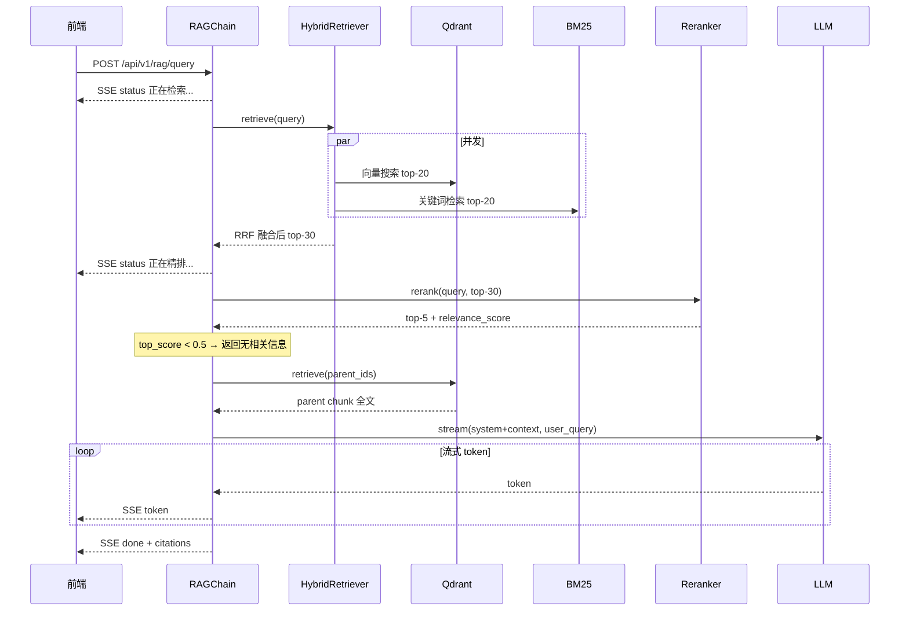

# L4 · RAG 检索问答核心

> **场景背景**：L3 完成了文档入库，现在员工输入"T3000 型号的额定电压是多少"——系统要在几秒内找出相关段落、精排、组装成提示词，再让 LLM 生成有来源引用的准确回答。这一层完成从"能存"到"能问"的跨越。

---

## 1. 模块定位

### 1.1 L4 做什么

L4 是一个独立的 FastAPI 服务（端口 8003），在 L3 的 Qdrant 数据之上实现问答能力：

```
用户提问
  → 混合检索（BM25 + 向量搜索，RRF 融合）
  → Reranker 精排（取 top-5）
  → 置信度判断（分数 < 0.5 拒绝回答）
  → 取 parent chunk 全文（提供充足上下文）
  → 组装带编号引用的 Prompt
  → LLM 流式生成回答
  → SSE 事件流返回前端
```

L4 不依赖 Celery，没有后台任务，是纯检索/生成服务。Qdrant 集合由 L3 创建，L4 直接复用。

### 1.2 为什么需要混合检索

纯向量检索的问题：语义相似但关键词不匹配时会漏掉。

- 用户问"T3000 额定电压"，向量检索可能返回"电气规格概述"（语义相关、无具体数据）
- BM25 能精准命中含"T3000"和"额定电压"的段落

BM25 的问题：只看词频，换个说法就找不到。

两者融合，互补短板，是工程上最实用的组合策略。

### 1.3 请求链路



---

## 2. 项目结构

```
L4_rag_core/
├── app/
│   ├── main.py                     # FastAPI port 8003，lifespan 初始化
│   ├── core/
│   │   ├── config.py               # pydantic-settings 配置
│   │   ├── embedder.py             # 复用自 L3（无改动）
│   │   ├── vector_store.py         # 复用自 L3（无改动）
│   │   ├── llm_client.py           # 复用自 L2（OpenAICompatibleClient）
│   │   ├── logging.py              # 复用自 L3（structlog）
│   │   ├── bm25_retriever.py       # BM25 索引（启动时从 Qdrant 构建）
│   │   ├── reranker.py             # SiliconFlow /v1/rerank 封装
│   │   ├── hybrid_retriever.py     # 向量 + BM25 并发 + RRF 融合
│   │   ├── prompt_templates.py     # RAG system prompt + build_context
│   │   └── rag_chain.py            # 完整 RAG 流水线，输出 SSE 事件流
│   ├── api/v1/
│   │   └── rag.py                  # POST /query（SSE）+ POST /reindex
│   └── models/
│       └── schemas.py              # RAGQueryRequest, CitationItem 等
├── .env
├── requirements.txt
└── start.ps1
```

`.env` 关键配置：

```ini
EMBED_API_KEY=sk-your-key
EMBED_BASE_URL=https://api.siliconflow.cn/v1
EMBED_MODEL=Qwen/Qwen3-Embedding-8B
EMBED_DIMENSIONS=1024

RERANKER_MODEL=BAAI/bge-reranker-v2-m3

LLM_MODEL=deepseek-ai/DeepSeek-V3
LLM_TEMPERATURE=0.1
LLM_MAX_TOKENS=2048

QDRANT_URL=http://localhost:6333
QDRANT_COLLECTION=documents

RAG_VECTOR_TOP_K=20
RAG_BM25_TOP_K=20
RAG_RRF_K=60
RAG_RERANK_TOP_N=5
RAG_CONFIDENCE_THRESHOLD=0.5
```

---

## 3. BM25 检索器

### 3.1 为什么在内存里建索引

Elasticsearch 是生产级方案，但学习阶段引入太重。`bm25s` 是纯 Python 实现，无需额外服务，直接在内存中建索引，满足本阶段需求。

代价：重启需要重建（5~30 秒，取决于文档量）；入库新文档后调用 `/api/v1/rag/reindex` 刷新。

### 3.2 启动时构建索引

```python
# app/core/bm25_retriever.py

class BM25Retriever:
    def __init__(self) -> None:
        self._index: bm25s.BM25 | None = None
        self._meta: list[dict] = []  # _meta[i] 对应索引第 i 行

    async def build_from_qdrant(self, qdrant_client, collection: str) -> int:
        all_points = []
        offset = None

        # 分页拉取所有 child chunks
        while True:
            result, next_offset = await qdrant_client.scroll(
                collection_name=collection,
                scroll_filter=Filter(
                    must=[FieldCondition(key="chunk_type", match=MatchValue(value="child"))]
                ),
                limit=500,
                offset=offset,
                with_payload=True,
                with_vectors=False,
            )
            all_points.extend(result)
            if next_offset is None:
                break
            offset = next_offset

        corpus_texts = [p.payload.get("text", "") for p in all_points]

        # 分词 → 建倒排索引
        tokenized = bm25s.tokenize(corpus_texts, stopwords="zh")
        index = bm25s.BM25()
        index.index(tokenized)

        self._meta = corpus_meta
        self._index = index
        return len(corpus_texts)
```

只拉取 `chunk_type=child` 的点：child chunk 是约 128 token 的精确小块，parent chunk 的向量是零向量，不参与 BM25 索引。

### 3.3 检索方法（同步）

```python
def search(
    self,
    query: str,
    top_k: int = 20,
    tenant_id: str | None = None,
) -> list[BM25Result]:
    if self._index is None:
        return []

    tokenized_query = bm25s.tokenize([query], stopwords="zh")
    fetch_k = min(top_k * 4, len(self._meta))
    doc_ids, scores = self._index.retrieve(tokenized_query, k=fetch_k)

    results = []
    for idx, score in zip(doc_ids[0], scores[0]):
        meta = self._meta[int(idx)]
        if tenant_id and meta["tenant_id"] != tenant_id:
            continue
        results.append(BM25Result(**meta, bm25_score=float(score)))
        if len(results) >= top_k:
            break
    return results
```

`bm25s.retrieve()` 是 NumPy 操作，同步不可 `await`。上层必须用 `asyncio.to_thread()` 包裹，否则会阻塞整个事件循环——期间所有其他请求都无法处理。

---

## 4. 混合检索与 RRF 融合

### 4.1 并发执行两路检索

```python
# app/core/hybrid_retriever.py

async def retrieve(self, query: str, tenant_id: str, ...) -> list[HybridResult]:
    query_vector = await self._embedder.embed_one(query)

    # 向量搜索和 BM25 同时发起
    vector_results, bm25_results = await asyncio.gather(
        self._vector.search(query_vector, tenant_id, top_k=20, ...),
        asyncio.to_thread(self._bm25.search, query, 20, tenant_id),
    )

    return self._rrf_merge(vector_results, bm25_results, k=60, top_n=30)
```

`asyncio.gather` 把两个操作同时发起：向量搜索走网络（Qdrant），BM25 走本地线程池。总耗时约等于较慢的那个，而不是两者之和。

### 4.2 RRF 融合算法

```python
def _rrf_merge(self, vector_results, bm25_results, k: int, top_n: int):
    scores: dict[str, float] = {}
    metadata: dict[str, dict] = {}

    for rank, r in enumerate(vector_results):
        scores[r.chunk_id] = scores.get(r.chunk_id, 0.0) + 1.0 / (k + rank + 1)
        if r.chunk_id not in metadata:
            metadata[r.chunk_id] = {... r 的元数据 ...}

    for rank, r in enumerate(bm25_results):
        scores[r.chunk_id] = scores.get(r.chunk_id, 0.0) + 1.0 / (k + rank + 1)
        if r.chunk_id not in metadata:
            metadata[r.chunk_id] = {... r 的元数据 ...}

    sorted_ids = sorted(scores, key=lambda cid: scores[cid], reverse=True)
    return [HybridResult(**metadata[cid], rrf_score=scores[cid]) for cid in sorted_ids[:top_n]]
```

RRF 公式：`score(d) = Σ 1 / (60 + rank_i(d))`

- 同一 chunk 在两路都出现 → 分数累加两次，自然排名靠前
- 只在一路出现 → 只累加一次，自然降权
- k=60 是论文经验值，无需手动调整向量/BM25 的权重比例

---

## 5. Reranker 精排

### 5.1 双塔 vs 交叉编码器

| | Embedding（双塔） | Reranker（交叉编码器） |
|--|--|--|
| 方式 | Query 和 Doc 分别编码后算相似度 | Query + Doc 拼接，联合注意力 |
| 速度 | 快（可预计算 Doc 向量） | 慢（每对都要推理） |
| 精度 | 中等 | 高 |
| 使用场景 | 召回阶段（大量候选） | 精排阶段（少量候选） |

RRF 召回 top-30，交给 Reranker 精排取 top-5，是标准两阶段检索架构。

### 5.2 调用 SiliconFlow Rerank 接口

```python
# app/core/reranker.py

async def rerank(self, query: str, documents: list[str], top_n: int = 5):
    payload = {
        "model": self.model,
        "query": query,
        "documents": documents,
        "top_n": min(top_n, len(documents)),
        "return_documents": False,  # 省流量，不回传文本
    }
    resp = await self._http.post(
        f"{self.base_url}/rerank",
        json=payload,
        headers={"Authorization": f"Bearer {self.api_key}"},
    )
    resp.raise_for_status()

    raw = sorted(data["results"], key=lambda x: x["relevance_score"], reverse=True)
    return [RerankResult(index=r["index"], relevance_score=r["relevance_score"]) for r in raw]
```

`index` 字段是原始 `documents` 列表的下标，用来取回对应的 `HybridResult`：

```python
top_results = [candidates[r.index] for r in rerank_results]
```

Reranker 使用原始用户查询（不用改写版），因为交叉注意力对自然语言的理解更准确。

### 5.3 置信度判断与降级

```python
if rerank_results and rerank_results[0].relevance_score < settings.rag_confidence_threshold:
    yield {"type": "done", "content": settings.rag_no_result_msg, "citations": []}
    return
```

Reranker 分数比向量余弦相似度更可信：经过大量标注数据训练，分数含义更接近人工判断的"相关性"。阈值 0.5 是起点，上线后根据实际反馈调整。

当 Reranker API 报错时，降级为 RRF top-5，不中断服务：

```python
try:
    rerank_results = await self._reranker.rerank(query, documents=texts, top_n=5)
except RerankError as e:
    logger.warning("rerank_failed_fallback", error=str(e))
    rerank_results = None
```

---

## 6. Parent Chunk 取回

L3 入库时使用 parent-child 结构：
- **Child chunk**（约 128 token）：精确小块，用于向量化和 BM25，检索精度高
- **Parent chunk**（约 512 token）：较大上下文块，包含完整段落，适合 LLM 理解

检索用 child 精准命中位置，生成时需要 parent 提供充足上下文：

```python
parent_ids = [r.parent_chunk_id for r in top_results if r.parent_chunk_id]

parent_points = await self._qdrant.retrieve(
    collection_name=settings.qdrant_collection,
    ids=list(set(parent_ids)),
    with_payload=True,
)
parent_map = {str(p.id): p.payload.get("text", "") for p in parent_points}

for result, score in zip(top_results, top_scores):
    # 优先用 parent 文本；无 parent 时回退用 child 文本
    parent_text = parent_map.get(result.parent_chunk_id or "", result.text)
```

---

## 7. Prompt 组装与引用标注

### 7.1 来源引用格式

```python
# app/core/prompt_templates.py

def build_context(chunks: list[dict]) -> str:
    parts = []
    for i, chunk in enumerate(chunks, 1):
        source_label = f"{chunk['source']} 第{chunk['page_num']}页"
        parts.append(f"【来源{i}】{source_label}\n{chunk['text']}")
    return "\n\n".join(parts)
```

输出样例：

```
【来源1】产品手册_T3000.pdf 第12页
T3000 型号额定输入电压为 220V AC，频率 50/60Hz，最大输入电流 15A。

【来源2】电气规格汇总表.pdf 第3页
各型号额定电压：T3000: 220V，T5000: 380V，T8000: 380V/660V
```

### 7.2 System Prompt 设计

```python
RAG_SYSTEM_PROMPT = """\
你是 Zuru 企业知识库的问答助手。请严格根据以下参考资料回答用户问题。

规则：
1. 只基于下方"参考资料"中的内容作答，不要使用训练知识补充
2. 回答中引用具体内容时，用【来源N】标注对应来源编号
3. 如果参考资料中没有足够信息，直接回答："根据现有资料无法回答该问题，建议联系相关部门确认。"
4. 回答简洁准确，使用中文，不要重复问题

参考资料：
{context}"""
```

几个设计选择：
- **参考资料放 system message 末尾**：紧靠 user message，LLM 对上下文末尾的注意力更集中
- **明确禁止使用训练知识**：防止 LLM 在文档支撑不足时"好心补充"，产生幻觉
- **temperature=0.1**：知识库问答要求忠实于来源，低温度减少随机性

### 7.3 短查询改写

查询短于 10 个字时触发关键词改写：

```python
QUERY_REWRITE_PROMPT = """\
将下面的用户问题改写成适合文档全文检索的关键词查询。
只输出改写后的关键词（空格分隔），不要输出任何解释和标点。

用户问题：{query}
关键词查询："""
```

"保修期" → "产品 保修期限 质保 售后服务 保修条款"

改写仅影响检索 query，Reranker 始终用原始用户问题——自然语言对交叉编码器理解更准。

---

## 8. RAG 流水线（RAGChain）

`RAGChain.query_stream()` 是整个 L4 的核心，返回 `AsyncGenerator[dict, None]`：

```python
# app/core/rag_chain.py（精简）

async def query_stream(self, query: str, tenant_id: str):
    # Step 1：短查询改写（可选）
    search_query = query
    if len(query) < settings.rag_query_rewrite_chars:
        yield {"type": "status", "content": "正在优化检索关键词..."}
        search_query = await self._rewrite_query(query)

    # Step 2：混合检索
    yield {"type": "status", "content": "正在检索知识库..."}
    candidates = await self._retriever.retrieve(query=search_query, tenant_id=tenant_id, ...)
    if not candidates:
        yield {"type": "done", "content": settings.rag_no_result_msg, "citations": []}
        return

    # Step 3：Reranker 精排
    yield {"type": "status", "content": "正在精排结果..."}
    try:
        rerank_results = await self._reranker.rerank(query=query, documents=texts, top_n=5)
    except RerankError:
        rerank_results = None

    # Step 4：置信度判断
    if rerank_results and rerank_results[0].relevance_score < threshold:
        yield {"type": "done", "content": settings.rag_no_result_msg, "citations": []}
        return

    # Step 5：取 parent 全文 & 组装 Prompt
    context = build_context(context_chunks)
    messages = [
        {"role": "system", "content": RAG_SYSTEM_PROMPT.format(context=context)},
        {"role": "user", "content": query},
    ]

    # Step 6：LLM 流式生成
    async for token in self._llm.stream(messages, temperature=0.1, max_tokens=2048):
        yield {"type": "token", "content": token}

    # Step 7：发送完成事件（含引用列表）
    yield {"type": "done", "content": "", "citations": [asdict(c) for c in citations]}
```

每个 `yield` 对应一条 SSE 事件，前端按 `type` 字段处理：`status` 显示状态提示，`token` 追加到回答文本，`done` 渲染引用列表。

---

## 9. API 层与 SSE 响应

```python
# app/api/v1/rag.py

@router.post("/query")
async def rag_query(body: RAGQueryRequest, request: Request):
    rag_chain = request.app.state.rag_chain

    async def stream():
        try:
            async for event in rag_chain.query_stream(body.query, body.tenant_id):
                yield f"data: {json.dumps(event, ensure_ascii=False)}\n\n"
        except Exception as e:
            yield f"data: {json.dumps({'type': 'error', 'content': str(e)})}\n\n"

    return StreamingResponse(
        stream(),
        media_type="text/event-stream",
        headers={"X-Accel-Buffering": "no"},
    )
```

SSE 格式要求每条消息以 `data: ` 开头，以 `\n\n` 结尾。`ensure_ascii=False` 保证中文直接输出，不转义为 `\uXXXX`。

`X-Accel-Buffering: no` 通知 Nginx 不要缓冲这个响应——否则前端要等 Nginx buffer 满才收到数据，流式效果消失。

`/reindex` 接口用于文档更新后刷新 BM25 索引：

```python
@router.post("/reindex", response_model=ReindexResponse)
async def reindex(request: Request):
    count = await bm25.build_from_qdrant(qdrant_client, collection)
    return ReindexResponse(indexed=count, message=f"BM25 索引已重建，共 {count} 条")
```

---

## 10. 启动初始化顺序

`lifespan` 的各组件有依赖关系，顺序不能乱：

```python
# app/main.py

# 1. 两个 HTTP 连接池（超时不同，分开避免互相影响）
embed_http = httpx.AsyncClient(timeout=Timeout(read=60.0), ...)
llm_http = httpx.AsyncClient(timeout=Timeout(read=120.0), ...)

# 2. Embedder + Reranker（共用 embed_http，响应快）
embedder = Embedder(http_client=embed_http, ...)
reranker = Reranker(http_client=embed_http, ...)

# 3. Qdrant + VectorStore（直接复用 L3 建好的 collection）
qdrant_client = AsyncQdrantClient(url=settings.qdrant_url)
vector_store = VectorStore(client=qdrant_client, ...)

# 4. BM25 索引（阻塞构建，启动时完成）
bm25_retriever = BM25Retriever()
indexed = await bm25_retriever.build_from_qdrant(qdrant_client, settings.qdrant_collection)

# 5. HybridRetriever
hybrid_retriever = HybridRetriever(vector_store, bm25_retriever, embedder)

# 6. LLM 客户端（用独立的 llm_http，流式输出超时长）
llm_client = OpenAICompatibleClient(http_client=llm_http, ...)

# 7. RAGChain（编排所有组件）
rag_chain = RAGChain(hybrid_retriever, reranker, qdrant_client, llm_client, settings)
app.state.rag_chain = rag_chain
```

LLM 和 Embedding/Reranker 用不同连接池：LLM 流式输出可能持续 30~120 秒，若共用连接池，长时间占用的连接会让 Embedding 请求等待。

---

## 11. 前端集成

### 11.1 SSE 客户端

前端用 `fetch` + `ReadableStream` 而不是 `EventSource`，因为 EventSource 只支持 GET：

```typescript
const response = await fetch("/api/v1/rag/query", {
    method: "POST",
    headers: { "Content-Type": "application/json" },
    body: JSON.stringify({ query, tenant_id: tenantId }),
});

const reader = response.body.getReader();
const decoder = new TextDecoder();
let buffer = "";

while (true) {
    const { done, value } = await reader.read();
    if (done) break;

    buffer += decoder.decode(value, { stream: true });
    const lines = buffer.split("\n");
    buffer = lines.pop() ?? "";   // 未完成的行留在 buffer

    for (const line of lines) {
        if (!line.startsWith("data: ")) continue;
        const event = JSON.parse(line.slice(6));
        // 按 event.type 分发：status / token / done / error
    }
}
```

`buffer` 处理 SSE 分包问题：一行可能被拆成多个 chunk 到达，未完成的行留在 buffer 等下次拼接。

### 11.2 Vite 代理顺序

```typescript
// web/vite.config.ts
proxy: {
    "/api/v1/rag": { target: "http://localhost:8003", changeOrigin: true },
    "/api/v1/ingest": { target: "http://localhost:8002", changeOrigin: true },
    "/api": { target: "http://localhost:8001", changeOrigin: true },  // 兜底
}
```

Vite proxy 用前缀匹配，精确路径要放前面。`/api/v1/rag` 若排在 `/api` 之后，会被错误转发到 L2。

---

## 12. Python 语法：本关关键点

### asyncio.to_thread：同步代码不阻塞事件循环

Python 事件循环是单线程的。直接在 `async` 函数中调用同步 NumPy 操作，整个事件循环会被阻塞：

```python
# 错误：阻塞事件循环，期间所有请求都等待
results = self._bm25.search(query, top_k, tenant_id)

# 正确：提交线程池，事件循环继续处理其他请求
results = await asyncio.to_thread(self._bm25.search, query, top_k, tenant_id)
```

`asyncio.to_thread` 把函数提交给标准 `ThreadPoolExecutor`，返回 coroutine 可以正常 `await`。处理同步 CPU 密集型库的标准模式。

### AsyncGenerator：流式 yield

```python
async def query_stream(self, ...) -> AsyncGenerator[dict, None]:
    yield {"type": "status", ...}
    await 某个异步操作()
    yield {"type": "token", ...}
```

消费方用 `async for`：

```python
async for event in rag_chain.query_stream(query, tenant_id):
    yield f"data: {json.dumps(event)}\n\n"
```

`async def` + `yield` 自动使函数成为 `AsyncGenerator`，中途 `return` 终止生成。

### dataclass：轻量数据容器

```python
@dataclass
class HybridResult:
    chunk_id: str
    parent_chunk_id: str | None
    text: str
    source: str
    page_num: int
    rrf_score: float
```

比 `dict` 有类型提示，比 `pydantic.BaseModel` 轻（无运行时验证）。内部数据结构用 `dataclass`，API 边界用 `BaseModel`。

`dataclasses.asdict(obj)` 把 dataclass 转成 dict，用于 JSON 序列化。

---

## 13. 常见问题排查

### BM25 索引为空（indexed=0）

原因：L3 未入库文档，或 Qdrant 中没有 `chunk_type=child` 的点。

排查：
1. 在 Qdrant Dashboard（`http://localhost:6333/dashboard`）确认集合向量数
2. 调用 `POST /api/v1/rag/reindex` 手动触发重建，查看日志
3. BM25 为空时 RAG 退化为纯向量检索，不报错

### 频繁返回"无相关信息"

查日志中的 `rag_low_confidence` 事件，看实际 top_score 值。如果有答案的查询 score 集中在 0.3~0.45，把阈值调低：

```ini
RAG_CONFIDENCE_THRESHOLD=0.35
```

### LLM 响应超时

`httpx` 的 `read` 超时是两次数据包之间的等待时间，不是整体响应时长：

```python
llm_http = httpx.AsyncClient(
    timeout=httpx.Timeout(
        connect=10.0,
        read=120.0,   # 两个 token 之间最多等 120 秒
        write=30.0,
        pool=5.0,
    )
)
```

超时时先用 curl 直接测 LLM API 是否正常，再考虑调大 `read` 超时。

### 前端等很久才一次收到回答

检查项：
1. `X-Accel-Buffering: no` 响应头是否设置
2. Vite proxy 中 `/api/v1/rag` 是否排在 `/api` 之前
3. 浏览器 DevTools → Network → 目标请求 → EventStream 标签，查看每条事件到达时间

---

## 14. 一键启动

L3 的 `start.ps1` 已集成 L4 启动：

```powershell
cd "E:\项目\asp.net core\AI\ai-engineer-roadmap\L3_doc_pipeline"
.\start.ps1
```

单独启动 L4：

```powershell
cd "E:\项目\asp.net core\AI\ai-engineer-roadmap\L4_rag_core"
.\start.ps1
```

验证：

```bash
# 健康检查
curl http://localhost:8003/health

# 问答测试（需 L3 已入库文档）
curl -N -X POST http://localhost:8003/api/v1/rag/query \
  -H "Content-Type: application/json" \
  -d "{\"query\":\"产品保修期是多久\",\"tenant_id\":\"default\"}"

# 重建 BM25 索引
curl -X POST http://localhost:8003/api/v1/rag/reindex
```

---

## 15. 设计决策回顾

| 决策点 | 选择 | 理由 |
|---|---|---|
| BM25 实现 | `bm25s`（纯 Python） | 无需额外服务，学习阶段够用 |
| BM25 索引时机 | 启动阻塞构建 | 简单可靠，整个运行期共享同一份索引 |
| BM25 调用方式 | `asyncio.to_thread` | NumPy 同步操作，不能直接 await |
| 检索融合 | RRF（k=60） | 无需手动权重调参，鲁棒性强 |
| Reranker 模型 | `bge-reranker-v2-m3` | 中英双语效果好，与 Embedding 同 key |
| 置信度判断 | Reranker score < 0.5 | 比向量余弦相似度更接近"相关性"语义 |
| 查询改写 | 仅短查询（< 10 字） | 平衡召回提升与延迟开销 |
| Parent-Child | 检索用 child，上下文用 parent | child 精准命中，parent 提供完整语义 |
| LLM temperature | 0.1 | 知识库问答要求忠实于文档 |
| 单轮问答 | 不保存对话历史 | L4 定位是检索服务，多轮对话在 L7 Agent 引入 |
