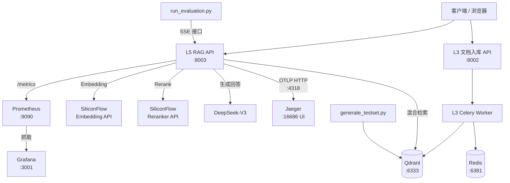

# L5：RAG 生产化（初级通关）

## 本关目标

在 L4 问答核心的基础上，为系统加入三个生产化能力：
- **可量化**：用 RAGAS 建立评估基线，数据说话
- **可观测**：OpenTelemetry → Jaeger 调用链，Prometheus + Grafana 监控大屏
- **可部署**：一条 `docker compose up` 启动完整 8 服务系统

通过本关，你的 RAG 系统从"能跑"变成"能上线"。

---

## 系统架构



---

## 新增内容（vs L4）

L5 在 L4 代码基础上新增三个模块，不改动已有检索/问答逻辑：

| 新文件 | 作用 |
|--------|------|
| `app/core/otel.py` | OTel 初始化：TracerProvider + OTLP 导出到 Jaeger |
| `app/core/metrics.py` | Prometheus 自定义指标（8 个） |
| `evaluation/generate_testset.py` | 自动生成 RAGAS 测试集 |
| `evaluation/run_evaluation.py` | 调用 RAG API → 计算 RAGAS 三指标 |
| `observability/` | Prometheus + Grafana 配置 |
| `docker-compose.yml` | 8 服务完整编排 |

---

## 核心一：OpenTelemetry 集成

### 为什么需要分布式追踪

RAG 请求经过 5+ 个阶段（改写→检索→Rerank→取父文档→LLM），出现性能问题时你需要知道时间花在哪里。OTel Trace 是分布式系统的"慢动作回放"。

### otel.py 实现

```python
from opentelemetry import trace
from opentelemetry.sdk.trace import TracerProvider
from opentelemetry.sdk.trace.export import BatchSpanProcessor
from opentelemetry.exporter.otlp.proto.http.trace_exporter import OTLPSpanExporter
from opentelemetry.sdk.resources import Resource
from opentelemetry.instrumentation.fastapi import FastAPIInstrumentor
from opentelemetry.instrumentation.httpx import HTTPXClientInstrumentor


def setup_otel(otlp_endpoint: str, service_name: str = "l5-rag") -> None:
    resource = Resource(attributes={"service.name": service_name})
    provider = TracerProvider(resource=resource)
    exporter = OTLPSpanExporter(endpoint=f"{otlp_endpoint.rstrip('/')}/v1/traces")
    provider.add_span_processor(BatchSpanProcessor(exporter))
    trace.set_tracer_provider(provider)
    # 自动追踪所有 httpx 调用（embedding/rerank/LLM 都用 httpx）
    HTTPXClientInstrumentor().instrument()


def instrument_app(app) -> None:
    # 必须在 app 对象创建后调用
    FastAPIInstrumentor.instrument_app(app)
```

**关键设计决策**：
- `setup_otel()` 在 `lifespan` 最开始调用（让后续所有组件初始化都被追踪）
- `instrument_app(app)` 在模块级 `app = FastAPI(...)` 创建后调用
- `HTTPXClientInstrumentor` 自动追踪对 SiliconFlow 的所有 API 调用，无需手动埋点

### rag_chain.py 手动埋点

```python
tracer = trace.get_tracer("l5-rag")

async def query_stream(self, query: str, tenant_id: str):
    # 根 span
    with tracer.start_as_current_span("rag.query") as root_span:
        root_span.set_attribute("query.text", query[:200])
        root_span.set_attribute("tenant_id", tenant_id)
        async for event in self._pipeline(query, tenant_id, s, root_span):
            yield event

async def _pipeline(self, ...):
    # 检索阶段 span
    with tracer.start_as_current_span("rag.hybrid_retrieve") as span:
        t0 = time.perf_counter()
        candidates = await self._retriever.retrieve(...)
        span.set_attribute("candidates", len(candidates))
        span.set_attribute("duration_ms", int((time.perf_counter() - t0) * 1000))
```

**注意**：`query_stream` 是 AsyncGenerator，不能直接在其中使用 `with tracer.start_as_current_span()`（generator yield 后 context 会断裂）。解决方案是拆分成两个方法：`query_stream` 管理根 span，`_pipeline` 是真正的 generator。

### Jaeger 中的 Trace 结构

```
rag.query
├── rag.query_rewrite   (仅短查询)
├── rag.hybrid_retrieve
├── rag.rerank
├── rag.parent_fetch
└── rag.llm_stream
```

---

## 核心二：Prometheus 指标

### metrics.py

```python
from prometheus_client import Counter, Histogram, Gauge

rag_queries_total = Counter(
    "rag_queries_total", "Total RAG queries",
    ["tenant_id", "result"]  # result: success / no_result / error
)

rag_retrieve_seconds = Histogram(
    "rag_retrieve_seconds", "Hybrid retrieval duration",
    buckets=[0.1, 0.25, 0.5, 1.0, 2.0, 5.0, 10.0]
)

rag_llm_seconds = Histogram(
    "rag_llm_seconds", "LLM stream duration",
    buckets=[1.0, 2.5, 5.0, 10.0, 20.0, 30.0, 60.0]
)

rag_tokens_total = Counter("rag_tokens_total", "Generated tokens", ["tenant_id"])
bm25_indexed_docs = Gauge("bm25_indexed_docs", "BM25 index size")
```

### /metrics 端点

```python
from prometheus_client import make_asgi_app

metrics_app = make_asgi_app()
app.mount("/metrics", metrics_app)
```

Prometheus 配置（`prometheus.yml`）中 target 填写 `l5-api:8003`，路径 `/metrics`，每 15 秒抓取一次。

### Grafana 预置面板

4 个核心面板（配置已预置，`docker compose up` 后自动出现）：

| 面板 | PromQL |
|------|--------|
| RAG QPS | `rate(rag_queries_total[1m]) * 60` |
| P99 端到端延迟 | `histogram_quantile(0.99, rate(rag_llm_seconds_bucket[5m]))` |
| 每分钟 Token 消耗 | `rate(rag_tokens_total[1m]) * 60` |
| 检索 P95 延迟 | `histogram_quantile(0.95, rate(rag_retrieve_seconds_bucket[5m]))` |

---

## 核心三：RAGAS 评估

### 为什么要自动化评估

"准确率有多少？"——这个问题不能靠人工感觉，必须有量化数据。RAGAS 使用 LLM-as-Judge 计算三项指标，可以定期运行形成基线。

### 三大指标含义

| 指标 | 含义 | 达标阈值 |
|------|------|---------|
| `faithfulness` | 回答中的每个陈述是否都能在检索到的上下文中找到依据（防幻觉） | ≥ 0.80 |
| `answer_relevancy` | 回答是否直接回答了问题（防答非所问） | ≥ 0.85 |
| `context_recall` | 正确答案所需的信息是否都被检索出来了（评估检索完整性） | ≥ 0.75 |

### 自动生成测试集

传统方法需要人工标注 QA 对，L5 的方案是从已入库的 parent chunks 中自动生成：

```python
GENERATE_PROMPT = """\
请仔细阅读以下文档片段，然后完成两个任务：
1. 提出一个可以从该片段中找到明确答案的具体问题
2. 给出该问题的简洁准确答案（基于片段内容，不超过 100 字）

严格按以下 JSON 格式输出，不要有任何其他文字：
{{"question": "...", "ground_truth": "..."}}

文档片段：
{text}
"""
```

运行：
```bash
uv run python evaluation/generate_testset.py --count 50
```

输出的 `testset.json` 格式：
```json
[
  {
    "question": "T3000 的额定输入电压是多少？",
    "ground_truth": "T3000 额定输入电压为 220V AC，频率 50/60Hz。",
    "reference_context": "T3000 型号额定输入电压为 220V AC...",
    "source": "产品手册_T3000.pdf",
    "page_num": 3
  }
]
```

### 运行评估

```bash
uv run python evaluation/run_evaluation.py --testset evaluation/testset.json
```

输出示例：
```
============================================================
RAGAS 评估结果
============================================================
  faithfulness              0.8312  （阈值 0.80）  ✓ 达标
  answer_relevancy          0.8897  （阈值 0.85）  ✓ 达标
  context_recall            0.7640  （阈值 0.75）  ✓ 达标
------------------------------------------------------------
  综合结论：全部达标 ✓
============================================================
```

---

## Docker Compose 完整部署

### 8 个服务

| 服务 | 镜像 | 端口 | 职责 |
|------|------|------|------|
| `qdrant` | qdrant/qdrant | 6333 | 向量数据库 |
| `redis` | redis:7-alpine | 6381 | Celery broker + 会话存储 |
| `l3-api` | 本地构建 | 8002 | 文档上传/查询 API |
| `l3-worker` | 本地构建 | — | 文档解析 Celery Worker |
| `l5-api` | 本地构建 | 8003 | RAG 问答 API |
| `jaeger` | jaegertracing/all-in-one | 16686/4318 | 分布式追踪 |
| `prometheus` | prom/prometheus | 9090 | 指标收集 |
| `grafana` | grafana/grafana | 3001 | 监控可视化 |

### 启动顺序依赖

```
qdrant (healthy)──→ l3-api
redis  (healthy)──→ l3-api, l3-worker
                    l3-worker
qdrant (healthy)──→ l5-api
jaeger (started)──→ l5-api
l5-api (healthy)──→ prometheus ──→ grafana
```

### 一键启动

```bash
cp .env.example .env
# 编辑 .env 填写 API Key

docker compose up -d
docker compose ps    # 确认所有服务 running
```

---

## 生产化最佳实践

### OTel 采样率

生产环境不要 100% 采样，否则 Jaeger 存储量爆炸：

```python
from opentelemetry.sdk.trace.sampling import TraceIdRatioBased

provider = TracerProvider(
    resource=resource,
    sampler=TraceIdRatioBased(0.1)  # 采样 10%
)
```

开发/测试时用 100%，生产时降到 5-10%。

### 指标 Histogram Buckets 要匹配业务

LLM 生成通常 5-30 秒，buckets 从 1.0 开始有意义；检索通常 0.1-2 秒，buckets 从 0.1 开始。默认 buckets `[0.005, 0.01, ...]` 对 LLM 场景毫无用处。

```python
# 好的实践
rag_llm_seconds = Histogram("rag_llm_seconds", "...",
    buckets=[1.0, 2.5, 5.0, 10.0, 20.0, 30.0, 60.0])

rag_retrieve_seconds = Histogram("rag_retrieve_seconds", "...",
    buckets=[0.1, 0.25, 0.5, 1.0, 2.0, 5.0, 10.0])
```

### RAGAS 评估成本

50 条测试集，RAGAS 内部每条调用 3-5 次 LLM（评估各指标），总计约 2-3 万 tokens。建议用便宜模型（DeepSeek-V3）做评判，避免用贵模型。

### Grafana 面板版本管理

把 `rag_overview.json` 提交 git，团队共享同一套监控视图。Grafana provisioning 机制会在容器启动时自动加载，无需手动导入。

---

## Python 语法要点

### OTel Context 与 AsyncGenerator

OTel Span 依赖 Python 的 contextvars 传递 trace context。普通 async 函数没问题，但 AsyncGenerator 在 `yield` 后 context 可能断裂：

```python
# 错误写法（context 可能断裂）
async def query_stream(self, query):
    with tracer.start_as_current_span("rag.query"):
        yield {"type": "status", "content": "检索中..."}  # yield 后 span context 断裂
        # 后续代码可能运行在错误的 context 中

# 正确写法（拆分成两个方法）
async def query_stream(self, query, tenant_id):
    # 这个方法管理 span 生命周期
    with tracer.start_as_current_span("rag.query") as root_span:
        async for event in self._pipeline(query, tenant_id, root_span):
            yield event

async def _pipeline(self, query, tenant_id, root_span):
    # 实际的 AsyncGenerator，在已建立的 span 内运行
    yield {"type": "status", ...}
    ...
```

### prometheus_client 多进程注意事项

`prometheus_client` 默认使用单进程收集器。如果要跑多个 uvicorn workers（`--workers 4`），需要额外配置多进程模式（设置 `PROMETHEUS_MULTIPROC_DIR` 环境变量）。L5 中为简单起见使用单 worker（`--workers 1`），生产高并发场景需要处理这个问题。

---

## 验收清单

```
□ docker compose up -d 启动全部 8 个容器
□ GET /health → {"status":"ok","service":"L5 RAG Production"}
□ GET /metrics → Prometheus 指标文本（含 rag_queries_total）
□ POST /api/v1/rag/query → SSE 流正常
□ Jaeger http://localhost:16686 → 能看到 rag.query trace（子 span 含耗时）
□ Grafana http://localhost:3001 → rag_overview 面板有实时数据
□ uv run python evaluation/generate_testset.py --count 10 → testset.json
□ uv run python evaluation/run_evaluation.py → RAGAS 三指标打印
□ 三项指标全部达标（Faithfulness ≥ 0.80，Answer Relevancy ≥ 0.85，Context Recall ≥ 0.75）
```

---

## 初级通关总结

L1 到 L5，你构建了一套完整的 RAG 知识库系统：

```
L1 统一 LLM 客户端
  ↓
L2 多轮对话接口（Redis 持久化）
  ↓
L3 文档入库流水线（PDF/DOCX → Qdrant）
  ↓
L4 RAG 问答核心（混合检索 + Rerank + LLM 流式回答）
  ↓
L5 生产化（RAGAS 评估 + OTel + Prometheus/Grafana + docker compose）
```

这不是玩具原型，是可以直接服务真实企业业务的 RAG 系统——有评估基线、有监控告警、一键部署、代码可维护。

**下一关 L6**：给系统加上"手"——工具调用（Function Calling），让 AI 不只会说话，还能真正去查订单、提工单、发通知。
