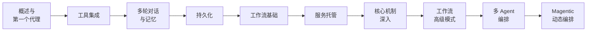

# Microsoft Agent Framework 实战笔记

面向 C#/.NET 开发者，系统记录 Microsoft Agent Framework（预览版）从概念到生产的全过程。内容基于官方文档与实际验证整理，重点在于讲清设计意图与落地边界，而非 API 罗列。

## 框架定位

Microsoft Agent Framework 是微软官方的 AI 代理应用开发框架，由 Semantic Kernel 与 AutoGen 团队合并而来，是两者的继任者。它把 LLM 封装为"能干活、能协作、能记住事、能走流程"的应用程序，并提供运行时支持托管与多代理通信。

新项目直接从 Agent Framework 起步，不必再从 AutoGen 或 Semantic Kernel 学起——两者均已进入维护模式。

## 学习路线

## 十篇笔记总览

### 入门篇：能跑起来

- [01 · 概述与第一个代理](01_概述.md) — 框架定位、核心抽象、Hello Agent
- [02 · 添加工具](02_添加工具.md) — Function Tools、工具类型、多工具协作
- [03 · 多轮对话](03_多轮对话.md) — Session、ChatHistoryProvider、流式对话
- [04 · 内存和持久化](04_内存和持久化.md) — 存储模式、Reducer、跨进程恢复

### 进阶篇：能编排

- [05 · 工作流基础](05_工作流.md) — 执行器、边缘、超级步骤、业务示例
- [06 · 服务托管](06_托管.md) — ASP.NET Core 托管、A2A 协议、Durable Extension

### 核心篇：懂原理

- [07 · 深入核心](07_深入核心.md) — Agent 类型体系、中间件、技能、上下文提供程序
- [08 · 工作流高级模式](08_工作流高级模式.md) — 状态、检查点、事件、人机循环

### 架构篇：能落地

- [09 · 多 Agent 编排模式](09_多Agent编排模式.md) — 顺序、并发、群组聊天、交接
- [10 · Magentic 编排](10_Magentic编排.md) — 动态规划、Manager Agent、计划评审

---

::: tip 阅读建议
每篇笔记包含**概念说明 + 代码示例 + 边界与陷阱**三部分，建议按顺序阅读，并配合官方 samples 动手验证。框架仍在预览阶段，API 可能调整，以官方文档为准。
:::
