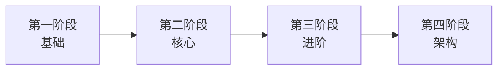

# AI 工程师 / Agent 工程师 实战手册

从零到生产，系统化掌握 LLM 应用开发与 Agent 系统工程。不是知识点罗列，而是一套可动手操作、可上生产的实战体系。

## 学习路线

---

## 四大阶段总览

### 第一阶段：基础

打通 LLM 开发的基础链路，能独立搭建一个可运行的 RAG 问答系统。

- [Python 异步编程与 FastAPI](01_基础阶段/01.Python异步与FastAPI.md)
- [LLM API 调用实践](01_基础阶段/02.LLM_API调用实践.md)
- [Prompt Engineering 系统指南](01_基础阶段/03.Prompt_Engineering.md)
- [基础 RAG 系统从零搭建](01_基础阶段/04.基础RAG系统搭建.md)
- [LangChain 入门实战](01_基础阶段/05.LangChain入门实战.md)

### 第二阶段：核心

掌握 Agent 系统的核心机制，能独立设计并部署生产可用的 Agent。

- [LangGraph Agent 设计与实战](02_核心阶段/01.LangGraph_Agent设计.md)
- [Function Calling 与工具集成](02_核心阶段/02.Function_Calling工具集成.md)
- [MCP 协议开发实战](02_核心阶段/03.MCP协议实战.md)
- [向量数据库深度实践](02_核心阶段/04.向量数据库深度实践.md)
- [RAG 评估体系建设](02_核心阶段/05.RAG评估体系.md)

### 第三阶段：进阶

掌握多智能体系统、模型微调与生产运维，能为 Agent 系统保驾护航。

- [多智能体系统设计](03_进阶阶段/01.多智能体系统设计.md)
- [Fine-tuning 微调实战](03_进阶阶段/02.Fine-tuning微调实战.md)
- [生产可观测性建设](03_进阶阶段/03.生产可观测性.md)
- [安全护栏设计](03_进阶阶段/04.安全护栏设计.md)

### 第四阶段：架构

系统级视角，能主导 AI 系统架构设计与技术决策。

- [自研 Agent 框架设计](04_架构阶段/01.自研Agent框架.md)
- [MLOps 体系建设](04_架构阶段/02.MLOps体系建设.md)
- [模型网关设计](04_架构阶段/03.模型网关设计.md)
- [AI 项目落地方法论](04_架构阶段/04.AI项目落地方法论.md)

---

::: tip 使用建议
每篇文档都包含**概念说明 + 代码实战 + 避坑指南**三部分，建议边读边跑代码。
:::
