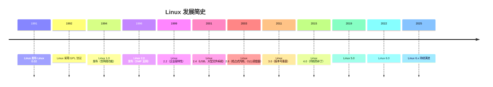
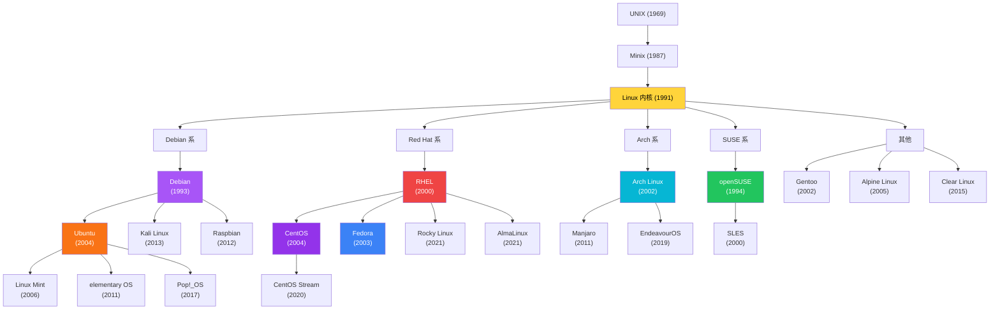
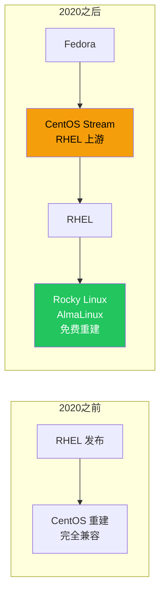
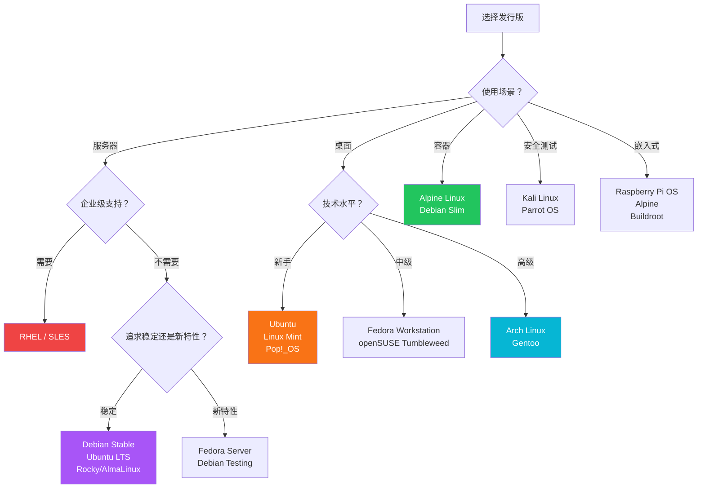
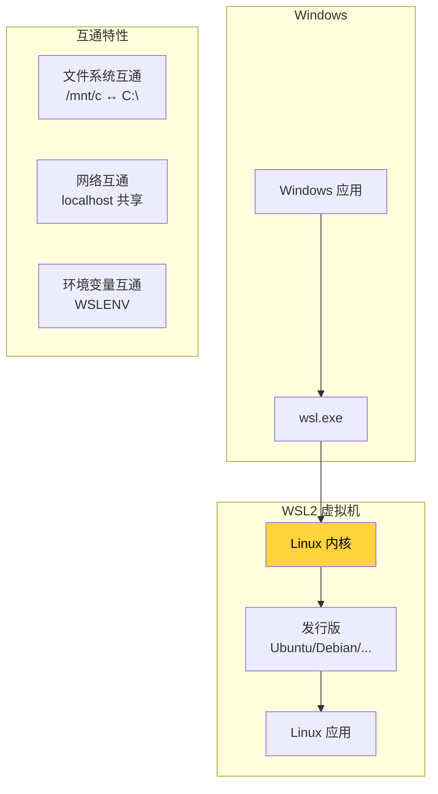
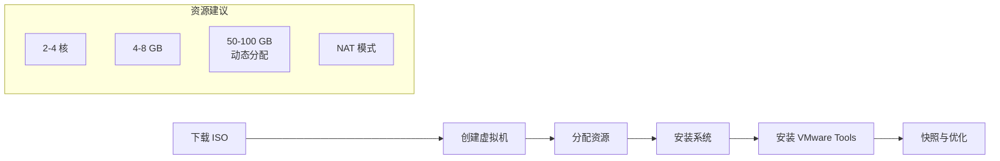
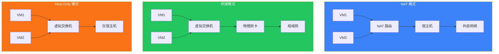
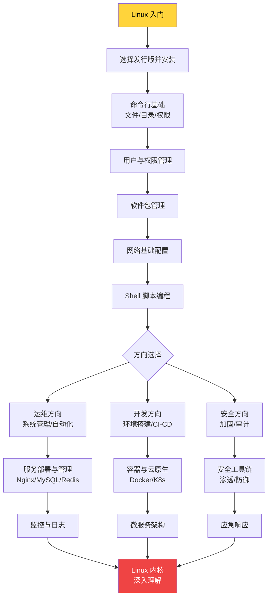

# Linux 概述与发行版

Linux 是当今世界运行范围最广的操作系统——从手机（Android）到超级计算机，从云服务器到物联网设备，无处不在。本文从 Linux 的诞生讲起，梳理 GNU/GPL 的自由软件精神，解析内核版本号规则，全景式对比主流发行版，并手把手带你完成 WSL2 与虚拟机的安装。

## 1. Linux 的诞生与历史

### 1.1 前传：UNIX 与 Minix

1969 年，Ken Thompson 和 Dennis Ritchie 在贝尔实验室创造了 **UNIX**，它奠定了现代操作系统的基本范式：文件一切皆文件、树状目录结构、管道与重定向、Shell 命令行。然而 UNIX 是商业软件，源码不公开，大学和爱好者无法自由使用和修改。

1987 年，Andrew S. Tanenbaum 教授为了教学目的编写了 **Minix**——一个微内核架构的类 UNIX 系统，代码仅有约 12,000 行，随教科书免费发布。Minix 让学生第一次能阅读一个真实操作系统的源码，但 Tanenbaum 教授坚持 Minix 只用于教学，拒绝加入更多功能。

::: important 历史转折
一个芬兰大学生对 Minix 的功能不足感到不满，决定自己写一个操作系统内核——这个人就是 Linus Torvalds。
:::

### 1.2 Linus Torvalds 与 Linux 的诞生

1991 年 8 月 25 日，Linus Torvalds 在 comp.os.minix 新闻组发布了那条著名的帖子：

> I'm doing a (free) operating system (just a hobby, won't be big and professional like gnu) for 386(486) AT clones.
>
> —— Linus Torvalds, 1991-08-25

当年 10 月，Linux 0.02 版本发布，仅支持 386 处理器，没有网络功能，只能运行 bash 和 gcc。但这个"业余爱好"迅速吸引了全球开发者的关注：



### 1.3 Linux vs Linux 内核 vs GNU/Linux

初学者经常混淆三个概念：

| 概念 | 含义 | 举例 |
|------|------|------|
| **Linux 内核** | 仅指 Linus 维护的操作系统内核 | 进程调度、内存管理、驱动程序 |
| **GNU 工具** | Richard Stallman 发起的自由软件项目 | bash、gcc、glibc、coreutils |
| **GNU/Linux** | 内核 + GNU 工具 + 其他软件的完整系统 | Ubuntu、CentOS、Debian |

::: tip 术语辨析
日常说"Linux"通常指 GNU/Linux 完整操作系统，而严格意义上的"Linux"只是内核。FSF（自由软件基金会）坚持使用"GNU/Linux"这一称呼，以强调 GNU 项目对自由操作系统的奠基性贡献。
:::

## 2. GNU 项目与 GPL 协议

### 2.1 GNU 项目

1983 年，Richard Stallman 发起了 **GNU**（GNU's Not Unix）项目，目标是创建一个完全自由的类 UNIX 操作系统。到 1991 年，GNU 项目已经开发了大部分组件——编译器（gcc）、C 库（glibc）、Shell（bash）、文本编辑器（Emacs）等，唯独缺少一个可用的内核（GNU Hurd 开发缓慢）。

Linux 内核恰好填补了这个空缺。GNU 工具 + Linux 内核 = 一个完整的自由操作系统。

### 2.2 GPL 协议

Linux 内核采用 **GPLv2**（GNU General Public License version 2）协议发布。GPL 的核心原则：


::: warning GPL 的"传染性"
GPL 被称为"传染性"许可：如果你的项目链接了 GPL 代码，整个项目也必须以 GPL 发布。这就是为什么许多商业公司对 GPL 敬而远之，而更倾向于使用 MIT、Apache 2.0 等宽松许可。
:::

### 2.3 常见开源协议对比

| 协议 | 类型 | 传染性 | 代表项目 |
|------|------|--------|----------|
| **GPLv2** | 强 Copyleft | 是 | Linux 内核 |
| **GPLv3** | 强 Copyleft | 是 | GCC |
| **LGPL** | 弱 Copyleft | 仅链接时 | glibc |
| **Apache 2.0** | 宽松 | 否 | Android、Kubernetes |
| **MIT** | 宽松 | 否 | jQuery、Rails |
| **BSD** | 宽松 | 否 | FreeBSD、Nginx |

## 3. Linux 内核版本号

### 3.1 版本号规则

Linux 内核版本号遵循 `主版本号.次版本号.修订号` 格式：

```
6.  1.  52
│   │   └── 修订号（Rev）：Bug 修复、安全补丁
│   └────── 次版本号（Minor）：新特性、驱动
└────────── 主版本号（Major）：架构性变更
```

::: info 历史版本号规则的变化
- **2.6 之前**：次版本号为奇数是开发版（如 2.5），偶数是稳定版（如 2.4）
- **2.6 之后**：取消了奇偶区分，改为时间驱动发布（约 2-3 个月一个大版本）
- **3.0 起**：Linus 认为次版本号太大没有实际意义，直接升主版本号
:::

### 3.2 查看当前内核版本

```bash
# 方法一：uname 命令
uname -r
# 输出：6.1.52-generic

# 方法二：查看 /proc/version
cat /proc/version
# 输出：Linux version 6.1.52-generic ...

# 方法三：hostnamectl（systemd 系统）
hostnamectl | grep Kernel
# 输出：Kernel: Linux 6.1.52-generic

# 查看完整系统信息
uname -a
# 输出：Linux hostname 6.1.52-generic #1 SMP ... x86_64 GNU/Linux
```

### 3.3 内核版本选择建议

| 场景 | 建议版本 | 理由 |
|------|----------|------|
| 个人桌面 | 最新稳定版 | 硬件兼容性最好 |
| 生产服务器 | LTS 长期支持版 | 稳定、持续安全更新 |
| 嵌入式设备 | 厂商适配版本 | 驱动兼容性 |
| 内核开发 | mainline 或 next | 获取最新特性 |

::: tip 如何判断 LTS 版本？
访问 [kernel.org](https://kernel.org)，LTS 版本会标注 "longterm" 标签及维护预计截止日期。例如 6.1 LTS 预计维护到 2026 年 12 月。
:::

## 4. 主流 Linux 发行版

Linux 内核只是操作系统的"心脏"，要成为可用的系统还需要 Shell、库、应用程序等。不同的组织将这些组件以不同方式组合打包，就形成了**发行版（Distribution，简称 Distro）**。

### 4.1 发行版家族树



### 4.2 Debian 系

#### Debian

Debian 是最古老的社区发行版之一，由 Ian Murdock 于 1993 年创建，以**稳定性**著称。

```bash
# Debian 版本代号以 Toy Story 角色命名
# bookworm (12) - 当前稳定版
# bullseye (11) - 旧稳定版
# trixie (13) - 测试版
# sid - 不稳定版（永不过期）
```

**特点：**
- 严格的软件包准入制度，稳定性极高
- dpkg/apt 包管理系统
- 三大分支：stable、testing、unstable（sid）
- 社区驱动，无商业公司控制

**适用场景：** 服务器、追求稳定的用户

::: important Debian 的"慢"
Debian stable 分支的软件版本通常比上游滞后 1-2 年，这是刻意的取舍——牺牲新特性换取极致稳定。如果你需要新版本的软件，可以使用 backports 仓库或 testing 分支。
:::

#### Ubuntu

Ubuntu 由 Canonical 公司于 2004 年基于 Debian 创建，目标是"让 Linux 对普通用户友好"。

```bash
# Ubuntu 版本号规则：年份.月份
# 24.04 LTS - 2024年4月发布
# 22.04 LTS - 2022年4月发布
# 每2年发布一个 LTS 版本

# 查看当前 Ubuntu 版本
lsb_release -a
# 或
cat /etc/os-release
```

**特点：**
- 每六个月发布一个版本，每两年一个 LTS（长期支持）
- LTS 版本提供 5 年安全更新
- PPA（Personal Package Archive）可获取新版本软件
- 丰富的官方文档和社区资源

**官方衍生版本：**

| 名称 | 桌面环境 | 定位 |
|------|----------|------|
| Ubuntu | GNOME | 主线版本 |
| Kubuntu | KDE Plasma | 华丽桌面 |
| Xubuntu | Xfce | 轻量 |
| Lubuntu | LXQt | 极轻量 |
| Ubuntu Mate | MATE | 传统风格 |
| Ubuntu Studio | KDE | 音视频创作 |

#### Kali Linux

基于 Debian Testing 的安全审计发行版，预装 600+ 渗透测试工具：

```bash
# Kali 只应在授权测试环境中使用
# 常用工具分类
nmap          # 网络扫描
metasploit    # 漏洞利用
wireshark     # 抓包分析
burpsuite     # Web 安全
aircrack-ng   # 无线安全
john          # 密码破解
```

::: warning 法律风险
Kali Linux 的工具必须在**获得授权**的情况下使用。未经许可对他人系统进行渗透测试是违法行为。初学者应在自己搭建的靶场环境中练习。
:::

### 4.3 Red Hat 系

#### RHEL（Red Hat Enterprise Linux）

Red Hat 公司的商业发行版，以**企业级支持**为核心价值：

- 订阅制收费（不是为软件本身付费，而是为支持服务付费）
- 10 年生命周期保证
- 严格的质量保证和认证流程
- 企业级技术支持（7×24）

#### CentOS 及其变局

CentOS 曾是 RHEL 的免费重建版，但在 2020 年 Red Hat 宣布了重大变更：



::: important CentOS Stream 是什么？
CentOS Stream 是 RHEL 的"上游"——它的软件包比 RHEL 更新，是 RHEL 发布前的测试场。这对开发者是好事（可以提前测试），但对需要 RHEL 100% 兼容的生产环境来说，Stream 带来了不确定性。
:::

**CentOS 替代方案：**

| 发行版 | 维护方 | 特点 |
|--------|--------|------|
| **Rocky Linux** | CIQ / 社区 | 创始人即原 CentOS 创始者 |
| **AlmaLinux** | CloudLinux / 社区 | 1:1 RHEL 兼容 |
| **Oracle Linux** | Oracle | 免费使用，可选付费支持 |

#### Fedora

Fedora 是 Red Hat 的技术试验场，每 6 个月发布一个版本：

```bash
# Fedora 版本
# 当前最新：Fedora 40/41
# 每个版本支持约 13 个月

# Fedora 的特色
# - 最新的 GNOME 桌面
# - DNF5 包管理器
# - SELinux 默认强制模式
# - Btrfs 默认文件系统（Workstation 版）
# - Silverblue（不可变桌面，rpm-ostree）
```

**特点：**
- 新技术首发地（Wayland、PipeWire、Btrfs 等均先在 Fedora 落地）
- 适合开发者和技术爱好者
- 软件版本较新，不适合追求稳定的生产服务器

### 4.4 Arch 系

#### Arch Linux

Arch Linux 以 **KISS**（Keep It Simple, Stupid）为哲学，提供极简的基础系统，一切由用户自行定制。

```bash
# Arch 的核心理念
# 1. 滚动更新：永远是最新的，没有版本号概念
# 2. 用户中心：系统完全由用户掌控
# 3. AUR：Arch User Repository，社区驱动的包仓库

# 安装 Arch（无图形安装器，纯命令行）
# 官方安装脚本
archinstall

# 手动安装步骤
# 1. 分区 + 格式化
# 2. pacstrap 安装基础系统
# 3. 配置 fstab / timezone / locale
# 4. 安装引导加载器（GRUB / systemd-boot）
# 5. 重启进入系统
```

**特点：**
- 滚动更新，软件永远是最新版
- Arch Wiki 是 Linux 世界最好的文档
- AUR 拥有几乎所有的软件包
- 需要一定的 Linux 基础

::: warning Arch 的"不稳定"
Arch 的滚动更新意味着某次 `pacman -Syu` 可能导致系统无法启动（俗称"滚挂"）。建议：
1. 更新前查看 Arch 官网首页的 News
2. 不要盲目执行 `pacman -Syu`，先了解变更内容
3. 定期备份重要数据
:::

#### Manjaro

基于 Arch 的"友好版"，降低了 Arch 的上手门槛：

- 提供图形安装器
- 延迟更新（比 Arch 晚 2-3 周，过滤掉有问题的更新）
- 预装驱动和常用软件
- 多种桌面环境选择

### 4.5 SUSE 系

#### openSUSE

openSUSE 有两个版本：

| 版本 | 更新策略 | 定位 |
|------|----------|------|
| **Leap** | 固定版本，基于 SLES | 稳定服务器 |
| **Tumbleweed** | 滚动更新 | 桌面/开发者 |

```bash
# openSUSE 的特色工具
# YaST - 全能系统管理工具（图形/命令行）
yast2

# Zypper 包管理器
zypper install <package>
zypper search <keyword>
zypper update
```

### 4.6 其他重要发行版

#### Alpine Linux

面向安全和轻量级的发行版，在容器领域广泛应用：

```bash
# Alpine 的特点
# - musl libc（替代 glibc）
# - BusyBox（替代 GNU coreutils）
# - OpenRC（替代 systemd）
# - 镜像仅约 5MB

# Docker 中使用 Alpine
docker run -it alpine:latest sh
# 容器内安装软件
apk add --no-cache curl vim
```

::: tip 为什么 Docker 镜像偏爱 Alpine？
Alpine 镜像仅 ~5MB，基于它的应用镜像通常只有几十 MB，而基于 Ubuntu/Debian 的镜像动辄数百 MB。但需注意 musl libc 与 glibc 的兼容性问题（如 DNS 解析行为、某些 C 扩展模块编译问题）。
:::

#### Gentoo

源码编译发行版，几乎所有软件都从源码编译：

```bash
# Gentoo 的包管理 - Portage
emerge --sync              # 同步软件仓库
emerge --ask vim            # 安装 vim（从源码编译）
emerge --update --deep @world  # 更新整个系统

# USE 标志控制编译选项
# /etc/portage/make.conf
USE="X gtk -qt5 -kde"  # 启用 GTK，禁用 Qt
```

## 5. 发行版选型指南

### 5.1 服务器 vs 桌面



### 5.2 关键对比维度

| 维度 | Ubuntu LTS | Debian Stable | RHEL/Rocky | Arch | Fedora |
|------|-----------|---------------|------------|------|--------|
| **稳定性** | ★★★★☆ | ★★★★★ | ★★★★★ | ★★★☆☆ | ★★★☆☆ |
| **软件新度** | ★★★☆☆ | ★★☆☆☆ | ★★☆☆☆ | ★★★★★ | ★★★★☆ |
| **易用性** | ★★★★★ | ★★★☆☆ | ★★★☆☆ | ★★☆☆☆ | ★★★★☆ |
| **文档丰富度** | ★★★★★ | ★★★★☆ | ★★★★★ | ★★★★★ | ★★★★☆ |
| **社区规模** | 最大 | 大 | 大 | 中 | 中 |
| **企业支持** | Canonical | 无 | Red Hat | 无 | 无 |
| **发布周期** | 2年(LTS) | ~2年 | 半年 | 滚动 | 半年 |

### 5.3 服务器选型实战建议

::: important 生产环境选型原则
1. **看团队技术栈**：团队熟悉什么就用什么，不要为了"更好"的发行版增加学习成本
2. **看软件兼容性**：某些商业软件只认证 RHEL/Ubuntu
3. **看 LTS 周期**：生产环境至少需要 5 年安全更新
4. **看云厂商支持**：AWS/Azure/GCP 对 Ubuntu/RHEL 有最深的集成
:::

```
# 快速判断：你的服务器该选什么？

1. 云上部署 Web 应用 → Ubuntu LTS（文档多、社区大、云厂商支持好）
2. 金融/政企合规要求 → RHEL（认证齐全、商业支持）
3. 预算有限但要 RHEL 兼容 → Rocky Linux / AlmaLinux
4. 追求极致稳定 → Debian Stable
5. 容器基础镜像 → Alpine（最小）/ Debian Slim（兼容性好）
```

## 6. WSL2 安装与使用

### 6.1 WSL2 简介

WSL2（Windows Subsystem for Linux 2）是微软在 Windows 10/11 中内置的 Linux 兼容层，它使用**真正的 Linux 内核**运行在一个轻量级虚拟机中。



### 6.2 安装 WSL2

```powershell
# 1. 一键安装（Windows 10 2004+ / Windows 11）
wsl --install

# 默认安装 Ubuntu，也可以指定发行版
wsl --install -d Debian
wsl --install -d Ubuntu-22.04

# 2. 查看可用发行版
wsl --list --online

# 3. 查看已安装的发行版
wsl --list --verbose
#  NAME            STATE       VERSION
#  Ubuntu          Running     2
#  Debian          Stopped     2

# 4. 设置默认发行版
wsl --set-default Ubuntu

# 5. 从 WSL1 升级到 WSL2
wsl --set-version Ubuntu 2
```

### 6.3 WSL2 基本使用

```bash
# 进入 WSL
wsl                          # 进入默认发行版
wsl -d Debian                # 进入指定发行版

# 从 Windows 命令行执行 Linux 命令
wsl ls -la /home
wsl cat /etc/os-release

# 在 WSL 中访问 Windows 文件
ls /mnt/c/Users/             # C 盘
ls /mnt/d/                   # D 盘

# 在 Windows 中访问 WSL 文件
# 资源管理器地址栏输入：
# \\wsl$\Ubuntu\home\

# 互操作性
# 从 WSL 调用 Windows 程序
notepad.exe /mnt/c/test.txt
explorer.exe .
code .                       # 用 VS Code 打开当前目录

# 从 Windows 调用 Linux 程序
# PowerShell 中：
wsl grep -r "pattern" /mnt/c/project/
```

### 6.4 WSL2 网络与文件系统

```bash
# WSL2 网络架构
# WSL2 使用虚拟网卡，与 Windows 不在同一网段

# 查看 WSL2 的 IP
ip addr show eth0

# 从 Windows 访问 WSL2 中的服务
# WSL2 自动将 localhost 端口转发到 Windows
# 在 WSL2 中启动服务：
python3 -m http.server 8080
# 在 Windows 浏览器访问：http://localhost:8080

# WSL2 配置文件
# /etc/wsl.conf（Linux 侧）
[boot]
systemd=true    # 启用 systemd（重要！）

[interop]
appendWindowsPath=false  # 不将 Windows PATH 添加到 Linux PATH

[network]
generateResolvConf=true

# %USERPROFILE%\.wslconfig（Windows 侧）
[wsl2]
memory=8GB       # 限制内存
processors=4     # 限制 CPU 核心数
swap=2GB         # 交换空间
localhostForwarding=true
```

::: warning WSL2 性能注意事项
1. **跨文件系统性能差**：在 `/mnt/c/` 下进行 git 操作比原生 Linux 文件系统慢 3-5 倍。项目文件应放在 Linux 文件系统（`/home/user/`）中
2. **内存占用**：WSL2 默认占用 Windows 50% 的内存，可通过 `.wslconfig` 限制
3. **重启 WSL**：`wsl --shutdown` 可完全关闭所有 WSL 实例
:::

### 6.5 WSL2 实用技巧

```bash
# 1. 启用 systemd（WSL2 较新版本支持）
# 编辑 /etc/wsl.conf
[boot]
systemd=true

# 重启后验证
systemctl list-unit-files --type=service

# 2. 使用 Windows Terminal
# 推荐使用 Windows Terminal，支持多标签、主题

# 3. Docker Desktop 集成
# Docker Desktop 可使用 WSL2 后端
# 安装后在 WSL2 中直接使用 docker 命令

# 4. 开机自启服务
# 启用 systemd 后，可以像原生 Linux 一样
sudo systemctl enable nginx
sudo systemctl start nginx

# 5. GPU 支持
# WSL2 支持 CUDA（NVIDIA GPU）
# 安装 NVIDIA 驱动后在 WSL2 中运行：
nvidia-smi
```

## 7. 虚拟机安装 Linux

### 7.1 虚拟化方案对比

| 方案 | 类型 | 性能 | 适用场景 |
|------|------|------|----------|
| **VMware Workstation** | Type-2 | ★★★★☆ | 桌面开发、功能丰富 |
| **VirtualBox** | Type-2 | ★★★☆☆ | 免费、跨平台 |
| **Hyper-V** | Type-1 | ★★★★☆ | Windows Pro/Enterprise |
| **KVM/QEMU** | Type-1 | ★★★★★ | Linux 宿主机、生产环境 |
| **Parallels Desktop** | Type-2 | ★★★★☆ | macOS 专用 |

::: tip Type-1 vs Type-2
- **Type-1（裸金属）**：Hypervisor 直接运行在硬件上，性能更好（KVM、Hyper-V、ESXi）
- **Type-2（托管）**：Hypervisor 运行在宿主操作系统上，更灵活（VMware、VirtualBox）
:::

### 7.2 VMware Workstation 安装 Ubuntu



#### 步骤详解

**1. 下载 ISO 镜像**

```bash
# Ubuntu 官方下载
# https://ubuntu.com/download/desktop

# 校验 ISO 完整性（重要！）
# Windows PowerShell
Get-FileHash Ubuntu-22.04-desktop-amd64.iso -Algorithm SHA256

# Linux / WSL
sha256sum Ubuntu-22.04-desktop-amd64.iso
```

**2. 创建虚拟机**

```
VMware Workstation 操作流程：
1. File → New Virtual Machine
2. 选择 "Typical" 或 "Custom"
3. 选择 ISO 镜像文件
4. 设置用户名和密码
5. 设置虚拟机名称和存储位置
6. 分配资源：
   - CPU：2-4 核心
   - 内存：4-8 GB
   - 硬盘：50 GB+（动态分配）
   - 网络：NAT 模式
7. 完成创建
```

**3. 安装后配置**

```bash
# 更新系统
sudo apt update && sudo apt upgrade -y

# 安装 VMware Tools（增强功能）
sudo apt install open-vm-tools open-vm-tools-desktop -y

# 安装基础开发工具
sudo apt install build-essential git curl vim -y

# 配置时区
sudo timedatectl set-timezone Asia/Shanghai

# 配置中文环境（可选）
sudo apt install language-pack-zh-hans -y
sudo update-locale LANG=zh_CN.UTF-8
```

### 7.3 VirtualBox 安装 CentOS Stream

```bash
# 1. 下载 CentOS Stream ISO
# https://www.centos.org/download/

# 2. VirtualBox 创建虚拟机
# - 类型：Linux → Red Hat (64-bit)
# - 内存：至少 2GB
# - 硬盘：至少 20GB

# 3. 重要设置
# - System → Processor → 启用 PAE/NX
# - Display → 显存 128MB
# - Network → 网卡1: NAT, 网卡2: Host-Only（可选）

# 4. 安装后配置

# 安装 VirtualBox 增强功能
sudo mount /dev/cdrom /mnt
sudo /mnt/VBoxLinuxAdditions.run

# 配置网络（CentOS Stream 9）
# 使用 NetworkManager
nmcli device status
nmcli connection show

# 启用 EPEL 仓库
sudo dnf install epel-release -y
```

### 7.4 虚拟机网络模式



| 模式 | VM→外网 | 外网→VM | VM↔VM | VM↔宿主机 | 使用场景 |
|------|---------|---------|-------|-----------|----------|
| **NAT** | ✅ | ❌（需端口转发） | ✅ | ✅ | 日常开发 |
| **桥接** | ✅ | ✅ | ✅ | ✅ | 需要外部访问 |
| **Host-Only** | ❌ | ❌ | ✅ | ✅ | 安全隔离 |

::: important 端口转发（NAT 模式）
如果需要在 NAT 模式下从宿主机访问虚拟机的服务，需要配置端口转发：

```
VMware: Edit → Virtual Network Editor → NAT Settings → Add
  Host Port: 8080 → VM Port: 80

VirtualBox: Settings → Network → Advanced → Port Forwarding
  Host Port: 8080 → Guest Port: 80
```
:::

### 7.5 虚拟机快照与克隆

```bash
# VMware 快照操作
# 创建快照
# VM → Snapshot → Take Snapshot（建议在安装完系统、配置好环境后创建）

# 恢复快照
# VM → Snapshot → Revert to Snapshot

# 克隆虚拟机
# VM → Manage → Clone
# - 链接克隆：节省空间，依赖原始虚拟机
# - 完整克隆：独立副本，占用更多空间

# VirtualBox 快照
# Machine → Tools → Snapshots
# 或命令行：
VBoxManage snapshot "VM_NAME" take "snapshot_name"
VBoxManage snapshot "VM_NAME" restore "snapshot_name"
```

## 8. 首次登录与基础操作

无论你选择哪种方式安装 Linux，首次登录后都应该完成以下基础配置：

### 8.1 系统信息确认

```bash
# 查看系统版本
cat /etc/os-release
# NAME="Ubuntu"
# VERSION="22.04.3 LTS (Jammy Jellyfish)"

# 查看内核版本
uname -r

# 查看磁盘使用
df -h

# 查看内存
free -h

# 查看 CPU 信息
lscpu

# 查看系统运行时间
uptime
```

### 8.2 基础安全配置

```bash
# 1. 更新系统
# Debian/Ubuntu
sudo apt update && sudo apt upgrade -y

# RHEL/CentOS
sudo dnf update -y

# 2. 配置防火墙
# Ubuntu (UFW)
sudo ufw enable
sudo ufw allow ssh
sudo ufw status

# CentOS (firewalld)
sudo systemctl enable --now firewalld
sudo firewall-cmd --add-service=ssh --permanent
sudo firewall-cmd --reload

# 3. 配置 SSH（如果需要远程访问）
sudo apt install openssh-server -y     # Debian/Ubuntu
sudo dnf install openssh-server -y     # RHEL/CentOS
sudo systemctl enable --now sshd

# 4. 创建普通用户（不要一直用 root！）
sudo adduser devuser
sudo usermod -aG sudo devuser    # Ubuntu
sudo usermod -aG wheel devuser   # CentOS
```

### 8.3 常用工具安装

```bash
# Debian/Ubuntu
sudo apt install -y \
    vim curl wget git \
    net-tools dnsutils \
    htop tree unzip \
    bash-completion

# RHEL/CentOS
sudo dnf install -y \
    vim curl wget git \
    net-tools bind-utils \
    htop tree unzip \
    bash-completion
```

## 9. 学习路线建议



::: tip 推荐学习资源
- **鸟哥的 Linux 私房菜**：中文世界最经典的 Linux 入门教材，适合系统学习
- **Linux 命令行与 Shell 脚本编程大全**：Shell 脚本入门必读
- **UNIX 环境高级编程（APUE）**：深入理解系统调用，进阶必读
- **The Linux Programming Interface**：Linux 系统编程权威指南
- **Arch Wiki**：即使不用 Arch，其文档质量也是 Linux 世界最佳
:::

## 10. 总结

| 知识点 | 关键内容 |
|--------|----------|
| Linux 历史 | Linus Torvalds 1991 年创建，与 GNU 项目互补 |
| GNU/GPL | 自由软件运动，GPL 具有传染性 |
| 内核版本号 | 主版本.次版本.修订号，生产环境选 LTS |
| Debian 系 | 稳定可靠，Ubuntu 对新手友好 |
| Red Hat 系 | 企业级首选，CentOS 已转型为 Stream |
| Arch 系 | 滚动更新，高度定制，文档一流 |
| 服务器选型 | 稳定优先，LTS 版本，团队熟悉度 |
| 桌面选型 | 新手选 Ubuntu/Mint，进阶选 Fedora/Arch |
| WSL2 | Windows 内置 Linux，开发体验好 |
| 虚拟机 | 学习和测试的最佳选择，善用快照 |

Linux 世界博大精深，不必纠结"哪个发行版最好"——选一个开始用就好。随着经验积累，你会发现发行版只是表面的差异，底层都是同一个 Linux 内核。真正重要的是理解操作系统的工作原理，这将让你在任何发行版上都游刃有余。
