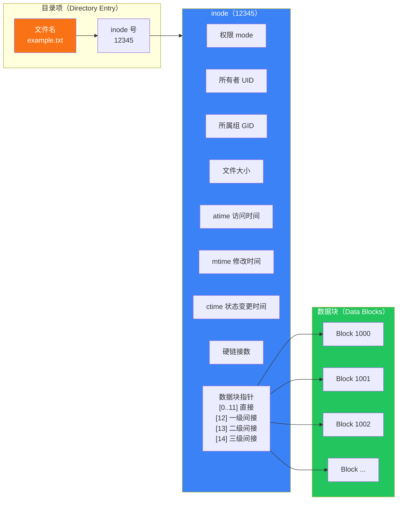
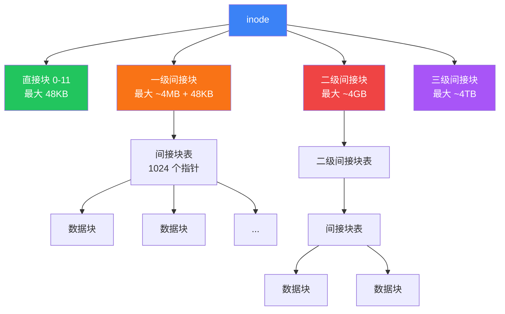
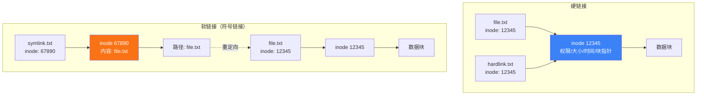

# 文件系统与目录结构

"在 Linux 中，一切皆文件"——这句话概括了 Linux 文件系统设计的核心理念。无论是普通文件、目录、设备、管道还是 Socket，都以文件的形式呈现在统一的目录树中。本文从 FHS 标准出发，逐层剖析每个目录的用途，深入 inode 与数据块的关系，讲透硬链接与软链接的本质区别。

## 1. "一切皆文件"的哲学

### 1.1 什么是"一切皆文件"

Linux 继承了 UNIX 的设计哲学：用统一的文件接口来访问所有资源。

```bash
# 普通文件
cat /etc/hostname

# 目录也是文件（存储了文件名与 inode 的映射）
ls -la /home

# 设备也是文件
cat /dev/null          # 黑洞设备
echo "hello" > /dev/tty   # 写入终端设备

# 进程信息也是文件
cat /proc/cpuinfo      # CPU 信息
cat /proc/meminfo      # 内存信息

# 网络连接也是文件
ls -la /proc/self/fd/  # 当前进程的文件描述符
# 0 -> stdin
# 1 -> stdout
# 2 -> stderr
```

### 1.2 文件类型标识

使用 `ls -l` 命令查看文件时，第一个字符表示文件类型：

```
-rw-r--r-- 1 root root 1234 Jun  4 10:00 example.txt
^
│
└── 文件类型标识符
```

| 标识 | 类型 | 说明 | 示例 |
|------|------|------|------|
| `-` | 普通文件 | 文本、二进制、图片等 | `file.txt`、`/bin/ls` |
| `d` | 目录文件 | 存储文件名与 inode 映射 | `/home`、`/etc` |
| `l` | 符号链接 | 指向另一个文件的路径 | `/usr/bin/python` → `python3` |
| `b` | 块设备 | 按块读写的设备 | `/dev/sda`（硬盘） |
| `c` | 字符设备 | 按字节读写的设备 | `/dev/tty`（终端） |
| `p` | 管道（FIFO） | 进程间通信 | `mkfifo /tmp/mypipe` |
| `s` | 套接字 | 网络通信 | `/var/run/docker.sock` |

```bash
# 查看文件类型
file /etc/passwd
# /etc/passwd: ASCII text

file /bin/ls
# /bin/ls: ELF 64-bit LSB executable

file /dev/sda
# /dev/sda: block special (8/0)

file /dev/null
# /dev/null: character special (1/3)

# 统计各类型文件数量
ls -la /dev | awk '{print $1}' | cut -c1 | sort | uniq -c | sort -rn
```

## 2. FHS 标准

### 2.1 什么是 FHS

**FHS**（Filesystem Hierarchy Standard，文件系统层次标准）定义了 Linux 系统中目录的结构和用途，由 Linux 基金会维护。FHS 的目标是让用户和程序能预测已安装文件和目录的位置。

```mermaid
flowchart TD
    ROOT["/ 根目录"] --> BIN["/bin<br/>基本用户命令"]
    ROOT --> SBIN["/sbin<br/>系统管理命令"]
    ROOT --> BOOT["/boot<br/>启动文件"]
    ROOT --> DEV["/dev<br/>设备文件"]
    ROOT --> ETC["/etc<br/>配置文件"]
    ROOT --> HOME["/home<br/>用户主目录"]
    ROOT --> ROOT_DIR["/root<br/>root 用户主目录"]
    ROOT --> LIB["/lib<br/>基本共享库"]
    ROOT --> MEDIA["/media<br/>可移动设备挂载"]
    ROOT --> MNT["/mnt<br/>临时挂载点"]
    ROOT --> OPT["/opt<br/>第三方软件"]
    ROOT --> PROC["/proc<br/>进程与内核信息"]
    ROOT --> SYS["/sys<br/>内核设备树"]
    ROOT --> SRV["/srv<br/>服务数据"]
    ROOT --> TMP["/tmp<br/>临时文件"]
    ROOT --> USR["/usr<br/>用户级程序与数据"]
    ROOT --> VAR["/var<br/>可变数据"]

    USR --> USR_BIN["/usr/bin"]
    USR --> USR_SBIN["/usr/sbin"]
    USR --> USR_LIB["/usr/lib"]
    USR --> USR_INCLUDE["/usr/include"]
    USR --> USR_SHARE["/usr/share"]
    USR --> USR_LOCAL["/usr/local<br/>本地编译安装"]

    VAR --> VAR_LOG["/var/log<br/>日志文件"]
    VAR --> VAR_CACHE["/var/cache<br/>缓存"]
    VAR --> VAR_LIB["/var/lib<br/>应用状态数据"]
    VAR --> VAR_SPOOL["/var/spool<br/>队列数据"]
    VAR --> VAR_MAIL["/var/mail<br/>用户邮件"]

    style ROOT fill:#ef4444,color:#fff
    style ETC fill:#3b82f6,color:#fff
    style USR fill:#22c55e,color:#fff
    style VAR fill:#f97316,color:#fff
    style PROC fill:#a855f7,color:#fff
```



### 2.2 FHS 的两大分类

FHS 将目录中的内容分为两大类：

| 分类 | 特征 | 可否共享 | 可否只读 | 代表目录 |
|------|------|----------|----------|----------|
| **可共享文件** | 可被网络中多台主机共用 | ✅ | ✅ | `/usr`、`/home`、`/var/mail` |
| **不可共享文件** | 仅限本机使用 | ❌ | 视情况 | `/etc`、`/var/run`、`/boot` |
| **静态文件** | 除非系统管理员操作，不会变化 | - | ✅ | `/bin`、`/lib`、`/usr/bin` |
| **可变文件** | 系统运行过程中会频繁变化 | - | ❌ | `/var/log`、`/home`、`/tmp` |

::: important 为什么区分可共享/不可共享？
在大型企业环境中，`/usr` 可以通过 NFS 共享给多台工作站，节省磁盘空间。而 `/etc` 包含每台机器独有的配置（如主机名、IP），不可共享。这种分类指导了网络文件系统的挂载策略。
:::

## 3. 核心目录详解

### 3.1 / 根目录

根目录是整个文件系统的起点，FHS 要求根目录下**必须**包含以下子目录：

```bash
# 根目录下的标准子目录
ls -la /
# drwxr-xr-x   - bin
# drwxr-xr-x   - boot
# drwxr-xr-x   - dev
# drwxr-xr-x   - etc
# drwxr-xr-x   - home
# drwxr-xr-x   - lib
# drwxr-xr-x   - media
# drwxr-xr-x   - mnt
# drwxr-xr-x   - opt
# drwxr-xr-x   - proc
# drwxr-xr-x   - root
# drwxr-xr-x   - sbin
# drwxr-xr-x   - srv
# drwxr-xr-x   - sys
# drwxr-xr-x   - tmp
# drwxr-xr-x   - usr
# drwxr-xr-x   - var
```

::: warning 根目录的设计原则
1. 根目录应尽量小——这样启动、恢复、修复更容易
2. 根分区应能在单用户模式下被挂载
3. 不要在根目录下随意创建文件或目录
:::

### 3.2 /etc —— 系统配置

`/etc` 是 Linux 中最重要的配置目录，几乎所有服务的配置文件都存放在此。

```bash
# 重要配置文件一览
/etc/passwd          # 用户账户信息
/etc/shadow          # 用户密码（加密后）
/etc/group           # 用户组信息
/etc/hostname        # 主机名
/etc/hosts           # 静态 DNS 映射
/etc/resolv.conf     # DNS 解析配置
/etc/fstab           # 文件系统挂载表
/etc/crontab         # 系统定时任务
/etc/sudoers         # sudo 权限配置
/etc/ssh/            # SSH 服务配置
/etc/nginx/          # Nginx 配置
/etc/systemd/        # systemd 配置
/etc/apt/            # APT 包管理配置
/etc/yum.repos.d/    # YUM 仓库配置
```

::: tip etymology
`/etc` 的 "etc" 不是 "et cetera"（等等）的缩写，而是早期 UNIX 中的 "et cetera directory"——存放"其他"不属于别处的配置文件。随着系统演进，它逐渐成为了专门的配置目录。
:::

```bash
# 配置文件编辑的最佳实践
# 1. 修改前备份
sudo cp /etc/ssh/sshd_config /etc/ssh/sshd_config.bak

# 2. 使用 visudo 编辑 sudoers（自动语法检查）
sudo visudo

# 3. 使用 systemctl edit 编辑 systemd 配置（自动创建 override）
sudo systemctl edit nginx

# 4. 验证配置语法
sudo nginx -t          # Nginx
sudo apachectl configtest  # Apache
sshd -t                # SSH
```

### 3.3 /var —— 可变数据

`/var` 存放在系统运行过程中不断变化的数据：日志、缓存、邮件、队列等。

```bash
# /var 目录结构
/var/log/             # 日志文件
/var/log/syslog       # 系统日志（Debian/Ubuntu）
/var/log/messages     # 系统日志（RHEL/CentOS）
/var/log/auth.log     # 认证日志
/var/log/kern.log     # 内核日志
/var/log/nginx/       # Nginx 日志

/var/cache/           # 应用缓存
/var/cache/apt/       # APT 包缓存
/var/cache/yum/       # YUM 包缓存

/var/lib/             # 应用持久状态数据
/var/lib/mysql/       # MySQL 数据
/var/lib/docker/      # Docker 数据
/var/lib/rpm/         # RPM 数据库

/var/spool/           # 队列数据
/var/spool/cron/      # 定时任务
/var/spool/mail/      # 邮件队列

/var/run/             # 运行时数据（PID 文件、Socket）→ 实际是 /run 的软链接
```

::: warning 日志文件管理
`/var/log` 是磁盘空间的"黑洞"。如果不加管理，日志文件会无限增长直到磁盘满。务必配置 **logrotate**：

```bash
# 查看 logrotate 配置
cat /etc/logrotate.conf

# 查看特定服务的日志轮转配置
ls /etc/logrotate.d/
# nginx  mysql  syslog  ...

# 手动触发轮转
sudo logrotate -f /etc/logrotate.d/nginx
```
:::

### 3.4 /usr —— 用户级程序

`/usr` 是第二大目录树，包含了用户级别的应用程序和文件。FHS 中有一个著名的说法："/usr is the second major section of the filesystem"。

```bash
# /usr 的结构（类似一个"次级根目录"）
/usr/bin/             # 用户命令
/usr/sbin/            # 非必需的系统管理命令
/usr/lib/             # 库文件
/usr/include/         # C/C++ 头文件
/usr/share/           # 架构无关的共享数据
/usr/share/doc/       # 文档
/usr/share/man/       # man 手册页
/usr/share/locale/    # 语言翻译文件
/usr/local/           # 本地编译安装的软件
/usr/local/bin/       # 本地安装的命令
/usr/local/lib/       # 本地安装的库
```

::: important /usr vs /usr/local
- `/usr` 中的文件由**包管理器**管理（apt/yum/dnf）
- `/usr/local` 中的文件由**本地管理员**管理（手动编译安装）
- 包管理器不会覆盖 `/usr/local` 中的文件，两者互不干扰
:::

```bash
# /usr/bin 与 /bin 的关系
# 在现代 Linux 中，/bin 通常是指向 /usr/bin 的软链接
ls -la /bin
# lrwxrwxrwx 1 root root 7 /bin -> usr/bin

ls -la /sbin
# lrwxrwxrwx 1 root root 8 /sbin -> usr/sbin

ls -la /lib
# lrwxrwxrwx 1 root root 7 /lib -> usr/lib

# 这是 "usr merge" 趋势
# Fedora 从 Fedora 17 开始合并
# Debian 从 Debian Bullseye 开始合并
```

### 3.5 /home —— 用户主目录

每个普通用户在 `/home` 下拥有一个以用户名命名的目录：

```bash
# 用户主目录
/home/alice/
/home/bob/

# 主目录下的隐藏配置文件（以 . 开头）
ls -la /home/alice/
# .bashrc          # Bash 配置
# .bash_profile    # Bash 登录配置
# .profile         # 通用登录配置
# .ssh/            # SSH 密钥和配置
# .config/         # XDG 配置目录
# .local/          # 用户级安装
# .local/bin/      # 用户级命令
# .cache/          # 用户级缓存

# root 用户的主目录不在 /home 下
echo $HOME    # root 用户：/root
echo $HOME    # 普通用户：/home/username
```

### 3.6 /proc —— 虚拟文件系统

`/proc` 是一个虚拟文件系统（procfs），不占用磁盘空间，内容由内核动态生成：

```bash
# 进程信息
/proc/self/           # 当前进程信息
/proc/1/              # PID=1 的进程（systemd/init）
/proc/PID/cmdline     # 进程启动命令
/proc/PID/environ     # 进程环境变量
/proc/PID/fd/         # 进程打开的文件描述符
/proc/PID/status      # 进程状态

# 内核信息
/proc/cpuinfo         # CPU 信息
/proc/meminfo         # 内存信息
/proc/version         # 内核版本
/proc/cmdline         # 内核启动参数
/proc/modules         # 已加载模块

# 系统信息
/proc/loadavg         # 负载均值
/proc/uptime          # 运行时间
/proc/mounts          # 挂载信息
/proc/partitions      # 分区信息
/proc/interrupts      # 中断信息
/proc/filesystems     # 支持的文件系统类型

# 可写接口（调整内核参数）
/proc/sys/vm/swappiness       # swap 倾向
/proc/sys/net/ipv4/ip_forward # IP 转发
```

```bash
# 实用示例

# 查看 CPU 型号
grep "model name" /proc/cpuinfo | head -1

# 查看内存使用
free -h    # 等同于读取 /proc/meminfo

# 查看进程打开了哪些文件
ls -la /proc/$(pidof nginx)/fd/

# 查看进程的环境变量
cat /proc/$(pidof nginx)/environ | tr '\0' '\n'

# 实时调整内核参数
sudo sysctl vm.swappiness=10     # 等同于写入 /proc/sys/vm/swappiness
```

::: warning /proc 文件的特殊性
1. `/proc` 中的文件大小显示为 0，但读取时有内容
2. 不要用文本编辑器直接编辑 `/proc/sys/` 下的文件，使用 `sysctl` 命令
3. `/proc/PID/` 目录在进程结束后自动消失
:::

### 3.7 /sys —— 内核设备树

`/sys`（sysfs）是 Linux 2.6 引入的虚拟文件系统，用于向用户空间导出内核对象（kobject）的层次结构：

```bash
# /sys 的结构
/sys/block/           # 块设备
/sys/bus/             # 设备总线
/sys/class/           # 设备按类别分类
/sys/class/net/       # 网络设备
/sys/class/block/     # 块设备
/sys/dev/             # 设备按主次设备号
/sys/devices/         # 所有设备的物理拓扑
/sys/fs/              # 文件系统参数
/sys/kernel/          # 内核参数
/sys/module/          # 已加载模块

# 实用示例

# 查看块设备信息
ls /sys/block/
# sda  sr0

# 查看网卡信息
ls /sys/class/net/
# eth0  lo

# 查看 CPU 频率（可调节）
cat /sys/devices/system/cpu/cpu0/cpufreq/scaling_cur_freq

# 查看电池状态（笔记本）
cat /sys/class/power_supply/BAT0/capacity
# 85
```

### 3.8 /dev —— 设备文件

```bash
# /dev 中的常见设备文件
/dev/sda              # 第一块 SCSI/SATA 硬盘
/dev/sda1             # 第一块硬盘的第一个分区
/dev/nvme0n1          # 第一块 NVMe SSD
/dev/nvme0n1p1        # NVMe SSD 的第一个分区
/dev/tty              # 当前终端
/dev/tty0~tty6        # 虚拟控制台
/dev/pts/0~           # 伪终端（SSH 远程登录）
/dev/null             # 黑洞（丢弃所有写入）
/dev/zero             # 零字节流
/dev/random           # 随机数（阻塞）
/dev/urandom          # 随机数（非阻塞）
/dev/loop0~           # 回环设备

# udev 规则
# /dev 下的设备文件由 udev 动态创建
# 自定义规则在 /etc/udev/rules.d/
```

```bash
# 实用操作

# 创建空文件（1GB）
dd if=/dev/zero of=test.img bs=1M count=1024

# 安全擦除磁盘
dd if=/dev/urandom of=/dev/sda bs=1M

# 丢弃输出
command > /dev/null 2>&1

# 生成随机密码
head -c 16 /dev/urandom | base64
```

### 3.9 其他目录

```bash
# /boot - 启动文件
/boot/vmlinuz-*       # 内核镜像
/boot/initramfs-*     # 初始 RAM 文件系统
/boot/grub/           # GRUB 引导加载器配置
/boot/efi/            # EFI 系统分区（UEFI 启动）

# /tmp - 临时文件
# 所有用户可写，系统重启时通常清空
# 现代 Linux 使用 tmpfs（内存文件系统）
df -T /tmp
# 文件系统    类型   ...
# tmpfs      tmpfs  ...

# /opt - 第三方软件
# 独立安装的商业软件
/opt/google/chrome/
/opt/cuda/

# /srv - 服务数据
# 此目录存放服务相关的数据（较少使用）
/srv/www/            # Web 数据
/srv/ftp/            # FTP 数据

# /media - 可移动设备自动挂载
/media/username/USB_DRIVE/

# /mnt - 临时手动挂载
sudo mount /dev/sdb1 /mnt/usb
```

## 4. 绝对路径与相对路径

### 4.1 路径类型

```bash
# 绝对路径：从根目录 / 开始的完整路径
/etc/passwd
/home/alice/.bashrc
/usr/local/bin/python3

# 相对路径：从当前目录开始的路径
cd Documents/         # 进入当前目录下的 Documents
cd ..                 # 返回上级目录
cd ../..              # 返回上两级目录
cd ./scripts/         # 当前目录下的 scripts（./ 可省略）

# 特殊路径
.                     # 当前目录
..                    # 上级目录
~                     # 当前用户主目录
~-                    # 上一次所在目录
```

### 4.2 路径操作命令

```bash
# pwd - 显示当前绝对路径
pwd
# /home/alice/projects

# cd - 切换目录
cd /etc               # 绝对路径
cd ssh                # 相对路径
cd ~                  # 回到主目录
cd -                  # 回到上一次目录

# realpath - 获取真实路径（解析符号链接）
realpath /usr/bin/python
# /usr/bin/python3.10

# dirname - 获取目录部分
dirname /etc/nginx/nginx.conf
# /etc/nginx

# basename - 获取文件名部分
basename /etc/nginx/nginx.conf
# nginx.conf

# readlink - 读取符号链接目标
readlink -f /usr/bin/python
# /usr/bin/python3.10  (-f 递归解析所有链接)
```

### 4.3 PATH 环境变量

```bash
# PATH 决定了 Shell 在哪些目录中搜索命令
echo $PATH
# /usr/local/bin:/usr/bin:/bin:/usr/sbin:/sbin

# 查看命令的位置
which python3
# /usr/bin/python3

whereis nginx
# nginx: /usr/sbin/nginx /etc/nginx /usr/share/nginx

# 临时添加 PATH
export PATH="/opt/bin:$PATH"

# 永久添加（写入 ~/.bashrc 或 ~/.profile）
echo 'export PATH="/opt/bin:$PATH"' >> ~/.bashrc
source ~/.bashrc
```

::: important PATH 的安全风险
永远不要将 `.`（当前目录）放在 PATH 的前面！否则攻击者可以在常用目录放置恶意程序，当你执行 `ls` 时实际运行的是恶意脚本。这就是为什么 Linux 不像 Windows 那样在当前目录搜索可执行文件。
:::

## 5. inode 与数据块

### 5.1 inode 是什么

**inode**（index node，索引节点）是文件系统中最核心的数据结构。每个文件（包括目录）都有一个唯一的 inode，存储了文件的**元数据**（除文件名和文件内容之外的所有信息）。



### 5.2 inode 包含的信息

| 信息 | 说明 | 查看命令 |
|------|------|----------|
| 文件权限 | rwx 权限位 | `ls -l` |
| 所有者 UID | 文件属主 | `ls -l -n` |
| 所属组 GID | 文件属组 | `ls -l -n` |
| 文件大小 | 字节数 | `ls -l` |
| 时间戳 | atime/mtime/ctime | `stat` |
| 硬链接数 | 指向此 inode 的目录项数 | `ls -l` 第二列 |
| 数据块指针 | 直接/间接指针 | `debugfs` |
| **不包含** | **文件名** | 文件名存在目录项中 |

```bash
# 查看 inode 信息
stat example.txt
#   File: example.txt
#   Size: 1234            Blocks: 8          IO Block: 4096   regular file
# Device: 802h/2050d      Inode: 12345       Links: 1
# Access: (0644/-rw-r--r--)  Uid: ( 1000/  alice)   Gid: ( 1000/  alice)
# Access: 2024-06-04 10:00:00.000000000 +0800
# Modify: 2024-06-04 09:30:00.000000000 +0800
# Change: 2024-06-04 09:30:00.000000000 +0800
#  Birth: 2024-06-01 08:00:00.000000000 +0800

# 查看 inode 号
ls -i example.txt
# 12345 example.txt

# 查看文件系统的 inode 使用情况
df -i
# Filesystem      Inodes  IUsed   IFree IUse% Mounted on
# /dev/sda1      1310720  82345 1228375    7% /

# 通过 inode 号查找文件（在当前文件系统中）
find / -inum 12345 2>/dev/null
```

### 5.3 inode 的大小与数量

```bash
# 查看 inode 大小和数量
sudo dumpe2fs -h /dev/sda1 | grep -i inode
# Inode count:              1310720
# Inodes per group:         8192
# Inode size:               256

# ext4 的 inode 大小通常是 256 字节
# xfs 的 inode 大小通常也是 256 字节，动态分配
```

::: warning inode 耗尽
每个文件系统创建时分配了固定数量的 inode（ext4），如果小文件太多，即使磁盘空间充足，也会因为 inode 用完而无法创建新文件：

```bash
# 磁盘空间还有，但无法创建文件
touch newfile.txt
# touch: cannot touch 'newfile.txt': No space left on device

# 检查 inode 使用率
df -i
# 如果 IUse% 接近 100%，需要删除无用文件

# 查找大量小文件
find /var -type f | wc -l
```
:::

### 5.4 数据块寻址

ext4 文件系统使用多级间接寻址来支持大文件：



::: tip ext4 的 extents
现代 ext4 使用 **extents** 替代传统的间接块映射。一个 extent 描述一段连续的块区间（如"块 1000-2000"），比逐块映射高效得多。对于大文件的顺序写入，extents 可以显著减少元数据开销。
:::

## 6. 硬链接与软链接

### 6.1 链接类型对比



### 6.2 硬链接

硬链接是同一个 inode 的多个目录项——它们指向完全相同的底层数据。

```bash
# 创建硬链接
ln original.txt hardlink.txt

# 验证：两个文件名指向同一个 inode
ls -li original.txt hardlink.txt
# 12345 -rw-r--r-- 2 alice alice 100 Jun 4 10:00 hardlink.txt
# 12345 -rw-r--r-- 2 alice alice 100 Jun 4 10:00 original.txt
# ^^^^^ inode 号相同
#                    ^ 硬链接数变为 2

# 删除原文件，硬链接仍然可以访问数据
rm original.txt
cat hardlink.txt    # ✅ 数据仍然存在

# 修改硬链接 = 修改原文件（因为同一个 inode）
echo "new content" >> hardlink.txt
# 原文件（如果还存在）也会看到新内容
```

**硬链接的限制：**
1. 不能跨文件系统（因为 inode 号在不同文件系统中可能重复）
2. 不能对目录创建硬链接（防止目录环）
3. 只有删除所有硬链接（链接数归零），数据块才会被释放

```bash
# 尝试对目录创建硬链接
ln /home /home_link
# ln: /home: hard link not allowed for directory

# 为什么不允许？
# 如果允许目录硬链接，可能形成环：
# /home/link -> /  -> home -> link -> / -> ...
# 这会导致 find、du 等递归操作死循环
```

### 6.3 软链接（符号链接）

软链接是一个独立的文件，内容是另一个文件的**路径**。

```bash
# 创建软链接
ln -s /usr/local/bin/python3 /usr/local/bin/python

# 查看软链接
ls -la /usr/local/bin/python
# lrwxrwxrwx 1 alice alice 20 ... python -> /usr/local/bin/python3

# 软链接有自己的 inode
ls -li /usr/local/bin/python /usr/local/bin/python3
# 67890 lrwxrwxrwx 1 alice alice 20 ... python -> /usr/local/bin/python3
# 12345 -rwxr-xr-x 1 alice alice 8760 ... python3
# ^^^^^ inode 号不同

# 删除原文件，软链接变成"悬空链接"
rm /usr/local/bin/python3
ls -la /usr/local/bin/python
# lrwxrwxrwx 1 alice alice 20 ... python -> /usr/local/bin/python3
cat /usr/local/bin/python
# cat: /usr/local/bin/python: No such file or directory
```

**软链接的特点：**
1. 可以跨文件系统
2. 可以对目录创建软链接
3. 原文件删除后，软链接失效（悬空链接）
4. 软链接有自己的权限，但实际访问权限由目标文件决定

```bash
# 常见软链接使用场景

# 1. 版本管理
ln -s /usr/local/python3.11 /usr/local/python3
# 升级时只需修改软链接

# 2. 兼容性映射
ln -s /usr/bin/python3 /usr/bin/python

# 3. 目录快捷方式
ln -s /var/log/nginx /home/alice/nginx-logs

# 4. 多版本共存
ls -la /etc/alternatives/
# 系统通过 alternatives 机制管理软链接
sudo update-alternatives --config java
```

### 6.4 硬链接 vs 软链接完整对比

| 特性 | 硬链接 | 软链接 |
|------|--------|--------|
| inode | 与原文件相同 | 独立的 inode |
| 跨文件系统 | ❌ | ✅ |
| 链接目录 | ❌ | ✅ |
| 原文件删除后 | 仍可访问数据 | 变为悬空链接 |
| 文件大小 | 与原文件相同 | 路径字符串长度 |
| 权限显示 | 与原文件相同 | lrwxrwxrwx（777） |
| 创建命令 | `ln` | `ln -s` |
| 查找指向同一 inode 的文件 | `find -samefile` | `readlink` |

```bash
# 查找所有指向同一 inode 的硬链接
find / -samefile original.txt 2>/dev/null

# 查找悬空的软链接
find / -type l ! -exec test -e {} \; -print 2>/dev/null

# 批量创建软链接
for dir in conf data logs; do
    ln -s /opt/app/$dir /var/app/$dir
done
```

## 7. 常用文件系统命令

### 7.1 df —— 磁盘使用情况

```bash
# 基本用法
df                    # 所有文件系统
df -h                 # 人类可读格式
df -T                 # 显示文件系统类型
df -i                 # 显示 inode 使用情况

# 输出示例
df -hT
# Filesystem     Type   Size  Used Avail Use% Mounted on
# /dev/sda1      ext4   100G   45G   51G  47% /
# /dev/sda2      ext4   500G  230G  246G  49% /home
# tmpfs          tmpfs  7.8G  1.2M  7.8G   1% /tmp

# 只看特定文件系统
df -h /home
df -h -t ext4        # 只看 ext4

# 排除虚拟文件系统
df -h -x tmpfs -x devtmpfs
```

### 7.2 du —— 目录空间占用

```bash
# 基本用法
du                    # 当前目录下所有子目录大小
du -h                 # 人类可读格式
du -sh                # 只显示总计
du -sh *              # 当前目录下各项目大小
du --max-depth=1      # 只显示一级子目录

# 输出示例
du -sh /var/*
# 4.0K    /var/backups
# 2.3G    /var/cache
# 1.5G    /var/lib
# 256M    /var/log

# 排序找出最大的目录
du -sh /var/* | sort -rh | head -10

# 排除某些目录
du -sh --exclude='*.iso' /home/

# 查看指定目录的总大小
du -sh /var/log
```

### 7.3 ls —— 列出目录内容

```bash
# 常用选项组合
ls -la                # 所有文件（含隐藏）+ 详细信息
ls -lh                # 人类可读的文件大小
ls -lS                # 按文件大小排序
ls -lt                # 按修改时间排序
ls -lr                # 逆序
ls -li                # 显示 inode 号
ls -lR                # 递归列出子目录

# 查看文件类型标识
ls -la /dev
# crw-rw-rw-  1 root root 1, 3 ... /dev/null
# brw-rw----  1 root disk 8, 0 ... /dev/sda
#  ^                   ^
#  文件类型         设备号（主, 次）

# 查看软链接
ls -la /usr/bin/python*
# lrwxrwxrwx 1 root root 9 ... python -> python3.10

# 按时间排序查看最近修改的文件
ls -lt /etc/ | head -10
```

### 7.4 其他文件系统相关命令

```bash
# tree - 以树形结构显示目录
tree /etc/nginx           # 显示 nginx 配置树
tree -L 2 /               # 只显示 2 层
tree -d /var              # 只显示目录
tree -h -F /opt           # 显示大小和类型标识

# file - 检测文件类型
file /etc/passwd
# /etc/passwd: ASCII text

file /usr/bin/ls
# /usr/bin/ls: ELF 64-bit LSB pie executable

file /dev/sda
# /dev/sda: block special (8/0)

# stat - 显示文件详细元数据
stat /etc/passwd
#   File: /etc/passwd
#   Size: 2765            Blocks: 8          IO Block: 4096   regular file
# Device: 802h/2050d      Inode: 131073      Links: 1
# Access: (0644/-rw-r--r--)  Uid: (    0/    root)   Gid: (    0/    root)
# Access: 2024-06-04 10:00:00.000000000 +0800
# Modify: 2024-05-20 08:30:00.000000000 +0800
# Change: 2024-05-20 08:30:00.000000000 +0800

# ln - 创建链接
ln target hardlink        # 硬链接
ln -s target symlink      # 软链接
ln -sf target symlink     # 强制覆盖已有软链接
ln -snf target symlink    # 强制覆盖，不解引用目标（替换目录软链接）

# find - 查找文件
find / -name "*.conf" 2>/dev/null
find /var -size +100M       # 大于 100MB 的文件
find /tmp -mtime +7         # 7天前修改的文件
find / -type l -xtype l     # 查找悬空软链接
```

## 8. 文件系统类型

### 8.1 常见文件系统对比

| 文件系统 | 最大文件 | 最大分区 | 日志 | 适用场景 |
|----------|----------|----------|------|----------|
| **ext4** | 16TB | 1EB | ✅ | 通用，Linux 默认 |
| **xfs** | 8EB | 8EB | ✅ | 大文件、高性能 |
| **btrfs** | 16EB | 16EB | ✅ | 快照、校验、子卷 |
| **zfs** | 16EB | 256万亿ZB | ✅ | 数据完整性、RAID |
| **vfat** | 4GB | 2TB | ❌ | U 盘、EFI 分区 |
| **ntfs** | 16EB | 16EB | ✅ | Windows 兼容 |
| **tmpfs** | - | - | ❌ | 内存文件系统 |
| **overlayfs** | - | - | - | 容器层叠 |

```bash
# 查看已挂载的文件系统类型
df -T

# 查看支持的文件系统类型
cat /proc/filesystems

# 创建文件系统（格式化）
sudo mkfs.ext4 /dev/sdb1       # 格式化为 ext4
sudo mkfs.xfs /dev/sdb1        # 格式化为 xfs
sudo mkfs.vfat -F 32 /dev/sdb1 # 格式化为 FAT32

# 挂载文件系统
sudo mount /dev/sdb1 /mnt/data
sudo mount -t ext4 /dev/sdb1 /mnt/data

# 卸载
sudo umount /mnt/data
```

### 8.2 /etc/fstab —— 开机自动挂载

```bash
# /etc/fstab 格式
# <设备>        <挂载点>  <文件系统>  <挂载选项>  <dump>  <pass>
/dev/sda1       /         ext4        defaults    0       1
/dev/sda2       /home     ext4        defaults    0       2
UUID=xxxx-xxxx  /data     xfs         defaults    0       2
tmpfs           /tmp      tmpfs       defaults,nosuid,nodev  0  0

# 使用 UUID 挂载（推荐，比设备名更稳定）
blkid /dev/sda1
# /dev/sda1: UUID="a1b2c3d4-e5f6-7890-abcd-ef1234567890" TYPE="ext4"

# 查看当前挂载信息
mount | column -t
findmnt                        # 树形显示
cat /etc/mtab                  # 与 mount 输出相同
```

::: important fstab 编辑注意事项
1. 使用 `UUID=` 而非 `/dev/sdX`——设备名在重启后可能变化（尤其是 USB 磁盘）
2. 修改 fstab 后务必测试：`sudo mount -a`（挂载 fstab 中所有条目）
3. 错误的 fstab 可能导致系统无法启动——编辑前先备份
4. 根分区的 `pass` 设为 1，其他分区设为 2，表示 fsck 检查顺序
:::

## 9. 实战案例

### 9.1 磁盘空间满排查

```bash
# 步骤1：查看磁盘使用
df -h
# /dev/sda1  50G  48G  0  100% /

# 步骤2：找出大文件/目录
sudo du -sh /* | sort -rh | head -10
# 30G     /var
# 15G     /home
# 2G      /usr

# 步骤3：逐级深入
sudo du -sh /var/* | sort -rh | head -10
# 28G     /var/log

sudo du -sh /var/log/* | sort -rh | head -10
# 27G     /var/log/nginx/access.log

# 步骤4：处理大日志文件
# ❌ 错误做法：直接 rm 后磁盘空间可能不释放（进程仍持有文件句柄）
# ✅ 正确做法：
sudo truncate -s 0 /var/log/nginx/access.log
# 或者
> /var/log/nginx/access.log

# 步骤5：验证
df -h
```

::: warning rm 不释放空间？
当一个进程正在写入日志文件时，即使你 `rm` 了文件，磁盘空间也不会释放——因为进程仍持有该文件的文件描述符。解决方法：

```bash
# 方法1：截断文件
> /var/log/nginx/access.log

# 方法2：重启写入该文件的进程
sudo systemctl restart nginx

# 方法3：查找持有已删除文件的进程
sudo lsof | grep deleted
# nginx  1234  root  5w  REG  8,1  27000000000  12345 /var/log/nginx/access.log (deleted)

# 然后重启该进程
sudo systemctl restart nginx
```
:::

### 9.2 inode 耗尽排查

```bash
# 现象：磁盘有空间但无法创建文件
df -h    # 有空间
df -i    # inode 100%

# 查找大量小文件
sudo find /var -type f | wc -l
# 5,000,000

# 找出文件最多的目录
sudo find / -xdev -printf '%h\n' | sort | uniq -c | sort -rn | head -20

# 典型原因：
# 1. /var/spool/clientmqueue（cron 邮件堆积）
# 2. /tmp/session_*（PHP session 文件）
# 3. /var/cache/（缓存文件堆积）

# 清理
sudo find /var/spool/clientmqueue -type f -delete
```

### 9.3 软链接维护

```bash
# 查找系统中的悬空链接
find /usr -type l ! -exec test -e {} \; -print 2>/dev/null

# 批量修复 Java 软链接
sudo update-alternatives --install /usr/bin/java java /usr/lib/jvm/java-17/bin/java 1
sudo update-alternatives --config java

# 替换目录软链接（原子操作）
# ❌ 错误：先删后建，中间有窗口期
rm /opt/app/current
ln -s /opt/app/v2 /opt/app/current

# ✅ 正确：使用 ln -snf
ln -snf /opt/app/v2 /opt/app/current

# ✅ 更安全：使用 mv -T（原子替换）
ln -s /opt/app/v2 /opt/app/current.tmp
mv -Tf /opt/app/current.tmp /opt/app/current
```

## 10. 总结

| 知识点 | 关键内容 |
|--------|----------|
| 一切皆文件 | 统一接口访问普通文件、设备、管道、Socket |
| FHS 标准 | 定义目录结构与用途，/etc /var /usr /proc /sys |
| /etc | 系统配置文件中心 |
| /var | 可变数据（日志、缓存、队列） |
| /usr | 用户级程序，/usr/local 是本地编译安装 |
| /proc | 虚拟文件系统，内核与进程信息 |
| /sys | 内核设备树，硬件拓扑 |
| inode | 文件元数据（权限、时间、块指针），不含文件名 |
| 硬链接 | 同一 inode 的多个目录项，不能跨文件系统 |
| 软链接 | 独立文件存储路径，可跨文件系统 |
| df -i | 检查 inode 使用情况 |
| du -sh | 检查目录空间占用 |

理解 Linux 文件系统是掌握 Linux 的基础。无论是排查磁盘满问题、理解权限模型，还是管理链接和挂载，都离不开对目录结构和 inode 的深入理解。正如鸟哥在《Linux 私房菜》中所说："Linux 最重要的就是文件系统，搞懂了文件系统，Linux 就学通了一半。"
