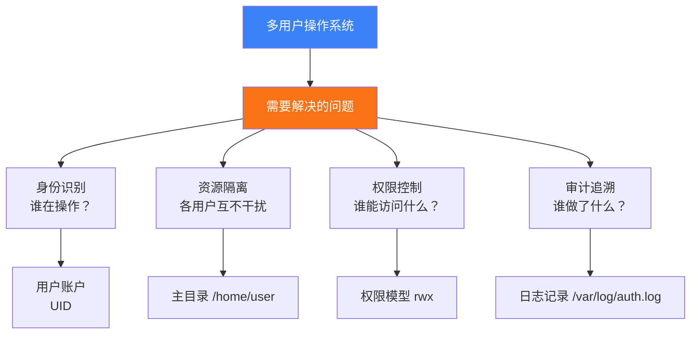
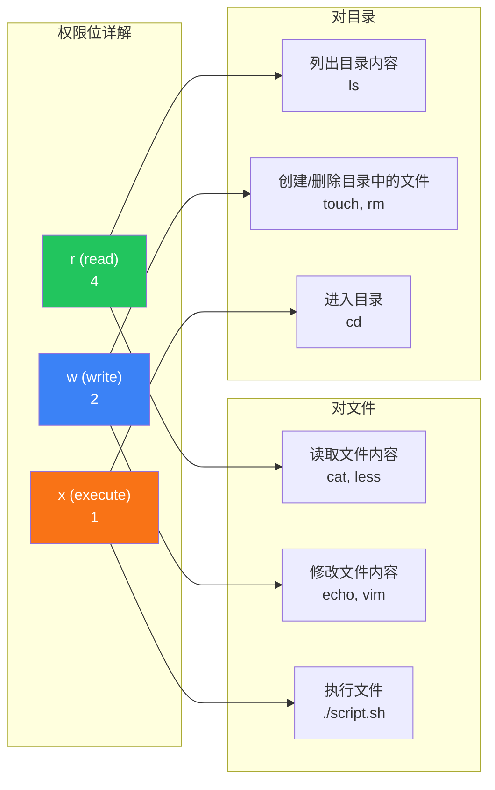
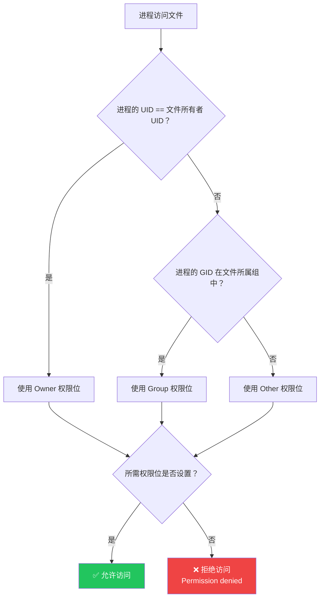
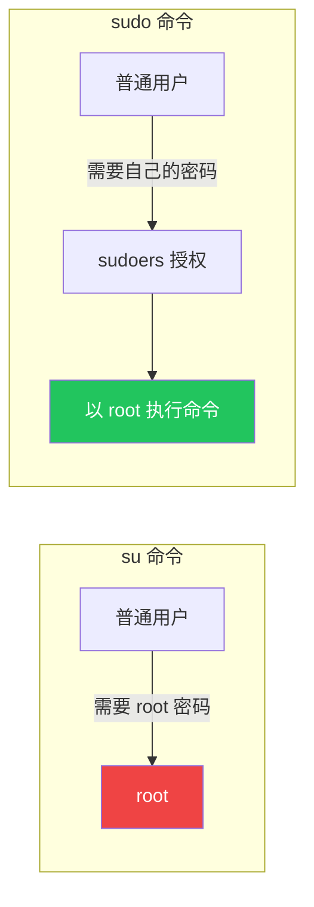
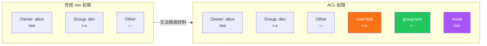
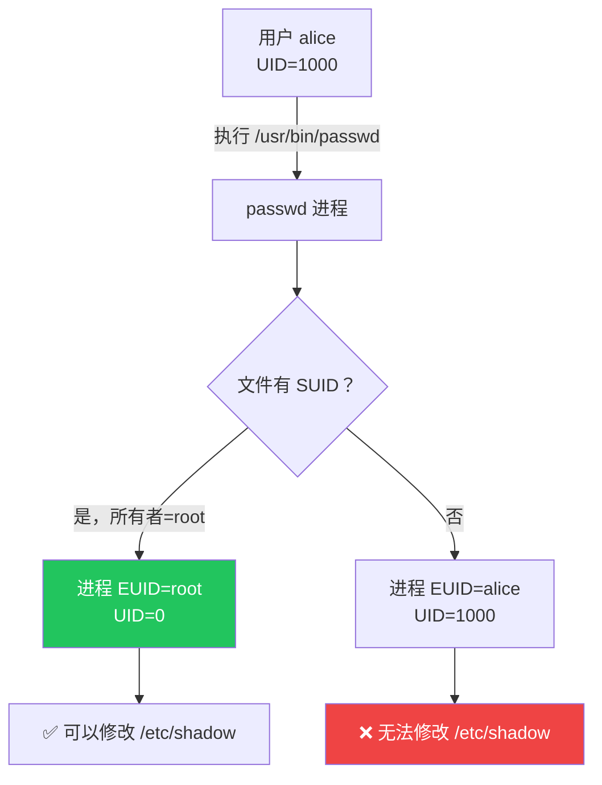

# 用户与权限管理

Linux 是多用户多任务操作系统，权限管理是系统安全的基石。从 `/etc/passwd` 的字段含义到 rwx 位运算，从 sudo 免密配置到 ACL 精细控制，从 SUID 提权到 Sticky Bit 防删——本文将系统性地讲透 Linux 用户与权限的每一个细节。

## 1. 用户与组基础

### 1.1 为什么需要用户与组



Linux 通过 **UID**（User ID）和 **GID**（Group ID）来识别用户和组，用户名和组名只是方便人类阅读的别名。

| 概念 | 说明 | 标识 |
|------|------|------|
| **用户（User）** | 操作系统的使用者 | UID |
| **组（Group）** | 用户的集合，简化权限分配 | GID |
| **主组（Primary Group）** | 用户创建文件时的默认属组 | /etc/passwd 第4字段 |
| **附加组（Supplementary Group）** | 用户额外加入的组 | /etc/group 第4字段 |

### 1.2 用户分类

| 类型 | UID 范围 | 说明 |
|------|----------|------|
| **超级用户** | 0 | root，拥有所有权限 |
| **系统用户** | 1-999（CentOS 7+）/ 1-499（旧版） | 服务进程使用，无登录 Shell |
| **普通用户** | 1000+（CentOS 7+）/ 500+（旧版） | 真实用户 |

```bash
# 查看系统中的用户
cat /etc/passwd | head -5
# root:x:0:0:root:/root:/bin/bash
# daemon:x:1:1:daemon:/usr/sbin:/usr/sbin/nologin
# bin:x:2:2:bin:/bin:/usr/sbin/nologin
# sys:x:3:3:sys:/dev:/usr/sbin/nologin

# 统计各类型用户数量
awk -F: '$3==0{root++} $3>=1&&$3<1000{sys++} $3>=1000{user++} END{print "root:",root,"system:",sys,"normal:",user}' /etc/passwd
# root: 1 system: 45 normal: 3
```

## 2. /etc/passwd —— 用户账户信息

### 2.1 文件格式

`/etc/passwd` 存储了所有用户的基本信息，每行一个用户：

```
root:x:0:0:root:/root:/bin/bash
│    │ │ │  │     │       │
│    │ │ │  │     │       └─ 7. 登录 Shell
│    │ │ │  │     └───────── 6. 主目录
│    │ │ │  └─────────────── 5. GECOS（注释信息）
│    │ │ └────────────────── 4. GID（主组 ID）
│    │ └──────────────────── 3. UID
│    └────────────────────── 2. 密码占位符（x 表示在 shadow 中）
└─────────────────────────── 1. 用户名
```

```bash
# 各字段详解
# 字段1：用户名（login name）
# 字段2：密码占位符
#   x - 密码在 /etc/shadow 中（现代系统）
#   空 - 无密码（危险！）
#   加密串 - 旧式密码（已不推荐）
# 字段3：UID
# 字段4：GID（主组）
# 字段5：GECOS（注释，可包含全名、电话等）
# 字段6：主目录
# 字段7：登录 Shell
#   /bin/bash       - 可正常登录
#   /usr/sbin/nologin - 禁止登录（服务用户）
#   /bin/false      - 禁止登录（更彻底）
#   /usr/bin/git-shell - 仅允许 git 操作
```

### 2.2 查看与操作

```bash
# 查看当前用户信息
id
# uid=1000(alice) gid=1000(alice) groups=1000(alice),27(sudo),33(www-data)

# 查看指定用户信息
id bob
id -u bob        # 只看 UID
id -g bob        # 只看主 GID
id -G bob        # 看所有 GID
id -un bob       # 只看用户名

# 查看当前用户名
whoami

# 查看登录用户
who
w               # 更详细，含正在执行的命令
users           # 只显示用户名列表

# 查看 /etc/passwd 中的特定用户
grep alice /etc/passwd
getent passwd alice    # 推荐方式，也查 LDAP 等外部源
```

## 3. /etc/shadow —— 用户密码

### 3.1 文件格式

`/etc/shadow` 存储用户的加密密码和密码策略，**只有 root 可读**：

```
root:$6$salt$hash:19500:0:99999:7:::
│     │           │     │  │    │ │ └── 9. 账户过期日期
│     │           │     │  │    │ └──── 8. 密码过期警告天数
│     │           │     │  │    └────── 7. 密码最短使用天数
│     │           │     │  └─────────── 6. 密码最长使用天数
│     │           │     └────────────── 5. 密码最近修改日期（天数）
│     │           └──────────────────── 4. 加密密码
│     └──────────────────────────────── 3. 加密算法 $6$=SHA-512
└────────────────────────────────────── 2. 加密密码
└───────────────────────────────────────── 1. 用户名
```

```bash
# 密码加密算法标识
$1$    # MD5（已不安全，不推荐）
$5$    # SHA-256
$6$    # SHA-512（当前默认，推荐）
$y$    # yescrypt（最新，glibc 2.36+）

# 查看密码策略
chage -l alice
# Last password change                    : Jun 04, 2024
# Password expires                        : never
# Password inactive                       : never
# Account expires                         : never
# Minimum number of days between password change : 0
# Maximum number of days between password change : 99999
# Number of days of warning before password expires : 7

# 修改密码策略
sudo chage -M 90 alice        # 密码最长使用 90 天
sudo chage -m 7 alice         # 密码最短使用 7 天
sudo chage -W 14 alice        # 过期前 14 天警告
sudo chage -E 2025-12-31 alice # 账户过期日期
```

::: warning shadow 文件权限
```bash
ls -la /etc/shadow
# -rw-r----- 1 root shadow 1234 ... /etc/shadow
```
`/etc/shadow` 只有 root 和 shadow 组可读。普通程序（如 `passwd`）通过 **setuid** 机制以 root 权限运行来修改密码，而不是直接读取该文件。
:::

## 4. /etc/group —— 用户组信息

### 4.1 文件格式

```
sudo:x:27:alice,bob
│    │ │  │
│    │ │  └─ 4. 附加组成员列表（逗号分隔）
│    │ └──── 3. GID
│    └────── 2. 组密码占位符（通常不用）
└─────────── 1. 组名
```

```bash
# 查看用户所属的组
groups alice
# alice : alice sudo docker www-data

# 查看组信息
getent group sudo
# sudo:x:27:alice,bob

# 列出所有组
cat /etc/group
getent group

# 查看某个组的所有成员
getent group docker | cut -d: -f4
# alice,bob,charlie
```

## 5. 用户与组管理命令

### 5.1 用户管理

```bash
# useradd - 创建用户
sudo useradd alice                           # 基本创建
sudo useradd -m -s /bin/bash -G sudo alice   # 完整创建
#   -m  创建主目录 /home/alice
#   -s  指定 Shell
#   -g  指定主组
#   -G  指定附加组（逗号分隔）
#   -d  指定主目录路径
#   -c  注释信息
#   -e  账户过期日期
#   -u  指定 UID

# useradd 默认配置
cat /etc/default/useradd
# SHELL=/bin/sh
# HOME=/home
# GROUP=100

# 创建用户的完整示例
sudo useradd \
    -m \
    -s /bin/bash \
    -g developers \
    -G sudo,docker,www-data \
    -c "Alice - Frontend Developer" \
    -e 2025-12-31 \
    alice

# 设置密码
sudo passwd alice
# New password:
# Retype new password:

# usermod - 修改用户
sudo usermod -aG docker alice        # 添加附加组（-a 必须和 -G 一起用！）
sudo usermod -s /bin/zsh alice       # 修改 Shell
sudo usermod -L alice                # 锁定账户
sudo usermod -U alice                # 解锁账户
sudo usermod -l newname oldname      # 修改用户名
sudo usermod -d /new/home -m alice   # 修改主目录并移动文件

# userdel - 删除用户
sudo userdel alice                   # 删除用户，保留主目录
sudo userdel -r alice                # 删除用户及主目录和邮件

# passwd - 密码管理
passwd                               # 修改自己的密码
sudo passwd alice                    # 修改他人密码
sudo passwd -l alice                 # 锁定密码
sudo passwd -u alice                 # 解锁密码
sudo passwd -e alice                 # 强制下次登录修改密码
passwd -S alice                      # 查看密码状态
```

::: important usermod -aG 的 -a 不能忘
```bash
# ❌ 错误：不加 -a 会将附加组设为只有 docker
sudo usermod -G docker alice

# ✅ 正确：-aG 表示追加到现有附加组
sudo usermod -aG docker alice
```
不加 `-a` 的 `-G` 会**替换**附加组列表，可能导致用户丢失已有的组成员身份（如从 sudo 组中被移除）。
:::

### 5.2 组管理

```bash
# groupadd - 创建组
sudo groupadd developers
sudo groupadd -g 2000 testers       # 指定 GID

# groupmod - 修改组
sudo groupmod -n devteam developers  # 改名
sudo groupmod -g 2001 developers     # 改 GID

# groupdel - 删除组
sudo groupdel developers
# 注意：不能删除任何用户的主组

# gpasswd - 组密码管理（较少使用）
sudo gpasswd -a alice docker         # 将用户加入组
sudo gpasswd -d alice docker         # 将用户从组中移除
sudo gpasswd -A alice developers     # 设置组管理员

# newgrp - 临时切换主组
newgrp docker                        # 切换主组为 docker
```

### 5.3 批量用户管理

```bash
# 批量创建用户脚本
#!/bin/bash
for user in alice bob charlie dave; do
    sudo useradd -m -s /bin/bash -G developers "$user"
    echo "$user:InitialPass123!" | sudo chpasswd
    sudo passwd -e "$user"    # 强制首次登录修改密码
    echo "Created user: $user"
done

# 使用 newusers 批量导入（/etc/passwd 格式）
cat > /tmp/users.txt << 'EOF'
alice:x:1001:1001:Alice:/home/alice:/bin/bash
bob:x:1002:1002:Bob:/home/bob:/bin/bash
EOF
sudo newusers /tmp/users.txt
```

## 6. rwx 权限模型

### 6.1 权限位解读

```
-rwxr-xr-- 1 alice developers 1234 Jun 4 10:00 script.sh
│└──┬──┘└──┬──┘└──┬──┘
│   │      │      └── 其他用户（Other）：r-- (4)
│   │      └───────── 所属组（Group）：r-x (5)
│   └──────────────── 所有者（User）：rwx (7)
└─────────────────── 文件类型

权限数值计算：
r = 4 (100)
w = 2 (010)
x = 1 (001)
- = 0 (000)
```



::: important 目录的 rwx 与文件的 rwx 含义不同
这是 Linux 权限最容易混淆的地方：

- **目录的 r**：可以 `ls` 列出目录中的文件名，但看不到权限、大小等元数据（需要 x）
- **目录的 w**：可以在目录中创建、删除、重命名文件（即使对文件本身没有 w 权限！）
- **目录的 x**：可以 `cd` 进入目录，可以访问目录中文件的 inode 信息

所以一个"只读"目录通常设为 `r-x`（5），而不是 `r--`（4），因为只有 r 没有 x 的话，`ls` 只能看到文件名列表，但 `ls -l` 会报错。
:::

### 6.2 权限判断流程



::: tip 权限判断的"短路"特性
Linux 的权限判断是**短路**的：一旦匹配了某个规则，就不再检查后续规则。例如，如果文件所有者是 root，即使 Other 权限是 `---`，root 也能访问。同理，如果 owner 权限是 `---`，即使 group/other 有权限，owner 也不能访问（root 除外）。
:::

### 6.3 chmod —— 修改权限

```bash
# 数字模式
chmod 755 script.sh       # rwxr-xr-x
chmod 644 document.txt    # rw-r--r--
chmod 600 secret.key      # rw-------
chmod 777 public/         # rwxrwxrwx（危险！）

# 符号模式
chmod u+x script.sh       # 给所有者加执行权限
chmod g-w document.txt    # 给所属组去掉写权限
chmod o=r document.txt    # 其他用户只读
chmod a+x script.sh       # 所有人加执行权限（a=all，可省略）
chmod ug+rw,o=r file.txt  # 组合操作

# 递归修改
chmod -R 755 /var/www/    # 递归修改目录及子内容

# 常见权限组合
# 755 - 可执行文件/目录（所有者全权，其他人可读可执行）
# 644 - 普通文件（所有者读写，其他人只读）
# 600 - 私密文件（仅所有者读写）
# 700 - 私密目录（仅所有者可进入）
# 640 - 组共享文件（所有者读写，组只读）

# 参考模式（--reference）
chmod --reference=template.txt newfile.txt
```

### 6.4 chown / chgrp —— 修改所有者/组

```bash
# chown - 修改所有者
sudo chown alice file.txt              # 修改所有者
sudo chown alice:developers file.txt   # 同时修改所有者和组
sudo chown :developers file.txt        # 只修改组（冒号前留空）
sudo chown -R alice:www-data /var/www/ # 递归修改

# chgrp - 修改所属组
sudo chgrp developers file.txt
sudo chgrp -R www-data /var/www/

# 普通用户只能将自己拥有的文件改给自己所在的组
chgrp developers myfile.txt    # ✅ 前提：文件属于你，且你在 developers 组中
```

## 7. umask —— 默认权限掩码

### 7.1 umask 工作原理

umask 决定了新创建文件和目录的默认权限。它的计算方式是**从基准权限中减去 umask 值**：

```
文件基准权限：666 (rw-rw-rw-)
目录基准权限：777 (rwxrwxrwx)

umask = 022

文件默认权限 = 666 - 022 = 644 (rw-r--r--)
目录默认权限 = 777 - 022 = 755 (rwxr-xr-x)
```

::: important 文件不自动给 x 权限
注意文件的基准权限是 666 而非 777——新文件默认没有执行权限，这是出于安全考虑。如果需要执行，必须手动 `chmod +x`。
:::

```bash
# 查看当前 umask
umask
# 0022

# 以符号方式查看
umask -S
# u=rwx,g=rwx,o=rx  （目录）
# （注意：-S 显示的是目录的结果）

# 设置 umask
umask 027    # 文件：640，目录：750
umask 077    # 文件：600，目录：700（最严格）

# 永久修改 umask
echo "umask 027" >> ~/.bashrc

# 验证
touch testfile
mkdir testdir
ls -la testfile testdir
# -rw-r----- 1 alice alice 0 ... testfile    (640)
# drwxr-x--- 2 alice alice 0 ... testdir     (750)
```

### 7.2 常见 umask 值

| umask | 文件权限 | 目录权限 | 适用场景 |
|-------|----------|----------|----------|
| 022 | 644 (rw-r--r--) | 755 (rwxr-xr-x) | 默认值，共享服务器 |
| 027 | 640 (rw-r-----) | 750 (rwxr-x---) | 组协作，阻止 Other |
| 077 | 600 (rw-------) | 700 (rwx------) | 个人机器，最严格 |
| 002 | 664 (rw-rw-r--) | 775 (rwxrwxr-x) | 组内协作，共享目录 |

## 8. sudo 与 sudoers

### 8.1 su 与 su - 的区别

```bash
# su - 切换到 root（完全切换，加载环境变量）
su -
# 等价于 su - root
# 会读取 root 的 .bashrc、.profile
# PATH、HOME 等环境变量都是 root 的

# su 切换到 root（不完全切换）
su
# 保留当前用户的环境变量
# PATH 可能不包含 /sbin 等系统目录

# su 切换到其他用户
su - alice
su - bob -c "whoami"    # 以 bob 身份执行命令

# su 的缺点：需要知道目标用户的密码
# sudo 的优点：只需要自己的密码（或免密）
```



### 8.2 sudo 基本用法

```bash
# 以 root 执行命令
sudo command

# 以指定用户执行
sudo -u alice whoami
# alice

# 以 root 打开 Shell
sudo -i         # 完整登录 Shell（类似 su -）
sudo -s         # 非登录 Shell（类似 su）

# 列出当前用户的 sudo 权限
sudo -l

# 验证 sudo 密码缓存（默认 15 分钟）
sudo -v         # 刷新缓存时间
sudo -k         # 清除缓存（下次需要重新输入密码）

# 编辑需要 root 权限的文件
sudoedit /etc/ssh/sshd_config
# 等价于 sudo -e
```

### 8.3 sudoers 配置

```bash
# ✅ 正确的编辑方式（自动语法检查）
sudo visudo

# ❌ 错误方式（语法错误可能导致 sudo 无法使用！）
# sudo vim /etc/sudoers

# sudoers 语法
# user    host=(runas)    commands
# alice   ALL=(ALL)       ALL              # alice 可以在任何主机以任何用户执行任何命令
# bob     ALL=(ALL)       /usr/bin/docker  # bob 只能执行 docker 命令
# %sudo   ALL=(ALL)       ALL              # sudo 组的所有成员

# 常用配置示例

# 1. 允许 alice 无需密码执行所有命令
alice ALL=(ALL) NOPASSWD: ALL

# 2. 允许 developers 组重启 nginx
%developers ALL=(ALL) /usr/sbin/systemctl restart nginx, /usr/sbin/systemctl status nginx

# 3. 允许运维人员执行特定命令组
%ops ALL=(ALL) /usr/sbin/systemctl, /usr/bin/journalctl, /usr/sbin/iptables

# 4. 允许用户以特定身份运行命令
deploy ALL=(www-data) /usr/bin/php

# 5. 允许用户运行除某些命令外的所有命令
bob ALL=(ALL) ALL, !/usr/sbin/visudo, !/bin/su
# 注意：这种方式不安全，用户可以通过其他方式获取 root
```

::: warning sudoers 安全原则
1. **永远使用 `visudo` 编辑**——它会在保存前检查语法，防止配置错误锁死 sudo
2. **不要给 NOPASSWD: ALL 权限**给不信任的用户
3. **优先使用组而非用户**——`%sudo` 比逐个用户配置好管理
4. **将自定义规则放在 `/etc/sudoers.d/` 目录下**，而不是修改主文件：
   ```bash
   sudo visudo -f /etc/sudoers.d/alice
   # 在文件中写入：alice ALL=(ALL) NOPASSWD: /usr/bin/docker
   ```
5. **命令使用绝对路径**——防止用户通过 PATH 劫持
:::

### 8.4 sudo 日志审计

```bash
# sudo 操作会记录到日志
sudo cat /var/log/auth.log | grep sudo     # Debian/Ubuntu
sudo cat /var/log/secure | grep sudo       # RHEL/CentOS

# 查看 sudo 日志
sudo journalctl -t sudo

# 配置更详细的 sudo 日志（在 sudoers 中添加）
Defaults logfile="/var/log/sudo.log"
Defaults log_input, log_output
Defaults iolog_dir="/var/log/sudo-io/%{user}/%{runas_user}/%{ts}"

# 配置 sudo 邮件通知
Defaults mailto="admin@example.com"
Defaults mail_badpass
Defaults mail_no_user
```

## 9. ACL 访问控制列表

### 9.1 为什么需要 ACL

传统的 rwx 权限模型只能为**所有者、所属组、其他用户**三类主体设置权限，无法满足"给用户 A 单独授权"的需求。



### 9.2 ACL 操作

```bash
# 查看 ACL
getfacl project/
# # file: project/
# # owner: alice
# # group: developers
# user::rwx
# user:bob:r-x          # bob 的额外权限
# group::r-x
# group:test:r--        # test 组的额外权限
# mask::rwx             # 有效权限掩码
# other::---

# 设置 ACL
setfacl -m u:bob:r-x project/       # 给 bob 授予 r-x 权限
setfacl -m g:test:r-- project/      # 给 test 组授予 r-- 权限
setfacl -m u:bob:rw- file.txt       # 给 bob 授予 rw- 权限

# 递归设置 ACL
setfacl -R -m u:bob:r-x project/

# 设置默认 ACL（新创建的文件自动继承）
setfacl -d -m u:bob:r-x project/
setfacl -d -m g:test:r-x project/

# 删除 ACL
setfacl -x u:bob project/           # 删除 bob 的 ACL 条目
setfacl -x g:test project/          # 删除 test 组的 ACL 条目
setfacl -b project/                 # 删除所有 ACL 条目
setfacl -k project/                 # 只删除默认 ACL

# 备份与恢复 ACL
getfacl -R project/ > project.acl   # 备份
setfacl --restore=project.acl       # 恢复
```

### 9.3 ACL mask 的作用

```bash
# mask 限制了 ACL 中 user 和 group 条目的最大权限
# 实际有效权限 = ACL 条目权限 ∩ mask

setfacl -m u:bob:rwx project/      # 给 bob rwx
setfacl -m m::r-x project/         # 设置 mask 为 r-x
getfacl project/
# user:bob:rwx          #effective:r-x    ← 实际有效权限
# mask::r-x

# 修改 mask
setfacl -m m::rw- project/         # 将 mask 降为 rw-
# bob 的有效权限变为 rw- ∩ rw- = rw-

# 注意：chmod 修改组权限时实际修改的是 mask
chmod g+rx project/
# 等价于 setfacl -m m::r-x project/
```

::: important ls -l 显示的组权限可能是 mask
当文件有 ACL 时，`ls -l` 显示的组权限位实际上是 **mask** 的值，而非传统的组权限。这也是为什么你会看到 `ls -l` 显示组有 `rwx`，但实际访问被拒绝——因为 mask 限制了对 ACL 条目的有效权限。

识别文件是否有 ACL：`ls -l` 权限位后面有一个 `+` 号：
```
drwxrwx---+ 2 alice developers 4096 ... project/
           ^
           └── 有 ACL 条目
```
:::

## 10. 特殊权限

### 10.1 SUID（Set User ID）

SUID 使得用户在执行文件时，**临时获得文件所有者的权限**（而非执行者自身的权限）。



```bash
# SUID 的经典应用：passwd 命令
ls -la /usr/bin/passwd
# -rwsr-xr-x 1 root root 68208 ... /usr/bin/passwd
#    ^ SUID 标志（owner 的 x 位变为 s）

# 为什么 passwd 需要 SUID？
# /etc/shadow 只有 root 可写
# 普通用户需要修改自己的密码
# SUID 让 passwd 进程以 root 身份运行，从而可以写 /etc/shadow

# 查找系统中的 SUID 文件
sudo find / -perm -4000 -type f 2>/dev/null

# 设置 SUID
sudo chmod u+s /usr/local/bin/myapp
sudo chmod 4755 /usr/local/bin/myapp    # 4 = SUID

# 移除 SUID
sudo chmod u-s /usr/local/bin/myapp
```

::: warning SUID 的安全风险
SUID 是最常见提权攻击向量之一：
1. 不要给 Shell 解释器（bash、python、perl）设置 SUID——等于给所有人 root 权限
2. 不要给可编辑的脚本设置 SUID——用户可以修改脚本内容
3. 定期审计系统中的 SUID 文件，及时发现异常
4. SUID 对 Shell 脚本无效（现代 Linux 内核忽略脚本的 SUID）

```bash
# ❌ 极其危险
sudo chmod u+s /bin/bash    # 任何人执行 bash 都获得 root！

# 安全审计：找出异常 SUID 文件
sudo find / -perm -4000 -type f -exec ls -la {} \; 2>/dev/null | \
    grep -v -E '(passwd|sudo|su|ping|mount|umount|chsh|newgrp|gpasswd|chfn)'
```
:::

### 10.2 SGID（Set Group ID）

SGID 有两种应用场景：

**对文件**：执行时临时获得文件所属组的权限。

```bash
# SGID 标志（group 的 x 位变为 s）
ls -la /usr/bin/wall
# -rwxr-sr-x 1 root tty 35048 ... /usr/bin/wall
#       ^ SGID 标志
```

**对目录**：在该目录下创建的文件自动继承目录的所属组（而非创建者的主组）。

```bash
# 目录 SGID 的典型应用：共享目录
sudo mkdir /srv/shared
sudo chgrp developers /srv/shared
sudo chmod 2775 /srv/shared       # 2 = SGID
# 或
sudo chmod g+s /srv/shared

# 效果：
# alice（主组 alice）在 /srv/shared 下创建文件
touch /srv/shared/report.txt
ls -la /srv/shared/report.txt
# -rw-rw-r-- 1 alice developers 0 ... report.txt
#                 ^^^^^^^^^^^ 继承了目录的组 developers，而非 alice 的主组

# 这样 developers 组的所有成员都能访问此文件
```

```bash
# 查找 SGID 文件
sudo find / -perm -2000 -type f 2>/dev/null

# 设置 SGID
sudo chmod g+s /srv/shared
sudo chmod 2775 /srv/shared

# 移除 SGID
sudo chmod g-s /srv/shared
```

### 10.3 Sticky Bit（粘滞位）

Sticky Bit 主要用于**共享目录**，防止用户删除他人的文件。

```bash
# Sticky Bit 的经典应用：/tmp 目录
ls -ld /tmp
# drwxrwxrwt 10 root root 4096 ... /tmp
#           ^ Sticky Bit 标志（other 的 x 位变为 t）

# /tmp 的权限是 1777
# 任何人可以在 /tmp 中创建文件
# 但只有文件所有者（和 root）可以删除自己的文件

# 效果演示
# alice 创建了 /tmp/alice_secret.txt
# bob 无法删除它，即使 /tmp 对所有用户可写
rm /tmp/alice_secret.txt
# rm: cannot remove '/tmp/alice_secret.txt': Operation not permitted
```

```bash
# 设置 Sticky Bit
sudo chmod +t /srv/shared
sudo chmod 1777 /srv/shared

# 移除 Sticky Bit
sudo chmod -t /srv/shared
```

### 10.4 特殊权限总结

| 权限 | 八进制 | 标识 | 作用对象 | 效果 |
|------|--------|------|----------|------|
| **SUID** | 4 | `u+s` / owner位`s` | 文件 | 执行时以所有者身份运行 |
| **SGID** | 2 | `g+s` / group位`s` | 文件 | 执行时以所属组身份运行 |
| **SGID** | 2 | `g+s` / group位`s` | 目录 | 新文件继承目录的组 |
| **Sticky** | 1 | `o+t` / other位`t` | 目录 | 只有所有者可删除文件 |

```bash
# 完整权限设置示例
chmod 4755 file    # SUID + rwxr-xr-x
chmod 2755 dir     # SGID + rwxr-xr-x
chmod 1777 dir     # Sticky + rwxrwxrwx
chmod 6755 file    # SUID + SGID + rwxr-xr-x
chmod 7755 dir     # SUID + SGID + Sticky + rwxr-xr-x

# 权限位小写/大写的含义
# s/S：SUID/SGID 且有 x 权限（小写 s = 正常）
# S：SUID/SGID 但没有 x 权限（大写 S = 无效，通常表示配置错误）
# t/T：Sticky Bit 且有 x 权限（小写 t = 正常）
# T：Sticky Bit 但没有 x 权限（大写 T = 无效）
```

## 11. 实战案例

### 11.1 配置 Web 项目共享目录

```bash
# 需求：多个开发者协作开发 Web 项目
# 1. 所有开发者可以读写项目文件
# 2. 新文件自动继承项目组
# 3. 不能删除他人的文件

# 步骤1：创建组
sudo groupadd webdev

# 步骤2：创建目录
sudo mkdir -p /srv/webapp
sudo chgrp webdev /srv/webapp

# 步骤3：设置权限
sudo chmod 2775 /srv/webapp     # SGID + rwxrwxr-x
sudo chmod +t /srv/webapp       # Sticky Bit

# 最终权限
ls -ld /srv/webapp
# drwxrwsr-t 2 root webdev 4096 ... /srv/webapp

# 步骤4：设置默认 ACL（确保新文件有组写权限）
sudo setfacl -d -m g::rwx /srv/webapp
sudo setfacl -d -m o::rx /srv/webapp

# 步骤5：将开发者加入组
sudo usermod -aG webdev alice
sudo usermod -aG webdev bob

# 验证
getfacl /srv/webapp
```

### 11.2 安全加固：限制 SSH 登录

```bash
# 1. 禁止 root SSH 登录
sudo sed -i 's/^#*PermitRootLogin.*/PermitRootLogin no/' /etc/ssh/sshd_config

# 2. 只允许特定用户/组 SSH 登录
# 在 /etc/ssh/sshd_config 中添加
AllowUsers alice bob
# 或
AllowGroups ssh-users

# 3. 创建 SSH 用户组
sudo groupadd ssh-users
sudo usermod -aG ssh-users alice

# 4. 使用密钥认证，禁用密码
sudo sed -i 's/^#*PasswordAuthentication.*/PasswordAuthentication no/' /etc/ssh/sshd_config

# 5. 重启 SSH
sudo systemctl restart sshd
```

### 11.3 审计与排查权限问题

```bash
# 查找权限过于宽松的文件
find / -xdev -type f -perm -0002 2>/dev/null    # world-writable 文件
find / -xdev -type f -perm -4000 2>/dev/null    # SUID 文件
find / -xdev -type f -perm -2000 2>/dev/null    # SGID 文件
find / -xdev -type d -perm -0002 2>/dev/null    # world-writable 目录

# 查找无主文件（UID/GID 不存在）
find / -xdev -nouser 2>/dev/null
find / -xdev -nogroup 2>/dev/null

# 排查"Permission denied"
# 方法1：用 strace 跟踪
strace -e trace=open,openat ls /root/ 2>&1 | grep EACCES

# 方法2：用 namei 查看路径上每个目录的权限
namei -l /srv/webapp/config/database.yml
# f: /srv/webapp/config/database.yml
# drwxr-xr-x root   root   /
# drwxr-xr-x root   root   srv
# drwxrwsr-t root   webdev webapp
# drwxr-xr-x alice  webdev config
# -rw-r----- alice  webdev database.yml

# 方法3：检查 SELinux/AppArmor（如果启用）
sudo audit2allow -w -a
sudo dmesg | grep -i denied
```

### 11.4 最小权限原则实践

```bash
# 1. 服务账户：禁止登录
sudo useradd -r -s /usr/sbin/nologin nginx

# 2. 限制 sudo 权限到最小范围
# /etc/sudoers.d/deploy
deploy ALL=(www-data) /usr/bin/php, /usr/local/bin/deploy.sh

# 3. 设置 umask
# /etc/profile
if [ "$(id -u)" -ge 1000 ]; then
    umask 027
fi

# 4. 文件权限收紧
sudo chmod 700 /root                     # root 主目录
sudo chmod 600 /etc/ssh/sshd_config      # SSH 配置
sudo chmod 600 /etc/shadow               # 密码文件
sudo chmod 700 /home/alice/.ssh          # SSH 目录
sudo chmod 600 /home/alice/.ssh/authorized_keys  # 公钥

# 5. 定期审计
# 创建审计脚本
cat > /usr/local/bin/perm_audit.sh << 'EOF'
#!/bin/bash
echo "=== World-writable files ==="
find / -xdev -type f -perm -0002 2>/dev/null

echo "=== SUID files ==="
find / -xdev -type f -perm -4000 2>/dev/null

echo "=== Files without owner ==="
find / -xdev -nouser -o -nogroup 2>/dev/null

echo "=== Suspicious permissions on sensitive files ==="
for f in /etc/shadow /etc/passwd /etc/ssh/sshd_config; do
    ls -la "$f"
done
EOF
sudo chmod +x /usr/local/bin/perm_audit.sh
```

## 12. 总结

| 知识点 | 关键内容 |
|--------|----------|
| /etc/passwd | 用户名:x:UID:GID:注释:主目录:Shell |
| /etc/shadow | 用户名:加密密码:修改日期:策略... |
| /etc/group | 组名:x:GID:成员列表 |
| rwx 权限 | 文件：读/写/执行；目录：列/增删/进入 |
| chmod | 数字模式(755)和符号模式(u+x) |
| umask | 从基准权限减去掩码，文件 666、目录 777 |
| su vs su - | su 不加载环境，su - 完全切换 |
| sudo | visudo 编辑，优先使用组，命令用绝对路径 |
| ACL | getfacl/setfacl，mask 限制有效权限 |
| SUID | 执行时以所有者身份运行（如 passwd） |
| SGID | 目录下新文件继承组（共享目录） |
| Sticky Bit | 只有所有者可删除文件（如 /tmp） |

权限管理是 Linux 安全的基石。记住最小权限原则：给用户和进程分配完成任务所需的最小权限，不多给一分。正如《UNIX 环境高级编程》所强调的——权限的设计不是为了让操作更方便，而是为了让系统更安全。
