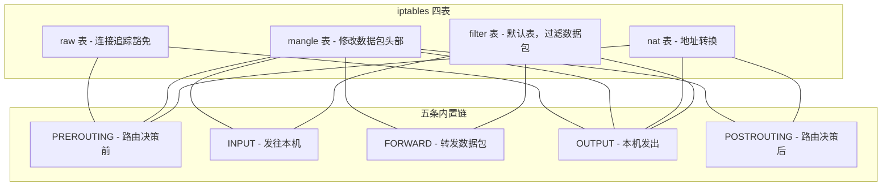
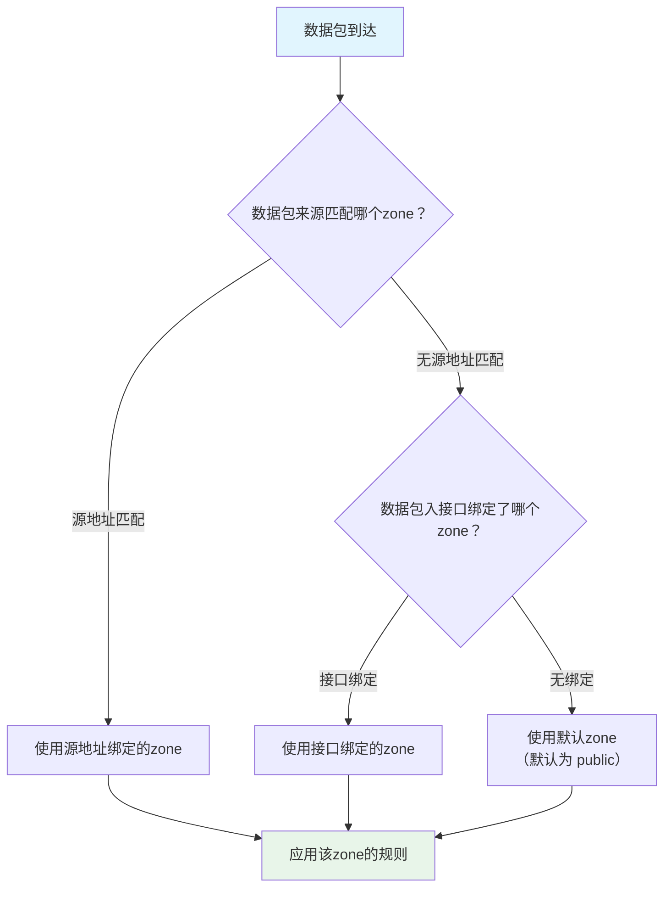
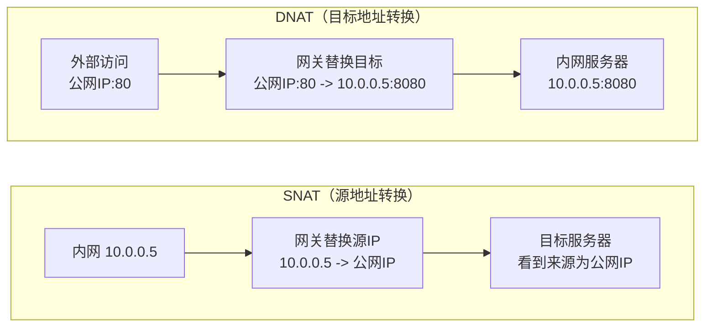

# 网络配置与防火墙

网络是 Linux 服务器生命的血液——无论是提供 Web 服务、数据库访问，还是集群通信，一切皆依赖网络的正确配置与安全防护。本文从网络接口管理讲起，深入 DNS 解析机制，再逐层剖析 iptables 四表五链与 firewalld 的设计哲学，最后覆盖网络诊断与 SSH 安全加固，帮你构建一张"通得了、管得住、查得出"的企业级网络知识网。

## 1. 网络接口管理

### 1.1 网络接口的概念

网络接口（Network Interface）是操作系统与网络硬件之间的抽象层。每个接口拥有唯一的名称和配置参数：

| 接口类型 | 命名规则 | 说明 |
|----------|----------|------|
| 物理网卡 | `eth0`、`enp3s0` | 以太网接口 |
| 无线网卡 | `wlan0`、`wlp2s0` | Wi-Fi 接口 |
| 回环接口 | `lo` | 本地回环 127.0.0.1 |
| 虚拟网桥 | `br0`、`virbr0` | 桥接接口 |
| VLAN | `eth0.100`、`enp3s0.100` | 802.1Q VLAN 子接口 |
| Bond | `bond0` | 网卡绑定接口 |

::: info 可预测命名规则
CentOS 7+ / Ubuntu 16.04+ 采用 systemd 的可预测网络接口命名：
- `en` = 以太网，`wl` = 无线，`ww` = WWAN
- `p3s0` = PCI 插槽位置，`o1` = 板载网卡序号
- 例如 `enp3s0` = PCI 插槽 3 上的以太网卡
:::

### 1.2 ip 命令家族

`ip` 命令来自 `iproute2` 工具包，是 `ifconfig`/`route`/`netstat` 的现代替代品：

```bash
# 查看所有网络接口
ip link show

# 查看指定接口
ip link show enp3s0

# 启用/禁用接口
ip link set enp3s0 up
ip link set enp3s0 down

# 修改接口 MTU
ip link set enp3s0 mtu 9000

# 修改接口 MAC 地址（需先 down）
ip link set enp3s0 down
ip link set enp3s0 address 00:11:22:33:44:55
ip link set enp3s0 up
```

**IP 地址管理：**

```bash
# 查看所有 IP 地址
ip addr show
ip a    # 简写

# 添加 IP 地址
ip addr add 192.168.1.100/24 dev enp3s0

# 添加辅助 IP（同一接口多 IP）
ip addr add 192.168.1.101/24 dev enp3s0

# 删除 IP 地址
ip addr del 192.168.1.100/24 dev enp3s0

# 清空接口所有 IP
ip addr flush dev enp3s0
```

**路由管理：**

```bash
# 查看路由表
ip route show
ip route    # 简写

# 添加默认网关
ip route add default via 192.168.1.1

# 添加静态路由
ip route add 10.0.0.0/8 via 192.168.1.254

# 添加路由指定出接口
ip route add 172.16.0.0/16 dev enp3s0

# 删除路由
ip route del 10.0.0.0/8

# 修改路由（replace）
ip route replace default via 192.168.1.2
```

::: tip ip 命令的记忆技巧
`ip` 命令遵循统一的语法结构：`ip <对象> <操作> <参数>`
- 对象：`link`（链路层）、`addr`（网络层）、`route`（路由）、`neigh`（ARP/邻居）
- 操作：`show`（查看）、`add`（添加）、`del`（删除）、`set`（修改）、`flush`（清空）
:::

### 1.3 nmcli（NetworkManager 命令行）

NetworkManager 是桌面和部分服务器发行版的网络管理守护进程，`nmcli` 是其命令行接口：

```bash
# 查看所有连接
nmcli connection show

# 查看设备状态
nmcli device status

# 创建以太网静态 IP 连接
nmcli connection add con-name static-eth0 \
  type ethernet ifname enp3s0 \
  ip4 192.168.1.100/24 gw4 192.168.1.1

# 设置 DNS
nmcli connection modify static-eth0 \
  ipv4.dns "8.8.8.8 8.8.4.4"

# 创建 DHCP 连接
nmcli connection add con-name dhcp-eth0 \
  type ethernet ifname enp3s0 \
  ipv4.method auto

# 启用/禁用连接
nmcli connection up static-eth0
nmcli connection down static-eth0

# 修改连接参数
nmcli connection modify static-eth0 ipv4.addresses "192.168.1.200/24"

# 查看连接详情
nmcli connection show static-eth0
```

**nmcli 交互式编辑器：**

```bash
# 进入交互式编辑模式
nmcli connection edit con-name static-eth0

# 在交互模式中
nmcli> set ipv4.addresses 192.168.1.200/24
nmcli> set ipv4.gateway 192.168.1.1
nmcli> set ipv4.dns 8.8.8.8
nmcli> save
nmcli> quit
```

### 1.4 netplan（Ubuntu 18.04+）

Ubuntu 从 18.04 LTS 开始使用 netplan 作为网络配置后端，通过 YAML 文件描述网络：

```yaml
# /etc/netplan/01-netcfg.yaml
network:
  version: 2
  renderer: networkd    # 或 NetworkManager
  ethernets:
    enp3s0:
      dhcp4: no
      addresses:
        - 192.168.1.100/24
      gateway4: 192.168.1.1
      nameservers:
        addresses:
          - 8.8.8.8
          - 8.8.4.4
        search:
          - example.com
      mtu: 1500
```

**Bonding 配置示例：**

```yaml
# /etc/netplan/02-bond.yaml
network:
  version: 2
  renderer: networkd
  bonds:
    bond0:
      interfaces:
        - enp3s0
        - enp4s0
      parameters:
        mode: active-backup
        mii-monitor-interval: 100
      addresses:
        - 192.168.1.100/24
      gateway4: 192.168.1.1
  ethernets:
    enp3s0: {}
    enp4s0: {}
```

```bash
# 验证并应用配置
sudo netplan try     # 先测试，不生效可自动回滚
sudo netplan apply   # 直接应用
```

::: warning netplan 缩进陷阱
YAML 对缩进极其敏感！使用空格而非 Tab，每层缩进 2 个空格。`netplan try` 会先验证配置合法性，避免因配置错误导致网络断开——生产环境务必使用 `try` 而非直接 `apply`。
:::

### 1.5 传统配置文件（CentOS/RHEL）

```bash
# /etc/sysconfig/network-scripts/ifcfg-enp3s0
TYPE=Ethernet
BOOTPROTO=static
NAME=enp3s0
DEVICE=enp3s0
ONBOOT=yes
IPADDR=192.168.1.100
PREFIX=24
GATEWAY=192.168.1.1
DNS1=8.8.8.8
DNS2=8.8.4.4
```

```bash
# 重启网络服务
systemctl restart network    # CentOS 6/7
nmcli connection reload      # CentOS 8+/使用 NetworkManager
nmcli connection up enp3s0
```

## 2. DNS 解析

### 2.1 DNS 解析流程


### 2.2 /etc/resolv.conf

这是传统 DNS 配置文件，被 glibc 解析器直接读取：

```bash
# /etc/resolv.conf
nameserver 8.8.8.8          # 主 DNS
nameserver 8.8.4.4          # 备 DNS
search example.com corp.local  # 搜索域
options timeout:2 attempts:3   # 超时和重试
options ndots:5                # 点数阈值
options single-request-reopen  # 解决 IPv4/IPv6 竞态
```

| 参数 | 含义 | 默认值 |
|------|------|--------|
| `nameserver` | DNS 服务器地址，最多 3 个 | - |
| `search` | 短域名自动补全的搜索域 | 本地域 |
| `options timeout` | 单次查询超时秒数 | 5 |
| `options attempts` | 每个服务器重试次数 | 2 |
| `options ndots` | 名字中点数少于此值则先追加搜索域 | 1 |

::: important resolv.conf 被覆盖问题
如果系统运行 NetworkManager 或 systemd-resolved，它们会自动生成 `/etc/resolv.conf`，手动修改会被覆盖。解决方案：
- **NetworkManager**：`nmcli con modify <name> ipv4.dns "8.8.8.8"`
- **systemd-resolved**：修改 `/etc/systemd/resolved.conf`
- **防覆盖**：`chattr +i /etc/resolv.conf`（不推荐，治标不治本）
:::

### 2.3 systemd-resolved

现代 Linux 发行版（Ubuntu 16.10+、CentOS 8+）使用 systemd-resolved 提供本地 DNS 缓存：

```bash
# 查看状态
systemctl status systemd-resolved

# 配置文件 /etc/systemd/resolved.conf
[Resolve]
DNS=8.8.8.8 8.8.4.4
FallbackDNS=1.1.1.1 1.0.0.1
Domains=~example.com
LLMNR=no
DNSOverTLS=opportunistic
Cache=yes
CacheFromLocalhost=yes
DNSStubListener=yes
```

```bash
# 使用 resolvectl 管理和查询
resolvectl status                    # 查看全局和每个接口的 DNS 状态
resolvectl query www.example.com     # 解析域名
resolvectl domain enp3s0 ~corp.local # 设置接口路由域
resolvectl dns enp3s0 10.0.0.1       # 设置接口 DNS
resolvectl flush-caches              # 清除缓存
```

::: tip DNSOverTLS 配置
`DNSOverTLS=opportunistic` 表示尝试使用 TLS 查询，失败则回退明文；`DNSOverTLS=yes` 则强制 TLS，无法连接时查询失败。适合安全要求高的环境。
:::

### 2.4 /etc/nsswitch.conf

Name Service Switch 决定了名称解析的查找顺序：

```bash
# /etc/nsswitch.conf 关键行
hosts:      files resolve [!UNAVAIL=return] dns myhostname
# 解读：先查 files(/etc/hosts)，再查 resolve(systemd-resolved)，
#       如果 resolve 可用就返回结果，否则查 dns，最后查 myhostname
```

## 3. 防火墙基础——iptables

### 3.1 iptables 架构：四表五链

iptables 是 Linux 内核 Netfilter 框架的用户态工具，通过"表-链-规则"三级结构组织数据包处理逻辑：



**四表职责：**

| 表 | 优先级 | 用途 | 可用链 |
|----|--------|------|--------|
| `raw` | 最高 | 决定数据包是否被连接追踪 | PREROUTING, OUTPUT |
| `mangle` | 高 | 修改 TTL/TOS/MARK 等包头字段 | 全部五链 |
| `nat` | 中 | 源/目标地址转换（SNAT/DNAT） | PREROUTING, OUTPUT, POSTROUTING |
| `filter` | 最低 | 数据包过滤（ACCEPT/DROP/REJECT） | INPUT, FORWARD, OUTPUT |

### 3.2 数据包在 iptables 中的流转


::: important 规则匹配顺序
iptables 规则从上到下依次匹配，**第一条匹配的规则决定数据包命运**，后续规则不再检查。这意味着：
1. 规则顺序至关重要
2. 更具体的规则应放在更前面
3. 最后一条通常是默认策略（ACCEPT 或 DROP）
:::

### 3.3 iptables 基本操作

```bash
# 查看所有规则（带行号和计数器）
iptables -L -n -v --line-numbers

# 查看 filter 表 INPUT 链
iptables -t filter -L INPUT -n -v

# 查看 nat 表
iptables -t nat -L -n -v

# 查看规则计数器归零
iptables -Z
```

**添加规则：**

```bash
# 允许已建立的和相关的连接（第一条规则，最重要！）
iptables -A INPUT -m conntrack --ctstate ESTABLISHED,RELATED -j ACCEPT

# 允许回环接口
iptables -A INPUT -i lo -j ACCEPT

# 允许 SSH
iptables -A INPUT -p tcp --dport 22 -j ACCEPT

# 允许 HTTP/HTTPS
iptables -A INPUT -p tcp --dport 80 -j ACCEPT
iptables -A INPUT -p tcp --dport 443 -j ACCEPT

# 允许特定网段
iptables -A INPUT -s 10.0.0.0/8 -j ACCEPT

# 允许 ICMP（ping）
iptables -A INPUT -p icmp --icmp-type echo-request -j ACCEPT

# 插入规则到指定位置
iptables -I INPUT 2 -p tcp --dport 8080 -j ACCEPT

# 默认策略
iptables -P INPUT DROP
iptables -P FORWARD DROP
iptables -P OUTPUT ACCEPT
```

**删除规则：**

```bash
# 按行号删除
iptables -D INPUT 3

# 按规则内容删除
iptables -D INPUT -p tcp --dport 22 -j ACCEPT

# 清空所有规则
iptables -F

# 清空特定链
iptables -F INPUT

# 删除自定义链
iptables -X
```

### 3.4 常用匹配条件

```bash
# 协议匹配
-p tcp / -p udp / -p icmp

# 端口匹配
--dport 80          # 目标端口
--sport 1024:65535  # 源端口范围

# 多端口匹配
-m multiport --dports 80,443,8080

# IP 匹配
-s 192.168.1.0/24   # 源地址
-d 10.0.0.1          # 目标地址

# 接口匹配
-i eth0              # 入接口
-o eth1              # 出接口

# 连接状态匹配
-m conntrack --ctstate NEW          # 新连接
-m conntrack --ctstate ESTABLISHED  # 已建立
-m conntrack --ctstate RELATED      # 相关（如 FTP 数据连接）
-m conntrack --ctstate INVALID      # 无效

# 速率限制
-m limit --limit 5/min --limit-burst 10

# IP 范围匹配
-m iprange --src-range 192.168.1.100-192.168.1.200

# 字符串匹配
-m string --string "example" --algo bm

# 时间匹配
-m time --timestart 09:00 --timestop 18:00 --weekdays Mon,Fri

# 最近连接匹配（防暴力破解）
-m recent --set --name ssh
-m recent --update --seconds 60 --hitcount 5 --name ssh -j DROP
```

### 3.5 iptables 持久化

```bash
# 保存规则
iptables-save > /etc/iptables/rules.v4     # Debian/Ubuntu
iptables-save > /etc/sysconfig/iptables     # CentOS/RHEL

# 恢复规则
iptables-restore < /etc/iptables/rules.v4

# 自动加载（Debian/Ubuntu 安装 iptables-persistent）
apt install iptables-persistent

# CentOS 7+ 使用 iptables-services
yum install iptables-services
systemctl enable iptables
systemctl save iptables
```

## 4. firewalld

### 4.1 firewalld 设计哲学

firewalld 是 CentOS 7+/Fedora 的默认防火墙管理工具，相比 iptables 的核心改进：

| 特性 | iptables | firewalld |
|------|----------|-----------|
| 配置方式 | 命令行/脚本 | 命令行/XML/图形界面 |
| 运行时/永久 | 默认运行时 | 运行时与永久分离 |
| 规则组织 | 线性链 | Zone 分区 |
| 修改生效 | 重建整条链 | 动态修改，不断连接 |
| 服务抽象 | 仅端口 | 预定义服务 |
| 复杂规则 | 需要写长命令 | Rich Rule 语法 |

### 4.2 Zone 区域

Zone 是 firewalld 的核心概念——不同的网络环境使用不同的安全策略：



**内置 Zone 说明：**

| Zone | 信任级别 | 说明 |
|------|----------|------|
| `drop` | 最低 | 丢弃所有入站包，仅允许出站 |
| `block` | 极低 | 拒绝所有入站包，返回 icmp-host-prohibited |
| `public` | 低 | 公共网络，仅允许选定的入站连接 |
| `external` | 低 | 外部网络，出站走 NAT |
| `dmz` | 中 | DMZ 非军事区，仅允许选定入站 |
| `work` | 较高 | 工作网络，信任较多服务 |
| `home` | 高 | 家庭网络，基本信任 |
| `internal` | 高 | 内部网络，信任 |
| `trusted` | 最高 | 完全信任，允许所有连接 |

### 4.3 firewalld 基本操作

```bash
# 查看状态
systemctl status firewalld
firewall-cmd --state

# 查看默认 zone
firewall-cmd --get-default-zone

# 设置默认 zone
firewall-cmd --set-default-zone=dmz

# 查看所有 zone
firewall-cmd --get-zones

# 查看活跃 zone
firewall-cmd --get-active-zones

# 查看 zone 详情
firewall-cmd --zone=public --list-all

# 查看所有 zone 的永久配置
firewall-cmd --permanent --zone=public --list-all
```

### 4.4 Service 与 Port 管理

```bash
# 查看可用服务
firewall-cmd --get-services

# 添加服务
firewall-cmd --add-service=http
firewall-cmd --add-service=https
firewall-cmd --zone=public --add-service=ssh

# 永久添加服务
firewall-cmd --permanent --add-service=http
firewall-cmd --reload    # 重新加载永久配置

# 添加端口
firewall-cmd --add-port=8080/tcp
firewall-cmd --add-port=5000-5100/udp

# 永久添加端口
firewall-cmd --permanent --add-port=8080/tcp
firewall-cmd --reload

# 移除服务/端口
firewall-cmd --remove-service=http
firewall-cmd --remove-port=8080/tcp

# 查看已开放的服务和端口
firewall-cmd --list-services
firewall-cmd --list-ports
```

**自定义服务：**

```xml
<!-- /etc/firewalld/services/myapp.xml -->
<?xml version="1.0" encoding="utf-8"?>
<service>
  <short>MyApp</short>
  <description>My custom application service</description>
  <port protocol="tcp" port="8080"/>
  <port protocol="tcp" port="8443"/>
</service>
```

```bash
# 加载自定义服务
firewall-cmd --reload
firewall-cmd --add-service=myapp
```

### 4.5 Rich Rule 高级规则

```bash
# 允许特定 IP 访问 SSH
firewall-cmd --add-rich-rule='rule family="ipv4" source address="192.168.1.0/24" service name="ssh" accept'

# 拒绝特定 IP 段访问 80 端口
firewall-cmd --add-rich-rule='rule family="ipv4" source address="10.0.0.0/8" port port="80" protocol="tcp" reject'

# 限制连接速率（防 SSH 暴力破解）
firewall-cmd --add-rich-rule='rule service name="ssh" limit value="5/min" accept'

# 端口转发（本机 80 -> 8080）
firewall-cmd --add-rich-rule='rule family="ipv4" forward-port port="80" protocol="tcp" to-port="8080"'

# 跨机端口转发（80 -> 192.168.2.100:8080）
firewall-cmd --add-rich-rule='rule family="ipv4" forward-port port="80" protocol="tcp" to-addr="192.168.2.100" to-port="8080"'

# 日志记录拒绝的连接
firewall-cmd --add-rich-rule='rule family="ipv4" source address="192.168.1.0/24" service name="ssh" log prefix="ssh_deny" level="notice" reject'

# 永久添加 rich rule
firewall-cmd --permanent --add-rich-rule='...'
firewall-cmd --reload

# 查看所有 rich rule
firewall-cmd --list-rich-rules

# 删除 rich rule
firewall-cmd --remove-rich-rule='rule family="ipv4" source address="192.168.1.0/24" service name="ssh" accept'
```

### 4.6 接口与源地址绑定

```bash
# 将接口绑定到 zone
firewall-cmd --zone=public --change-interface=enp3s0

# 将源地址绑定到 zone
firewall-cmd --zone=trusted --add-source=192.168.1.0/24

# 永久绑定
firewall-cmd --permanent --zone=public --change-interface=enp3s0
firewall-cmd --permanent --zone=trusted --add-source=192.168.1.0/24

# 解绑
firewall-cmd --zone=trusted --remove-source=192.168.1.0/24
firewall-cmd --zone=public --remove-interface=enp3s0
```

## 5. UFW（Uncomplicated Firewall）

UFW 是 Ubuntu 默认的防火墙前端，语法极其简洁：

```bash
# 启用/禁用
ufw enable
ufw disable

# 查看状态
ufw status verbose

# 默认策略
ufw default deny incoming
ufw default allow outgoing

# 允许服务
ufw allow ssh
ufw allow http
ufw allow https
ufw allow 8080/tcp

# 允许特定 IP
ufw allow from 192.168.1.0/24
ufw allow from 192.168.1.100 to any port 22

# 拒绝规则
ufw deny from 10.0.0.1
ufw deny 3306/tcp

# 限速（防暴力破解）
ufw limit ssh

# 删除规则
ufw delete allow 8080/tcp
ufw delete 3    # 按编号删除

# 查看编号
ufw status numbered

# 重置所有规则
ufw reset
```

::: tip UFW vs firewalld 选型
- **Ubuntu 系列**：UFW 是原生选择，语法简洁
- **CentOS/RHEL 系列**：firewalld 是默认选择，Zone 机制更灵活
- **需要精细控制**：直接使用 iptables/nftables
- 三者底层都是 Netfilter，功能本质相同，区别在于管理便捷度
:::

## 6. NAT 与端口转发

### 6.1 NAT 类型



### 6.2 iptables 实现 NAT

**SNAT（出网）：**

```bash
# 内网机器通过网关上网（固定公网IP）
iptables -t nat -A POSTROUTING -s 192.168.1.0/24 -o eth0 -j SNAT --to-source 203.0.113.1

# MASQUERADE（动态公网IP，如拨号上网）
iptables -t nat -A POSTROUTING -o ppp0 -j MASQUERADE

# 开启内核转发
echo 1 > /proc/sys/net/ipv4/ip_forward
# 永久生效
echo "net.ipv4.ip_forward = 1" >> /etc/sysctl.conf
sysctl -p
```

**DNAT（端口转发）：**

```bash
# 将外部 80 端口转发到内网 192.168.1.100:8080
iptables -t nat -A PREROUTING -p tcp --dport 80 -j DNAT --to-destination 192.168.1.100:8080

# 本地端口转发（80 -> 8080）
iptables -t nat -A PREROUTING -p tcp --dport 80 -j REDIRECT --to-port 8080

# 指定入接口的端口转发
iptables -t nat -A PREROUTING -i eth0 -p tcp --dport 3389 -j DNAT --to 192.168.1.50:3389
```

::: warning NAT 与回环问题
当内网机器通过公网 IP 访问 DNAT 服务时，数据包可能无法正确回传。解决方案：
1. 内网使用内部域名解析到内网 IP（DNS 分流）
2. 使用 `SNAT + DNAT` 组合（Hairpin NAT）
3. 在网关上同时做 SNAT，让回包经过网关
:::

### 6.3 firewalld 实现 NAT

```bash
# 开启 masquerade（SNAT）
firewall-cmd --add-masquerade
firewall-cmd --permanent --add-masquerade

# 端口转发
firewall-cmd --add-forward-port=port=80:proto=tcp:toport=8080:toaddr=192.168.1.100
firewall-cmd --permanent --add-forward-port=port=80:proto=tcp:toport=8080:toaddr=192.168.1.100

# Rich Rule 端口转发
firewall-cmd --add-rich-rule='rule family="ipv4" forward-port port="80" protocol="tcp" to-addr="192.168.1.100" to-port="8080"'
```

## 7. 网络诊断工具

### 7.1 网络诊断方法论


### 7.2 ss -- 替代 netstat

```bash
# 查看所有 TCP 连接
ss -t    # TCP
ss -u    # UDP
ss -l    # 监听状态
ss -n    # 不解析域名
ss -p    # 显示进程信息

# 常用组合
ss -tlnp             # 所有 TCP 监听端口及进程
ss -tlnp | grep :80  # 查找 80 端口监听
ss -s                # 连接统计摘要

# 查看已建立的连接
ss -tn state established

# 查看特定状态的连接
ss -tn state time-wait
ss -tn state close-wait

# 按网段过滤
ss -tn dst 192.168.1.0/24

# 查看 socket 内存使用
ss -tm
```

::: tip ss vs netstat
`ss` 比 `netstat` 快得多——`ss` 直接读取内核 socket 表，而 `netstat` 遍历 `/proc/net/`。在连接数上万的服务器上，`netstat` 可能卡住，`ss` 则瞬间返回。
:::

### 7.3 ping 与 traceroute

```bash
# 基本 ping
ping 8.8.8.8
ping -c 4 8.8.8.8          # 发 4 个包后停止
ping -i 0.5 8.8.8.8        # 间隔 0.5 秒
ping -s 1472 8.8.8.8       # 指定包大小（测试 MTU）
ping -W 2 8.8.8.8          # 超时 2 秒

# traceroute 跟踪路由
traceroute 8.8.8.8
traceroute -n 8.8.8.8      # 不解析域名
traceroute -T -p 80 8.8.8.8  # TCP 80 端口（绕过 ICMP 限制）
mtr 8.8.8.8                # 持续跟踪（mtr = ping + traceroute）
mtr -n --report 8.8.8.8   # 报告模式
```

### 7.4 DNS 诊断

```bash
# nslookup 简单查询
nslookup www.example.com
nslookup www.example.com 8.8.8.8  # 指定 DNS 服务器

# dig 详细查询
dig www.example.com
dig www.example.com +short         # 仅显示 IP
dig www.example.com +trace         # 跟踪完整解析路径
dig www.example.com MX             # 查询 MX 记录
dig -x 8.8.8.8                     # 反向解析
dig www.example.com @8.8.8.8       # 指定 DNS 服务器

# host 简洁查询
host www.example.com
host -t MX example.com
host -t NS example.com
```

### 7.5 tcpdump 数据包抓取

tcpdump 是网络排障的终极武器，直接捕获网络接口上的数据包：

```bash
# 基本抓包
tcpdump -i eth0                     # 抓取 eth0 上所有包
tcpdump -i eth0 -c 100              # 只抓 100 个包
tcpdump -i eth0 -w capture.pcap     # 保存到文件（可用 Wireshark 分析）
tcpdump -r capture.pcap             # 读取抓包文件

# 主机过滤
tcpdump -i eth0 host 192.168.1.1
tcpdump -i eth0 src host 192.168.1.1
tcpdump -i eth0 dst host 192.168.1.1

# 端口过滤
tcpdump -i eth0 port 80
tcpdump -i eth0 src port 80

# 协议过滤
tcpdump -i eth0 tcp
tcpdump -i eth0 udp
tcpdump -i eth0 icmp

# 组合过滤
tcpdump -i eth0 'tcp and port 80 and host 192.168.1.1'
tcpdump -i eth0 'tcp[tcpflags] & (tcp-syn) != 0'    # 仅 SYN 包
tcpdump -i eth0 'tcp[tcpflags] & (tcp-rst) != 0'    # 仅 RST 包

# 显示选项
tcpdump -i eth0 -nn        # 不解析域名和端口名
tcpdump -i eth0 -vv        # 详细输出
tcpdump -i eth0 -XX        # 显示包内容（十六进制+ASCII）
tcpdump -i eth0 -A         # ASCII 显示
```

::: important tcpdump 在生产环境的使用
1. **加 `-c` 限制包数量**，避免磁盘写满
2. **加 `-s 0` 或 `-s 65535`** 抓取完整包（默认只抓 68 字节）
3. **用 `-w` 保存 pcap 文件**，然后用 Wireshark 分析
4. **注意性能影响**：高流量时 tcpdump 会消耗 CPU 和磁盘
5. **敏感信息**：抓包内容可能包含密码，注意合规
:::

## 8. SSH 配置与安全加固

### 8.1 SSH 服务端配置

```bash
# /etc/ssh/sshd_config 关键配置
Port 22                           # 监听端口（建议改为非标准端口）
ListenAddress 0.0.0.0             # 监听地址
Protocol 2                        # 仅使用 SSH 协议版本 2

# 认证配置
PermitRootLogin no                # 禁止 root 直接登录
MaxAuthTries 3                    # 最大认证尝试次数
PubkeyAuthentication yes          # 启用公钥认证
PasswordAuthentication no         # 禁用密码认证
PermitEmptyPasswords no           # 禁止空密码

# 会话配置
LoginGraceTime 60                 # 登录超时
ClientAliveInterval 300           # 空闲检测间隔（秒）
ClientAliveCountMax 2             # 空闲检测次数
MaxSessions 10                    # 最大会话数
MaxStartups 10:30:100            # 未认证连接限制

# 安全加固
AllowUsers admin deploy@10.0.0.0/8   # 仅允许指定用户
AllowGroups sshusers               # 仅允许指定组
X11Forwarding no                   # 禁用 X11 转发
AllowTcpForwarding no              # 禁用 TCP 转发
AllowAgentForwarding no            # 禁用 Agent 转发

# 日志
SyslogFacility AUTH
LogLevel VERBOSE                   # 详细日志
```

### 8.2 SSH 密钥管理

```bash
# 生成密钥对
ssh-keygen -t ed25519 -C "admin@example.com"       # 推荐：Ed25519
ssh-keygen -t rsa -b 4096 -C "admin@example.com"   # RSA 4096

# 分发公钥到远程主机
ssh-copy-id -i ~/.ssh/id_ed25519.pub user@remote

# 手动添加公钥
cat ~/.ssh/id_ed25519.pub | ssh user@remote 'mkdir -p ~/.ssh && cat >> ~/.ssh/authorized_keys'

# 权限设置（非常重要！）
chmod 700 ~/.ssh
chmod 600 ~/.ssh/authorized_keys
chmod 600 ~/.ssh/id_ed25519
```

### 8.3 SSH 客户端配置

```bash
# ~/.ssh/config
Host web
    HostName 192.168.1.100
    Port 2222
    User admin
    IdentityFile ~/.ssh/id_web
    ForwardAgent no

Host db-*
    User dbadmin
    IdentityFile ~/.ssh/id_db
    ProxyJump web                # 跳板机

Host *
    ServerAliveInterval 60
    ServerAliveCountMax 3
    StrictHostKeyChecking accept-new
```

### 8.4 SSH 安全加固清单

```bash
# 1. 安装 fail2ban 防暴力破解
apt install fail2ban       # Debian/Ubuntu
yum install fail2ban       # CentOS

# /etc/fail2ban/jail.local
[sshd]
enabled = true
port = 22
filter = sshd
logpath = /var/log/auth.log
maxretry = 3
findtime = 600
bantime = 3600

systemctl enable --now fail2ban

# 2. 检查配置语法
sshd -t

# 3. 重启 sshd（注意保持当前连接！）
systemctl reload sshd    # 优雅重载，不断开现有连接
```

::: warning SSH 加锁步骤
修改 sshd_config 后，**千万不要直接关闭当前 SSH 会话**！正确步骤：
1. 在当前会话中修改配置
2. `sshd -t` 检查语法
3. `systemctl reload sshd` 重载
4. **新开一个终端**测试能否登录
5. 确认新连接正常后，才能关闭旧会话
:::

## 9. VPN 基础

### 9.1 常见 VPN 技术对比

| VPN 类型 | 协议 | 特点 | 适用场景 |
|----------|------|------|----------|
| **WireGuard** | UDP | 现代、极简、高性能 | 点对点、移动端 |
| **OpenVPN** | UDP/TCP | 成熟稳定、灵活 | 企业远程接入 |
| **IPsec** | ESP/IKE | 内核级、标准协议 | 站点到站点 |
| **OpenConnect** | TLS | Cisco AnyConnect 兼容 | 兼容旧设备 |

### 9.2 WireGuard 快速配置

```bash
# 安装
apt install wireguard     # Debian/Ubuntu

# 生成密钥对
wg genkey | tee privatekey | wg pubkey > publickey

# 服务器配置 /etc/wireguard/wg0.conf
[Interface]
PrivateKey = <服务器私钥>
Address = 10.0.0.1/24
ListenPort = 51820
PostUp = iptables -A FORWARD -i wg0 -j ACCEPT; iptables -t nat -A POSTROUTING -o eth0 -j MASQUERADE
PostDown = iptables -D FORWARD -i wg0 -j ACCEPT; iptables -t nat -D POSTROUTING -o eth0 -j MASQUERADE

[Peer]
PublicKey = <客户端公钥>
AllowedIPs = 10.0.0.2/32

# 客户端配置
[Interface]
PrivateKey = <客户端私钥>
Address = 10.0.0.2/24
DNS = 8.8.8.8

[Peer]
PublicKey = <服务器公钥>
Endpoint = <服务器公网IP>:51820
AllowedIPs = 0.0.0.0/0
PersistentKeepalive = 25

# 启动
wg-quick up wg0
systemctl enable wg-quick@wg0
wg show
```

### 9.3 OpenVPN 快速配置

```bash
apt install openvpn easy-rsa

# 初始化 PKI
make-cadir /etc/openvpn/easy-rsa
cd /etc/openvpn/easy-rsa
./easyrsa init-pki
./easyrsa build-ca
./easyrsa gen-dh
./easyrsa build-server-full server nopass
./easyrsa build-client-full client1 nopass

# 服务器配置 /etc/openvpn/server/server.conf
port 1194
proto udp
dev tun
ca /etc/openvpn/easy-rsa/pki/ca.crt
cert /etc/openvpn/easy-rsa/pki/issued/server.crt
key /etc/openvpn/easy-rsa/pki/private/server.key
dh /etc/openvpn/easy-rsa/pki/dh.pem
server 10.8.0.0 255.255.255.0
push "redirect-gateway def1 bypass-dhcp"
push "dhcp-option DNS 8.8.8.8"
keepalive 10 120
cipher AES-256-GCM
persist-key
persist-tun
verb 3

systemctl enable --now openvpn-server@server
```

## 10. 实战：完整防火墙配置脚本

```bash
#!/bin/bash
# ============================================================
# 企业级 iptables 防火墙脚本
# 适用于：Web 服务器（HTTP/HTTPS + SSH + 监控）
# ============================================================

# 变量定义
IPT="/sbin/iptables"
ADMIN_NET="192.168.1.0/24"
MONITOR_NET="10.0.0.0/24"
SSH_PORT=2222

# 清空所有规则
$IPT -F
$IPT -X
$IPT -Z
$IPT -t nat -F
$IPT -t mangle -F

# 默认策略：拒绝所有入站，允许所有出站
$IPT -P INPUT DROP
$IPT -P FORWARD DROP
$IPT -P OUTPUT ACCEPT

# ====================== INPUT 链 ======================
# 1. 允许回环接口
$IPT -A INPUT -i lo -j ACCEPT

# 2. 允许已建立和相关连接
$IPT -A INPUT -m conntrack --ctstate ESTABLISHED,RELATED -j ACCEPT

# 3. 丢弃无效包
$IPT -A INPUT -m conntrack --ctstate INVALID -j DROP

# 4. ICMP 限速
$IPT -A INPUT -p icmp --icmp-type echo-request -m limit --limit 1/s --limit-burst 5 -j ACCEPT

# 5. SSH - 仅允许管理网段，防暴力破解
$IPT -A INPUT -s $ADMIN_NET -p tcp --dport $SSH_PORT -m conntrack --ctstate NEW -m recent --set --name ssh
$IPT -A INPUT -s $ADMIN_NET -p tcp --dport $SSH_PORT -m conntrack --ctstate NEW -m recent --update --seconds 60 --hitcount 5 --name ssh -j DROP
$IPT -A INPUT -s $ADMIN_NET -p tcp --dport $SSH_PORT -m conntrack --ctstate NEW -j ACCEPT

# 6. HTTP/HTTPS - 允许所有
$IPT -A INPUT -p tcp --dport 80 -m conntrack --ctstate NEW -j ACCEPT
$IPT -A INPUT -p tcp --dport 443 -m conntrack --ctstate NEW -j ACCEPT

# 7. 监控端口 - 仅允许监控网段
$IPT -A INPUT -s $MONITOR_NET -p tcp --dport 9100 -m conntrack --ctstate NEW -j ACCEPT   # Node Exporter
$IPT -A INPUT -s $MONITOR_NET -p tcp --dport 9090 -m conntrack --ctstate NEW -j ACCEPT   # Prometheus

# 8. 记录被拒绝的连接
$IPT -A INPUT -m limit --limit 5/min -j LOG --log-prefix "iptables-deny: " --log-level 4

# 9. 最终拒绝
$IPT -A INPUT -j DROP

echo "Firewall rules applied successfully."
echo "SSH port: $SSH_PORT (from $ADMIN_NET only)"
echo "HTTP/HTTPS: open"
echo "Monitoring: from $MONITOR_NET only"
```

::: important 防火墙配置核心原则
1. **默认拒绝**：`INPUT DROP`，仅放行必要服务
2. **状态检测**：`ESTABLISHED,RELATED` 放首位，避免后续规则干扰
3. **最小权限**：限制来源 IP，不开放 0.0.0.0/0
4. **防暴力破解**：使用 `recent` 模块限速 SSH
5. **日志记录**：对拒绝的包做日志，方便排查
6. **配置持久化**：务必 `iptables-save` 或启用 firewalld 永久配置
:::

## 11. 网络配置速查表

| 功能 | 命令 |
|------|------|
| 查看 IP | `ip addr show` |
| 查看 MAC | `ip link show` |
| 查看路由 | `ip route show` |
| 查看 ARP | `ip neigh show` |
| 查看监听端口 | `ss -tlnp` |
| 查看连接状态 | `ss -tn state established` |
| DNS 查询 | `dig +short example.com` |
| 跟踪路由 | `mtr -n example.com` |
| 抓包 | `tcpdump -i eth0 -w file.pcap` |
| 查看 iptables | `iptables -L -n -v --line-numbers` |
| 查看 firewalld | `firewall-cmd --list-all` |
| 查看网卡速率 | `ethtool eth0` |
| 查看连接追踪 | `conntrack -L` |
| 刷新 ARP 缓存 | `ip neigh flush all` |
| 刷新路由缓存 | `ip route flush cache` |

## 参考资源

- 《鸟哥的 Linux 私房菜——服务器架设篇》
- 《Linux 命令行与 Shell 脚本编程大全》
- [iptables 官方文档](https://www.netfilter.org/documentation/)
- [firewalld 官方文档](https://firewalld.org/documentation/)
- [WireGuard 官方文档](https://www.wireguard.com/)
- [TCP/IP 详解 卷1：协议](https://book.douban.com/subject/1088054/)
