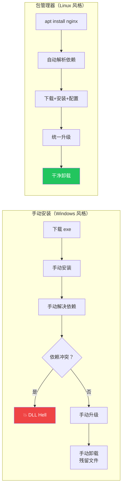
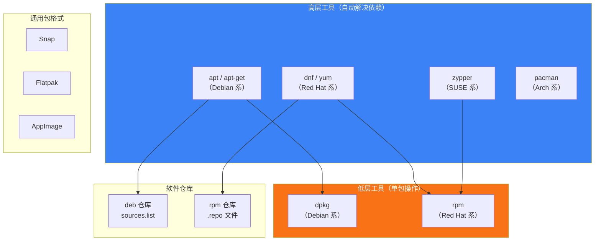
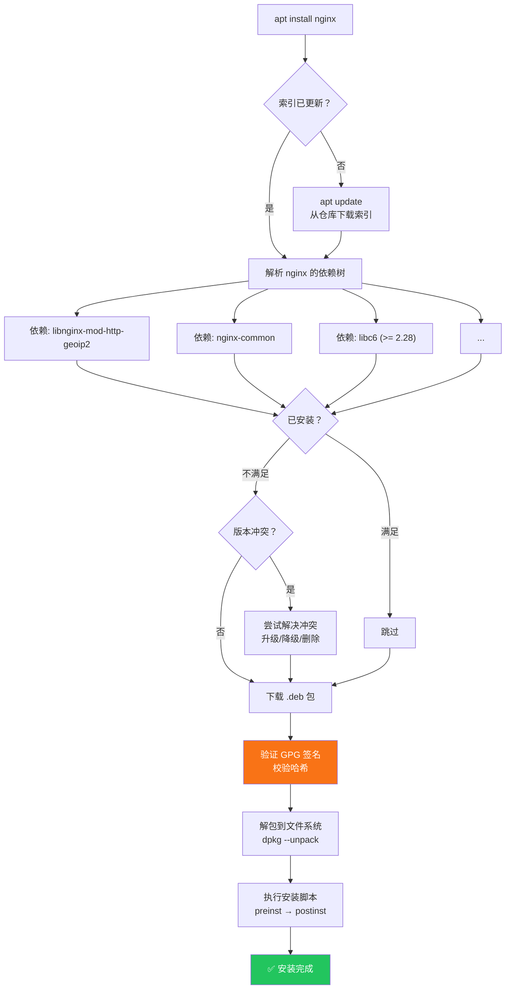
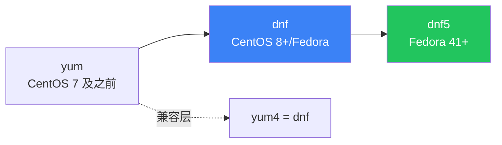
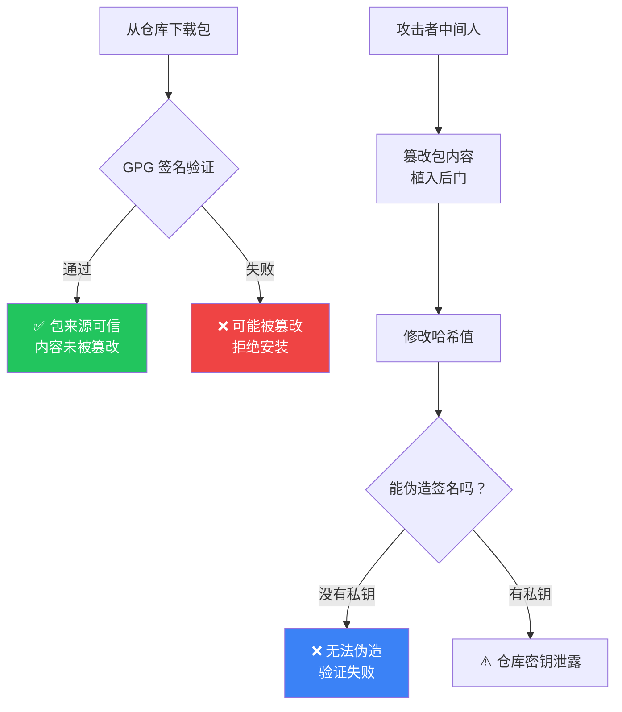
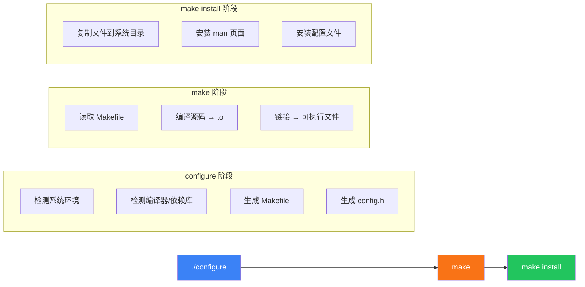
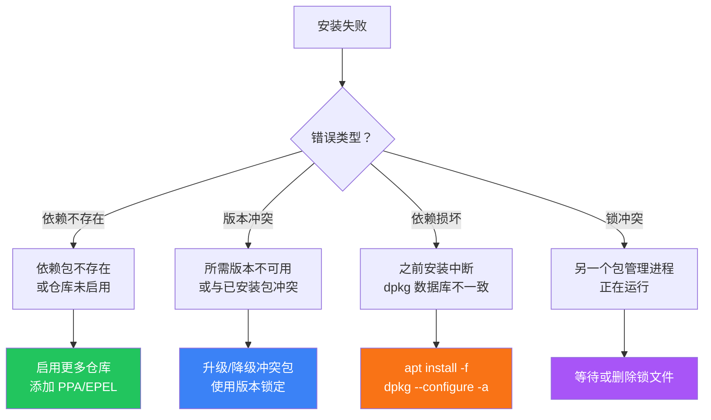

# 软件包管理

软件包管理是 Linux 系统管理的核心技能。不同于 Windows 的"下载安装包 → 下一步 → 完成"，Linux 通过包管理器自动解决依赖、验证签名、统一升级，让成千上万的软件有序共存。本文覆盖 Debian 系和 Red Hat 系的完整包管理工作流，从 apt/dnf 日常操作到源码编译、Snap/Flatpak 通用包，再到依赖地狱的排查与解决。

## 1. 软件包管理概述

### 1.1 为什么需要包管理器



### 1.2 包管理器层次



| 层次 | 工具 | 功能 |
|------|------|------|
| **高层** | apt, dnf, yum | 自动依赖解决、仓库搜索、批量升级 |
| **低层** | dpkg, rpm | 单包安装/查询/卸载，不解决依赖 |
| **仓库** | sources.list, .repo | 软件包的来源配置 |
| **通用** | Snap, Flatpak | 跨发行版、沙箱化 |

## 2. dpkg —— Debian 系低层工具

### 2.1 基本操作

```bash
# 安装 .deb 包（不会自动解决依赖！）
sudo dpkg -i package.deb

# 卸载包（保留配置文件）
sudo dpkg -r package_name

# 完全卸载（包括配置文件）
sudo dpkg --purge package_name

# 查看已安装的包
dpkg -l                         # 列出所有已安装的包
dpkg -l | grep nginx            # 查找 nginx
dpkg -l | grep "^ii"            # 只看已正确安装的

# 查看包的文件列表
dpkg -L nginx                   # nginx 安装了哪些文件

# 查看某个文件属于哪个包
dpkg -S /usr/sbin/nginx         # /usr/sbin/nginx 属于哪个包
dpkg -S $(which nginx)          # nginx 命令属于哪个包

# 查看包信息
dpkg -s nginx                   # 详细状态信息
dpkg -I package.deb             # 查看 .deb 文件的信息（未安装）
dpkg -c package.deb             # 查看 .deb 文件的内容列表（未安装）
```

### 2.2 dpkg 的输出解读

```bash
dpkg -l | head -5
# Desired=Unknown/Install/Remove/Purge/Hold
# | Status=Not/Inst/Conf-files/Unpacked/halF-conf/Half-inst/trig-aWait/Trig-pend
# |/ Err?=(none)/Reinst-required (Status,Err: uppercase=bad)
# ||/ Name           Version      Architecture Description
# +++-==============-============-============-=================================
# ii  adduser        3.118ubuntu5 all          add and remove users and groups
# ^^
# ||
# |└── 状态：i=已安装 n=未安装
# └── 期望：i=安装 r=卸载 p=清除 h=锁定

# 常见状态
# ii  - 已正确安装
# rc  - 已卸载但配置文件残留
# un  - 未安装

# 清理残留配置
dpkg -l | grep "^rc" | awk '{print $2}' | xargs sudo dpkg --purge
```

::: warning dpkg -i 的依赖问题
`dpkg -i` 不会自动解决依赖。如果安装失败，需要用 apt 修复：
```bash
sudo dpkg -i package.deb    # 可能报依赖错误
sudo apt install -f         # 自动修复依赖
```
:::

## 3. apt —— Debian 系高层工具

### 3.1 apt vs apt-get

`apt` 是 `apt-get` 和 `apt-cache` 的现代统一接口，专为交互式使用设计：

| 命令 | apt（推荐） | apt-get（脚本兼容） |
|------|-------------|---------------------|
| 安装 | `apt install` | `apt-get install` |
| 卸载 | `apt remove` | `apt-get remove` |
| 更新索引 | `apt update` | `apt-get update` |
| 升级 | `apt upgrade` | `apt-get upgrade` |
| 搜索 | `apt search` | `apt-cache search` |
| 查看信息 | `apt show` | `apt-cache show` |
| 列表 | `apt list` | 无直接等价 |

::: tip 什么时候用 apt-get？
- **交互式使用**：用 `apt`（输出更友好、有进度条）
- **脚本中使用**：用 `apt-get`（输出稳定，不会因格式变化导致脚本失败）
- `apt` 命令会提示"WARNING: apt does not have a stable CLI interface"，这就是告诉你在脚本中用 apt-get
:::

### 3.2 apt 日常操作

```bash
# ===== 仓库操作 =====

# 更新软件包索引（不升级任何软件！）
sudo apt update

# 升级已安装的包（不删除/安装新包）
sudo apt upgrade

# 完整升级（可以删除/安装新包来解决依赖变化）
sudo apt full-upgrade
# 等价于 apt-get dist-upgrade

# ===== 安装/卸载 =====

# 安装包
sudo apt install nginx

# 安装指定版本
sudo apt install nginx=1.18.0-0ubuntu1

# 安装多个包
sudo apt install nginx mysql-server php-fpm

# 安装但不升级（如果已安装）
sudo apt install nginx --no-upgrade

# 重新安装
sudo apt install --reinstall nginx

# 仅下载不安装
sudo apt install --download-only nginx
# 下载的包在 /var/cache/apt/archives/

# 卸载包（保留配置）
sudo apt remove nginx

# 完全卸载（包括配置）
sudo apt purge nginx

# 卸载不再需要的依赖
sudo apt autoremove

# 清理下载缓存
sudo apt clean          # 清除所有缓存
sudo apt autoclean      # 只清除过时的缓存

# ===== 查询 =====

# 搜索包
apt search nginx
apt search ^nginx$      # 精确匹配

# 查看包信息
apt show nginx

# 列出已安装的包
apt list --installed

# 列出可升级的包
apt list --upgradable

# 查看包的依赖
apt depends nginx
apt depends nginx --recursive    # 递归依赖

# 查看谁依赖了此包（反向依赖）
apt rdepends nginx

# 查看包的变更日志
apt changelog nginx
```

### 3.3 apt 包解析流程



### 3.4 仓库配置 sources.list

```bash
# /etc/apt/sources.list 格式
# deb http://archive.ubuntu.com/ubuntu/ jammy main restricted
# deb-src http://archive.ubuntu.com/ubuntu/ jammy main restricted
# │       │                                │     │    │
# │       │                                │     │    └── 组件（main/restricted/universe/multiverse）
# │       │                                │     └── 发行版代号（jammy = 22.04）
# │       │                                └── 仓库 URL
# │       └── deb=二进制包，deb-src=源码包
# └── 包类型

# Ubuntu 完整 sources.list 示例
deb http://archive.ubuntu.com/ubuntu/ jammy main restricted
deb http://archive.ubuntu.com/ubuntu/ jammy-updates main restricted
deb http://archive.ubuntu.com/ubuntu/ jammy universe
deb http://archive.ubuntu.com/ubuntu/ jammy-updates universe
deb http://archive.ubuntu.com/ubuntu/ jammy multiverse
deb http://archive.ubuntu.com/ubuntu/ jammy-updates multiverse
deb http://archive.ubuntu.com/ubuntu/ jammy-backports main restricted universe multiverse
deb http://security.ubuntu.com/ubuntu jammy-security main restricted
deb http://security.ubuntu.com/ubuntu jammy-security universe
deb http://security.ubuntu.com/ubuntu jammy-security multiverse

# 使用国内镜像（加速）
# 清华
deb https://mirrors.tuna.tsinghua.edu.cn/ubuntu/ jammy main restricted universe multiverse
# 阿里云
deb https://mirrors.aliyun.com/ubuntu/ jammy main restricted universe multiverse
# 中科大
deb https://mirrors.ustc.edu.cn/ubuntu/ jammy main restricted universe multiverse
```

::: important 组件说明
| 组件 | 说明 | 支持级别 |
|------|------|----------|
| **main** | 官方支持的自由软件 | 完全支持 |
| **restricted** | 官方支持的非自由软件（如驱动） | 完全支持 |
| **universe** | 社区维护的自由软件 | 社区支持 |
| **multiverse** | 非自由软件（有许可限制） | 无保证 |
:::

### 3.5 PPA（Personal Package Archive）

PPA 是 Ubuntu 独有的个人软件仓库机制，用于获取官方仓库中没有或版本较新的软件：

```bash
# 添加 PPA
sudo add-apt-repository ppa:ondrej/php
sudo apt update

# 安装 PPA 中的软件
sudo apt install php8.2

# 删除 PPA
sudo add-apt-repository --remove ppa:ondrej/php

# 列出已添加的 PPA
apt-cache policy | grep -i ppa
# 或
ls /etc/apt/sources.list.d/

# PPA 实际上是添加了一个 .list 文件
cat /etc/apt/sources.list.d/ondrej-ubuntu-php-jammy.list
# deb http://ppa.launchpad.net/ondrej/php/ubuntu/ jammy main
```

::: warning PPA 的安全风险
PPA 由个人维护，软件包未经 Ubuntu 官方审核。添加 PPA 时：
1. 只添加信任的 PPA（知名维护者如 ondrej/php 是安全的）
2. 不要添加过多 PPA，可能导致依赖冲突
3. 生产环境避免使用 PPA，优先用 backports
:::

### 3.6 apt 锁与故障修复

```bash
# 错误：Could not get lock /var/lib/dpkg/lock
# 原因：另一个 apt 进程正在运行

# 检查是否有 apt 进程
ps aux | grep -E 'apt|dpkg'

# 等待它完成，或者（确认安全后）删除锁
sudo rm /var/lib/dpkg/lock
sudo rm /var/lib/apt/lists/lock
sudo rm /var/cache/apt/archives/lock
sudo dpkg --configure -a

# 修复损坏的依赖
sudo apt install -f
sudo dpkg --configure -a

# 强制配置未完成的包
sudo dpkg --configure --pending

# 清理并重建
sudo apt clean
sudo apt autoclean
sudo apt update
```

## 4. rpm —— Red Hat 系低层工具

### 4.1 基本操作

```bash
# 安装 .rpm 包
sudo rpm -ivh package.rpm
#   -i  安装
#   -v  显示详情
#   -h  显示进度条

# 升级包
sudo rpm -Uvh package.rpm      # 升级或安装
sudo rpm -Fvh package.rpm      # 仅升级（如果已安装）

# 卸载包
sudo rpm -e package_name

# 查询已安装的包
rpm -qa                        # 列出所有已安装的包
rpm -qa | grep nginx           # 查找 nginx
rpm -q nginx                   # 查看是否安装

# 查看包信息
rpm -qi nginx                  # 已安装包的信息
rpm -qip package.rpm           # 未安装 .rpm 的信息

# 查看包的文件列表
rpm -ql nginx                  # 已安装包的文件
rpm -qlp package.rpm           # 未安装 .rpm 的文件

# 查看文件属于哪个包
rpm -qf /usr/sbin/nginx
rpm -qf $(which nginx)

# 查看包的依赖
rpm -qR nginx

# 查看包的变更日志
rpm -q --changelog nginx

# 验证包完整性
rpm -V nginx                   # 验证已安装包的文件是否被修改
rpm --checksig package.rpm     # 验证 .rpm 的签名
```

### 4.2 rpm -V 输出解读

```bash
rpm -V nginx
# S.5....T.  c /etc/nginx/nginx.conf
# |||||||||
# ||||||||└── T = mTime（时间戳变化）
# |||||||└─── S = Size（大小变化）
# ||||||└──── 5 = MD5/SHA256（内容变化）
# |||||└───── L = symlink（符号链接变化）
# ||||└────── D = device（设备变化）
# |||└─────── U = user（所有者变化）
# ||└──────── G = group（所属组变化）
# |└───────── M = mode（权限变化）
# └────────── . = 未变化
#
# c = 配置文件
# d = 文档文件
# r = README
# 缺失 = 普通文件
```

## 5. dnf / yum —— Red Hat 系高层工具

### 5.1 yum 与 dnf 的关系



- **yum**：CentOS 7 及更早版本使用，Python 2 编写
- **dnf**：CentOS 8+、Fedora 22+ 使用，Python 3 编写，性能更好
- **dnf5**：C++ 重写，速度更快（Fedora 41+）
- 在 CentOS 8+ 中，`yum` 实际是 `dnf` 的软链接

### 5.2 dnf 日常操作

```bash
# ===== 仓库操作 =====

# 更新软件包索引（dnf 自动在操作前更新）
sudo dnf check-update           # 检查可用更新
sudo dnf makecache              # 手动更新缓存

# 升级
sudo dnf upgrade                # 升级所有包
sudo dnf upgrade nginx          # 升级指定包

# ===== 安装/卸载 =====

# 安装
sudo dnf install nginx
sudo dnf install nginx-1.24.0   # 指定版本

# 卸载
sudo dnf remove nginx
sudo dnf autoremove             # 清理不再需要的依赖

# 重新安装
sudo dnf reinstall nginx

# 下载不安装
sudo dnf download nginx
dnf download --resolve nginx    # 连同依赖一起下载

# ===== 查询 =====

# 搜索
dnf search nginx
dnf search all nginx            # 搜索名称和描述

# 查看信息
dnf info nginx

# 列出可用包
dnf list available
dnf list installed
dnf list updates                # 可升级的包

# 查看依赖
dnf repoquery --requires nginx
dnf repoquery --requires --resolve nginx  # 连同依赖包

# 查看文件属于哪个包
dnf provides /usr/sbin/nginx
dnf provides '*/nginx'          # 用通配符查找命令

# 查看包的文件列表
dnf repoquery -l nginx

# ===== 历史 =====

# 查看操作历史
dnf history
dnf history info 5              # 查看第5次操作详情

# 撤销操作
sudo dnf history undo 5         # 撤销第5次操作

# 重做操作
sudo dnf history redo 5
```

### 5.3 仓库配置

```bash
# 仓库配置文件位置
/etc/yum.repos.d/
# 每个仓库一个 .repo 文件

# .repo 文件格式
cat /etc/yum.repos.d/CentOS-Base.repo
# [baseos]
# name=CentOS Stream $releasever - BaseOS
# baseurl=http://mirror.centos.org/centos/$releasever-stream/BaseOS/$basearch/os/
# gpgcheck=1
# enabled=1
# gpgkey=file:///etc/pki/rpm-gpg/RPM-GPG-KEY-centosofficial

# 添加第三方仓库
# EPEL（Extra Packages for Enterprise Linux）
sudo dnf install epel-release

# Remi（PHP 新版本）
sudo dnf install https://rpms.remirepo.net/enterprise/remi-release-9.rpm

# 查看已启用的仓库
dnf repolist
dnf repolist all               # 包括禁用的

# 启用/禁用仓库
sudo dnf config-manager --enable remi
sudo dnf config-manager --disable remi

# 临时使用某个仓库
sudo dnf --enablerepo=epel install htop

# 使用国内镜像
sudo sed -i 's/mirrorlist/#mirrorlist/g' /etc/yum.repos.d/CentOS-*.repo
sudo sed -i 's|#baseurl=http://mirror.centos.org|baseurl=https://mirrors.aliyun.com|g' /etc/yum.repos.d/CentOS-*.repo
```

### 5.4 dnf 特有功能

```bash
# 包组安装（一键安装一组包）
dnf group list
dnf group info "Development Tools"
sudo dnf group install "Development Tools"

# 模块流（AppStream，CentOS 8+）
dnf module list                 # 列出可用模块
dnf module list php             # 查看 PHP 模块的流
sudo dnf module enable php:8.2  # 启用 PHP 8.2 流
sudo dnf install php            # 安装 PHP 8.2

# 清理缓存
sudo dnf clean all
sudo dnf makecache

# 版本锁定（防止某些包被升级）
sudo dnf install dnf-plugins-core
sudo dnf versionlock add nginx
sudo dnf versionlock list
sudo dnf versionlock delete nginx
```

## 6. GPG 签名与安全

### 6.1 为什么需要 GPG 签名



### 6.2 GPG 密钥管理

```bash
# Debian/Ubuntu

# 查看已信任的密钥
apt-key list                    # 旧方式（已弃用）
gpg --list-keys --keyring /etc/apt/trusted.gpg

# 新方式：密钥存储在 /usr/share/keyrings/ 和 /etc/apt/trusted.gpg.d/
ls /etc/apt/trusted.gpg.d/

# 添加第三方 GPG 密钥（新方式）
curl -fsSL https://packages.docker.com/linux/ubuntu/gpg | \
    sudo gpg --dearmor -o /etc/apt/trusted.gpg.d/docker.gpg

# 在 sources.list 中指定密钥
# deb [arch=amd64 signed-by=/etc/apt/trusted.gpg.d/docker.gpg] https://packages.docker.com/linux/ubuntu jammy stable

# RHEL/CentOS

# 导入仓库 GPG 密钥
sudo rpm --import https://www.elrepo.org/RPM-GPG-KEY-elrepo.org

# 查看已导入的密钥
rpm --query gpg-pubkey

# 验证包签名
rpm --checksig package.rpm
sudo dnf install gnome-keyring   # GUI 密钥管理
```

::: important 安全最佳实践
1. **始终启用 gpgcheck**（`gpgcheck=1` 在 .repo 文件中）
2. **只从可信来源导入 GPG 密钥**
3. **使用 signed-by 指定密钥**，而非全局信任
4. **定期轮换密钥**，移除不再使用的密钥
5. **注意**：`apt-key` 已在 Debian 12 / Ubuntu 22.10 中弃用，使用新方式
:::

## 7. 源码编译安装

### 7.1 什么时候需要源码编译

| 场景 | 说明 |
|------|------|
| 软件不在仓库中 | 小众软件、自研工具 |
| 需要特定编译选项 | 自定义功能、优化参数 |
| 需要最新版本 | 仓库版本滞后 |
| 嵌入式/交叉编译 | 目标平台与编译平台不同 |

### 7.2 经典三步曲



```bash
# 1. 安装编译工具链
sudo apt install build-essential   # Debian/Ubuntu
sudo dnf group install "Development Tools"   # RHEL/CentOS

# 2. 下载源码
wget https://example.com/software-1.0.tar.gz
tar -xzf software-1.0.tar.gz
cd software-1.0/

# 3. configure（检测环境，生成 Makefile）
./configure --help                 # 查看可用选项
./configure --prefix=/usr/local    # 指定安装路径
./configure \
    --prefix=/usr/local \
    --with-openssl=/usr \
    --enable-feature-x \
    --disable-feature-y

# 4. make（编译）
make                # 使用所有 CPU 核心
make -j$(nproc)     # 并行编译（更快）

# 5. make install（安装）
sudo make install

# 6. 更新库缓存
sudo ldconfig
```

### 7.3 源码编译的最佳实践

```bash
# 1. 始终指定 --prefix
# ✅ 好的安装位置
./configure --prefix=/usr/local/software/1.0

# ❌ 不要安装到 /usr（与包管理器冲突）
./configure --prefix=/usr

# 2. 使用 checkinstall 替代 make install
# checkinstall 会创建 .deb/.rpm 包，方便卸载和升级
sudo apt install checkinstall
./configure --prefix=/usr/local
make
sudo checkinstall                 # 交互式创建包
# 之后可以用 dpkg -r 卸载

# 3. 使用 stow 管理多个版本
sudo apt install stow
./configure --prefix=/usr/local/stow/nginx-1.24
make && sudo make install
cd /usr/local/stow
sudo stow nginx-1.24              # 创建软链接到 /usr/local/

# 切换版本
sudo stow -D nginx-1.24           # 移除旧版本链接
cd /usr/local/stow
sudo stow nginx-1.26              # 链接新版本

# 4. 卸载源码安装的软件
# 如果保留了源码目录
sudo make uninstall

# 如果没有保留，需要手动删除
# 或者使用 checkinstall/stow 管理
```

::: warning 源码编译的维护成本
源码编译的软件**不在包管理器的管理范围内**：
- 不会自动升级
- 不会自动修复安全漏洞
- 卸载可能困难
- 依赖关系可能与其他软件冲突

生产环境中，**优先使用包管理器**，只有在必要时才源码编译。如果必须编译，使用 `checkinstall` 或 `stow` 来管理。
:::

## 8. Snap 与 Flatpak

### 8.1 通用包格式对比

| 特性 | Snap | Flatpak | AppImage |
|------|------|---------|----------|
| **沙箱** | ✅ | ✅ | ❌ |
| **自动更新** | ✅ | ✅ | ❌ |
| **跨发行版** | ✅ | ✅ | ✅ |
| **系统服务** | ✅ | ❌ | ❌ |
| **服务器端** | Snap Store（Canonical） | Flathub（社区） | 无中心仓库 |
| **启动速度** | 较慢 | 中等 | 快 |
| **磁盘占用** | 大 | 中等 | 小 |
| **CLI 支持** | ✅ | 有限 | N/A |

### 8.2 Snap

```bash
# 安装 Snap（Ubuntu 已预装）
sudo apt install snapd

# 搜索
snap find "media player"

# 安装
sudo snap install vlc
sudo snap install --classic code       # --classic 不使用沙箱

# 查看已安装
snap list

# 更新
sudo snap refresh                  # 更新所有
sudo snap refresh vlc              # 更新指定

# 回滚
sudo snap revert vlc

# 卸载
sudo snap remove vlc

# 查看包信息
snap info vlc

# 管理Snap服务
snap services
sudo snap restart vlc

# Snap 的目录结构
/snap/bin/          # 可执行文件（需加入 PATH）
/snap/vlc/          # 包文件
/var/snap/          # 数据文件
```

::: warning Snap 的争议
1. Snap Store 是闭源的，只有 Canonical 控制
2. Snap 包启动较慢（首次启动需要挂载 squashfs）
3. 自动更新无法禁用（只能延迟）
4. Ubuntu 用 Snap 替代了 apt 中的某些包（如 Firefox），引发社区不满
5. 服务器端不开源，与其他发行版兼容性差

如果你不想用 Snap，可以：
```bash
# 阻止 Snap 安装
sudo cat > /etc/apt/preferences.d/nosnap.pref << 'EOF'
Package: snapd
Pin: release a=*
Pin-Priority: -10
EOF
```
:::

### 8.3 Flatpak

```bash
# 安装 Flatpak
sudo apt install flatpak         # Debian/Ubuntu
sudo dnf install flatpak         # Fedora 已预装

# 添加 Flathub 仓库
flatpak remote-add --if-not-exists flathub https://flathub.org/repo/flathub.flatpakrepo

# 搜索
flatpak search vlc

# 安装
flatpak install flathub org.videolan.VLC

# 运行
flatpak run org.videolan.VLC

# 查看已安装
flatpak list

# 更新
flatpak update

# 卸载
flatpak uninstall org.videolan.VLC

# 清理不再使用的运行时
flatpak uninstall --unused

# Flatpak 的沙箱权限管理
flatpak info --show-permissions org.videolan.VLC
# 使用 flatseal GUI 工具管理权限
flatpak install flathub com.github.tchx84.Flatseal
```

### 8.4 AppImage

```bash
# AppImage 不需要安装，下载即用
wget https://example.com/app-1.0-x86_64.AppImage
chmod +x app-1.0-x86_64.AppImage
./app-1.0-x86_64.AppImage

# 管理 AppImage（可选）
# 使用 AppImageLauncher
sudo add-apt-repository ppa:appimagelauncher-team/stable
sudo apt update
sudo apt install appimagelauncher

# AppImage 的优缺点
# ✅ 无需安装、无需 root、便携
# ❌ 无沙箱、无自动更新、无依赖管理
```

## 9. 依赖问题排查

### 9.1 常见依赖问题



### 9.2 Debian/Ubuntu 排查

```bash
# 查看依赖问题
sudo apt --fix-broken install    # 修复损坏的依赖
# 或
sudo apt install -f

# 查看某个包的依赖
apt depends nginx
apt-cache depends nginx
apt-cache depends --recurse nginx   # 递归依赖

# 查看反向依赖（谁依赖了此包）
apt rdepends nginx
apt-cache rdepends nginx

# 模拟安装（不实际执行）
apt install -s nginx

# 查看包的候选版本
apt-cache policy nginx
# nginx:
#   Installed: 1.18.0-0ubuntu1
#   Candidate: 1.18.0-0ubuntu1.3
#   Version table:
#      1.24.0-1ubuntu1 500
#         500 http://archive.ubuntu.com/ubuntu jammy-updates/main amd64 Packages
#      1.18.0-0ubuntu1 500
#         500 http://archive.ubuntu.com/ubuntu jammy/main amd64 Packages

# 锁定包版本
sudo apt-mark hold nginx
apt-mark showhold
sudo apt-mark unhold nginx

# 强制安装特定版本
sudo apt install nginx=1.18.0-0ubuntu1

# 清理损坏的包状态
sudo dpkg --configure -a
sudo dpkg --remove --force-remove-reinstreq package_name
```

### 9.3 RHEL/CentOS 排查

```bash
# 查看依赖问题
sudo dnf check                   # 检查依赖完整性
sudo dnf check-update

# 查看包依赖
dnf repoquery --requires nginx
dnf repoquery --requires --resolve nginx

# 查看反向依赖
dnf repoquery --whatrequires nginx

# 查看包提供的能力
dnf provides "libssl.so.3()(64bit)"

# 解决依赖冲突
sudo dnf --allowerasing install package_name   # 允许删除冲突包
sudo dnf --skip-broken upgrade                 # 跳过有问题的包

# 清理缓存重建
sudo dnf clean all
sudo dnf makecache

# 版本锁定
sudo dnf install dnf-plugins-core
sudo dnf versionlock add nginx
sudo dnf versionlock list
sudo dnf versionlock clear
```

### 9.4 "依赖地狱"典型案例

```bash
# 场景：安装 PHP 8.2 但系统默认是 PHP 7.4

# 1. 查看当前 PHP 版本
php -v
# PHP 7.4.3

# 2. 查看可用的 PHP 模块流（CentOS 8+）
dnf module list php
# php     7.2 [d]     common [d], devel, minimal
# php     7.3         common [d], devel, minimal
# php     7.4         common [d], devel, minimal
# php     8.0         common [d], devel, minimal
# php     8.1         common [d], devel, minimal
# php     8.2         common [d], devel, minimal

# 3. 重置并启用新版本
sudo dnf module reset php
sudo dnf module enable php:8.2
sudo dnf install php php-fpm

# Ubuntu 方式：使用 PPA
sudo add-apt-repository ppa:ondrej/php
sudo apt update
sudo apt install php8.2 php8.2-fpm php8.2-mysql
```

## 10. 包管理器速查对比

### 10.1 常用操作对比表

| 操作 | apt (Debian) | dnf (Red Hat) | pacman (Arch) |
|------|-------------|---------------|---------------|
| 更新索引 | `apt update` | 自动 | `pacman -Sy` |
| 升级所有 | `apt upgrade` | `dnf upgrade` | `pacman -Syu` |
| 安装 | `apt install pkg` | `dnf install pkg` | `pacman -S pkg` |
| 卸载 | `apt remove pkg` | `dnf remove pkg` | `pacman -R pkg` |
| 完全卸载 | `apt purge pkg` | `dnf remove pkg` | `pacman -Rns pkg` |
| 搜索 | `apt search pkg` | `dnf search pkg` | `pacman -Ss pkg` |
| 查看信息 | `apt show pkg` | `dnf info pkg` | `pacman -Si pkg` |
| 列出已安装 | `apt list --installed` | `dnf list installed` | `pacman -Q` |
| 查看文件归属 | `dpkg -S file` | `rpm -qf file` | `pacman -Qo file` |
| 清理缓存 | `apt clean` | `dnf clean all` | `pacman -Sc` |
| 自动清理依赖 | `apt autoremove` | `dnf autoremove` | `pacman -Qdtq` |

### 10.2 包格式对比

| 特性 | .deb | .rpm |
|------|------|------|
| **格式** | ar 归档 | cpio 归档 |
| **元数据** | control 文件 | header |
| **安装脚本** | preinst/postinst/prerm/postrm | preinstall/postinstall/preun/postun |
| **依赖声明** | Depends/Recommends/Suggests | Requires/Recommends/Suggests |
| **配置文件** | conffiles 标记 | %config(noreplace) 标记 |
| **签名** | GPG 签名 | GPG 签名 |
| **底层工具** | dpkg | rpm |
| **高层工具** | apt | dnf/yum |

## 11. 实战案例

### 11.1 生产环境系统初始化

```bash
#!/bin/bash
# Ubuntu 服务器初始化脚本

# 1. 更换国内镜像
sudo cp /etc/apt/sources.list /etc/apt/sources.list.bak
sudo sed -i 's|http://archive.ubuntu.com|https://mirrors.aliyun.com|g' /etc/apt/sources.list
sudo sed -i 's|http://security.ubuntu.com|https://mirrors.aliyun.com|g' /etc/apt/sources.list

# 2. 更新系统
sudo apt update && sudo apt upgrade -y

# 3. 安装基础工具
sudo apt install -y \
    vim curl wget git \
    htop tree unzip \
    net-tools dnsutils \
    bash-completion \
    software-properties-common \
    apt-transport-https \
    ca-certificates \
    gnupg lsb-release

# 4. 安装 Docker
curl -fsSL https://download.docker.com/linux/ubuntu/gpg | \
    sudo gpg --dearmor -o /usr/share/keyrings/docker.gpg
echo "deb [arch=$(dpkg --print-architecture) signed-by=/usr/share/keyrings/docker.gpg] \
    https://download.docker.com/linux/ubuntu $(lsb_release -cs) stable" | \
    sudo tee /etc/apt/sources.list.d/docker.list > /dev/null
sudo apt update
sudo apt install -y docker-ce docker-ce-cli containerd.io docker-compose-plugin

# 5. 清理
sudo apt autoremove -y
sudo apt autoclean
```

### 11.2 离线环境安装软件

```bash
# 在联网机器上下载包及依赖

# Debian/Ubuntu
mkdir -p /tmp/offline-packages
cd /tmp/offline-packages
apt download $(apt-cache depends --recurse --no-recommends --no-suggests \
    --no-conflicts --no-breaks --no-replaces --no-enhances nginx | grep "^\w" | sort -u)

# 或使用 apt-rdepends
sudo apt install apt-rdepends
apt download $(apt-rdepends nginx | grep -v "^ " | grep -v "^nginx$" | sort -u)

# 在离线机器上安装
sudo dpkg -i /tmp/offline-packages/*.deb
sudo apt install -f

# RHEL/CentOS
sudo dnf install --downloadonly --downloaddir=/tmp/offline-packages nginx
# 在离线机器上
sudo dnf localinstall /tmp/offline-packages/*.rpm
```

### 11.3 包管理器安全审计

```bash
# 查看最近安装/升级的包
grep " install \| upgrade \| remove " /var/log/dpkg.log | tail -20

# 查看包的变更日志
zcat /usr/share/doc/nginx/changelog.Debian.gz | head -30

# 检查是否有包需要安全更新
sudo apt list --upgradable 2>/dev/null | grep -i security
# Ubuntu 的安全更新在 -security 仓库中
apt-cache policy nginx | grep security

# RHEL/CentOS
sudo dnf updateinfo list security
sudo dnf updateinfo info security

# 审计包文件修改
sudo rpm -Va    # 验证所有已安装包的文件完整性
sudo debsums -c  # Debian 等价工具
```

## 12. 总结

| 知识点 | 关键内容 |
|--------|----------|
| 包管理层次 | 高层（apt/dnf）解决依赖，低层（dpkg/rpm）操作单包 |
| apt | update → install → upgrade → autoremove |
| dnf/yum | install → upgrade → remove → autoremove |
| sources.list | deb URL 代号 组件；国内镜像加速 |
| PPA/EPEL | 第三方仓库，获取新版本或额外软件 |
| GPG 签名 | 验证包来源可信，内容未被篡改 |
| 源码编译 | ./configure → make → make install；用 checkinstall/stow 管理 |
| Snap | Canonical 的通用包格式，沙箱化，自动更新 |
| Flatpak | 社区的通用包格式，沙箱化，Flathub 仓库 |
| 依赖排查 | apt install -f / dnf check / 版本锁定 / 模块流 |

包管理是 Linux 系统管理的日常。掌握 apt/dnf 的基本操作只是起点，理解依赖解析机制、GPG 签名验证、仓库管理才是进阶。正如《Linux 命令行与 Shell 脚本编程大全》所强调的——好的包管理习惯是系统稳定运行的保障。
