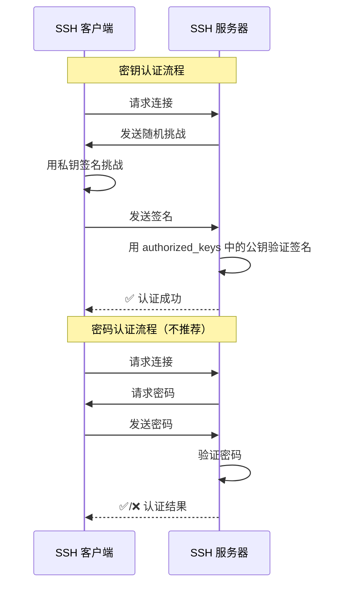
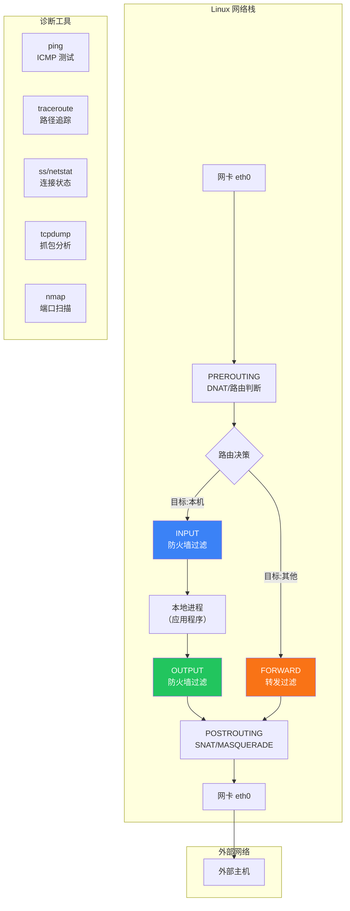

# 网络基础

Linux 天生为网络而生——从最初的 TCP/IP 协议栈实现到如今承载全球互联网基础设施，网络能力是 Linux 最核心的竞争力之一。本文从网络接口配置到路由转发，从 DNS 解析到防火墙策略，从 SSH 安全远程到网络诊断工具链，构建完整的 Linux 网络知识体系。

## 1. 网络接口配置

### 1.1 网络接口命名

Linux 网络接口的命名经历了从传统命名到一致性命名的演变：

```bash
# 传统命名（内核自动分配）
eth0        # 第一块以太网卡
eth1        # 第二块以太网卡
wlan0       # 第一块无线网卡
lo          # 回环接口

# 一致性命名（systemd/udev，CentOS 7+/Ubuntu 16.04+）
enp3s0      # en=以太网, p3=PCI总线3, s0=插槽0
ens33       # en=以太网, s33=热插拔插槽33
enx001122334455  # en=以太网, x=MAC地址
wlp2s0      # wl=无线, p2=PCI总线2, s0=插槽0

# 命名规则
# 前缀：
#   en - 以太网 (Ethernet)
#   wl - 无线局域网 (WLAN)
#   ww - 无线广域网 (WWAN)
# 后缀：
#   pXsY - PCI 总线/插槽
#   sY   - 热插拔插槽
#   xMAC - MAC 地址
#   oN   - 板载设备索引
```

::: tip 恢复传统命名
如果你更喜欢 eth0 这种命名方式：
```bash
# 编辑 GRUB 配置
sudo vim /etc/default/grub
# 在 GRUB_CMDLINE_LINUX 中添加：
# net.ifnames=0 biosdevname=0

sudo update-grub    # Ubuntu
sudo grub2-mkconfig -o /boot/grub2/grub.cfg   # CentOS
sudo reboot
```
:::

### 1.2 ip 命令（现代工具）

`ip` 命令来自 iproute2 包，是 `ifconfig` 的现代替代品：

```bash
# ===== 查看接口 =====

# 列出所有接口
ip link show
ip link show eth0            # 查看指定接口

# 列出 IP 地址
ip addr show
ip addr show eth0
ip -4 addr show              # 只看 IPv4
ip -6 addr show              # 只看 IPv6

# 简写形式
ip a                         # = ip addr show
ip l                         # = ip link show

# ===== 配置 IP =====

# 添加 IP 地址（临时，重启失效）
sudo ip addr add 192.168.1.100/24 dev eth0

# 添加多个 IP（别名）
sudo ip addr add 192.168.1.101/24 dev eth0

# 删除 IP 地址
sudo ip addr del 192.168.1.100/24 dev eth0

# ===== 启用/禁用接口 =====

sudo ip link set eth0 up      # 启用
sudo ip link set eth0 down    # 禁用

# ===== 修改 MTU =====
sudo ip link set eth0 mtu 9000   # 设置巨型帧（Jumbo Frame）

# ===== 修改 MAC 地址 =====
sudo ip link set eth0 down
sudo ip link set eth0 address 00:11:22:33:44:55
sudo ip link set eth0 up
```

### 1.3 ifconfig（传统工具）

```bash
# ifconfig 已被 ip 替代，但仍在广泛使用
# 安装（如果未安装）
sudo apt install net-tools    # Debian/Ubuntu

# 查看接口
ifconfig
ifconfig eth0

# 配置 IP
sudo ifconfig eth0 192.168.1.100 netmask 255.255.255.0
sudo ifconfig eth0 192.168.1.100/24

# 启用/禁用
sudo ifconfig eth0 up
sudo ifconfig eth0 down

# 修改 MTU
sudo ifconfig eth0 mtu 9000

# 查看所有接口（包括禁用的）
ifconfig -a
```

### 1.4 永久配置 IP

#### Ubuntu（Netplan）

```bash
# /etc/netplan/01-netcfg.yaml
# Netplan 是 Ubuntu 18.04+ 的默认网络配置工具

# DHCP 配置
network:
  version: 2
  ethernets:
    eth0:
      dhcp4: true

# 静态 IP 配置
network:
  version: 2
  ethernets:
    eth0:
      addresses:
        - 192.168.1.100/24
        - 2001:db8::100/64    # IPv6（可选）
      routes:
        - to: default
          via: 192.168.1.1
      nameservers:
        addresses:
          - 8.8.8.8
          - 8.8.4.4
        search:
          - example.com
      mtu: 1500

# 双网卡配置
network:
  version: 2
  ethernets:
    eth0:                      # 外网
      addresses: [203.0.113.10/24]
      routes:
        - to: default
          via: 203.0.113.1
    eth1:                      # 内网
      addresses: [10.0.0.1/24]

# 应用配置
sudo netplan apply
sudo netplan try              # 试应用（自动回滚）
```

::: warning Netplan 语法严格
YAML 对缩进敏感！使用空格而非 Tab。建议修改后先用 `sudo netplan try` 测试，确认网络正常后再正式应用，否则可能 SSH 断连。
:::

#### CentOS（NetworkManager / nmcli）

```bash
# nmcli - NetworkManager 命令行接口

# 查看连接
nmcli connection show
nmcli device status

# 创建静态 IP 连接
sudo nmcli connection add \
    con-name static-eth0 \
    ifname eth0 \
    type ethernet \
    ip4 192.168.1.100/24 \
    gw4 192.168.1.1

# 设置 DNS
sudo nmcli connection modify static-eth0 ipv4.dns "8.8.8.8 8.8.4.4"

# 创建 DHCP 连接
sudo nmcli connection add \
    con-name dhcp-eth0 \
    ifname eth0 \
    type ethernet \
    ipv4.method auto

# 启用/禁用连接
sudo nmcli connection up static-eth0
sudo nmcli connection down static-eth0

# 修改 IP
sudo nmcli connection modify static-eth0 ipv4.addresses 192.168.1.200/24

# 查看详细信息
nmcli connection show static-eth0

# 或者直接编辑配置文件
# /etc/sysconfig/network-scripts/ifcfg-eth0
# TYPE=Ethernet
# BOOTPROTO=static
# NAME=eth0
# DEVICE=eth0
# IPADDR=192.168.1.100
# NETMASK=255.255.255.0
# GATEWAY=192.168.1.1
# DNS1=8.8.8.8
# DNS2=8.8.4.4
# ONBOOT=yes
```

### 1.5 DHCP vs 静态 IP

| 方式 | 优点 | 缺点 | 适用场景 |
|------|------|------|----------|
| **DHCP** | 自动配置、避免冲突 | IP 可能变化、依赖 DHCP 服务器 | 桌面、开发机 |
| **静态 IP** | 地址固定、方便管理 | 需手动配置、需协调避免冲突 | 服务器、网络设备 |

::: important 服务器必须用静态 IP
生产服务器使用 DHCP 是运维大忌——IP 变化会导致 DNS 解析失败、防火墙规则失效、集群通信中断。服务器必须配置静态 IP，并将 MAC 与 IP 绑定。
:::

## 2. 路由表

### 2.1 路由基础

路由表决定了数据包从哪个接口、经过哪个网关发送出去。

```bash
# 查看路由表
ip route show
# default via 192.168.1.1 dev eth0           # 默认路由
# 192.168.1.0/24 dev eth0 proto kernel scope link src 192.168.1.100  # 直连路由
# 10.0.0.0/8 via 10.0.0.1 dev eth1           # 静态路由

# 旧方式（已弃用）
route -n
# Kernel IP routing table
# Destination     Gateway         Genmask         Flags Metric Ref    Use Iface
# 0.0.0.0         192.168.1.1     0.0.0.0         UG    100    0        0 eth0
# 192.168.1.0     0.0.0.0         255.255.255.0   U     100    0        0 eth0

# 添加路由
sudo ip route add 10.10.0.0/16 via 192.168.1.2 dev eth0    # 静态路由
sudo ip route add default via 192.168.1.1 dev eth0          # 默认网关

# 删除路由
sudo ip route del 10.10.0.0/16

# 修改默认网关
sudo ip route replace default via 192.168.1.1 dev eth0

# 查看到某个目的地的路由
ip route get 8.8.8.8
# 8.8.8.8 via 192.168.1.1 dev eth0 src 192.168.1.100 uid 1000
#     cache
```

### 2.2 路由匹配规则


路由匹配遵循**最长前缀匹配**原则：掩码越长（越具体）的路由优先级越高。

### 2.3 多网卡路由策略

```bash
# 场景：双网卡服务器
# eth0: 203.0.113.10/24 (外网，默认路由)
# eth1: 10.0.0.1/24 (内网)

# 问题：从内网来的请求，回复从外网网卡出去（源地址不匹配）
# 解决：策略路由

# 1. 创建路由表
echo "200 internal" | sudo tee -a /etc/iproute2/rt_tables

# 2. 添加策略路由规则
sudo ip route add 10.0.0.0/24 dev eth1 src 10.0.0.1 table internal
sudo ip route add default via 10.0.0.254 dev eth1 table internal
sudo ip rule add from 10.0.0.1 table internal

# 3. 验证
ip rule show
ip route show table internal

# 持久化（Netplan）
network:
  version: 2
  ethernets:
    eth0:
      addresses: [203.0.113.10/24]
      routes:
        - to: default
          via: 203.0.113.1
    eth1:
      addresses: [10.0.0.1/24]
      routes:
        - to: 0.0.0.0/0
          via: 10.0.0.254
          table: 200
      routing-policy:
        - from: 10.0.0.1
          table: 200
```

### 2.4 IP 转发

```bash
# Linux 默认不转发数据包（非路由器模式）
# 启用 IP 转发

# 临时启用
sudo sysctl -w net.ipv4.ip_forward=1

# 永久启用
echo "net.ipv4.ip_forward = 1" | sudo tee -a /etc/sysctl.d/99-ipforward.conf
sudo sysctl -p /etc/sysctl.d/99-ipforward.conf

# 验证
sysctl net.ipv4.ip_forward
# net.ipv4.ip_forward = 1

cat /proc/sys/net/ipv4/ip_forward
# 1

# IPv6 转发
sudo sysctl -w net.ipv6.conf.all.forwarding=1
```

## 3. DNS 解析

### 3.1 DNS 解析流程


### 3.2 /etc/hosts —— 静态解析

```bash
# /etc/hosts 格式
# IP地址    主机名    别名
127.0.0.1       localhost
::1             localhost ip6-localhost
192.168.1.100   webserver.example.com webserver
10.0.0.1        db1

# 修改 hosts 立即生效（无需重启）
# 优先级高于 DNS（由 /etc/nsswitch.conf 控制）

# 查看 nsswitch.conf 中的解析顺序
grep hosts /etc/nsswitch.conf
# hosts: files dns myhostname
# files = /etc/hosts
# dns = DNS 查询
# myhostname = systemd 的本地主机名解析
```

### 3.3 /etc/resolv.conf —— DNS 服务器配置

```bash
# /etc/resolv.conf 格式
nameserver 8.8.8.8
nameserver 8.8.4.4
search example.com
domain example.com
options timeout:2 attempts:3

# 常见 DNS 服务器
# Google:     8.8.8.8, 8.8.4.4
# Cloudflare: 1.1.1.1, 1.0.0.1
# 阿里:        223.5.5.5, 223.6.6.6
# 腾讯:        119.29.29.29

# 注意：/etc/resolv.conf 可能被自动覆盖
# systemd-resolved
# NetworkManager
# dhclient

# 防止覆盖的方法
# 方法1：使用 chattr 不可变属性
sudo chattr +i /etc/resolv.conf

# 方法2：配置 systemd-resolved
sudo ln -sf /run/systemd/resolve/resolv.conf /etc/resolv.conf

# 方法3：在 Netplan/DHCP 配置中指定 DNS
```

### 3.4 DNS 查询工具

```bash
# dig - 最专业的 DNS 查询工具
dig example.com                # 查询 A 记录
dig example.com A              # 明确指定 A 记录
dig example.com AAAA           # IPv6 地址
dig example.com MX             # 邮件记录
dig example.com NS             # 名称服务器
dig example.com CNAME          # 别名
dig example.com TXT            # 文本记录
dig example.com ANY            # 所有记录

# 指定 DNS 服务器
dig @8.8.8.8 example.com

# 反向解析
dig -x 93.184.216.34

# 跟踪解析过程
dig +trace example.com

# 简洁输出
dig +short example.com
# 93.184.216.34

# nslookup - 简单查询（Windows 也有）
nslookup example.com
nslookup example.com 8.8.8.8

# host - 简洁输出
host example.com
host -t MX example.com
host -t NS example.com

# 修改 /etc/hosts 测试
# 临时将域名指向特定 IP（开发调试常用）
echo "127.0.0.1  api.example.com" | sudo tee -a /etc/hosts
curl api.example.com            # 访问本地服务

# 测试完毕后删除
sudo vim /etc/hosts             # 删除添加的行
```

### 3.5 systemd-resolved

```bash
# Ubuntu 18.04+ 默认使用 systemd-resolved
# 它充当本地 DNS 缓存和存根解析器

# 查看状态
systemd-resolve --status
# 或新版
resolvectl status

# 查看缓存统计
resolvectl statistics

# 清除缓存
resolvectl flush-caches

# 查询
resolvectl query example.com

# 配置
# /etc/systemd/resolved.conf
[Resolve]
DNS=8.8.8.8 8.8.4.4
FallbackDNS=1.1.1.1
Domains=example.com
DNSStubListener=yes
```

## 4. 防火墙

### 4.1 Linux 防火墙体系


### 4.2 iptables

```bash
# 查看规则
sudo iptables -L                    # 列出所有规则
sudo iptables -L -n                 # 不解析域名（更快）
sudo iptables -L -v                 # 显示计数器
sudo iptables -L -n --line-numbers  # 显示行号
sudo iptables -t nat -L -n          # 查看 NAT 表

# 五链四表
# 链：PREROUTING, INPUT, FORWARD, OUTPUT, POSTROUTING
# 表：filter（默认）, nat, mangle, raw

# 基本操作
# -A 追加, -I 插入, -D 删除, -F 清空
# -s 源地址, -d 目标地址
# -p 协议, --dport 目标端口
# -j 动作: ACCEPT, DROP, REJECT, LOG

# 允许 SSH
sudo iptables -A INPUT -p tcp --dport 22 -j ACCEPT

# 允许已建立的连接
sudo iptables -A INPUT -m state --state ESTABLISHED,RELATED -j ACCEPT

# 允许本地回环
sudo iptables -A INPUT -i lo -j ACCEPT

# 允许 HTTP/HTTPS
sudo iptables -A INPUT -p tcp --dport 80 -j ACCEPT
sudo iptables -A INPUT -p tcp --dport 443 -j ACCEPT

# 默认策略：拒绝入站
sudo iptables -P INPUT DROP
sudo iptables -P FORWARD DROP
sudo iptables -P OUTPUT ACCEPT

# 删除规则
sudo iptables -D INPUT -p tcp --dport 22 -j ACCEPT      # 按规则内容删除
sudo iptables -D INPUT 3                                   # 按行号删除

# 保存规则
sudo apt install iptables-persistent      # Debian/Ubuntu
sudo netfilter-persistent save
sudo iptables-save > /etc/iptables/rules.v4

sudo iptables-save > /etc/sysconfig/iptables   # CentOS 6
```

### 4.3 ufw（Ubuntu 简化防火墙）

```bash
# ufw = Uncomplicated Firewall，Ubuntu 默认防火墙工具

# 启用/禁用
sudo ufw enable
sudo ufw disable

# 查看状态
sudo ufw status
sudo ufw status verbose
sudo ufw status numbered          # 带编号

# 允许/拒绝端口
sudo ufw allow 22                 # 允许 SSH
sudo ufw allow 80/tcp             # 允许 HTTP
sudo ufw allow 443/tcp            # 允许 HTTPS
sudo ufw allow 3000:4000/tcp      # 允许端口范围
sudo ufw deny 3306                # 拒绝 MySQL

# 允许/拒绝特定 IP
sudo ufw allow from 192.168.1.0/24           # 允许网段
sudo ufw allow from 192.168.1.100            # 允许 IP
sudo ufw allow from 192.168.1.100 to any port 22  # IP + 端口

# 按服务名
sudo ufw allow ssh
sudo ufw allow http
sudo ufw allow https

# 删除规则
sudo ufw delete allow 80          # 按规则内容
sudo uufw delete 3                # 按编号

# 拒绝出站
sudo ufw reject out 25            # 拒绝 SMTP 出站

# 日志
sudo ufw logging on
sudo ufw logging medium           # 级别：off/low/medium/high/full

# 重置
sudo ufw reset
```

### 4.4 firewalld（RHEL/CentOS 防火墙）

```bash
# firewalld 使用"区域"概念管理防火墙规则

# 查看状态
sudo systemctl status firewalld
sudo firewall-cmd --state

# 查看当前区域
sudo firewall-cmd --get-default-zone
sudo firewall-cmd --get-active-zones

# 查看区域规则
sudo firewall-cmd --list-all
sudo firewall-cmd --zone=public --list-all

# 添加服务/端口
sudo firewall-cmd --add-service=http               # 临时
sudo firewall-cmd --add-service=http --permanent    # 永久
sudo firewall-cmd --add-port=8080/tcp               # 临时
sudo firewall-cmd --add-port=8080/tcp --permanent   # 永久

# 常用服务
sudo firewall-cmd --add-service=ssh --permanent
sudo firewall-cmd --add-service=https --permanent
sudo firewall-cmd --add-service=mysql --permanent

# 重载配置（修改 --permanent 后必须重载）
sudo firewall-cmd --reload

# 允许特定 IP
sudo firewall-cmd --add-source=192.168.1.0/24 --zone=trusted
sudo firewall-cmd --add-rich-rule='rule family="ipv4" source address="192.168.1.100" port port="3306" protocol="tcp" accept'

# 端口转发
sudo firewall-cmd --add-forward-port=port=80:proto=tcp:toport=8080 --permanent

# 区域
sudo firewall-cmd --set-default-zone=dmz
sudo firewall-cmd --zone=internal --change-interface=eth1

# 查看可用服务
sudo firewall-cmd --get-services
```

::: important 临时 vs 永久规则
- 不加 `--permanent`：临时规则，重启/重载后丢失
- 加 `--permanent`：永久规则，需要 `--reload` 才生效
- 推荐工作流：先临时测试，确认无误后改为永久

```bash
# 推荐流程
sudo firewall-cmd --add-port=8080/tcp            # 临时测试
curl http://server:8080                            # 验证
sudo firewall-cmd --add-port=8080/tcp --permanent # 确认后永久化
sudo firewall-cmd --reload
```
:::

### 4.5 防火墙选型建议

| 工具 | 适用系统 | 复杂度 | 灵活性 |
|------|----------|--------|--------|
| **iptables** | 所有 Linux | 高 | 最高 |
| **nftables** | 新版 Linux | 中 | 高 |
| **ufw** | Ubuntu/Debian | 低 | 中 |
| **firewalld** | RHEL/CentOS/Fedora | 中 | 高 |

```bash
# 各系统默认防火墙
# Ubuntu: ufw（底层 iptables/nftables）
# CentOS 7: firewalld（底层 iptables）
# CentOS 8+: firewalld（底层 nftables）
# Debian: 可选 ufw 或 nftables
```

## 5. SSH 远程管理

### 5.1 SSH 基础

```bash
# 基本连接
ssh user@hostname                # 使用默认端口 22
ssh user@192.168.1.100
ssh -p 2222 user@host            # 指定端口

# 首次连接会验证主机指纹
# The authenticity of host '192.168.1.100' can't be established.
# ED25519 key fingerprint is SHA256:xxxxxx.
# Are you sure you want to continue connecting (yes/no)?

# 主机指纹存储在 ~/.ssh/known_hosts
# 如果主机重装系统，指纹变化会导致连接失败
# 解决：删除旧指纹
ssh-keygen -R 192.168.1.100

# 执行远程命令
ssh user@host "uname -a"
ssh user@host "df -h"
ssh user@host 'sudo apt update'

# 使用特定密钥
ssh -i ~/.ssh/mykey user@host

# 启用详细输出（调试连接问题）
ssh -v user@host
ssh -vvv user@host              # 最详细
```

### 5.2 密钥认证



```bash
# 1. 生成密钥对
ssh-keygen -t ed25519 -C "alice@workstation"
# 推荐算法：ed25519（更快更安全）
# 替代：ssh-keygen -t rsa -b 4096（兼容性更好）

# 生成过程
# Generating public/private ed25519 key pair.
# Enter file in which to save the key (/home/alice/.ssh/id_ed25519):
# Enter passphrase (empty for no passphrase):    # 建议设置密码短语
# Enter same passphrase again:

# 密钥文件
# ~/.ssh/id_ed25519       # 私钥（绝不能泄露！）
# ~/.ssh/id_ed25519.pub   # 公钥（可以公开）

# 2. 将公钥上传到服务器
# 方法一：ssh-copy-id（最简单）
ssh-copy-id user@host
ssh-copy-id -i ~/.ssh/id_ed25519.pub user@host

# 方法二：手动复制
cat ~/.ssh/id_ed25519.pub | ssh user@host "mkdir -p ~/.ssh && cat >> ~/.ssh/authorized_keys"

# 方法三：直接复制文件内容
scp ~/.ssh/id_ed25519.pub user@host:~/.ssh/authorized_keys

# 3. 服务器端设置
# ~/.ssh/authorized_keys 权限必须正确
chmod 700 ~/.ssh
chmod 600 ~/.ssh/authorized_keys

# 4. 测试
ssh user@host    # 应该无需密码直接登录
```

### 5.3 SSH 客户端配置 ~/.ssh/config

```bash
# ~/.ssh/config 示例

# 基本配置
Host myserver
    HostName 192.168.1.100
    User alice
    Port 22
    IdentityFile ~/.ssh/id_ed25519

# 使用别名连接
# ssh myserver  等价于  ssh -i ~/.ssh/id_ed25519 alice@192.168.1.100

# 跳板机配置
Host jump
    HostName jump.example.com
    User admin
    IdentityFile ~/.ssh/jump_key

Host prod
    HostName 10.0.0.50
    User deploy
    IdentityFile ~/.ssh/prod_key
    ProxyJump jump                  # 通过跳板机连接
    # 或使用旧语法
    # ProxyCommand ssh -W %h:%p jump

# 多跳配置
Host bastion
    HostName bastion.example.com
    User admin

Host internal
    HostName 192.168.10.5
    ProxyJump bastion

Host db
    HostName 10.0.0.100
    ProxyJump bastion,internal      # 多级跳板

# 通用配置
Host *
    ServerAliveInterval 60          # 每 60 秒发送心跳
    ServerAliveCountMax 3           # 3 次无响应断开
    ConnectTimeout 10               # 连接超时 10 秒
    AddKeysToAgent yes              # 自动添加到 ssh-agent
    UseKeychain yes                 # macOS Keychain

# 保持连接（防止断开）
Host *
    TCPKeepAlive yes
    ServerAliveInterval 30

# 连接复用（加速重复连接）
Host *
    ControlMaster auto
    ControlPath ~/.ssh/sockets/%r@%h-%p
    ControlPersist 600              # 保持 10 分钟

# 创建 socket 目录
mkdir -p ~/.ssh/sockets
```

### 5.4 SSH 服务端安全加固

```bash
# /etc/ssh/sshd_config 关键配置

# 1. 禁止 root 登录
PermitRootLogin no

# 2. 禁止密码认证（只用密钥）
PasswordAuthentication no
PubkeyAuthentication yes

# 3. 限制可登录用户
AllowUsers alice bob deploy
# 或
AllowGroups ssh-users

# 4. 修改默认端口（减小被扫描概率）
Port 2222

# 5. 禁用空密码
PermitEmptyPasswords no

# 6. 限制认证尝试
MaxAuthTries 3

# 7. 设置登录超时
LoginGraceTime 30

# 8. 禁用不必要的认证方式
ChallengeResponseAuthentication no
KbdInteractiveAuthentication no
UsePAM no                          # 谨慎，可能影响其他功能

# 9. 限制会话
MaxSessions 5
MaxStartups 10:30:100

# 10. 日志
SyslogFacility AUTH
LogLevel VERBOSE

# 重启 SSH（不要断开当前连接！验证后再断开）
sudo systemctl restart sshd

# 验证配置语法
sudo sshd -t
```

::: warning 修改 SSH 配置的正确姿势
1. 保持当前 SSH 会话不关闭
2. 修改 sshd_config
3. 用 `sudo sshd -t` 检查语法
4. 重启 sshd
5. 开一个新终端测试连接
6. 确认能连接后再关闭旧会话

如果配置错误导致无法连接，旧会话仍然可以用来修复！
:::

### 5.5 ssh-agent 与密钥管理

```bash
# 启动 ssh-agent
eval "$(ssh-agent -s)"

# 添加密钥
ssh-add ~/.ssh/id_ed25519
# Enter passphrase for ~/.ssh/id_ed25519:

# 查看已添加的密钥
ssh-add -l

# 删除所有密钥
ssh-add -D

# 删除指定密钥
ssh-add -d ~/.ssh/id_ed25519

# 锁定/解锁 agent
ssh-add -x          # 锁定（需要密码解锁）
ssh-add -X          # 解锁

# 自动启动 ssh-agent（写入 ~/.bashrc）
if [ -z "$SSH_AUTH_SOCK" ]; then
    eval "$(ssh-agent -s)"
    ssh-add ~/.ssh/id_ed25519 2>/dev/null
fi

# systemd 用户服务方式（更优雅）
systemctl --user enable --now ssh-agent
# 在 ~/.bashrc 中添加：
# export SSH_AUTH_SOCK="$XDG_RUNTIME_DIR/ssh-agent.socket"
```

## 6. 网络诊断工具

### 6.1 Linux 网络数据包流向



### 6.2 ping —— 连通性测试

```bash
# 基本用法
ping 8.8.8.8
ping google.com
ping -c 4 google.com            # 发送 4 个包后停止
ping -i 0.5 google.com          # 每 0.5 秒发送一次
ping -W 2 google.com            # 超时 2 秒
ping -s 1400 google.com         # 指定包大小（MTU 测试）

# 输出解读
# 64 bytes from 8.8.8.8: icmp_seq=1 ttl=116 time=1.23 ms
#                     │          │         │
#                     │          │         └── 往返延迟
#                     │          └── TTL（每经过一个路由器减 1）
#                     └── 响应字节

# 统计信息
# --- google.com ping statistics ---
# 4 packets transmitted, 4 received, 0% packet loss, time 3002ms
# rtt min/avg/max/mdev = 1.123/1.456/2.001/0.321 ms
#                   最小/平均/最大/偏差

# ping 不通的可能原因
# 1. 对方不在线
# 2. 防火墙拦截 ICMP
# 3. DNS 解析失败（ping 域名时）
# 4. 本机网络配置错误

# 注意：ping 不通不代表服务不可用
# 很多服务器禁用了 ICMP（安全考虑）
# 应该用 curl/telnet 测试具体端口
```

### 6.3 traceroute —— 路径追踪

```bash
# 追踪到目标的网络路径
traceroute google.com
traceroute -n google.com           # 不解析域名（更快）
traceroute -I google.com           # 使用 ICMP（某些网络更有效）
traceroute -T -p 443 google.com    # 使用 TCP 443（绕过 ICMP 过滤）

# 输出解读
# traceroute to google.com (142.250.80.46), 30 hops max, 60 byte packets
#  1  gateway (192.168.1.1)  0.523 ms  0.412 ms  0.398 ms
#  2  10.0.0.1 (10.0.0.1)    1.234 ms  1.123 ms  1.098 ms
#  3  * * *                           # 这一跳不响应
#  4  isp-router (203.0.113.1) 5.432 ms 5.321 ms 5.210 ms
#  ...
#  8  google.com (142.250.80.46) 10.123 ms 10.012 ms 9.987 ms

# * * * 表示该路由器不响应 ICMP 或被防火墙过滤
# 延迟突然增大可能表示网络拥塞或链路差

# mtr - 更好的 traceroute（持续监测）
sudo apt install mtr      # Debian/Ubuntu
sudo dnf install mtr      # RHEL/CentOS
mtr google.com            # 交互式
mtr --report google.com   # 报告模式
mtr -n google.com         # 不解析域名
```

### 6.4 ss / netstat —— 连接状态

```bash
# ss - 现代工具（推荐）
ss -t           # TCP 连接
ss -u           # UDP 连接
ss -l           # 监听端口
ss -tln         # TCP 监听端口（不解析域名）
ss -tlnp        # 显示进程信息
ss -s           # 统计摘要

# 常用组合
ss -tlnp        # 查看所有 TCP 监听端口及进程
ss -tnp         # 查看所有 TCP 已建立连接
ss -tn state established  # 只看已建立连接
ss -tln | grep :80        # 查看谁在监听 80 端口

# 输出示例
# State   Recv-Q  Send-Q  Local Address:Port  Peer Address:Port  Process
# LISTEN  0       128     0.0.0.0:22          0.0.0.0:*          users:(("sshd",pid=1234,fd=3))
# ESTAB   0       0       192.168.1.100:22    10.0.0.1:54321     users:(("sshd",pid=5678,fd=4))

# netstat - 传统工具
netstat -tlnp   # TCP 监听端口
netstat -unlp   # UDP 监听端口
netstat -tnp    # TCP 已建立连接
netstat -anp    # 所有连接
netstat -rn     # 路由表
netstat -i      # 网卡统计

# 查看特定端口
sudo ss -tlnp | grep :8080
sudo lsof -i :8080              # 另一个方法
sudo fuser 8080/tcp             # 又一个方法
```

### 6.5 tcpdump —— 抓包分析

```bash
# 基本抓包
sudo tcpdump                     # 抓所有包
sudo tcpdump -i eth0             # 指定接口
sudo tcpdump -c 100              # 只抓 100 个包
sudo tcpdump -w capture.pcap     # 保存到文件（Wireshark 分析）

# 过滤
sudo tcpdump host 192.168.1.100              # 指定主机
sudo tcpdump port 80                         # 指定端口
sudo tcpdump port 443                        # HTTPS
sudo tcpdump src 192.168.1.100               # 源地址
sudo tcpdump dst 192.168.1.100               # 目标地址
sudo tcpdump tcp port 22                     # SSH 流量

# 组合过滤
sudo tcpdump 'host 192.168.1.100 and port 80'
sudo tcpdump 'tcp[tcpflags] & tcp-syn != 0'  # 只抓 SYN 包
sudo tcpdump 'port 53'                        # DNS 查询

# 显示选项
sudo tcpdump -n                  # 不解析域名
sudo tcpdump -nn                 # 不解析域名和端口
sudo tcpdump -v                  # 详细输出
sudo tcpdump -vv                 # 更详细
sudo tcpdump -X                  # 显示包内容（十六进制+ASCII）

# 读取抓包文件
sudo tcpdump -r capture.pcap
# 推荐用 Wireshark 打开 .pcap 文件进行可视化分析

# 实用示例

# 抓 HTTP 请求（快速查看）
sudo tcpdump -i eth0 -A -s 0 'tcp port 80 and (((ip[2:2] - ((ip[0]&0xf)<<2)) - ((tcp[12]&0xf0)>>2)) != 0)'

# 抓 TCP 三次握手
sudo tcpdump -i eth0 'tcp[tcpflags] & (tcp-syn|tcp-ack) != 0'

# 统计流量
sudo tcpdump -i eth0 -q -s 0
```

### 6.6 nmap —— 端口扫描

```bash
# 安装
sudo apt install nmap     # Debian/Ubuntu
sudo dnf install nmap     # RHEL/CentOS

# 基本扫描
nmap 192.168.1.100                    # 扫描常见端口
nmap -p 80,443,8080 192.168.1.100    # 指定端口
nmap -p 1-65535 192.168.1.100        # 全端口扫描
nmap -sU -p 53 192.168.1.100         # UDP 扫描

# 扫描类型
nmap -sS 192.168.1.100    # SYN 扫描（半开扫描，默认）
nmap -sT 192.168.1.100    # TCP 全连接扫描
nmap -sU 192.168.1.100    # UDP 扫描
nmap -sA 192.168.1.100    # ACK 扫描（防火墙探测）

# 服务版本探测
nmap -sV 192.168.1.100    # 探测服务版本
nmap -sV -p 80 192.168.1.100

# 操作系统探测
nmap -O 192.168.1.100

# 综合扫描
nmap -A 192.168.1.100     # -A = -sV + -O + 脚本 + traceroute

# 子网扫描
nmap 192.168.1.0/24       # 扫描整个 C 类网段
nmap -sn 192.168.1.0/24   # 只做主机发现（不扫端口）

# 输出格式
nmap -oN scan.txt 192.168.1.100       # 普通文本
nmap -oX scan.xml 192.168.1.100       # XML
nmap -oG scan.gnmap 192.168.1.100     # Grepable

# 常用组合
nmap -sS -sV -O -p- 192.168.1.100     # 全面扫描（较慢）
nmap -T4 -F 192.168.1.100             # 快速扫描（常用端口）
```

::: warning nmap 法律风险
nmap 是强大的网络侦察工具，但**仅应在自己拥有或获得授权的系统上使用**。未经授权扫描他人网络在大多数国家属于违法行为。
:::

### 6.7 其他诊断工具

```bash
# curl - HTTP 请求
curl -v https://example.com          # 详细输出
curl -I https://example.com          # 只看响应头
curl -o /dev/null -s -w "%{http_code}\n" https://example.com  # 只看状态码
curl --connect-timeout 5 https://example.com  # 超时 5 秒
curl -x socks5://proxy:1080 https://example.com  # 代理

# wget - 下载
wget https://example.com/file.zip
wget -c https://example.com/file.zip    # 断点续传
wget -q https://example.com/file.zip    # 安静模式

# nc (netcat) - 网络瑞士军刀
nc -zv 192.168.1.100 80              # 测试端口连通性
nc -l 8080                           # 监听端口（服务端）
nc 192.168.1.100 8080                # 连接端口（客户端）
echo "hello" | nc 192.168.1.100 8080 # 发送数据

# mtr - 持续 traceroute
mtr -n --report google.com

# dig - DNS 查询
dig +short example.com

# nslookup - DNS 查询
nslookup example.com

# arp - ARP 表
ip neigh show                        # 现代
arp -a                               # 传统

# ethtool - 网卡信息
sudo ethtool eth0                    # 网卡详细信息
sudo ethtool -i eth0                 # 驱动信息
sudo ethtool -S eth0                 # 统计信息
sudo ethtool -k eth0                 # 卸载特性

# iperf3 - 带宽测试
iperf3 -s                            # 服务端
iperf3 -c 192.168.1.100              # 客户端
iperf3 -c 192.168.1.100 -u -b 1G    # UDP 测试，目标 1Gbps
iperf3 -c 192.168.1.100 -R          # 反向测试
```

### 6.8 网络故障排查流程


## 7. 实战案例

### 7.1 服务器网络初始化脚本

```bash
#!/bin/bash
# Ubuntu Server 网络初始化

# 1. 配置静态 IP（Netplan）
sudo tee /etc/netplan/01-static.yaml << 'EOF'
network:
  version: 2
  ethernets:
    eth0:
      addresses: [192.168.1.100/24]
      routes:
        - to: default
          via: 192.168.1.1
      nameservers:
        addresses: [8.8.8.8, 223.5.5.5]
      dhcp4: false
EOF

sudo netplan apply

# 2. 配置防火墙
sudo ufw default deny incoming
sudo ufw default allow outgoing
sudo ufw allow ssh
sudo ufw allow http
sudo ufw allow https
sudo ufw --force enable

# 3. 配置 SSH
sudo sed -i 's/^#*PermitRootLogin.*/PermitRootLogin no/' /etc/ssh/sshd_config
sudo sed -i 's/^#*PasswordAuthentication.*/PasswordAuthentication no/' /etc/ssh/sshd_config
sudo systemctl restart sshd

# 4. 启用 IP 转发（如果需要）
echo "net.ipv4.ip_forward = 1" | sudo tee /etc/sysctl.d/99-ipforward.conf
sudo sysctl -p /etc/sysctl.d/99-ipforward.conf

# 5. 验证
echo "=== IP 地址 ==="
ip -4 addr show eth0
echo "=== 路由 ==="
ip route show
echo "=== DNS ==="
cat /etc/resolv.conf
echo "=== 防火墙 ==="
sudo ufw status
echo "=== SSH ==="
sudo sshd -T | grep -E 'permitrootlogin|passwordauthentication'
```

### 7.2 网络性能调优

```bash
# 1. 调整 TCP 缓冲区
sudo sysctl -w net.core.rmem_max=16777216
sudo sysctl -w net.core.wmem_max=16777216
sudo sysctl -w net.ipv4.tcp_rmem='4096 87380 16777216'
sudo sysctl -w net.ipv4.tcp_wmem='4096 65536 16777216'

# 2. 启用 TCP Fast Open
sudo sysctl -w net.ipv4.tcp_fastopen=3

# 3. 调整连接队列
sudo sysctl -w net.core.somaxconn=65535
sudo sysctl -w net.ipv4.tcp_max_syn_backlog=65535

# 4. 减少 TIME_WAIT
sudo sysctl -w net.ipv4.tcp_fin_timeout=15
sudo sysctl -w net.ipv4.tcp_tw_reuse=1

# 5. 启用 BBR 拥塞控制（Linux 4.9+）
sudo sysctl -w net.core.default_qdisc=fq
sudo sysctl -w net.ipv4.tcp_congestion_control=bbr

# 验证
sysctl net.ipv4.tcp_congestion_control
# net.ipv4.tcp_congestion_control = bbr

# 6. 持久化
sudo tee /etc/sysctl.d/99-network-tuning.conf << 'EOF'
net.core.rmem_max = 16777216
net.core.wmem_max = 16777216
net.ipv4.tcp_rmem = 4096 87380 16777216
net.ipv4.tcp_wmem = 4096 65536 16777216
net.core.somaxconn = 65535
net.ipv4.tcp_max_syn_backlog = 65535
net.ipv4.tcp_fin_timeout = 15
net.ipv4.tcp_tw_reuse = 1
net.core.default_qdisc = fq
net.ipv4.tcp_congestion_control = bbr
EOF
```

### 7.3 SSH 跳板机配置

```bash
# 场景：通过跳板机访问生产服务器

# ~/.ssh/config
Host bastion
    HostName bastion.example.com
    User admin
    Port 22
    IdentityFile ~/.ssh/bastion_key
    ServerAliveInterval 60

Host prod-web-01
    HostName 10.0.1.10
    User deploy
    IdentityFile ~/.ssh/prod_key
    ProxyJump bastion

Host prod-db-01
    HostName 10.0.2.10
    User deploy
    IdentityFile ~/.ssh/prod_key
    ProxyJump bastion

Host prod-*
    User deploy
    IdentityFile ~/.ssh/prod_key
    ProxyJump bastion
    ServerAliveInterval 30

# 使用
ssh prod-web-01         # 自动通过跳板机连接
ssh prod-db-01          # 同上

# SCP 通过跳板机
scp file.txt prod-web-01:/tmp/

# 端口转发
ssh -L 3306:10.0.2.10:3306 bastion   # 本地 3306 → 生产 MySQL
ssh -D 1080 bastion                   # SOCKS 代理

# SSH VPN（需要 root）
sudo ssh -w 0:1 bastion               # 创建 tun 设备
```

## 8. 总结

| 知识点 | 关键内容 |
|--------|----------|
| 网络接口 | ip 命令替代 ifconfig，Netplan/nmcli 永久配置 |
| 静态 IP vs DHCP | 服务器必须静态，桌面可用 DHCP |
| 路由表 | ip route，最长前缀匹配，策略路由 |
| IP 转发 | net.ipv4.ip_forward，路由器/NAT 需要 |
| DNS 解析 | /etc/hosts → /etc/resolv.conf → DNS 服务器 |
| 防火墙 | iptables（底层）→ ufw/firewalld（前端） |
| SSH | 密钥认证优于密码，~/.ssh/config 简化连接 |
| 网络诊断 | ping → traceroute → ss → tcpdump → nmap |

Linux 网络是运维和开发人员的核心技能。从配置 IP 到排查网络故障，从防火墙策略到 SSH 安全加固，每一项都直接影响系统的可用性和安全性。正如鸟哥在《Linux 私房菜》中所说："网络是 Linux 的灵魂，掌握网络就掌握了 Linux 的一半。"
