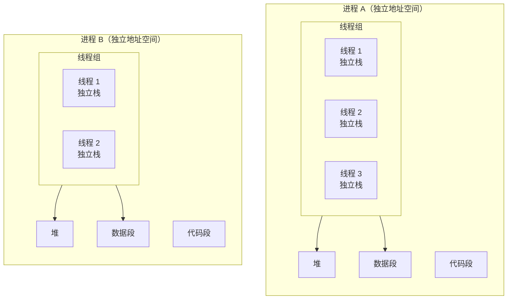
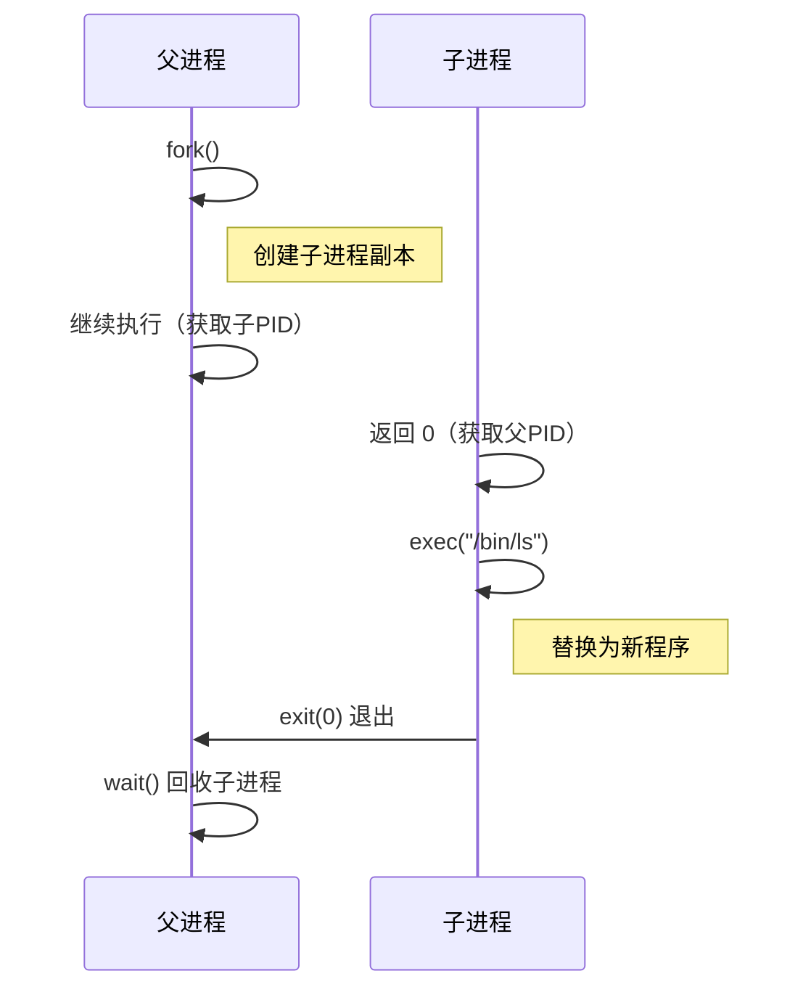
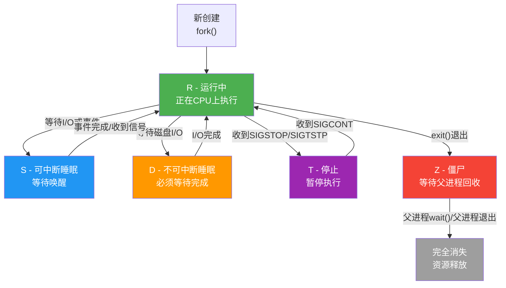
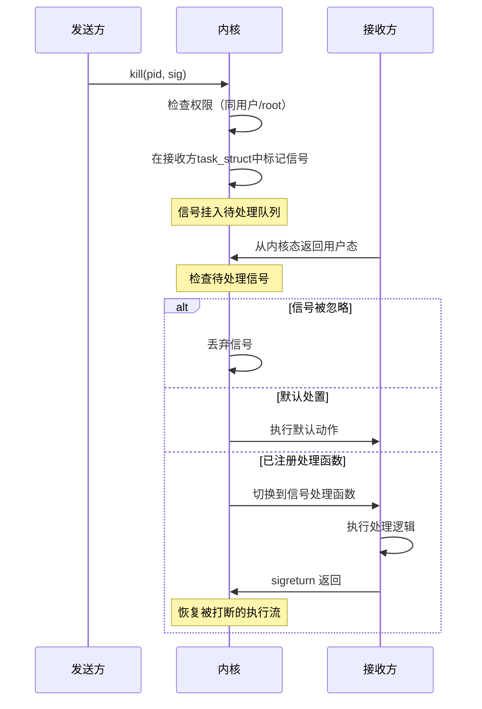
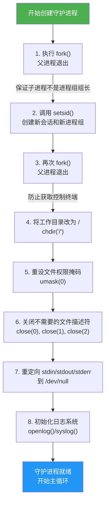
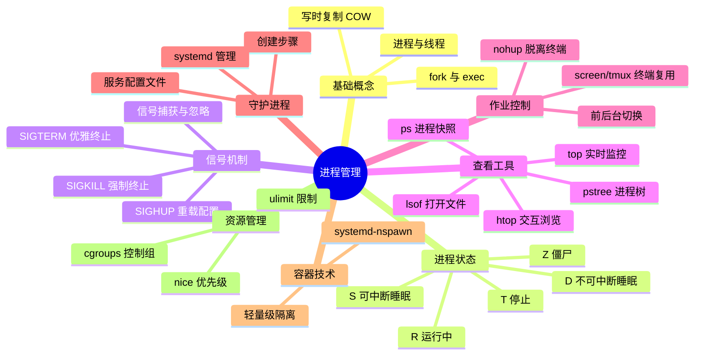

# 进程管理

> 进程是 Linux 系统的"生命单元"——理解进程，就是理解系统如何运转。
>
> 本章参考：《鸟哥的 Linux 私房菜》（第四版）第十六章、《UNIX 环境高级编程》（APUE）第七章与第八章。

## 一、进程与线程：从概念到内核

### 1.1 什么是进程

进程（Process）是程序在操作系统中的执行实例。程序是磁盘上的静态文件，而进程是内存中的动态实体。每个进程拥有独立的地址空间、文件描述符表、信号处置表和上下文环境。

```bash
# 查看一个简单命令如何变成进程
# 程序文件（静态）
ls -l /bin/ls
# -rwxr-xr-x 1 root root 138856 Jan  2  2024 /bin/ls

# 执行后变成进程（动态）
/bin/ls &
echo "进程 PID: $!"
```

内核通过 `task_struct` 结构体管理每个进程，其中记录了：

| 字段 | 含义 |
|------|------|
| PID | 进程标识符，唯一编号 |
| PPID | 父进程 PID |
| 状态 | R/S/D/T/Z 等 |
| 优先级 | nice 值与调度优先级 |
| 地址空间 | 代码段、数据段、栈、堆 |
| 文件描述符 | 打开的文件列表 |
| 信号处置 | 各信号的处理方式 |
| 资源统计 | CPU 时间、内存使用等 |

### 1.2 进程与线程的区别

线程（Thread）是进程内的执行单元，多个线程共享同一地址空间但拥有独立的栈和寄存器上下文。



::: tip 进程 vs 线程 核心区别
- **进程**：独立地址空间，切换开销大，安全性高（一个进程崩溃不影响其他）
- **线程**：共享地址空间，切换开销小，通信方便但需同步（一个线程崩溃可能导致整个进程退出）
- Linux 内核统一使用 `task_struct` 管理，线程本质上是共享地址空间的"轻量级进程"（LWP）
:::

```bash
# 查看进程的线程信息
# -L 选项显示线程（LWP）
ps -L -p $(pgrep nginx | head -1)

# 输出示例：
#   PID   LWP TTY      STAT   TIME COMMAND
#  1234  1234 ?        Ss     0:00 nginx: master
#  1234  1235 ?        S      0:01 nginx: worker
#  1234  1236 ?        S      0:01 nginx: worker
#  1234  1237 ?        S      0:01 nginx: worker
#  1234  1238 ?        S      0:01 nginx: worker

# 查看线程数量
ls /proc/$(pgrep nginx | head -1)/task | wc -l
```

### 1.3 进程的诞生：fork 与 exec

Linux 中创建新进程的经典模式是 `fork()` + `exec()`：

1. **fork()**：创建当前进程的副本（子进程），子进程获得父进程地址空间的拷贝（写时复制）
2. **exec()**：用新程序替换子进程的地址空间，开始执行新代码



```bash
# 用 strace 观察进程创建过程
strace -f -e trace=clone,execve bash -c 'ls /tmp' 2>&1 | head -20

# 输出示例：
# execve("/bin/bash", ["bash", "-c", "ls /tmp"], 0x7ff...) = 0
# clone(child_stack=NULL, flags=CLONE_CHILD_CLEARTID|...) = 12345
# strace: Process 12345 attached
# [pid 12345] execve("/bin/ls", ["ls", "/tmp"], 0x55a...) = 0
```

::: important 写时复制（Copy-on-Write, COW）
fork() 后，子进程并不立即复制父进程的内存页，而是与父进程共享同一物理页。只有当某一方尝试**写入**时，内核才为写入方创建该页的独立副本。这极大地降低了 fork 的开销。
:::

## 二、进程状态与生命周期

### 2.1 五大核心状态

Linux 进程有五种核心状态（对应 `ps` 命令的 STAT 列）：

| 状态码 | 名称 | 含义 |
|--------|------|------|
| R | Running | 正在 CPU 上运行或在运行队列中等待调度 |
| S | Sleeping | 可中断睡眠，等待事件（I/O、信号） |
| D | Disk Sleep | 不可中断睡眠，通常等待磁盘 I/O 完成 |
| T | Stopped | 被信号暂停（SIGSTOP/SIGTSTP） |
| Z | Zombie | 僵尸状态，进程已终止但父进程尚未回收 |



### 2.2 状态详解与实战

**R 状态——运行中**

```bash
# 制造一个持续占用 CPU 的进程
dd if=/dev/zero of=/dev/null &
DD_PID=$!

# 观察 R 状态
ps -p $DD_PID -o pid,stat,comm
#   PID STAT COMM
#  12345 R+   dd

kill $DD_PID
```

**S 状态——可中断睡眠**

绝大多数进程平时都处于 S 状态，等待事件唤醒：

```bash
# 查看系统中大部分进程的状态
ps ax -o pid,stat,comm | head -20
# 注意：大多数进程的 STAT 以 S 开头
```

**D 状态——不可中断睡眠**

::: warning D 状态的危险性
D 状态的进程**不响应任何信号**，连 `kill -9` 都无法杀死。只有等它等待的 I/O 操作完成或系统重启才能恢复。大量 D 状态进程通常意味着存储设备故障或 NFS 挂载问题。
:::

```bash
# 查找系统中的 D 状态进程（危险信号！）
ps ax -o pid,stat,comm | grep " D"

# 或者直接从 /proc 读取
for pid in /proc/[0-9]*; do
    stat=$(cat "$pid/stat" 2>/dev/null | awk '{print $3}')
    if [[ "$stat" == "D" ]]; then
        echo "D 状态进程: PID=$(basename $pid) CMD=$(cat "$pid/cmdline" 2>/dev/null | tr '\0' ' ')"
    fi
done
```

**T 状态——停止**

```bash
# 手动停止一个进程
sleep 300 &
SLEEP_PID=$!
echo "启动进程 PID: $SLEEP_PID"

# 发送 SIGSTOP 信号
kill -STOP $SLEEP_PID
ps -p $SLEEP_PID -o pid,stat,comm
#   PID STAT COMM
#  12345 T    sleep

# 恢复执行
kill -CONT $SLEEP_PID
ps -p $SLEEP_PID -o pid,stat,comm
#   PID STAT COMM
#  12345 S    sleep

# Ctrl+Z 也是发送 SIGTSTP（终端停止）
kill $SLEEP_PID
```

**Z 状态——僵尸**

```bash
# 编写一个产生僵尸进程的 C 程序
cat > /tmp/zombie_demo.c << 'EOF'
#include <stdio.h>
#include <unistd.h>
#include <sys/types.h>

int main() {
    pid_t pid = fork();
    if (pid == 0) {
        // 子进程立即退出，成为僵尸
        printf("子进程 %d 退出\n", getpid());
        _exit(0);
    } else {
        // 父进程不调用 wait()，子进程变成僵尸
        printf("父进程 %d，子进程 %d 将成为僵尸\n", getpid(), pid);
        printf("按 Enter 键退出父进程...\n");
        getchar();
    }
    return 0;
}
EOF

gcc -o /tmp/zombie_demo /tmp/zombie_demo.c
/tmp/zombie_demo &
# 在另一个终端查看：
# ps ax | grep Z
# 12345 pts/0    Z+    0:00 [zombie_demo] <defunct>
```

::: important 僵尸进程的处理
- 僵尸进程不占用 CPU 和内存，但占用 PID 和 `task_struct` 条目
- 大量僵尸会耗尽 PID 资源（系统最大 PID 数约 32768 或 4194304）
- 清理方法：让父进程调用 `wait()`/`waitpid()`，或杀死父进程让 init 接管回收
- 预防方法：父进程使用 `signal(SIGCHLD, SIG_IGN)` 忽略子进程退出信号
:::

### 2.3 附加状态标志

除了五大核心状态，`ps` 还显示附加标志：

| 标志 | 含义 |
|------|------|
| + | 前台进程组 |
| < | 高优先级 |
| N | 低优先级 |
| L | 有页面被锁定在内存中 |
| s | 会话领导者（Session Leader） |
| l | 多线程 |
| | 已进入磁盘 I/O 调度（CentOS 7+） |

```bash
# 查看完整的状态信息
ps ax -o pid,ppid,stat,ni,comm | head -15

# 筛选低优先级进程
ps ax -o pid,stat,ni,comm | grep " N"
```

## 三、信号：进程间通信的利器

### 3.1 信号概述

信号（Signal）是 Linux 中最古老的进程间通信机制之一，是一种异步通知机制。内核、用户或其他进程都可以向目标进程发送信号，接收进程可以采取以下三种行动之一：

1. **默认处置**：执行操作系统预定义的动作（终止、终止+核心转储、停止、忽略等）
2. **捕获处理**：执行用户自定义的信号处理函数
3. **忽略**：不采取任何行动（部分信号不可忽略）

### 3.2 常用信号速查表

| 信号 | 编号 | 默认动作 | 含义 | 可捕获 | 可忽略 |
|------|------|----------|------|--------|--------|
| SIGHUP | 1 | 终止 | 终端挂断/配置重载 | 是 | 是 |
| SIGINT | 2 | 终止 | 中断（Ctrl+C） | 是 | 是 |
| SIGQUIT | 3 | 终止+核心转储 | 退出（Ctrl+\\） | 是 | 是 |
| SIGILL | 4 | 终止+核心转储 | 非法指令 | 是 | 否 |
| SIGABRT | 6 | 终止+核心转储 | 进程异常终止(abort) | 是 | 否 |
| SIGFPE | 8 | 终止+核心转储 | 浮点异常 | 是 | 否 |
| SIGKILL | 9 | 终止 | 强制终止 | 否 | 否 |
| SIGSEGV | 11 | 终止+核心转储 | 段错误 | 是 | 否 |
| SIGPIPE | 13 | 终止 | 管道破裂 | 是 | 是 |
| SIGALRM | 14 | 终止 | 定时器到期 | 是 | 是 |
| SIGTERM | 15 | 终止 | 请求终止（默认kill信号） | 是 | 是 |
| SIGUSR1 | 10 | 终止 | 用户自定义信号1 | 是 | 是 |
| SIGUSR2 | 12 | 终止 | 用户自定义信号2 | 是 | 是 |
| SIGCHLD | 17 | 忽略 | 子进程状态改变 | 是 | 是 |
| SIGCONT | 18 | 继续/忽略 | 恢复执行 | 否 | 是 |
| SIGSTOP | 19 | 停止 | 停止进程 | 否 | 否 |
| SIGTSTP | 20 | 停止 | 终端停止（Ctrl+Z） | 是 | 是 |

::: warning SIGKILL 与 SIGSTOP 的特殊性
`SIGKILL (9)` 和 `SIGSTOP (19)` 是仅有的两个**不能被捕获、阻塞或忽略**的信号。它们是系统管理员的"最终手段"。但在日常运维中，应优先使用 `SIGTERM (15)` 让进程优雅退出——SIGKILL 不会触发清理逻辑，可能导致数据丢失。
:::

### 3.3 发送信号的方式

```bash
# ========== 方式1：kill 命令 ==========

# 默认发送 SIGTERM (15)，优雅终止
kill 12345

# 明确指定信号
kill -TERM 12345
kill -15 12345

# 强制终止（最后手段）
kill -9 12345

# 发送 SIGHUP 让守护进程重载配置
kill -HUP $(cat /var/run/nginx.pid)

# ========== 方式2：killall 命令 ==========

# 按名称发送信号（匹配所有同名进程）
killall -TERM nginx

# 交互式确认
killall -i nginx

# ========== 方式3：pkill 命令 ==========

# 按模式匹配发送信号
pkill -f "python app.py"

# 按用户发送
pkill -u nobody

# 按终端发送
pkill -t pts/0

# ========== 方式4：键盘快捷键 ==========

# Ctrl+C → SIGINT (2)
# Ctrl+\ → SIGQUIT (3)
# Ctrl+Z → SIGTSTP (20)
```

### 3.4 在脚本中处理信号

```bash
#!/usr/bin/env bash
# 信号处理示例：优雅退出

cleanup() {
    echo ""
    echo "[$(date '+%Y-%m-%d %H:%M:%S')] 收到退出信号，正在清理..."
    # 清理临时文件
    rm -f /tmp/myapp_$$*.tmp
    # 关闭数据库连接等
    echo "[$(date '+%Y-%m-%d %H:%M:%S')] 清理完成，退出"
    exit 0
}

# 注册信号处理函数
trap cleanup SIGINT SIGTERM SIGQUIT

echo "进程 PID: $$"
echo "按 Ctrl+C 或运行 kill -TERM $$ 来测试信号处理"

# 模拟长时间运行的程序
while true; do
    echo "[$(date '+%H:%M:%S')] 工作中..."
    sleep 2
done
```

```bash
#!/usr/bin/env bash
# SIGHUP 重载配置示例

CONFIG_FILE="/etc/myapp.conf"
CURRENT_CONFIG=""

load_config() {
    CURRENT_CONFIG=$(grep -v '^#' "$CONFIG_FILE" 2>/dev/null | grep -v '^$')
    echo "[$(date '+%H:%M:%S')] 配置已重新加载"
}

# 首次加载
load_config

# SIGHUP 时重载配置
trap load_config SIGHUP

echo "应用 PID: $$"
echo "运行 kill -HUP $$ 可重载配置"

while true; do
    # 使用配置执行工作
    echo "[$(date '+%H:%M:%S')] 当前配置: $(echo "$CURRENT_CONFIG" | head -1)"
    sleep 5
done
```

### 3.5 信号的底层机制



## 四、进程查看工具大全

### 4.1 ps——进程快照

```bash
# ========== 常用组合 ==========

# BSD 风格：查看所有进程
ps aux

# 标准风格：查看所有进程
ps -ef

# ========== 自定义输出列 ==========

# 查看进程树、PID、状态、CPU、内存、命令
ps -eo pid,ppid,stat,%cpu,%mem,comm --sort=-%cpu | head -20

# 查看指定用户的进程
ps -u nginx -o pid,ppid,%cpu,%mem,comm

# 查看指定进程的详细信息
ps -p 1 -o pid,ppid,uid,gid,stat,ni,rtprio,comm

# ========== 线程信息 ==========

# 查看进程的线程
ps -T -p $(pgrep nginx | head -1)

# ========== 进程层级 ==========

# 查看进程树（ps 方式）
ps -ef --forest | head -30
```

::: tip ps aux 各列含义
| 列 | 含义 |
|----|------|
| USER | 进程所有者 |
| PID | 进程 ID |
| %CPU | CPU 占用率 |
| %MEM | 内存占用率 |
| VSZ | 虚拟内存大小（KB） |
| RSS | 物理内存大小（KB） |
| TTY | 终端 |
| STAT | 进程状态 |
| START | 启动时间 |
| TIME | 累计 CPU 时间 |
| COMMAND | 命令名与参数 |
:::

### 4.2 top——实时监控

```bash
# 启动 top
top

# 常用交互命令（在 top 运行时按键）：
# M - 按内存排序
# P - 按 CPU 排序
# T - 按累计时间排序
# c - 显示完整命令行
# 1 - 显示每个 CPU 核心的使用率
# H - 显示线程
# k - 杀死进程
# r - 修改 nice 值
# q - 退出
```

```bash
# ========== 批处理模式 ==========
# 非交互模式，适合脚本使用

# 抓取一次快照
top -b -n 1 | head -20

# 每隔 5 秒采集一次，共采集 3 次
top -b -n 3 -d 5 > /tmp/top_snapshot.txt

# 监控特定进程
top -b -n 1 -p $(pgrep nginx | tr '\n' ',' | sed 's/,$//')
```

```bash
# ========== top 输出解读 ==========

# 前五行是系统概览：
# 第1行：当前时间、运行时间、登录用户数、负载均衡（1/5/15分钟）
# 第2行：进程总数、运行中、睡眠中、停止、僵尸
# 第3行：%us(用户)、%sy(系统)、%ni(优先级进程)、%id(空闲)、%wa(I/O等待)、%hi(硬中断)、%si(软中断)
# 第4行：物理内存：总量、已用、空闲、缓冲
# 第5行：交换空间：总量、已用、空闲、缓存

# 负载均衡解读：
# 值 = 平均运行队列长度 + 平均不可中断睡眠进程数
# 经验法则：负载值 < CPU核心数 → 系统 健康
#            负载值 > CPU核心数 × 2 → 系统 过载

# 查看CPU核心数
nproc
```

### 4.3 htop——交互式进程浏览器

```bash
# 安装
sudo apt install htop      # Ubuntu/Debian
sudo yum install htop      # CentOS/RHEL

# 启动
htop

# 功能特点：
# - 彩色显示，直观易读
# - 支持鼠标操作
# - 横向/纵向滚动查看完整命令行
# - 直接发送信号（F9）
# - 树形视图（F5）
# - 自定义列显示（F2）
# - 快速过滤（F4）/搜索（F3）

# ========== 命令行用法 ==========
# 只看指定用户的进程
htop -u nginx

# 只看指定 PID
htop -p 1234,5678

# 排序
htop --sort-key=PERCENT_MEM
```

### 4.4 pstree——进程树

```bash
# 查看完整进程树
pstree

# 带 PID 显示
pstree -p

# 带命令行参数
pstree -a

# 从指定进程开始
pstree -p 1

# 只显示指定用户的进程树
pstree -u nginx

# 高亮当前进程及其祖先
pstree -h $$
```

### 4.5 其他实用工具

```bash
# ========== pgrep/pkill ==========

# 按名称查找 PID
pgrep sshd
# 1234
# 5678

# 带完整命令行
pgrep -a sshd
# 1234 /usr/sbin/sshd -D
# 5678 sshd: user@pts/0

# 按用户筛选
pgrep -u root sshd

# 按终端筛选
pgrep -t pts/0

# ========== pidof ==========

# 精确匹配进程名
pidof nginx
# 12345 12344 12343

# ========== lsof ==========

# 查看进程打开的文件
lsof -p 1234

# 查看谁打开了某个文件
lsof /var/log/syslog

# 查看谁占用了某个端口
lsof -i :8080
lsof -i TCP:80

# 查看指定用户的打开文件
lsof -u nginx

# 查看已删除但仍被进程占用的文件（磁盘空间泄漏常见原因）
lsof +L1

# ========== /proc 文件系统 ==========

# 进程基本信息
cat /proc/1/status | head -20

# 进程的命令行
cat /proc/1/cmdline | tr '\0' ' '

# 进程的环境变量
cat /proc/1/environ | tr '\0' '\n'

# 进程的文件描述符
ls -la /proc/1/fd

# 进程的内存映射
cat /proc/1/maps | head -20

# 进程打开的文件
ls -la /proc/1/fd/
```

## 五、前后台与作业控制

### 5.1 前台、后台与作业

```bash
# ========== 后台执行（&）==========

# 命令末尾加 & 在后台运行
sleep 300 &
# [1] 12345    # [作业号] PID

# 继续在当前 shell 工作
echo "我可以在后台任务运行时继续工作"

# ========== 查看后台作业 ==========

jobs
# [1]+  Running                 sleep 300 &

# 带进程组信息
jobs -l
# [1]+ 12345 Running                 sleep 300 &

# ========== 将后台作业调到前台 ==========

fg %1        # 将作业1调到前台
# sleep 300

# ========== 将前台作业放到后台 ==========

# 1. 先按 Ctrl+Z 暂停（SIGTSTP）
# [1]+  Stopped                 sleep 300

# 2. 用 bg 命令在后台恢复
bg %1
# [1]+ sleep 300 &
```

### 5.2 nohup——脱离终端

当终端关闭时，Shell 会向所有子进程发送 SIGHUP 信号，导致进程退出。`nohup` 让进程忽略 SIGHUP：

```bash
# 基本用法
nohup ./my_app &

# 输出重定向（默认输出到 nohup.out）
nohup ./my_app > app.log 2>&1 &

# 完整的生产级后台运行方式
nohup ./my_app \
    >> /var/log/myapp/output.log \
    2>> /var/log/myapp/error.log \
    &

# 记录 PID 以便后续管理
echo $! > /var/run/myapp.pid

# 查看日志
tail -f nohup.out
```

::: tip 为什么需要 nohup？
终端关闭时的信号传递链：
1. 终端关闭 → 内核发送 SIGHUP 给 Session Leader（通常是 Shell）
2. Shell 收到 SIGHUP → 向所有子进程发送 SIGHUP
3. 子进程收到 SIGHUP → 默认动作是终止

`nohup` 的作用：将 SIGHUP 的处置设为 `SIG_IGN`（忽略），同时将 stdin 重定向到 `/dev/null`，将 stdout/stderr 重定向到 `nohup.out`。
:::

### 5.3 disown——忘记后台作业

```bash
# 场景：已经启动了后台任务但忘记用 nohup

# 1. 查看作业
jobs -l
# [1]+ 12345 Running                 ./my_app &

# 2. 从 Shell 作业表中移除（不发送 SIGHUP）
disown %1

# 3. 确认已移除
jobs
# （空）

# 进程仍在运行，且终端关闭时不再收到 SIGHUP
```

### 5.4 screen 与 tmux——终端复用器

```bash
# ========== screen ==========

# 创建新会话
screen -S mywork

# 在 screen 中运行程序
./long_running_task

# 断开会话（detach）：按 Ctrl+A，然后按 D

# 重新连接
screen -r mywork

# 列出所有会话
screen -ls

# ========== tmux（推荐）==========

# 创建新会话
tmux new -s mywork

# 在 tmux 中运行程序
./long_running_task

# 断开：按 Ctrl+B，然后按 D

# 重新连接
tmux attach -t mywork

# 列出所有会话
tmux ls

# 在会话中创建新窗口：Ctrl+B，然后按 C
# 切换窗口：Ctrl+B，然后按 0-9
# 水平分屏：Ctrl+B，然后按 "
# 垂直分屏：Ctrl+B，然后按 %
```

## 六、守护进程（Daemon）

### 6.1 守护进程的特征

守护进程是长期运行在后台的特殊进程，具有以下特征：

- **无控制终端**：不与任何终端关联
- **父进程为 init（PID 1）**：或者由 systemd 直接管理
- **工作目录为根目录**：避免占用可卸载的文件系统
- **文件权限掩码重设**：通常设为 0，由守护进程自行控制权限
- **关闭不需要的文件描述符**：关闭 0/1/2 及继承的描述符
- **会话领导者**：创建新的会话和进程组

```bash
# 查看系统中的守护进程
ps ax -o pid,ppid,stat,comm | grep -E "^[[:space:]]*[0-9]+[[:space:]]+1[[:space:]]+Ss"

# 查看守护进程的特征
cat /proc/1/status | grep -E "^(Name|PPid|Sid|NGid)"
```

### 6.2 守护进程创建步骤

创建守护进程需要严格遵循 APUE 中描述的步骤：



### 6.3 C 语言实现守护进程

```c
#include <stdio.h>
#include <stdlib.h>
#include <string.h>
#include <unistd.h>
#include <signal.h>
#include <sys/stat.h>
#include <syslog.h>

void daemonize() {
    // 步骤1: 第一次 fork，父进程退出
    pid_t pid = fork();
    if (pid < 0) {
        perror("fork");
        exit(EXIT_FAILURE);
    }
    if (pid > 0) {
        exit(EXIT_SUCCESS);  // 父进程退出
    }

    // 步骤2: 创建新会话
    if (setsid() < 0) {
        perror("setsid");
        exit(EXIT_FAILURE);
    }

    // 步骤3: 第二次 fork，防止获取控制终端
    pid = fork();
    if (pid < 0) {
        perror("fork2");
        exit(EXIT_FAILURE);
    }
    if (pid > 0) {
        exit(EXIT_SUCCESS);
    }

    // 步骤4: 更改工作目录为根目录
    if (chdir("/") < 0) {
        perror("chdir");
        exit(EXIT_FAILURE);
    }

    // 步骤5: 重设文件权限掩码
    umask(0);

    // 步骤6: 关闭所有打开的文件描述符
    long maxfd = sysconf(_SC_OPEN_MAX);
    for (long fd = 0; fd < maxfd; fd++) {
        close(fd);
    }

    // 步骤7: 重定向 stdin/stdout/stderr 到 /dev/null
    int devnull = open("/dev/null", O_RDWR);
    dup2(devnull, STDIN_FILENO);   // stdin -> /dev/null
    dup2(devnull, STDOUT_FILENO);  // stdout -> /dev/null
    dup2(devnull, STDERR_FILENO);  // stderr -> /dev/null
    if (devnull > 2) {
        close(devnull);
    }

    // 步骤8: 初始化日志
    openlog("mydaemon", LOG_PID | LOG_NDELAY, LOG_DAEMON);
}

int main() {
    daemonize();

    syslog(LOG_INFO, "守护进程启动，PID=%d", getpid());

    // 主循环
    while (1) {
        syslog(LOG_INFO, "守护进程工作中...");
        sleep(60);
    }

    closelog();
    return 0;
}
```

### 6.4 用 Shell 脚本实现守护进程模式

```bash
#!/usr/bin/env bash
# 简单的守护进程包装脚本

DAEMON_NAME="myapp"
PID_FILE="/var/run/${DAEMON_NAME}.pid"
LOG_FILE="/var/log/${DAEMON_NAME}.log"
APP_CMD="/usr/local/bin/myapp"

start() {
    if [[ -f "$PID_FILE" ]] && kill -0 "$(cat "$PID_FILE")" 2>/dev/null; then
        echo "${DAEMON_NAME} 已在运行 (PID: $(cat "$PID_FILE"))"
        return 1
    fi

    echo "启动 ${DAEMON_NAME}..."
    nohup "$APP_CMD" >> "$LOG_FILE" 2>&1 &
    local pid=$!
    echo "$pid" > "$PID_FILE"
    echo "${DAEMON_NAME} 已启动 (PID: $pid)"
}

stop() {
    if [[ ! -f "$PID_FILE" ]]; then
        echo "${DAEMON_NAME} 未运行"
        return 1
    fi

    local pid=$(cat "$PID_FILE")
    echo "停止 ${DAEMON_NAME} (PID: $pid)..."
    kill -TERM "$pid"

    # 等待最多 10 秒
    local timeout=10
    while kill -0 "$pid" 2>/dev/null && (( timeout > 0 )); do
        sleep 1
        ((timeout--))
    done

    # 如果还没退出，强制杀死
    if kill -0 "$pid" 2>/dev/null; then
        echo "强制终止 ${DAEMON_NAME}..."
        kill -9 "$pid"
    fi

    rm -f "$PID_FILE"
    echo "${DAEMON_NAME} 已停止"
}

status() {
    if [[ -f "$PID_FILE" ]] && kill -0 "$(cat "$PID_FILE")" 2>/dev/null; then
        echo "${DAEMON_NAME} 正在运行 (PID: $(cat "$PID_FILE"))"
    else
        echo "${DAEMON_NAME} 未运行"
        rm -f "$PID_FILE"
    fi
}

case "$1" in
    start)   start   ;;
    stop)    stop    ;;
    restart) stop; sleep 1; start ;;
    status)  status  ;;
    *)
        echo "用法: $0 {start|stop|restart|status}"
        exit 1
        ;;
esac
```

### 6.5 systemd——现代守护进程管理

现代 Linux 发行版使用 systemd 管理系统服务，替代了传统的 SysV init 脚本：

```ini
# /etc/systemd/system/myapp.service
[Unit]
Description=My Application Service
Documentation=https://example.com/myapp
After=network.target mysql.service
Wants=mysql.service

[Service]
Type=simple
User=myapp
Group=myapp
WorkingDirectory=/opt/myapp
ExecStart=/usr/local/bin/myapp --config /etc/myapp/config.yml
ExecReload=/bin/kill -HUP $MAINPID
Restart=on-failure
RestartSec=5
LimitNOFILE=65536

# 安全加固
NoNewPrivileges=true
ProtectSystem=strict
ProtectHome=true
ReadWritePaths=/var/log/myapp /var/lib/myapp
PrivateTmp=true

# 日志
StandardOutput=journal
StandardError=journal
SyslogIdentifier=myapp

[Install]
WantedBy=multi-user.target
```

```bash
# ========== systemd 常用命令 ==========

# 启动/停止/重启服务
systemctl start myapp
systemctl stop myapp
systemctl restart myapp

# 重载配置（不中断服务）
systemctl reload myapp

# 查看服务状态
systemctl status myapp

# 开机自启
systemctl enable myapp
systemctl disable myapp

# 查看服务日志
journalctl -u myapp -f            # 实时跟踪
journalctl -u myapp --since today # 今天的日志
journalctl -u myapp -n 50         # 最近50条

# 编辑服务文件后重载
systemctl daemon-reload

# 查看服务依赖
systemctl list-dependencies myapp

# 查看所有服务
systemctl list-units --type=service
systemctl list-units --type=service --state=running
```

::: important systemd 服务类型
| 类型 | 含义 | 适用场景 |
|------|------|----------|
| simple | 默认类型，ExecStart 指定的进程就是主进程 | 最常见，适合前台运行的服务 |
| forking | ExecStart 的进程 fork 后退出，子进程成为主进程 | 传统守护进程 |
| oneshot | 执行一次性任务后退出 | 初始化脚本 |
| notify | 进程通过 sd_notify() 通知 systemd 就绪 | 需要精确就绪检测的服务 |
| dbus | 通过 D-Bus 通知就绪 | D-Bus 服务 |
| idle | 等待其他任务完成后才启动 | 低优先级任务 |
:::

## 七、systemd-nspawn——轻量级容器

### 7.1 systemd-nspawn 简介

`systemd-nspawn` 是 systemd 提供的轻量级容器工具，类似于 chroot 的增强版，但提供了更完整的隔离：

- PID 隔离（容器内 PID 1 是 init）
- 文件系统隔离
- 网络隔离（可选）
- 信号隔离
- /proc、/sys 等虚拟文件系统隔离

::: info systemd-nspawn vs Docker
- **Docker**：面向应用容器，强调镜像分层、分发和编排
- **systemd-nspawn**：面向系统容器，更接近轻量级虚拟机，适合运行完整系统
- nspawn 更轻量，不需要 Docker 守护进程，适合开发/测试环境
:::

### 7.2 创建和使用 nspawn 容器

```bash
# ========== 安装必要工具 ==========
sudo apt install debootstrap systemd-container    # Ubuntu/Debian
sudo yum install debootstrap systemd-container    # CentOS

# ========== 创建 Debian 容器 ==========
sudo debootstrap --arch=amd64 bookworm /var/lib/machines/debian12 http://deb.debian.org/debian

# ========== 启动容器 ==========
# 交互式启动
sudo systemd-nspawn -D /var/lib/machines/debian12

# 以机器名启动
sudo systemd-nspawn -D /var/lib/machines/debian12 -M debian12

# 开机自启（用 machinectl 管理）
sudo machinectl start debian12

# ========== 在容器内操作 ==========
# 设置 root 密码
passwd

# 安装软件
apt update && apt install vim ssh

# 启用 systemd（让容器像完整系统一样运行）
apt install systemd

# 退出容器
# 按 Ctrl+] 三次

# ========== 从外部管理容器 ==========

# 列出运行中的容器
machinectl list

# 进入容器
sudo machinectl shell debian12

# 在容器中执行命令
sudo machinectl shell debian12 /bin/bash -c "apt update"

# 停止容器
sudo machinectl stop debian12

# 查看容器状态
sudo machinectl status debian12
```

### 7.3 网络配置

```bash
# ========== 私有网络模式 ==========
# 容器拥有独立的网络命名空间，通过 veth pair 连接宿主机

sudo systemd-nspawn \
    -D /var/lib/machines/debian12 \
    -M debian12 \
    --network-veth \
    --port=tcp:22:2222   # 映射容器22端口到宿主机2222

# ========== 桥接网络模式 ==========
# 容器直接接入宿主机的网桥

sudo systemd-nspawn \
    -D /var/lib/machines/debian12 \
    -M debian12 \
    --network-bridge=br0

# ========== 共享网络模式 ==========
# 容器与宿主机共享网络命名空间

sudo systemd-nspawn \
    -D /var/lib/machines/debian12 \
    -M debian12 \
    --network-host
```

## 八、进程优先级与调度

### 8.1 nice 值与优先级

Linux 使用 nice 值影响进程的调度优先级，范围 -20 到 +19：

- **-20**：最高优先级（只有 root 可设置）
- **0**：默认优先级
- **+19**：最低优先级

```bash
# 以低优先级启动进程
nice -n 10 ./cpu_intensive_task &

# 修改已运行进程的优先级
renice -n 5 -p 12345

# 修改指定用户所有进程的优先级
sudo renice -n 10 -u backup

# 查看进程的 nice 值
ps -eo pid,ni,comm | grep myapp

# 实时修改（在 top 中按 r）
```

::: tip nice 值与调度优先级的关系
nice 值不是调度优先级本身，而是影响优先级的因素。内核的调度优先级计算公式为：

```
动态优先级 = 静态优先级 + 奖励/惩罚
静态优先级 = 120 + nice值
```

nice 值越低，静态优先级越低，越优先被调度。但 nice 值只影响 CPU 时间的分配比例，不是绝对保证。
:::

### 8.2 实时调度策略

```bash
# 查看实时优先级
ps -eo pid,cls,rtprio,comm | head -20

# SCHED_OTHER: 普通调度（默认）
# SCHED_FIFO:  先进先出实时调度，不主动让出 CPU 就一直运行
# SCHED_RR:    时间片轮转实时调度

# 设置实时调度策略
sudo chrt -f -p 50 12345    # 将PID 12345设为SCHED_FIFO，优先级50
sudo chrt -r -p 30 12345    # 将PID 12345设为SCHED_RR，优先级30

# 以实时策略启动新进程
sudo chrt -f 50 ./realtime_task
```

## 九、进程资源限制

### 9.1 ulimit 与 /etc/security/limits.conf

```bash
# 查看当前所有限制
ulimit -a

# 核心输出含义：
# -c: core 文件大小（blocks）
# -d: 数据段大小（KB）
# -f: 文件大小（blocks）
# -l: 锁定内存大小（KB）
# -m: 驻留集大小（KB）
# -n: 打开文件数
# -s: 栈大小（KB）
# -t: CPU 时间（秒）
# -u: 用户进程数
# -v: 虚拟内存（KB）

# 临时修改限制
ulimit -n 65535        # 打开文件数
ulimit -u 4096        # 用户进程数
ulimit -c unlimited   # 允许核心转储

# 永久修改（/etc/security/limits.conf）
# 格式：<domain> <type> <item> <value>
# domain: 用户名/@组名/*
# type:  soft(软限制)/hard(硬限制)
# item:  nofile/nproc/core/...

cat >> /etc/security/limits.conf << 'EOF'
# Web 服务器配置
* soft nofile 65535
* hard nofile 65535
* soft nproc 65535
* hard nproc 65535

# MySQL 特殊配置
mysql soft nofile 65535
mysql hard nofile 65535
mysql soft memlock unlimited
mysql hard memlock unlimited
EOF
```

### 9.2 cgroups——控制组

cgroups 是 Linux 内核提供的进程资源隔离和限制机制，Docker/LXC 等容器技术的底层基础：

```bash
# ========== 查看当前 cgroup 信息 ==========
cat /proc/$$/cgroup

# ========== 使用 systemd 管理 cgroup ==========

# 设置服务的内存限制
sudo systemctl set-property myapp.service MemoryMax=512M
sudo systemctl set-property myapp.service MemoryHigh=400M

# 设置 CPU 限制
sudo systemctl set-property myapp.service CPUQuota=200%
sudo systemctl set-property myapp.service CPUWeight=500

# 设置 IO 限制
sudo systemctl set-property myapp.service IOReadBandwidthMax=/dev/sda 10M
sudo systemctl set-property myapp.service IOWriteBandwidthMax=/dev/sda 5M

# 查看服务的 cgroup 信息
systemd-cgtop
systemd-cgls
```

## 十、实战案例

### 10.1 进程监控脚本

```bash
#!/usr/bin/env bash
# 进程监控脚本：监控关键进程，异常时自动重启并告警

PROCS_TO_MONITOR=("nginx" "mysqld" "redis-server")
ALERT_EMAIL="admin@example.com"
LOG_FILE="/var/log/process_monitor.log"
CHECK_INTERVAL=30
MAX_RESTART_COUNT=3

log() {
    echo "[$(date '+%Y-%m-%d %H:%M:%S')] $1" | tee -a "$LOG_FILE"
}

alert() {
    local subject="[ALERT] 进程异常: $1"
    local body="$2"
    log "告警: $subject - $body"
    # 发送邮件（需配置 mailx）
    echo "$body" | mail -s "$subject" "$ALERT_EMAIL" 2>/dev/null
}

restart_count=()

check_and_restart() {
    local proc_name="$1"
    local index="$2"

    if pgrep -x "$proc_name" > /dev/null; then
        restart_count[$index]=0
        return 0
    fi

    log "进程 $proc_name 未运行"

    # 检查重启次数
    if (( ${restart_count[$index]:-0} >= MAX_RESTART_COUNT )); then
        alert "$proc_name" "已达到最大重启次数 ($MAX_RESTART_COUNT)，不再尝试重启"
        return 1
    fi

    # 尝试重启
    log "尝试重启 $proc_name ..."
    systemctl restart "$proc_name" 2>/dev/null

    sleep 5

    if pgrep -x "$proc_name" > /dev/null; then
        log "$proc_name 重启成功"
        restart_count[$index]=0
    else
        restart_count[$index]=$((${restart_count[$index]:-0} + 1))
        alert "$proc_name" "重启失败 (第 ${restart_count[$index]} 次)"
    fi
}

log "进程监控启动，监控: ${PROCS_TO_MONITOR[*]}"

while true; do
    for i in "${!PROCS_TO_MONITOR[@]}"; do
        check_and_restart "${PROCS_TO_MONITOR[$i]}" "$i"
    done
    sleep "$CHECK_INTERVAL"
done
```

### 10.2 僵尸进程清理脚本

```bash
#!/usr/bin/env bash
# 清理僵尸进程

echo "===== 僵尸进程检查 ====="

# 查找僵尸进程
zombies=$(ps ax -o pid=,ppid=,stat=,comm= | awk '$3 ~ /^Z/ {print}')

if [[ -z "$zombies" ]]; then
    echo "没有僵尸进程"
    exit 0
fi

echo "发现僵尸进程："
echo "$zombies"
echo ""

echo "===== 清理方案 ====="

while read -r pid ppid stat comm; do
    echo "僵尸进程: PID=$pid, PPID=$ppid, CMD=$comm"

    # 检查父进程是否还在运行
    if kill -0 "$ppid" 2>/dev/null; then
        echo "  父进程 $ppid 仍在运行"
        echo "  方案1: 向父进程发送 SIGCHLD (kill -CHLD $ppid)"
        echo "  方案2: 杀死父进程让 init 接管回收"
        echo "  方案3: 如果是恶意进程，执行 kill -9 $ppid"
    else
        echo "  父进程已退出，init 应该会回收"
    fi
    echo ""
done <<< "$zombies"

echo "===== 统计 ====="
zombie_count=$(echo "$zombies" | wc -l)
echo "僵尸进程总数: $zombie_count"
echo "PID 资源使用: $(echo "$zombies" | wc -l) / $(cat /proc/sys/kernel/pid_max)"
```

### 10.3 进程资源占用排行

```bash
#!/usr/bin/env bash
# 系统资源占用排行

echo "============================================"
echo "  系统资源占用排行 - $(date '+%Y-%m-%d %H:%M:%S')"
echo "============================================"

# CPU 占用 TOP 10
echo ""
echo "--- CPU 占用 TOP 10 ---"
ps -eo pid,user,%cpu,%mem,stat,comm --sort=-%cpu | head -11

# 内存占用 TOP 10
echo ""
echo "--- 内存占用 TOP 10 ---"
ps -eo pid,user,%cpu,%mem,rss,stat,comm --sort=-%mem | head -11

# 打开文件数 TOP 10
echo ""
echo "--- 打开文件数 TOP 10 ---"
for pid in $(ls /proc/ | grep -E '^[0-9]+$' | head -200); do
    if [[ -d "/proc/$pid/fd" ]]; then
        count=$(ls /proc/$pid/fd 2>/dev/null | wc -l)
        cmd=$(cat /proc/$pid/comm 2>/dev/null)
        echo "$count $pid $cmd"
    fi
done | sort -rn | head -10 | awk '{printf "  FD数: %-6s PID: %-8s 命令: %s\n", $1, $2, $3}'

# 僵尸进程
echo ""
echo "--- 僵尸进程 ---"
zombie_count=$(ps ax -o stat= | grep -c "^Z" 2>/dev/null || echo 0)
echo "  僵尸进程数量: $zombie_count"

# D 状态进程
echo ""
echo "--- 不可中断睡眠进程 ---"
d_count=$(ps ax -o stat= | grep -c "^D" 2>/dev/null || echo 0)
echo "  D 状态进程数量: $d_count"
if (( d_count > 0 )); then
    ps ax -o pid,stat,comm | grep " D"
    echo "  ⚠️ 存在 D 状态进程，请检查磁盘 I/O 或 NFS 挂载！"
fi

# 系统概览
echo ""
echo "--- 系统概览 ---"
echo "  运行时间: $(uptime -p)"
echo "  负载均衡: $(cat /proc/loadavg | awk '{print $1, $2, $3}')"
echo "  CPU 核心数: $(nproc)"
echo "  总进程数: $(ps ax | wc -l)"
echo "  总内存: $(free -h | awk '/^Mem:/ {print $2}')"
echo "  已用内存: $(free -h | awk '/^Mem:/ {print $3}')"
```

## 总结



::: info 参考书籍
- 《鸟哥的 Linux 私房菜》（第四版）第十六章：进程管理与 SELinux
- 《UNIX 环境高级编程》（APUE）第七章：进程环境、第八章：进程控制
- 《Linux 命令行与 Shell 脚本编程大全》第十章：处理进程
- 《Linux 系统编程》（Robert Love）：第五章：进程管理
:::
