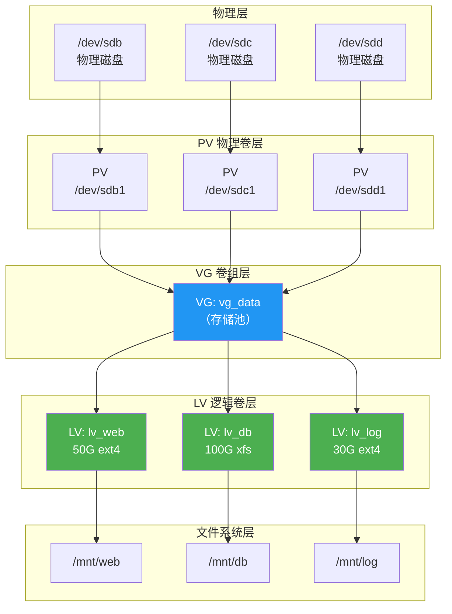
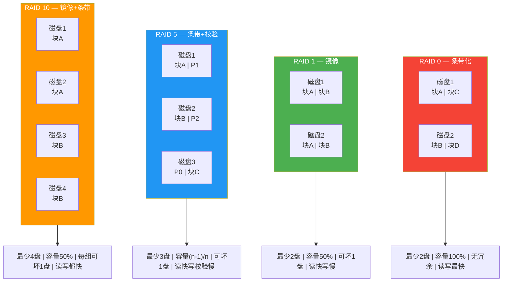
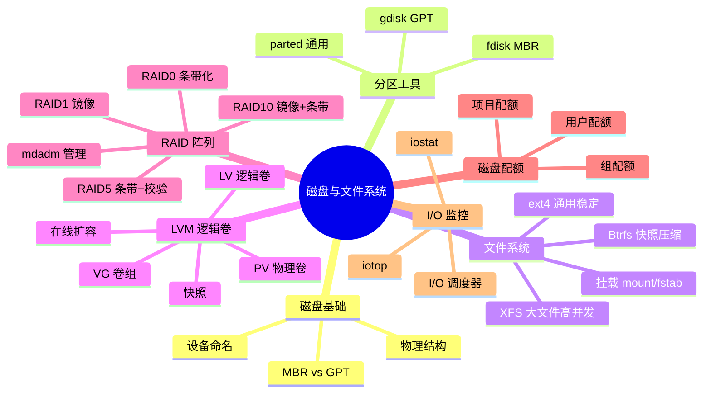

# 磁盘与文件系统管理

> 磁盘是数据的载体，文件系统是数据的组织方式——掌握磁盘与文件系统，就掌握了数据存储的根基。
>
> 本章参考：《鸟哥的 Linux 私房菜》（第四版）第七章与第八章、《UNIX 环境高级编程》（APUE）第三章与第四章。

## 一、磁盘基础知识

### 1.1 磁盘的物理结构

传统机械硬盘（HDD）的核心组件：

| 组件 | 作用 |
|------|------|
| 盘片（Platter） | 存储数据的圆形磁盘，双面涂有磁性材料 |
| 磁道（Track） | 盘片上的同心圆，数据存储区域 |
| 扇区（Sector） | 磁道上的最小读写单元，传统 512 字节，现代 4KB |
| 柱面（Cylinder） | 所有盘片上相同编号磁道的集合 |
| 磁头（Head） | 读写数据的磁头，每个盘面一个 |

::: tip 扇区大小的演进
- **传统磁盘**：512 字节扇区（512e）
- **现代磁盘**：4KB 物理扇区（4Kn），但可能模拟 512 字节逻辑扇区（512e）
- 4KB 扇区意味着文件系统的块大小最好设为 4KB 的整数倍，避免读写放大
:::

```bash
# 查看磁盘扇区大小
lsblk -o NAME,PHY-SeC,LOG-SeC,SIZE,TYPE
# NAME   PHY-SeC LOG-SeC    SIZE TYPE
# sda        4096     512   500G disk
# └─sda1     4096     512   500G part

# 查看磁盘详细信息
sudo hdparm -I /dev/sda | head -30

# SSD 查看
sudo smartctl -a /dev/sda | head -40
```

### 1.2 Linux 设备命名规则

| 设备类型 | 命名规则 | 示例 |
|----------|----------|------|
| SATA/SAS/USB | /dev/sd[a-z] | /dev/sda, /dev/sdb |
| NVMe | /dev/nvme[0-9]n[0-9] | /dev/nvme0n1 |
| 虚拟磁盘（KVM） | /dev/vd[a-z] | /dev/vda |
| MMC/eMMC | /dev/mmcblk[0-9] | /dev/mmcblk0 |
| 分区 | 设备名+分区号 | /dev/sda1, /dev/nvme0n1p1 |

```bash
# 查看所有块设备
lsblk

# 输出示例：
# NAME   MAJ:MIN RM   SIZE RO TYPE MOUNTPOINT
# sda      8:0    0   500G  0 disk
# ├─sda1   8:1    0   512M  0 part /boot/efi
# ├─sda2   8:2    0     1G  0 part /boot
# └─sda3   8:3    0 498.5G  0 part
#   └─centos-root
#        253:0    0 498.5G  0 lvm  /

# 查看 UUID 和文件系统类型
blkid
# /dev/sda1: UUID="A1B2-C3D4" TYPE="vfat" PARTLABEL="EFI System"
# /dev/sda2: UUID="e4f5a6b7-..." TYPE="ext4"
# /dev/sda3: UUID="c8d9e0f1-..." TYPE="LVM2_member"
```

## 二、磁盘分区

### 2.1 分区表类型：MBR vs GPT

| 特性 | MBR（Master Boot Record） | GPT（GUID Partition Table） |
|------|--------------------------|----------------------------|
| 最大磁盘 | 2TB | 18EB（理论值） |
| 最大分区数 | 4个主分区（或3主+1扩展） | 128个（默认） |
| 分区标识 | 16字节分区表项 | 128字节分区条目+GUID |
| 冗余 | 无（单点故障） | 有（备份分区表在磁盘尾部） |
| 校验 | 无 | CRC32 校验 |
| 引导方式 | BIOS/Legacy | UEFI |
| 兼容性 | 所有系统 | 需 UEFI 支持 |

::: important 为什么要选择 GPT？
1. **容量突破**：2TB 以上的磁盘必须使用 GPT
2. **冗余保护**：GPT 在磁盘尾部保存分区表备份，MBR 损坏分区表就全丢了
3. **分区数量**：128 个分区远比 MBR 的 4 个主分区灵活
4. **校验机制**：CRC32 能发现分区表损坏

即使是小容量磁盘，也建议使用 GPT。
:::

### 2.2 fdisk——MBR 分区工具

```bash
# 查看磁盘
sudo fdisk -l

# 交互式分区
sudo fdisk /dev/sdb

# 常用命令（fdisk 交互界面）：
# m - 帮助
# p - 打印分区表
# n - 新建分区
# d - 删除分区
# t - 修改分区类型
# w - 写入分区表并退出
# q - 不保存退出

# 示例：创建一个 100GB 的主分区
# 1. 输入 n（新建）
# 2. 输入 p（主分区）
# 3. 输入 1（分区号）
# 4. 回车（默认起始扇区）
# 5. 输入 +100G（大小）
# 6. 输入 w（写入）
```

```bash
# ========== 非交互式分区（脚本友好）==========
# 使用 sfdisk 进行非交互分区

# 先导出当前分区表
sudo sfdisk -d /dev/sda > /tmp/sda_partition.bak

# 从备份恢复分区表
sudo sfdisk /dev/sda < /tmp/sda_partition.bak

# 创建新分区表
sudo sfdisk /dev/sdb << EOF
,100G,83
,50G,83
,,8e
EOF
# 83 = Linux, 8e = Linux LVM
```

### 2.3 gdisk——GPT 分区工具

```bash
# 交互式 GPT 分区
sudo gdisk /dev/sdb

# 常用命令：
# ? - 帮助
# p - 打印分区表
# n - 新建分区
# d - 删除分区
# t - 修改分区类型（GPT 使用 GUID）
# w - 写入分区表
# q - 不保存退出

# GPT 常用分区类型 GUID：
# EF00 - EFI System Partition
# 8300 - Linux filesystem
# 8E00 - Linux LVM
# FD00 - Linux RAID
# 8200 - Linux swap

# ========== 非交互式 GPT 分区 ==========
sudo sgdisk -Z /dev/sdb                          # 清除所有分区
sudo sgdisk -n 1:0:+512M -t 1:EF00 /dev/sdb     # EFI 分区
sudo sgdisk -n 2:0:+1G -t 2:8300 /dev/sdb       # /boot
sudo sgdisk -n 3:0:+100G -t 3:8E00 /dev/sdb     # LVM
sudo sgdisk -n 4:0:0 -t 4:8300 /dev/sdb         # 剩余空间

# 查看结果
sudo sgdisk -p /dev/sdb
```

### 2.4 parted——高级分区工具

```bash
# ========== 交互模式 ==========
sudo parted /dev/sdb

# 创建 GPT 分区表
(parted) mklabel gpt

# 创建分区
(parted) mkpart primary ext4 0% 100GB
(parted) mkpart primary ext4 100GB 200GB
(parted) mkpart primary linux-swap 200GB 208GB

# 查看分区
(parted) print

# 删除分区
(parted) rm 1

# 退出
(parted) quit

# ========== 命令行模式（脚本友好）==========
# 创建 GPT 分区表
sudo parted -s /dev/sdb mklabel gpt

# 创建分区（使用百分比或具体大小）
sudo parted -s /dev/sdb mkpart primary ext4 0% 50%
sudo parted -s /dev/sdb mkpart primary ext4 50% 80%
sudo parted -s /dev/sdb mkpart primary linux-swap 80% 100%

# 设置分区标志
sudo parted -s /dev/sdb set 1 boot on
sudo parted -s /dev/sdb set 1 esp on

# 查看分区
sudo parted -s /dev/sdb print
```

::: warning 分区操作注意事项
1. 分区操作会修改分区表，**务必先备份数据**
2. 正在使用的磁盘分区表修改后需要重启或执行 `partprobe` 让内核重新读取
3. `partprobe /dev/sdb` 通知内核重新读取分区表
4. 云服务器扩容磁盘后，需要先在控制台扩容，再在系统内分区+扩容文件系统
:::

## 三、文件系统

### 3.1 Linux 支持的文件系统

| 文件系统 | 特点 | 适用场景 |
|----------|------|----------|
| ext4 | 稳定成熟，日志式，最大 16TB 文件 | 通用场景，默认选择 |
| xfs | 高性能，擅长大文件并行IO，在线扩容 | 数据库、大文件存储 |
| btrfs | COW、快照、子卷、透明压缩、校验 | NAS、需要快照的场景 |
| zfs | RAID-Z、快照、去重、校验（非内核原生） | 存储服务器 |
| vfat | 兼容 Windows，无权限支持 | EFI 分区、U 盘 |
| ntfs | Windows NTFS（需 ntfs-3g） | Windows 分区挂载 |
| tmpfs | 内存文件系统，重启丢失 | 临时文件、/dev/shm |
| overlay | 联合挂载，分层 | Docker 容器 |

### 3.2 ext4 文件系统

ext4 是 ext 系列的第四代，是大多数 Linux 发行版的默认文件系统：

```bash
# ========== 创建 ext4 文件系统 ==========
# 基本格式化
sudo mkfs.ext4 /dev/sdb1

# 带标签格式化
sudo mkfs.ext4 -L "data" /dev/sdb1

# 指定块大小和预留空间
sudo mkfs.ext4 -b 4096 -m 1 -L "data" /dev/sdb1
# -b 4096: 块大小 4KB
# -m 1: 预留 1% 给 root（默认 5%）

# ========== 调整 ext4 参数 ==========
# 查看文件系统信息
sudo tune2fs -l /dev/sdb1

# 修改预留空间
sudo tune2fs -m 1 /dev/sdb1     # 改为 1%

# 修改标签
sudo tune2fs -L "newlabel" /dev/sdb1

# 启用/禁用日志
sudo tune2fs -O has_journal /dev/sdb1   # 启用
sudo tune2fs -O ^has_journal /dev/sdb1  # 禁用

# 设置 fsck 检查间隔
sudo tune2fs -c 30 /dev/sdb1     # 每 30 次挂载检查一次
sudo tune2fs -i 30d /dev/sdb1    # 每 30 天检查一次
sudo tune2fs -c 0 -i 0 /dev/sdb1 # 禁用定期检查

# ========== 在线扩容 ext4 ==========
# 先扩展分区（fdisk/gdisk/parted），然后：
sudo resize2fs /dev/sdb1           # 自动扩展到分区大小
sudo resize2fs /dev/sdb1 100G      # 扩展到指定大小

# 缩容（必须离线）
sudo e2fsck -f /dev/sdb1
sudo resize2fs /dev/sdb1 50G
```

### 3.3 XFS 文件系统

XFS 由 SGI 开发，擅长处理大文件和高并发 I/O：

```bash
# ========== 创建 XFS 文件系统 ==========
sudo mkfs.xfs /dev/sdb1

# 带标签
sudo mkfs.xfs -L "data" /dev/sdb1

# 指定块大小和分配组数量
sudo mkfs.xfs -b size=4096 -d agcount=16 -L "data" /dev/sdb1

# ========== XFS 在线扩容 ==========
# XFS 只能扩容不能缩容！
sudo xfs_growfs /mnt/data          # 挂载点方式扩容
sudo xfs_growfs /dev/sdb1          # 设备方式扩容（新版本）

# ========== XFS 维护 ==========
# 查看文件系统信息
xfs_info /mnt/data

# 修复（必须卸载）
sudo umount /mnt/data
sudo xfs_repair /dev/sdb1

# 冻结/解冻文件系统（用于一致性快照）
sudo xfs_freeze -f /mnt/data    # 冻结
sudo xfs_freeze -u /mnt/data    # 解冻
```

::: important ext4 vs XFS 如何选择？
- **选 ext4**：小文件多、需要缩容、通用服务器、新手友好
- **选 XFS**：大文件（视频/数据库）、高并发 I/O、在线扩容需求、RHEL/CentOS 默认
- **避免**：在 XFS 上存放大量小文件（元数据性能不如 ext4）
:::

### 3.4 Btrfs 文件系统

Btrfs 是下一代文件系统，支持快照、子卷、透明压缩和校验：

```bash
# ========== 创建 Btrfs ==========
sudo mkfs.btrfs /dev/sdb1

# 多设备 Btrfs（自带 RAID）
sudo mkfs.btrfs -d raid1 -m raid1 /dev/sdb1 /dev/sdc1

# ========== 子卷管理 ==========
# 创建子卷
sudo btrfs subvolume create /mnt/data/web
sudo btrfs subvolume create /mnt/data/db

# 列出子卷
sudo btrfs subvolume list /mnt/data

# 挂载特定子卷
sudo mount -o subvol=web /dev/sdb1 /mnt/web

# 删除子卷
sudo btrfs subvolume delete /mnt/data/web

# ========== 快照 ==========
# 创建快照（瞬间完成，COW 机制）
sudo btrfs subvolume snapshot /mnt/data/web /mnt/data/web_snapshot_$(date +%Y%m%d)

# 只读快照（用于备份）
sudo btrfs subvolume snapshot -r /mnt/data/web /mnt/data/web_readonly

# ========== 透明压缩 ==========
# 挂载时启用压缩
sudo mount -o compress=zstd /dev/sdb1 /mnt/data
# 或写入 fstab：
# /dev/sdb1 /mnt/data btrfs compress=zstd 0 0

# ========== 碎片整理 ==========
sudo btrfs filesystem defrag -r /mnt/data

# ========== 配额 ==========
sudo btrfs quota enable /mnt/data
sudo btrfs qgroup limit 50G /mnt/data/web
```

## 四、文件系统挂载

### 4.1 mount 命令

```bash
# ========== 基本挂载 ==========
sudo mount /dev/sdb1 /mnt/data

# 指定文件系统类型
sudo mount -t ext4 /dev/sdb1 /mnt/data

# 指定挂载选项
sudo mount -o noatime,nodiratime /dev/sdb1 /mnt/data

# 按 UUID 挂载（推荐，更稳定）
sudo mount UUID="e4f5a6b7-c8d9-..." /mnt/data

# 按标签挂载
sudo mount LABEL=data /mnt/data

# ========== 卸载 ==========
sudo umount /mnt/data
sudo umount /dev/sdb1

# 强制卸载（设备忙时）
sudo umount -l /mnt/data     # 懒卸载：等引用消失后卸载
sudo umount -f /mnt/data     # 强制卸载（NFS 场景）

# 查看谁在使用挂载点
fuser -mv /mnt/data
lsof +D /mnt/data
```

### 4.2 常用挂载选项

| 选项 | 含义 | 适用场景 |
|------|------|----------|
| defaults | rw,suid,dev,exec,auto,nouser,async | 默认选项 |
| noatime | 不更新访问时间 | 提升性能（推荐） |
| nodiratime | 不更新目录访问时间 | 配合 noatime |
| relatime | 仅当修改时间早于访问时间时更新 | 折中方案（内核默认） |
| ro | 只读挂载 | 备份、安全 |
| sync | 同步写入 | 数据安全（慢） |
| noexec | 不允许执行二进制 | 安全加固 |
| nosuid | 忽略 SUID 位 | 安全加固 |
| nodev | 不解释设备文件 | 安全加固 |
| data=journal | 日志模式（元数据+数据都记日志） | 最高安全 |
| data=ordered | 有序模式（默认） | 平衡方案 |
| data=writeback | 写回模式（仅元数据记日志） | 最高性能 |

### 4.3 /etc/fstab 持久化挂载

```bash
# /etc/fstab 格式：
# <设备>     <挂载点>     <文件系统>   <挂载选项>          <dump> <fsck顺序>
# UUID=xxx   /           ext4         defaults            1      1
# UUID=xxx   /boot       ext4         defaults            1      2
# UUID=xxx   /boot/efi   vfat         umask=0077          0      2
# UUID=xxx   /data       xfs          noatime             0      0
# /dev/sdb1  /mnt/backup ext4         noatime,nofail      0      2
# tmpfs      /tmp        tmpfs        defaults,size=4G    0      0

# ========== 编辑 fstab 的安全流程 ==========

# 1. 备份
sudo cp /etc/fstab /etc/fstab.bak

# 2. 编辑
sudo vim /etc/fstab

# 3. 检查语法（不挂载，只检查）
sudo mount -a -o nofail
# 无输出 = 配置正确

# 4. 实际测试
sudo mount -a

# ========== 自动挂载常用配置 ==========

cat >> /etc/fstab << 'EOF'
# 数据盘（XFS，noatime 提升性能）
UUID=e4f5a6b7-c8d9-0f1a-2b3c-4d5e6f7a8b9c /data xfs noatime,nofail 0 0

# 临时目录（内存文件系统，限制大小）
tmpfs /tmp tmpfs defaults,size=4G,mode=1777 0 0

# NFS 远程挂载
192.168.1.100:/export/data /mnt/nfs nfs rw,hard,intr 0 0
EOF
```

::: warning fstab 配置错误可能导致系统无法启动！
- **nofail** 选项：如果设备不存在，系统仍然可以启动（移动硬盘、NFS 等可选设备必须加）
- **x-systemd.automount**：按需挂载，避免启动时等待超时
- 修改后务必执行 `sudo mount -a` 验证
- 云服务器如果挂载了外部云盘，建议使用 `nofail` 防止云盘卸载后系统无法启动
:::

### 4.4 自动挂载（autofs）

```bash
# 安装 autofs
sudo apt install autofs      # Ubuntu/Debian
sudo yum install autofs      # CentOS/RHEL

# 配置主映射文件 /etc/auto.master
echo "/mnt/nfs /etc/auto.nfs --timeout=60" | sudo tee -a /etc/auto.master

# 配置具体映射 /etc/auto.nfs
echo "data -rw,soft 192.168.1.100:/export/data" | sudo tee /etc/auto.nfs
echo "backup -rw,soft 192.168.1.100:/export/backup" | sudo tee -a /etc/auto.nfs

# 启动 autofs
sudo systemctl enable autofs
sudo systemctl start autofs

# 访问时自动挂载
ls /mnt/nfs/data    # 首次访问时自动挂载
# 60 秒无访问后自动卸载
```

## 五、LVM 逻辑卷管理

### 5.1 LVM 架构

LVM（Logical Volume Manager）在物理磁盘和文件系统之间增加了一个抽象层，实现灵活的存储管理：



::: tip LVM 的核心优势
1. **动态扩容**：不停机在线扩展逻辑卷和文件系统
2. **灵活分配**：跨越多个物理磁盘组成存储池
3. **快照**：对逻辑卷创建一致性快照
4. **条带化**：类似 RAID0，提升 I/O 性能
5. **镜像**：类似 RAID1，提供数据冗余
:::

### 5.2 PV 物理卷管理

```bash
# ========== 创建 PV ==========
# 将分区初始化为物理卷
sudo pvcreate /dev/sdb1
sudo pvcreate /dev/sdc1
sudo pvcreate /dev/sdd1

# 批量创建
sudo pvcreate /dev/sd{b,c,d}1

# ========== 查看 PV ==========
# 详细信息
sudo pvdisplay

# 精简信息
sudo pvs
# PV         VG      Fmt  Attr PSize   PFree
# /dev/sdb1  vg_data lvm2 a--  100.00g 20.00g
# /dev/sdc1  vg_data lvm2 a--  200.00g 50.00g
# /dev/sdd1  vg_data lvm2 a--  300.00g    0

# ========== 删除 PV ==========
# 必须先将 PV 上的数据移走
sudo pvmove /dev/sdb1       # 将数据迁移到同 VG 的其他 PV
sudo vgreduce vg_data /dev/sdb1  # 从 VG 中移除
sudo pvremove /dev/sdb1     # 删除 PV
```

### 5.3 VG 卷组管理

```bash
# ========== 创建 VG ==========
# 基本创建
sudo vgcreate vg_data /dev/sdb1 /dev/sdc1

# 指定 PE 大小（Physical Extent，默认 4MB）
sudo vgcreate -s 16M vg_data /dev/sdb1 /dev/sdc1

# ========== 查看 VG ==========
sudo vgdisplay vg_data
sudo vgs
# VG      #PV #LV #SN Attr   VSize   VFree
# vg_data   2   0   0 wz--n- 300.00g 300.00g

# ========== 扩展 VG ==========
# 添加新 PV 到 VG
sudo vgextend vg_data /dev/sdd1

# ========== 缩减 VG ==========
# 移除 PV
sudo pvmove /dev/sdc1              # 先迁移数据
sudo vgreduce vg_data /dev/sdc1    # 从 VG 移除
sudo pvremove /dev/sdc1            # 删除 PV

# ========== VG 属性调整 ==========
# 重命名 VG
sudo vgrename vg_data vg_newname

# 启用/禁用 VG
sudo vgchange -a y vg_data    # 启用
sudo vgchange -a n vg_data    # 禁用
```

### 5.4 LV 逻辑卷管理

```bash
# ========== 创建 LV ==========
# 指定大小
sudo lvcreate -L 50G -n lv_web vg_data

# 指定百分比（使用 VG 的空闲空间）
sudo lvcreate -l 100%FREE -n lv_data vg_data

# 指定 PE 数量
sudo lvcreate -l 12800 -n lv_log vg_data    # 12800 × 4MB = 50G

# 创建条带化 LV（类似 RAID0）
sudo lvcreate -L 100G -i 3 -I 64K -n lv_stripe vg_data
# -i 3: 跨 3 个 PV 条带化
# -I 64K: 条带大小 64KB

# 创建镜像 LV（类似 RAID1）
sudo lvcreate -L 50G -m 1 -n lv_mirror vg_data
# -m 1: 1 份镜像（共 2 份数据）

# ========== 查看 LV ==========
sudo lvdisplay
sudo lvs
# LV      VG      Attr       LSize   Pool Origin Data%  Meta%
# lv_web  vg_data -wi-a-----  50.00g
# lv_db   vg_data -wi-a----- 100.00g
# lv_log  vg_data -wi-a-----  30.00g

# ========== 扩展 LV ==========
# 扩展 LV + 文件系统一步到位（推荐）
sudo lvextend -L +20G -r /dev/vg_data/lv_web
# -L +20G: 增加 20G
# -r: 自动扩展文件系统

# 分步操作
sudo lvextend -L +20G /dev/vg_data/lv_web   # 扩展 LV
sudo resize2fs /dev/vg_data/lv_web           # 扩展 ext4 文件系统
sudo xfs_growfs /mnt/web                     # 扩展 XFS 文件系统

# 使用 VG 剩余空间的百分比
sudo lvextend -l +100%FREE -r /dev/vg_data/lv_web

# ========== 缩减 LV ==========
# ⚠️ 缩减前必须卸载文件系统并检查！
# ⚠️ XFS 不支持缩缩减！

# ext4 缩减步骤：
sudo umount /mnt/web
sudo e2fsck -f /dev/vg_data/lv_web
sudo resize2fs /dev/vg_data/lv_web 30G      # 先缩减文件系统
sudo lvreduce -L 30G /dev/vg_data/lv_web    # 再缩减 LV
sudo mount /dev/vg_data/lv_web /mnt/web      # 重新挂载
```

### 5.5 LVM 快照

```bash
# ========== 创建快照 ==========
# 创建 10G 的快照空间（COW 空间）
sudo lvcreate -L 10G -s -n lv_web_snap /dev/vg_data/lv_web

# 查看快照
sudo lvs
# LV          VG      Attr       LSize  Origin Data%
# lv_web      vg_data owi-aos--- 50.00g
# lv_web_snap vg_data swi-a-s--- 10.00g lv_web  0.02

# ========== 挂载快照（用于备份）==========
sudo mkdir -p /mnt/snap
sudo mount -o ro /dev/vg_data/lv_web_snap /mnt/snap

# 备份快照数据
tar czf /backup/web_$(date +%Y%m%d).tar.gz -C /mnt/snap .

# 卸载并删除快照
sudo umount /mnt/snap
sudo lvremove /dev/vg_data/lv_web_snap

# ========== 合并快照（回滚）==========
# 必须先卸载原始卷
sudo umount /mnt/web
sudo lvconvert --merge /dev/vg_data/lv_web_snap
sudo mount /dev/vg_data/lv_web /mnt/web
```

::: warning LVM 快照注意事项
1. 快照空间不是逻辑卷的完整副本，而是 COW（写时复制）空间
2. 快照空间大小取决于原始卷在快照生命周期内的变化量
3. 如果快照空间用满（Data% 达到 100%），快照会自动失效！
4. 快照会降低原始卷的写入性能（每次写入需要先复制旧数据）
5. 生产环境中建议快照空间设置为原始卷的 10%-20%
:::

### 5.6 LVM 完整实战

```bash
#!/usr/bin/env bash
# LVM 完整操作实战：从磁盘到挂载

set -euo pipefail

VG_NAME="vg_data"
LV_NAME="lv_app"
MOUNT_POINT="/mnt/app"
SIZE="50G"

echo "===== 步骤1：创建物理卷 ====="
sudo pvcreate /dev/sdb1
sudo pvs

echo ""
echo "===== 步骤2：创建卷组 ====="
sudo vgcreate "$VG_NAME" /dev/sdb1
sudo vgs

echo ""
echo "===== 步骤3：创建逻辑卷 ====="
sudo lvcreate -L "$SIZE" -n "$LV_NAME" "$VG_NAME"
sudo lvs

echo ""
echo "===== 步骤4：创建文件系统 ====="
sudo mkfs.xfs -L "app_data" "/dev/${VG_NAME}/${LV_NAME}"

echo ""
echo "===== 步骤5：创建挂载点并挂载 ====="
sudo mkdir -p "$MOUNT_POINT"
sudo mount "/dev/${VG_NAME}/${LV_NAME}" "$MOUNT_POINT"

echo ""
echo "===== 步骤6：写入 fstab ====="
UUID=$(blkid -s UUID -o value "/dev/${VG_NAME}/${LV_NAME}")
echo "UUID=${UUID} ${MOUNT_POINT} xfs noatime,nofail 0 0" | sudo tee -a /etc/fstab

echo ""
echo "===== 步骤7：验证 ====="
df -h "$MOUNT_POINT"
sudo mount -a    # 验证 fstab 无错误

echo ""
echo "===== 完成！====="
echo "逻辑卷路径: /dev/${VG_NAME}/${LV_NAME}"
echo "挂载点: ${MOUNT_POINT}"
echo "UUID: ${UUID}"
```

## 六、RAID 磁盘阵列

### 6.1 RAID 级别对比



| RAID 级别 | 最少磁盘 | 容量利用率 | 容错能力 | 读性能 | 写性能 | 适用场景 |
|-----------|----------|-----------|----------|--------|--------|----------|
| RAID 0 | 2 | 100% | 无 | 最好 | 最好 | 临时数据、缓存 |
| RAID 1 | 2 | 50% | 1块盘 | 好 | 一般 | 系统盘、关键数据 |
| RAID 5 | 3 | (n-1)/n | 1块盘 | 好 | 较慢 | 文件服务器、归档 |
| RAID 6 | 4 | (n-2)/n | 2块盘 | 好 | 慢 | 极高可靠性需求 |
| RAID 10 | 4 | 50% | 每组1块 | 最好 | 好 | 数据库、高I/O |

### 6.2 软件 RAID 配置（mdadm）

```bash
# 安装 mdadm
sudo apt install mdadm      # Ubuntu/Debian
sudo yum install mdadm      # CentOS/RHEL

# ========== 创建 RAID 1 ==========
sudo mdadm --create /dev/md0 \
    --level=1 \
    --raid-devices=2 \
    /dev/sdb1 /dev/sdc1

# ========== 创建 RAID 5 ==========
sudo mdadm --create /dev/md0 \
    --level=5 \
    --raid-devices=3 \
    /dev/sdb1 /dev/sdc1 /dev/sdd1

# ========== 创建 RAID 10 ==========
sudo mdadm --create /dev/md0 \
    --level=10 \
    --raid-devices=4 \
    /dev/sdb1 /dev/sdc1 /dev/sdd1 /dev/sde1

# ========== 查看 RAID 状态 ==========
# 详细信息
sudo mdadm --detail /dev/md0

# 概要信息
cat /proc/mdstat
# Personalities : [raid1] [raid6] [raid5] [raid4]
# md0 : active raid1 sdc1[1] sdb1[0]
#       52428160 blocks super 1.2 [2/2] [UU]
#       [====>................]  resync = 24.5% (12857344/52428160)

# ========== 保存 RAID 配置 ==========
sudo mdadm --detail --scan | sudo tee -a /etc/mdadm/mdadm.conf
sudo update-initramfs -u     # Ubuntu
sudo dracut -H -f            # CentOS

# ========== 格式化和挂载 ==========
sudo mkfs.xfs /dev/md0
sudo mkdir -p /mnt/raid
sudo mount /dev/md0 /mnt/raid

# 写入 fstab
UUID=$(blkid -s UUID -o value /dev/md0)
echo "UUID=${UUID} /mnt/raid xfs noatime,nofail 0 0" | sudo tee -a /etc/fstab
```

### 6.3 RAID 维护

```bash
# ========== 模拟磁盘故障 ==========
sudo mdadm --fail /dev/md0 /dev/sdb1
# 查看状态
cat /proc/mdstat
# md0 : active raid1 sdc1[1] sdb1[0](F)

# ========== 移除故障磁盘 ==========
sudo mdadm --remove /dev/md0 /dev/sdb1

# ========== 添加新磁盘 ==========
sudo mdadm --add /dev/md0 /dev/sdb1
# 自动开始重建
cat /proc/mdstat
# [=====>...............]  resync = 28.3%

# ========== 扩容 RAID ==========
# RAID 5/6 支持在线扩容
sudo mdadm --grow /dev/md0 --raid-devices=4 --add /dev/sde1

# 扩容后扩展文件系统
sudo xfs_growfs /mnt/raid      # XFS
sudo resize2fs /dev/md0         # ext4

# ========== 停止和重新组装 ==========
sudo umount /mnt/raid
sudo mdadm --stop /dev/md0

# 重新组装
sudo mdadm --assemble /dev/md0 /dev/sdb1 /dev/sdc1

# ========== 完全删除 RAID ==========
sudo mdadm --stop /dev/md0
sudo mdadm --zero-superblock /dev/sdb1 /dev/sdc1
```

::: important 软 RAID vs 硬 RAID
| 特性 | 软件 RAID (mdadm) | 硬件 RAID (RAID 卡) |
|------|-------------------|---------------------|
| 成本 | 免费 | RAID 卡数百至数千元 |
| 性能 | 消耗 CPU | 专用处理器，性能好 |
| 灵活性 | 在线扩容、迁移方便 | 受 RAID 卡限制 |
| 可移植性 | 磁盘可直接移到其他 Linux 机器 | 受 RAID 卡品牌/型号限制 |
| 监控 | mdadm --detail + 邮件告警 | RAID 卡管理工具 |

生产建议：关键业务使用硬件 RAID + BBU（电池备份单元），预算有限用 mdadm。
:::

## 七、磁盘配额

### 7.1 启用配额

```bash
# ========== 启用配额支持 ==========

# 1. 在 fstab 中添加配额选项
# /dev/vg_data/lv_home /home ext4 defaults,usrquota,grpquota 0 0

# 2. 重新挂载
sudo mount -o remount,usrquota,grpquota /home

# 3. 创建配额文件
sudo quotacheck -cugm /home
# -c: 创建配额文件
# -u: 用户配额
# -g: 组配额
# -m: 不重新挂载为只读

# 4. 启用配额
sudo quotaon -ugv /home

# ========== 设置用户配额 ==========
# 交互式设置
sudo edquota -u zhangsan

# 进入编辑器，设置：
# Filesystem   blocks  soft  hard  inodes  soft  hard
# /dev/sda3    10240   0     0     500     0     0
# blocks: 已使用块数（自动计算）
# soft: 软限制（超过后宽限期7天）
# hard: 硬限制（绝对不可超过）
# inodes: 已使用 inode 数（自动计算）

# 非交互式设置
sudo setquota -u zhangsan 100M 200M 1000 2000 /home
# 用户zhangsan: 软限制100M, 硬限制200M, inode软限制1000, 硬限制2000

# ========== 设置组配额 ==========
sudo edquota -g developers
sudo setquota -g developers 5G 10G 50000 100000 /home

# ========== 设置宽限期 ==========
sudo edquota -t
# 默认7天，可修改

# ========== 查看配额 ==========
# 查看用户配额
quota -u zhangsan

# 查看所有用户配额汇总
sudo repquota -ug /home

# ========== 关闭配额 ==========
sudo quotaoff -ugv /home
```

### 7.2 项目配额（XFS）

```bash
# XFS 原生支持项目配额（比用户/组配额更灵活）

# 1. 挂载时启用项目配额
sudo mount -o prjquota /dev/vg_data/lv_data /data

# 2. 定义项目ID和目录映射
echo "1001:/data/web" | sudo tee -a /etc/projects
echo "web:1001" | sudo tee -a /etc/projid

# 3. 设置项目配额
sudo xfs_quota -x -c 'limit -p bsoft=50G bhard=80G web' /data

# 4. 查看配额
sudo xfs_quota -x -c 'report -p' /data
```

## 八、磁盘 I/O 监控

### 8.1 iostat

```bash
# 安装 sysstat 包
sudo apt install sysstat      # Ubuntu/Debian
sudo yum install sysstat      # CentOS/RHEL

# ========== 基本用法 ==========
# 查看所有设备
iostat

# 只看磁盘
iostat -d

# 指定设备
iostat -d /dev/sda

# 每隔2秒刷新一次
iostat -d 2

# ========== 输出扩展信息 ==========
iostat -dx

# 关键指标解读：
# rrqm/s:   每秒合并的读请求数
# wrqm/s:   每秒合并的写请求数
# r/s:      每秒读操作数
# w/s:      每秒写操作数
# rMB/s:    每秒读取 MB 数
# wMB/s:    每秒写入 MB 数
# await:    平均 I/O 等待时间（ms）— 关键指标！
# r_await:  平均读等待时间
# w_await:  平均写等待时间
# svctm:    平均服务时间（ms）
# %util:    设备利用率 — 接近 100% 说明磁盘饱和

# ========== 关注指标 ==========
# await > 10ms:  I/O 较慢
# await > 50ms:  I/O 严重瓶颈
# %util > 80%:   磁盘接近饱和
```

### 8.2 其他 I/O 监控工具

```bash
# ========== iotop ==========
# 查看每个进程的 I/O 使用情况
sudo iotop

# 只看有 I/O 活动的进程
sudo iotop -o

# 非交互模式
sudo iotop -b -n 3 -d 2

# ========== vmstat ==========
# 查看 CPU/内存/I/O 综合信息
vmstat 2 5    # 每2秒输出一次，共5次
# 关注列：bi（块写入）、bo（块读出）、wa（I/O等待时间占比）

# ========== dstat ==========
# 综合监控工具
dstat -td --disk-util --disk-tps 2

# ========== pidstat ==========
# 按进程查看 I/O
pidstat -d 2     # 每2秒输出一次
pidstat -d -p 1234 2   # 指定进程

# ========== perf ==========
# 高级 I/O 性能分析
sudo perf stat -e 'block:block_rq_issue' -a sleep 10
```

### 8.3 I/O 调度器

```bash
# 查看当前 I/O 调度器
cat /sys/block/sda/queue/scheduler
# [mq-deadline] kyber bfq none

# 常见调度器：
# mq-deadline: 默认，适合通用场景
# bfq:        适合桌面和交互式应用，公平分配带宽
# kyber:      适合 NVMe SSD，低延迟
# none:       不做调度，适合高速 NVMe SSD

# 临时修改调度器
echo "bfq" | sudo tee /sys/block/sda/queue/scheduler

# 永久修改（内核参数）
# 在 /etc/default/grub 中添加：
# GRUB_CMDLINE_LINUX="... elevator=bfq"
sudo update-grub
```

## 九、实战案例

### 9.1 云服务器磁盘扩容完整流程

```bash
#!/usr/bin/env bash
# 云服务器磁盘扩容实战（以阿里云为例）

set -euo pipefail

echo "===== 步骤1：在云控制台扩容磁盘 ====="
echo "1. 登录云控制台，选择磁盘，点击'扩容'"
echo "2. 输入新的磁盘大小"
echo "3. 等待扩容完成"

echo ""
echo "===== 步骤2：确认磁盘容量已变化 ====="
lsblk
# 此时磁盘大小已变化，但分区和文件系统还是原来的大小

echo ""
echo "===== 步骤3：扩容分区 ====="

# 方式A：使用 growpart（推荐）
sudo apt install cloud-guest-utils   # Ubuntu
sudo yum install cloud-utils-growpart # CentOS

sudo growpart /dev/sda 3    # 扩展第3个分区
# 或者针对 NVMe：
sudo growpart /dev/nvme0n1 3

# 方式B：使用 fdisk（手动，需删除重建分区）
# ⚠️ 危险操作，务必记录起始扇区！
# sudo fdisk /dev/sda
# d 3    # 删除分区3
# n      # 新建分区
# 3      # 分区号3
# <起始扇区>  # 必须与原来一致！
# <回车>     # 使用全部空间
# N      # 不删除签名
# w      # 写入

echo ""
echo "===== 步骤4：刷新分区表 ====="
sudo partprobe /dev/sda

echo ""
echo "===== 步骤5：扩容文件系统 ====="

# 检查文件系统类型
FS_TYPE=$(findmnt -n -o FSTYPE /)

case "$FS_TYPE" in
    ext4)
        sudo resize2fs /dev/sda3
        ;;
    xfs)
        sudo xfs_growfs /
        ;;
    btrfs)
        sudo btrfs filesystem resize max /
        ;;
    *)
        echo "未知文件系统: $FS_TYPE"
        exit 1
        ;;
esac

echo ""
echo "===== 步骤6：验证扩容结果 ====="
df -h /

echo ""
echo "===== 扩容完成！====="
```

### 9.2 LVM 扩容实战

```bash
#!/usr/bin/env bash
# LVM 在线扩容实战：添加新磁盘并扩展现有逻辑卷

set -euo pipefail

VG_NAME="centos"
LV_NAME="root"
NEW_DISK="/dev/sdb"
MOUNT_POINT="/"

echo "===== 步骤1：确认新磁盘 ====="
lsblk "$NEW_DISK"

echo ""
echo "===== 步骤2：创建物理卷 ====="
sudo pvcreate "${NEW_DISK}"
sudo pvs

echo ""
echo "===== 步骤3：扩展卷组 ====="
sudo vgextend "$VG_NAME" "$NEW_DISK"
sudo vgs

echo ""
echo "===== 步骤4：扩展逻辑卷 ====="
# 使用全部空闲空间
sudo lvextend -l +100%FREE "/dev/${VG_NAME}/${LV_NAME}"

echo ""
echo "===== 步骤5：扩展文件系统 ====="
FS_TYPE=$(findmnt -n -o FSTYPE "$MOUNT_POINT")

case "$FS_TYPE" in
    ext4) sudo resize2fs "/dev/${VG_NAME}/${LV_NAME}" ;;
    xfs)  sudo xfs_growfs "$MOUNT_POINT" ;;
    *)    echo "不支持: $FS_TYPE"; exit 1 ;;
esac

echo ""
echo "===== 步骤6：验证 ====="
df -h "$MOUNT_POINT"
sudo lvs
```

### 9.3 磁盘健康监控脚本

```bash
#!/usr/bin/env bash
# 磁盘健康监控脚本

ALERT_THRESHOLD=80    # 使用率告警阈值（%）
IO_THRESHOLD=50       # I/O 等待告警阈值（ms）

log() {
    echo "[$(date '+%Y-%m-%d %H:%M:%S')] $1"
}

echo "============================================"
echo "  磁盘健康检查 - $(date '+%Y-%m-%d %H:%M:%S')"
echo "============================================"

# 1. 磁盘空间检查
echo ""
echo "--- 磁盘空间使用 ---"
df -h | grep -E '^/dev|^Filesystem'
echo ""

df -h | awk 'NR>1 && /^\/dev/ {
    usage = $5; gsub(/%/, "", usage)
    if (usage + 0 >= '"$ALERT_THRESHOLD"') {
        print "⚠️  告警: " $6 " 使用率 " usage "% (超过阈值 " "'"$ALERT_THRESHOLD"'" "%)"
    }
}'

# 2. inode 使用检查
echo ""
echo "--- Inode 使用 ---"
df -i | grep -E '^/dev|^Filesystem'
echo ""

df -i | awk 'NR>1 && /^\/dev/ {
    usage = $5; gsub(/%/, "", usage)
    if (usage + 0 >= 80) {
        print "⚠️  告警: " $6 " inode 使用率 " usage "%"
    }
}'

# 3. I/O 性能检查
echo ""
echo "--- I/O 性能 ---"
if command -v iostat &>/dev/null; then
    iostat -dx 1 2 | tail -n +4 | while read -r line; do
        if [[ "$line" =~ ^[a-z] ]]; then
            device=$(echo "$line" | awk '{print $1}')
            await=$(echo "$line" | awk '{print $10}')
            util=$(echo "$line" | awk '{print $14}')
            if (( $(echo "$await > $IO_THRESHOLD" | bc -l 2>/dev/null || echo 0) )); then
                echo "⚠️  告警: $device I/O等待 ${await}ms (超过阈值 ${IO_THRESHOLD}ms)"
            fi
            if (( $(echo "$util > 90" | bc -l 2>/dev/null || echo 0) )); then
                echo "⚠️  告警: $device 利用率 ${util}% (接近饱和)"
            fi
        fi
    done
else
    echo "iostat 未安装，跳过 I/O 检查"
fi

# 4. SMART 健康检查
echo ""
echo "--- SMART 健康 ---"
if command -v smartctl &>/dev/null; then
    for disk in $(lsblk -dn -o NAME | grep -E '^sd|^nvme'); do
        health=$(sudo smartctl -H /dev/"$disk" 2>/dev/null | grep "SMART overall" | awk '{print $NF}')
        if [[ "$health" == "FAILED" ]]; then
            echo "🔴 严重: /dev/$disk SMART 检测失败！"
        elif [[ "$health" == "PASSED" ]]; then
            echo "✅ /dev/$disk SMART 正常"
        else
            echo "❓ /dev/$disk SMART 未知（可能不支持或需要 root）"
        fi
    done
else
    echo "smartctl 未安装，跳过 SMART 检查"
    echo "安装: sudo apt install smartmontools"
fi

# 5. RAID 状态检查
echo ""
echo "--- RAID 状态 ---"
if [[ -f /proc/mdstat ]]; then
    if grep -q "active" /proc/mdstat; then
        echo "RAID 设备:"
        grep "active" /proc/mdstat
        if grep -q "_\|U" /proc/mdstat | grep -q "_"; then
            echo "⚠️  告警: 存在降级的 RAID 阵列！"
        fi
    else
        echo "无软件 RAID"
    fi
else
    echo "无 /proc/mdstat"
fi

# 6. LVM 状态检查
echo ""
echo "--- LVM 状态 ---"
if command -v lvs &>/dev/null; then
    sudo lvs --noheadings -o lv_name,vg_name,lv_attr,lv_size,data_percent 2>/dev/null | while read -r lv vg attr size data_pct; do
        if [[ -n "$data_pct" && "$data_pct" != "" ]]; then
            echo "LV: /dev/${vg}/${lv} 大小: ${size} 数据: ${data_pct}%"
        fi
    done
else
    echo "LVM 未安装"
fi

echo ""
echo "===== 检查完成 ====="
```

## 总结



::: info 参考书籍
- 《鸟哥的 Linux 私房菜》（第四版）第七章：Linux 磁盘与文件系统管理、第八章：文件与文件系统的压缩
- 《UNIX 环境高级编程》（APUE）第三章：文件 I/O、第四章：文件和目录
- 《Linux 系统编程》第四章：高级文件 I/O
- Red Hat 官方文档：Logical Volume Manager Administration
:::
