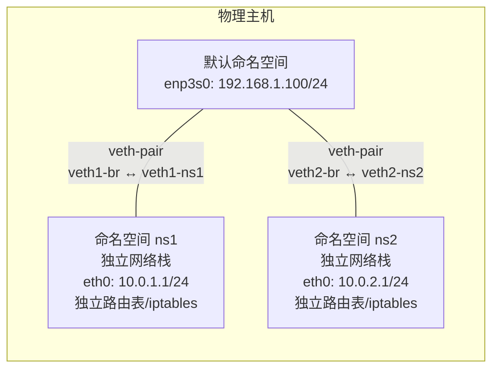

# 网络与服务管理

当单机变成集群、当千兆网卡扛不住流量、当服务启动顺序出错导致级联故障——这时你需要的不只是 `ip addr` 和 `systemctl start`，而是对网络与服务底层机制的深刻理解。本文从网络高可用配置（Bonding/VLAN/Bridge）到网络命名空间隔离，从 systemd 启动流程到日志与定时任务管理，帮你建立系统级的运维能力。

## 1. 网络配置进阶

### 1.1 Bonding（网卡绑定）

Bonding 将多块物理网卡绑定为一块逻辑网卡，实现冗余或负载均衡：

| 模式 | 名称 | 说明 | 交换机配置 |
|------|------|------|-----------|
| 0 | balance-rr | 轮询负载均衡 | 无需配置 |
| 1 | active-backup | 主备冗余 | 无需配置 |
| 2 | balance-xor | XOR 哈希均衡 | 无需配置 |
| 3 | broadcast | 广播所有包 | 无需配置 |
| 4 | 802.3ad | LACP 动态聚合 | 需配置 LACP |
| 5 | balance-tlb | 发送负载均衡 | 无需配置 |
| 6 | balance-alb | 收发负载均衡 | 无需配置 |

```bash
# CentOS/RHEL 配置 ifcfg-bond0
cat > /etc/sysconfig/network-scripts/ifcfg-bond0 << 'EOF'
DEVICE=bond0
TYPE=Bond
BONDING_MASTER=yes
IPADDR=192.168.1.100
PREFIX=24
GATEWAY=192.168.1.1
BONDING_OPTS="mode=1 miimon=100 primary=enp3s0"
ONBOOT=yes
EOF

# 成员网卡配置 ifcfg-enp3s0
cat > /etc/sysconfig/network-scripts/ifcfg-enp3s0 << 'EOF'
DEVICE=enp3s0
TYPE=Ethernet
MASTER=bond0
SLAVE=yes
ONBOOT=yes
EOF

# netplan 配置（Ubuntu）
cat > /etc/netplan/02-bond.yaml << 'EOF'
network:
  version: 2
  renderer: networkd
  bonds:
    bond0:
      interfaces: [enp3s0, enp4s0]
      parameters:
        mode: active-backup
        mii-monitor-interval: 100
        primary: enp3s0
      addresses: [192.168.1.100/24]
      gateway4: 192.168.1.1
  ethernets:
    enp3s0: {}
    enp4s0: {}
EOF
```

```bash
# 查看Bond状态
cat /proc/net/bonding/bond0

# 示例输出
# Bonding Mode: fault-tolerance (active-backup)
# Primary Slave: enp3s0
# Currently Active Slave: enp3s0
# MII Status: up
```

::: tip Bonding 模式选择
- **生产环境推荐模式 1**（active-backup）：无需交换机配合，一条链路故障自动切换
- **需要带宽叠加用模式 4**（802.3ad LACP）：需要交换机配置聚合组
- **避免使用模式 0**：轮询可能导致包乱序，TCP 性能下降
:::

### 1.2 VLAN（802.1Q）

VLAN 在单条物理链路上实现逻辑隔离，让不同 VLAN 的流量互不干扰：

```bash
# ip 命令创建 VLAN 子接口
ip link add link enp3s0 name enp3s0.100 type vlan id 100
ip addr add 192.168.100.1/24 dev enp3s0.100
ip link set enp3s0.100 up

# CentOS/RHEL 持久化配置
cat > /etc/sysconfig/network-scripts/ifcfg-enp3s0.100 << 'EOF'
DEVICE=enp3s0.100
VLAN=yes
PHYSDEV=enp3s0
IPADDR=192.168.100.1
PREFIX=24
ONBOOT=yes
EOF

# netplan 配置（Ubuntu）
cat > /etc/netplan/03-vlan.yaml << 'EOF'
network:
  version: 2
  renderer: networkd
  vlans:
    enp3s0.100:
      id: 100
      link: enp3s0
      addresses: [192.168.100.1/24]
    enp3s0.200:
      id: 200
      link: enp3s0
      addresses: [10.0.200.1/24]
  ethernets:
    enp3s0: {}
EOF
```

### 1.3 Bridge（网桥）

Bridge 工作在数据链路层，将多个接口连接到同一个二层域，常用于虚拟化和容器网络：

```bash
# ip 命令创建网桥
ip link add name br0 type bridge
ip link set enp3s0 master br0
ip addr add 192.168.1.100/24 dev br0
ip link set br0 up

# CentOS/RHEL 持久化配置
cat > /etc/sysconfig/network-scripts/ifcfg-br0 << 'EOF'
DEVICE=br0
TYPE=Bridge
IPADDR=192.168.1.100
PREFIX=24
GATEWAY=192.168.1.1
ONBOOT=yes
EOF

# 将物理接口加入网桥
cat > /etc/sysconfig/network-scripts/ifcfg-enp3s0 << 'EOF'
DEVICE=enp3s0
TYPE=Ethernet
BRIDGE=br0
ONBOOT=yes
EOF

# netplan 配置
cat > /etc/netplan/04-bridge.yaml << 'EOF'
network:
  version: 2
  renderer: networkd
  bridges:
    br0:
      interfaces: [enp3s0]
      addresses: [192.168.1.100/24]
      gateway4: 192.168.1.1
      parameters:
        stp: true
        forward-delay: 15
  ethernets:
    enp3s0: {}
EOF
```

```bash
# 查看网桥信息
bridge link show
bridge fdb show    # MAC 转发表
brctl show         # 旧命令，兼容性好
```

### 1.4 Bonding + VLAN + Bridge 组合

企业环境常用"绑定+VLAN+网桥"三件套实现高可用虚拟化网络：

```yaml
# /etc/netplan/05-full.yaml
network:
  version: 2
  renderer: networkd
  bonds:
    bond0:
      interfaces: [enp3s0, enp4s0]
      parameters:
        mode: active-backup
        mii-monitor-interval: 100
  vlans:
    bond0.100:
      id: 100
      link: bond0
  bridges:
    br100:
      interfaces: [bond0.100]
      addresses: [192.168.100.1/24]
      parameters:
        stp: true
  ethernets:
    enp3s0: {}
    enp4s0: {}
```

## 2. 网络命名空间

### 2.1 命名空间概念

网络命名空间（Network Namespace）是 Linux 内核提供的网络隔离机制——每个命名空间拥有独立的网络栈：接口、路由表、iptables 规则、端口号空间。



### 2.2 命名空间操作

```bash
# 创建命名空间
ip netns add ns1
ip netns add ns2

# 列出所有命名空间
ip netns list

# 在命名空间中执行命令
ip netns exec ns1 ip link show
ip netns exec ns1 bash    # 进入命名空间的 shell

# 将接口移入命名空间
ip link set veth1-ns1 netns ns1

# 在命名空间中配置 IP
ip netns exec ns1 ip addr add 10.0.1.1/24 dev veth1-ns1
ip netns exec ns1 ip link set veth1-ns1 up
ip netns exec ns1 ip link set lo up

# 删除命名空间
ip netns delete ns1
```

### 2.3 veth-pair 连接命名空间

veth-pair 是一对虚拟网卡，像一根网线的两端，连接两个命名空间：

```bash
# 创建 veth-pair
ip link add veth1-br type veth peer name veth1-ns1
ip link add veth2-br type veth peer name veth2-ns2

# 将一端移入命名空间
ip link set veth1-ns1 netns ns1
ip link set veth2-ns2 netns ns2

# 另一端接入网桥
ip link set veth1-br master br0
ip link set veth2-br master br0

# 启动所有接口
ip link set veth1-br up
ip link set veth2-br up
ip netns exec ns1 ip link set veth1-ns1 up
ip netns exec ns1 ip link set lo up
ip netns exec ns2 ip link set veth2-ns2 up
ip netns exec ns2 ip link set lo up
```

### 2.4 实战：用命名空间模拟双机通信

```bash
#!/bin/bash
# 创建两个命名空间并通过网桥互通

# 1. 创建网桥
ip link add br0 type bridge
ip addr add 10.0.0.254/24 dev br0
ip link set br0 up

# 2. 创建命名空间
ip netns add ns1
ip netns add ns2

# 3. 创建 veth-pair 并连接
ip link add veth1-br type veth peer name veth1-ns1
ip link add veth2-br type veth peer name veth2-ns2

# 4. 接入网桥
ip link set veth1-br master br0
ip link set veth2-br master br0
ip link set veth1-br up
ip link set veth2-br up

# 5. 移入命名空间
ip link set veth1-ns1 netns ns1
ip link set veth2-ns2 netns ns2

# 6. 配置 IP
ip netns exec ns1 ip addr add 10.0.0.1/24 dev veth1-ns1
ip netns exec ns1 ip link set veth1-ns1 up
ip netns exec ns1 ip link set lo up

ip netns exec ns2 ip addr add 10.0.0.2/24 dev veth2-ns2
ip netns exec ns2 ip link set veth2-ns2 up
ip netns exec ns2 ip link set lo up

# 7. 测试互通
ip netns exec ns1 ping -c 3 10.0.0.2
ip netns exec ns2 ping -c 3 10.0.0.1

echo "Namespace network simulation complete!"
```

::: important 命名空间的应用场景
- **容器网络**：Docker/Kubernetes 的底层网络隔离
- **网络开发测试**：在一台机器上模拟复杂网络拓扑
- **安全隔离**：不同服务运行在独立网络栈中
- **VPN 隔离**：特定进程的流量走 VPN，其他走默认路由
:::

## 3. 路由策略

### 3.1 策略路由（Policy Routing）

Linux 支持多路由表，通过 `ip rule` 定义策略决定哪些流量查哪张路由表：

```bash
# 查看路由表列表
cat /etc/iproute2/rt_tables
# 255     local
# 254     main       # 默认路由表（ip route show 显示的）
# 253     default
# 0       unspec

# 添加自定义路由表
echo "100 isp1" >> /etc/iproute2/rt_tables
echo "200 isp2" >> /etc/iproute2/rt_tables
```

**策略路由规则：**

```bash
# 查看路由策略规则
ip rule show

# 基于源地址的策略路由
ip rule add from 192.168.1.0/24 table isp1
ip rule add from 192.168.2.0/24 table isp2

# 基于入接口的策略路由
ip rule add iif eth0 table isp1
ip rule add iif eth1 table isp2

# 基于标记的策略路由
ip rule add fwmark 0x1 table isp1
ip rule add fwmark 0x2 table isp2

# 基于TOS的策略路由
ip rule add tos 0x08 table isp1

# 设置路由表内容
ip route add default via 203.0.113.1 dev eth0 table isp1
ip route add default via 198.51.100.1 dev eth1 table isp2

# 查看特定路由表
ip route show table isp1
ip route show table main
```

### 3.2 双 ISP 负载均衡实战

```bash
#!/bin/bash
# 双 ISP 负载均衡脚本

# 接口和网关
ISP1_IF=eth0
ISP1_GW=203.0.113.1
ISP1_IP=203.0.113.10

ISP2_IF=eth1
ISP2_GW=198.51.100.1
ISP2_IP=198.51.100.10

# 1. 创建路由表
echo "100 isp1" >> /etc/iproute2/rt_tables
echo "200 isp2" >> /etc/iproute2/rt_tables

# 2. 填充路由表
ip route add $ISP1_GW dev $ISP1_IF src $ISP1_IP table isp1
ip route add default via $ISP1_GW table isp1
ip route add $ISP2_GW dev $ISP2_IF src $ISP2_IP table isp2
ip route add default via $ISP2_GW table isp2

# 3. 设置策略规则
ip rule add from $ISP1_IP table isp1
ip rule add from $ISP2_IP table isp2

# 4. 默认路由负载均衡（等价多路径）
ip route add default scope global nexthop via $ISP1_GW dev $ISP1_IF weight 1 \
                                nexthop via $ISP2_GW dev $ISP2_IF weight 1

# 5. NAT
iptables -t nat -A POSTROUTING -o $ISP1_IF -j MASQUERADE
iptables -t nat -A POSTROUTING -o $ISP2_IF -j MASQUERADE

echo 1 > /proc/sys/net/ipv4/ip_forward
echo "Dual ISP load balancing configured."
```

## 4. 网络故障排查方法论

### 4.1 分层排查法


### 4.2 常见故障与排查命令

```bash
# 1. 接口状态异常
ethtool enp3s0               # 检查链路状态、速率、双工
ethtool -i enp3s0            # 查看驱动信息
dmesg | grep -i eth          # 内核日志中的网卡信息

# 2. IP 冲突
arping -I enp3s0 192.168.1.100  # 检测 IP 冲突

# 3. MTU 问题（常见于 VPN/隧道）
ping -M do -s 1472 192.168.1.1   # 测试 MTU（1472 + 28 = 1500）
tracepath 192.168.1.1            # 显示路径 MTU

# 4. ARP 问题
ip neigh show                   # 查看 ARP 表
ip neigh flush dev enp3s0       # 刷新 ARP 缓存
arp -d 192.168.1.1              # 删除特定 ARP 条目

# 5. 路由问题
ip route get 8.8.8.8           # 查看到某 IP 的路由决策
ip route get 8.8.8.8 from 192.168.1.100  # 指定源 IP

# 6. 连接追踪表满
conntrack -L | wc -l           # 查看连接数
cat /proc/sys/net/netfilter/nf_conntrack_max
dmesg | grep conntrack         # 检查是否表满报错

# 7. TCP 连接问题
ss -tn state close-wait        # 检查 CLOSE_WAIT 堆积
ss -tn state time-wait         # 检查 TIME_WAIT 堆积
ss -tn state syn-recv          # 检查 SYN_RECV（SYN Flood）
```

::: warning CLOSE_WAIT 堆积
大量 `CLOSE_WAIT` 说明本端程序没有正确关闭连接——通常是代码中缺少 `close()` 调用。这不是系统调优能解决的，必须修复应用代码。
:::

### 4.3 连接追踪调优

```bash
# 查看当前连接追踪数
conntrack -L | wc -l

# 查看最大值
cat /proc/sys/net/netfilter/nf_conntrack_max

# 调大连接追踪表
sysctl -w net.netfilter.nf_conntrack_max=524288

# 调整超时时间
sysctl -w net.netfilter.nf_conntrack_tcp_timeout_established=1800
sysctl -w net.netfilter.nf_conntrack_tcp_timeout_close_wait=30
sysctl -w net.netfilter.nf_conntrack_tcp_timeout_time_wait=30

# 永久生效
cat >> /etc/sysctl.d/99-conntrack.conf << 'EOF'
net.netfilter.nf_conntrack_max = 524288
net.netfilter.nf_conntrack_tcp_timeout_established = 1800
net.netfilter.nf_conntrack_tcp_timeout_close_wait = 30
net.netfilter.nf_conntrack_tcp_timeout_time_wait = 30
EOF

sysctl -p /etc/sysctl.d/99-conntrack.conf
```

## 5. 服务管理——systemctl 详解

### 5.1 systemd 启动流程


### 5.2 systemctl 核心命令

```bash
# 服务管理
systemctl start nginx          # 启动
systemctl stop nginx           # 停止
systemctl restart nginx        # 重启
systemctl reload nginx         # 重载配置（不断服务）
systemctl status nginx         # 查看状态
systemctl is-active nginx      # 是否运行
systemctl is-enabled nginx     # 是否开机启动
systemctl is-failed nginx      # 是否失败

# 开机自启
systemctl enable nginx         # 开机启动
systemctl disable nginx        # 取消开机启动
systemctl enable --now nginx   # 启动并设为开机启动
systemctl mask nginx           # 屏蔽服务（无法启动）
systemctl unmask nginx         # 取消屏蔽

# 查询
systemctl list-units           # 所有活跃 unit
systemctl list-units --all     # 所有 unit（含 inactive）
systemctl list-units --type=service          # 仅服务
systemctl list-units --state=failed          # 失败的 unit
systemctl list-unit-files                     # 所有 unit 文件
systemctl list-dependencies nginx             # 依赖树
```

### 5.3 Unit 文件编写

```ini
# /etc/systemd/system/myapp.service
[Unit]
Description=My Application Service
Documentation=https://docs.example.com
After=network-online.target mysql.service    # 在这些服务之后启动
Wants=network-online.target                  # 弱依赖（不影响自己启动）
Requires=mysql.service                       # 强依赖（依赖失败自己也失败）
Conflicts=oldapp.service                     # 冲突服务
Before=nginx.service                         # 在 nginx 之前启动

[Service]
Type=notify                  # 启动类型：simple/forking/notify/oneshot/dbus
User=myapp
Group=myapp
WorkingDirectory=/opt/myapp
EnvironmentFile=/etc/default/myapp
ExecStart=/opt/myapp/bin/start.sh
ExecStartPre=/opt/myapp/bin/pre-check.sh
ExecStartPost=/opt/myapp/bin/health-check.sh
ExecStop=/opt/myapp/bin/stop.sh
ExecReload=/bin/kill -HUP $MAINPID

# 重启策略
Restart=on-failure           # always/on-success/on-failure/on-abnormal/no
RestartSec=5                 # 重启间隔
StartLimitIntervalSec=60     # 重启窗口
StartLimitBurst=3            # 窗口内最大重启次数

# 资源限制
LimitNOFILE=65536
LimitNPROC=4096
LimitCORE=infinity

# 安全加固
NoNewPrivileges=true
ProtectSystem=strict
ProtectHome=true
ReadWritePaths=/var/log/myapp /var/lib/myapp
PrivateTmp=true

# 超时
TimeoutStartSec=90
TimeoutStopSec=30
WatchdogSec=60               # 看门狗（需应用配合 sd_notify）

[Install]
WantedBy=multi-user.target   # 在 multi-user.target 下启用
```

**Unit 文件关键指令详解：**

| 字段 | 说明 |
|------|------|
| `After` | 启动顺序（不建立依赖） |
| `Before` | 启动顺序（不建立依赖） |
| `Requires` | 强依赖——依赖失败，自己也被停止 |
| `Wants` | 弱依赖——依赖失败，不影响自己 |
| `Requisite` | 强依赖——依赖未启动，自己直接失败不尝试 |
| `PartOf` | 反向依赖——依赖重启，自己也重启 |
| `Conflicts` | 冲突——不能同时运行 |

::: important Requires vs Wants vs After
- `After=nginx` 只定义**启动顺序**，不建立依赖关系
- `Wants=nginx` 是弱依赖，nginx 挂了不影响自己
- `Requires=nginx` 是强依赖，nginx 挂了自己也挂
- 生产环境推荐 `Wants` + `After` 组合，避免级联故障
:::

### 5.4 Target 详解

Target 是 systemd 的"运行级别"替代品，一组 unit 的集合：

| Target | 传统运行级别 | 说明 |
|--------|-------------|------|
| `poweroff.target` | 0 | 关机 |
| `rescue.target` | 1 | 单用户救援模式 |
| `multi-user.target` | 3 | 多用户命令行 |
| `graphical.target` | 5 | 图形界面 |
| `reboot.target` | 6 | 重启 |

```bash
# 查看默认 target
systemctl get-default

# 设置默认 target
systemctl set-default multi-user.target

# 切换 target（立即生效）
systemctl isolate multi-user.target

# 查看target依赖
systemctl list-dependencies multi-user.target
```

### 5.5 修改 Unit 文件后的操作

```bash
# 修改 unit 文件后必须重新加载
systemctl daemon-reload

# 重启服务使配置生效
systemctl restart myapp

# 查看修改前后的差异
systemd-delta
```

## 6. 日志管理

### 6.1 journald（systemd 日志）

```bash
# 查看所有日志
journalctl

# 按服务查看
journalctl -u nginx
journalctl -u nginx --since "2024-01-01" --until "2024-01-02"

# 按时间过滤
journalctl --since "1 hour ago"
journalctl --since "2024-01-01 10:00" --until "2024-01-01 12:00"
journalctl --since yesterday

# 按优先级过滤
journalctl -p err           # 错误及以上
journalctl -p warning       # 警告及以上
# 优先级：emerg(0) alert(1) crit(2) err(3) warning(4) notice(5) info(6) debug(7)

# 实时跟踪
journalctl -f
journalctl -u nginx -f

# 按进程/用户
journalctl _PID=1234
journalctl _UID=1000

# 按可执行文件
journalctl /usr/sbin/nginx

# 内核日志
journalctl -k

# 输出格式
journalctl -o json-pretty   # JSON 格式
journalctl -o cat           # 仅消息内容
journalctl -o verbose       # 详细字段

# 磁盘使用
journalctl --disk-usage

# 清理日志
journalctl --vacuum-size=500M    # 限制总大小
journalctl --vacuum-time=7d      # 保留 7 天
```

**journald 配置：**

```ini
# /etc/systemd/journald.conf
[Journal]
Storage=persistent          # auto/persistent/volatile/none
Compress=yes
Seal=yes
SplitMode=uid               # 按用户分割日志
RateLimitIntervalSec=30s
RateLimitBurst=10000
SystemMaxUse=4G             # 系统日志最大 4G
SystemMaxFileSize=100M      # 单个日志文件最大 100M
MaxRetentionSec=1month      # 保留一个月
ForwardToSyslog=yes         # 同时转发到 rsyslog
```

### 6.2 rsyslog

rsyslog 是传统 syslog 的增强版，支持模块化、过滤和远程日志：

```bash
# 配置文件结构
/etc/rsyslog.conf              # 主配置
/etc/rsyslog.d/*.conf          # 子配置

# 基本语法：facility.priority    action
# facility: auth, cron, daemon, kern, lpr, mail, mark, news, security, user, uucp, local0-local7
# priority: debug, info, notice, warning, err, crit, alert, emerg
```

```ini
# /etc/rsyslog.d/myapp.conf
# 将 myapp 日志写到独立文件
if $programname == 'myapp' then /var/log/myapp.log
& stop    # 不再继续处理

# 按优先级分发
kern.*                          /var/log/kern.log
authpriv.*                      /var/log/secure
mail.info                       /var/log/mail.info
*.emerg                         :omusrmsg:*    # 紧急消息广播给所有用户

# 远程日志发送
*.* @@logserver.example.com:514    # TCP 发送
*.* @logserver.example.com:514     # UDP 发送
```

```bash
# 作为日志服务器接收远程日志
# /etc/rsyslog.conf 取消注释
module(load="imtcp")
input(type="imtcp" port="514")

# 重启服务
systemctl restart rsyslog
```

### 6.3 logrotate（日志轮转）

```ini
# /etc/logrotate.d/myapp
/var/log/myapp.log {
    daily               # 每天轮转
    missingok           # 日志文件不存在不报错
    rotate 30           # 保留 30 份
    compress            # 压缩旧日志
    delaycompress       # 延迟一个周期压缩
    notifempty          # 空文件不轮转
    create 0644 myapp myapp    # 创建新文件的权限和属主
    sharedscripts
    postrotate
        systemctl reload myapp > /dev/null 2>&1 || true
    endscript
    dateext             # 日期后缀
    dateformat -%Y%m%d
    maxsize 100M        # 超过 100M 立即轮转
}
```

```bash
# 手动测试轮转
logrotate -d /etc/logrotate.d/myapp    # 调试模式（不实际执行）
logrotate -f /etc/logrotate.d/myapp    # 强制轮转

# 查看全局配置
cat /etc/logrotate.conf
```

## 7. 定时任务

### 7.1 crontab

```bash
# 编辑当前用户的 crontab
crontab -e

# 查看当前用户的 crontab
crontab -l

# 删除当前用户的 crontab
crontab -r

# 编辑指定用户的 crontab
crontab -e -u username

# 系统级 crontab
/etc/crontab
/etc/cron.d/*
```

**crontab 时间格式：**

```
┌──────── 分钟 (0-59)
│ ┌────── 小时 (0-23)
│ │ ┌──── 日 (1-31)
│ │ │ ┌── 月 (1-12)
│ │ │ │ ┌ 星期 (0-7，0和7都是周日)
│ │ │ │ │
* * * * * command
```

| 表达式 | 含义 |
|--------|------|
| `*/5 * * * *` | 每 5 分钟 |
| `0 * * * *` | 每小时整点 |
| `0 2 * * *` | 每天凌晨 2 点 |
| `0 2 * * 0` | 每周日凌晨 2 点 |
| `0 0 1 * *` | 每月 1 日零点 |
| `0 0 1 1 *` | 每年 1 月 1 日零点 |
| `0 9-17 * * 1-5` | 工作日每小时 |
| `0 2 */2 * *` | 每 2 天凌晨 2 点 |

```bash
# /etc/crontab 系统级定时任务示例
SHELL=/bin/bash
PATH=/sbin:/bin:/usr/sbin:/usr/bin
MAILTO=admin@example.com

# 每5分钟检查服务健康
*/5 * * * * root /opt/scripts/health-check.sh

# 每天凌晨3点备份数据库
0 3 * * * root /opt/scripts/backup-db.sh >> /var/log/backup.log 2>&1

# 每周日凌晨4点清理日志
0 4 * * 0 root /opt/scripts/clean-logs.sh
```

::: warning crontab 常见陷阱
1. **环境变量缺失**：crontab 环境极简，必须写绝对路径
2. **% 需要转义**：`date +\%Y\%m\%d`，否则 cron 会当换行处理
3. **时区问题**：cron 使用系统时区，可能与应用不同
4. **输出未重定向**：默认发邮件，无 MTA 时会堆积在 `/var/spool/mail/`
5. **秒级不支持**：crontab 最小粒度为分钟，需要秒级用 systemd timer 或脚本循环
:::

### 7.2 systemd timer

systemd timer 是 crontab 的现代替代品，优势在于日志集成和精确控制：

```ini
# /etc/systemd/system/backup.timer
[Unit]
Description=Daily Database Backup Timer

[Timer]
OnCalendar=*-*-* 03:00:00      # 每天凌晨3点
Persistent=true                 # 错过的运行在下次开机后补跑
AccuracySec=1min                # 精度（默认1分钟随机偏移防同时启动）
RandomizedDelaySec=300          # 随机延迟 0-300 秒

[Install]
WantedBy=timers.target
```

```ini
# /etc/systemd/system/backup.service
[Unit]
Description=Daily Database Backup

[Service]
Type=oneshot
ExecStart=/opt/scripts/backup-db.sh
```

```bash
# 启用 timer
systemctl enable --now backup.timer

# 查看所有 timer
systemctl list-timers

# 查看 timer 详情
systemctl status backup.timer

# 手动触发
systemctl start backup.service
```

**Timer 时间表达式：**

| 表达式 | 含义 |
|--------|------|
| `*-*-* 03:00` | 每天凌晨 3 点 |
| `*-*-* *:0/5` | 每 5 分钟 |
| `Weekly` | 每周一零点 |
| `Monthly` | 每月 1 日零点 |
| `*:0/30` | 每 30 分钟 |
| `Mon *-*-* 09:00` | 每周一 9 点 |
| `*-*-* 09-17:00` | 9-17 点每小时 |

### 7.3 at（一次性定时任务）

```bash
# 在指定时间执行
at 10:00 PM
at> /opt/scripts/maintenance.sh
at> Ctrl+D

# 在指定日期执行
at 10:00 PM Dec 25
at 2:00 AM tomorrow
at now + 1 hour

# 查看待执行任务
atq

# 查看任务详情
at -c 1     # 查看任务ID 1的内容

# 删除任务
atrm 1
```

## 8. 内核参数调优（sysctl）

### 8.1 sysctl 基础

```bash
# 查看所有参数
sysctl -a

# 查看特定参数
sysctl net.ipv4.ip_forward
cat /proc/sys/net/ipv4/ip_forward

# 临时修改
sysctl -w net.ipv4.ip_forward=1

# 永久修改
echo "net.ipv4.ip_forward = 1" >> /etc/sysctl.d/99-custom.conf
sysctl -p /etc/sysctl.d/99-custom.conf
```

### 8.2 网络核心参数

```ini
# /etc/sysctl.d/99-network.conf

# ========== TCP 优化 ==========

# TCP 缓冲区（最小/默认/最大，单位字节）
net.core.rmem_max = 16777216
net.core.wmem_max = 16777216
net.ipv4.tcp_rmem = 4096 87380 16777216
net.ipv4.tcp_wmem = 4096 65536 16777216

# TCP 连接队列
net.core.somaxconn = 65535          # listen() backlog 上限
net.core.netdev_max_backlog = 65536  # 网卡接收队列
net.ipv4.tcp_max_syn_backlog = 65536 # SYN 队列

# TIME_WAIT 优化
net.ipv4.tcp_max_tw_buckets = 65536  # TIME_WAIT 最大数
net.ipv4.tcp_tw_reuse = 1           # 允许复用 TIME_WAIT（客户端）
# 注意：tcp_tw_recycle 在 NAT 环境下有 bug，已在 4.12 移除

# TCP 超时
net.ipv4.tcp_fin_timeout = 15       # FIN_WAIT_2 超时（默认60秒）
net.ipv4.tcp_keepalive_time = 600   # TCP keepalive 探测间隔
net.ipv4.tcp_keepalive_intvl = 30   # 探测间隔
net.ipv4.tcp_keepalive_probes = 5   # 探测次数

# TCP 快速打开
net.ipv4.tcp_fastopen = 3           # 客户端+服务端启用

# SYN Flood 防御
net.ipv4.tcp_syncookies = 1         # 启用 SYN Cookie
net.ipv4.tcp_synack_retries = 2     # SYN+ACK 重试次数

# ========== IP 转发 ==========
net.ipv4.ip_forward = 1
net.ipv4.conf.all.forwarding = 1

# ========== 安全 ==========
# 禁止源路由
net.ipv4.conf.all.accept_source_route = 0
net.ipv4.conf.default.accept_source_route = 0

# 反向路径过滤
net.ipv4.conf.all.rp_filter = 1
net.ipv4.conf.default.rp_filter = 1

# 禁止 ICMP 重定向
net.ipv4.conf.all.accept_redirects = 0
net.ipv4.conf.default.accept_redirects = 0
net.ipv4.conf.all.send_redirects = 0

# ========== 文件描述符 ==========
fs.file-max = 1048576               # 系统级最大文件描述符
fs.nr_open = 1048576                # 单进程最大文件描述符
```

### 8.3 内存相关参数

```ini
# /etc/sysctl.d/99-memory.conf

# 交换分区策略
vm.swappiness = 10                  # 尽量少用 swap（默认60）
                                    # 0=尽可能不用 100=积极使用

# 脏页回写
vm.dirty_ratio = 20                 # 脏页占总内存 20% 时同步写回
vm.dirty_background_ratio = 5       # 脏页占 5% 时后台写回
vm.dirty_writeback_centisecs = 500  # 写回线程唤醒间隔（5秒）

# 内存过量分配
vm.overcommit_memory = 0            # 0=启发式 1=总是允许 2=不允许超过限额
vm.overcommit_ratio = 50            # 过量分配比率（overcommit_memory=2时）

# 大页
vm.nr_hugepages = 1024              # 预分配大页数量
```

### 8.4 完整生产环境调优脚本

```bash
#!/bin/bash
# ============================================================
# 生产环境 sysctl 调优脚本
# 适用于：高并发 Web 服务器
# ============================================================

SYSCTL_CONF="/etc/sysctl.d/99-production.conf"

cat > $SYSCTL_CONF << 'EOF'
# --- 网络优化 ---
net.core.somaxconn = 65535
net.core.netdev_max_backlog = 65536
net.core.rmem_max = 16777216
net.core.wmem_max = 16777216
net.ipv4.tcp_rmem = 4096 87380 16777216
net.ipv4.tcp_wmem = 4096 65536 16777216
net.ipv4.tcp_max_syn_backlog = 65536
net.ipv4.tcp_max_tw_buckets = 65536
net.ipv4.tcp_tw_reuse = 1
net.ipv4.tcp_fin_timeout = 15
net.ipv4.tcp_keepalive_time = 600
net.ipv4.tcp_fastopen = 3
net.ipv4.tcp_syncookies = 1
net.ipv4.tcp_synack_retries = 2

# --- 安全加固 ---
net.ipv4.conf.all.accept_source_route = 0
net.ipv4.conf.default.accept_source_route = 0
net.ipv4.conf.all.rp_filter = 1
net.ipv4.conf.default.rp_filter = 1
net.ipv4.conf.all.accept_redirects = 0
net.ipv4.conf.default.accept_redirects = 0
net.ipv4.icmp_echo_ignore_broadcasts = 1
net.ipv4.icmp_ignore_bogus_error_responses = 1

# --- 内存 ---
vm.swappiness = 10
vm.dirty_ratio = 20
vm.dirty_background_ratio = 5

# --- 文件描述符 ---
fs.file-max = 1048576
EOF

sysctl -p $SYSCTL_CONF

# 同时调大进程级限制
cat >> /etc/security/limits.d/99-nofile.conf << 'EOF'
* soft nofile 655360
* hard nofile 655360
root soft nofile 655360
root hard nofile 655360
EOF

echo "Production sysctl tuning applied."
```

## 9. 实战：系统服务健康巡检脚本

```bash
#!/bin/bash
# ============================================================
# 系统服务健康巡检脚本
# 检查网络/服务/日志/定时任务状态
# ============================================================

set -euo pipefail

RED='\033[0;31m'
GREEN='\033[0;32m'
YELLOW='\033[1;33m'
NC='\033[0m'

log_ok()   { echo -e "${GREEN}[OK]${NC} $1"; }
log_warn() { echo -e "${YELLOW}[WARN]${NC} $1"; }
log_fail() { echo -e "${RED}[FAIL]${NC} $1"; }

echo "=============================="
echo " 系统服务健康巡检"
echo " $(date '+%Y-%m-%d %H:%M:%S')"
echo "=============================="

# 1. 网络接口检查
echo -e "\n--- 网络接口 ---"
for iface in $(ip -o link show | awk -F': ' '{print $2}' | grep -v lo); do
    state=$(ip -o link show "$iface" | awk '{print $9}')
    if [ "$state" = "UP" ]; then
        log_ok "$iface: UP"
    else
        log_warn "$iface: DOWN"
    fi
done

# 2. 默认网关检查
echo -e "\n--- 默认网关 ---"
if ip route show default | grep -q .; then
    gw=$(ip route show default | awk '{print $3}')
    if ping -c 1 -W 2 "$gw" > /dev/null 2>&1; then
        log_ok "网关 $gw 可达"
    else
        log_fail "网关 $gw 不可达"
    fi
else
    log_fail "无默认路由"
fi

# 3. DNS 检查
echo -e "\n--- DNS 解析 ---"
if nslookup google.com > /dev/null 2>&1; then
    log_ok "DNS 解析正常"
else
    log_fail "DNS 解析失败"
fi

# 4. 关键服务检查
echo -e "\n--- 关键服务 ---"
SERVICES="sshd nginx"
for svc in $SERVICES; do
    if systemctl is-active "$svc" > /dev/null 2>&1; then
        log_ok "$svc: 运行中"
    else
        log_fail "$svc: 未运行"
    fi
done

# 5. 失败服务检查
echo -e "\n--- 失败服务 ---"
failed=$(systemctl --failed --type=service --no-legend | awk '{print $1}')
if [ -z "$failed" ]; then
    log_ok "无失败服务"
else
    for svc in $failed; do
        log_fail "$svc: 失败"
    done
fi

# 6. 磁盘空间检查
echo -e "\n--- 磁盘空间 ---"
df -h --output=target,pcent | tail -n +2 | while read -r mount pct; do
    usage=${pct%\%}
    if [ "$usage" -gt 90 ]; then
        log_fail "$mount: ${pct} 已使用"
    elif [ "$usage" -gt 80 ]; then
        log_warn "$mount: ${pct} 已使用"
    else
        log_ok "$mount: ${pct} 已使用"
    fi
done

# 7. 连接追踪检查
echo -e "\n--- 连接追踪 ---"
if [ -f /proc/sys/net/netfilter/nf_conntrack_count ]; then
    count=$(cat /proc/sys/net/netfilter/nf_conntrack_count)
    max=$(cat /proc/sys/net/netfilter/nf_conntrack_max)
    pct=$((count * 100 / max))
    if [ "$pct" -gt 80 ]; then
        log_warn "连接追踪: $count/$max (${pct}%)"
    else
        log_ok "连接追踪: $count/$max (${pct}%)"
    fi
fi

# 8. 日志错误检查
echo -e "\n--- 最近1小时错误日志 ---"
errors=$(journalctl -p err --since "1 hour ago" --no-pager | wc -l)
if [ "$errors" -gt 0 ]; then
    log_warn "最近1小时有 $errors 条错误日志"
    journalctl -p err --since "1 hour ago" --no-pager | tail -5
else
    log_ok "最近1小时无错误日志"
fi

echo -e "\n=============================="
echo " 巡检完成"
echo "=============================="
```

## 参考资源

- 《深入理解 Linux 内核》—— Daniel P. Bovet
- 《Linux 内核设计与实现》—— Robert Love
- 《鸟哥的 Linux 私房菜——服务器架设篇》
- [systemd 官方文档](https://www.freedesktop.org/wiki/Software/systemd/)
- [iproute2 文档](https://wiki.linuxfoundation.org/networking/iproute2)
- [Linux 网络命名空间](https://man7.org/linux/man-pages/man8/ip-netns.8.html)
