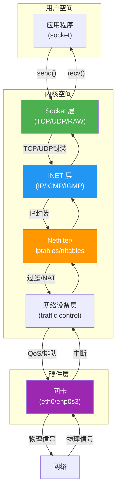
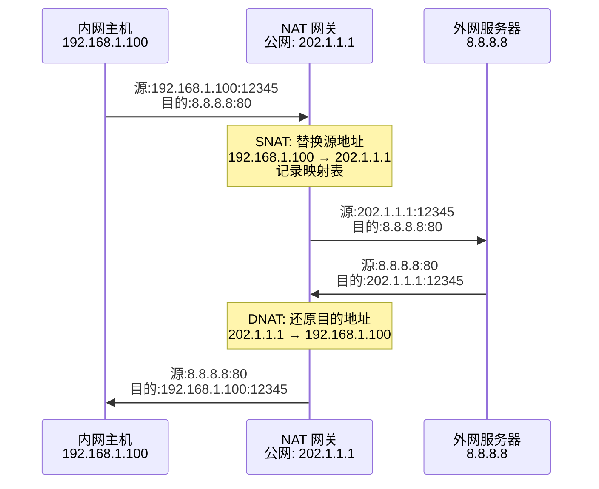
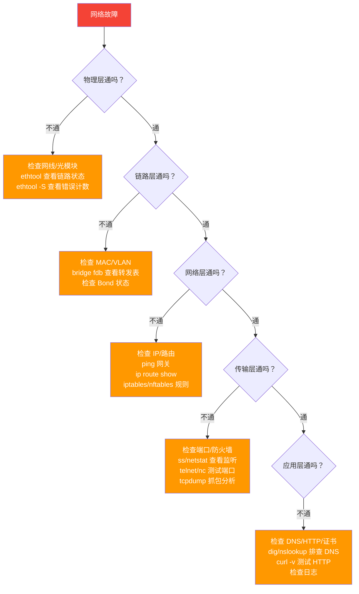
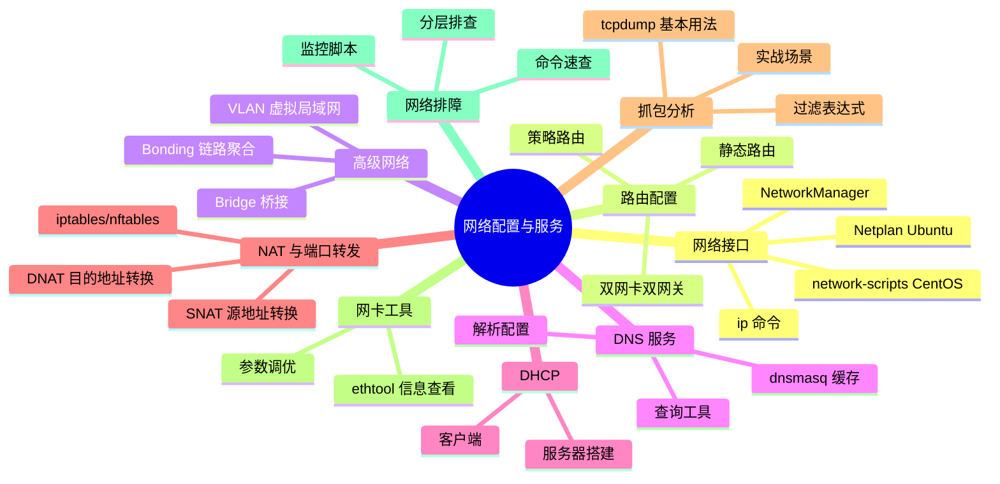

# 网络配置与服务

> 网络是连接世界的桥梁——掌握 Linux 网络配置，就是掌握了系统与外部通信的命脉。
>
> 本章参考：《鸟哥的 Linux 私房菜》（第四版）第五章与第六章、《TCP/IP 详解》卷一。

## 一、Linux 网络协议栈概览

### 1.1 数据流向

Linux 网络协议栈是一个分层处理系统，数据从应用程序发出，经过各层协议处理后到达网卡，反之亦然：



### 1.2 网络接口命名

传统命名（eth0、eth1）已被 systemd/udev 的可预测命名规则替代：

| 命名规则 | 格式 | 示例 |
|----------|------|------|
| 基于 BIOS | eno[编号] | eno1 |
| 基于 PCI 插槽 | enp[插槽]s[编号] | enp0s3 |
| 基于 MAC | enx[MAC地址] | enx001122334455 |
| 传统命名 | eth[编号] | eth0 |

```bash
# 查看所有网络接口
ip link show

# 输出示例：
# 1: lo: <LOOPBACK,UP,LOWER_UP> mtu 65536 ...
# 2: enp0s3: <BROADCAST,MULTICAST,UP,LOWER_UP> mtu 1500 ...
# 3: docker0: <BROADCAST,MULTICAST,UP,LOWER_UP> mtu 1500 ...

# 恢复传统命名（如需）
# 在 /etc/default/grub 中添加：
# GRUB_CMDLINE_LINUX="net.ifnames=0 biosdevname=0"
sudo update-grub
```

## 二、网络接口管理

### 2.1 ip 命令（推荐替代 ifconfig）

```bash
# ========== 链路层管理（ip link）==========

# 查看所有接口
ip link show

# 查看指定接口
ip link show enp0s3

# 启用/禁用接口
sudo ip link set enp0s3 up
sudo ip link set enp0s3 down

# 修改 MTU
sudo ip link set enp0s3 mtu 9000    # 开启 Jumbo Frame

# 修改 MAC 地址
sudo ip link set enp0s3 down
sudo ip link set enp0s3 address 00:11:22:33:44:55
sudo ip link set enp0s3 up

# 修改接口名称
sudo ip link set enp0s3 name eth0

# ========== IP 地址管理（ip addr）==========

# 查看所有地址
ip addr show
ip a    # 简写

# 查看指定接口的地址
ip addr show enp0s3

# 添加 IP 地址
sudo ip addr add 192.168.1.100/24 dev enp0s3

# 添加辅助 IP（同一接口多个 IP）
sudo ip addr add 192.168.1.101/24 dev enp0s3

# 删除 IP 地址
sudo ip addr del 192.168.1.100/24 dev enp0s3

# 清空接口所有 IP
sudo ip addr flush dev enp0s3

# ========== 路由管理（ip route）==========

# 查看路由表
ip route show
ip route    # 简写

# 查看默认路由
ip route show default

# 添加默认路由
sudo ip route add default via 192.168.1.1

# 添加静态路由
sudo ip route add 10.0.0.0/8 via 192.168.1.254
sudo ip route add 172.16.0.0/12 dev enp0s3

# 删除路由
sudo ip route del 10.0.0.0/8

# 通过指定接口路由
sudo ip route add 192.168.100.0/24 dev enp0s3 src 192.168.1.100

# ========== 邻居表（ip neigh）==========

# 查看 ARP 缓存
ip neigh show

# 添加静态 ARP 条目
sudo ip neigh add 192.168.1.1 lladdr 00:11:22:33:44:55 dev enp0s3

# 删除 ARP 条目
sudo ip neigh del 192.168.1.1 dev enp0s3

# 清空 ARP 缓存
sudo ip neigh flush dev enp0s3
```

### 2.2 Netplan（Ubuntu 18.04+）

Ubuntu 从 18.04 开始使用 Netplan 作为默认网络配置工具：

```yaml
# /etc/netplan/01-netcfg.yaml
# 静态 IP 配置
network:
  version: 2
  renderer: networkd
  ethernets:
    enp0s3:
      dhcp4: no
      addresses:
        - 192.168.1.100/24
      routes:
        - to: default
          via: 192.168.1.1
      nameservers:
        addresses:
          - 223.5.5.5
          - 119.29.29.29
        search:
          - example.com
      mtu: 1500
```

```yaml
# /etc/netplan/02-dhcp.yaml
# DHCP 配置
network:
  version: 2
  renderer: networkd
  ethernets:
    enp0s3:
      dhcp4: true
      dhcp4-overrides:
        use-dns: false    # 不使用 DHCP 提供的 DNS
      nameservers:
        addresses:
          - 223.5.5.5
```

```yaml
# /etc/netplan/03-bond-vlan.yaml
# Bond + VLAN 配置
network:
  version: 2
  renderer: networkd
  bonds:
    bond0:
      interfaces:
        - enp0s3
        - enp0s8
      parameters:
        mode: active-backup
        primary: enp0s3
        mii-monitor-interval: 100
      addresses:
        - 192.168.1.100/24
      routes:
        - to: default
          via: 192.168.1.1
  vlans:
    bond0.100:
      id: 100
      link: bond0
      addresses:
        - 10.100.0.1/24
```

```bash
# 应用 Netplan 配置
sudo netplan apply

# 测试配置（不会真正应用，超时后回滚）
sudo netplan try

# 生成后端配置（调试用）
sudo netplan generate
```

### 2.3 network-scripts（CentOS/RHEL 7/8）

```bash
# /etc/sysconfig/network-scripts/ifcfg-enp0s3
# 静态 IP 配置
TYPE=Ethernet
BOOTPROTO=static
NAME=enp0s3
DEVICE=enp0s3
ONBOOT=yes
IPADDR=192.168.1.100
PREFIX=24
GATEWAY=192.168.1.1
DNS1=223.5.5.5
DNS2=119.29.29.29
MTU=1500

# ========== DHCP 配置 ==========
# TYPE=Ethernet
# BOOTPROTO=dhcp
# NAME=enp0s3
# DEVICE=enp0s3
# ONBOOT=yes

# ========== 应用配置 ==========
# CentOS 7
sudo systemctl restart network

# CentOS 8+（使用 NetworkManager）
sudo nmcli connection reload
sudo nmcli connection up enp0s3
```

### 2.4 NetworkManager（nmcli）

```bash
# ========== 查看连接 ==========
nmcli device status
nmcli connection show

# ========== 创建静态 IP 连接 ==========
sudo nmcli connection add \
    con-name static-eth0 \
    type ethernet \
    ifname enp0s3 \
    ipv4.method manual \
    ipv4.addresses 192.168.1.100/24 \
    ipv4.gateway 192.168.1.1 \
    ipv4.dns "223.5.5.5 119.29.29.29"

# ========== 创建 DHCP 连接 ==========
sudo nmcli connection add \
    con-name dhcp-eth0 \
    type ethernet \
    ifname enp0s3 \
    ipv4.method auto

# ========== 修改连接 ==========
sudo nmcli connection modify static-eth0 ipv4.addresses 192.168.1.200/24
sudo nmcli connection modify static-eth0 +ipv4.dns 8.8.8.8   # 追加 DNS
sudo nmcli connection modify static-eth0 -ipv4.dns 8.8.8.8   # 删除 DNS

# ========== 启用/禁用连接 ==========
sudo nmcli connection up static-eth0
sudo nmcli connection down static-eth0

# ========== 删除连接 ==========
sudo nmcli connection delete static-eth0

# ========== 查看详细信息 ==========
nmcli connection show static-eth0
nmcli device show enp0s3

# ========== 交互式编辑 ==========
nmtui    # 文本 UI 编辑器
```

## 三、路由配置

### 3.1 静态路由

```bash
# ========== 基本路由操作 ==========

# 查看路由表
ip route show
# default via 192.168.1.1 dev enp0s3
# 192.168.1.0/24 dev enp0s3 proto kernel scope link src 192.168.1.100

# 添加主机路由
sudo ip route add 10.10.10.5/32 via 192.168.1.254

# 添加网络路由
sudo ip route add 10.10.0.0/16 via 192.168.1.254

# 添加默认路由
sudo ip route add default via 192.168.1.1

# 修改默认路由
sudo ip route replace default via 192.168.1.2

# 删除路由
sudo ip route del 10.10.0.0/16

# ========== 持久化路由配置 ==========

# Ubuntu (Netplan)
# 在 netplan 配置文件中添加 routes:
# routes:
#   - to: 10.0.0.0/8
#     via: 192.168.1.254
#   - to: 172.16.0.0/12
#     via: 192.168.1.254

# CentOS (network-scripts)
# /etc/sysconfig/network-scripts/route-enp0s3
# 10.0.0.0/8 via 192.168.1.254 dev enp0s3
# 172.16.0.0/12 via 192.168.1.254 dev enp0s3
```

### 3.2 策略路由

策略路由允许根据源地址、接口等条件选择不同的路由表：

```bash
# ========== 策略路由配置 ==========

# 1. 创建自定义路由表
echo "100 custom_table" | sudo tee -a /etc/iproute2/rt_tables

# 2. 在自定义路由表中添加路由
sudo ip route add default via 10.0.0.1 table custom_table
sudo ip route add 10.0.0.0/24 dev enp0s8 table custom_table

# 3. 添加策略规则
# 按源地址选择路由表
sudo ip rule add from 192.168.2.0/24 table custom_table

# 按入接口选择路由表
sudo ip rule add iif enp0s8 table custom_table

# 按标记选择路由表
sudo ip rule add fwmark 0x1 table custom_table

# ========== 查看策略路由 ==========

# 查看所有规则
ip rule show
# 0:      from all lookup local
# 32766:  from all lookup main
# 32767:  from all lookup default
# 100:    from 192.168.2.0/24 lookup custom_table

# 查看自定义路由表
ip route show table custom_table

# ========== 双网卡双网关场景 ==========
# 场景：服务器有两个网卡，分别连接不同的网络

# 主路由表（网卡1：公网）
sudo ip route add default via 202.1.1.1 dev enp0s3

# 自定义路由表（网卡2：内网）
echo "200 inner" | sudo tee -a /etc/iproute2/rt_tables
sudo ip route add default via 10.0.0.1 dev enp0s8 table inner
sudo ip rule add from 10.0.0.100 table inner    # 网卡2 的 IP 走内网网关

# ========== 持久化策略路由 ==========
# Ubuntu: 在 Netplan 中使用 routing-policy
# CentOS: /etc/sysconfig/network-scripts/rule-enp0s8
# from 10.0.0.0/24 table inner
```

## 四、桥接、VLAN 与 Bonding

### 4.1 网桥（Bridge）

网桥工作在数据链路层，用于连接多个网络段，常用于虚拟化和容器网络：

```bash
# ========== 创建网桥 ==========

# ip 命令方式
sudo ip link add name br0 type bridge
sudo ip link set br0 up

# 将物理接口加入网桥
sudo ip link set enp0s3 master br0
sudo ip addr add 192.168.1.100/24 dev br0

# 从网桥移除接口
sudo ip link set enp0s3 nomaster

# 删除网桥
sudo ip link delete br0 type bridge

# ========== Netplan 配置网桥 ==========
network:
  version: 2
  renderer: networkd
  bridges:
    br0:
      interfaces:
        - enp0s3
      addresses:
        - 192.168.1.100/24
      routes:
        - to: default
          via: 192.168.1.1
      nameservers:
        addresses:
          - 223.5.5.5
      parameters:
        stp: true
        forward-delay: 15

# ========== nmcli 配置网桥 ==========
sudo nmcli connection add type bridge con-name br0 ifname br0 \
    ipv4.method manual ipv4.addresses 192.168.1.100/24 \
    ipv4.gateway 192.168.1.1
sudo nmcli connection add type bridge-slave con-name br0-port0 \
    ifname enp0s3 master br0

# ========== 查看网桥信息 ==========
bridge link show
bridge fdb show    # MAC 转发表
brctl show         # 旧命令（需安装 bridge-utils）
```

### 4.2 VLAN

VLAN（Virtual LAN）在数据链路层对网络进行逻辑隔离：

```bash
# ========== 创建 VLAN 接口 ==========

# ip 命令方式
sudo ip link add link enp0s3 name enp0s3.100 type vlan id 100
sudo ip link set enp0s3.100 up
sudo ip addr add 10.100.0.1/24 dev enp0s3.100

# 删除 VLAN
sudo ip link delete enp0s3.100

# ========== Netplan 配置 VLAN ==========
network:
  version: 2
  renderer: networkd
  ethernets:
    enp0s3:
      dhcp4: false
  vlans:
    enp0s3.100:
      id: 100
      link: enp0s3
      addresses:
        - 10.100.0.1/24
    enp0s3.200:
      id: 200
      link: enp0s3
      addresses:
        - 10.200.0.1/24

# ========== nmcli 配置 VLAN ==========
sudo nmcli connection add type vlan con-name vlan100 \
    dev enp0s3 id 100 \
    ipv4.method manual ipv4.addresses 10.100.0.1/24

# ========== 查看_VLAN 信息 ==========
ip -d link show enp0s3.100
# vlan protocol 802.1Q id 100
```

### 4.3 Bonding（链路聚合）

Bonding 将多个物理网卡绑定为一个逻辑接口，提供冗余和/或负载均衡：

| 模式 | 名称 | 需要交换机支持 | 特点 |
|------|------|----------------|------|
| 0 | balance-rr | 是 | 轮转，性能最好但无容错 |
| 1 | active-backup | 否 | 主备切换，高可用 |
| 2 | balance-xor | 是 | 基于 MAC 的 XOR |
| 3 | broadcast | 是 | 所有包从所有接口发送 |
| 4 | 802.3ad | 是(LACP) | 动态链路聚合，需要交换机配置 |
| 5 | balance-tlb | 否 | 发送负载均衡 |
| 6 | balance-alb | 否 | 发送+接收负载均衡 |

```bash
# ========== ip 命令方式创建 Bond ==========
sudo ip link add bond0 type bond mode active-backup miimon 100
sudo ip link set enp0s3 down
sudo ip link set enp0s8 down
sudo ip link set enp0s3 master bond0
sudo ip link set enp0s8 master bond0
sudo ip link set bond0 up
sudo ip addr add 192.168.1.100/24 dev bond0

# ========== Netplan 配置 Bond ==========
network:
  version: 2
  renderer: networkd
  bonds:
    bond0:
      interfaces:
        - enp0s3
        - enp0s8
      parameters:
        mode: active-backup
        primary: enp0s3
        mii-monitor-interval: 100
      addresses:
        - 192.168.1.100/24
      routes:
        - to: default
          via: 192.168.1.1

# ========== LACP (802.3ad) 配置 ==========
network:
  version: 2
  bonds:
    bond0:
      interfaces:
        - enp0s3
        - enp0s8
      parameters:
        mode: 802.3ad
        lacp-rate: fast
        mii-monitor-interval: 100
        transmit-hash-policy: layer2+3
      addresses:
        - 192.168.1.100/24

# ========== 查看 Bond 状态 ==========
cat /proc/net/bonding/bond0
# Ethernet Channel Bonding Driver: v3.7.1
# Bonding Mode: fault-tolerance (active-backup)
# Primary Slave: enp0s3
# Currently Active Slave: enp0s3
# MII Status: up
# Slave Interface: enp0s3
# MII Status: up
# Slave Interface: enp0s8
# MII Status: up
```

## 五、DNS 服务

### 5.1 DNS 解析配置

```bash
# ========== /etc/resolv.conf ==========
# 传统方式（可能被覆盖）
nameserver 223.5.5.5
nameserver 119.29.29.29
search example.com
options timeout:2 attempts:3

# ========== systemd-resolved（Ubuntu 18.04+）==========
# 查看状态
resolvectl status

# 设置 DNS
sudo resolvectl dns enp0s3 223.5.5.5 119.29.29.29

# 设置搜索域
sudo resolvectl domain enp0s3 example.com

# 刷新 DNS 缓存
sudo resolvectl flush-caches

# ========== 防止 resolv.conf 被覆盖 ==========
# 方法1：使用 chattr 不可变属性
sudo chattr +i /etc/resolv.conf

# 方法2：配置 systemd-resolved
sudo mkdir -p /etc/systemd/resolved.conf.d
cat << 'EOF' | sudo tee /etc/systemd/resolved.conf.d/dns.conf
[Resolve]
DNS=223.5.5.5 119.29.29.29
FallbackDNS=8.8.8.8
EOF
sudo systemctl restart systemd-resolved
```

### 5.2 DNS 查询工具

```bash
# ========== dig ==========
# 基本查询
dig example.com

# 指定 DNS 服务器
dig @223.5.5.5 example.com

# 指定记录类型
dig example.com A        # IPv4
dig example.com AAAA     # IPv6
dig example.com MX       # 邮件
dig example.com NS       # 域名服务器
dig example.com TXT      # 文本记录
dig example.com CNAME    # 别名
dig example.com SOA      # 起始授权

# 反向解析
dig -x 8.8.8.8

# 跟踪解析过程
dig +trace example.com

# 简洁输出
dig +short example.com

# ========== nslookup ==========
nslookup example.com
nslookup example.com 223.5.5.5

# ========== host ==========
host example.com
host -t MX example.com
host -t NS example.com

# ========== DNS 排障实战 ==========
# 1. 能否解析？
dig example.com +short

# 2. 指定 DNS 能否解析？
dig @223.5.5.5 example.com +short

# 3. 跟踪解析路径
dig +trace example.com

# 4. 检查本地 DNS 缓存
resolvectl query example.com

# 5. 检查 /etc/hosts
grep example.com /etc/hosts

# 6. 检查 nsswitch.conf 解析顺序
grep hosts /etc/nsswitch.conf
# hosts: files resolve [!UNAVAIL=return] dns
# files = /etc/hosts, dns = /etc/resolv.conf
```

### 5.3 搭建 DNS 缓存服务器（dnsmasq）

```bash
# 安装 dnsmasq
sudo apt install dnsmasq      # Ubuntu/Debian
sudo yum install dnsmasq      # CentOS/RHEL

# 配置 /etc/dnsmasq.conf
cat << 'EOF' | sudo tee /etc/dnsmasq.conf
# 监听地址
listen-address=127.0.0.1,192.168.1.100

# 上游 DNS
server=223.5.5.5
server=119.29.29.29

# 缓存大小
cache-size=10000

# 本地域名解析
address=/myapp.local/192.168.1.50
address=/db.local/192.168.1.51

# 泛域名解析
address=/dev.local/192.168.1.100

# 指定域名使用特定 DNS
server=/example.com/8.8.8.8
EOF

# 重启服务
sudo systemctl restart dnsmasq
sudo systemctl enable dnsmasq

# 测试
dig @127.0.0.1 myapp.local
dig @127.0.0.1 google.com

# 将系统 DNS 指向 dnsmasq
echo "nameserver 127.0.0.1" | sudo tee /etc/resolv.conf
```

## 六、DHCP 服务

### 6.1 DHCP 客户端

```bash
# 获取 DHCP 租约
sudo dhclient -v enp0s3

# 释放租约
sudo dhclient -r enp0s3

# 查看租约信息
cat /var/lib/dhcp/dhclient.leases    # Ubuntu
cat /var/lib/dhclient/dhclient.leases # CentOS

# 查看 DHCP 交互过程
sudo dhclient -d -v enp0s3
# DHCPDISCOVER on enp0s3 to 255.255.255.255 port 67
# DHCPOFFER from 192.168.1.1
# DHCPREQUEST on enp0s3 to 255.255.255.255 port 67
# DHCPACK from 192.168.1.1
```

### 6.2 搭建 DHCP 服务器

```bash
# 安装 DHCP 服务器
sudo apt install isc-dhcp-server     # Ubuntu/Debian
sudo yum install dhcp-server         # CentOS/RHEL

# 配置 /etc/dhcp/dhcpd.conf
cat << 'EOF' | sudo tee /etc/dhcp/dhcpd.conf
# 全局配置
default-lease-time 600;
max-lease-time 7200;
authoritative;

# 子网配置
subnet 192.168.1.0 netmask 255.255.255.0 {
    range 192.168.1.100 192.168.1.200;
    option routers 192.168.1.1;
    option subnet-mask 255.255.255.0;
    option domain-name-servers 223.5.5.5, 119.29.29.29;
    option domain-name "example.com";
    option broadcast-address 192.168.1.255;
    default-lease-time 600;
    max-lease-time 7200;
}

# 固定 IP（MAC 绑定）
host server1 {
    hardware ethernet 00:11:22:33:44:55;
    fixed-address 192.168.1.10;
}

host server2 {
    hardware ethernet 00:11:22:33:44:66;
    fixed-address 192.168.1.11;
}
EOF

# 指定监听接口
echo "INTERFACESv4=\"enp0s3\"" | sudo tee /etc/default/isc-dhcp-server

# 启动服务
sudo systemctl restart isc-dhcp-server
sudo systemctl enable isc-dhcp-server

# 查看租约
cat /var/lib/dhcp/dhcpd.leases
```

## 七、NAT 与端口转发

### 7.1 NAT 原理

NAT（Network Address Translation）将私有 IP 地址转换为公网 IP 地址，解决 IPv4 地址不足问题：



### 7.2 iptables 实现 NAT

```bash
# ========== 开启 IP 转发 ==========
sudo sysctl -w net.ipv4.ip_forward=1
echo "net.ipv4.ip_forward=1" | sudo tee -a /etc/sysctl.conf

# ========== SNAT（源地址转换）==========
# 内网主机通过 NAT 网关访问外网
# 场景：内网 192.168.1.0/24 通过 202.1.1.1 上网

sudo iptables -t nat -A POSTROUTING \
    -s 192.168.1.0/24 \
    -o enp0s3 \
    -j SNAT --to-source 202.1.1.1

# 如果公网 IP 是动态的，使用 MASQUERADE
sudo iptables -t nat -A POSTROUTING \
    -s 192.168.1.0/24 \
    -o enp0s3 \
    -j MASQUERADE

# ========== DNAT（目的地址转换/端口转发）==========
# 将公网 IP 的某个端口转发到内网主机
# 场景：将公网 202.1.1.1:8080 转发到内网 192.168.1.50:80

sudo iptables -t nat -A PREROUTING \
    -d 202.1.1.1 \
    -p tcp --dport 8080 \
    -j DNAT --to-destination 192.168.1.50:80

# 本地端口转发
sudo iptables -t nat -A OUTPUT \
    -d 127.0.0.1 \
    -p tcp --dport 8080 \
    -j DNAT --to-destination 192.168.1.50:80

# ========== 查看 NAT 规则 ==========
sudo iptables -t nat -L -n -v

# ========== 保存规则 ==========
sudo iptables-save | sudo tee /etc/iptables/rules.v4   # Ubuntu
sudo service iptables save                               # CentOS
```

### 7.3 nftables 实现 NAT

nftables 是 iptables 的继任者，语法更简洁：

```bash
# ========== 创建 nftables NAT 规则 ==========
sudo nft add table ip nat
sudo nft add chain ip nat prerouting { type nat hook prerouting priority -100 \; }
sudo nft add chain ip nat postrouting { type nat hook postrouting priority 100 \; }

# SNAT/MASQUERADE
sudo nft add rule ip nat postrouting oifname "enp0s3" masquerade

# DNAT/端口转发
sudo nft add rule ip nat prerouting iifname "enp0s3" tcp dport 8080 dnat to 192.168.1.50:80

# 查看规则
sudo nft list ruleset

# ========== 持久化 ==========
sudo nft list ruleset | sudo tee /etc/nftables.conf
sudo systemctl enable nftables
```

## 八、tcpdump 抓包

### 8.1 tcpdump 基本用法

```bash
# ========== 基本抓包 ==========

# 抓取所有包（默认监听第一个接口）
sudo tcpdump

# 指定接口
sudo tcpdump -i enp0s3

# 抓取指定数量的包
sudo tcpdump -c 100 -i enp0s3

# ========== 过滤表达式 ==========

# 按主机过滤
sudo tcpdump host 192.168.1.1

# 按源/目的地址
sudo tcpdump src host 192.168.1.100
sudo tcpdump dst host 8.8.8.8

# 按端口过滤
sudo tcpdump port 80
sudo tcpdump src port 8080
sudo tcpdump dst port 443

# 按协议过滤
sudo tcpdump icmp
sudo tcpdump tcp
sudo tcpdump udp

# 组合过滤
sudo tcpdump host 192.168.1.1 and port 80
sudo tcpdump host 192.168.1.1 and not port 22
sudo tcpdump tcp and \(port 80 or port 443\)

# 按网段过滤
sudo tcpdump net 192.168.1.0/24

# ========== 输出格式控制 ==========

# 显示详细输出
sudo tcpdump -v -i enp0s3

# 更详细的输出（包含应用层数据）
sudo tcpdump -vv -i enp0s3

# 最详细输出
sudo tcpdump -vvv -i enp0s3

# 显示数据包内容（十六进制+ASCII）
sudo tcpdump -X -i enp0s3 port 80

# 只显示 ASCII 内容
sudo tcpdump -A -i enp0s3 port 80

# 显示链路层信息（MAC 地址）
sudo tcpdump -e -i enp0s3

# 不解析主机名和端口名（显示数字）
sudo tcpdump -nn -i enp0s3

# ========== 保存到文件 ==========

# 保存为 pcap 格式（可用 Wireshark 分析）
sudo tcpdump -i enp0s3 -w /tmp/capture.pcap

# 保存指定大小和数量
sudo tcpdump -i enp0s3 -w /tmp/capture.pcap -C 10 -W 5
# -C 10: 每个文件最大 10MB
# -W 5: 最多 5 个文件（循环覆盖）

# 读取 pcap 文件
sudo tcpdump -r /tmp/capture.pcap
```

### 8.2 实战抓包场景

```bash
# ========== 场景1：排查 HTTP 请求 ==========
sudo tcpdump -i enp0s3 -A -s 0 'tcp port 80 and (((ip[2:2] - ((ip[0]&0xf)<<2)) - ((tcp[12]&0xf0)>>2)) != 0)'
# -s 0: 抓取完整数据包
# 过滤出包含 HTTP 数据的包

# ========== 场景2：排查 DNS 解析问题 ==========
sudo tcpdump -i enp0s3 -nn port 53

# ========== 场景3：排查 TCP 连接问题（三次握手/四次挥手）==========
sudo tcpdump -i enp0s3 -nn 'tcp and (tcp[tcpflags] & (tcp-syn|tcp-fin|tcp-rst) != 0)'

# ========== 场景4：抓取特定 TCP 流 ==========
# 先找到连接的序号
sudo tcpdump -i enp0s3 -nn 'tcp and host 192.168.1.1 and port 443'
# 然后用序号跟踪完整流
sudo tcpdump -i enp0s3 -nn 'tcp[20:4] = 0x12345678 or tcp[24:4] = 0x12345678'

# ========== 场景5：排查网络延迟 ==========
# 测量 TCP 握手时间
sudo tcpdump -i enp0s3 -nn 'tcp and host 8.8.8.8 and tcp[tcpflags] & (tcp-syn|tcp-ack) != 0' \
    -tt 2>/dev/null | awk '{print $1}' | paste - - | awk '{print "RTT: " ($2 - $1)*1000 " ms"}'
```

## 九、ethtool 网卡工具

### 9.1 查看网卡信息

```bash
# 查看网卡基本信息
ethtool enp0s3

# 输出关键信息：
# Speed: 1000Mb/s          # 速度
# Duplex: Full             # 双工模式
# Port: Twisted Pair       # 端口类型
# Link detected: yes       # 链路状态

# 查看驱动信息
ethtool -i enp0s3
# driver: e1000
# version: 7.3.21-k8-NAPI
# firmware-version: 0.0-3

# 查看链路状态
ethtool enp0s3 | grep "Link detected"

# 查看支持的速度和双工模式
ethtool enp0s3 | grep -A5 "Supported link modes"

# 查看统计信息
ethtool -S enp0s3 | head -30
# rx_packets: 123456
# tx_packets: 654321
# rx_bytes: 987654321
# tx_bytes: 123456789
# rx_errors: 0
# tx_errors: 0
```

### 9.2 调整网卡参数

```bash
# ========== 速度和双工模式 ==========

# 设置网卡速度和双工
sudo ethtool -s enp0s3 speed 1000 duplex full autoneg off

# ========== Wake-on-LAN ==========

# 查看当前 WoL 设置
ethtool enp0s3 | grep "Wake-on"

# 启用 WoL
sudo ethtool -s enp0s3 wol g
# g = magic packet

# ========== RSS（接收端缩放）==========

# 查看 RSS 队列数
ethtool -l enp0s3

# 设置 RSS 队列数
sudo ethtool -L enp0s3 combined 4

# ========== Ring Buffer ==========

# 查看 Ring Buffer 大小
ethtool -g enp0s3

# 设置 Ring Buffer
sudo ethtool -G enp0s3 rx 4096 tx 4096

# ========== 卸载功能 ==========

# 查看卸载功能
ethtool -k enp0s3

# 开启/关闭 TSO（TCP Segmentation Offload）
sudo ethtool -K enp0s3 tso on
sudo ethtool -K enp0s3 tso off

# 开启/关闭 GSO（Generic Segmentation Offload）
sudo ethtool -K enp0s3 gso on

# 开启/关闭 GRO（Generic Receive Offload）
sudo ethtool -K enp0s3 gro on

# ========== 中断合并 ==========

# 查看中断合并设置
ethtool -c enp0s3

# 设置中断合并（减少中断频率，提升吞吐量）
sudo ethtool -C enp0s3 rx-usecs 100 tx-usecs 100
```

## 十、网络排障实战

### 10.1 网络排障流程



### 10.2 网络排障命令速查

```bash
# ========== 第一层：物理层 ==========
ethtool enp0s3 | grep "Link detected"    # 链路状态
ethtool -S enp0s3 | grep -i error        # 错误计数
dmesg | grep -i "link\|speed\|duplex"    # 内核日志

# ========== 第二层：链路层 ==========
ip link show                              # 接口状态
bridge fdb show                           # MAC 转发表
cat /proc/net/bonding/bond0              # Bond 状态
arp -an                                   # ARP 表

# ========== 第三层：网络层 ==========
ping -c 4 192.168.1.1                    # 测试连通性
ping -c 4 -I enp0s3 192.168.1.1          # 指定接口
traceroute 8.8.8.8                       # 路由跟踪
mtr --report 8.8.8.8                     # 持续路由跟踪
ip route get 8.8.8.8                     # 查看路由决策
ip rule show                             # 策略路由

# ========== 第四层：传输层 ==========
ss -tlnp                                 # TCP 监听端口
ss -ulnp                                 # UDP 监听端口
ss -tnp                                  # TCP 连接
nc -zv 192.168.1.1 80                    # 测试端口连通性
tcpdump -i enp0s3 port 80                # 抓包

# ========== 第五层：应用层 ==========
dig example.com                           # DNS 解析
curl -v https://example.com              # HTTP 请求
openssl s_client -connect example.com:443 # TLS 连接
```

### 10.3 网络监控脚本

```bash
#!/usr/bin/env bash
# 网络状态监控脚本

INTERFACE="${1:-enp0s3}"
LOG_FILE="/var/log/network_monitor.log"

log() {
    echo "[$(date '+%Y-%m-%d %H:%M:%S')] $1" | tee -a "$LOG_FILE"
}

echo "============================================"
echo "  网络状态检查 - $(date '+%Y-%m-%d %H:%M:%S')"
echo "============================================"

# 1. 接口状态
echo ""
echo "--- 接口状态 ---"
ip -br addr show

# 2. 链路状态
echo ""
echo "--- 链路状态 ---"
ethtool "$INTERFACE" 2>/dev/null | grep -E "Speed|Duplex|Link detected" || echo "无法获取 $INTERFACE 链路信息"

# 3. IP 和路由
echo ""
echo "--- IP 地址 ---"
ip addr show "$INTERFACE" | grep inet

echo ""
echo "--- 默认路由 ---"
ip route show default

# 4. 连通性测试
echo ""
echo "--- 连通性测试 ---"
GATEWAY=$(ip route show default | awk '{print $3}')
if [[ -n "$GATEWAY" ]]; then
    if ping -c 2 -W 2 "$GATEWAY" > /dev/null 2>&1; then
        echo "✅ 网关 $GATEWAY 可达"
    else
        echo "❌ 网关 $GATEWAY 不可达！"
    fi
fi

if ping -c 2 -W 2 8.8.8.8 > /dev/null 2>&1; then
    echo "✅ 外网 8.8.8.8 可达"
else
    echo "❌ 外网 8.8.8.8 不可达"
fi

# 5. DNS 测试
echo ""
echo "--- DNS 测试 ---"
if dig +short google.com > /dev/null 2>&1; then
    echo "✅ DNS 解析正常"
else
    echo "❌ DNS 解析失败"
fi

# 6. 连接统计
echo ""
echo "--- 连接统计 ---"
echo "TCP 连接数: $(ss -tn | tail -n +2 | wc -l)"
echo "TCP TIME_WAIT: $(ss -tn state time-wait | wc -l)"
echo "TCP ESTABLISHED: $(ss -tn state established | wc -l)"
echo "UDP 连接数: $(ss -un | tail -n +2 | wc -l)"

# 7. 监听端口
echo ""
echo "--- 监听端口 TOP 10 ---"
ss -tlnp | tail -n +2 | awk '{print $4, $6}' | head -10

# 8. 网络错误
echo ""
echo "--- 网络错误统计 ---"
ip -s link show "$INTERFACE" | grep -A3 "RX:\|TX:" | head -10

echo ""
echo "===== 检查完成 ====="
```

## 总结



::: info 参考书籍
- 《鸟哥的 Linux 私房菜》（第四版）第五章：Linux 常用网络命令、第六章：Linux 网络排错
- 《TCP/IP 详解》卷一：协议
- 《Linux 网络编程》
- Red Hat 官方文档：Networking Guide
:::
