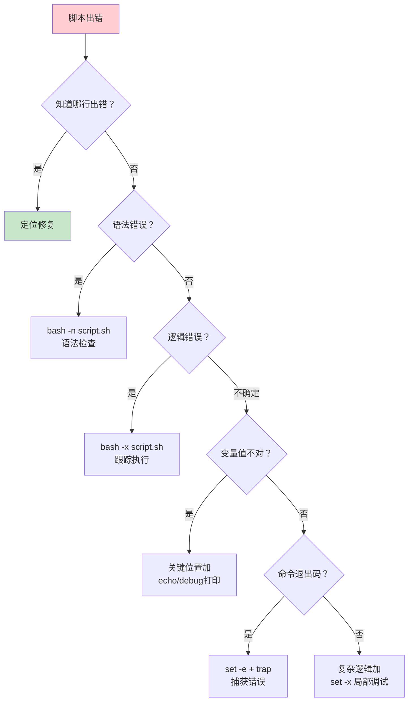

# Shell 脚本编程

Shell 脚本是 Linux 系统管理的灵魂——从一键部署到日志分析，从系统巡检到自动化运维，几乎所有重复性工作都可以用脚本解决。本文从 Bash 基础语法讲起，逐步深入条件判断、循环控制、函数封装、正则表达式、信号处理和调试技巧，最终通过四个实战案例帮你建立生产级脚本编写能力。

## 1. Bash 脚本基础

### 1.1 Shebang 与脚本执行

```bash
#!/bin/bash
# Shebang 指定解释器——必须是脚本第一行

# 执行方式：
# 1. 赋予执行权限直接运行
chmod +x script.sh
./script.sh

# 2. 用解释器执行（不需要执行权限）
bash script.sh

# 3. source 执行（在当前 shell 中执行，变量不消失）
source script.sh
. script.sh    # 等价写法
```

::: important 三种执行方式的区别
| 方式 | 子进程 | 变量作用域 | 适用场景 |
|------|--------|-----------|---------|
| `./script.sh` | 是 | 变量不传回当前 shell | 正常执行 |
| `bash script.sh` | 是 | 变量不传回当前 shell | 调试、指定解释器 |
| `source script.sh` | 否 | 变量在当前 shell 生效 | 加载函数/环境变量 |
:::

### 1.2 变量

```bash
# 普通变量（等号两侧不能有空格！）
name="Linux"
version=7

# 使用变量
echo $name
echo ${name}        # 推荐加大括号
echo "Hello ${name}"   # 双引号中可展开变量
echo 'Hello ${name}'   # 单引号中不展开

# 特殊变量
$0      # 脚本名
$1-$9   # 位置参数
${10}   # 第10个参数（需要大括号）
$#      # 参数个数
$@      # 所有参数（每个独立）
$*      # 所有参数（合为一个字符串）
$?      # 上一条命令的退出码
$$      # 当前进程 PID
$!      # 最近后台进程 PID
$_      # 上一条命令的最后一个参数

# 变量默认值
echo ${name:-"default"}       # 未设置则使用默认值，不赋值
echo ${name:="default"}       # 未设置则赋默认值
echo ${name:+"replacement"}   # 已设置则使用替代值
echo ${name:?"error msg"}     # 未设置则报错退出

# 字符串长度
echo ${#name}

# 子串切片
str="Hello World"
echo ${str:0:5}      # Hello（从0取5个）
echo ${str:6}         # World（从6取到末尾）

# 变量声明
local var="local"     # 函数内局部变量
declare -r PI=3.14    # 只读变量
declare -i num=42     # 整数变量
declare -a arr        # 普通数组
declare -A map        # 关联数组
declare -x ENV_VAR    # 导出为环境变量
declare -l lower="ABC"  # 转为小写
declare -u upper="abc"  # 转为大写
```

### 1.3 引号与转义

```bash
# 单引号：完全字面量，不展开变量和命令
echo 'Hello $name \n'     # 输出：Hello $name \n

# 双引号：展开变量和命令，但保护空格和特殊字符
echo "Hello $name"        # 输出：Hello Linux
echo "Path: $(pwd)"       # 展开命令替换
echo "Exit: \$?"          # 转义 $ 符号

# 反引号：命令替换（旧语法，不推荐）
echo `date`

# $()：命令替换（推荐，可嵌套）
echo "Today: $(date +%Y-%m-%d)"
echo "Kernel: $(uname -r)"
echo "Nested: $(echo $(hostname))"

# 转义字符
echo "Quote: \"  Dollar: \$  Backslash: \\"

# $'...' ANSI-C 引用（支持转义序列）
echo $'Line1\nLine2'      # 换行
echo $'Tab\there'          # 制表符
echo $'Ring\a'             # 响铃
echo $'\x41'               # 十六进制 A
echo $'\101'               # 八进制 A
```

::: tip 引号选择原则
- **不含变量**：用单引号（更快，无解析开销）
- **含变量/命令**：用双引号（防止分词和通配符展开）
- **经验法则**：变量替换两边加双引号 `"$var"`，避免空格和通配符问题
:::

### 1.4 算术运算

```bash
# $(( )) 算术展开
echo $((1 + 2))           # 3
echo $((10 / 3))          # 3（整数除法）
echo $((10 % 3))          # 1（取模）
echo $((2 ** 10))         # 1024（幂运算）
echo $((x = 5, y = 3, x * y))  # 逗号运算

# 自增/自减
((x++))
((x--))
((x += 5))
((x -= 3))
((x *= 2))

# let 命令
let x=1+2
let x++

# expr 命令（旧式，需转义特殊字符）
expr 1 + 2
expr 10 \* 3

# bc 浮点运算
echo "scale=2; 10/3" | bc    # 3.33
echo "sqrt(2)" | bc -l       # 1.41421356...
```

## 2. 条件判断

### 2.1 test 命令与 [ ]

```bash
# test 命令
test -f /etc/passwd && echo "exists"

# [ ] 等价于 test
[ -f /etc/passwd ] && echo "exists"

# 注意：[ ] 内部两侧必须有空格！
```

### 2.2 [[ ]] 增强条件

```bash
# [[ ]] 是 Bash 增强版，支持模式匹配和正则
# 1. 模式匹配（通配符，不需要引号）
[[ "$file" == *.log ]] && echo "log file"
[[ "$file" != *.tmp ]] && echo "not tmp"

# 2. 正则匹配
[[ "$ip" =~ ^[0-9]{1,3}\.[0-9]{1,3}\.[0-9]{1,3}\.[0-9]{1,3}$ ]]
if [[ $? -eq 0 ]]; then
    echo "Valid IP format"
fi

# 3. 逻辑运算（不需要转义）
[[ -n "$var" && "$var" != "null" ]]
[[ "$status" == "running" || "$status" == "ready" ]]

# 4. 字符串比较
[[ "$a" < "$b" ]]    # 字典序比较
[[ "$a" > "$b" ]]
```

::: important [ ] vs [[ ]] vs (( ))
| 语法 | 特点 | 适用场景 |
|------|------|---------|
| `[ ]` | POSIX 兼容，功能有限 | 可移植脚本 |
| `[[ ]]` | Bash 扩展，支持模式匹配和正则 | Bash 专用脚本（推荐） |
| `(( ))` | 算术条件判断 | 数值比较 |
:::

### 2.3 文件测试

```bash
[ -f file ]     # 是否为普通文件
[ -d file ]     # 是否为目录
[ -e file ]     # 是否存在
[ -r file ]     # 是否可读
[ -w file ]     # 是否可写
[ -x file ]     # 是否可执行
[ -s file ]     # 是否非空（大小 > 0）
[ -L file ]     # 是否为符号链接
[ -b file ]     # 是否为块设备
[ -c file ]     # 是否为字符设备
[ -S file ]     # 是否为 socket
[ -p file ]     # 是否为命名管道
file1 -nt file2 # file1 比 file2 新
file1 -ot file2 # file1 比 file2 旧
```

### 2.4 字符串测试

```bash
[ -z "$str" ]       # 字符串为空
[ -n "$str" ]       # 字符串非空
[ "$a" = "$b" ]     # 字符串相等（POSIX）
[ "$a" != "$b" ]    # 字符串不等
[[ "$a" == "$b" ]]  # 字符串相等（Bash）
```

### 2.5 数值比较

```bash
# [ ] / test 中使用
[ $a -eq $b ]   # 等于
[ $a -ne $b ]   # 不等于
[ $a -gt $b ]   # 大于
[ $a -ge $b ]   # 大于等于
[ $a -lt $b ]   # 小于
[ $a -le $b ]   # 小于等于

# (( )) 中使用数学符号
(( a == b ))
(( a != b ))
(( a > b ))
(( a >= b ))
(( a < b ))
(( a <= b ))
```

### 2.6 if/elif/else

```bash
# 基本 if
if [[ -f /etc/passwd ]]; then
    echo "Password file exists"
fi

# if-else
if (( $? == 0 )); then
    echo "Success"
else
    echo "Failed"
fi

# if-elif-else
if [[ $status == "running" ]]; then
    echo "Service is running"
elif [[ $status == "stopped" ]]; then
    echo "Service is stopped"
elif [[ $status == "failed" ]]; then
    echo "Service has failed"
else
    echo "Unknown status: $status"
fi

# 嵌套 if
if [[ -d "$dir" ]]; then
    if [[ -w "$dir" ]]; then
        echo "Directory exists and writable"
    else
        echo "Directory exists but not writable"
    fi
fi
```

### 2.7 case 语句

```bash
case "$action" in
    start)
        systemctl start "$service"
        echo "Started $service"
        ;;
    stop)
        systemctl stop "$service"
        echo "Stopped $service"
        ;;
    restart)
        systemctl restart "$service"
        echo "Restarted $service"
        ;;
    status)
        systemctl status "$service"
        ;;
    *)
        echo "Usage: $0 {start|stop|restart|status}"
        exit 1
        ;;
esac

# 模式匹配
case "$file" in
    *.tar.gz|*.tgz)  tar xzf "$file" ;;
    *.tar.bz2)        tar xjf "$file" ;;
    *.zip)            unzip "$file" ;;
    *.rar)            unrar x "$file" ;;
    *)                echo "Unsupported format" ;;
esac
```

## 3. 循环

### 3.1 for 循环

```bash
# 遍历列表
for i in 1 2 3 4 5; do
    echo "Number: $i"
done

# 遍历范围
for i in {1..10}; do
    echo "Number: $i"
done

# 带步长
for i in {0..100..5}; do
    echo "$i"
done

# C 风格 for
for ((i = 0; i < 10; i++)); do
    echo "Index: $i"
done

# 遍历文件
for file in /var/log/*.log; do
    echo "Processing: $file"
    wc -l "$file"
done

# 遍历命令输出
for user in $(cut -d: -f1 /etc/passwd); do
    echo "User: $user"
done

# 遍历数组
servers=(web1 web2 web3)
for server in "${servers[@]}"; do
    ssh "$server" "uptime"
done
```

### 3.2 while 循环

```bash
# 基本循环
count=0
while (( count < 10 )); do
    echo "Count: $count"
    ((count++))
done

# 读取文件
while IFS=: read -r user uid gid home shell; do
    echo "User: $user, Home: $home"
done < /etc/passwd

# 无限循环
while true; do
    echo "Running... Press Ctrl+C to stop"
    sleep 1
done

# 条件循环
while ! ping -c 1 8.8.8.8 &>/dev/null; do
    echo "Waiting for network..."
    sleep 5
done
echo "Network is up!"
```

### 3.3 until 循环

```bash
# until：条件为假时继续循环（与 while 相反）
until systemctl is-active mysql &>/dev/null; do
    echo "Waiting for MySQL..."
    sleep 2
done
echo "MySQL is ready!"
```

### 3.4 select 菜单

```bash
PS3="Please select an option: "
select opt in "Install" "Configure" "Start" "Quit"; do
    case "$opt" in
        Install)   echo "Installing...";;
        Configure) echo "Configuring...";;
        Start)     echo "Starting...";;
        Quit)      break;;
        *)         echo "Invalid option";;
    esac
done
```

### 3.5 break / continue

```bash
# break 跳出循环
for i in {1..10}; do
    if (( i == 5 )); then
        break    # 跳出整个循环
    fi
    echo "$i"
done
# 输出：1 2 3 4

# continue 跳过本次迭代
for i in {1..10}; do
    if (( i % 2 == 0 )); then
        continue   # 跳过偶数
    fi
    echo "$i"
done
# 输出：1 3 5 7 9

# break N 跳出 N 层循环
for i in {1..3}; do
    for j in {1..3}; do
        if (( i == 2 && j == 2 )); then
            break 2    # 跳出两层循环
        fi
        echo "i=$i j=$j"
    done
done
```

## 4. 函数与返回值

### 4.1 函数定义与调用

```bash
# 方式一
greet() {
    local name="$1"
    echo "Hello, $name!"
}

# 方式二
function greet() {
    local name="$1"
    echo "Hello, $name!"
}

# 调用
greet "Linux"
```

### 4.2 返回值

```bash
# 方式一：echo 输出（推荐，可捕获到变量）
get_os() {
    if [[ -f /etc/os-release ]]; then
        source /etc/os-release
        echo "$ID"
    else
        echo "unknown"
    fi
}

os=$(get_os)
echo "OS: $os"

# 方式二：return 退出码（0-255）
is_root() {
    if (( EUID == 0 )); then
        return 0
    else
        return 1
    fi
}

if is_root; then
    echo "Running as root"
else
    echo "Not root"
fi

# 方式三：通过全局变量（不推荐，但有时必要）
result=""
compute() {
    result=$(( $1 * $2 ))
}
compute 6 7
echo "Result: $result"
```

### 4.3 局部变量

```bash
# local 声明局部变量（仅在函数内可见）
counter() {
    local count=0    # 局部变量
    ((count++))
    echo "$count"
}

count=100           # 全局变量
counter             # 输出 1
echo "$count"       # 输出 100（全局变量不受影响）
```

::: warning 函数内务必使用 local
函数内不使用 `local` 的变量会污染全局作用域，导致难以追踪的 bug。经验法则：**函数内所有变量都加 `local`**，除非你确实需要修改全局变量。
:::

## 5. 数组与关联数组

### 5.1 普通数组

```bash
# 定义数组
arr=(one two three four five)

# 访问元素（下标从 0 开始）
echo "${arr[0]}"     # one
echo "${arr[2]}"     # three

# 所有元素
echo "${arr[@]}"
echo "${arr[*]}"

# 数组长度
echo "${#arr[@]}"    # 5
echo "${#arr}"       # 第一个元素的字符长度

# 添加元素
arr+=(six seven)

# 删除元素
unset 'arr[2]'       # 删除第三个元素

# 遍历数组
for item in "${arr[@]}"; do
    echo "$item"
done

# 遍历下标
for i in "${!arr[@]}"; do
    echo "arr[$i] = ${arr[$i]}"
done

# 切片
echo "${arr[@]:1:3}"    # 从下标1取3个元素
```

### 5.2 关联数组

```bash
# 声明关联数组
declare -A config

# 赋值
config=(
    [host]="192.168.1.100"
    [port]=3306
    [user]="admin"
    [db]="production"
)

# 访问
echo "${config[host]}"    # 192.168.1.100
echo "${config[port]}"    # 3306

# 所有键
echo "${!config[@]}"      # host port user db

# 所有值
echo "${config[@]}"

# 遍历
for key in "${!config[@]}"; do
    echo "$key = ${config[$key]}"
done

# 检查键是否存在
if [[ -v config[host] ]]; then
    echo "Host is set"
fi
```

## 6. 字符串处理

```bash
str="Hello World, Hello Linux"

# 长度
echo ${#str}                  # 24

# 子串
echo ${str:0:5}               # Hello
echo ${str:7}                  # World, Hello Linux
echo ${str: -5}                # inux（负索引从末尾取）

# 删除匹配（从左/右 shortest/longest）
file="/var/log/nginx/access.log"
echo ${file#*/}        # var/log/nginx/access.log（删除最短左匹配）
echo ${file##*/}       # access.log（删除最长左匹配）
echo ${file%/*}        # /var/log/nginx（删除最短右匹配）
echo ${file%%/*}       # （空，删除最长右匹配）

# 替换
echo ${str/Hello/Hi}           # Hi World, Hello Linux（替换第一个）
echo ${str//Hello/Hi}          # Hi World, Hi Linux（替换全部）

# 大小写转换
echo ${str^^}                  # HELLO WORLD, HELLO LINUX
echo ${str,,}                  # hello world, hello linux

# 字符串分割
IFS=',' read -ra parts <<< "a,b,c,d"
for part in "${parts[@]}"; do
    echo "$part"
done
```

## 7. here document 与 here string

### 7.1 Here Document

```bash
# 基本用法
cat << EOF
This is a here document.
Variables are expanded: $HOME
Commands work: $(date)
EOF

# 禁止变量展开（引号包围标记）
cat << 'EOF'
$HOME and $(command) are not expanded here.
EOF

# 去除前导 Tab（<<-）
cat <<- EOF
		Indented lines will have leading tabs stripped.
		But spaces are preserved.
	EOF

# 写入文件
cat << EOF > /etc/myapp/config.yaml
server:
  host: ${HOST}
  port: ${PORT}
EOF

# 传递给命令
mysql -u root -p << EOF
CREATE DATABASE IF NOT EXISTS myapp;
USE myapp;
CREATE TABLE users (id INT PRIMARY KEY, name VARCHAR(100));
EOF
```

### 7.2 Here String

```bash
# <<< 将字符串作为标准输入
grep "pattern" <<< "search in this string"

# 配合 read 使用
read -r first last <<< "John Doe"
echo "First: $first, Last: $last"

# 配合 bc
bc <<< "scale=2; 10/3"

# 配合 awk
awk '{print $2}' <<< "col1 col2 col3"
```

## 8. 正则表达式

### 8.1 基本正则（BRE）与扩展正则（ERE）

| 元字符 | BRE | ERE | 说明 |
|--------|-----|-----|------|
| `.` | Y | Y | 匹配任意单个字符 |
| `*` | Y | Y | 前一字符零次或多次 |
| `^` | Y | Y | 行首 |
| `$` | Y | Y | 行尾 |
| `[abc]` | Y | Y | 字符类 |
| `[^abc]` | Y | Y | 取反字符类 |
| `\+` / `+` | 转义 | 直接 | 一次或多次 |
| `\?` / `?` | 转义 | 直接 | 零次或一次 |
| `\{n,m\}` / `{n,m}` | 转义 | 直接 | 重复次数 |
| `\|` / `|` | 转义 | 直接 | 或 |
| `\(` `\)` / `(` `)` | 转义 | 直接 | 分组 |

```bash
# grep 使用 ERE（-E 或 egrep）
grep -E "error|warning|critical" /var/log/syslog
grep -E "[0-9]{1,3}\.[0-9]{1,3}\.[0-9]{1,3}\.[0-9]{1,3}" access.log
grep -E "^2024-[0-9]{2}-[0-9]{2}" logfile

# sed 使用 ERE（-E 或 -r）
echo "abc123" | sed -E 's/[0-9]+/NUM/g'     # abcNUM

# awk 默认使用 ERE
echo "test@email.com" | awk '/[a-z]+@[a-z]+\.[a-z]+/{print "valid"}'
```

### 8.2 常用正则模式

```bash
# IP 地址
^[0-9]{1,3}\.[0-9]{1,3}\.[0-9]{1,3}\.[0-9]{1,3}$

# 邮箱
^[a-zA-Z0-9._%+-]+@[a-zA-Z0-9.-]+\.[a-zA-Z]{2,}$

# URL
https?://[a-zA-Z0-9.-]+[a-zA-Z0-9./_-]*

# 日期（YYYY-MM-DD）
^[0-9]{4}-(0[1-9]|1[0-2])-(0[1-9]|[12][0-9]|3[01])$

# 手机号（中国大陆）
^1[3-9][0-9]{9}$

# IPv4 精确匹配（每段 0-255）
^((25[0-5]|2[0-4][0-9]|[01]?[0-9][0-9]?)\.){3}(25[0-5]|2[0-4][0-9]|[01]?[0-9][0-9]?)$
```

### 8.3 Bash 内建正则

```bash
# [[ =~ ]] 支持 ERE
validate_ip() {
    local ip="$1"
    if [[ $ip =~ ^[0-9]{1,3}\.[0-9]{1,3}\.[0-9]{1,3}\.[0-9]{1,3}$ ]]; then
        return 0
    else
        return 1
    fi
}

# 提取匹配组（BASH_REMATCH）
parse_date() {
    local str="$1"
    if [[ $str =~ ([0-9]{4})-([0-9]{2})-([0-9]{2}) ]]; then
        echo "Year: ${BASH_REMATCH[1]}"
        echo "Month: ${BASH_REMATCH[2]}"
        echo "Day: ${BASH_REMATCH[3]}"
    fi
}
parse_date "Today is 2024-06-15"
```

## 9. 进程替换与命令替换

### 9.1 命令替换 $()

```bash
# 基本用法
files=$(ls /etc)
today=$(date +%Y%m%d)
lines=$(wc -l < /var/log/syslog)

# 嵌套
kernel_ver=$(uname -r)
major=$(echo "$kernel_ver" | cut -d. -f1)

# 在循环中使用
while read -r line; do
    echo "Line: $line"
done < <(grep "error" /var/log/syslog)
```

### 9.2 进程替换 <() 和 >()

进程替换将命令输出关联到一个临时文件描述符：

```bash
# 比较两个命令的输出
diff <(ls /dir1) <(ls /dir2)

# 合并多个来源
cat <(echo "Header") <(sort data.txt) > sorted_with_header.txt

# while read 从进程替换读取
while read -r line; do
    echo "$line"
done < <(grep "ERROR" /var/log/app.log)

# 写入进程替换
tee >(gzip > output.gz) >(wc -l > count.txt) > output.txt
```

::: tip 进程替换 vs 管道
- **管道** `cmd1 | cmd2`：cmd2 在子 shell 中运行，变量不传回
- **进程替换** `while read < <(cmd1)`：while 在当前 shell 中运行，变量可传回
- 需要保留变量时，用进程替换
:::

## 10. 信号处理（trap）

### 10.1 常见信号

| 信号 | 编号 | 说明 | 可捕获 |
|------|------|------|--------|
| SIGHUP | 1 | 终端关闭 | 是 |
| SIGINT | 2 | Ctrl+C | 是 |
| SIGQUIT | 3 | Ctrl+\ | 是 |
| SIGKILL | 9 | 强制终止 | 否 |
| SIGTERM | 15 | 优雅终止 | 是 |
| SIGUSR1 | 10 | 用户自定义 | 是 |
| SIGUSR2 | 12 | 用户自定义 | 是 |
| SIGSTOP | 19 | 暂停 | 否 |

### 10.2 trap 捕获信号

```bash
#!/bin/bash
# 清理临时文件的信号处理

tmpdir=$(mktemp -d)
logfile="$tmpdir/output.log"

cleanup() {
    echo "Cleaning up..."
    rm -rf "$tmpdir"
    echo "Done."
    exit 0
}

# 捕获信号
trap cleanup EXIT        # 脚本退出时（无论何种原因）
trap cleanup INT         # Ctrl+C
trap cleanup TERM        # kill 命令
trap cleanup HUP         # 终端关闭

# 也可以合写
trap cleanup EXIT INT TERM HUP

# 忽略信号
trap '' INT              # 忽略 Ctrl+C

# 恢复默认处理
trap - INT               # 恢复 Ctrl+C 的默认行为
```

### 10.3 实战：带信号处理的后台任务

```bash
#!/bin/bash
# 带信号处理的后台备份脚本

PIDFILE="/var/run/backup.pid"
LOCKFILE="/var/lock/backup.lock"

cleanup() {
    echo "Received signal, stopping gracefully..."
    rm -f "$PIDFILE" "$LOCKFILE"
    exit 0
}

trap cleanup INT TERM HUP

# 单实例锁
if [ -f "$PIDFILE" ]; then
    old_pid=$(cat "$PIDFILE")
    if kill -0 "$old_pid" 2>/dev/null; then
        echo "Backup already running (PID: $old_pid)"
        exit 1
    fi
fi

echo $$ > "$PIDFILE"

# 备份逻辑
echo "Starting backup..."
for i in {1..100}; do
    echo "Progress: $i%"
    sleep 1
done

echo "Backup completed."
rm -f "$PIDFILE"
```

## 11. 调试技巧

### 11.1 调试方法概览



### 11.2 set 选项

```bash
#!/bin/bash
set -euo pipefail

# -e: 命令失败立即退出（最常用）
# -u: 使用未定义变量报错
# -o pipefail: 管道中任一命令失败则整个管道失败
# -x: 打印每条命令（调试用）
# -n: 只检查语法不执行

# 组合使用
set -euo pipefail    # 生产环境必备三件套

# 局部调试
set -x               # 开启跟踪
# ... 需要调试的代码 ...
set +x               # 关闭跟踪
```

::: important set -e 的陷阱
`set -e` 在以下情况下不会退出：
1. 命令在 `if`/`while`/`until` 条件中
2. 命令跟在 `&&` 或 `||` 后
3. 命令在 `||` 左侧的 `command || true` 中

```bash
set -e
false && echo "never"    # 不会退出！false 是 && 的一部分
false || true             # 不会退出！整个表达式为 true
if false; then ... fi     # 不会退出！false 在条件中
```

最佳实践：对关键命令显式检查退出码，不要完全依赖 `set -e`。
:::

### 11.3 调试工具

```bash
# 1. shellcheck 静态分析（强烈推荐！）
shellcheck script.sh

# 2. bashdb 调试器
bashdb script.sh

# 3. 使用 trap DEBUG 逐行跟踪
trap 'echo "LINE: $LINENO - $BASH_COMMAND"' DEBUG

# 4. 使用 ERR trap 捕获错误行号
trap 'echo "Error at line $LINENO: $BASH_COMMAND"' ERR

# 5. 使用 BASH_XTRACEFD 输出到文件
exec 3>debug.log
BASH_XTRACEFD=3
set -x

# 6. 函数调用栈
backtrace() {
    local frame=0
    while caller $frame; do
        ((frame++))
    done
}
trap backtrace ERR
```

### 11.4 完整调试模板

```bash
#!/bin/bash
set -euo pipefail

# 调试开关（通过环境变量控制）
DEBUG="${DEBUG:-0}"

debug() {
    if (( DEBUG )); then
        echo "[DEBUG] $*" >&2
    fi
}

error() {
    echo "[ERROR] $*" >&2
}

die() {
    error "$@"
    exit 1
}

# 错误处理
trap 'error "Script failed at line $LINENO (command: $BASH_COMMAND)"' ERR

# 使用
debug "Starting process..."
result=$(some_command) || die "Command failed: some_command"
debug "Result: $result"
```

## 12. 脚本模板

### 12.1 生产级脚本模板

```bash
#!/usr/bin/env bash
# ============================================================
# 脚本名称: my-script.sh
# 描述: 一句话描述脚本功能
# 作者: author@example.com
# 创建日期: 2024-01-01
# 用法: ./my-script.sh [选项] <参数>
# ============================================================

set -euo pipefail

# ==================== 常量 ====================
VERSION="1.0.0"
SCRIPT_NAME="$(basename "$0")"
SCRIPT_DIR="$(cd "$(dirname "$0")" && pwd)"
LOG_FILE="/var/log/${SCRIPT_NAME}.log"

# ==================== 颜色 ====================
RED='\033[0;31m'
GREEN='\033[0;32m'
YELLOW='\033[1;33m'
BLUE='\033[0;34m'
NC='\033[0m'

# ==================== 函数 ====================
usage() {
    cat << EOF
Usage: $SCRIPT_NAME [OPTIONS] <argument>

Options:
    -h, --help          显示帮助信息
    -v, --version       显示版本号
    -d, --debug         启用调试模式
    -c, --config FILE   指定配置文件
    -n, --dry-run       只显示不执行

Examples:
    $SCRIPT_NAME -c /etc/myapp.conf deploy
    $SCRIPT_NAME --debug status
EOF
    exit 0
}

log() {
    local level="$1"; shift
    local msg="$*"
    local timestamp
    timestamp=$(date '+%Y-%m-%d %H:%M:%S')
    echo -e "[${timestamp}] [${level}] ${msg}" | tee -a "$LOG_FILE"
}

info()  { log "INFO"  "${GREEN}$*${NC}"; }
warn()  { log "WARN"  "${YELLOW}$*${NC}"; }
error() { log "ERROR" "${RED}$*${NC}"; }
fatal() { log "FATAL" "${RED}$*${NC}"; exit 1; }

check_root() {
    if (( EUID != 0 )); then
        fatal "This script must be run as root"
    fi
}

check_command() {
    local cmd="$1"
    if ! command -v "$cmd" &>/dev/null; then
        fatal "Required command not found: $cmd"
    fi
}

cleanup() {
    info "Cleaning up..."
    # 清理临时文件等
}

# ==================== 信号处理 ====================
trap cleanup EXIT INT TERM

# ==================== 参数解析 ====================
DEBUG=0
CONFIG=""
DRY_RUN=0
ACTION=""

while [[ $# -gt 0 ]]; do
    case "$1" in
        -h|--help)     usage ;;
        -v|--version)  echo "$SCRIPT_NAME $VERSION"; exit 0 ;;
        -d|--debug)    DEBUG=1; set -x ;;
        -c|--config)   CONFIG="$2"; shift 2 ;;
        -n|--dry-run)  DRY_RUN=1 ;;
        -*)            fatal "Unknown option: $1" ;;
        *)             ACTION="$1"; shift ;;
    esac
done

[[ -z "$ACTION" ]] && fatal "No action specified. Use --help for usage."

# ==================== 主逻辑 ====================
main() {
    info "Starting $SCRIPT_NAME v$VERSION"
    info "Action: $ACTION"

    case "$ACTION" in
        deploy)
            info "Deploying..."
            ;;
        status)
            info "Checking status..."
            ;;
        *)
            fatal "Unknown action: $ACTION"
            ;;
    esac

    info "Completed."
}

main "$@"
```

## 13. 实战案例

### 13.1 批量部署脚本

```bash
#!/usr/bin/env bash
# ============================================================
# 批量部署脚本：在多台服务器上并行部署应用
# ============================================================

set -euo pipefail

SERVERS=(web01 web02 web03 web04)
APP_NAME="myapp"
APP_VERSION="${1:?Usage: $0 <version>}"
DEPLOY_DIR="/opt/$APP_NAME"
BACKUP_DIR="/opt/backups/$APP_NAME"
PARALLEL=4

deploy_one() {
    local server="$1"
    local version="$2"

    echo "[$server] Deploying $APP_NAME v$version..."

    # 1. 备份当前版本
    ssh "$server" "if [ -d $DEPLOY_DIR ]; then \
        sudo cp -r $DEPLOY_DIR ${BACKUP_DIR}/$(date +%Y%m%d%H%M%S); fi"

    # 2. 下载新版本
    ssh "$server" "sudo mkdir -p $DEPLOY_DIR && \
        sudo curl -sL https://repo.example.com/${APP_NAME}/${version}.tar.gz | \
        sudo tar xz -C $DEPLOY_DIR --strip-components=1"

    # 3. 健康检查
    local retries=10
    while (( retries > 0 )); do
        if ssh "$server" "curl -sf http://localhost:8080/health" &>/dev/null; then
            echo "[$server] Deployment successful!"
            return 0
        fi
        ((retries--))
        sleep 3
    done

    echo "[$server] Health check failed! Rolling back..."
    ssh "$server" "sudo systemctl restart $APP_NAME" || true
    return 1
}

# 并行部署
echo "Deploying $APP_NAME v$APP_VERSION to ${#SERVERS[@]} servers..."
pids=()
for server in "${SERVERS[@]}"; do
    deploy_one "$server" "$APP_VERSION" &
    pids+=($!)

    # 控制并行度
    if (( ${#pids[@]} >= PARALLEL )); then
        wait "${pids[0]}" || true
        pids=("${pids[@]:1}")
    fi
done

# 等待所有任务完成
failed=0
for pid in "${pids[@]}"; do
    if ! wait "$pid"; then
        ((failed++))
    fi
done

if (( failed > 0 )); then
    echo "ERROR: $failed server(s) failed to deploy!"
    exit 1
else
    echo "All servers deployed successfully!"
fi
```

### 13.2 日志分析脚本

```bash
#!/usr/bin/env bash
# ============================================================
# Nginx 日志分析脚本
# ============================================================

set -euo pipefail

LOG_FILE="${1:?Usage: $0 <nginx_access_log>}"

echo "=============================="
echo " Nginx 日志分析报告"
echo " 日志文件: $LOG_FILE"
echo " 分析时间: $(date)"
echo "=============================="

# 1. 总请求数
total=$(wc -l < "$LOG_FILE")
echo -e "\n总请求数: $total"

# 2. 时间范围
first_time=$(head -1 "$LOG_FILE" | awk -F'[' '{print $2}' | cut -d']' -f1)
last_time=$(tail -1 "$LOG_FILE" | awk -F'[' '{print $2}' | cut -d']' -f1)
echo "时间范围: $first_time → $last_time"

# 3. 状态码分布
echo -e "\n--- 状态码分布 ---"
awk '{print $9}' "$LOG_FILE" | sort | uniq -c | sort -rn | head -10

# 4. Top 20 访问 IP
echo -e "\n--- Top 20 访问 IP ---"
awk '{print $1}' "$LOG_FILE" | sort | uniq -c | sort -rn | head -20

# 5. Top 20 访问 URL
echo -e "\n--- Top 20 访问 URL ---"
awk '{print $7}' "$LOG_FILE" | sort | uniq -c | sort -rn | head -20

# 6. 4xx/5xx 错误请求
echo -e "\n--- 4xx 错误 Top 10 URL ---"
awk '$9 ~ /^4/ {print $7}' "$LOG_FILE" | sort | uniq -c | sort -rn | head -10

echo -e "\n--- 5xx 错误 Top 10 URL ---"
awk '$9 ~ /^5/ {print $7}' "$LOG_FILE" | sort | uniq -c | sort -rn | head -10

# 7. 每小时请求数
echo -e "\n--- 每小时请求分布 ---"
awk -F'[' '{print $2}' "$LOG_FILE" | cut -d: -f2 | sort | uniq -c | sort -k2n

# 8. 请求方法分布
echo -e "\n--- 请求方法分布 ---"
awk '{print $6}' "$LOG_FILE" | tr -d '"' | sort | uniq -c | sort -rn

# 9. 响应时间统计（如果日志中包含 $request_time）
echo -e "\n--- 平均响应时间 Top 10 URL ---"
awk '{url=$7; time=$NF; gsub(/"/, "", time); sum[url]+=time; count[url]++}
END {for (u in sum) printf "%8.3f %s %s\n", sum[u]/count[u], count[u], u}' \
    "$LOG_FILE" | sort -rn | head -10

echo -e "\n=============================="
echo " 分析完成"
echo "=============================="
```

### 13.3 系统巡检脚本

```bash
#!/usr/bin/env bash
# ============================================================
# 系统巡检脚本
# ============================================================

set -euo pipefail

REPORT="/tmp/system-check-$(date +%Y%m%d).txt"

{
echo "=============================="
echo " 系统巡检报告"
echo " $(date '+%Y-%m-%d %H:%M:%S')"
echo "=============================="

# 基本系统信息
echo -e "\n--- 系统信息 ---"
echo "主机名: $(hostname)"
echo "操作系统: $(cat /etc/os-release | grep PRETTY_NAME | cut -d'"' -f2)"
echo "内核版本: $(uname -r)"
echo "运行时间: $(uptime -p)"
echo "架构: $(uname -m)"

# CPU 信息
echo -e "\n--- CPU 信息 ---"
echo "CPU 型号: $(grep 'model name' /proc/cpuinfo | head -1 | cut -d: -f2 | xargs)"
echo "CPU 核数: $(nproc)"
echo "负载均值: $(cat /proc/loadavg | awk '{print $1, $2, $3}')"

# 内存
echo -e "\n--- 内存使用 ---"
free -h

# 磁盘
echo -e "\n--- 磁盘使用 ---"
df -h | grep -E '^/dev|^Filesystem'

# 磁盘 inode
echo -e "\n--- Inode 使用 ---"
df -i | grep -E '^/dev|^Filesystem'

# 网络连接
echo -e "\n--- 网络连接统计 ---"
ss -s

# 大文件查找
echo -e "\n--- 超过 100M 的大文件（前10） ---"
find / -xdev -type f -size +100M -exec ls -lh {} \; 2>/dev/null | \
    awk '{print $5, $9}' | sort -rh | head -10

# 失败服务
echo -e "\n--- 失败的服务 ---"
systemctl --failed --type=service --no-legend || echo "无失败服务"

# 最近登录
echo -e "\n--- 最近5次登录 ---"
last -5 -w

# 安全事件
echo -e "\n--- 最近的认证失败 ---"
journalctl -u sshd --since "24 hours ago" | grep "Failed password" | \
    awk '{print $(NF-3)}' | sort | uniq -c | sort -rn | head -5

# 定时任务
echo -e "\n--- 系统定时任务 ---"
ls /etc/cron.d/ 2>/dev/null || echo "无"
crontab -l 2>/dev/null || echo "无用户 crontab"

echo -e "\n=============================="
echo " 巡检完成"
echo "=============================="
} | tee "$REPORT"

echo "Report saved to: $REPORT"
```

### 13.4 备份脚本

```bash
#!/usr/bin/env bash
# ============================================================
# 数据库备份脚本（支持本地+远程备份、自动清理、通知）
# ============================================================

set -euo pipefail

# ==================== 配置 ====================
DB_HOST="localhost"
DB_PORT=3306
DB_USER="backup"
DB_PASS=""                    # 从环境变量或配置文件读取
BACKUP_DIR="/data/backups/mysql"
RETENTION_DAYS=30
REMOTE_HOST="backup-server"
REMOTE_DIR="/backup/mysql"
NOTIFY_EMAIL="admin@example.com"

# ==================== 初始化 ====================
TIMESTAMP=$(date +%Y%m%d_%H%M%S)
DATE=$(date +%Y%m%d)
LOG_FILE="/var/log/mysql-backup-${TIMESTAMP}.log"

log() { echo "[$(date '+%Y-%m-%d %H:%M:%S')] $*" | tee -a "$LOG_FILE"; }

# 从配置文件读取密码
if [[ -f /etc/mysql-backup.cnf ]]; then
    DB_PASS=$(grep password /etc/mysql-backup.cnf | cut -d= -f2 | tr -d ' ')
fi

# ==================== 备份 ====================
backup_database() {
    local db="$1"
    local dump_file="${BACKUP_DIR}/${db}_${TIMESTAMP}.sql.gz"

    log "Backing up database: $db"

    if mysqldump -h "$DB_HOST" -P "$DB_PORT" -u "$DB_USER" -p"$DB_PASS" \
        --single-transaction --routines --triggers --events \
        "$db" | gzip > "$dump_file"; then
        local size
        size=$(du -h "$dump_file" | cut -f1)
        log "  Backup OK: $dump_file ($size)"
    else
        log "  Backup FAILED: $db"
        return 1
    fi
}

# ==================== 清理旧备份 ====================
cleanup_old_backups() {
    log "Cleaning up backups older than $RETENTION_DAYS days..."
    find "$BACKUP_DIR" -name "*.sql.gz" -mtime +$RETENTION_DAYS -delete -print | \
        while read -r f; do log "  Deleted: $f"; done
}

# ==================== 远程同步 ====================
sync_remote() {
    log "Syncing to remote: $REMOTE_HOST:$REMOTE_DIR"
    if rsync -az --progress "$BACKUP_DIR/" "${REMOTE_HOST}:${REMOTE_DIR}/"; then
        log "Remote sync OK"
    else
        log "Remote sync FAILED"
        return 1
    fi
}

# ==================== 通知 ====================
notify() {
    local subject="$1"
    local body="$2"
    echo "$body" | mail -s "$subject" "$NOTIFY_EMAIL" 2>/dev/null || true
}

# ==================== 主流程 ====================
main() {
    log "===== MySQL Backup Start ====="
    log "Host: $DB_HOST, Directory: $BACKUP_DIR"

    mkdir -p "$BACKUP_DIR"

    # 获取数据库列表
    databases=$(mysql -h "$DB_HOST" -P "$DB_PORT" -u "$DB_USER" -p"$DB_PASS" \
        -e "SHOW DATABASES;" -s --skip-column-names | grep -Ev '^(information_schema|performance_schema|sys)$')

    failed=0
    for db in $databases; do
        if ! backup_database "$db"; then
            ((failed++))
        fi
    done

    # 清理
    cleanup_old_backups

    # 远程同步
    if ! sync_remote; then
        ((failed++))
    fi

    # 汇总
    total=$(echo "$databases" | wc -w)
    log "===== Backup Complete: $((total - failed))/$total succeeded ====="

    if (( failed > 0 )); then
        notify "[ALERT] MySQL Backup Failed ($failed databases)" \
            "$(cat "$LOG_FILE")"
        exit 1
    else
        notify "[OK] MySQL Backup Succeeded ($total databases)" \
            "$(tail -5 "$LOG_FILE")"
    fi
}

main "$@"
```

## 14. 安全编码规范

```bash
# 1. 永远给变量加双引号
echo "$var"              # 正确
echo $var                # 错误（空格分词、通配符展开）

# 2. 避免命令注入
# 危险！用户输入可能包含 ; rm -rf /
eval "$user_input"       # 错误

# 安全：使用数组
cmd=(mysql -u "$user" -p"$pass" -e "SELECT 1")
"${cmd[@]}"

# 3. 安全的临时文件
tmpfile=$(mktemp)        # 正确：唯一文件名
tmpdir=$(mktemp -d)      # 正确：唯一目录

# 错误：可预测的文件名，容易被符号链接攻击
tmpfile="/tmp/myapp.$$"

# 4. 检查命令是否存在
if ! command -v mysql &>/dev/null; then
    echo "mysql not found" >&2
    exit 1
fi

# 5. 不要解析 ls 的输出
# 错误
for f in $(ls); do ... done

# 正确
for f in *; do ... done

# 6. 使用 read -r 防止反斜杠转义
echo "a\b" | read -r var    # 正确
echo "a\b" | read var       # 反斜杠被转义

# 7. 使用 [[ ]] 而不是 [ ]
# [[ ]] 不会对变量做分词，更安全
[[ -z "$var" ]]   # 正确
[ -z $var ]       # 变量为空时报错

# 8. 密码/密钥不要硬编码
# 使用环境变量或配置文件
db_pass="${DB_PASSWORD:?DB_PASSWORD not set}"

# 9. 设置安全的 umask
umask 077    # 新文件 600，新目录 700

# 10. 限制路径
PATH="/usr/local/bin:/usr/bin:/bin"
```

::: important Shell 脚本安全清单
1. **变量加双引号**：`"$var"` 而非 `$var`
2. **使用 `set -euo pipefail`**：失败即停、未定义变量报错
3. **避免 `eval`**：几乎总有更安全的替代方案
4. **用 `mktemp` 创建临时文件**：防止符号链接攻击
5. **不解析 `ls` 输出**：用 glob 模式
6. **密码不硬编码**：用环境变量或加密配置
7. **用 `shellcheck` 检查**：静态分析捕获常见错误
:::

## 参考资源

- 《Linux 命令行与 Shell 脚本编程大全》—— Richard Blum
- 《Advanced Bash-Scripting Guide》—— Mendel Cooper
- [Bash 官方手册](https://www.gnu.org/software/bash/manual/)
- [ShellCheck](https://www.shellcheck.net/)
- [Google Shell Style Guide](https://google.github.io/styleguide/shellguide.html)
