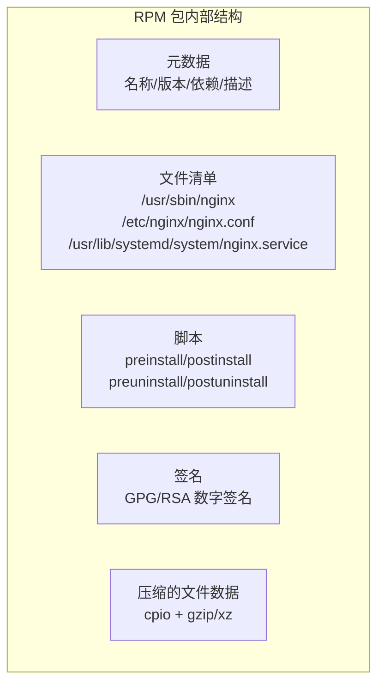
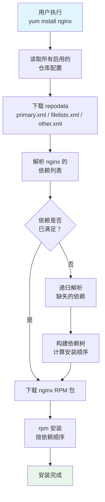
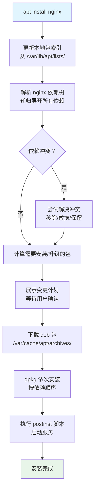
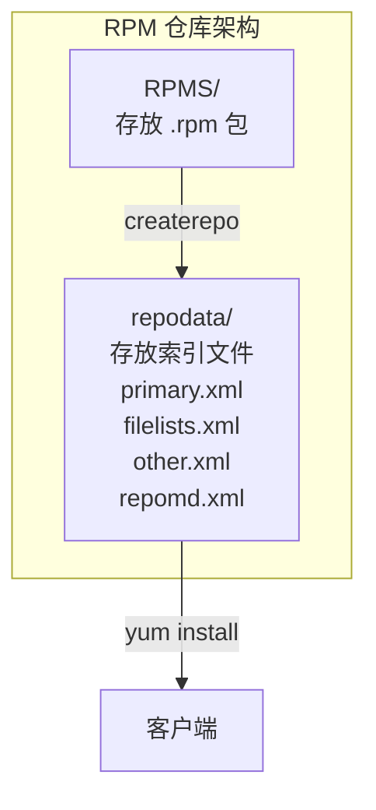
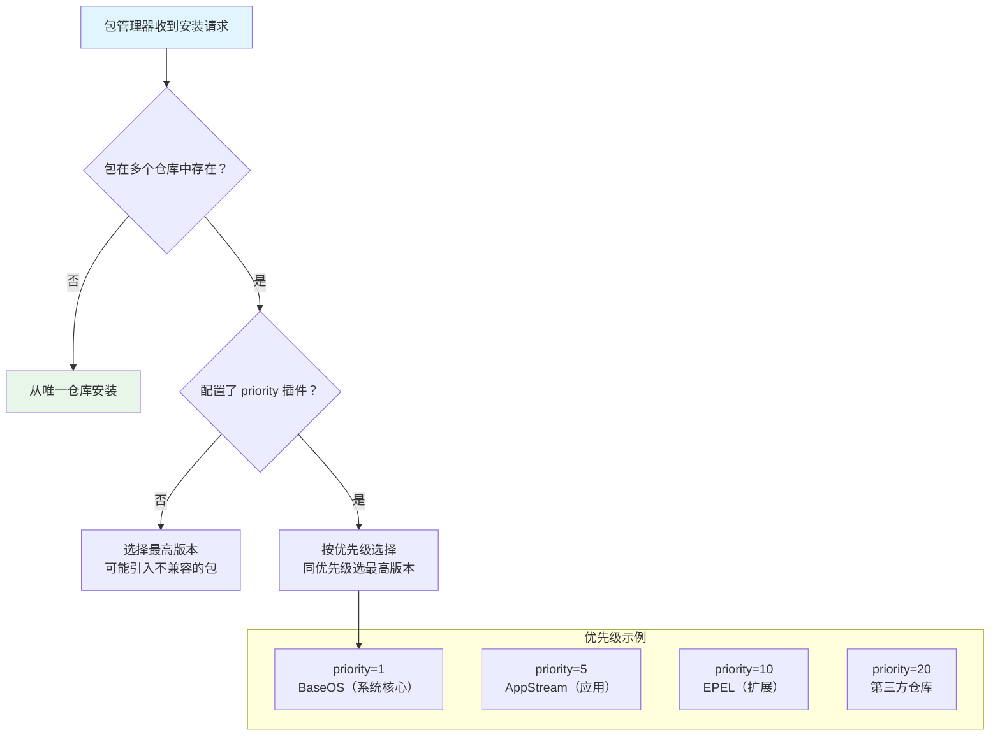

# 软件包管理

软件包管理是 Linux 系统运维的基石——从安装一个工具到搭建整个技术栈，从解决依赖地狱到构建私有仓库，都离不开包管理器的深度理解。本文从 RPM/APT 两大体系讲起，覆盖源码编译、容器化包、仓库搭建和离线安装方案，帮你建立"装得了、管得住、出问题查得出"的包管理能力。

## 1. RPM 包管理

### 1.1 RPM 包结构

RPM（Red Hat Package Manager）是 Red Hat 系发行版的包格式，文件名遵循规范：

```
name-version-release.architecture.rpm
例: nginx-1.24.0-1.el9.x86_64.rpm
    │     │    │  │   │
    │     │    │  │   └── 架构（x86_64/aarch64/noarch）
    │     │    │  └────── 发行版标记（el9 = Enterprise Linux 9）
    │     │    └───────── 发布号（第1次打包）
    │     └────────────── 上游版本号
    └──────────────────── 软件名称
```



### 1.2 rpm 查询

```bash
# 查询已安装的包
rpm -qa                           # 所有已安装包
rpm -qa | grep nginx              # 搜索特定包
rpm -q nginx                      # 查询指定包是否安装
rpm -q nginx-1.24.0-1.el9         # 查询特定版本

# 查询包信息
rpm -qi nginx                     # 包详细信息
rpm -ql nginx                     # 包安装的文件列表
rpm -qc nginx                     # 包的配置文件
rpm -qd nginx                     # 包的文档文件
rpm -q --scripts nginx            # 包的安装/卸载脚本

# 查询文件归属
rpm -qf /usr/sbin/nginx           # 该文件属于哪个包
rpm -qf /etc/nginx/nginx.conf

# 查询依赖
rpm -qR nginx                     # 包的依赖列表
rpm -q --whatrequires nginx       # 谁依赖了这个包
rpm -q --provides nginx           # 包提供了什么能力

# 查询未安装的包
rpm -qip nginx-1.24.0-1.el9.x86_64.rpm    # 包信息
rpm -qlp nginx-1.24.0-1.el9.x86_64.rpm    # 文件列表
rpm -qRp nginx-1.24.0-1.el9.x86_64.rpm    # 依赖
```

### 1.3 rpm 安装与卸载

```bash
# 安装
rpm -ivh nginx-1.24.0-1.el9.x86_64.rpm
# -i: install  -v: verbose  -h: hash进度条

# 升级
rpm -Uvh nginx-1.25.0-1.el9.x86_64.rpm
# -U: 升级（已安装则升级，未安装则安装）

# 刷新
rpm -Fvh nginx-1.25.0-1.el9.x86_64.rpm
# -F: 仅升级已安装的包，未安装则跳过

# 卸载
rpm -e nginx
rpm -e --nodeps nginx             # 忽略依赖强制卸载（危险！）

# 强制重装
rpm -ivh --force nginx-1.24.0-1.el9.x86_64.rpm

# 仅测试不实际安装
rpm -ivh --test nginx-1.24.0-1.el9.x86_64.rpm
```

### 1.4 rpm 验证与签名

```bash
# 验证包完整性（文件是否被修改）
rpm -V nginx                      # 验证已安装包
rpm -Vp nginx-1.24.0.rpm          # 验证未安装包
rpm -Va                           # 验证所有包

# 验证输出解读
# S.5....T.  c /etc/nginx/nginx.conf
# ││    ││   │ └── 文件路径
# ││    ││   └── c = 配置文件
# ││    │└── T = mTime 修改时间变化
# ││    └── 5 = MD5 校验和变化
# │└── S = Size 大小变化
# └── . = 该属性未变化

# 导入 GPG 公钥
rpm --import https://www.nginx.com/keys/nginx_signing.key
rpm --import /etc/pki/rpm-gpg/RPM-GPG-KEY-centosofficial

# 检查签名
rpm -K nginx-1.24.0.rpm           # 验证包签名
rpm --checksig nginx-1.24.0.rpm

# 查看已导入的密钥
rpm -q gpg-pubkey
```

::: important rpm 的局限
1. **不解决依赖**：rpm 只报告缺少什么，不会自动下载安装
2. **依赖地狱**：手动解决依赖链可能需要递归安装几十个包
3. **这就是 YUM/DNF 存在的原因**——它们是 rpm 的上层包装，自动解决依赖
:::

## 2. YUM / DNF

### 2.1 YUM 到 DNF 的演进

| 特性 | YUM (CentOS 7) | DNF (CentOS 8+/Fedora) |
|------|----------------|----------------------|
| 语言 | Python 2 | Python 3 / C |
| 依赖解决 | 不够智能 | 基于 libsolv，更优 |
| 内存占用 | 较高 | 更低 |
| 速度 | 较慢 | 更快 |
| API | 有 | 有（不兼容） |
| 配置文件 | `/etc/yum.conf` | `/etc/dnf/dnf.conf` |
| 仓库目录 | `/etc/yum.repos.d/` | `/etc/yum.repos.d/`（兼容） |

### 2.2 仓库配置

```ini
# /etc/yum.repos.d/nginx.repo
[nginx-stable]
name=nginx stable repo
baseurl=http://nginx.org/packages/centos/$releasever/$basearch/
gpgcheck=1
enabled=1
gpgkey=https://nginx.org/keys/nginx_signing.key
module_hotfixes=true

# 参数说明：
# name       - 仓库名称（描述性）
# baseurl    - 仓库地址（支持 http/ftp/file）
# gpgcheck   - 是否验证 GPG 签名（0/1）
# enabled    - 是否启用（0/1）
# gpgkey     - GPG 公钥地址
# priority   - 优先级（1-99，越小越高）
# exclude    - 排除特定包
# includepkgs - 仅包含特定包
# cost       - 仓库成本（默认1000，越低越优先）
```

**mirrorlist vs baseurl：**

```ini
# mirrorlist：自动选择最近的镜像
mirrorlist=http://mirrorlist.centos.org/?release=$releasever&arch=$basearch&repo=os

# baseurl：指定固定地址
baseurl=http://mirrors.aliyun.com/centos/$releasever/os/$basearch/

# 多个 baseurl（故障转移）
baseurl=http://mirrors.aliyun.com/centos/$releasever/os/$basearch/
        http://mirrors.tuna.tsinghua.edu.cn/centos/$releasever/os/$basearch/
```

### 2.3 repodata 与依赖解析



```bash
# repodata 文件说明
# primary.xml.gz  - 包的元数据（名称、版本、依赖、描述）
# filelists.xml.gz - 包的文件列表
# other.xml.gz     - changelog 信息
# repomd.xml       - repodata 的索引和校验和
```

### 2.4 YUM/DNF 常用命令

```bash
# ========== 安装 ==========
yum install nginx              # 安装
yum install nginx-1.24.0       # 安装指定版本
yum reinstall nginx            # 重装
yum localinstall pkg.rpm       # 安装本地 rpm（自动解决依赖）
yum groupinstall "Development Tools"  # 安装包组

# ========== 更新 ==========
yum update                     # 更新所有包
yum update nginx               # 更新指定包
yum check-update               # 仅检查，不实际更新
yum upgrade                    # 同 update，但废弃的包也会移除

# ========== 卸载 ==========
yum remove nginx               # 卸载
yum autoremove                 # 清理不再需要的依赖
yum erase nginx                # 同 remove

# ========== 查询 ==========
yum search nginx               # 搜索包名和描述
yum info nginx                 # 包详细信息
yum list                       # 所有可用包
yum list installed             # 已安装包
yum list available             # 可安装包
yum list updates               # 可更新包
yum provides /usr/sbin/nginx   # 查询文件属于哪个包
yum whatprovides */nginx       # 模糊搜索

# ========== 依赖 ==========
yum deplist nginx              # 查看包的依赖
yum resolvedep perl-DBI        # 解决指定依赖

# ========== 历史 ==========
yum history                    # 操作历史
yum history list               # 历史列表
yum history info 5             # 查看第5次事务详情
yum history undo 5             # 撤销第5次事务
yum history redo 5             # 重做第5次事务

# ========== 清理 ==========
yum clean all                  # 清理所有缓存
yum clean packages             # 仅清理包缓存
yum clean metadata             # 仅清理元数据缓存
yum makecache                  # 重建缓存

# ========== 仓库 ==========
yum repolist                   # 列出启用的仓库
yum repolist all               # 列出所有仓库
yum repo-pkgs epel list        # 列出仓库中的包
```

### 2.5 DNF 特有命令

```bash
# DNF 在 YUM 基础上的增强
dnf distro-sync                # 同步到仓库最新版本
dnf downgrade nginx            # 降级到旧版本
dnf module list                # 列出模块（AppStream）
dnf module install nginx:1.24  # 安装指定模块流
dnf module reset nginx         # 重置模块选择

# 自动更新
dnf automatic                  # 自动下载安装更新
# 配置 /etc/dnf/automatic.conf
```

### 2.6 YUM 插件

```bash
# fastestmirror - 自动选择最快镜像
yum install yum-plugin-fastestmirror
# /etc/yum/pluginconf.d/fastestmirror.conf
[main]
enabled=1
verbose=0
always_print_best_host=true

# priorities - 仓库优先级
yum install yum-plugin-priorities
# 在 .repo 文件中添加 priority=N
[base]
priority=1     # 基础仓库优先级最高

[epel]
priority=10    # EPEL 次之

# versionlock - 锁定包版本
yum install yum-plugin-versionlock
yum versionlock nginx          # 锁定 nginx 不被更新
yum versionlock list           # 查看锁定列表
yum versionlock clear          # 清除所有锁定
```

## 3. APT / DPKG

### 3.1 DPKG 基础

```bash
# 安装
dpkg -i package.deb            # 安装 deb 包
dpkg --configure package       # 配置已解包的包

# 卸载
dpkg -r package                # 移除（保留配置）
dpkg -P package                # 清除（含配置）

# 查询
dpkg -l                        # 所有已安装包
dpkg -l | grep nginx
dpkg -s nginx                  # 包状态
dpkg -L nginx                  # 包的文件列表
dpkg -S /usr/sbin/nginx        # 文件归属
dpkg -c package.deb            # 查看 deb 包内容
dpkg -I package.deb            # 查看 deb 包信息

# 修复损坏的依赖
dpkg --configure -a
dpkg --audit
```

### 3.2 APT 仓库配置

```bash
# /etc/apt/sources.list 格式
# deb http://archive.ubuntu.com/ubuntu/ focal main restricted universe multiverse
# │    │                         │          │     │
# │    │                         │          │     └── 组件
# │    │                         │          └──────── 发行版代号
# │    │                         └────────────────── 仓库URL
# │    └──────────────────────────────────────────── 类型（deb=二进制 deb-src=源码）
# └─────────────────────────────────────────────────── 格式标识

# 国内镜像配置
cat > /etc/apt/sources.list << 'EOF'
deb https://mirrors.tuna.tsinghua.edu.cn/ubuntu/ focal main restricted universe multiverse
deb https://mirrors.tuna.tsinghua.edu.cn/ubuntu/ focal-updates main restricted universe multiverse
deb https://mirrors.tuna.tsinghua.edu.cn/ubuntu/ focal-backports main restricted universe multiverse
deb https://mirrors.tuna.tsinghua.edu.cn/ubuntu/ focal-security main restricted universe multiverse
EOF

# 添加第三方 PPA
add-apt-repository ppa:nginx/stable
apt update

# 添加第三方仓库（GPG 密钥）
curl -fsSL https://nginx.org/keys/nginx_signing.key | apt-key add -
echo "deb http://nginx.org/packages/ubuntu focal nginx" > /etc/apt/sources.list.d/nginx.list
apt update
```

### 3.3 APT 常用命令

```bash
# ========== 更新索引 ==========
apt update                     # 更新包索引（必须先执行！）
apt upgrade                    # 升级所有包（不增删包）
apt full-upgrade               # 完整升级（可增删包解决依赖）
apt dist-upgrade               # 同 full-upgrade

# ========== 安装 ==========
apt install nginx              # 安装
apt install nginx=1.24.0-1     # 安装指定版本
apt install --reinstall nginx  # 重装
apt install -f                 # 修复依赖
apt install ./package.deb      # 安装本地 deb

# ========== 卸载 ==========
apt remove nginx               # 移除（保留配置）
apt purge nginx                # 清除（含配置）
apt autoremove                 # 清理不再需要的依赖
apt autoclean                  # 清理过期的包缓存
apt clean                      # 清理所有包缓存

# ========== 查询 ==========
apt search nginx               # 搜索
apt show nginx                 # 包信息
apt list                       # 所有包
apt list --installed           # 已安装
apt list --upgradable          # 可升级
apt depends nginx              # 依赖关系
apt rdepends nginx             # 反向依赖

# ========== 缓存 ==========
apt-cache search nginx         # 搜索（更底层）
apt-cache show nginx           # 包信息
apt-cache depends nginx        # 依赖
apt-cache policy nginx         # 版本策略
apt-cache madison nginx        # 所有可用版本
apt-cache pkgnames             # 所有包名

# ========== 持有/锁定 ==========
apt-mark hold nginx            # 锁定不升级
apt-mark unhold nginx          # 解锁
apt-mark showhold              # 查看锁定的包
```

::: tip apt vs apt-get vs apt-cache
- `apt` 是面向用户的统一命令，集成了 `apt-get` 和 `apt-cache` 的常用功能
- `apt-get`/`apt-cache` 是底层命令，在脚本中使用更稳定
- 脚本中推荐 `apt-get`，交互使用推荐 `apt`
:::

### 3.4 APT 依赖解析



## 4. 源码编译安装

### 4.1 编译安装流程


### 4.2 编译安装实战

```bash
# 1. 安装编译工具和依赖
yum groupinstall "Development Tools"    # CentOS
apt install build-essential             # Ubuntu

# Nginx 编译依赖
yum install pcre-devel openssl-devel zlib-devel   # CentOS
apt install libpcre3-dev libssl-dev zlib1g-dev     # Ubuntu

# 2. 下载源码
curl -O https://nginx.org/download/nginx-1.24.0.tar.gz
tar xzf nginx-1.24.0.tar.gz
cd nginx-1.24.0

# 3. configure（检测环境、配置编译选项）
./configure \
    --prefix=/usr/local/nginx \
    --with-http_ssl_module \
    --with-http_v2_module \
    --with-http_realip_module \
    --with-http_gzip_static_module \
    --with-http_stub_status_module \
    --with-pcre \
    --with-stream \
    --with-stream_ssl_module

# 查看所有选项
./configure --help

# 4. 编译（使用多核加速）
make -j$(nproc)

# 5. 安装
sudo make install

# 6. 验证
/usr/local/nginx/sbin/nginx -v
/usr/local/nginx/sbin/nginx -t

# 7. 创建 systemd 服务
cat > /usr/lib/systemd/system/nginx.service << 'EOF'
[Unit]
Description=The NGINX HTTP and reverse proxy server
After=network-online.target remote-fs.target nss-lookup.target

[Service]
Type=forking
ExecStartPre=/usr/local/nginx/sbin/nginx -t
ExecStart=/usr/local/nginx/sbin/nginx
ExecReload=/bin/kill -s HUP $MAINPID
ExecStop=/bin/kill -s QUIT $MAINPID
PrivateTmp=true

[Install]
WantedBy=multi-user.target
EOF

systemctl daemon-reload
systemctl enable --now nginx
```

### 4.3 卸载源码编译的软件

```bash
# 方法一：make uninstall（如果 Makefile 支持）
cd nginx-1.24.0
make uninstall

# 方法二：查看安装记录
cat install_manifest.txt    # 如果 CMake 生成
# 手动删除文件

# 方法三：记录安装文件
make install DESTDIR=/tmp/nginx-install/
# 然后查看 /tmp/nginx-install/ 下安装了什么文件

# 方法四：使用 checkinstall 生成 rpm/deb
yum install checkinstall    # CentOS
cd nginx-1.24.0
checkinstall                # 交互式生成 rpm 包
# 之后就可以用 rpm -e 卸载
```

::: warning 源码编译的维护成本
1. **升级麻烦**：每次需重新编译
2. **卸载困难**：没有包管理器跟踪文件
3. **安全更新慢**：需手动关注上游更新
4. **依赖冲突**：可能覆盖系统库

**建议**：能用包管理器就用包管理器，只有以下情况才编译安装：
- 上游未提供 rpm/deb 包
- 需要特定的编译选项
- 需要最新版本（仓库版本太旧）
:::

## 5. Snap / Flatpak 容器化包

### 5.1 Snap

```bash
# 安装 snapd
yum install snapd             # CentOS
apt install snapd             # Ubuntu（默认已安装）

# 搜索
snap find "text editor"

# 安装
snap install code --classic   # --classic 允许访问系统文件
snap install vlc

# 管理
snap list                     # 已安装的 snap
snap refresh                  # 更新所有 snap
snap refresh vlc              # 更新指定 snap
snap revert vlc               # 回滚到上一版本
snap remove vlc               # 卸载

# 查看信息
snap info vlc

# 服务管理
snap services                 # snap 服务
snap start vlc
snap stop vlc
snap logs vlc

# Snap 特点
# - 沙箱隔离，安全性好
# - 自动更新
# - 包含所有依赖，体积大
# - 启动稍慢（需要挂载 squashfs）
```

### 5.2 Flatpak

```bash
# 安装 flatpak
yum install flatpak           # CentOS
apt install flatpak           # Ubuntu

# 添加仓库
flatpak remote-add --if-not-exists flathub https://flathub.org/repo/flathub.flatpakrepo

# 搜索
flatpak search vlc

# 安装
flatpak install flathub org.videolan.VLC

# 运行
flatpak run org.videolan.VLC

# 管理
flatpak list                  # 已安装
flatpak update                # 更新
flatpak uninstall org.videolan.VLC  # 卸载

# Flatpak vs Snap
# | 特性 | Flatpak | Snap |
# |------|---------|------|
# | 主要支持 | 桌面应用 | 桌面+服务 |
# | 仓库 | Flathub | Snap Store |
# | 更新 | 手动 | 自动 |
# | 依赖 | 运行时共享 | 每个包独立 |
```

## 6. 仓库搭建

### 6.1 RPM 仓库（createrepo）



```bash
# 1. 创建仓库目录
mkdir -p /var/www/html/repos/centos/9/x86_64/Packages

# 2. 复制 RPM 包
cp /path/to/*.rpm /var/www/html/repos/centos/9/x86_64/Packages/

# 3. 生成仓库元数据
yum install createrepo
createrepo /var/www/html/repos/centos/9/x86_64/

# 更新已有仓库（增量）
createrepo --update /var/www/html/repos/centos/9/x86_64/

# 4. 配置 Web 服务器
# Nginx 配置
cat > /etc/nginx/conf.d/repos.conf << 'EOF'
server {
    listen 80;
    server_name repos.example.com;
    root /var/www/html/repos;

    location / {
        autoindex on;
        autoindex_exact_size off;
    }
}
EOF
systemctl reload nginx

# 5. 客户端配置
cat > /etc/yum.repos.d/local.repo << 'EOF'
[local-repo]
name=Local Repository
baseurl=http://repos.example.com/centos/9/x86_64/
enabled=1
gpgcheck=0
priority=1
EOF

yum makecache
yum repolist
```

**GPG 签名仓库：**

```bash
# 1. 生成 GPG 密钥
gpg --gen-key

# 2. 导出公钥
gpg --export -a 'Repo Admin' > RPM-GPG-KEY-local-repo

# 3. 签名 RPM 包
rpm --addsign /var/www/html/repos/centos/9/x86_64/Packages/*.rpm

# 4. 客户端导入公钥
rpm --import http://repos.example.com/RPM-GPG-KEY-local-repo

# 5. 仓库配置启用签名验证
gpgcheck=1
gpgkey=http://repos.example.com/RPM-GPG-KEY-local-repo
```

### 6.2 APT 仓库（reprepro）

```bash
# 1. 安装 reprepro
apt install reprepro

# 2. 创建仓库结构
mkdir -p /var/www/html/repos/ubuntu/{conf,dists,pool}

# 3. 配置仓库
cat > /var/www/html/repos/ubuntu/conf/distributions << 'EOF'
Origin: Local Repository
Label: Local APT Repo
Codename: focal
Architectures: amd64 source
Components: main
Description: Local Ubuntu Package Repository
SignWith: yes
EOF

cat > /var/www/html/repos/ubuntu/conf/options << 'EOF'
verbose
ask-passphrase
basedir /var/www/html/repos/ubuntu
EOF

# 4. 添加包
cd /var/www/html/repos/ubuntu
reprepro includedeb focal /path/to/package.deb

# 添加源码包
reprepro includedsc focal /path/to/package.dsc

# 5. 删除包
reprepro remove focal package-name

# 6. 查看仓库内容
reprepro list focal

# 7. 客户端配置
cat > /etc/apt/sources.list.d/local.list << 'EOF'
deb http://repos.example.com/ubuntu focal main
EOF
apt update
```

## 7. 离线安装方案

### 7.1 RPM 离线安装

```bash
# 方法一：yumdownloader 下载包及依赖
yum install yum-utils
yumdownloader --resolve --destdir=/tmp/offline nginx
# --resolve: 同时下载依赖
# --destdir: 下载目录

# 方法二：repotrack 下载完整依赖链
repotrack -p /tmp/offline nginx

# 方法三：使用 --downloadonly
yum install --downloadonly --downloaddir=/tmp/offline nginx

# 离线安装
cd /tmp/offline
rpm -ivh *.rpm                  # 按依赖顺序安装
# 或
createrepo .                    # 创建本地仓库
yum localinstall *.rpm          # 更智能
```

### 7.2 APT 离线安装

```bash
# 方法一：apt-get download
apt-get download nginx
apt-get download $(apt-cache depends --recurse --no-recommends --no-suggests \
    --no-conflicts --no-breaks --no-replaces --no-enhances nginx | grep "^\w" | sort -u)

# 方法二：apt-rdepends
apt install apt-rdepends
apt-rdepends nginx | grep -v "^ " | xargs apt-get download

# 方法三：使用 dpkg-repack 打包已安装的包
apt install dpkg-repack
dpkg-repack nginx

# 离线安装
dpkg -i *.deb
apt install -f     # 修复依赖
```

### 7.3 离线仓库制作脚本

```bash
#!/bin/bash
# ============================================================
# 离线仓库制作脚本（RPM 系）
# ============================================================

set -euo pipefail

REPO_DIR="/data/offline-repo"
PACKAGES=(nginx postgresql-server redis python3 pip)

echo "Creating offline repository..."

# 1. 创建目录
mkdir -p "$REPO_DIR/Packages"

# 2. 下载包及所有依赖
for pkg in "${PACKAGES[@]}"; do
    echo "Downloading: $pkg"
    yumdownloader --resolve --destdir="$REPO_DIR/Packages" "$pkg"
done

# 3. 去重
echo "Removing duplicates..."
cd "$REPO_DIR/Packages"
# 保留最新版本
for pkg in $(ls *.rpm | sed 's/-[0-9].*//' | sort -u); do
    versions=$(ls ${pkg}-*.rpm 2>/dev/null | sort -V)
    count=$(echo "$versions" | wc -l)
    if (( count > 1 )); then
        # 删除旧版本，保留最新
        echo "$versions" | head -n -1 | xargs rm -f
    fi
done

# 4. 生成 repodata
echo "Creating repository metadata..."
createrepo "$REPO_DIR"

# 5. 创建安装脚本
cat > "$REPO_DIR/install.sh" << 'INSTALL_EOF'
#!/bin/bash
# 离线安装脚本
SCRIPT_DIR="$(cd "$(dirname "$0")" && pwd)"

# 配置本地仓库
cat > /etc/yum.repos.d/offline.repo << 'EOF'
[offline]
name=Offline Repository
baseurl=file://SCRIPT_DIR
enabled=1
gpgcheck=0
priority=1
EOF

yum clean all
yum makecache
yum install -y nginx postgresql-server redis python3 python3-pip

echo "Offline installation complete!"
INSTALL_EOF
chmod +x "$REPO_DIR/install.sh"

echo "Offline repository created at: $REPO_DIR"
echo "Total size: $(du -sh "$REPO_DIR" | cut -f1)"
```

## 8. 包管理最佳实践

### 8.1 版本锁定

```bash
# YUM/DNF 版本锁定
yum install yum-plugin-versionlock
yum versionlock nginx-1.24.0*
yum versionlock list

# APT 版本锁定
apt-mark hold nginx
apt-mark showhold

# dpkg 持有
echo "nginx hold" | dpkg --set-selections
dpkg --get-selections | grep hold
```

### 8.2 安全更新策略

```bash
# 仅安装安全更新
# CentOS
yum install yum-plugin-security
yum update --security            # 所有安全更新
yum updateinfo list security     # 列出安全更新
yum updateinfo list cve CVE-2024-1234  # 特定 CVE

# Ubuntu
apt install unattended-upgrades
dpkg-reconfigure unattended-upgrades

# /etc/apt/apt.conf.d/50unattended-upgrades
# Unattended-Upgrade::Allowed-Origins {
#     "${distro_id}:${distro_codename}-security";
# };
```

### 8.3 包管理常见问题

```bash
# 1. rpm 数据库损坏
rm -f /var/lib/rpm/__db*
rpm --rebuilddb

# 2. YUM 锁定
rm -f /var/run/yum.pid

# 3. DNF 锁定
rm -f /var/cache/dnf/metadata_lock.pid
dnf clean all

# 4. APT 锁定
rm -f /var/lib/dpkg/lock-frontend
rm -f /var/lib/apt/lists/lock
rm -f /var/cache/apt/archives/lock
dpkg --configure -a

# 5. 依赖冲突修复
yum install --allowerasing package    # DNF 允许删除冲突包
apt --fix-broken install              # APT 修复损坏依赖

# 6. 清理旧内核
yum install yum-utils
package-cleanup --oldkernels --count=2    # 保留2个内核

dnf autoremove                           # DNF 清理旧内核
```

### 8.4 仓库优先级策略



::: important 仓库优先级最佳实践
1. **系统仓库优先级最高**（priority=1）
2. **EPEL 次之**（priority=10）
3. **第三方仓库最低**（priority=20+）
4. **不要混用不兼容的仓库**（如 Remi 和 IUS）
5. **生产环境锁定关键包版本**，防止意外升级
:::

## 9. 包管理速查对比表

| 操作 | RPM/YUM/DNF | APT/DPKG |
|------|-------------|----------|
| 安装 | `yum install pkg` | `apt install pkg` |
| 卸载 | `yum remove pkg` | `apt remove pkg` |
| 搜索 | `yum search keyword` | `apt search keyword` |
| 包信息 | `yum info pkg` | `apt show pkg` |
| 已安装列表 | `rpm -qa` | `dpkg -l` |
| 文件归属 | `rpm -qf /path` | `dpkg -S /path` |
| 包含文件 | `rpm -ql pkg` | `dpkg -L pkg` |
| 更新索引 | `yum makecache` | `apt update` |
| 升级全部 | `yum update` | `apt upgrade` |
| 清理缓存 | `yum clean all` | `apt clean` |
| 依赖查看 | `yum deplist pkg` | `apt depends pkg` |
| 本地安装 | `yum localinstall pkg.rpm` | `apt install ./pkg.deb` |
| 锁定版本 | `yum versionlock pkg` | `apt-mark hold pkg` |
| 历史 | `yum history` | `cat /var/log/apt/history.log` |
| 仓库列表 | `yum repolist` | `apt-cache policy` |

## 参考资源

- 《鸟哥的 Linux 私房菜——软件安装与源码编译》
- 《Linux 命令行与 Shell 脚本编程大全》
- [RPM 官方文档](https://rpm.org/documentation.html)
- [DNF 官方文档](https://dnf.readthedocs.io/)
- [APT 用户手册](https://apt-team.pages.debian.net/apt/)
- [Fedora 打包指南](https://docs.fedoraproject.org/en-US/packaging-guidelines/)
