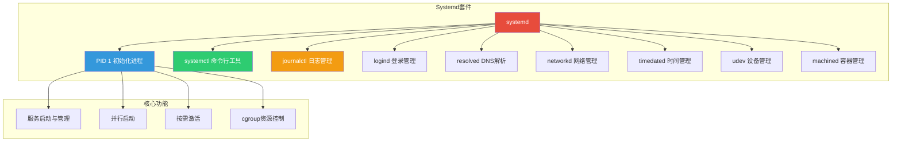
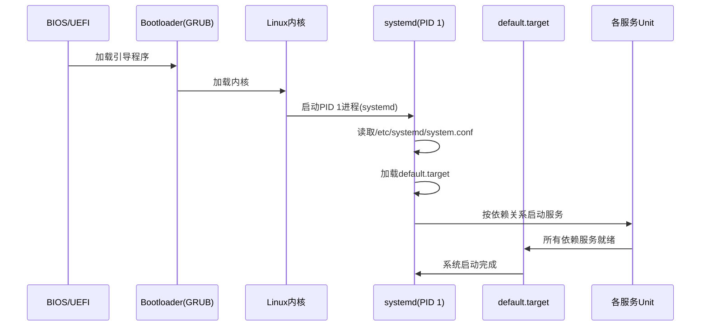
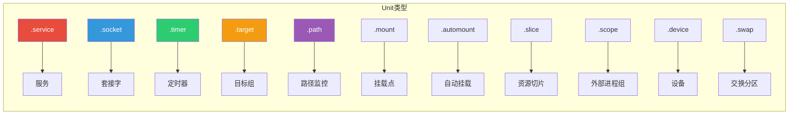
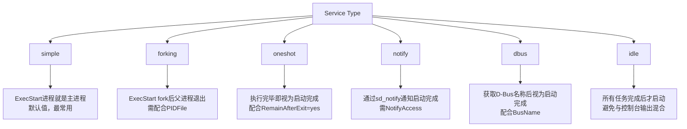
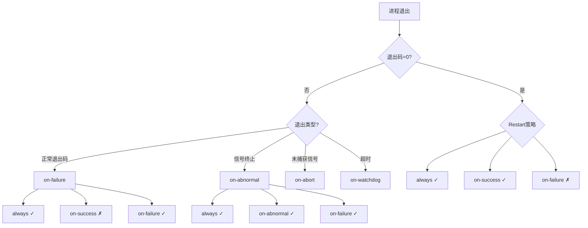
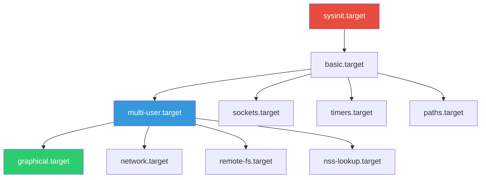
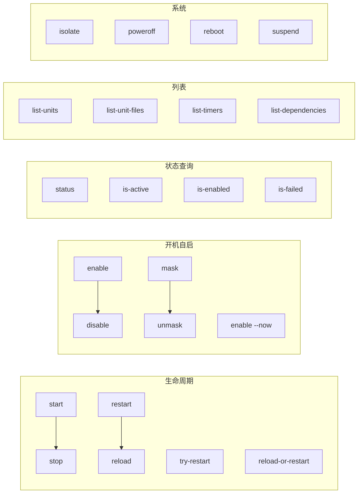
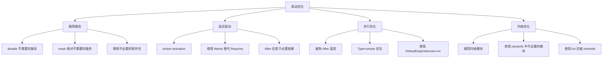
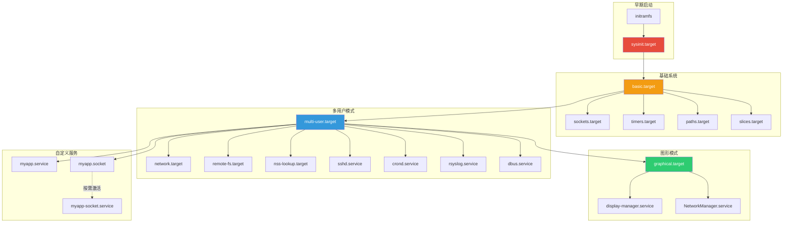
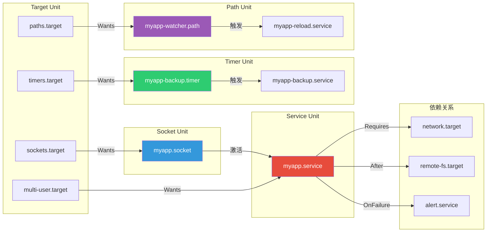

# Systemd 服务管理

::: important 核心要点
Systemd 是现代 Linux 系统的初始化系统和服务管理器，取代了传统的 SysVinit。它通过并行启动、按需激活、cgroup 资源控制等机制，显著提升了系统启动速度和服务管理能力。掌握 Systemd 是 Linux 运维和开发的必备技能。
:::

## 1. Systemd 架构概述

### 1.1 Systemd 的诞生背景

在 Systemd 出现之前，Linux 系统使用 **SysVinit** 或 **Upstart** 作为初始化系统。SysVinit 采用串行启动方式，启动速度慢，且缺乏服务依赖管理。Systemd 由 Lennart Poettering 和 Kay Sievers 于 2010 年发起，目标是解决以下问题：

- **启动速度慢**：SysVinit 串行启动服务，Systemd 并行启动
- **依赖管理缺失**：SysVinit 无法声明服务间依赖关系
- **缺乏统一日志**：各服务日志分散，难以集中查询
- **资源控制不足**：无法对服务进行细粒度的资源限制

::: tip Systemd 命名
Systemd 中的 "d" 代表 "daemon"（守护进程），遵循 Unix 命名惯例（如 httpd、sshd）。注意是 **Systemd**（小写 d），而非 SystemD。
:::

### 1.2 Systemd 核心组件

Systemd 不仅仅是一个 init 系统，它是一个包含多个组件的软件套件：



| 组件 | 功能 | 说明 |
|------|------|------|
| `systemd` | PID 1 进程 | 系统第一个进程，负责启动和管理所有服务 |
| `systemctl` | 命令行工具 | 与 systemd 交互的主要命令行接口 |
| `journalctl` | 日志查询工具 | 查询 systemd 日志 |
| `systemd-logind` | 登录管理 | 管理用户登录会话 |
| `systemd-resolved` | DNS 解析 | 提供本地 DNS 存根解析器 |
| `systemd-networkd` | 网络管理 | 管理网络连接配置 |
| `systemd-udevd` | 设备管理 | 管理设备节点和权限 |
| `systemd-timedated` | 时间管理 | 系统时间和时区管理 |
| `systemd-machined` | 容器管理 | 虚拟机和容器注册管理 |

### 1.3 Systemd 启动流程



系统启动时，systemd 作为 PID 1 进程启动后，会按照以下顺序执行：

1. **读取配置**：加载 `/etc/systemd/system.conf` 全局配置
2. **确定启动目标**：读取 `default.target`（通常是 `graphical.target` 或 `multi-user.target`）
3. **构建依赖图**：分析所有 Unit 的依赖关系，构建有向无环图（DAG）
4. **并行启动**：按照依赖关系并行启动服务
5. **到达目标**：所有必要服务启动完成，系统就绪

::: info 查看当前启动目标
```bash
# 查看默认启动目标
systemctl get-default

# 查看当前运行的目标
systemctl list-units --type=target

# 切换启动目标（立即生效，不重启）
sudo systemctl isolate multi-user.target
```
:::

### 1.4 Systemd 与 SysVinit 对比

| 特性 | SysVinit | Systemd |
|------|----------|---------|
| 启动方式 | 串行 | 并行 |
| 服务依赖 | 无原生支持 | 声明式依赖 |
| 日志系统 | 分散文件 | journald 集中管理 |
| 资源控制 | 无 | cgroup 集成 |
| 按需激活 | 不支持 | socket/Path/Timer 激活 |
| 服务状态 | 脚本返回值 | 多维状态报告 |
| 配置格式 | Shell 脚本 | INI 风格 Unit 文件 |
| 快照/恢复 | 不支持 | systemctl snapshot |

## 2. Unit 文件详解

### 2.1 Unit 文件类型

Systemd 使用 **Unit** 作为管理的基本单位。不同类型的 Unit 文件使用不同的后缀：



| Unit 类型 | 后缀 | 说明 | 示例 |
|-----------|------|------|------|
| Service | `.service` | 系统服务 | `nginx.service`、`sshd.service` |
| Socket | `.socket` | 进程间通信套接字 | `sshd.socket`、`docker.socket` |
| Timer | `.timer` | 定时任务 | `logrotate.timer`、`apt-daily.timer` |
| Target | `.target` | 服务组/运行级别 | `multi-user.target`、`graphical.target` |
| Path | `.path` | 文件系统路径监控 | `systemd-ask-password-wall.path` |
| Mount | `.mount` | 文件系统挂载点 | `home.mount`、`tmp.mount` |
| Automount | `.automount` | 自动挂载配置 | `home.automount` |
| Slice | `.slice` | cgroup 资源切片 | `user.slice`、`system.slice` |
| Scope | `.scope` | 外部创建的进程组 | `session-1.scope` |
| Device | `.device` | 设备单元 | `dev-sda1.device` |
| Swap | `.swap` | 交换分区 | `dev-sda2.swap` |

### 2.2 Unit 文件搜索路径

Systemd 按照以下优先级顺序查找 Unit 文件（高优先级覆盖低优先级）：

```
/etc/systemd/system/          # 管理员自定义（最高优先级）
├── xxx.service               # 直接放置
├── xxx.service.d/            # drop-in 覆盖目录
│   └── override.conf         # 覆盖配置
/run/systemd/system/          # 运行时动态生成
/usr/lib/systemd/system/      # 发行版软件包安装
/lib/systemd/system/          # 兼容路径（Ubuntu/Debian）
```

::: warning 修改建议
- 永远不要直接修改 `/usr/lib/systemd/system/` 下的文件，软件包更新会覆盖你的修改
- 使用 `systemctl edit xxx.service` 创建 drop-in 覆盖
- 或将文件复制到 `/etc/systemd/system/` 后修改
:::

### 2.3 Service Unit 详解

Service Unit 是最常用的 Unit 类型，用于定义系统服务。完整的 Service Unit 文件结构如下：

```ini
[Unit]
Description=Nginx HTTP Server
Documentation=man:nginx(8)
Documentation=https://nginx.org/en/docs/
After=network-online.target remote-fs.target nss-lookup.target
Wants=network-online.target
Requires=network.target
Conflicts=apache2.service
Before=multi-user.target

[Service]
Type=notify
NotifyAccess=all
PIDFile=/run/nginx.pid
ExecStartPre=/usr/sbin/nginx -t -q -g 'daemon on; master_process on;'
ExecStart=/usr/sbin/nginx -g 'daemon on; master_process on;'
ExecReload=/usr/sbin/nginx -g 'daemon on; master_process on;' -s reload
ExecStop=/bin/kill -sQUIT $MAINPID
Restart=on-failure
RestartSec=5s
TimeoutStartSec=90s
TimeoutStopSec=30s
LimitNOFILE=65536
LimitNPROC=4096
PrivateTmp=true
ProtectSystem=full
ReadWritePaths=/var/log/nginx /var/cache/nginx
User=nginx
Group=nginx
WorkingDirectory=/usr/share/nginx
Environment=NGINX=3 LANG=en_US.UTF-8
EnvironmentFile=-/etc/default/nginx

[Install]
WantedBy=multi-user.target
```

#### [Unit] 段详解

[Unit] 段定义 Unit 的元数据和依赖关系：

| 指令 | 说明 | 示例 |
|------|------|------|
| `Description` | Unit 描述 | `Description=Nginx HTTP Server` |
| `Documentation` | 文档地址 | `Documentation=man:nginx(8)` |
| `After` | 在指定 Unit 之后启动 | `After=network.target` |
| `Before` | 在指定 Unit 之前启动 | `Before=multi-user.target` |
| `Requires` | 强依赖（依赖失败则本 Unit 也失败） | `Requires=network.target` |
| `Wants` | 弱依赖（依赖失败不影响本 Unit） | `Wants=network-online.target` |
| `Requisite` | 强前置依赖（依赖未启动则本 Unit 不启动） | `Requisite=database.service` |
| `Conflicts` | 冲突 Unit（不能同时运行） | `Conflicts=apache2.service` |
| `PartOf` | 随指定 Unit 一起重启 | `PartOf=parent.service` |
| `BindsTo` | 绑定依赖（依赖停止则本 Unit 也停止） | `BindsTo=database.service` |
| `OnFailure` | 本 Unit 失败时启动的 Unit | `OnFailure=alert.service` |

::: important After 与 Requires 的区别
- `After/Before`：仅控制**启动顺序**，不建立依赖关系
- `Requires/Wants`：建立**依赖关系**，但不控制启动顺序
- 通常需要**同时使用** `After=network.target` 和 `Requires=network.target`
- `Wants` 是推荐的弱依赖方式，比 `Requires` 更健壮
:::

#### [Service] 段详解

**Type 指令**决定了服务的启动行为：



| Type | 启动完成判定 | 适用场景 | 示例 |
|------|------------|---------|------|
| `simple` | ExecStart 进程启动即完成 | 前台运行的服务 | 大多数现代服务 |
| `forking` | ExecStart fork 后父进程退出 | 传统守护进程 | Nginx、Apache |
| `oneshot` | ExecStart 执行完毕即完成 | 一次性任务 | 系统初始化脚本 |
| `notify` | 进程调用 sd_notify 通知 | 支持通知的服务 | systemd-journald |
| `dbus` | 获取指定 D-Bus 名称 | D-Bus 服务 | NetworkManager |
| `idle` | 空闲时才启动 | 避免输出混合的服务 | 少数特殊服务 |

**执行命令指令**：

| 指令 | 说明 | 前缀 |
|------|------|------|
| `ExecStart` | 启动命令 | `-` 忽略退出码 |
| `ExecStartPre` | 启动前执行 | `+` 以 root 运行 |
| `ExecStartPost` | 启动后执行 | `!` 不以 root 运行 |
| `ExecStop` | 停止命令 | |
| `ExecStopPost` | 停止后执行 | |
| `ExecReload` | 重载命令 | |

::: tip 命令前缀
- `-` 前缀：忽略命令的非零退出码（如 `ExecStartPre=-/usr/bin/rm -f /run/app.pid`）
- `+` 前缀：以 root 权限运行命令（即使 User 指定了普通用户）
- `!` 前缀：以服务用户运行（与 `+` 相反）
- 前缀可以组合：`-+` 或 `+-`
:::

**Restart 指令**：

| 值 | 说明 |
|------|------|
| `no` | 不自动重启（默认） |
| `on-success` | 仅正常退出时重启 |
| `on-failure` | 非正常退出时重启 |
| `on-abnormal` | 被信号终止或超时时重启 |
| `on-abort` | 未捕获信号终止时重启 |
| `on-watchdog` | 看门狗超时时重启 |
| `always` | 总是重启 |



**资源限制与环境指令**：

```ini
# 资源限制
LimitNOFILE=65536        # 最大文件描述符数
LimitNPROC=4096          # 最大进程数
LimitCORE=infinity       # 核心转储大小
LimitSIGPENDING=1024     # 待处理信号数
LimitMSGQUEUE=819200     # POSIX消息队列大小

# 环境变量
Environment=NODE_ENV=production
Environment=PORT=3000
EnvironmentFile=-/etc/default/myapp   # "-" 表示文件不存在不报错

# 工作目录与用户
User=myapp
Group=myapp
WorkingDirectory=/opt/myapp
RootDirectory=/opt/myapp    # chroot 根目录

# 超时设置
TimeoutStartSec=90s
TimeoutStopSec=30s
TimeoutAbortSec=30s
RestartSec=5s
```

**安全加固指令**：

```ini
# 文件系统隔离
PrivateTmp=true                # 使用私有 /tmp 和 /var/tmp
ProtectSystem=full             # /usr 只读，/etc 可写
ProtectHome=true               # 隐藏 /home、/root、/run/user
ReadWritePaths=/var/log/myapp /var/lib/myapp
ReadOnlyPaths=/etc/myapp
InaccessiblePaths=/root

# 用户命名空间
PrivateUsers=true              # 启用用户命名空间隔离
DynamicUser=true               # 动态分配用户/组

# 能力限制
CapabilityBoundingSet=CAP_NET_BIND_SERVICE
AmbientCapabilities=CAP_NET_BIND_SERVICE

# 网络隔离
PrivateNetwork=false           # true 则禁用网络
RestrictAddressFamilies=AF_INET AF_INET6

# 系统调用过滤
SystemCallFilter=@system-service
SystemCallFilter=~@mount @keyring
SystemCallArchitectures=native

# 其他安全
NoNewPrivileges=true           # 禁止提升权限
ProtectKernelTunables=true     # 保护内核参数
ProtectKernelModules=true      # 禁止加载内核模块
ProtectControlGroups=true      # 保护 cgroup 文件系统
LockPersonality=true           # 锁定执行域
MemoryDenyWriteExecute=true    # 禁止可写可执行内存
RestrictNamespaces=true        # 禁止创建命名空间
RestrictRealtime=true          # 禁止实时调度
```

#### [Install] 段详解

[Install] 段定义 Unit 的安装信息，`systemctl enable` 时使用：

| 指令 | 说明 |
|------|------|
| `WantedBy` | 本 Unit 属于哪个 Target 的 Wants |
| `RequiredBy` | 本 Unit 属于哪个 Target 的 Requires |
| `Also` | enable/disable 时同时操作的 Unit |
| `Alias` | Unit 别名 |

```ini
[Install]
WantedBy=multi-user.target    # enable 时创建 .wants 软链接
Also=myapp.socket             # 同时 enable 关联的 socket
Alias=myapp.service           # 可通过别名引用
```

### 2.4 Socket Unit 详解

Socket Unit 实现了**按需激活**（socket activation），当有连接到来时才启动对应的服务：

```ini
# /etc/systemd/system/myapp.socket
[Unit]
Description=MyApp Socket
PartOf=myapp.service

[Socket]
ListenStream=0.0.0.0:8080         # TCP 套接字
# ListenDatagram=0.0.0.0:514      # UDP 套接字
# ListenSequentialPacket=/run/myapp.sock  # Unix 顺序包套接字
Accept=false                        # false=单实例, true=每个连接一个实例
Backlog=128                         # 连接队列长度
MaxConnections=64                   # 最大同时连接数
KeepAlive=true                      # 启用 TCP KeepAlive
NoDelay=true                        # 禁用 Nagle 算法

Service=myapp.service               # 关联的服务（默认同名 .service）

[Install]
WantedBy=sockets.target
```

::: tip Socket Activation 优势
1. **按需启动**：服务在第一个连接到来时才启动，节省系统资源
2. **零宕机重启**：systemd 替服务监听端口，服务重启期间连接排队等待
3. **并行启动**：所有 socket 预先创建，服务可以无序并行启动
:::

### 2.5 Timer Unit 详解

Timer Unit 是 cron 的替代方案，提供更精确的定时任务管理：

```ini
# /etc/systemd/system/myapp-backup.timer
[Unit]
Description=Run MyApp Backup Daily

[Timer]
# 实时定时器（挂钟时间）
OnCalendar=*-*-* 02:00:00       # 每天凌晨 2 点

# 单调定时器（相对于系统启动/服务启动）
# OnBootSec=5min                 # 开机 5 分钟后
# OnUnitActiveSec=24h            # 上次运行 24 小时后
# OnUnitInactiveSec=30min        # 上次停止 30 分钟后

# 精度（默认 1 分钟，可设更精确）
AccuracySec=1us

# 错过的执行是否补执行
Persistent=true                  # true=补执行错过的任务

# 随机延迟（避免多个定时任务同时执行）
RandomizedDelaySec=30min

Unit=myapp-backup.service        # 关联的服务

[Install]
WantedBy=timers.target
```

**OnCalendar 时间格式**：

```
格式: DayOfWeek Year-Month-Day Hour:Minute:Second

示例:
*-*-* *:*:*              # 每分钟
*-*-* *:0:0              # 每小时整点
*-*-* 00:00:00           # 每天零点
*-*-* 02:00:00           # 每天凌晨2点
*-1,7-* *:0:0            # 1月和7月每小时
Mon *-*-* 09:00:00       # 每周一9点
Mon,Fri *-*-* 09:00:00   # 每周一、周五9点
*-*-* 00,6,12,18:00:00   # 每天0/6/12/18点
*-01-01 00:00:00         # 每年1月1日零点
```

::: important Timer 与 Cron 对比
| 特性 | Cron | Systemd Timer |
|------|------|--------------|
| 日志集成 | 无 | journald 自动记录 |
| 依赖管理 | 无 | 可声明 Unit 依赖 |
| 精度 | 分钟级 | 微秒级 |
| 错过执行 | 不补执行 | Persistent=true 可补执行 |
| 随机延迟 | 需手动实现 | RandomizedDelaySec |
| 运行环境 | 最小环境 | 完整 systemd 环境 |
| 查看定时任务 | crontab -l | systemctl list-timers |
:::

### 2.6 Target Unit 详解

Target 用于将多个 Unit 分组，类似于传统的运行级别（runlevel）：



| Target | 传统 Runlevel | 说明 |
|--------|-------------|------|
| `poweroff.target` | 0 | 关机 |
| `rescue.target` | 1 | 单用户/救援模式 |
| `multi-user.target` | 2, 3, 4 | 多用户命令行 |
| `graphical.target` | 5 | 图形界面 |
| `reboot.target` | 6 | 重启 |
| `emergency.target` | - | 紧急模式（最小环境） |

### 2.7 Path Unit 详解

Path Unit 监控文件系统变化，触发对应服务：

```ini
# /etc/systemd/system/myapp-config-changed.path
[Unit]
Description=Watch MyApp Config Directory

[Path]
PathModified=/etc/myapp/config.yml      # 文件被修改时触发
# PathChanged=/etc/myapp/               # 文件属性改变时触发
# PathExists=/var/run/myapp.ready       # 文件存在时触发
# PathExistsGlob=/var/log/myapp/*.log   # 匹配 glob 时触发
Unit=myapp-reload.service               # 触发的服务

[Install]
WantedBy=paths.target
```

## 3. systemctl 命令全集

### 3.1 服务生命周期管理

```bash
# ===== 启动与停止 =====
sudo systemctl start nginx              # 启动服务
sudo systemctl stop nginx               # 停止服务
sudo systemctl restart nginx            # 重启服务（先停后启）
sudo systemctl reload nginx             # 重载配置（不中断服务）
sudo systemctl try-restart nginx        # 仅在服务运行时重启
sudo systemctl reload-or-restart nginx  # 优先 reload，否则 restart

# ===== 启用与禁用 =====
sudo systemctl enable nginx             # 开机自启（创建符号链接）
sudo systemctl disable nginx            # 取消开机自启（删除符号链接）
sudo systemctl enable --now nginx       # 启用并立即启动
sudo systemctl disable --now nginx      # 禁用并立即停止
sudo systemctl mask nginx               # 屏蔽服务（无法手动启动）
sudo systemctl unmask nginx             # 取消屏蔽

# ===== 状态查询 =====
systemctl status nginx                  # 查看服务详细状态
systemctl is-active nginx              # 是否运行中（active/inactive）
systemctl is-enabled nginx             # 是否开机自启（enabled/disabled）
systemctl is-failed nginx              # 是否失败（failed/inactive）
systemctl check nginx                  # 运行中返回0，否则非0
```

::: warning enable 与 start 的区别
- `start/stop`：控制服务**当前**的运行状态
- `enable/disable`：控制服务**开机时**是否自动启动
- 两者互不影响。`enable` 只是创建符号链接，`start` 才是真正启动服务
- `enable --now` 同时设置两者
:::

### 3.2 Unit 查询命令

```bash
# ===== 列出 Unit =====
systemctl list-units                    # 列出所有已加载的 Unit
systemctl list-units --all              # 列出所有 Unit（含 inactive）
systemctl list-units --type=service     # 仅列出 Service 类型
systemctl list-units --type=timer       # 仅列出 Timer 类型
systemctl list-units --state=running    # 仅列出运行中的
systemctl list-units --state=failed     # 仅列出失败的
systemctl list-units --failed           # 同上（简写）

# ===== 列出 Unit 文件 =====
systemctl list-unit-files               # 列出所有 Unit 文件
systemctl list-unit-files --type=service
systemctl list-unit-files --state=enabled

# ===== 列出定时器 =====
systemctl list-timers                   # 列出所有定时器
systemctl list-timers --all             # 包含 inactive 的定时器

# ===== 列出依赖 =====
systemctl list-dependencies nginx       # 查看 nginx 的依赖树
systemctl list-dependencies --reverse nginx  # 查看谁依赖 nginx
systemctl list-dependencies --before nginx   # nginx 之前启动的
systemctl list-dependencies --after nginx    # nginx 之后启动的
```

### 3.3 Unit 文件管理

```bash
# ===== 编辑与重载 =====
sudo systemctl daemon-reload            # 重新加载所有 Unit 文件
sudo systemctl edit nginx               # 编辑 drop-in 覆盖
sudo systemctl edit nginx --full        # 编辑完整 Unit 文件
sudo systemctl edit nginx --force       # 强制创建新文件

# ===== 查看配置 =====
systemctl cat nginx                     # 查看完整 Unit 文件（含 drop-in）
systemctl show nginx                    # 查看所有属性（含默认值）
systemctl show nginx -p ExecStart       # 查看特定属性
systemctl show nginx -p Environment     # 查看环境变量

# ===== 设置属性（运行时） =====
sudo systemctl set-property nginx MemoryMax=512M    # 设置内存限制
sudo systemctl set-property nginx CPUQuota=50%      # 设置 CPU 配额
sudo systemctl set-property nginx CPUWeight=100     # 设置 CPU 权重
```

### 3.4 系统管理命令

```bash
# ===== 目标切换 =====
sudo systemctl isolate multi-user.target    # 切换到命令行模式
sudo systemctl isolate graphical.target     # 切换到图形模式
sudo systemctl rescue                       # 进入救援模式
sudo systemctl emergency                    # 进入紧急模式

# ===== 系统电源管理 =====
sudo systemctl poweroff                     # 关机
sudo systemctl reboot                       # 重启
sudo systemctl suspend                      # 挂起（睡眠）
sudo systemctl hibernate                    # 休眠
sudo systemctl hybrid-sleep                 # 混合睡眠

# ===== 默认目标 =====
systemctl get-default                       # 查看默认目标
sudo systemctl set-default multi-user.target # 设置默认目标
```

### 3.5 诊断与调试

```bash
# ===== 查看失败的服务 =====
systemctl --failed                          # 列出所有失败的服务
systemctl reset-failed nginx                # 重置失败状态

# ===== 分析服务问题 =====
systemd-analyze verify nginx.service        # 验证 Unit 文件语法
systemd-analyze dump                        # 转储所有 Unit 状态
systemd-run --unit=test-service /bin/sleep 60  # 临时运行服务

# ===== 查看服务日志 =====
journalctl -u nginx                         # 查看 nginx 日志
journalctl -u nginx -f                      # 实时跟踪日志
journalctl -u nginx --since "1 hour ago"    # 最近1小时日志
journalctl -u nginx -n 50                   # 最近50条日志
```

### 3.6 systemctl 命令速查表



## 4. 自定义 Service Unit 实战

### 4.1 创建 Node.js 应用服务

```bash
# 1. 创建服务用户
sudo useradd -r -s /sbin/nologin myapp

# 2. 创建 Unit 文件
sudo vim /etc/systemd/system/myapp.service
```

```ini
# /etc/systemd/system/myapp.service
[Unit]
Description=MyApp Node.js Application
Documentation=https://github.com/example/myapp
After=network-online.target
Wants=network-online.target

[Service]
Type=simple
User=myapp
Group=myapp
WorkingDirectory=/opt/myapp
Environment=NODE_ENV=production
Environment=PORT=3000
EnvironmentFile=-/etc/default/myapp

ExecStart=/usr/bin/node /opt/myapp/server.js
ExecReload=/bin/kill -HUP $MAINPID
Restart=on-failure
RestartSec=5s
TimeoutStartSec=60s
TimeoutStopSec=30s

# 安全加固
PrivateTmp=true
ProtectSystem=strict
ProtectHome=true
ReadWritePaths=/opt/myapp/data /var/log/myapp
NoNewPrivileges=true
LimitNOFILE=65536

# 日志标记（方便 journalctl 过滤）
SyslogIdentifier=myapp
LogRateLimitIntervalSec=30s
LogRateLimitBurst=1000

[Install]
WantedBy=multi-user.target
```

```bash
# 3. 创建环境变量文件
sudo vim /etc/default/myapp
```

```ini
# /etc/default/myapp
DB_HOST=localhost
DB_PORT=5432
DB_NAME=myapp_production
REDIS_URL=redis://localhost:6379
SECRET_KEY=change-me-in-production
```

```bash
# 4. 启用并启动服务
sudo systemctl daemon-reload
sudo systemctl enable --now myapp

# 5. 检查状态
systemctl status myapp
journalctl -u myapp -f
```

### 4.2 创建 Java Spring Boot 服务

```ini
# /etc/systemd/system/springapp.service
[Unit]
Description=Spring Boot Application
After=network-online.target
Wants=network-online.target

[Service]
Type=simple
User=springapp
Group=springapp
WorkingDirectory=/opt/springapp

ExecStart=/usr/bin/java \
    -Xms512m -Xmx2048m \
    -Djava.security.egd=file:/dev/./urandom \
    -Dspring.profiles.active=production \
    -jar /opt/springapp/app.jar

ExecStop=/bin/kill -SIGTERM $MAINPID
SuccessExitStatus=143

Restart=on-failure
RestartSec=10s
TimeoutStartSec=120s
TimeoutStopSec=60s

# 资源限制
LimitNOFILE=65536
LimitNPROC=4096

# 安全加固
PrivateTmp=true
ProtectSystem=strict
ReadWritePaths=/opt/springapp/logs /opt/springapp/data
AmbientCapabilities=CAP_NET_BIND_SERVICE

[Install]
WantedBy=multi-user.target
```

::: tip Java 服务注意事项
- `SuccessExitStatus=143`：Java 应用响应 SIGTERM 时返回 143，默认被视为异常退出
- `-Djava.security.egd`：使用非阻塞随机数源，加速 Spring Boot 启动
- `-Xms` 和 `-Xmx`：设置 JVM 堆内存范围，建议通过 systemd 的 `MemoryMax` 做兜底限制
:::

### 4.3 创建多进程服务（如 Gunicorn + Django）

```ini
# /etc/systemd/system/djangoapp.service
[Unit]
Description=Django Application (Gunicorn)
After=network-online.target postgresql.service
Wants=network-online.target
Requires=postgresql.service

[Service]
Type=notify
NotifyAccess=all
User=django
Group=django
WorkingDirectory=/opt/djangoapp
Environment=DJANGO_SETTINGS_MODULE=app.settings.production
EnvironmentFile=-/etc/default/djangoapp

ExecStart=/opt/djangoapp/venv/bin/gunicorn \
    --bind 0.0.0.0:8000 \
    --workers 4 \
    --threads 2 \
    --timeout 120 \
    --graceful-timeout 30 \
    --max-requests 5000 \
    --max-requests-jitter 500 \
    --access-logfile /var/log/djangoapp/access.log \
    --error-logfile /var/log/djangoapp/error.log \
    --pid /run/djangoapp/gunicorn.pid \
    app.wsgi:application

ExecReload=/bin/kill -HUP $MAINPID
PIDFile=/run/djangoapp/gunicorn.pid
RuntimeDirectory=djangoapp

Restart=on-failure
RestartSec=5s

# 安全加固
PrivateTmp=true
ProtectSystem=strict
ReadWritePaths=/opt/djangoapp/media /var/log/djangoapp
NoNewPrivileges=true

[Install]
WantedBy=multi-user.target
```

### 4.4 使用 Drop-in 覆盖修改服务

不要直接修改发行版提供的 Unit 文件，使用 drop-in 覆盖：

```bash
# 方法一：使用 systemctl edit（推荐）
sudo systemctl edit nginx
# 会在 /etc/systemd/system/nginx.service.d/override.conf 创建文件

# 方法二：手动创建 drop-in 目录
sudo mkdir -p /etc/systemd/system/nginx.service.d/
sudo vim /etc/systemd/system/nginx.service.d/override.conf
```

```ini
# /etc/systemd/system/nginx.service.d/override.conf
# 仅包含需要覆盖或新增的指令

[Service]
# 覆盖限制
LimitNOFILE=131072

# 新增环境变量
Environment=NGINX_WORKER_PROCESSES=auto

# 覆盖重启策略
Restart=always
RestartSec=3s

# 清空原有值（设为空）
# ExecStart=
# ExecStart=/usr/sbin/nginx -g 'daemon off;'
```

```bash
# 重载并重启
sudo systemctl daemon-reload
sudo systemctl restart nginx

# 查看合并后的完整配置
systemctl cat nginx
```

::: warning 清空列表型指令
列表型指令（如 `ExecStart`、`Environment`）的覆盖方式特殊：
- 直接写新值是**追加**，不是替换
- 要替换需先清空：`ExecStart=`（空值），然后 `ExecStart=/new/command`
- 这只影响 drop-in 文件中的同名段
:::

## 5. Systemd Timer 替代 Cron

### 5.1 常见 Cron 场景的 Timer 实现

#### 每日日志轮转

```ini
# /etc/systemd/system/logrotate.timer
[Unit]
Description=Daily Log Rotation Timer

[Timer]
OnCalendar=*-*-* 00:00:00
Persistent=true
RandomizedDelaySec=1h
AccuracySec=1h

[Install]
WantedBy=timers.target
```

```ini
# /etc/systemd/system/logrotate.service
[Unit]
Description=Rotate Log Files

[Service]
Type=oneshot
ExecStart=/usr/sbin/logrotate /etc/logrotate.conf
```

#### 数据库备份

```ini
# /etc/systemd/system/db-backup.timer
[Unit]
Description=Database Backup Timer
Requires=db-backup.service

[Timer]
OnCalendar=*-*-* 02:30:00
Persistent=true
RandomizedDelaySec=15min

[Install]
WantedBy=timers.target
```

```ini
# /etc/systemd/system/db-backup.service
[Unit]
Description=Database Backup Service

[Service]
Type=oneshot
User=postgres
ExecStart=/usr/local/bin/pg-backup.sh
# 失败时通知
OnFailure=db-backup-notify.service
```

#### 定期清理临时文件

```ini
# /etc/systemd/system/tmp-cleanup.timer
[Unit]
Description=Weekly Temporary File Cleanup

[Timer]
OnCalendar=weekly
Persistent=true

[Install]
WantedBy=timers.target
```

```ini
# /etc/systemd/system/tmp-cleanup.service
[Unit]
Description=Clean Up Temporary Files

[Service]
Type=oneshot
ExecStart=/usr/bin/find /tmp -type f -atime +30 -delete
ExecStart=/usr/bin/find /var/tmp -type f -atime +60 -delete
```

### 5.2 Timer 管理命令

```bash
# 启用定时器
sudo systemctl enable --now logrotate.timer

# 列出所有定时器
systemctl list-timers
systemctl list-timers --all

# 查看定时器详情
systemctl status logrotate.timer

# 手动触发（用于测试）
sudo systemctl start logrotate.service

# 查看定时器下次执行时间
systemctl show logrotate.timer -p NextElapseUSecRealtime
```

### 5.3 Cron 到 Timer 迁移对照表

| Cron 表达式 | OnCalendar | 说明 |
|------------|-----------|------|
| `* * * * *` | `*-*-* *:*:00` | 每分钟 |
| `0 * * * *` | `*-*-* *:00:00` | 每小时 |
| `0 0 * * *` | `*-*-* 00:00:00` | 每天 |
| `0 2 * * *` | `*-*-* 02:00:00` | 每天凌晨2点 |
| `0 0 * * 0` | `Sun *-*-* 00:00:00` | 每周日 |
| `0 0 1 * *` | `*-*-01 00:00:00` | 每月1号 |
| `0 0 1 1 *` | `*-01-01 00:00:00` | 每年1月1日 |
| `*/5 * * * *` | `*-*-* *:0/5:00` | 每5分钟 |
| `0 9-17 * * 1-5` | `Mon..Fri *-*-* 09..17:00:00` | 工作时间每小时 |
| `@reboot` | `OnBootSec=1min` | 开机后 |

## 6. Journalctl 日志管理

### 6.1 Journald 工作原理

```mermaid
graph LR
    subgraph 日志源
        A[内核日志 kmsg]
        B[系统服务 stdout/stderr]
        C[syslog 兼容接口]
        D[audit 审计日志]
    end

    subgraph journald
        E[收集] --> F[索引]
        F --> G[存储]
        G --> H[压缩]
    end

    subgraph 持久化
        I[/run/log/journal/ 临时]
        J[/var/log/journal/ 持久]
    end

    A --> E
    B --> E
    C --> E
    D --> E
    G --> I
    G --> J

    K[journalctl] --> G
```

### 6.2 启用持久化存储

默认情况下，journald 日志仅存储在 `/run/log/journal/`（内存文件系统），重启后丢失。启用持久化：

```bash
# 1. 创建持久化目录
sudo mkdir -p /var/log/journal/

# 2. 设置正确的权限和 SELinux 上下文
sudo systemd-tmpfiles --create --prefix /var/log/journal
sudo chown root:systemd-journal /var/log/journal
sudo chmod 2755 /var/log/journal

# 3. 重启 journald
sudo systemctl restart systemd-journald
```

或者修改配置文件：

```ini
# /etc/systemd/journald.conf
[Journal]
Storage=persistent           # auto(默认)|persistent|volatile|none
Compress=yes                 # 压缩日志
Seal=yes                     # FSS 前向安全密封
SplitMode=uid                # 按用户分割日志
RateLimitIntervalSec=30s     # 速率限制窗口
RateLimitBurst=10000         # 速率限制阈值
SystemMaxUse=500M            # 日志最大磁盘用量
SystemKeepFree=100M          # 保留的最小磁盘空间
SystemMaxFileSize=50M        # 单个日志文件最大大小
SystemMaxFiles=100           # 最大日志文件数
MaxRetentionSec=1month       # 日志最大保留时间
MaxFileSec=1month            # 单文件最大时间跨度
```

### 6.3 Journalctl 常用查询

```bash
# ===== 基本查询 =====
journalctl                          # 查看所有日志
journalctl -n 50                    # 最近50条
journalctl -f                       # 实时跟踪（类似 tail -f）
journalctl --no-pager               # 不分页
journalctl -r                       # 倒序显示（最新在前）

# ===== 按服务过滤 =====
journalctl -u nginx                 # nginx 服务日志
journalctl -u nginx -u php-fpm      # 多个服务
journalctl -u nginx.service         # 指定完整名称
journalctl -u nginx --since today   # 今天的日志

# ===== 按时间过滤 =====
journalctl --since "2024-01-01"                     # 从某日起
journalctl --since "2024-01-01" --until "2024-01-02" # 时间范围
journalctl --since "1 hour ago"                     # 最近1小时
journalctl --since "30 min ago"                     # 最近30分钟
journalctl --since yesterday                        # 昨天
journalctl --since today                            # 今天
journalctl --since "2024-01-01 09:00:00" --until "2024-01-01 17:00:00"

# ===== 按优先级过滤 =====
journalctl -p emerg       # 0 - 紧急
journalctl -p alert       # 1 - 警报
journalctl -p crit        # 2 - 严重
journalctl -p err         # 3 - 错误
journalctl -p warning     # 4 - 警告
journalctl -p notice      # 5 - 通知
journalctl -p info        # 6 - 信息（默认）
journalctl -p debug       # 7 - 调试
journalctl -p err..alert  # 优先级范围

# ===== 按进程/用户过滤 =====
journalctl _PID=1234                 # 指定 PID
journalctl _UID=1000                 # 指定用户
journalctl _GID=1000                 # 指定组
journalctl _COMM=nginx              # 指定命令名
journalctl _EXE=/usr/sbin/nginx     # 指定可执行文件
journalctl _SYSTEMD_UNIT=nginx.service  # 指定 Unit

# ===== 内核日志 =====
journalctl -k                        # 仅内核日志（类似 dmesg）
journalctl -k --since "1 hour ago"

# ===== 输出格式 =====
journalctl -o short                  # 默认格式
journalctl -o short-precise          # 微秒精度
journalctl -o verbose                # 详细（显示所有字段）
journalctl -o json                   # JSON 格式
journalctl -o json-pretty            # 格式化 JSON
journalctl -o cat                    # 仅消息体
journalctl -o export                 # 二进制导出格式

# ===== 磁盘使用 =====
journalctl --disk-usage              # 查看日志磁盘占用
journalctl --vacuum-size=200M        # 清理至 200M 以内
journalctl --vacuum-time=7d          # 清理7天前的日志
journalctl --vacuum-files=50         # 最多保留50个文件
journalctl --rotate                  # 轮转日志文件
```

### 6.4 Journalctl 高级过滤

```bash
# 组合过滤
journalctl -u nginx -p err --since "1 hour ago"

# 按启动标记过滤
journalctl -b                        # 当前启动的日志
journalctl -b -1                     # 上一次启动的日志
journalctl -b -2                     # 前两次启动的日志
journalctl --list-boots              # 列出所有启动记录

# 按光标（位置标记）
journalctl --show-cursor             # 显示当前光标
journalctl --after-cursor="s=xxx"    # 从指定光标之后

# 显示内核设备日志
journalctl -u dev-sda1.device        # sda1 设备的日志

# 查看服务上一次运行的日志
journalctl -u nginx -b -1           # 上次启动时 nginx 的日志

# 按系统调用过滤
journalctl _TRANSPORT=kernel         # 内核日志
journalctl _TRANSPORT=stdout         # 标准输出日志
journalctl _TRANSPORT=journal        # 原生 journal 日志
journalctl _TRANSPORT=syslog         # syslog 兼容日志
```

### 6.5 将日志转发到 Syslog

如果需要同时使用传统 syslog（如 rsyslog），确保 journald 转发日志：

```ini
# /etc/systemd/journald.conf
[Journal]
ForwardToSyslog=yes
ForwardToKMsg=no
ForwardToConsole=no
ForwardToWall=yes
```

## 7. 开机启动优化

### 7.1 systemd-analyze 工具集

```bash
# ===== 启动时间统计 =====
systemd-analyze                        # 总启动时间
systemd-analyze time                   # 同上（更详细）

# 输出示例：
# Startup finished in 3.210s (kernel) + 12.345s (initrd) + 25.678s (userspace) = 41.233s
# graphical.target reached after 23.456s in userspace

# ===== 耗时排行 =====
systemd-analyze blame                  # 按 Unit 启动耗时排序

# 输出示例：
#  5.234s NetworkManager-wait-online.service
#  3.456s docker.service
#  2.789s firewalld.service
#  1.234s tuned.service
#  0.987s polkit.service

# ===== 关键路径分析 =====
systemd-analyze critical-chain         # 到 default.target 的关键路径
systemd-analyze critical-chain nginx.service  # 到指定服务的关键路径

# 输出示例：
# graphical.target @23.456s
# └─multi-user.target @23.455s
#   └─docker.service @20.000s +3.456s
#     └─network-online.target @19.999s
#       └─NetworkManager-wait-online.service @14.765s +5.234s

# ===== 生成可视化图表 =====
systemd-analyze plot > boot.svg        # 生成 SVG 启动时间线图
systemd-analyze dot | dot -Tsvg > boot-dependency.svg  # 依赖关系图

# ===== 验证配置 =====
systemd-analyze verify myapp.service   # 验证 Unit 文件语法
systemd-analyze log-level              # 查看当前日志级别
systemd-analyze log-level debug        # 设置日志级别
```

### 7.2 常见启动优化策略



#### 精简不必要的服务

```bash
# 查看所有 enabled 的服务
systemctl list-unit-files --state=enabled --type=service

# 禁用不需要的服务
sudo systemctl disable --now ModemManager.service     # 无需移动网络
sudo systemctl disable --now avahi-daemon.service     # 无需 mDNS
sudo systemctl disable --now cups.service             # 无需打印
sudo systemctl disable --now bluetooth.service        # 无需蓝牙
sudo systemctl disable --now accounts-daemon.service  # 无需账户管理

# 完全屏蔽（防止被其他服务拉起）
sudo systemctl mask ModemManager.service
```

#### 优化 NetworkManager-wait-online

NetworkManager-wait-online.service 经常是启动最慢的服务，大多数服务器不需要等待网络完全就绪：

```bash
# 方法一：直接禁用
sudo systemctl disable NetworkManager-wait-online.service

# 方法二：仅在需要时等待
sudo systemctl edit NetworkManager-wait-online.service
```

```ini
# /etc/systemd/system/NetworkManager-wait-online.service.d/override.conf
[Service]
ExecStart=
ExecStart=/usr/bin/nm-online -s -q --timeout=10
```

#### 优化 Docker 启动

```bash
sudo systemctl edit docker.service
```

```ini
# /etc/systemd/system/docker.service.d/override.conf
[Unit]
# 不等待网络完全就绪
After=network.target
# 移除 network-online.target 依赖
Wants=

[Service]
# 限制启动超时
TimeoutStartSec=60
```

### 7.3 开机启动优化实战

```bash
# 1. 记录优化前的启动时间
systemd-analyze time > /tmp/before.txt
systemd-analyze blame >> /tmp/before.txt

# 2. 分析关键路径
systemd-analyze critical-chain

# 3. 逐项优化...

# 4. 重启后比较
systemd-analyze time > /tmp/after.txt
systemd-analyze blame >> /tmp/after.txt

# 5. 对比
diff /tmp/before.txt /tmp/after.txt
```

::: important 优化原则
1. **先测量，后优化**：用 `blame` 和 `critical-chain` 找到瓶颈
2. **优化关键路径**：只影响关键路径的优化才能缩短启动时间
3. **服务延迟启动**：非关键服务可以延迟到系统启动后
4. **按需激活**：使用 socket activation 替代常驻服务
:::

## 8. Cgroup 资源控制

### 8.1 Cgroup 与 Systemd 的关系

Systemd 是 Linux 系统的 cgroup 管理者。每个服务自动创建 cgroup，systemd 通过 cgroup 实现：

- **资源限制**：CPU、内存、IO 带宽限制
- **资源分配**：按权重分配资源
- **进程追踪**：确保服务所有进程在同一个 cgroup 中
- **服务隔离**：防止资源争抢

```mermaid
graph TD
    A[/sys/fs/cgroup 根cgroup] --> B[user.slice]
    A --> C[system.slice]
    A --> D[machine.slice]

    C --> C1[nginx.service]
    C --> C2[docker.service]
    C --> C3[sshd.service]
    C --> C4[myapp.service]

    B --> B1[user-1000.slice]
    B1 --> B2[session-1.scope]

    D --> D1[machine-qemu.scope]

    style A fill:#e74c3c,color:#fff
    style C fill:#3498db,color:#fff
    style B fill:#2ecc71,color:#fff
```

### 8.2 查看服务 Cgroup

```bash
# 查看服务的 cgroup 树
systemd-cgls

# 查看特定服务的 cgroup
systemd-cgls system.slice/nginx.service

# 查看进程的 cgroup
cat /proc/$(pidof nginx | awk '{print $1}')/cgroup

# 查看服务的 cgroup 路径
systemctl show nginx -p ControlGroup

# 实时监控 cgroup 资源使用
systemd-cgtop
```

### 8.3 CPU 资源控制

```bash
# ===== CPU 配额（绝对限制） =====
# 限制 nginx 最多使用 1.5 个 CPU 核心
sudo systemctl set-property nginx.service CPUQuota=150%

# 限制最多使用 50% 的单核
sudo systemctl set-property nginx.service CPUQuota=50%

# ===== CPU 权重（相对分配） =====
# 默认权重为 100，范围 1-10000
# 当 CPU 繁忙时，按权重比例分配
sudo systemctl set-property nginx.service CPUWeight=200
sudo systemctl set-property myapp.service CPUWeight=100
# nginx 获得 2/3 的 CPU 时间，myapp 获得 1/3

# ===== CPU 核心绑定 =====
# 限制服务只能在 CPU 0-3 上运行
sudo systemctl set-property nginx.service AllowedCPUs=0-3

# ===== 实时调度 =====
# 分配实时调度预算
sudo systemctl set-property nginx.service CPUWeight=100
```

在 Unit 文件中配置：

```ini
[Service]
CPUQuota=200%              # 最多使用 2 个核心
CPUWeight=500              # 高权重
AllowedCPUs=0-3            # 绑定 CPU 核心
```

### 8.4 内存资源控制

```bash
# ===== 内存限制 =====
# 设置内存硬限制
sudo systemctl set-property nginx.service MemoryMax=2G

# 设置内存软限制（超过后可能被 OOM killer 杀掉）
sudo systemctl set-property nginx.service MemoryHigh=1.5G

# 设置内存低限（保证最少可用内存）
sudo systemctl set-property nginx.service MemoryLow=512M

# 设置 Swap 限制
sudo systemctl set-property nginx.service MemorySwapMax=512M

# 设置 OOM 行为
sudo systemctl set-property nginx.service OOMPolicy=stop   # stop|continue|kill
```

在 Unit 文件中配置：

```ini
[Service]
MemoryMax=2G               # 内存硬限制
MemoryHigh=1.5G            # 内存软限制
MemoryLow=512M             # 最低内存保证
MemorySwapMax=0            # 禁用 swap
OOMPolicy=stop             # OOM 时停止服务
```

::: warning MemoryMax vs MemoryHigh
- `MemoryMax`：硬限制，达到后进程被 OOM killer 杀死
- `MemoryHigh`：软限制，超过后进程被限流并回收内存，但不会立即杀死
- 建议同时设置：`MemoryHigh` < `MemoryMax`，给服务一个缓冲区
:::

### 8.5 IO 资源控制

```bash
# ===== IO 权重（相对分配） =====
# 默认权重为 100，范围 1-10000
sudo systemctl set-property nginx.service IOWeight=500
sudo systemctl set-property myapp.service IOWeight=100

# ===== IO 带宽限制 =====
# 限制读带宽为 10MB/s
sudo systemctl set-property nginx.service IOReadBandwidthMax=/dev/sda 10M

# 限制写带宽为 5MB/s
sudo systemctl set-property nginx.service IOWriteBandwidthMax=/dev/sda 5M

# ===== IOPS 限制 =====
# 限制读 IOPS 为 1000
sudo systemctl set-property nginx.service IOReadIOPSMax=/dev/sda 1000

# 限制写 IOPS 为 500
sudo systemctl set-property nginx.service IOWriteIOPSMax=/dev/sda 500
```

在 Unit 文件中配置：

```ini
[Service]
IOWeight=500
IOReadBandwidthMax=/dev/sda 10M
IOWriteBandwidthMax=/dev/sda 5M
IOReadIOPSMax=/dev/sda 1000
IOWriteIOPSMax=/dev/sda 500
```

### 8.6 Slice 与资源层级

Slice 允许对一组服务进行统一的资源控制：

```mermaid
graph TD
    A[/ 根slice] --> B[-.slice 系统slice]
    A --> C[system.slice]
    A --> D[user.slice]
    A --> E[machine.slice]

    C --> C1[nginx.service<br/>CPUWeight=200]
    C --> C2[myapp.service<br/>CPUWeight=100]
    C --> C3[db.slice<br/>CPUWeight=500 MemoryMax=4G]

    C3 --> C3a[postgresql.service<br/>CPUWeight=300]
    C3 --> C3b[redis.service<br/>CPUWeight=200]
```

创建自定义 Slice：

```ini
# /etc/systemd/system/db.slice
[Unit]
Description=Database Slice
Before=slices.target

[Slice]
CPUWeight=500
MemoryMax=4G
IOWeight=500
```

将服务分配到 Slice：

```ini
# /etc/systemd/system/postgresql.service.d/override.conf
[Unit]
Slice=db.slice
```

```bash
# 或者运行时设置
sudo systemctl set-property postgresql.service Slice=db.slice
```

### 8.7 资源控制实战：多租户环境

```bash
# 场景：一台服务器运行多个应用，需要合理分配资源

# 1. 创建租户 Slice
sudo vim /etc/systemd/system/tenant-a.slice
```

```ini
# /etc/systemd/system/tenant-a.slice
[Unit]
Description=Tenant A Resource Slice

[Slice]
CPUWeight=300
MemoryMax=4G
MemoryHigh=3.5G
IOWeight=300
```

```bash
# 2. 将服务分配到租户 Slice
sudo systemctl set-property app-a-web.service Slice=tenant-a.slice
sudo systemctl set-property app-a-api.service Slice=tenant-a.slice
sudo systemctl set-property app-a-worker.service Slice=tenant-a.slice

# 3. 在租户 Slice 内部再做细分
sudo systemctl set-property app-a-web.service CPUWeight=500 MemoryMax=2G
sudo systemctl set-property app-a-api.service CPUWeight=300 MemoryMax=1G
sudo systemctl set-property app-a-worker.service CPUWeight=200 MemoryMax=1G

# 4. 验证资源配置
systemctl show app-a-web.service -p Slice,CPUWeight,MemoryMax
systemd-cgls tenant-a.slice
```

### 8.8 资源监控

```bash
# ===== systemd-cgtop 实时监控 =====
systemd-cgtop
# 输出：
# Control Group           Tasks   %CPU   Memory  Input/s Output/s
# /                         345   15.2     3.7G        -        -
# system.slice              120    8.5     2.1G        -        -
# system.slice/nginx.service  5    2.3   512.0M        -        -
# system.slice/docker.service 30   3.1     1.2G        -        -

# ===== 查看服务资源使用 =====
systemctl show nginx.service -p MemoryCurrent -p CPUUsageNSec

# ===== cgroup v2 接口 =====
# 查看服务的 cgroup 路径
cgpath=$(systemctl show nginx.service -p ControlGroup | cut -d= -f2)
echo $cgpath

# 查看内存使用
cat /sys/fs/cgroup${cgpath}/memory.current

# 查看 CPU 使用
cat /sys/fs/cgroup${cgpath}/cpu.stat

# 查看 IO 使用
cat /sys/fs/cgroup${cgpath}/io.stat
```

## 9. Systemd 启动依赖关系图



## 10. Unit 文件关系图



## 11. 常见问题与故障排查

### 11.1 服务启动失败排查

```bash
# 1. 查看服务状态
systemctl status myapp.service

# 2. 查看详细日志
journalctl -u myapp.service -n 100 --no-pager

# 3. 查看上次启动的日志（如果重启后丢失）
journalctl -u myapp.service -b -1

# 4. 查看失败状态详情
systemctl show myapp.service -p Result -p ExecMainStatus

# 5. 验证 Unit 文件语法
systemd-analyze verify myapp.service

# 6. 手动执行启动命令调试
sudo -u myapp /usr/bin/node /opt/myapp/server.js

# 7. 以调试模式运行
sudo SYSTEMD_LOG_LEVEL=debug systemctl start myapp.service
```

### 11.2 常见错误与解决方案

::: warning 服务状态为 failed
```bash
# 查看退出码和信号
systemctl show myapp.service -p ExecMainStatus -p ExecMainCode

# 常见退出码含义：
# 1 - 一般错误
# 2 - 命令误用
# 126 - 命令不可执行
# 127 - 命令未找到
# 130 - Ctrl+C 中断（SIGINT）
# 137 - 被 SIGKILL 杀死（OOM killer）
# 139 - 段错误（SIGSEGV）
# 143 - 正常终止（SIGTERM，Java 应用常见）

# 重置失败状态
systemctl reset-failed myapp.service
```
:::

::: info 服务不断重启
```bash
# 查看重启计数
systemctl show myapp.service -p NRestarts

# 查看重启限制
systemctl show myapp.service -p StartLimitBurst -p StartLimitIntervalSec

# 临时停止重启循环
sudo systemctl stop myapp.service

# 修改重启策略
sudo systemctl edit myapp.service
# [Service]
# StartLimitBurst=5
# StartLimitIntervalSec=60
# Restart=on-failure
```
:::

### 11.3 端口冲突排查

```bash
# 查看端口占用
sudo ss -tlnp | grep :8080

# 查看是哪个服务占用了端口
sudo systemctl status $(sudo ss -tlnp | grep :8080 | grep -oP 'users:\(\("\K[^"]+')

# 如果是 systemd socket activation 占用
systemctl list-units --type=socket | grep 8080
sudo systemctl stop myapp.socket
```

### 11.4 Unit 文件不生效

```bash
# 1. 确认已 daemon-reload
sudo systemctl daemon-reload

# 2. 确认文件路径和优先级
systemctl cat myapp.service

# 3. 确认没有 mask
systemctl is-enabled myapp.service
# 如果显示 "masked"，需要 unmask
sudo systemctl unmask myapp.service

# 4. 确认没有其他实例在运行
systemctl list-units --all | grep myapp

# 5. 检查 drop-in 覆盖
ls -la /etc/systemd/system/myapp.service.d/
```

### 11.5 Debug 模式启动服务

```bash
# 方法一：设置日志级别
sudo systemctl edit myapp.service
```

```ini
[Service]
Environment=SYSTEMD_LOG_LEVEL=debug
```

```bash
# 方法二：使用 systemd-run 调试
sudo systemd-run --unit=test-myapp --service-type=simple \
    -E NODE_ENV=development \
    /usr/bin/node /opt/myapp/server.js

# 查看临时服务日志
journalctl -u test-myapp -f

# 清理
sudo systemctl stop test-myapp
```

## 12. Systemd 最佳实践

### 12.1 服务设计原则

1. **使用 `Type=simple`**：除非必须，否则避免 `Type=forking`
2. **声明正确的依赖**：使用 `Wants` + `After`，避免过度使用 `Requires`
3. **设置合理的重启策略**：生产环境推荐 `Restart=on-failure` + `RestartSec=5s`
4. **启用安全加固**：至少启用 `PrivateTmp`、`ProtectSystem`、`NoNewPrivileges`
5. **设置资源限制**：使用 `MemoryMax`、`CPUQuota` 防止资源泄漏

### 12.2 安全沙箱清单

```ini
# 推荐的最小安全沙箱配置
[Service]
# 基本隔离
PrivateTmp=true
ProtectSystem=strict
ProtectHome=true
NoNewPrivileges=true

# 文件系统访问（仅开放必要路径）
ReadWritePaths=/var/lib/myapp /var/log/myapp /run/myapp

# 网络限制（仅允许需要的协议族）
RestrictAddressFamilies=AF_INET AF_INET6 AF_UNIX

# 能力限制（仅保留需要的能力）
CapabilityBoundingSet=
AmbientCapabilities=

# 系统调用过滤
SystemCallFilter=@system-service
SystemCallFilter=~@resources @privileged

# 内核保护
ProtectKernelTunables=true
ProtectKernelModules=true
ProtectControlGroups=true
```

::: tip 安全沙箱测试
```bash
# 使用 systemd-nspawn 测试沙箱
sudo systemd-nspawn --directory=/ --bind=/opt/myapp \
    --user=myapp --property=PrivateTmp=yes \
    /usr/bin/node /opt/myapp/server.js

# 使用 systemctl edit 逐步添加安全指令
# 每次添加一个指令，测试服务是否正常运行
```
:::

### 12.3 日志管理最佳实践

1. **启用持久化存储**：设置 `Storage=persistent`
2. **设置日志轮转**：配置 `SystemMaxUse` 和 `MaxRetentionSec`
3. **标记日志**：使用 `SyslogIdentifier` 标识服务日志
4. **转发到集中日志**：配置 `ForwardToSyslog` 或使用 journald 远程转发
5. **定期清理**：使用 `journalctl --vacuum-*` 命令

### 12.4 生产环境 Unit 模板

```ini
# /etc/systemd/system/template-production@.service
# 使用：systemctl enable template-production@app1
#       systemctl start template-production@app1

[Unit]
Description=Production Application - %i
After=network-online.target
Wants=network-online.target

[Service]
Type=simple
User=app-%i
Group=app-%i
WorkingDirectory=/opt/%i
EnvironmentFile=-/etc/default/%i

ExecStart=/opt/%i/bin/start.sh
ExecReload=/bin/kill -HUP $MAINPID
Restart=on-failure
RestartSec=5s
TimeoutStartSec=90s
TimeoutStopSec=30s

# 资源限制
LimitNOFILE=65536
MemoryMax=%i_memory
CPUQuota=%i_cpu

# 安全加固
PrivateTmp=true
ProtectSystem=strict
ProtectHome=true
ReadWritePaths=/opt/%i/data /var/log/%i
NoNewPrivileges=true
RestrictAddressFamilies=AF_INET AF_INET6 AF_UNIX

[Install]
WantedBy=multi-user.target
```

::: important 模板 Unit
`@` 符号用于创建模板 Unit，`%i` 是实例名占位符：
- 文件名 `app@.service` 是模板
- `app@web.service`、`app@api.service` 是实例
- `%i` 被替换为实例名（web、api）
- 其他占位符：`%n`（完整 Unit 名）、`%N`（反转义 Unit 名）、`%p`（前缀）、`%I`（反转义实例名）、`%H`（主机名）
:::

## 参考资源

- [systemd 官方文档](https://www.freedesktop.org/wiki/Software/systemd/)
- [systemd.unit(5) 手册页](https://www.freedesktop.org/software/systemd/man/systemd.unit.html)
- [systemd.service(5) 手册页](https://www.freedesktop.org/software/systemd/man/systemd.service.html)
- [systemd.exec(5) 手册页](https://www.freedesktop.org/software/systemd/man/systemd.exec.html)
- [systemd.timer(5) 手册页](https://www.freedesktop.org/software/systemd/man/systemd.timer.html)
- [Red Hat Systemd 指南](https://access.redhat.com/documentation/en-us/red_hat_enterprise_linux/9/html/configuring_basic_system_settings/managing-services-with-systemd_configuring-basic-system-settings)
- [systemd by example](https://systemd-by-example.com/)
- [Lennart Poettering 的 systemd 系列](http://0pointer.de/blog/projects/systemd.html)
