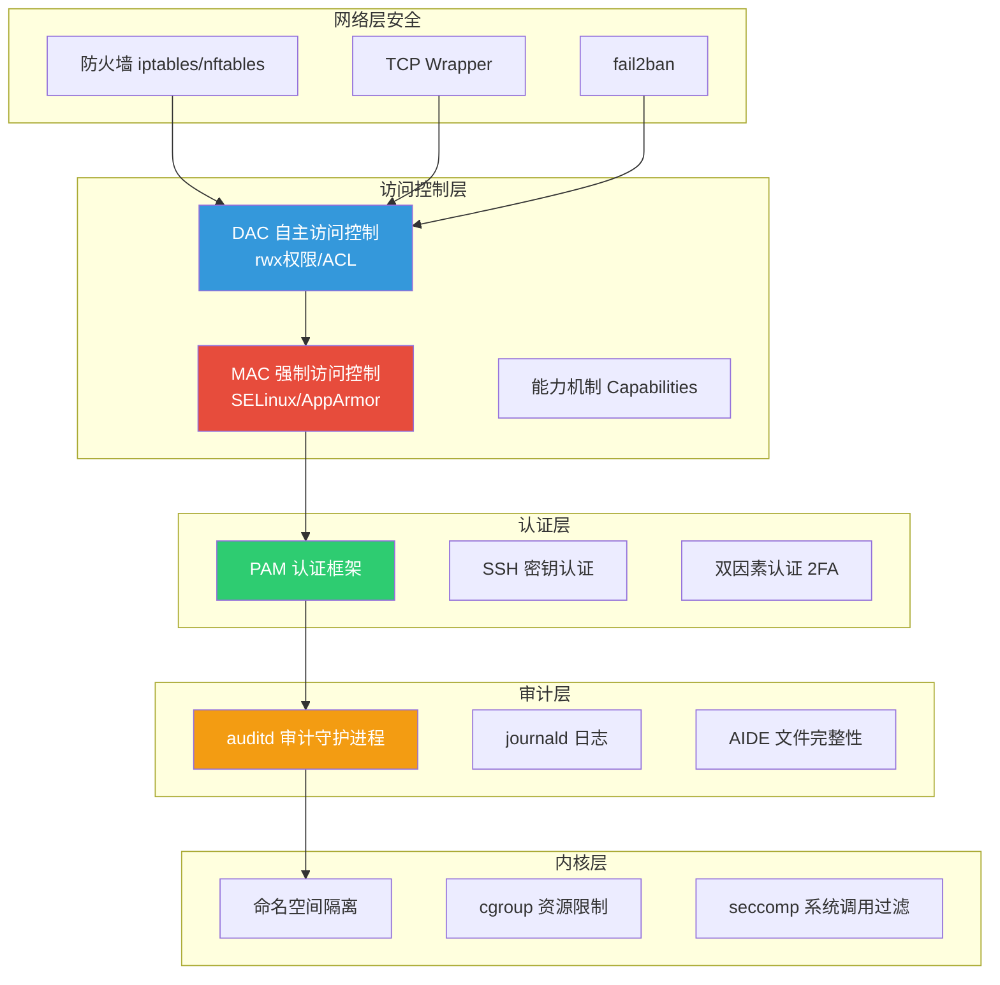
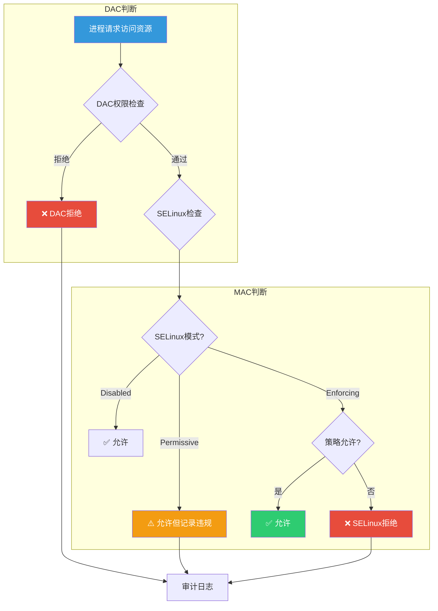
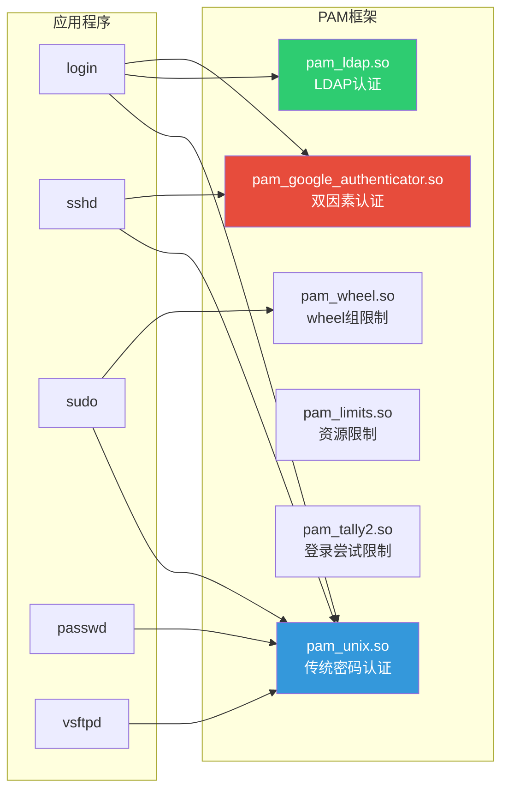
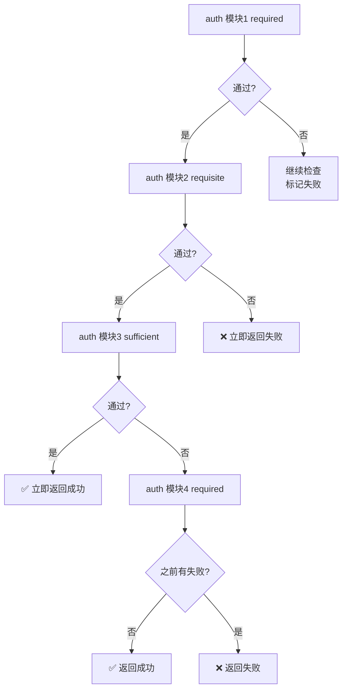
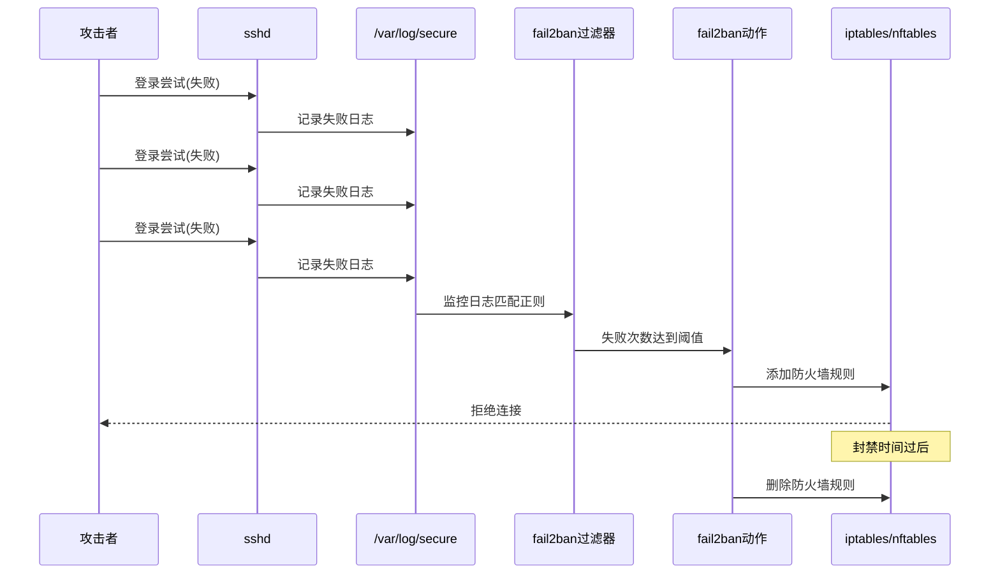

# 安全加固与审计

::: important 核心要点
Linux 安全是一个纵深防御体系，从访问控制（DAC/MAC）、认证框架（PAM）、文件完整性（AIDE）、审计追踪（auditd）到入侵检测（rkhunter），每一层都不可或缺。掌握安全加固是系统管理员的核心职责。
:::

## 1. Linux 安全模型

### 1.1 安全模型层级

Linux 安全模型是一个多层防御体系，从外到内逐层保护：



### 1.2 DAC（自主访问控制）

DAC（Discretionary Access Control）是 Linux 传统的权限模型，基于文件所有者的自主决定：

```bash
# 传统权限模型
-rwxr-xr-- 1 nginx nginx 4096 Jan 01 00:00 app.conf
# │├──┤├──┤├──┤
# │ │   │   └── 其他用户权限 (r--)
# │ │   └── 组权限 (r-x)
# │ └── 所有者权限 (rwx)
# └── 文件类型 (-)

# 数字表示
# r=4, w=2, x=1
# rwxr-xr-- = 754
chmod 754 app.conf
chown nginx:nginx app.conf
```

**ACL（访问控制列表）** 扩展了传统权限，支持更细粒度的控制：

```bash
# 查看 ACL
getfacl app.conf
# file: app.conf
# owner: nginx
# group: nginx
# user::rwx
# user:deploy:r-x          # 额外用户权限
# group::r-x
# group:dev:r--            # 额外组权限
# mask::r-x                # 有效权限掩码
# other::r--

# 设置 ACL
setfacl -m u:deploy:r-x app.conf       # 给用户 deploy 设置权限
setfacl -m g:dev:r-- app.conf           # 给组 dev 设置权限
setfacl -m d:u:deploy:r-x /opt/app/    # 设置默认 ACL（新文件继承）
setfacl -x u:deploy app.conf            # 删除用户 ACL
setfacl -b app.conf                     # 删除所有 ACL
```

::: tip ACL 掩码（mask）
ACL 的 mask 决定了命名用户和命名组的**最大有效权限**。即使给用户设置了 `rwx`，如果 mask 是 `r-x`，实际有效权限也只有 `r-x`。
:::

### 1.3 特殊权限位

| 权限 | 八进制 | 字母 | 作用 | 安全风险 |
|------|--------|------|------|----------|
| SUID | 4000 | u+s | 以文件所有者身份执行 | 高，提权攻击目标 |
| SGID | 2000 | g+s | 以文件所属组身份执行 | 中，组权限泄露 |
| Sticky | 1000 | t | 只有所有者可删除文件 | 低，保护共享目录 |

```bash
# SUID 示例：passwd 命令
ls -l /usr/bin/passwd
# -rwsr-xr-x 1 root root 68208 Jan 01 00:00 /usr/bin/passwd
#  ^ SUID 位，普通用户执行时以 root 身份运行

# SGID 示例：共享目录
mkdir /opt/shared
chmod 2775 /opt/shared
# 新文件自动继承目录的组

# Sticky 示例：/tmp 目录
ls -ld /tmp
# drwxrwxrwt 10 root root 4096 Jan 01 00:00 /tmp
#   ^ Sticky 位，用户只能删除自己的文件

# 查找所有 SUID 文件（安全审计常用）
find / -perm -4000 -type f 2>/dev/null

# 查找所有 SGID 文件
find / -perm -2000 -type f 2>/dev/null

# 查找无主的文件
find / -nouser -o -nogroup 2>/dev/null
```

::: warning SUID 安全风险
SUID 是最常见的提权攻击向量。攻击者常利用 SUID 程序的漏洞获取 root 权限：
1. 定期审计系统中的 SUID 文件
2. 移除不必要的 SUID 权限
3. 对必须保留的 SUID 程序，用 SELinux/AppArmor 限制其行为
:::

### 1.4 Linux Capabilities

传统的 root 拥有所有特权，Capabilities 将 root 权限分解为细粒度的能力单元：

```bash
# 查看文件的能力
getcap /usr/bin/ping
# /usr/bin/ping = cap_net_raw+ep

# 查看进程的能力
getpcaps $$
# Capabilities for `$$': = cap_chown,cap_dac_override,...

# 设置文件能力
sudo setcap cap_net_bind_service+ep /usr/bin/node  # 允许绑定特权端口
sudo setcap cap_net_raw+ep /usr/bin/myapp          # 允许原始套接字

# 删除文件能力
sudo setcap -r /usr/bin/node

# 查看所有设置了能力的文件
getcap -r / 2>/dev/null
```

| 能力 | 说明 | 典型用途 |
|------|------|----------|
| `CAP_NET_BIND_SERVICE` | 绑定 1024 以下端口 | Web 服务器 |
| `CAP_NET_RAW` | 使用原始套接字 | ping、tcpdump |
| `CAP_DAC_OVERRIDE` | 绕过文件权限检查 | 备份程序 |
| `CAP_SETUID` | 改变进程 UID | su、passwd |
| `CAP_SYS_ADMIN` | 系统管理操作 | mount、iptables |
| `CAP_CHOWN` | 改变文件所有者 | 文件管理 |
| `CAP_KILL` | 发送信号给其他进程 | 进程管理 |
| `CAP_SYS_PTRACE` | 跟踪进程 | 调试器 |

::: important 最小权限原则
- `CAP_SYS_ADMIN` 被称为"新的 root"，几乎等同于完全的 root 权限
- 生产环境中应尽量使用具体的 Capability 而非以 root 运行
- Docker 容器默认只授予少量 Capability
:::

## 2. SELinux

### 2.1 SELinux 概述

SELinux（Security-Enhanced Linux）是由 NSA（美国国家安全局）开发的强制访问控制（MAC）实现，已集成到 Linux 内核中。它通过安全策略对系统中的所有操作进行细粒度的访问控制，即使进程以 root 身份运行，也受 SELinux 策略约束。



::: important DAC + MAC 双重检查
SELinux 不会绕过 DAC。访问请求必须**同时**通过 DAC 和 MAC 检查才能成功：
1. 先检查 DAC（传统 rwx 权限），DAC 拒绝则直接拒绝
2. DAC 通过后，再检查 SELinux MAC 策略
3. 两者都通过才允许访问
:::

### 2.2 SELinux 三种模式

| 模式 | 说明 | 用途 |
|------|------|------|
| **Enforcing** | 强制模式，违反策略的操作被拒绝 | 生产环境 |
| **Permissive** | 宽容模式，违反策略仅记录不拒绝 | 调试/策略开发 |
| **Disabled** | 禁用模式，不加载任何策略 | 不推荐 |

```bash
# 查看当前模式
getenforce
# Enforcing

# 查看详细状态
sestatus
# SELinux status:                 enabled
# SELinuxfs mount:                /sys/fs/selinux
# SELinux root directory:         /etc/selinux
# Loaded policy name:             targeted
# Current mode:                   enforcing
# Mode from config file:          enforcing
# Policy MLS status:              enabled
# Policy deny_unknown status:     allowed
# Max kernel policy version:      33

# 临时切换模式（重启后恢复）
sudo setenforce 1    # Enforcing
sudo setenforce 0    # Permissive
# 注意：不能通过 setenforce 切换到 Disabled

# 永久切换模式（需要重启）
sudo vim /etc/selinux/config
# SELINUX=enforcing|permissive|disabled
```

::: warning 模式切换注意事项
1. **Enforcing ↔ Permissive**：可以在线切换，无需重启
2. **Disabled → Enforcing/Permissive**：必须重启，且需要先修复文件标签（`fixfiles relabel` 或 `touch /.autorelabel`）
3. **Enforcing/Permissive → Disabled**：必须重启
4. 生产环境**强烈建议**保持 Enforcing 模式
:::

### 2.3 SELinux 安全上下文

SELinux 通过**安全上下文**（Security Context）来标记进程和文件：

```bash
# 查看文件的安全上下文
ls -Z /var/www/html/
# unconfined_u:object_r:httpd_sys_content_t:s0 index.html

# 查看进程的安全上下文
ps -eZ | grep nginx
# system_u:system_r:httpd_t:s0    1234 ?  00:00:00 nginx

# 查看端口的安全上下文
semanage port -l | grep http
# http_port_t                    tcp      80, 81, 443, 488, 8008, 8009, 8443, 9000

# 查看用户的安全上下文
id -Z
# unconfined_u:unconfined_r:unconfined_t:s0-s0:c0.c1023
```

安全上下文的四个字段：

```
user:role:type:sensitivity
 │    │    │      │
 │    │    │      └── 安全级别（MLS/MCS）
 │    │    └── 类型（Type，最重要的字段）
 │    └── 角色（Role）
 └── 用户（SELinux 用户，非 Linux 用户）
```

**Type（类型）是 SELinux 策略的核心**，绝大多数策略规则都是基于 Type 定义的：

| 类型 | 说明 | 示例 |
|------|------|------|
| `httpd_t` | httpd 进程域 | Nginx/Apache 进程 |
| `httpd_sys_content_t` | httpd 可读内容 | /var/www/html/ 文件 |
| `httpd_sys_rw_content_t` | httpd 可读写内容 | 上传目录 |
| `httpd_log_t` | httpd 日志 | /var/log/httpd/ 文件 |
| `httpd_config_t` | httpd 配置 | /etc/httpd/ 文件 |
| `mysqld_t` | MySQL 进程域 | MySQL/MariaDB 进程 |
| `sshd_t` | sshd 进程域 | SSH 守护进程 |

### 2.4 SELinux 策略类型

| 策略 | 说明 | 适用场景 |
|------|------|----------|
| **targeted** | 仅针对网络服务的类型强制 | RHEL/CentOS 默认，推荐 |
| **mls** | 多级安全策略 | 军事/政府环境 |
| **minimum** | 最小策略 | 嵌入式/测试 |

```bash
# 查看当前策略
sestatus | grep "Loaded policy name"

# 大多数生产系统使用 targeted 策略
# 它只对网络服务进程实施强制访问控制
# 用户进程运行在 unconfined_t 域，不受 SELinux 限制
```

### 2.5 SELinux 布尔值

布尔值是 SELinux 策略的运行时开关，允许在不重新编译策略的情况下调整策略行为：

```bash
# 查看所有布尔值
getsebool -a

# 查看特定布尔值
getsebool httpd_can_network_connect
# httpd_can_network_connect --> off

# 设置布尔值（立即生效）
sudo setsebool httpd_can_network_connect on

# 设置布尔值（永久生效）
sudo setsebool -P httpd_can_network_connect on

# 常用布尔值
getsebool httpd_can_network_connect_db   # httpd 连接数据库
getsebool httpd_can_network_connect      # httpd 网络连接
getsebool httpd_enable_homedirs          # httpd 访问家目录
getsebool httpd_unified                  # httpd 统一读写
getsebool nis_enabled                    # NIS 服务
getsebool ssh_use_passwd                 # SSH 密码认证
```

### 2.6 SELinux 故障排查

```bash
# ===== 查看 SELinux 拒绝日志 =====
# 方法一：ausearch
sudo ausearch -m AVC,USER_AVC,SELINUX_ERR -ts recent

# 方法二：journalctl
journalctl -t setroubleshoot --since "1 hour ago"

# 方法三：dmesg
dmesg | grep -i selinux

# 方法四：sealert（需要 setroubleshootd）
sudo sealert -a /var/log/audit/audit.log

# ===== 使用 setroubleshoot 排查 =====
# 安装
sudo dnf install setroubleshoot-server

# 查看最近的 AVC 拒绝及建议
sudo sealert -l $(sudo ausearch -m AVC -ts recent | grep audit | tail -1 | awk '{print $2}')

# 输出示例：
# SELinux is preventing /usr/sbin/nginx from name_connect access on the tcp_socket.
#
# *****  Plugin catchall_boolean (89.3 confidence) suggests   ******************
#
# If you want to allow httpd to can network connect
# Then you must tell SELinux about this by enabling the 'httpd_can_network_connect' boolean.
#
# Do
# setsebool -P httpd_can_network_connect 1
```

### 2.7 修改 SELinux 上下文

```bash
# ===== 临时修改（重启后失效） =====
sudo chcon -t httpd_sys_content_t /opt/www/index.html
sudo chcon -R -t httpd_sys_content_t /opt/www/          # 递归修改
sudo chcon -u system_u -r object_r -t httpd_sys_content_t /opt/www/index.html  # 完整上下文
sudo chcon --reference=/var/www/html/ /opt/www/          # 参考文件上下文

# ===== 永久修改（推荐） =====
# 添加文件上下文规则
sudo semanage fcontext -a -t httpd_sys_content_t "/opt/www(/.*)?"
sudo semanage fcontext -a -t httpd_sys_rw_content_t "/opt/www/uploads(/.*)?"
sudo semanage fcontext -a -t httpd_log_t "/opt/www/logs(/.*)?"

# 应用规则
sudo restorecon -Rv /opt/www/

# 查看自定义规则
sudo semanage fcontext -l | grep /opt/www

# 删除自定义规则
sudo semanage fcontext -d "/opt/www(/.*)?"
sudo restorecon -Rv /opt/www/
```

```bash
# ===== 修改端口上下文 =====
# 允许 httpd 监听 8080 端口
sudo semanage port -a -t http_port_t -p tcp 8080

# 查看端口上下文
sudo semanage port -l | grep http_port_t

# 删除端口上下文
sudo semanage port -d -t http_port_t -p tcp 8080

# 修改端口上下文（已存在的端口类型）
sudo semanage port -m -t http_port_t -p tcp 8080
```

::: tip chcon vs semanage + restorecon
- `chcon`：临时修改，文件系统重新标记后会丢失
- `semanage fcontext` + `restorecon`：永久修改，记录在策略中
- **生产环境必须使用 semanage + restorecon**
:::

### 2.8 SELinux 实战案例

#### Nginx 代理后端被 SELinux 拒绝

```bash
# 问题：Nginx 反向代理到后端 127.0.0.1:3000 报 502

# 1. 检查是否有 AVC 拒绝
sudo ausearch -m AVC -ts recent | grep nginx
# type=AVC msg=audit(...): avc:  denied  { name_connect } for pid=1234 comm="nginx" dest=3000

# 2. 使用 sealert 分析
sudo sealert -a /var/log/audit/audit.log | grep -A 5 "nginx"

# 3. 解决方案：开启布尔值
sudo setsebool -P httpd_can_network_connect 1

# 4. 验证
curl -I http://localhost/
```

#### 自定义 Web 目录无法访问

```bash
# 问题：Nginx 无法读取 /opt/myapp/www/ 目录

# 1. 检查 AVC 拒绝
sudo ausearch -m AVC -ts recent

# 2. 添加文件上下文
sudo semanage fcontext -a -t httpd_sys_content_t "/opt/myapp/www(/.*)?"
sudo restorecon -Rv /opt/myapp/www/

# 3. 验证
ls -Z /opt/myapp/www/
```

## 3. AppArmor

### 3.1 AppArmor 概述

AppArmor 是另一种 Linux MAC 实现，与 SELinux 的主要区别：

| 特性 | SELinux | AppArmor |
|------|---------|----------|
| 策略模型 | 基于标签（Label） | 基于路径（Path） |
| 学习曲线 | 陡峭 | 较平缓 |
| 默认发行版 | RHEL/CentOS/Fedora | Ubuntu/SUSE |
| 粒度 | 更细 | 适中 |
| 策略语言 | 复杂（需编译） | 简单（纯文本） |
| 文件系统支持 | 需要支持 xattr | 无特殊要求 |

```bash
# 查看 AppArmor 状态
sudo aa-status
# apparmor module is loaded.
# 45 profiles are loaded.
# 45 profiles are in enforce mode.
# 0 profiles are in complain mode.

# 查看已加载的 profile
sudo aa-status --profiles

# 查看进程的 profile
sudo aa-status --procs
```

### 3.2 AppArmor Profile

Profile 定义了程序的访问控制规则：

```bash
# 查看 profile 文件
ls /etc/apparmor.d/
# usr.sbin.nginx    usr.sbin.mysqld    usr.sbin.sshd

# 查看 Nginx profile
cat /etc/apparmor.d/usr.sbin.nginx
```

```ini
# /etc/apparmor.d/usr.sbin.nginx
#include <tunables/global>

/usr/sbin/nginx {
  #include <abstractions/base>
  #include <abstractions/nameservice>
  #include <abstractions/openssl>

  # 网络能力
  capability net_bind_service,
  capability setgid,
  capability setuid,

  # 网络规则
  network inet tcp,
  network inet6 tcp,
  network inet udp,
  network inet6 udp,
  network unix stream,

  # 文件读取
  /etc/nginx/** r,
  /usr/share/nginx/** r,
  /var/log/nginx/* rw,
  /var/lib/nginx/** rw,

  # 临时文件
  /tmp/** rw,

  # 拒绝所有其他
  deny /etc/shadow r,
  deny /root/** rwx,
}
```

### 3.3 Profile 模式

| 模式 | 说明 | 行为 |
|------|------|------|
| **enforce** | 强制模式 | 违规操作被拒绝并记录 |
| **complain** | 投诉模式 | 违规操作仅记录不拒绝 |
| **unconfined** | 未限制 | 不加载任何 profile |

```bash
# 切换 profile 模式
sudo aa-enforce /etc/apparmor.d/usr.sbin.nginx    # 切换到 enforce
sudo aa-complain /etc/apparmor.d/usr.sbin.nginx    # 切换到 complain

# 禁用 profile
sudo aa-disable /etc/apparmor.d/usr.sbin.nginx

# 重新加载 profile
sudo apparmor_parser -r /etc/apparmor.d/usr.sbin.nginx

# 查看进程是否受限
cat /proc/$(pidof nginx)/attr/current
# enforce
```

### 3.4 创建自定义 Profile

```bash
# 方法一：使用 aa-genprof 自动生成
sudo aa-genprof /opt/myapp/bin/myapp
# 然后在另一个终端操作应用，aa-genprof 会记录并生成规则

# 方法二：使用 aa-logprof 从日志生成
sudo aa-logprof /opt/myapp/bin/myapp

# 方法三：手动创建
sudo vim /etc/apparmor.d/opt.myapp.bin.myapp
```

```ini
# /etc/apparmor.d/opt.myapp.bin.myapp
#include <tunables/global>

/opt/myapp/bin/myapp {
  #include <abstractions/base>
  #include <abstractions/nameservice>

  # 允许的网络操作
  network inet tcp,
  network inet udp,

  # 允许的能力
  capability net_bind_service,

  # 配置文件（只读）
  /etc/myapp/** r,

  # 数据目录（读写）
  /var/lib/myapp/** rw,
  /var/lib/myapp/ rw,

  # 日志（读写）
  /var/log/myapp/** rw,

  # 临时文件
  /tmp/** rw,

  # 明确拒绝
  deny /etc/passwd w,
  deny /etc/shadow r,
  deny /root/** rwx,
}
```

```bash
# 加载 profile
sudo apparmor_parser -a /etc/apparmor.d/opt.myapp.bin.myapp

# 验证
sudo aa-status | grep myapp
```

### 3.5 AppArmor 故障排查

```bash
# 查看 AppArmor 拒绝日志
sudo dmesg | grep -i apparmor
sudo journalctl -k | grep -i apparmor
sudo cat /var/log/syslog | grep -i apparmor
sudo cat /var/log/kern.log | grep -i apparmor

# 典型的拒绝日志：
# apparmor="DENIED" operation="open" profile="/usr/sbin/nginx" name="/etc/myapp/config.yml" pid=1234 comm="nginx" requested_mask="r" denied_mask="r" fsuid=33 ouid=0

# 修复方法：在 profile 中添加缺失的规则
# /etc/myapp/config.yml r,
# 然后重新加载 profile
sudo apparmor_parser -r /etc/apparmor.d/usr.sbin.nginx
```

## 4. PAM 认证框架

### 4.1 PAM 概述

PAM（Pluggable Authentication Modules）是 Linux 的可插拔认证框架，将程序的认证逻辑与认证实现分离：



### 4.2 PAM 配置文件

PAM 配置文件位于 `/etc/pam.d/` 目录下，每个服务一个文件：

```bash
# 查看 SSH 的 PAM 配置
cat /etc/pam.d/sshd
```

```
#%PAM-1.0
auth       required     pam_sepermit.so
auth       substack     password-auth
auth       include      postlogin
account    required     pam_nologin.so
account    include      password-auth
password   include      password-auth
session    required     pam_limits.so
session    required     pam_selinux.so close
session    required     pam_loginuid.so
session    required     pam_selinux.so open env_params
session    required     pam_namespace.so
session    optional     pam_keyinit.so force revoke
session    include      password-auth
session    include      postlogin
```

### 4.3 PAM 管理组与控制标志

PAM 有四个管理组，按顺序处理：

| 管理组 | 说明 | 调用时机 |
|--------|------|----------|
| **auth** | 认证 | 验证用户身份（密码、密钥等） |
| **account** | 账户 | 检查账户是否可用（过期、锁定等） |
| **password** | 密码 | 更新认证令牌（修改密码） |
| **session** | 会话 | 管理会话（资源限制、日志等） |

控制标志决定了模块失败后的行为：

| 控制标志 | 失败后行为 | 说明 |
|----------|-----------|------|
| **required** | 继续检查后续模块，最终返回失败 | 必须通过，但不立即暴露哪个模块失败 |
| **requisite** | 立即返回失败 | 必须通过，立即暴露失败 |
| **sufficient** | 通过则立即返回成功（跳过后续） | 通过即可，但非必要 |
| **optional** | 不影响最终结果 | 可选模块 |
| **include** | 包含其他配置文件 | 引用共享配置 |
| **substack** | 作为子栈包含 | 类似 include，但控制流不同 |



### 4.4 常用 PAM 模块

| 模块 | 功能 | 配置示例 |
|------|------|----------|
| `pam_unix.so` | 传统 /etc/shadow 密码认证 | `auth required pam_unix.so` |
| `pam_ldap.so` | LDAP 目录认证 | `auth sufficient pam_ldap.so` |
| `pam_wheel.so` | 限制 su 到 wheel 组 | `auth required pam_wheel.so use_uid` |
| `pam_tally2.so` | 登录失败锁定 | `auth required pam_tally2.so deny=5 unlock_time=900` |
| `pam_google_authenticator.so` | Google 2FA | `auth required pam_google_authenticator.so` |
| `pam_limits.so` | 资源限制 | `session required pam_limits.so` |
| `pam_nologin.so` | 拒绝非 root 登录 | `account required pam_nologin.so` |
| `pam_time.so` | 时间限制 | `account required pam_time.so` |
| `pam_access.so` | 访问控制 | `account required pam_access.so` |
| `pam_faildelay.so` | 登录失败延迟 | `auth optional pam_faildelay.so delay=5000000` |
| `pam_rootok.so` | root 免密 | `auth sufficient pam_rootok.so` |

### 4.5 PAM 实战配置

#### 配置 SSH 双因素认证

```bash
# 1. 安装 Google Authenticator PAM 模块
sudo dnf install google-authenticator-libpam
# 或
sudo apt install libpam-google-authenticator

# 2. 为用户生成密钥
google-authenticator
# 按提示扫描二维码，保存紧急码

# 3. 修改 SSH PAM 配置
sudo vim /etc/pam.d/sshd
```

```
# 在 auth 段开头添加
auth       required     pam_google_authenticator.so nullok

# nullok 表示未配置 2FA 的用户不受影响
# 生产环境建议去掉 nullok，强制所有用户使用 2FA
```

```bash
# 4. 修改 SSH 配置
sudo vim /etc/ssh/sshd_config
```

```
ChallengeResponseAuthentication yes
AuthenticationMethods publickey,keyboard-interactive
# 或: AuthenticationMethods password,keyboard-interactive
```

```bash
# 5. 重启 SSH
sudo systemctl restart sshd
```

#### 配置登录失败锁定

```bash
sudo vim /etc/pam.d/password-auth
```

```
# 在 auth 段开头添加（必须在 pam_unix 之前）
auth       required     pam_faillock.so preauth silent deny=5 unlock_time=900
auth       [default=die] pam_faillock.so authfail deny=5 unlock_time=900

# 在 account 段添加
account    required     pam_faillock.so
```

```bash
# 查看用户失败记录
sudo faillock --user username

# 解锁用户
sudo faillock --user username --reset
```

#### 配置 su 限制

```bash
sudo vim /etc/pam.d/su
```

```
# 取消注释以下行，限制只有 wheel 组成员可以 su
auth       required     pam_wheel.so use_uid
```

```bash
# 将用户加入 wheel 组
sudo usermod -aG wheel username
```

## 5. 文件完整性检查

### 5.1 AIDE（Advanced Intrusion Detection Environment）

AIDE 是最常用的文件完整性检查工具，通过对比文件指纹来检测篡改：

```bash
# 安装 AIDE
sudo dnf install aide
# 或
sudo apt install aide

# 初始化数据库
sudo aideinit
# 或
sudo aide --init

# 将初始数据库复制为基准数据库
sudo cp /var/lib/aide/aide.db.new.gz /var/lib/aide/aide.db.gz

# 执行检查
sudo aide --check

# 更新数据库（确认变更合法后）
sudo aide --update
sudo cp /var/lib/aide/aide.db.new.gz /var/lib/aide/aide.db.gz
```

#### AIDE 配置

```ini
# /etc/aide.conf

# 定义检查规则
NORMAL = sha256+sha512+fsize+mtime+ctime
PERMS = p+u+g+acl+xattrs
DATAONLY = sha256+sha512+fsize+mtime+ctime+inode+links

# 应用规则到目录
/etc NORMAL
/etc/ssh PERMS
/var/log DATAONLY
/var/lib DATAONLY

# 排除频繁变化的目录
!/var/log/.*\.log$
!/var/lib/aide/.*
!/proc/.*
!/sys/.*
!/dev/.*
!/run/.*
```

#### AIDE 检查属性

| 属性 | 说明 |
|------|------|
| `p` | 权限 |
| `i` | inode |
| `n` | 链接数 |
| `u` | 用户 |
| `g` | 组 |
| `s` | 大小 |
| `S` | 大小（增长检测） |
| `m` | 修改时间 (mtime) |
| `c` | 属性变更时间 (ctime) |
| `acl` | ACL |
| `xattrs` | 扩展属性 |
| `sha256` | SHA-256 校验和 |
| `sha512` | SHA-512 校验和 |
| `rmd160` | RIPEMD-160 校验和 |

#### 设置定时检查

```bash
# 创建 AIDE 检查服务
sudo vim /etc/systemd/system/aide-check.service
```

```ini
[Unit]
Description=AIDE File Integrity Check
OnFailure=aide-notify.service

[Service]
Type=oneshot
ExecStart=/usr/sbin/aide --check
```

```bash
# 创建定时器
sudo vim /etc/systemd/system/aide-check.timer
```

```ini
[Unit]
Description=Daily AIDE Check

[Timer]
OnCalendar=*-*-* 03:00:00
Persistent=true
RandomizedDelaySec=30min

[Install]
WantedBy=timers.target
```

```bash
sudo systemctl enable --now aide-check.timer
```

### 5.2 Tripwire

Tripwire 是另一个文件完整性检查工具，商业版功能更全面：

```bash
# 安装
sudo dnf install tripwire

# 初始化
sudo tripwire --init

# 检查
sudo tripwire --check

# 更新数据库（确认变更合法后）
sudo tripwire --update -r /var/lib/tripwire/report/*.twr

# 更新策略
sudo tripwire --update-policy /etc/tripwire/twpol.txt
```

### 5.3 AIDE vs Tripwire

| 特性 | AIDE | Tripwire |
|------|------|----------|
| 许可证 | GPL | 开源版 GPL / 商业版付费 |
| 数据库签名 | 无 | 有（防止篡改数据库本身） |
| 配置复杂度 | 较低 | 较高 |
| 报告格式 | 纯文本 | 多种格式 |
| 邮件通知 | 需额外配置 | 内置支持 |
| 社区活跃度 | 活跃 | 较低 |

## 6. 审计系统（auditd）

### 6.1 auditd 概述

auditd 是 Linux 审计系统的用户空间守护进程，负责记录系统安全事件。与 syslog 不同，auditd 的日志不可伪造，且对性能影响极小：

```mermaid
graph LR
    subgraph 审计规则源
        A[auditctl 临时规则]
        B[/etc/audit/rules.d/ 持久规则]
    end

    subgraph 内核审计子系统
        C[审计规则引擎]
        D[系统调用拦截]
    end

    subgraph auditd
        E[日志收集]
        F[日志写入]
        G[日志轮转]
    end

    subgraph 日志存储
        H[/var/log/audit/audit.log]
    end

    subgraph 查询工具
        I[ausearch]
        J[aureport]
    end

    A --> C
    B --> C
    D --> C
    C --> E
    E --> F
    F --> G
    G --> H
    H --> I
    H --> J

    style C fill:#e74c3c,color:#fff
    style H fill:#3498db,color:#fff
```

### 6.2 安装与配置

```bash
# 安装
sudo dnf install audit audispd-plugins
# 或
sudo apt install auditd audispd-plugins

# 启动并启用
sudo systemctl enable --now auditd

# 查看状态
sudo systemctl status auditd
```

auditd 配置文件：

```ini
# /etc/audit/auditd.conf
log_file = /var/log/audit/audit.log
log_format = RAW
log_group = root
priority_boost = 4
flush = INCREMENTAL_ASYNC
freq = 50
max_log_file = 100          # 单文件最大 100MB
num_logs = 5                # 保留 5 个日志文件
max_log_file_action = ROTATE
space_left = 75             # 剩余空间 75MB 时告警
space_left_action = SYSLOG
admin_space_left = 50       # 剩余空间 50MB 时动作
admin_space_left_action = SUSPEND
disk_full_action = SUSPEND   # 磁盘满时挂起审计
disk_error_action = SUSPEND
```

### 6.3 审计规则管理

```bash
# ===== 查看当前规则 =====
sudo auditctl -l

# ===== 添加临时规则 =====

# 监控文件访问
sudo auditctl -w /etc/passwd -p wa -k passwd_changes
# -w: 监控路径
# -p: 权限 (r=读, w=写, x=执行, a=属性变更)
# -k: 标记键名

# 监控目录
sudo auditctl -w /etc/ssh/ -p wa -k ssh_config

# 监控系统调用
sudo auditctl -a always,exit -F arch=b64 -S unlink -S unlinkat -S rename -S renameat -k file_delete

# 监控特定用户
sudo auditctl -a always,exit -F arch=b64 -F auid=1000 -S execve -k user_commands

# 监控特权命令
sudo auditctl -a always,exit -F arch=b64 -S mount -F auid>=1000 -F auid!=4294967295 -k mounts

# ===== 删除规则 =====
sudo auditctl -D                    # 删除所有规则
sudo auditctl -d -w /etc/passwd     # 删除特定规则

# ===== 添加持久规则 =====
sudo vim /etc/audit/rules.d/audit.rules
```

### 6.4 CIS Benchmark 审计规则

```ini
# /etc/audit/rules.d/audit.rules
# CIS Benchmark 推荐的审计规则

# 删除已有规则
-D

# 设置缓冲区大小
-b 8192

# 失败模式
-f 1

# ===== 身份验证事件 =====
-w /var/log/lastlog -p wa -k logins
-w /var/run/faillock/ -p wa -k logins

# ===== 会话事件 =====
-w /var/run/utmp -p wa -k session
-w /var/log/wtmp -p wa -k logins
-w /var/log/btmp -p wa -k logins

# ===== 用户/组修改 =====
-w /etc/group -p wa -k group_changes
-w /etc/passwd -p wa -k passwd_changes
-w /etc/shadow -p wa -k shadow_changes
-w /etc/gshadow -p wa -k gshadow_changes

# ===== 网络配置 =====
-w /etc/hosts -p wa -k network_changes
-a always,exit -F arch=b64 -S sethostname -S setdomainname -k network_changes

# ===== 系统时间修改 =====
-a always,exit -F arch=b64 -S clock_settime -k time_changes
-w /etc/localtime -p wa -k time_changes

# ===== SELinux 修改 =====
-w /etc/selinux/ -p wa -k selinux_changes

# ===== 特权命令 =====
-a always,exit -F arch=b64 -S chown -S chmod -S lchown -F auid>=1000 -F auid!=4294967295 -k perm_mod
-a always,exit -F arch=b64 -S chmod -F auid>=1000 -F auid!=4294967295 -k perm_mod
-a always,exit -F arch=b64 -S fchmod -F auid>=1000 -F auid!=4294967295 -k perm_mod
-a always,exit -F arch=b64 -S fchmodat -F auid>=1000 -F auid!=4294967295 -k perm_mod

# ===== 文件删除 =====
-a always,exit -F arch=b64 -S unlink -S unlinkat -S rename -S renameat -F auid>=1000 -F auid!=4294967295 -k file_delete

# ===== sudo 命令 =====
-w /etc/sudoers -p wa -k sudo_changes
-w /etc/sudoers.d/ -p wa -k sudo_changes

# ===== 内核模块 =====
-a always,exit -F arch=b64 -S init_module -S delete_module -k kernel_modules
-a always,exit -F arch=b64 -S finit_module -k kernel_modules

# ===== 挂载操作 =====
-a always,exit -F arch=b64 -S mount -S umount2 -F auid>=1000 -F auid!=4294967295 -k mounts

# ===== 系统关闭/重启 =====
-a always,exit -F arch=b64 -S reboot -S kexec_load -k system_shutdown

# 不可变规则（防止运行时修改）
-e 2
```

::: warning 不可变规则
`-e 2` 将审计规则设为不可变，需要重启才能修改。这在安全要求高的环境中防止攻击者禁用审计。但在调试阶段建议使用 `-e 1` 或不设置。
:::

### 6.5 审计日志查询

```bash
# ===== ausearch 基本查询 =====

# 按键名查询
sudo ausearch -k passwd_changes

# 按时间查询
sudo ausearch -ts today
sudo ausearch -ts "01/01/2024 00:00:00" -te "01/02/2024 00:00:00"
sudo ausearch -ts recent        # 最近 10 分钟

# 按用户查询
sudo ausearch -ua 1000          # UID 1000
sudo ausearch -ua root          # root 用户

# 按系统调用查询
sudo ausearch -sc open,openat -sv no    # 被拒绝的 open 调用

# 按类型查询
sudo ausearch -m USER_LOGIN -sv no      # 登录失败
sudo ausearch -m AVC                    # SELinux 拒绝
sudo ausearch -m USER_ACCT              # 账户事件

# 按文件查询
sudo ausearch -f /etc/passwd

# 按命令查询
sudo ausearch -x /usr/bin/passwd

# 组合查询
sudo ausearch -k passwd_changes -ts today -sv yes

# ===== aureport 生成报告 =====

# 总体报告
sudo aureport

# 登录报告
sudo aureport -l

# 用户报告
sudo aureport -u

# 文件访问报告
sudo aureport -f

# 系统调用报告
sudo aureport -s

# SELinux AVC 报告
sudo aureport -a

# 按键名报告
sudo aureport -k

# 生成今日摘要
sudo aureport -ts today --summary

# 生成可读的详细报告
sudo aureport -l -i    # -i 解释数字 ID
sudo aureport -f -i
```

### 6.6 审计日志解读

```
type=SYSCALL msg=audit(1704067200.123:456): arch=c000003e syscall=2 success=yes exit=3
a0=7ffd12345678 a1=0 a2=0 a3=0 items=1 ppid=1234 pid=5678 auid=1000 uid=0 gid=0
euid=0 suid=0 fsuid=0 egid=0 sgid=0 fsgid=0 tty=pts0 ses=1 comm="cat"
exe="/usr/bin/cat" key="passwd_changes"

type=PATH msg=audit(1704067200.123:456): item=0 name="/etc/passwd" inode=123456
dev=08:01 mode=0100644 ouid=0 ogid=0 rdev=00:00 obj=system_u:object_r:etc_t:s0
```

| 字段 | 含义 |
|------|------|
| `msg=audit(1704067200.123:456)` | 时间戳:序列号 |
| `arch=c000003e` | 系统架构（x86_64） |
| `syscall=2` | 系统调用号（2=open） |
| `success=yes` | 操作是否成功 |
| `exit=3` | 返回值（文件描述符） |
| `auid=1000` | 审计 UID（登录 UID） |
| `uid=0` | 实际 UID |
| `comm="cat"` | 命令名 |
| `exe="/usr/bin/cat"` | 可执行文件路径 |
| `key="passwd_changes"` | 规则标记键名 |

## 7. 入侵检测

### 7.1 rkhunter（Rootkit Hunter）

rkhunter 检测已知的 rootkit、后门和本地提权漏洞：

```bash
# 安装
sudo dnf install rkhunter
# 或
sudo apt install rkhunter

# 更新数据库
sudo rkhunter --update
sudo rkhunter --propupd     # 更新文件属性数据库

# 执行检查
sudo rkhunter --check
# 交互式，逐项询问

# 非交互式检查
sudo rkhunter --check --skip-keypress

# 仅显示警告
sudo rkhunter --check --skip-keypress --report-warnings-only

# 查看报告
cat /var/log/rkhunter/rkhunter.log | grep -i warning
```

#### rkhunter 配置

```ini
# /etc/rkhunter.conf
MAIL-ON-WARNING=admin@example.com
REPORT_MODE=NOKEYPRESS
ALLOW_SSH_ROOT_USER=no
ALLOW_SSH_PROTECTED_PW=no
ALLOW_SSH_PROT_V01=no
ALLOW_SSH_PROT_V11=no
DISABLE_TESTS=suspscan hidden_ports hidden_procs deleted_files packet_cap_apps apps
# suspscan 误报率高，可根据需要禁用

# 允许的隐藏文件/目录
ALLOWHIDDENDIR=/etc/.java
ALLOWHIDDENDIR=/dev/.udev
ALLOWHIDDENFILE=/etc/.gitignore

# 允许的脚本变更
SCRIPTWHITELIST=/usr/bin/ldd
SCRIPTWHITELIST=/usr/bin/lwp-request
```

### 7.2 chkrootkit

chkrootkit 是另一个 rootkit 检测工具，与 rkhunter 互补使用：

```bash
# 安装
sudo dnf install chkrootkit
# 或
sudo apt install chkrootkit

# 执行检查
sudo chkrootkit

# 仅检查特定 rootkit
sudo chkrootkit -l                  # 列出可检测的 rootkit
sudo chkrootkit -x | head -20      # 调试模式

# 常见输出：
# Checking `sniffer'... eth0: PF_PACKET(/sbin/dhclient)
# Checking `wted'... nothing deleted
# Checking `z2'... nothing deleted
# INFECTED: (PORTS: 465)           # 发现异常

# 重定向输出
sudo chkrootkit 2>&1 | tee /tmp/chkrootkit-$(date +%Y%m%d).log
```

### 7.3 定期自动检测

```bash
# 创建检测服务
sudo vim /etc/systemd/system/rkhunter-check.service
```

```ini
[Unit]
Description=Rootkit Hunter Check
OnFailure=security-notify.service

[Service]
Type=oneshot
ExecStart=/usr/bin/rkhunter --check --skip-keypress --report-warnings-only
```

```bash
sudo vim /etc/systemd/system/rkhunter-check.timer
```

```ini
[Unit]
Description=Weekly Rootkit Hunter Check

[Timer]
OnCalendar=weekly
Persistent=true

[Install]
WantedBy=timers.target
```

```bash
sudo systemctl enable --now rkhunter-check.timer
```

## 8. CIS Benchmark

### 8.1 CIS Benchmark 概述

CIS（Center for Internet Security）Benchmark 是业界公认的系统安全配置标准，提供分级的加固建议：

- **Level 1**：基本安全，影响最小，强烈推荐
- **Level 2**：深度安全，可能影响功能性，推荐在安全要求高的环境

### 8.2 关键加固项

#### 文件系统加固

```bash
# 1. 禁用不必要的文件系统
echo "install cramfs /bin/true" >> /etc/modprobe.d/disable-fs.conf
echo "install freevxfs /bin/true" >> /etc/modprobe.d/disable-fs.conf
echo "install jffs2 /bin/true" >> /etc/modprobe.d/disable-fs.conf
echo "install hfs /bin/true" >> /etc/modprobe.d/disable-fs.conf
echo "install hfsplus /bin/true" >> /etc/modprobe.d/disable-fs.conf
echo "install squashfs /bin/true" >> /etc/modprobe.d/disable-fs.conf
echo "install udf /bin/true" >> /etc/modprobe.d/disable-fs.conf
echo "install fat /bin/true" >> /etc/modprobe.d/disable-fs.conf
echo "install vfat /bin/true" >> /etc/modprobe.d/disable-fs.conf
echo "install ntfs /bin/true" >> /etc/modprobe.d/disable-fs.conf

# 2. 确保 /tmp 挂载为独立分区
# /etc/fstab
tmpfs /tmp tmpfs defaults,rw,nosuid,nodev,noexec,relatime 0 0

# 3. 确保 /var/log 挂载为独立分区
# 4. 确保 /home 挂载为独立分区
# 5. 禁用 USB 存储
echo "install usb-storage /bin/true" >> /etc/modprobe.d/disable-usb.conf
```

#### 内核参数加固

```bash
# /etc/sysctl.d/60-security.conf

# 禁用 IP 转发（非路由器）
net.ipv4.ip_forward = 0

# 禁用源路由
net.ipv4.conf.all.accept_source_route = 0
net.ipv4.conf.default.accept_source_route = 0

# 禁用 ICMP 重定向
net.ipv4.conf.all.accept_redirects = 0
net.ipv4.conf.default.accept_redirects = 0
net.ipv6.conf.all.accept_redirects = 0
net.ipv6.conf.default.accept_redirects = 0

# 禁止发送 ICMP 重定向
net.ipv4.conf.all.send_redirects = 0
net.ipv4.conf.default.send_redirects = 0

# 启用反向路径过滤
net.ipv4.conf.all.rp_filter = 1
net.ipv4.conf.default.rp_filter = 1

# 启用 SYN cookies
net.ipv4.tcp_syncookies = 1

# 禁用 IPv6（如不需要）
net.ipv6.conf.all.disable_ipv6 = 1
net.ipv6.conf.default.disable_ipv6 = 1

# 禁止核心转储给 SUID 程序
fs.suid_dumpable = 0

# 启用 ASLR
kernel.randomize_va_space = 2

# 禁止加载内核模块
# kernel.modules_disabled = 1    # 注意：设为 1 后无法再加载模块，需重启

# 限制 dmesg
kernel.dmesg_restrict = 1

# 限制 /proc/kcore
kernel.kptr_restrict = 2

# 应用配置
sudo sysctl --system
```

#### 用户与认证加固

```bash
# 1. 设置密码策略
sudo vim /etc/security/pwquality.conf
```

```ini
# /etc/security/pwquality.conf
minlen = 14                  # 最小长度 14
minclass = 4                 # 至少包含 4 种字符类
dcredit = -1                 # 至少 1 个数字
ucredit = -1                 # 至少 1 个大写字母
lcredit = -1                 # 至少 1 个小写字母
ocredit = -1                 # 至少 1 个特殊字符
maxrepeat = 3                # 最多连续重复 3 次
maxclassrepeat = 4           # 最多连续同类字符 4 次
difok = 8                    # 与旧密码至少 8 个字符不同
remember = 5                 # 记住最近 5 个密码
enforcing = 1                # 强制执行
```

```bash
# 2. 设置登录定义
sudo vim /etc/login.defs
```

```ini
# /etc/login.defs
PASS_MAX_DAYS   90           # 密码最长有效期
PASS_MIN_DAYS   7            # 密码最短使用天数
PASS_WARN_AGE   14           # 密码过期前警告天数
LOGIN_RETRIES   5            # 登录最大重试次数
UMASK           027          # 默认 umask
ENCRYPT_METHOD  SHA512       # 密码加密算法
```

```bash
# 3. 锁定不必要的账户
sudo passwd -l daemon
sudo passwd -l bin
sudo passwd -l sys
sudo passwd -l adm
sudo passwd -l lp
sudo passwd -l nobody

# 4. 禁止空密码
sudo awk -F: '($2 == "" ) {print $1}' /etc/shadow
# 如果有输出，锁定这些账户

# 5. 设置文件权限
sudo chmod 600 /etc/shadow
sudo chmod 600 /etc/gshadow
sudo chmod 644 /etc/passwd
sudo chmod 644 /etc/group
```

### 8.3 使用自动化工具

```bash
# 使用 openscap 扫描
sudo dnf install openscap scap-security-guide
oscap info /usr/share/xml/scap/ssg/content/ssg-rhel9-ds.xml

# 执行扫描
sudo oscap xccdf eval \
    --profile xccdf_org.ssgproject.content_profile_cis \
    --results /tmp/scan-results.xml \
    --report /tmp/scan-report.html \
    /usr/share/xml/scap/ssg/content/ssg-rhel9-ds.xml

# 生成修复脚本
sudo oscap xccdf generate fix \
    --profile xccdf_org.ssgproject.content_profile_cis \
    --output /tmp/remediation.sh \
    /usr/share/xml/scap/ssg/content/ssg-rhel9-ds.xml
```

## 9. SSH 加固

### 9.1 SSH 安全配置

```bash
sudo vim /etc/ssh/sshd_config
```

```ini
# ===== 基本安全 =====
Port 2222                              # 更改默认端口（减少扫描）
AddressFamily inet                     # 仅 IPv4（如不需要 IPv6）
ListenAddress 0.0.0.0                  # 限制监听地址

# ===== 认证安全 =====
PermitRootLogin no                     # 禁止 root 登录
MaxAuthTries 3                         # 最大认证尝试次数
MaxSessions 5                          # 最大会话数
PubkeyAuthentication yes               # 启用公钥认证
PasswordAuthentication no              # 禁用密码认证
PermitEmptyPasswords no                # 禁止空密码
ChallengeResponseAuthentication no     # 禁用挑战应答（除非用 2FA）
KbdInteractiveAuthentication no        # 禁用键盘交互

# ===== 算法安全 =====
# 仅允许强算法（禁用弱算法）
KexAlgorithms curve25519-sha256,curve25519-sha256@libssh.org,diffie-hellman-group16-sha512,diffie-hellman-group18-sha512
Ciphers chacha20-poly1305@openssh.com,aes256-gcm@openssh.com,aes128-gcm@openssh.com,aes256-ctr,aes192-ctr,aes128-ctr
MACs hmac-sha2-512-etm@openssh.com,hmac-sha2-256-etm@openssh.com,hmac-sha2-512,hmac-sha2-256
HostKeyAlgorithms ssh-ed25519,rsa-sha2-512,rsa-sha2-256

# ===== 日志与超时 =====
LogLevel VERBOSE                       # 详细日志
LoginGraceTime 30                      # 登录超时 30 秒
ClientAliveInterval 300                # 空闲检测间隔 300 秒
ClientAliveCountMax 2                  # 最大无响应次数

# ===== 访问控制 =====
AllowUsers admin@192.168.1.* deploy@10.0.0.*    # 白名单
# 或使用 DenyUsers 黑名单
AllowGroups ssh-users                  # 限制组

# ===== 转发与隧道 =====
X11Forwarding no                       # 禁用 X11 转发
AllowTcpForwarding no                  # 禁用 TCP 转发
AllowAgentForwarding no                # 禁用 Agent 转发
PermitTunnel no                        # 禁用隧道
PermitPortForwarding no                # 禁用端口转发

# ===== 其他 =====
StrictModes yes                        # 严格模式（检查权限）
Banner /etc/issue.net                  # 登录前横幅
VersionAddendum none                   # 隐藏版本信息
```

### 9.2 SSH 密钥管理

```bash
# 生成 Ed25519 密钥（推荐）
ssh-keygen -t ed25519 -C "admin@server-01"

# 生成 RSA 密钥（兼容性）
ssh-keygen -t rsa -b 4096 -C "admin@server-01"

# 上传公钥到服务器
ssh-copy-id -i ~/.ssh/id_ed25519.pub -p 2222 admin@server

# 或手动添加
cat ~/.ssh/id_ed25519.pub | ssh -p 2222 admin@server 'mkdir -p ~/.ssh && cat >> ~/.ssh/authorized_keys'

# 设置正确权限
chmod 700 ~/.ssh
chmod 600 ~/.ssh/authorized_keys
chmod 600 ~/.ssh/id_ed25519
chmod 644 ~/.ssh/id_ed25519.pub

# SSH Agent 管理
eval $(ssh-agent -s)
ssh-add ~/.ssh/id_ed25519
ssh-add -l                    # 列出已添加的密钥
ssh-add -D                    # 删除所有密钥
ssh-add -x                    # 锁定 agent
ssh-add -X                    # 解锁 agent
```

### 9.3 SSH 证书认证

```bash
# 1. 创建 CA 密钥
ssh-keygen -t ed25519 -f /etc/ssh/ca_key -C "SSH CA"

# 2. 配置服务器信任 CA
# /etc/ssh/sshd_config
TrustedUserCAKeys /etc/ssh/ca_key.pub

# 3. 签发用户证书
ssh-keygen -s /etc/ssh/ca_key -I "admin@company" -V +52w -n admin,deploy ~/.ssh/id_ed25519.pub
# -I: 证书身份标识
# -V: 有效期（52 周）
# -n: 允许的主体名（用户名）

# 4. 签发主机证书
ssh-keygen -s /etc/ssh/ca_key -I "server-01" -h -V +52w -n server-01 /etc/ssh/ssh_host_ed25519_key.pub

# 5. 客户端信任主机 CA
# ~/.ssh/known_hosts
@cert-authority * ssh-ed25519 AAAA...  # CA 公钥

# 6. 查看证书信息
ssh-keygen -L -f ~/.ssh/id_ed25519-cert.pub
```

## 10. fail2ban

### 10.1 fail2ban 工作原理



### 10.2 安装与配置

```bash
# 安装
sudo dnf install fail2ban
# 或
sudo apt install fail2ban

# 启动
sudo systemctl enable --now fail2ban
```

#### 全局配置

```ini
# /etc/fail2ban/jail.local
# 注意：不要修改 jail.conf，使用 jail.local 覆盖

[DEFAULT]
# 封禁动作
banaction = nftables-multiport

# 封禁时间
bantime = 1h

# 检测时间窗口
findtime = 10m

# 最大失败次数
maxretry = 5

# 白名单（不封禁的 IP）
ignoreip = 127.0.0.1/8 ::1 192.168.1.0/24

# 邮件通知
# destemail = admin@example.com
# sender = fail2ban@example.com
# action = %(action_mwl)s
```

#### SSH 封禁配置

```ini
# /etc/fail2ban/jail.d/sshd.local
[sshd]
enabled = true
port = ssh
filter = sshd
logpath = /var/log/secure
# Ubuntu 使用 /var/log/auth.log
maxretry = 3
bantime = 1h
findtime = 10m
```

#### 自定义 Filter

```ini
# /etc/fail2ban/filter.d/nginx-botsearch.local
[Definition]
failregex = ^<HOST> -.*"(GET|POST).*HTTP.*" (444|403|404).*$
ignoreregex = ^<HOST> -.*"(GET|POST).*(robots\.txt|favicon\.ico).*HTTP.*" (444|403|404).*$
```

```ini
# /etc/fail2ban/jail.d/nginx.local
[nginx-botsearch]
enabled = true
port = http,https
filter = nginx-botsearch
logpath = /var/log/nginx/access.log
maxretry = 10
bantime = 24h
findtime = 1h
```

### 10.3 fail2ban 管理命令

```bash
# ===== 查看 Jail 状态 =====
sudo fail2ban-client status
# Status
# |- Number of jail:      2
# `- Jail list:   sshd, nginx-botsearch

sudo fail2ban-client status sshd
# Status for the jail: sshd
# |- Filter
# |  |- Currently failed: 0
# |  |- Total failed:     15
# |  `- File list:        /var/log/secure
# `- Actions
#    |- Currently banned: 3
#    |- Total banned:     8
#    `- Banned IP list:   192.168.1.100 10.0.0.50 172.16.0.1

# ===== 手动封禁/解封 =====
sudo fail2ban-client set sshd banip 192.168.1.100
sudo fail2ban-client set sshd unbanip 192.168.1.100

# ===== 重新加载配置 =====
sudo fail2ban-client reload
sudo fail2ban-client reload sshd

# ===== 启停 Jail =====
sudo fail2ban-client start sshd
sudo fail2ban-client stop sshd

# ===== 查看日志 =====
sudo journalctl -u fail2ban -f
```

### 10.4 递增封禁策略

```ini
# /etc/fail2ban/jail.d/recidive.local
# 对反复违规者递增封禁时间

[recidive]
enabled = true
logpath = /var/log/fail2ban.log
banaction = nftables-allports
bantime  = 1w
findtime = 1d
maxretry = 5

# 第一次违反: bantime=1h (sshd jail)
# 被封5次后进入 recidive jail: bantime=1w
```

## 11. 安全加固检查清单

```mermaid
graph TD
    A[安全加固清单] --> B[物理安全]
    A --> C[系统安全]
    A --> D[网络安全]
    A --> E[应用安全]
    A --> F[审计监控]

    B --> B1[BIOS/UEFI 密码]
    B --> B2[GRUB 密码]
    B --> B3[禁用 USB 引导]

    C --> C1[最小安装]
    C --> C2[及时更新]
    C --> C3[SELinux/AppArmor Enforcing]
    C --> C4[文件权限审计]
    C --> C5[禁用不必要服务]
    C --> C6[SUID/SGID 审计]

    D --> D1[防火墙配置]
    D --> D2[SSH 加固]
    D --> D3[fail2ban]
    D --> D4[禁用不必要协议]
    D --> D5[内核网络参数]

    E --> E1[最小权限原则]
    E --> E2[密钥认证]
    E --> E3[加密传输]
    E --> E4[输入验证]

    F --> F1[auditd 审计]
    F --> F2[AIDE 完整性]
    F --> F3[日志集中管理]
    F --> F4[入侵检测]
    F --> F5[定期漏洞扫描]

    style A fill:#e74c3c,color:#fff
    style C fill:#3498db,color:#fff
    style D fill:#2ecc71,color:#fff
    style F fill:#f39c12,color:#fff
```



### 11.1 一键加固脚本框架

```bash
#!/bin/bash
# security-hardening.sh - Linux 安全加固脚本框架
# 警告：使用前请仔细审查每一项，根据实际环境调整

set -euo pipefail

log() {
    echo "[$(date '+%Y-%m-%d %H:%M:%S')] $1"
}

# ===== 1. 系统更新 =====
log "更新系统..."
sudo dnf update -y || sudo apt update && sudo apt upgrade -y

# ===== 2. 禁用不必要服务 =====
log "禁用不必要服务..."
for svc in avahi-daemon cups bluetooth ModemManager; do
    sudo systemctl disable --now "$svc" 2>/dev/null || true
done

# ===== 3. 内核参数加固 =====
log "设置内核安全参数..."
cat << 'EOF' | sudo tee /etc/sysctl.d/60-security.conf
net.ipv4.ip_forward = 0
net.ipv4.conf.all.accept_source_route = 0
net.ipv4.conf.default.accept_source_route = 0
net.ipv4.conf.all.accept_redirects = 0
net.ipv4.conf.default.accept_redirects = 0
net.ipv4.conf.all.send_redirects = 0
net.ipv4.conf.default.send_redirects = 0
net.ipv4.conf.all.rp_filter = 1
net.ipv4.conf.default.rp_filter = 1
net.ipv4.tcp_syncookies = 1
fs.suid_dumpable = 0
kernel.randomize_va_space = 2
kernel.dmesg_restrict = 1
kernel.kptr_restrict = 2
EOF
sudo sysctl --system

# ===== 4. 文件权限 =====
log "设置关键文件权限..."
sudo chmod 600 /etc/shadow
sudo chmod 600 /etc/gshadow
sudo chmod 700 /root

# ===== 5. 密码策略 =====
log "设置密码策略..."
# (根据发行版调整)

# ===== 6. SSH 加固 =====
log "加固 SSH..."
# (参考第 9 节配置)

# ===== 7. 防火墙 =====
log "配置防火墙..."
sudo firewall-cmd --set-default-zone=drop
sudo firewall-cmd --add-service=ssh --permanent
sudo firewall-cmd --reload

# ===== 8. auditd =====
log "配置审计..."
# (参考第 6 节配置)

# ===== 9. AIDE =====
log "初始化 AIDE..."
sudo aide --init
sudo cp /var/lib/aide/aide.db.new.gz /var/lib/aide/aide.db.gz

log "安全加固完成。请手动检查以下项目："
log "1. SSH 配置是否正确"
log "2. 防火墙规则是否合理"
log "3. SELinux/AppArmor 状态"
log "4. AIDE 数据库备份"
```

## 参考资源

- [SELinux User's and Administrator's Guide](https://access.redhat.com/documentation/en-us/red_hat_enterprise_linux/9/html/using_selinux)
- [AppArmor Documentation](https://apparmor.net/)
- [PAM Administrator's Guide](https://www.linux-pam.org/Linux-PAM-html/)
- [AIDE Manual](https://aide.github.io/)
- [Linux Audit Documentation](https://github.com/linux-audit/audit-documentation)
- [CIS Benchmarks](https://www.cisecurity.org/cis-benchmarks)
- [OpenSCAP](https://www.open-scap.org/)
- [fail2ban Wiki](https://www.fail2ban.org/wiki/index.php/Main_Page)
- [SSH Security Best Practices](https://www.ssh.com/academy/ssh/security)
- [NIST SP 800-53 Security Controls](https://csrc.nist.gov/publications/detail/sp/800-53/rev-5/final)
