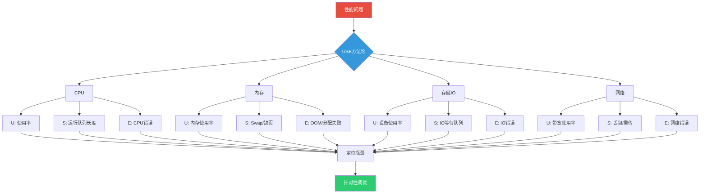
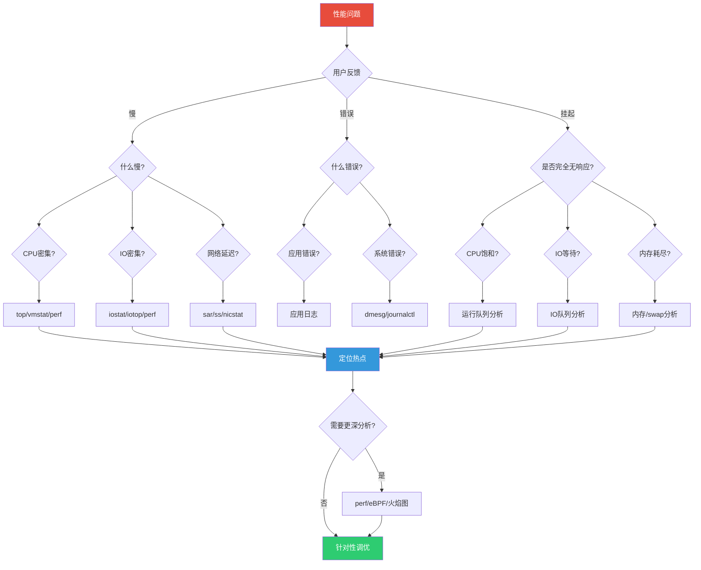
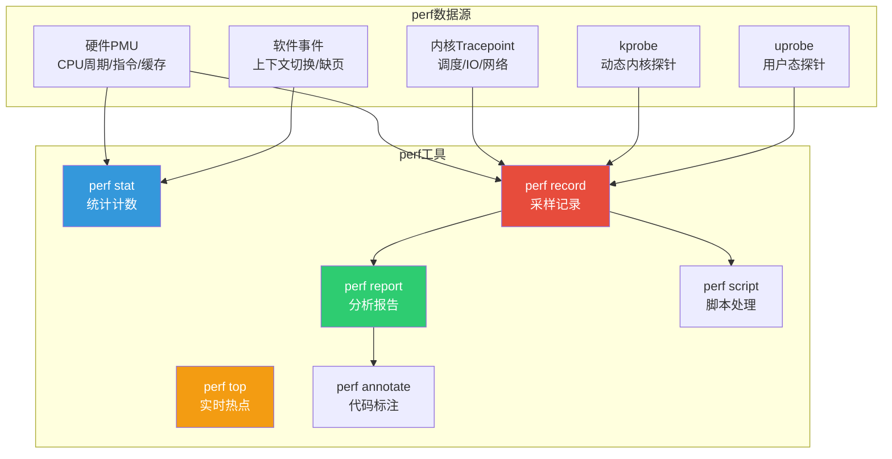
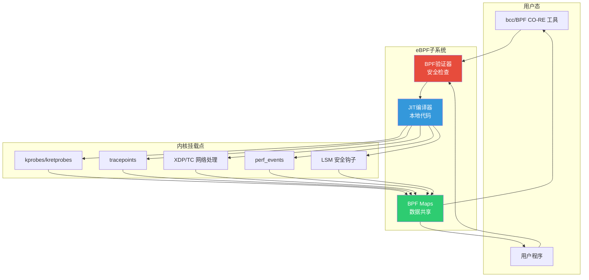
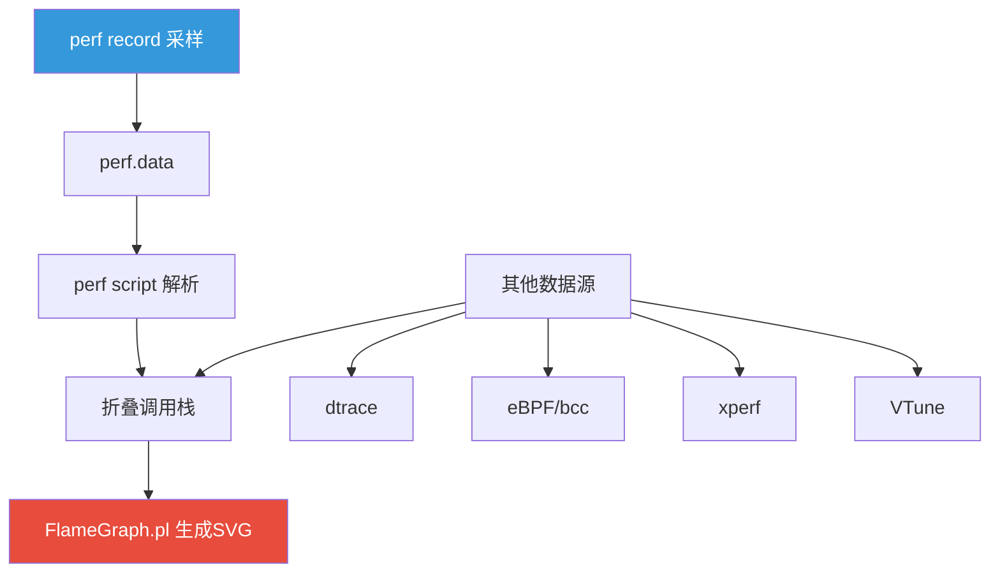
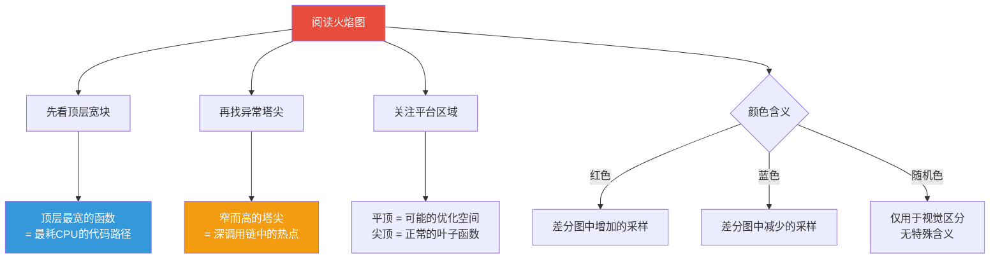
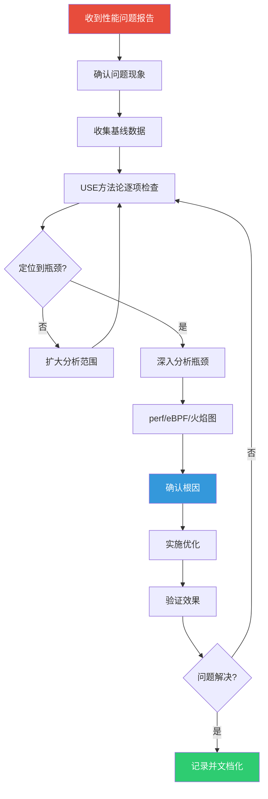

# 性能分析与调优

::: important 核心要点
性能分析不是猜测，而是系统化的测量与排查。USE 方法论（Utilization/Saturation/Errors）提供了一套结构化的分析框架，配合 perf、eBPF、火焰图等工具，可以精准定位性能瓶颈。本节将带你从方法论到工具链，全面掌握 Linux 性能分析。
:::

## 1. USE 方法论

### 1.1 USE 方法论概述

USE（Utilization/Saturation/Errors）方法论由 Brendan Gregg 提出，是一种系统化的性能分析框架。对系统中的每个资源，依次检查三个指标：

| 指标 | 含义 | 问题表征 |
|------|------|----------|
| **Utilization（使用率）** | 资源忙于服务请求的时间比例 | 高使用率可能是瓶颈 |
| **Saturation（饱和度）** | 资源排队等待的程度 | 排队意味着性能下降 |
| **Errors（错误率）** | 错误事件的发生频率 | 错误可能影响功能和性能 |



### 1.2 USE 方法论速查表

| 资源 | Utilization | Saturation | Errors |
|------|------------|------------|--------|
| **CPU** | CPU 使用率（%usr+%sys） | 运行队列长度（runq-sz）、负载均值 | CPU MCE 错误 |
| **内存** | 已用内存/总内存 | Swap 使用、缺页中断速率 | OOM Kill、分配失败 |
| **存储** | 设备忙碌时间比例 | IO 等待队列深度、iowait% | IO 错误、坏块 |
| **网络** | 带宽使用率 | 重传率、丢包率、拥塞 | 网卡错误、丢帧 |
| **文件系统** | 已用空间/inode | VFS 等待、文件锁竞争 | 空间满、IO 错误 |
| **磁盘控制器** | 控制器忙碌比例 | IO 调度队列深度 | 控制器错误 |

### 1.3 性能分析决策树



## 2. CPU 分析

### 2.1 CPU 性能指标

| 指标 | 说明 | 健康范围 |
|------|------|----------|
| %usr | 用户态 CPU 时间 | < 70% |
| %sys | 内核态 CPU 时间 | < 30% |
| %iowait | IO 等待时间 | < 5% |
| %steal | 虚拟化被偷时间 | < 5% |
| %idle | 空闲时间 | > 20% |
| runq-sz | 运行队列长度 | < CPU 核心数 × 2 |
| load average | 负载均值 | < CPU 核心数 |

::: tip 负载均值解读
负载均值（Load Average）有三个数字：1 分钟、5 分钟、15 分钟。
- 单核系统：1.0 表示满载，>1.0 表示有排队
- 4 核系统：4.0 表示满载
- 经验法则：`load / CPU核心数 < 0.7` 为健康
:::

### 2.2 top 命令详解

```bash
# 基本使用
top

# 常用交互命令（运行中按键）：
# 1 - 显示所有 CPU 核心
# H - 显示线程
# M - 按内存排序
# P - 按 CPU 排序
# c - 显示完整命令行
# f - 选择显示字段
# W - 保存配置

# 批处理模式（脚本友好）
top -b -n 1 | head -20
top -b -n 1 -p $(pgrep -d',' nginx)

# 按用户过滤
top -u nginx

# 指定刷新间隔
top -d 2     # 2 秒刷新

# 显示线程
top -H -p $(pgrep -d',' nginx)
```

top 输出解读：

```
top - 10:30:00 up 30 days,  2:15,  3 users,  load average: 0.52, 0.38, 0.31
Tasks: 256 total,   2 running, 254 sleeping,   0 stopped,   0 zombie
%Cpu0  :  5.2 us,  1.3 sy,  0.0 ni, 92.1 id,  0.8 wa,  0.0 hi,  0.6 si,  0.0 st
%Cpu1  :  3.8 us,  0.9 sy,  0.0 ni, 94.8 id,  0.2 wa,  0.0 hi,  0.3 si,  0.0 st
MiB Mem :   7823.5 total,    256.3 free,   3456.7 used,   4110.5 buff/cache
MiB Swap:   2048.0 total,   2048.0 free,      0.0 used.   3898.2 avail Mem
```

| 字段 | 含义 |
|------|------|
| `us` | 用户态 CPU（应用代码） |
| `sy` | 内核态 CPU（系统调用、中断） |
| `ni` | nice 值调整的用户态 CPU |
| `id` | 空闲 CPU |
| `wa` | IO 等待（等磁盘/网络 IO） |
| `hi` | 硬中断 |
| `si` | 软中断 |
| `st` | 虚拟化被偷时间（云服务器关注） |

### 2.3 vmstat

```bash
# 基本使用
vmstat 1 5     # 每秒采样，共5次

# 输出示例：
# procs -----------memory---------- ---swap-- -----io---- -system-- ------cpu-----
#  r  b   swpd   free   buff  cache   si   so    bi    bo   in   cs us sy id wa st
#  1  0      0 256300 123400 411000    0    0    10    25  100  200  5  1 93  1  0
#  2  0      0 256200 123400 411050    0    0     0    40  120  230  6  1 92  1  0

# 关键字段解读：
# r  - 运行队列中的进程数（等待CPU的进程）
# b  - 不可中断睡眠的进程数（等待IO的进程）
# si - 每秒从swap换入的内存(KB)
# so - 每秒换出到swap的内存(KB)
# bi - 每秒从块设备读入的块数
# bo - 每秒写到块设备的块数
# in - 每秒中断数
# cs - 每秒上下文切换数
# us - 用户态CPU时间%
# sy - 内核态CPU时间%
# id - 空闲CPU时间%
# wa - IO等待CPU时间%
```

::: important vmstat 关键指标
- **r > CPU 核心数**：CPU 饱和，有进程排队
- **b 持续 > 0**：IO 瓶颈，进程等待磁盘
- **si/so > 0**：内存不足，正在使用 swap
- **cs 很高**：上下文切换频繁，可能锁竞争严重
- **wa 持续 > 5%**：IO 瓶颈
:::

### 2.4 mpstat

```bash
# 安装
sudo dnf install sysstat

# 查看所有 CPU 核心
mpstat -P ALL 1 3

# 输出示例：
# 10:30:00 AM  CPU   %usr  %nice   %sys  %iowait  %irq  %soft  %steal  %guest  %gnice  %idle
# 10:30:01 AM  all   5.20   0.00   1.30    0.80  0.00   0.60    0.00    0.00    0.00  92.10
# 10:30:01 AM    0   5.50   0.00   1.40    0.50  0.00   0.60    0.00    0.00    0.00  92.00
# 10:30:01 AM    1   4.90   0.00   1.20    1.10  0.00   0.60    0.00    0.00    0.00  92.20

# 关注点：
# - 单核 %usr 高：单线程应用瓶颈
# - %iowait 高：磁盘IO瓶颈
# - %soft 高：网络软中断处理量大
```

### 2.5 上下文切换分析

```bash
# 查看上下文切换次数
vmstat 1 | awk '{print $1, $12, $13}'  # 时间, 中断数, 上下文切换数

# 查看进程级上下文切换
pidstat -w 1

# 输出示例：
# UID   PID  cswch/s nvcswch/s  Command
# 1000  1234   15.20     3.40  nginx
# 1000  5678   10.50     2.10  node

# cswch/s  - 自愿上下文切换（进程主动让出CPU）
# nvcswch/s - 非自愿上下文切换（被调度器抢占）

# 非自愿切换高 → CPU 竞争激烈
# 自愿切换高 → IO 等待或锁竞争
```

## 3. 内存分析

### 3.1 内存性能指标

| 指标 | 说明 | 健康范围 |
|------|------|----------|
| 已用内存 | 实际使用的内存 | < 80% |
| 缓冲/缓存 | 文件系统缓存 | 正常，会被自动回收 |
| 可用内存 | 包含可回收缓存 | > 10% |
| Swap 使用 | 交换空间使用量 | 尽量为 0 |
| 缺页中断 | 每秒缺页次数 | 低为佳 |
| OOM Kill | 内存不足杀死进程 | 不应发生 |

### 3.2 free 命令详解

```bash
free -h

# 输出示例：
#               total        used        free      shared  buff/cache   available
# Mem:          7.6Gi       3.4Gi       256Mi       128Mi       4.1Gi       3.9Gi
# Swap:         2.0Gi          0B       2.0Gi

# 关键理解：
# - used = total - free - buff/cache
# - available = free + 可回收的 buff/cache
# - available 才是真正"可用"的内存
# - buff/cache 高不是问题，系统会在需要时自动回收

# 持续监控
watch -n 1 free -h

# 以字节显示
free -b

# 每秒更新
free -h -s 1
```

::: important Linux 内存模型
Linux 尽量利用空闲内存做文件缓存（buff/cache），这**不是**内存泄漏：
- `buff`：块设备缓冲区（磁盘读写缓存）
- `cache`：页缓存（文件内容缓存）
- 当应用需要内存时，内核会自动回收缓存
- `available` 字段才是判断内存是否充足的依据
- 只有 `available` 持续很低时才需要担心
:::

### 3.3 vmstat 内存分析

```bash
vmstat 1 10

# 内存相关字段：
# swpd   - 已使用的swap空间(KB)
# free   - 空闲内存(KB)
# buff   - 缓冲区大小(KB)
# cache  - 缓存大小(KB)
# si     - 每秒从swap换入(KB/s)
# so     - 每秒换出到swap(KB/s)

# 判断标准：
# si/so 持续 > 0 → 内存不足，频繁swap
# free 很低但 si/so=0 → 内存够用，只是缓存利用充分
# free 很低且 si/so>0 → 内存不足，需要扩容或优化
```

### 3.4 slabtop - 内核 Slab 缓存分析

```bash
# 交互式查看 slab 缓存
slabtop

# 输出示例：
#  Active / Total Objects (% used)    : 1234567 / 1300000 (94.9%)
#  Active / Total Slabs (% used)      : 123456 / 130000 (94.9%)
#  Active / Total Caches (% used)     : 123 / 200 (61.5%)
#  Active / Total Size (% used)       : 1024.00M / 1100.00M (93.1%)
#  Minimum / Average / Maximum Object : 0.01K / 0.19K / 8.00K
#
#  OBJS ACTIVE  USE OBJ SIZE  SLABS OBJ/SLAB CACHE SIZE NAME
# 524288 524288 100%    0.19K  12544       32     50176K dentry
# 262144 262144 100%    0.98K  65536        4    524288K ext4_inode_cache
# 131072 131072 100%   64.00K  131072        1   2097152K kmalloc-64

# dentry 缓存大 → 大量文件操作
# ext4_inode_cache 大 → 大量文件被打开
# kmalloc 大 → 内核内存分配频繁
```

### 3.5 页缓存分析

```bash
# 使用 perf 分析页缓存命中率
sudo perf stat -e 'major-faults,minor-faults' -a sleep 10

# 使用 cachestat（bcc 工具）
sudo cachestat 1

# 输出示例：
#    HITS   MISSES  DIRTIES  BUFFERS_MB  CACHED_MB
#    1234       56       12          45       1024
# HITS   - 缓存命中次数
# MISSES - 缓存未命中次数
# DIRTIES- 脏页数
# 命中率 = HITS / (HITS + MISSES)

# 使用 cachetop（bcc 工具）按进程查看
sudo cachetop
```

### 3.6 内存泄漏排查

```bash
# 1. 使用 top 找到内存持续增长的进程
top -o %MEM

# 2. 查看进程内存映射
pmap -x $(pidof myapp)

# 3. 查看进程内存统计
cat /proc/$(pidof myapp)/status | grep -i vm
# VmPeak: 峰值虚拟内存
# VmSize: 当前虚拟内存
# VmLck:  锁定内存
# VmRSS:  物理内存(RES)
# VmData: 数据段
# VmStk:  栈
# VmExe:  代码段
# VmLib:  共享库

# 4. 使用 smem 查看进程实际内存使用
sudo dnf install smem
smem -t -k -s rss

# 5. 使用 valgrind 检测内存泄漏（C/C++）
valgrind --leak-check=full --show-leak-kinds=all /opt/myapp/bin/myapp

# 6. 使用 jemalloc profiling（如果应用使用 jemalloc）
MALLOC_CONF="prof:true,prof_prefix:jeprof.out" /opt/myapp/bin/myapp
jeprof --svg /opt/myapp/bin/myapp jeprof.out.1234 > profile.svg
```

## 4. IO 分析

### 4.1 iostat

```bash
# 基本使用
iostat -x 1

# 输出示例：
# Device            r/s     w/s     rMB/s     wMB/s   rrqm/s   wrqm/s  %rrqm  %wrqm r_await w_await aqu-sz rareq-sz wareq-sz  svctm  %util
# sda             10.20   20.30      0.05      0.10     0.50     5.20   4.68  20.39    1.23    2.34   0.06    5.12    5.24   0.32   0.98
# sdb              5.10   10.20      0.02      0.05     0.10     2.30   1.92  18.40    0.89    1.56   0.02    4.56    5.12   0.18   0.28
```

| 指标 | 含义 | 关注值 |
|------|------|--------|
| `r/s` | 每秒读 IOPS | 取决于设备 |
| `w/s` | 每秒写 IOPS | 取决于设备 |
| `rMB/s` | 每秒读吞吐量 | 取决于设备 |
| `wMB/s` | 每秒写吞吐量 | 取决于设备 |
| `%util` | 设备使用率 | **> 80% 需关注** |
| `aqu-sz` | 平均 IO 队列深度 | **> 2 需关注** |
| `r_await` | 平均读延迟(ms) | SSD < 1ms, HDD < 10ms |
| `w_await` | 平均写延迟(ms) | SSD < 1ms, HDD < 10ms |
| `svctm` | 平均服务时间(ms) | 越低越好 |

::: important %util 不是 CPU 使用率
`%util` 表示设备有 IO 的时间比例，不是"吞吐量使用率"：
- HDD：100% util 可能只用了 200 IOPS
- NVMe SSD：100% util 可能用了 500000 IOPS
- 需要结合 IOPS 和吞吐量一起看
- 队列深度 `aqu-sz` 和延迟 `await` 更能反映实际瓶颈
:::

### 4.2 iotop

```bash
# 安装
sudo dnf install iotop

# 交互式查看
sudo iotop

# 仅显示有 IO 的进程
sudo iotop -o

# 非交互模式
sudo iotop -b -n 3 -o

# 按列排序
sudo iotop -o -P   # 按进程显示（非线程）

# 输出示例：
# TID  PRIO  USER     DISK READ  DISK WRITE  SWAPIN     IO>    COMMAND
# 1234 be/4 nginx     0.00 B/s    1.23 M/s    0.00 %   5.23 %  nginx: worker process
# 5678 be/4 mysql     5.67 M/s    2.34 M/s    0.00 %   3.45 %  mysqld --datadir=...
# 9012 be/4 root      0.00 B/s   10.5 M/s    0.00 %   2.12 %  [kworker/u256:2]
```

### 4.3 IO 性能基准测试

```bash
# ===== fio 磁盘性能测试 =====
sudo dnf install fio

# 顺序读测试
sudo fio --name=seqread --rw=read --bs=1M --size=1G --numjobs=1 --runtime=60 --time_based --group_reporting

# 随机读 IOPS 测试
sudo fio --name=randread --rw=randread --bs=4K --size=1G --numjobs=4 --iodepth=32 --runtime=60 --time_based --group_reporting

# 随机写 IOPS 测试
sudo fio --name=randwrite --rw=randwrite --bs=4K --size=1G --numjobs=4 --iodepth=32 --runtime=60 --time_based --group_reporting

# 混合读写测试（70%读30%写）
sudo fio --name=mixed --rw=randrw --rwmixread=70 --bs=4K --size=1G --numjobs=4 --iodepth=32 --runtime=60 --time_based --group_reporting

# 参考值（大致范围）：
# HDD:  ~100-200 IOPS,  ~100-200 MB/s 顺序
# SATA SSD: ~50,000-100,000 IOPS, ~500 MB/s
# NVMe SSD: ~500,000-1,000,000 IOPS, ~3000 MB/s
```

## 5. 网络分析

### 5.1 sar - 网络统计

```bash
# 安装
sudo dnf install sysstat

# 网络设备统计
sar -n DEV 1 5

# 输出示例：
# 10:30:00 AM     IFACE   rxpck/s   txpck/s    rxkB/s    txkB/s   rxcmp/s   txcmp/s  rxmcst/s
# 10:30:01 AM        eth0    1250.00    980.00    250.50    180.30      0.00      0.00      0.50
# 10:30:01 AM        lo      100.00    100.00     50.00     50.00      0.00      0.00      0.00

# 关键字段：
# rxpck/s - 每秒接收包数
# txpck/s - 每秒发送包数
# rxkB/s  - 每秒接收KB
# txkB/s  - 每秒发送KB

# 网络错误统计
sar -n EDEV 1 5

# TCP 统计
sar -n TCP,ETCP 1 5
# active/s - 每秒主动连接数（出站）
# passive/s - 每秒被动连接数（入站）
# isegerr/s - 每秒错误入站段
# retrans/s - 每秒重传段数
```

### 5.2 nicstat

```bash
# 安装（可能需要编译）
# https://github.com/scotte/nicstat

# 使用
nicstat 1

# 输出示例：
#  Time      Int   rKB/s   wKB/s   rPk/s   wPk/s   rAvs   wAvs   %Util   Sat
# 10:30:01   eth0  250.50  180.30  1250.0   980.0  205.3  188.6    3.6  0.00

# %Util - 接口利用率（基于接口速度）
# Sat   - 饱和度（基于接口是否有排队）
# rAvs/wAvs - 平均包大小
```

### 5.3 ss - 套接字统计

```bash
# TCP 连接统计
ss -s

# 输出示例：
# Total: 5432 (kernel 5678)
# TCP:   3456 (estab 234, closed 1234, orphaned 0, timewait 1234/0), port 567
# Transport Total     IP        IPv6
# RAW       1         0         1
# UDP       5         3         2
# TCP       2222      1234      988
# INET      2228      1237      991
# FRAG      0         0         0

# 查看所有 TCP 连接
ss -t -a

# 查看指定端口的连接
ss -t -a '( dport = :80 or sport = :80 )'

# 查看连接状态分布
ss -t -a | awk '{print $1}' | sort | uniq -c | sort -rn
#   1234 ESTAB
#    567 TIME-WAIT
#    234 CLOSE-WAIT
#     12 LISTEN

# 查看每个进程的连接数
ss -t -a | awk 'NR>1 {print $5}' | cut -d: -f1 | sort | uniq -c | sort -rn | head

# 查看 socket 缓冲区使用
ss -t -m

# 查看 TCP 内部信息（RTT、拥塞窗口等）
ss -ti

# 查看 TCP 定时器信息
ss -to
```

::: warning TIME-WAIT 和 CLOSE-WAIT
- **TIME-WAIT 高**：大量短连接，可优化内核参数
- **CLOSE-WAIT 高**：应用未正确关闭连接，是代码 bug

```bash
# 优化 TIME-WAIT
sudo sysctl -w net.ipv4.tcp_tw_reuse=1
sudo sysctl -w net.ipv4.tcp_max_tw_buckets=65535
```
:::

### 5.4 网络延迟分析

```bash
# ===== ping 延迟 =====
ping -c 10 -i 0.2 server.example.com

# ===== TCP 连接延迟 =====
# 使用 tcptraceroute
sudo tcptraceroute -p 443 server.example.com

# ===== HTTP 延迟分解 =====
curl -o /dev/null -s -w "DNS: %{time_namelookup}s\nConnect: %{time_connect}s\nTLS: %{time_appconnect}s\nTTFB: %{time_starttransfer}s\nTotal: %{time_total}s\n" https://example.com

# ===== 使用 mtr 路由追踪 =====
mtr --report --report-cycles 10 server.example.com

# ===== 使用 ss 查看 RTT =====
ss -ti dst server.example.com
# rtt:0.125/0.025 rttvar:0.025 cwnd:10
```

## 6. perf 工具集

### 6.1 perf 概述

perf 是 Linux 内核自带的性能分析工具，可以访问硬件性能计数器（PMU）、内核 tracepoint、kprobe、uprobe 等：



### 6.2 perf stat - 统计计数

```bash
# 基本使用 - 统计程序运行的硬件事件
perf stat ./myapp

# 统计指定 PID
perf stat -p $(pidof myapp) sleep 10

# 统计系统全局
perf stat -a sleep 10

# 指定事件
perf stat -e cycles,instructions,cache-references,cache-misses ./myapp

# 常用事件组合
perf stat -e \
    cycles,\
    instructions,\
    cache-references,\
    cache-misses,\
    branch-misses,\
    L1-dcache-loads,\
    L1-dcache-load-misses,\
    LLC-loads,\
    LLC-load-misses \
    ./myapp

# 输出示例：
#   3,456,789,012      cycles
#   5,678,901,234      instructions              #  1.64  insn per cycle
#     123,456,789      cache-references
#       5,678,901      cache-misses              #  4.60% of all cache refs
#           1,234      branch-misses
```

| 指标 | 说明 | 关注点 |
|------|------|--------|
| IPC (insn per cycle) | 每周期指令数 | < 1 可能是内存瓶颈 |
| Cache miss rate | 缓存未命中率 | > 5% 需关注 |
| Branch miss rate | 分支预测失败率 | > 2% 需关注 |
| LLC miss rate | 末级缓存未命中率 | > 10% 严重 |

### 6.3 perf record - 采样记录

```bash
# 记录 CPU 采样（默认事件：cycles）
sudo perf record -g -p $(pidof myapp) sleep 30

# 记录所有 CPU
sudo perf record -g -a sleep 30

# 记录调用图（DWARF 格式，更精确）
sudo perf record -g call-graph=dwarf -p $(pidof myapp) sleep 30

# 记录特定事件
sudo perf record -e cache-misses -g -p $(pidof myapp) sleep 30

# 记录到指定文件
sudo perf record -g -o perf.data -p $(pidof myapp) sleep 30

# 记录系统调用
sudo perf record -e syscalls:sys_enter_read,syscalls:sys_enter_write -a sleep 10

# 常用参数：
# -g           记录调用栈
# -F 99        采样频率 99Hz（避免开销过大）
# -p PID       指定进程
# -a           所有 CPU
# -C 0-3       指定 CPU 核心
# -e event     指定事件
# --sleep N    采样时长
```

::: tip 采样频率选择
- 默认 4000Hz 可能带来较高开销
- 生产环境建议 `-F 99`（99Hz），开销 < 1%
- 需要更精细分析时可提高到 `-F 999`
- 频率选择奇数（99, 999）可避免与某些周期性事件对齐
:::

### 6.4 perf report - 分析报告

```bash
# 交互式报告
sudo perf report

# 常用交互键：
# + 展开调用链
# - 折叠调用链
# E 展开全部
# C 折叠全部
# / 搜索
# f 父函数视图

# 非交互模式
sudo perf report --stdio

# 按进程分组
sudo perf report --stdio --sort comm,dso

# 过滤特定进程
sudo perf report --stdio --comm=myapp

# 按共享库排序
sudo perf report --stdio --sort dso

# 输出调用链
sudo perf report --stdio -g graph,0.5,caller
```

### 6.5 perf top - 实时热点

```bash
# 实时显示函数级热点
sudo perf top

# 指定采样事件
sudo perf top -e cache-misses

# 按进程显示
sudo perf top -g

# 指定 CPU
sudo perf top -C 0-3

# 输出示例：
# Samples: 45K of event 'cycles', Event count (approx.): 36789123456
# Overhead  Shared Object      Symbol
#   12.34%  myapp              [.] process_request
#    8.76%  [kernel]           [k] copy_user_enhanced_fast_string
#    5.43%  libc-2.31.so       [.] __memcpy_avx2
#    3.21%  myapp              [.] hash_lookup
#    2.98%  [kernel]           [k] tcp_v4_rcv
```

### 6.6 perf annotate - 代码标注

```bash
# 标注最热函数的汇编代码
sudo perf annotate process_request

# 标注源代码（需要调试符号）
sudo perf annotate --source process_request

# 输出示例：
# Percent |      Source code & Disassembly of myapp
#         :      void process_request(request_t *req) {
#    0.00 :        push   %rbp
#    0.00 :        mov    %rsp,%rbp
#         :        for (int i = 0; i < req->count; i++) {
#   15.23 :        mov    0x8(%rdi),%ecx
#    0.00 :        test   %ecx,%ecx
#    0.00 :        jle    0x1234
#         :            result += hash_lookup(req->items[i]);
#   45.67 :        movslq %ecx,%rax
#   28.90 :        callq  hash_lookup
```

### 6.7 perf 实战案例

#### 案例 1：定位高 CPU 占用的原因

```bash
# 1. 找到高 CPU 进程
top -b -n 1 | head -20

# 2. 采样该进程
sudo perf record -g -p $(pidof myapp) -F 99 -- sleep 30

# 3. 分析报告
sudo perf report --stdio

# 4. 找到热点函数后，查看代码级瓶颈
sudo perf annotate --source <hot_function>
```

#### 案例 2：分析缓存未命中

```bash
# 记录缓存未命中事件
sudo perf record -e LLC-load-misses,LLC-loads -g -p $(pidof myapp) sleep 30

# 分析哪些代码导致缓存未命中
sudo perf report --stdio -g graph,0.5,caller
```

#### 案例 3：分析锁竞争

```bash
# 记录锁相关事件
sudo perf record -e lock:contention_begin,lock:contention_end -a sleep 30

# 或者记录上下文切换
sudo perf record -e sched:sched_switch -p $(pidof myapp) sleep 30

# 分析
sudo perf report --stdio
```

## 7. eBPF 原理与 bcc 工具集

### 7.1 eBPF 概述

eBPF（extended Berkeley Packet Filter）是 Linux 内核的革命性技术，允许在内核中安全地运行沙箱程序，无需修改内核源码或加载内核模块：



### 7.2 eBPF 核心概念

| 概念 | 说明 |
|------|------|
| **BPF Program** | 运行在内核中的沙箱程序 |
| **BPF Map** | 用户态和内核态共享数据的数据结构 |
| **BPF Verifier** | 验证 BPF 程序安全性（不会崩溃内核） |
| **JIT Compiler** | 将 BPF 字节码编译为本地机器码 |
| **Attach Point** | BPF 程序挂载的事件点 |

eBPF 的安全保证：
- 程序必须通过验证器检查（无越界访问、无无限循环）
- 最大指令数限制（100万条）
- 不能调用任意内核函数，只能调用 BPF helper 函数
- 栈大小限制 512 字节

### 7.3 bcc 工具集安装

```bash
# RHEL/CentOS/Fedora
sudo dnf install bcc-tools bcc-doc
# 工具安装在 /usr/share/bcc/tools/

# Ubuntu/Debian
sudo apt install bpfcc-tools linux-headers-$(uname -r)
# 工具以 -bpfcc 后缀安装

# 将工具加入 PATH
export PATH=$PATH:/usr/share/bcc/tools

# 验证安装
ls /usr/share/bcc/tools/
```

### 7.4 bcc CPU 分析工具

```bash
# ===== execsnoop - 跟踪新进程创建 =====
sudo execsnoop
# PCOMM            PID    PPID   RET ARGS
# nginx           12345   1234     0 /usr/sbin/nginx -g daemon on

# ===== opensnoop - 跟踪文件打开 =====
sudo opensnoop -n nginx
# COMM      PID    FD   ERR PATH
# nginx     1234    3     0 /etc/nginx/nginx.conf

# ===== profile - CPU 火焰图采样 =====
sudo profile -F 99 -p $(pidof myapp) 30 > profile.out

# ===== offcputime - 离CPU时间分析 =====
# 分析进程不在CPU上运行的时间
sudo offcputime -p $(pidof myapp) 30

# 输出：调用栈 + 离CPU时间
#     futex_wait_queue_me
#     do_futex
#     sys_futex
#     -
#     myapp
#         2345

# ===== runqlat - 调度延迟分析 =====
# 分析进程等待CPU调度的延迟
sudo runqlat 10

# 输出：
#      usecs               : count    distribution
#          0 -> 1          : 123      |**********                              |
#          2 -> 3          : 456      |************************************    |
#          4 -> 7          : 789      |****************************************|
#          8 -> 15         : 345      |***************************             |

# ===== runqlen - 运行队列长度 =====
sudo runqlen 10

# ===== cpudist - CPU 占用时间分布 =====
sudo cpudist -p $(pidof myapp) 10
```

### 7.5 bcc 内存分析工具

```bash
# ===== memleak - 内存泄漏检测 =====
sudo memleak -p $(pidof myapp)

# 输出示例：
# Attaching to pid 1234, Ctrl+C to quit.
# [10:30:00] Top 2 stacks with outstanding allocations:
#     2048 bytes in 2 allocations from stack
#         malloc+0x5a [libc-2.31.so]
#         create_buffer+0x1f [myapp]
#         process_request+0x3c [myapp]

# ===== slabratetop - Slab 分配速率 =====
sudo slabratetop 10

# ===== cachestat - 页缓存统计 =====
sudo cachestat 1

# ===== oomkill - OOM Kill 跟踪 =====
sudo oomkill

# ===== shmslab - 共享内存 Slab =====
sudo shmslab -p $(pidof myapp)
```

### 7.6 bcc IO 分析工具

```bash
# ===== biolatency - 块IO延迟分布 =====
sudo biolatency 10

# 输出示例：
#      usecs               : count    distribution
#          0 -> 1          : 0        |                                        |
#          2 -> 3          : 0        |                                        |
#          4 -> 7          : 12       |**                                      |
#          8 -> 15         : 45       |********                                |
#         16 -> 31         : 123      |**********************                  |
#         32 -> 63         : 234      |****************************************|
#         64 -> 127        : 89       |***************                         |
#        128 -> 255        : 34       |******                                  |

# ===== biosnoop - 块IO跟踪 =====
sudo biosnoop

# 输出示例：
# TIME(s)     COMM           PID    DISK    T  SECTOR    BYTES   LAT(ms)
# 0.000       nginx          1234   sda     R  123456    4096      0.25
# 0.001       mysqld         5678   sda     W  234567    8192      0.45

# ===== bitesize - IO 大小分布 =====
sudo bitesize 10

# ===== biotop - 块IO Top =====
sudo biotop 10

# ===== filelife - 短命文件跟踪 =====
sudo filelife

# ===== fileslower - 慢文件IO =====
sudo fileslower -p $(pidof myapp) 10

# ===== ext4slower - ext4 慢操作 =====
sudo ext4slower 10

# ===== xfsslower - XFS 慢操作 =====
sudo xfsslower 10
```

### 7.7 bcc 网络分析工具

```bash
# ===== tcplife - TCP 连接生命周期 =====
sudo tcplife
# PID   COMM       LADDR           LPORT RADDR           RPORT  TX_KB  RX_KB  MS
# 1234  nginx      10.0.0.1        80    192.168.1.100   54321  128    256    45.6

# ===== tcptop - TCP 吞吐量 Top =====
sudo tcptop 10

# ===== tcpconnect - TCP 连接跟踪 =====
sudo tcpconnect
# PID    COMM         IP SADDR            DADDR            DPORT
# 1234   curl         4  10.0.0.1         93.184.216.34    80

# ===== tcpaccept - TCP 被动连接跟踪 =====
sudo tcpaccept

# ===== tcpretrans - TCP 重传跟踪 =====
sudo tcpretrans

# ===== tcplatenncy - TCP 延迟分析 =====
sudo tcplatenncy -p $(pidof myapp) 10

# ===== socktop - Socket 统计 =====
sudo socktop 10

# ===== softirqs - 软中断统计 =====
sudo softirqs 10

# ===== hardirqs - 硬中断统计 =====
sudo hardirqs 10
```

## 8. 火焰图（Flame Graph）

### 8.1 火焰图原理

火焰图由 Brendan Gregg 发明，是可视化性能分析数据的最直观方式：



火焰图的特征：
- **X 轴**：函数调用栈的样本数（宽度越大，占用越多）
- **Y 轴**：调用栈深度（从下到上是调用关系）
- **颜色**：随机着色，仅用于视觉区分
- **交互**：可点击放大某个子树

### 8.2 CPU 火焰图

```bash
# 1. 采样
sudo perf record -F 99 -a -g -- sleep 30
# 或指定进程
sudo perf record -F 99 -g -p $(pidof myapp) -- sleep 30

# 2. 导出调用栈
sudo perf script > perf.out

# 3. 折叠调用栈
# 下载 FlameGraph 工具
git clone https://github.com/brendangregg/FlameGraph /opt/FlameGraph

/opt/FlameGraph/stackcollapse-perf.pl perf.out > perf.folded

# 4. 生成火焰图
/opt/FlameGraph/flamegraph.pl perf.folded > cpu-flamegraph.svg

# 一行命令版本
sudo perf script | /opt/FlameGraph/stackcollapse-perf.pl | /opt/FlameGraph/flamegraph.pl > cpu-flamegraph.svg
```

### 8.3 Off-CPU 火焰图

Off-CPU 火焰图显示进程不在 CPU 上运行的时间（等待 IO、锁、调度等）：

```bash
# 使用 bcc offcputime 采集
sudo offcputime -p $(pidof myapp) 30 > offcpu.out

# 折叠并生成
/opt/FlameGraph/stackcollapse.pl offcpu.out | /opt/FlameGraph/flamegraph.pl --countname=us --title="Off-CPU Flame Graph" > offcpu-flamegraph.svg

# 或使用 perf 采集（内核 5.10+）
sudo perf record -e sched:sched_switch -p $(pidof myapp) -- sleep 30
sudo perf script | /opt/FlameGraph/stackcollapse-perf.pl | /opt/FlameGraph/flamegraph.pl > offcpu-flamegraph.svg
```

### 8.4 内存火焰图

```bash
# 使用 bcc memleak 采集
sudo memleak -p $(pidof myapp) -T 30 > memleak.out 2>&1

# 使用 jeprof（jemalloc 应用）
MALLOC_CONF="prof:true,prof_prefix:jeprof.out" /opt/myapp/bin/myapp
jeprof --svg /opt/myapp/bin/myapp jeprof.out.* > mem-flamegraph.svg

# 使用 tcmalloc（gperftools）
LD_PRELOAD=/usr/lib/libtcmalloc.so HEAPPROFILE=/tmp/myapp-heap /opt/myapp/bin/myapp
pprof --svg /opt/myapp/bin/myapp /tmp/myapp-heap.0001.heap > mem-flamegraph.svg
```

### 8.5 差分火焰图

差分火焰图比较两个时间点的性能差异，用于验证优化效果：

```bash
# 1. 采集优化前数据
sudo perf record -F 99 -g -p $(pidof myapp) -o perf-before.data -- sleep 30

# 2. 进行优化...

# 3. 采集优化后数据
sudo perf record -F 99 -g -p $(pidof myapp) -o perf-after.data -- sleep 30

# 4. 生成差分火焰图
sudo perf script -i perf-before.data | /opt/FlameGraph/stackcollapse-perf.pl > before.folded
sudo perf script -i perf-after.data | /opt/FlameGraph/stackcollapse-perf.pl > after.folded

/opt/FlameGraph/difffolded.pl before.folded after.folded | /opt/FlameGraph/flamegraph.pl --title="Diff Flame Graph" > diff-flamegraph.svg

# 红色 = 优化后增加的采样
# 蓝色 = 优化后减少的采样
```

### 8.6 火焰图阅读技巧



::: tip 火焰图常见模式
1. **宽平台**：某个函数占用大量 CPU，可能是优化目标
2. **细塔尖**：深调用链中的小热点，通常不值得优化
3. **多柱并列**：多个代码路径占用相似 CPU，无单一瓶颈
4. **大量内核函数**：可能系统调用过多或锁竞争
5. **大量 idle**：不是 CPU 瓶颈，应该分析 Off-CPU
:::

## 9. 系统参数调优（sysctl）

### 9.1 sysctl 概述

sysctl 是 Linux 内核参数的运行时配置接口，可以在不重启的情况下修改内核行为：

```bash
# 查看所有参数
sysctl -a

# 查看特定参数
sysctl net.ipv4.tcp_syncookies

# 临时修改（重启后失效）
sudo sysctl -w net.ipv4.tcp_syncookies=1

# 永久修改
sudo vim /etc/sysctl.d/99-custom.conf
# 写入参数后应用
sudo sysctl -p /etc/sysctl.d/99-custom.conf
# 或应用所有
sudo sysctl --system
```

### 9.2 内核参数调优

#### 文件描述符

```ini
# /etc/sysctl.d/99-custom.conf

# 系统级最大文件描述符
fs.file-max = 2097152

# 单进程最大文件描述符（需配合 limits.conf）
# /etc/security/limits.conf
# * soft nofile 1048576
# * hard nofile 1048576
```

#### TCP 优化

```ini
# ===== TCP 连接优化 =====

# SYN 队列长度（SYN flood 防护）
net.ipv4.tcp_max_syn_backlog = 65535

# 监听队列长度
net.core.somaxconn = 65535

# SYN Cookies（SYN flood 防护）
net.ipv4.tcp_syncookies = 1

# TIME-WAIT 优化
net.ipv4.tcp_tw_reuse = 1
net.ipv4.tcp_max_tw_buckets = 65535
# 注意：不建议开启 tcp_tw_recycle（已在 4.12 移除）

# FIN-WAIT-2 超时
net.ipv4.tcp_fin_timeout = 15

# keepalive 优化
net.ipv4.tcp_keepalive_time = 600
net.ipv4.tcp_keepalive_intvl = 30
net.ipv4.tcp_keepalive_probes = 3

# TCP 窗口缩放
net.ipv4.tcp_window_scaling = 1

# TCP 缓冲区
net.ipv4.tcp_rmem = 4096 87380 16777216
net.ipv4.tcp_wmem = 4096 65536 16777216
net.core.rmem_max = 16777216
net.core.wmem_max = 16777216
net.core.rmem_default = 262144
net.core.wmem_default = 262144

# TCP 拥塞控制
net.ipv4.tcp_congestion_control = bbr
net.core.default_qdisc = fq

# 允许本地端口范围
net.ipv4.ip_local_port_range = 1024 65535

# TCP Fast Open
net.ipv4.tcp_fastopen = 3
```

::: important BBR 拥塞控制
BBR（Bottleneck Bandwidth and Round-trip propagation time）是 Google 开发的拥塞控制算法，相比传统的 CUBIC：
- 在高延迟、有丢包的网络中吞吐量提升显著
- 减少缓冲区膨胀（Bufferbloat）
- 适合跨地域、长肥网络

```bash
# 启用 BBR
echo "net.ipv4.tcp_congestion_control = bbr" | sudo tee -a /etc/sysctl.d/99-tcp.conf
echo "net.core.default_qdisc = fq" | sudo tee -a /etc/sysctl.d/99-tcp.conf
sudo sysctl -p /etc/sysctl.d/99-tcp.conf

# 验证
sysctl net.ipv4.tcp_congestion_control
sysctl net.core.default_qdisc
```
:::

#### 内存优化

```ini
# ===== 内存优化 =====

# 尽量使用内存而非swap
vm.swappiness = 1          # 1=最小化swap使用，0=完全禁用（不推荐）
                          # 10=推荐值，平衡性能和应急swap

# 脏页回写策略
vm.dirty_ratio = 20        # 脏页占总内存20%时强制回写
vm.dirty_background_ratio = 5  # 脏页占5%时后台开始回写
vm.dirty_writeback_centisecs = 500  # 5秒回写间隔

# 虚拟内存过度分配
vm.overcommit_memory = 0   # 0=启发式（默认）
                          # 1=总是允许
                          # 2=严格限制（适合数据库）

# 最小空闲内存
vm.min_free_kbytes = 65536  # 64MB

# 内存大页（适合数据库）
# vm.nr_hugepages = 1024   # 1024 个 2MB 大页 = 2GB

# 透明大页（建议数据库关闭）
# echo never > /sys/kernel/mm/transparent_hugepage/enabled
```

#### IO 优化

```ini
# ===== IO 调度器 =====
# 查看当前调度器
# cat /sys/block/sda/queue/scheduler
# [mq-deadline] none bfq

# NVMe SSD：使用 none
# echo none > /sys/block/nvme0n1/queue/scheduler

# SATA SSD：使用 mq-deadline
# echo mq-deadline > /sys/block/sda/queue/scheduler

# HDD：使用 bfq（桌面）或 mq-deadline（服务器）
# echo bfq > /sys/block/sda/queue/scheduler

# ===== IO 优化参数 =====

# 块设备预读
# blockdev --setra 4096 /dev/sda

# 禁用 IO 延迟统计（减少开销）
# echo 0 > /sys/block/sda/queue/iostats
```

### 9.3 调优决策矩阵

| 场景 | CPU | 内存 | IO | 网络 |
|------|-----|------|----|------|
| Web 服务器 | 中 | 中 | 低 | 高 |
| 数据库 | 高 | 高 | 高 | 中 |
| 缓存服务器 | 低 | 极高 | 低 | 高 |
| 计算集群 | 极高 | 高 | 低 | 中 |
| 文件服务器 | 低 | 中 | 极高 | 高 |
| 虚拟化宿主 | 高 | 高 | 高 | 高 |

### 9.4 常见场景调优模板

#### 高并发 Web 服务器

```ini
# /etc/sysctl.d/99-webserver.conf

# 网络
net.core.somaxconn = 65535
net.ipv4.tcp_max_syn_backlog = 65535
net.ipv4.tcp_tw_reuse = 1
net.ipv4.tcp_max_tw_buckets = 65535
net.ipv4.ip_local_port_range = 1024 65535
net.ipv4.tcp_congestion_control = bbr
net.core.default_qdisc = fq
net.ipv4.tcp_fastopen = 3

# 文件描述符
fs.file-max = 2097152

# 连接跟踪（如用 iptables）
net.netfilter.nf_conntrack_max = 1048576
net.netfilter.nf_conntrack_tcp_timeout_established = 7200
```

#### 数据库服务器

```ini
# /etc/sysctl.d/99-database.conf

# 内存
vm.swappiness = 1
vm.overcommit_memory = 2
vm.dirty_ratio = 40
vm.dirty_background_ratio = 10
vm.min_free_kbytes = 131072

# 透明大页关闭
# echo never > /sys/kernel/mm/transparent_hugepage/enabled

# NUMA 优化（多路服务器）
# numactl --interleave=all

# IO 调度器
# echo none > /sys/block/nvme0n1/queue/scheduler
```

## 10. 综合性能分析实战

### 10.1 性能分析工作流



### 10.2 实战案例：Web 服务响应慢

```bash
# ===== Step 1: 确认问题 =====
# 用户反馈：API 接口响应时间从 50ms 上升到 500ms

# ===== Step 2: 收集基线 =====
# CPU 使用率
mpstat -P ALL 1 5

# 内存使用
free -h

# IO 情况
iostat -x 1 5

# 网络情况
sar -n DEV 1 5

# ===== Step 3: USE 检查 =====
# 检查发现：iowait = 35%，%util(sda) = 95%

# ===== Step 4: 深入分析 IO =====
# 哪个进程在大量 IO？
sudo iotop -o -b -n 3

# 具体是哪些文件？
sudo opensnoop -n myapp

# IO 延迟分布
sudo biolatency 10

# ===== Step 5: 发现根因 =====
# 应用日志写入过于频繁，且使用 fsync
# 日志文件和数据库在同一块 HDD 上

# ===== Step 6: 优化方案 =====
# 1. 将数据库迁移到 SSD
# 2. 日志使用异步写入
# 3. 减少不必要的 fsync
# 4. 调整 dirty_ratio 参数
```

### 10.3 实战案例：CPU 使用率高

```bash
# ===== Step 1: 确认 CPU 高 =====
top -b -n 1 | head -20

# ===== Step 2: 查看是用户态还是内核态 =====
mpstat -P ALL 1 5

# 假设 %usr = 85%，说明是应用代码问题

# ===== Step 3: 找到热点进程 =====
pidstat -u 1 5

# ===== Step 4: 生成火焰图 =====
sudo perf record -F 99 -g -p $(pidof myapp) -o perf.data -- sleep 30
sudo perf script -i perf.data | /opt/FlameGraph/stackcollapse-perf.pl | /opt/FlameGraph/flamegraph.pl > flamegraph.svg

# ===== Step 5: 分析火焰图 =====
# 发现：JSON 序列化函数占总采样的 40%

# ===== Step 6: 优化 =====
# 1. 更换更快的 JSON 库
# 2. 减少不必要的序列化
# 3. 使用缓存避免重复序列化

# ===== Step 7: 验证 =====
# 重新生成火焰图对比
# CPU 使用率从 85% 降到 45%
# API 响应时间从 200ms 降到 80ms
```

### 10.4 实战案例：内存泄漏

```bash
# ===== Step 1: 发现内存持续增长 =====
# 监控告警：应用 RSS 每天增长 500MB

# ===== Step 2: 确认是内存泄漏 =====
# 记录进程内存增长
while true; do
    echo "$(date): $(ps -p $(pidof myapp) -o rss=)" >> /tmp/mem-trace.log
    sleep 300
done

# ===== Step 3: 分析内存分布 =====
cat /proc/$(pidof myapp)/smaps_rollup

# ===== Step 4: 使用 bcc memleak 检测 =====
sudo memleak -p $(pidof myapp) -T 300

# ===== Step 5: 分析输出 =====
# 发现：create_connection() 函数持续分配内存但未释放
# 调用栈：
#   malloc -> create_connection -> handle_request -> main_loop

# ===== Step 6: 修复 =====
# 在连接关闭时添加释放逻辑

# ===== Step 7: 验证 =====
# 修复后 RSS 趋于稳定
```

### 10.5 常用性能分析命令速查

```bash
# ===== 快速诊断 =====
uptime                    # 负载均值
free -h                   # 内存概要
vmstat 1 5                # CPU/内存/IO 概要
iostat -x 1 5             # IO 概要
sar -n DEV 1 5            # 网络概要
ss -s                     # 连接概要

# ===== CPU 深入 =====
mpstat -P ALL 1 5         # 每核 CPU
pidstat -u 1 5            # 进程 CPU
perf top                  # 实时函数热点
perf record -g            # 采样分析

# ===== 内存深入 =====
cat /proc/meminfo         # 详细内存信息
slabtop                   # Slab 缓存
pmap -x PID               # 进程内存映射
sudo memleak -p PID       # 内存泄漏检测

# ===== IO 深入 =====
iostat -x 1               # 设备 IO
iotop -o                  # 进程 IO
sudo biolatency           # IO 延迟
sudo biosnoop             # IO 跟踪

# ===== 网络深入 =====
ss -t -a                  # TCP 连接
sar -n TCP,ETCP 1         # TCP 统计
sudo tcpconnect           # 连接跟踪
sudo tcpretrans           # 重传跟踪
```

## 参考资源

- [Brendan Gregg's Performance Blog](https://www.brendangregg.com/)
- [Systems Performance, 2nd Edition](https://www.brendangregg.com/systems-performance-2nd-edition-book.html) - Brendan Gregg
- [perf Examples](https://www.brendangregg.com/perf.html)
- [eBPF Documentation](https://ebpf.io/)
- [BCC Tools Reference](https://github.com/iovisor/bcc)
- [FlameGraph GitHub](https://github.com/brendangregg/FlameGraph)
- [Linux Kernel Documentation - sysctl](https://www.kernel.org/doc/Documentation/sysctl/)
- [USE Method](https://www.brendangregg.com/usemethod.html)
- [Red Hat Performance Tuning Guide](https://access.redhat.com/documentation/en-us/red_hat_enterprise_linux/9/html/performing_a_rhel_9_in-place_upgrade)
- [kernel.org perf wiki](https://perf.wiki.kernel.org/)
