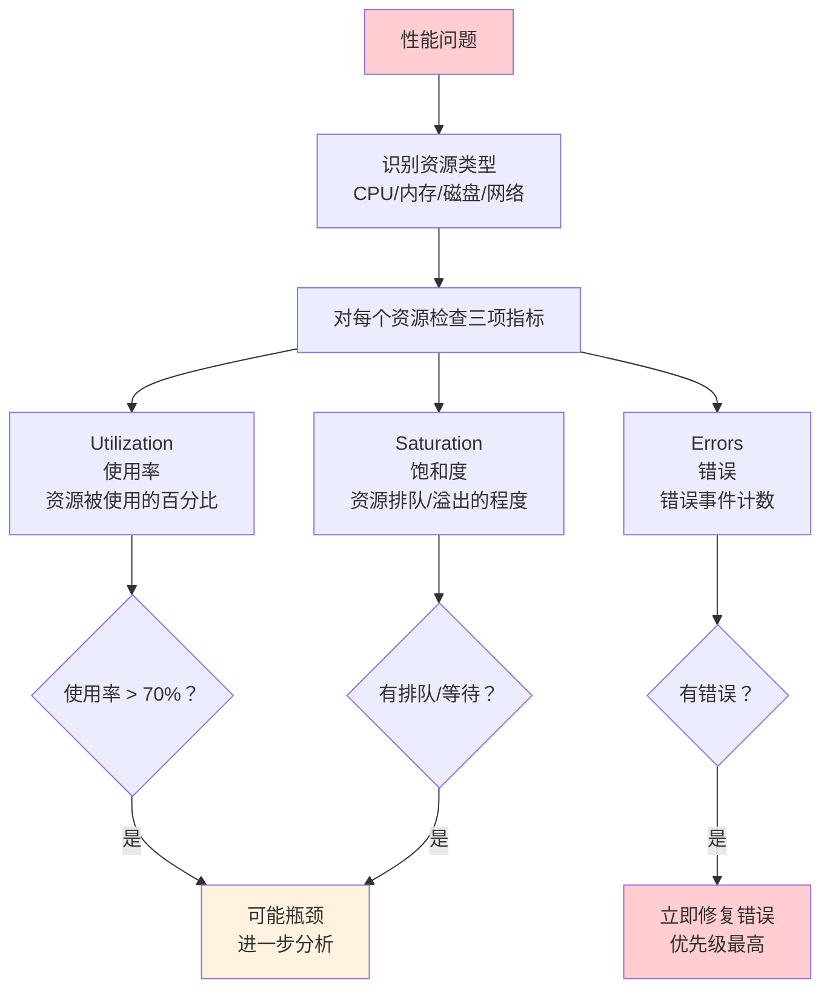
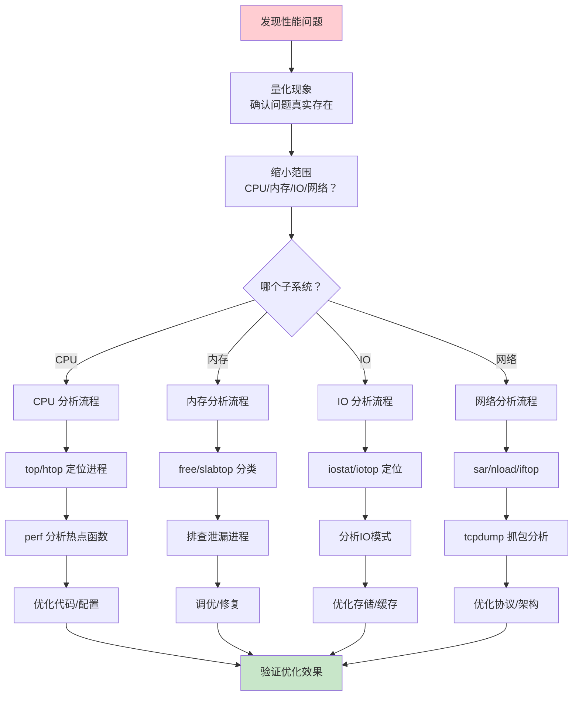

# 性能监控与调优

当系统变慢，你需要的不是盲目重启，而是精确的量化分析——CPU 到底卡在用户态还是内核态？内存是不足还是碎片化？磁盘 IO 是随机读还是顺序写？网络带宽跑满了吗？本文从 USE 方法论出发，系统覆盖 CPU/内存/IO/网络四大子系统的监控与分析，再深入 perf/eBPF 等高级工具，帮你建立"先量化、再定位、后优化"的科学调优能力。

## 1. 性能分析方法论

### 1.1 USE 方法

USE（Utilization/Saturation/Errors）方法是 Brendan Gregg 提出的系统性能分析框架——对每个资源检查三个指标：



| 资源 | Utilization 工具 | Saturation 工具 | Errors 工具 |
|------|-----------------|-----------------|-------------|
| CPU | `top`, `mpstat`, `vmstat` | `runq-sz` (vmstat), 负载均值 | `dmesg`, `mcelog` |
| 内存 | `free`, `vmstat` | 页扫描 (pgscank/pgscand) | `dmesg` (OOM) |
| 网络接口 | `ip -s link`, `sar -n DEV` | `dropped` (ifconfig) | `ethtool -S` |
| 块设备 | `iostat -x`, `sar -d` | `avgqu-sz` (iostat) | `dmesg`, `smartctl` |
| 文件系统 | `df -h`, `stat` | `等待队列长度` | `dmesg` |

### 1.2 性能分析流程



::: important 性能分析的黄金法则
1. **先量化，再优化**：不要凭感觉调参，用数据说话
2. **一次只改一个变量**：否则无法判断哪个修改有效
3. **优化瓶颈**：非瓶颈的优化是浪费时间
4. **建立基线**：优化前记录当前性能指标
5. **可重复测试**：确保测试环境和方法一致
:::

## 2. CPU 性能分析

### 2.1 CPU 使用率详解

```
CPU 时间组成：
┌────────────────────────────────────────────────────────┐
│ 用户态 (us)  │ 系统态 (sy) │ 低优先级 (ni) │ 空闲 (id) │
│              │             │               │ IO等待(wa) │
│              │             │               │ 硬中断(hi) │
│              │             │               │ 软中断(si) │
│              │             │               │ 窃取 (st)  │
└────────────────────────────────────────────────────────┘
```

| 指标 | 含义 | 异常阈值 |
|------|------|---------|
| `us` | 用户态 CPU 时间 | > 70% 持续则需优化应用 |
| `sy` | 内核态 CPU 时间 | > 30% 说明系统调用频繁 |
| `ni` | 低优先级进程 CPU | 通常很低 |
| `id` | 空闲 | < 10% 需关注 |
| `wa` | IO 等待 | > 20% 说明磁盘是瓶颈 |
| `hi` | 硬中断 | > 5% 检查网卡/磁盘中断 |
| `si` | 软中断 | > 5% 检查网络软中断 |
| `st` | 虚拟化被宿主机窃取 | > 5% 宿主机过载 |

### 2.2 top / htop

```bash
# top 常用交互键
# 1       - 显示每个 CPU 核心使用率
# P       - 按 CPU 使用率排序
# M       - 按内存使用率排序
# c       - 显示完整命令行
# H       - 显示线程
# f       - 选择显示字段
# W       - 保存配置

# 批处理模式（适合脚本）
top -b -n 1 | head -20
top -b -n 1 -p $(pgrep -d',' nginx)   # 仅监控 nginx

# htop 优势
# - 直观的 CPU/内存/交换条
# - F5 树状视图（进程父子关系）
# - F9 发送信号
# - 支持鼠标操作
```

### 2.3 mpstat

```bash
# 安装
yum install sysstat       # CentOS
apt install sysstat       # Ubuntu

# 查看 CPU 统计
mpstat                    # 自启动以来的汇总
mpstat 1 5                # 每秒采样，共5次
mpstat -P ALL 1 5         # 每个CPU核心

# 输出示例
# 03:20:01 PM  CPU   %usr  %nice   %sys  %iowait  %irq  %soft  %steal  %guest  %gnice  %idle
# 03:20:02 PM  all   5.00   0.00   2.00    0.00  0.00   1.00    0.00    0.00    0.00  92.00
# 03:20:02 PM    0   8.00   0.00   3.00    0.00  0.00   2.00    0.00    0.00    0.00  87.00
```

### 2.4 Load Average（负载均值）

```bash
uptime
# 15:30:01 up 30 days, 3:20, 2 users, load average: 1.50, 1.20, 0.80
#                                                       1分钟  5分钟 15分钟
```

**Load Average 含义：**

| 负载值 | 含义 |
|--------|------|
| < CPU 核数 | 系统有空闲，正常 |
| = CPU 核数 | 系统满载，无空闲 |
| > CPU 核数 | 有进程在排队等待 CPU |

```bash
# 例：4核CPU
# Load = 2.0 → 系统约 50% 繁忙，正常
# Load = 4.0 → 系统满载
# Load = 8.0 → 平均每个核有1个进程在等待

# 查看CPU核数
nproc
lscpu | grep '^CPU(s):'
```

::: tip Load Average 三个值的解读
- **1min > 5min > 15min**：负载在上升
- **1min < 5min < 15min**：负载在下降
- **三个值相近**：负载稳定
- 只看 Load Average 不够——它包含 D 状态（不可中断等待）进程，可能是 IO 瓶颈而非 CPU 瓶颈
:::

### 2.5 上下文切换

```bash
# vmstat 查看上下文切换
vmstat 1 5
# procs -----------memory---------- ---swap-- -----io---- -system-- ------cpu-----
#  r  b   swpd   free   buff  cache   si   so    bi    bo   in   cs us sy id wa st
#  2  0      0 123456  12345 234567    0    0    10    20  100 5000  5  2 92  0  0
#                                    ^^^  ^^^
#                                    中断  上下文切换

# cs (context switch) 每秒上下文切换次数
# 正常值：< 5000/秒（取决于工作负载）
# 过高值：> 50000/秒，通常由大量线程争抢或锁竞争导致

# per-process 上下文切换
pidstat -w 1 5              # 每秒自愿/非自愿切换
# cswch/s  - 自愿切换（进程主动让出CPU，如等待IO）
# nvcswch/s - 非自愿切换（被调度器强制切换，如时间片耗尽）
```

## 3. 内存分析

### 3.1 Linux 内存模型

```
物理内存布局：
┌──────────────────────────────────────────────────┐
│              用户空间进程 (User Space)              │
├──────────────────────────────────────────────────┤
│              内核 (Kernel)                         │
│  ┌──────────┐ ┌──────────┐ ┌──────────────────┐ │
│  │ Page     │ │ Slab     │ │ Kernel Stack     │ │
│  │ Cache    │ │ Allocator│ │ & 其他内核内存    │ │
│  └──────────┘ └──────────┘ └──────────────────┘ │
├──────────────────────────────────────────────────┤
│              空闲页 (Free Pages)                   │
└──────────────────────────────────────────────────┘
```

### 3.2 free 命令详解

```bash
free -h
#               total        used        free      shared  buff/cache   available
# Mem:           15Gi       5.0Gi       2.0Gi       256Mi       8.0Gi        10Gi
# Swap:         4.0Gi          0B       4.0Gi
```

| 字段 | 含义 |
|------|------|
| `total` | 物理内存总量 |
| `used` | 已使用内存（含 buffer/cache） |
| `free` | 完全空闲内存 |
| `shared` | 共享内存（tmpfs、IPC） |
| `buff/cache` | 缓冲区+页缓存 |
| `available` | **真正可用内存**（含可回收的 cache） |

::: important free 内存解读
- **不要看 `free` 列**：Linux 会用空闲内存做 Page Cache，`free` 少是正常的
- **看 `available` 列**：这才是应用程序真正可用的内存，包含了可回收的 cache
- **经验法则**：`available` < 总内存的 20% 才需要担心
- **buffer vs cache**：buffer 是块设备缓冲区，cache 是文件页缓存，实际场景中可统称 cache
:::

### 3.3 vmstat

```bash
vmstat 1 10
# procs -----------memory---------- ---swap-- -----io---- -system-- ------cpu-----
#  r  b   swpd   free   buff  cache   si   so    bi    bo   in   cs us sy id wa st
#  1  0      0 2048000 102400 8192000    0    0    10    20  100 5000  5  2 92  0  0

# 关键指标：
# si (swap in)  - 从 swap 读入内存（>0 说明内存不够）
# so (swap out) - 从内存写入 swap（>0 说明内存紧张）
# bi (blocks in)  - 块设备读
# bo (blocks out) - 块设备写
# wa (IO wait) - CPU 等待 IO 的百分比

# 内存压力信号：
# 1. si/so > 0          → 正在使用 swap，内存不够
# 2. pgscank/pgscand > 0 → 内核在扫描页面回收，内存紧张
# 3. free 持续下降       → 内存泄漏可能
```

### 3.4 slabtop

```bash
# 查看 Slab 缓存（内核对象缓存）
slabtop -o
# Active / Total Objects (% used)    : 2678432 / 2719281 (98.5%)
#  OBJS ACTIVE  USE OBJ SIZE  SLABS OBJ/SLAB CACHE SIZE NAME
# 524288 524288 100%    0.19K  25664       16    102656K dentry
# 262144 262144 100%    0.98K  65536        4    524288K ext4_inode_cache
# 131072 131072 100%    0.06K   2048       64      8192K kmalloc-64

# 常见 Slab 类型：
# dentry          - 目录项缓存（大量小文件会导致 dentry 膨胀）
# ext4_inode_cache - 文件 inode 缓存
# kmalloc-*       - 通用内核内存分配
# buffer_head     - 块设备缓冲区头
```

### 3.5 缺页中断

```bash
# 查看缺页中断
ps -o pid,comm,majflt,minflt -p <PID>
# majflt (major fault) - 主缺页：需要从磁盘读取
# minflt (minor fault) - 次缺页：从 Page Cache 分配

# 大量 majflt 说明物理内存不足，频繁把页面换到磁盘
pidstat -r 1 5
# minflt/s  majflt/s  VSZ     RSS
```

### 3.6 OOM Killer

```bash
# 查看OOM记录
dmesg | grep -i "out of memory"
dmesg | grep -i "killed process"
journalctl -k | grep -i "oom"

# OOM Score（越高的进程越容易被杀）
cat /proc/<PID>/oom_score
cat /proc/<PID>/oom_score_adj    # 调整值 (-1000 到 1000)

# 保护关键进程不被 OOM Killer 杀掉
echo -1000 > /proc/<PID>/oom_score_adj

# 禁用 OOM Killer（不推荐）
echo 0 > /proc/sys/vm/oom_kill_allocating_task

# 查看当前 OOM 配置
cat /proc/sys/vm/overcommit_memory
cat /proc/sys/vm/overcommit_ratio
```

## 4. IO 分析

### 4.1 iostat

```bash
# 基本 IO 统计
iostat                      # 汇总
iostat -x 1 5               # 扩展信息，每秒采样
iostat -x sda 1 5           # 仅监控 sda

# 关键输出字段
# Device  rrqm/s  wrqm/s  r/s  w/s  rMB/s  wMB/s  avgrq-sz  avgqu-sz  await  r_await  w_await  svctm  %util
#
# rrqm/s, wrqm/s  - 每秒合并的读写请求
# r/s, w/s         - 每秒读写 IOPS
# rMB/s, wMB/s     - 每秒读写吞吐量
# avgrq-sz         - 平均请求大小（扇区数）
# avgqu-sz         - 平均队列长度（>1 说明有排队）
# await            - 平均 IO 延迟（ms）
# svctm            - 平均服务时间（ms）
# %util            - 设备利用率（100% = 饱和）
```

| 指标 | 正常范围 | 瓶颈信号 |
|------|---------|---------|
| `%util` | < 70% | > 80% 设备接近饱和 |
| `await` | HDD < 10ms, SSD < 2ms | 持续偏高 |
| `avgqu-sz` | < 1 | > 2 有排队 |
| `r/s + w/s` | 取决于设备 | 接近设备规格上限 |

### 4.2 iotop

```bash
# 实时查看进程级 IO
iotop
iotop -o            # 仅显示有 IO 的进程
iotob -P            # 仅显示进程（不显示线程）
iotop -p <PID>      # 监控指定进程

# 输出字段
# TID  PRIO  USER     DISK READ  DISK WRITE  SWAPIN  IO>  COMMAND
# 1234 be/4 root       0.00 B/s   50.00 M/s  0.00 % 5.00 % nginx: worker process
```

### 4.3 fio 基准测试

```bash
# 安装
yum install fio       # CentOS
apt install fio       # Ubuntu

# 顺序读测试
fio --name=seqread --rw=read --bs=4M --size=1G --numjobs=1 --runtime=60

# 顺序写测试
fio --name=seqwrite --rw=write --bs=4M --size=1G --numjobs=1 --runtime=60

# 随机读 IOPS 测试
fio --name=randread --rw=randread --bs=4k --size=1G \
    --numjobs=4 --runtime=60 --iodepth=32 --ioengine=libaio

# 随机写 IOPS 测试
fio --name=randwrite --rw=randwrite --bs=4k --size=1G \
    --numjobs=4 --runtime=60 --iodepth=32 --ioengine=libaio

# 混合读写测试（70%读 30%写）
fio --name=mixed --rw=randrw --rwmixread=70 --bs=4k --size=1G \
    --numjobs=4 --runtime=60 --iodepth=32 --ioengine=libaio
```

**典型存储性能参考：**

| 存储类型 | 顺序读 | 顺序写 | 随机读 IOPS | 随机写 IOPS |
|----------|--------|--------|------------|------------|
| HDD 7200RPM | ~150 MB/s | ~150 MB/s | ~100 | ~100 |
| SATA SSD | ~550 MB/s | ~500 MB/s | ~90K | ~80K |
| NVMe SSD | ~3.5 GB/s | ~3.0 GB/s | ~600K | ~500K |
| NVMe Gen5 | ~12 GB/s | ~10 GB/s | ~1.5M | ~1.2M |

## 5. 网络分析

### 5.1 sar 网络统计

```bash
# 安装
yum install sysstat

# 网络接口统计
sar -n DEV 1 5               # 所有接口
sar -n DEV 1 5 | grep eth0   # 指定接口

# 关键字段
# IFACE  rxpck/s  txpck/s  rxkB/s  txkB/s  rxcmp/s  txcmp/s  rxmcst/s
# eth0   1000.00  500.00   800.00  400.00    0.00     0.00     0.00

# rxpck/s, txpck/s - 每秒收发包数（pps）
# rxkB/s, txkB/s   - 每秒收发千字节数

# TCP 统计
sar -n TCP 1 5
# active/s - 每秒主动连接数（connect）
# passive/s - 每秒被动连接数（accept）
# iseg/s   - 每秒入段数
# oseg/s   - 每秒出段数

# 历史数据（默认保存在 /var/log/sa/）
sar -n DEV -f /var/log/sa/sa01    # 查看某天的数据
sar -n DEV -s 10:00:00 -e 12:00:00  # 指定时间段
```

### 5.2 nload / iftop

```bash
# nload - 实时网络流量
nload
nload eth0
# 显示实时入/出流量曲线和数值

# iftop - 按连接显示流量
iftop
iftop -i eth0
iftop -n              # 不解析域名
iftop -P              # 显示端口
iftop -F 192.168.1.0/24  # 过滤网段
```

### 5.3 网络性能基准测试

```bash
# iperf3 带宽测试
# 服务端
iperf3 -s

# 客户端
iperf3 -c 192.168.1.1              # TCP 带宽
iperf3 -c 192.168.1.1 -u -b 1G    # UDP 带宽（1Gbps 目标）
iperf3 -c 192.168.1.1 -P 4        # 4 并行流
iperf3 -c 192.168.1.1 -R          # 反向测试（服务端发，客户端收）

# 延迟测试
ping -c 100 192.168.1.1 | tail -1
# rtt min/avg/max/mdev

# netperf 更专业的网络基准测试
netperf -H 192.168.1.1            # TCP_STREAM
netperf -H 192.168.1.1 -t UDP_STREAM  # UDP
netperf -H 192.168.1.1 -t TCP_RR      # 请求/响应延迟
```

## 6. 系统级调优

### 6.1 CPU 调度器

```bash
# 查看当前调度器（每个CPU）
cat /sys/devices/system/cpu/cpu0/cpufreq/scaling_governor

# 可用调度器
cat /sys/devices/system/cpu/cpu0/cpufreq/scaling_available_governors
# conservative ondemand userspace powersave performance schedutil
```

| 调度器 | 说明 | 适用场景 |
|--------|------|---------|
| `performance` | 固定最高频率 | 低延迟、高性能计算 |
| `powersave` | 固定最低频率 | 省电 |
| `ondemand` | 根据负载调频 | 桌面/通用 |
| `conservative` | 渐进调频 | 笔记本 |
| `schedutil` | 内核调度器驱动的调频 | 现代内核默认 |

```bash
# 设置为性能模式
for cpu in /sys/devices/system/cpu/cpu*/cpufreq/scaling_governor; do
    echo performance | sudo tee "$cpu"
done

# 或使用 cpupower
yum install kernel-tools
cpupower frequency-set -g performance
```

### 6.2 NUMA 调优

```bash
# 查看 NUMA 拓扑
numactl --hardware
# available: 2 nodes (0-1)
# node 0 size: 32768 MB
# node 1 size: 32768 MB

# 查看进程的 NUMA 内存分布
numastat -p <PID>

# NUMA 绑定
numactl --cpunodebind=0 --membind=0 ./myapp    # 绑定到节点0
numactl --physcpubind=0-7 ./myapp              # 绑定到CPU 0-7

# 查看 NUMA 调度统计
cat /proc/zoneinfo | grep -A5 "Node"
```

::: tip NUMA 与数据库
数据库（MySQL/PostgreSQL）对 NUMA 敏感——如果进程在节点 0 分配内存但跑在节点 1 的 CPU 上，每次内存访问都要跨 NUMA 节点，延迟增加约 50%。建议：
- 绑定数据库到同一 NUMA 节点
- 或使用 `numactl --interleave=all` 交错分配
:::

### 6.3 IRQ 亲和性

```bash
# 查看 IRQ 分配
cat /proc/interrupts

# 查看特定 IRQ 的 CPU 亲和性
cat /proc/irq/32/smp_affinity

# 设置 IRQ 亲和性（将网卡中断绑定到特定CPU）
echo 0f > /proc/irq/32/smp_affinity    # CPU 0-3

# 使用 irqbalance 自动分配
systemctl status irqbalance

# 高性能场景下关闭 irqbalance 手动调优
systemctl stop irqbalance

# 设置网卡 RPS（Receive Packet Steering）
echo ff > /sys/class/net/eth0/queues/rx-0/rps_cpus
```

## 7. 应用性能分析

### 7.1 perf

perf 是 Linux 性能分析的瑞士军刀，直接采样硬件性能计数器：

```bash
# 安装
yum install perf              # CentOS
apt install linux-tools-common # Ubuntu

# CPU 热点分析（最常用）
perf top                      # 实时热点（类似 top 但精确到函数）
perf top -g                   # 带调用图
perf top -p <PID>             # 监控指定进程

# 采样记录
perf record -g -p <PID> sleep 30    # 采样30秒
perf record -g --call-graph dwarf ./myapp   # 采样整个程序
perf report                          # 分析采样结果

# 火焰图生成
perf record -g -p <PID> sleep 30
perf script | stackcollapse-perf.pl | flamegraph.pl > flame.svg
# 或使用 Brendan Gregg 的 FlameGraph 工具
git clone https://github.com/brendangregg/FlameGraph
perf script | FlameGraph/stackcollapse-perf.pl | FlameGraph/flamegraph.pl > flame.svg

# 静态追踪点
perf list                    # 列出所有可追踪事件
perf list | grep syscalls    # 系统调用
perf list | grep sched       # 调度事件

# 追踪系统调用
perf trace -p <PID>
perf trace -e syscalls:sys_enter_openat    # 追踪 open 系统调用

# 硬件缓存事件
perf stat -e cache-misses,cache-references,instructions,cycles ./myapp

# 上下文切换分析
perf record -e sched:sched_switch -a sleep 10
perf report
```

### 7.2 strace / ltrace

```bash
# strace 追踪系统调用
strace -p <PID>                    # 附加到运行中的进程
strace -c -p <PID>                 # 统计模式（哪个系统调用耗时最多）
strace -e trace=network -p <PID>   # 仅追踪网络相关
strace -e trace=file -p <PID>      # 仅追踪文件相关
strace -e trace=read,write -p <PID> # 仅追踪读写
strace -f -p <PID>                 # 追踪子进程
strace -tt -p <PID>                # 带微秒时间戳
strace -T -p <PID>                 # 显示系统调用耗时
strace -o trace.log ./myapp        # 输出到文件

# ltrace 追踪库函数调用
ltrace -p <PID>
ltrace -c -p <PID>                 # 统计模式
ltrace -e malloc,free -p <PID>     # 追踪内存分配
```

::: warning strace 的性能影响
`strace` 使用 ptrace 机制，会使被追踪进程**慢 10-100 倍**！
- 生产环境慎用，适合短时间诊断
- 优先使用 `perf`（基于采样，开销小）
- `strace -c` 统计模式开销相对较小
:::

### 7.3 eBPF

eBPF（Extended Berkeley Packet Filter）是 Linux 内核的可编程沙箱，能够在内核态安全地运行自定义代码，实现零开销观测：

```bash
# 安装 BCC 工具集
yum install bcc-tools           # CentOS
apt install bpfcc-tools         # Ubuntu

# BCC 工具一览（/usr/share/bcc/tools/）

# CPU 分析
execsnoop          # 跟踪新进程创建
offcputime         # 离CPU时间分析（找出等待原因）
cpudist            # CPU on/off 时间分布

# 内存分析
memleak            # 检测内存泄漏
oomkill            # 跟踪 OOM Killer
slabratetop        # Slab 分配速率

# IO 分析
biolatency         # 块设备 IO 延迟分布
biosnoop           # 每次块 IO 的详情
biotop             # 块 IO Top
filetop            # 文件读写 Top
opensnoop          # 跟踪 open 系统调用

# 网络分析
tcpconnect         # 跟踪 TCP 主动连接
tcpaccept          # 跟踪 TCP 被动连接
tcpretrans         # 跟踪 TCP 重传
tcplife            # TCP 连接生命周期
sockstat           # Socket 统计

# 使用示例
# 跟踪所有 TCP 连接
/usr/share/bcc/tools/tcpconnect

# 查看块 IO 延迟
/usr/share/bcc/tools/biolatency 1 10

# 检测内存泄漏
/usr/share/bcc/tools/memleak -p <PID>
```

```bash
# bpftrace - 单行 eBPF 追踪
apt install bpftrace

# 追踪 open 系统调用
bpftrace -e 'tracepoint:syscalls:sys_enter_open { printf("%s: %s\n", comm, str(args->filename)); }'

# 追踪进程上下文切换
bpftrace -e 'tracepoint:sched:sched_switch { printf("PID %d -> PID %d\n", args->prev_pid, args->next_pid); }'

# 按进程统计 IO 大小
bpftrace -e 'tracepoint:block:block_rq_issue { @size[comm] = hist(args->bytes); }'
```

::: important eBPF 的优势
- **低开销**：在内核态执行，不需要上下文切换
- **安全**：验证器确保 eBPF 程序不会崩溃内核
- **可编程**：可以自定义观测逻辑
- **无需修改内核**：动态加载，无需重启

eBPF 正在成为云原生可观测性的基础设施——Cilium、Falco、Pixie 等都基于 eBPF。
:::

## 8. 常见性能问题与解决方案

### 8.1 CPU 瓶颈

| 症状 | 可能原因 | 排查方法 | 解决方案 |
|------|---------|---------|---------|
| us 高 | 应用计算密集 | perf top 定位热点 | 优化算法/加缓存 |
| sy 高 | 系统调用频繁 | strace -c | 减少系统调用/用批处理 |
| wa 高 | IO 等待 | iostat -x | 优化存储/减少IO |
| hi 高 | 硬中断多 | /proc/interrupts | 调整 IRQ 亲和性 |
| si 高 | 软中断多 | netdev_budget | RPS/RFS 分散负载 |
| 上下文切换高 | 线程过多/锁竞争 | pidstat -w | 减少线程/优化锁 |

### 8.2 内存瓶颈

| 症状 | 可能原因 | 排查方法 | 解决方案 |
|------|---------|---------|---------|
| available 低 | 内存不足 | free -h | 增加内存/优化使用 |
| si/so > 0 | 使用 swap | vmstat | 增加内存/调 swappiness |
| OOM Kill | 内存泄漏/不足 | dmesg | 修复泄漏/增加内存 |
| Slab 膨胀 | dentry/inode 缓存 | slabtop | 调 vm.vfs_cache_pressure |
| 大量 majflt | 物理内存不足 | pidstat -r | 增加内存/减少工作集 |

### 8.3 IO 瓶颈

| 症状 | 可能原因 | 排查方法 | 解决方案 |
|------|---------|---------|---------|
| %util 高 | IO 饱和 | iostat -x | 升级存储/减少IO |
| await 高 | IO 延迟大 | iostat -x | SSD/优化IO模式 |
| 随机IO多 | 小文件读写 | iostat (avgrq-sz) | 批量IO/合并写 |
| 写放大 | 日志/fsync | strace -e fdatasync | 批量写/调整刷盘频率 |

### 8.4 网络瓶颈

| 症状 | 可能原因 | 排查方法 | 解决方案 |
|------|---------|---------|---------|
| 带宽跑满 | 流量大 | nload/iftop | 升级带宽/压缩 |
| 延迟高 | 队列/重传 | ping/mtr | 优化路由/检查丢包 |
| 连接数满 | 连接泄露 | ss -s | 检查 TIME_WAIT/CLOSE_WAIT |
| 丢包 | 缓冲区溢出 | ethtool -S | 增大缓冲区/调整 RPS |

## 9. 实战：一键性能诊断脚本

```bash
#!/bin/bash
# ============================================================
# 一键性能诊断脚本
# ============================================================

set -euo pipefail

echo "=============================="
echo " 性能诊断报告"
echo " $(date '+%Y-%m-%d %H:%M:%S')"
echo " $(hostname)"
echo "=============================="

# 1. CPU 概况
echo -e "\n========== CPU =========="
echo "CPU 核数: $(nproc)"
echo "负载均值: $(cat /proc/loadavg | awk '{print $1, $2, $3}')"
echo "运行时间: $(uptime -p)"
echo ""
mpstat 1 1 | tail -2

# 2. 内存概况
echo -e "\n========== 内存 =========="
free -h
echo ""
echo "Swap 使用:"
swapon --show
echo ""
echo "Top 10 内存占用进程:"
ps aux --sort=-%mem | head -11

# 3. IO 概况
echo -e "\n========== 磁盘 IO =========="
iostat -x 1 1 2>/dev/null | tail -n +4
echo ""
echo "Top 10 IO 占用进程:"
iotop -b -o -n 1 2>/dev/null | head -15 || echo "iotop requires root"

# 4. 网络概况
echo -e "\n========== 网络 =========="
echo "连接统计:"
ss -s
echo ""
echo "监听端口:"
ss -tlnp | head -20
echo ""
echo "网络接口流量:"
cat /proc/net/dev | tail -n +3 | awk '{printf "  %-20s RX: %s MB  TX: %s MB\n", $1, $2/1048576, $10/1048576}'

# 5. 磁盘空间
echo -e "\n========== 磁盘空间 =========="
df -h | grep -E '^/dev|^Filesystem'

# 6. 性能瓶颈检查
echo -e "\n========== 瓶颈检查 =========="

# CPU 瓶颈
load=$(cat /proc/loadavg | awk '{print $1}')
cpus=$(nproc)
load_pct=$(echo "$load $cpus" | awk '{printf "%.0f", $1/$2*100}')
if (( load_pct > 80 )); then
    echo "[!] CPU 瓶颈: 负载 ${load} / ${cpus} 核 (${load_pct}%)"
else
    echo "[OK] CPU: 负载 ${load} / ${cpus} 核 (${load_pct}%)"
fi

# 内存瓶颈
available=$(free -m | awk '/Mem:/{print $7}')
total=$(free -m | awk '/Mem:/{print $2}')
mem_pct=$(echo "$available $total" | awk '{printf "%.0f", (1-$1/$2)*100}')
if (( mem_pct > 85 )); then
    echo "[!] 内存瓶颈: 已用 ${mem_pct}% (可用 ${available}MB)"
else
    echo "[OK] 内存: 已用 ${mem_pct}%"
fi

# Swap 检查
swap_used=$(free -m | awk '/Swap:/{print $3}')
if (( swap_used > 0 )); then
    echo "[!] Swap 使用: ${swap_used}MB（内存可能不足）"
else
    echo "[OK] Swap: 未使用"
fi

# IO 检查
io_wait=$(vmstat 1 2 | tail -1 | awk '{print $16}')
if (( io_wait > 20 )); then
    echo "[!] IO 瓶颈: iowait ${io_wait}%"
else
    echo "[OK] IO: iowait ${io_wait}%"
fi

echo -e "\n=============================="
echo " 诊断完成"
echo "=============================="
```

## 参考资源

- 《Systems Performance》—— Brendan Gregg（性能分析圣经）
- 《Linux 内核设计与实现》—— Robert Love
- [Brendan Gregg 性能分析博客](https://www.brendangregg.com/)
- [eBPF 官方文档](https://ebpf.io/)
- [perf Wiki](https://perf.wiki.kernel.org/)
- [BCC 工具集](https://github.com/iovisor/bcc)
