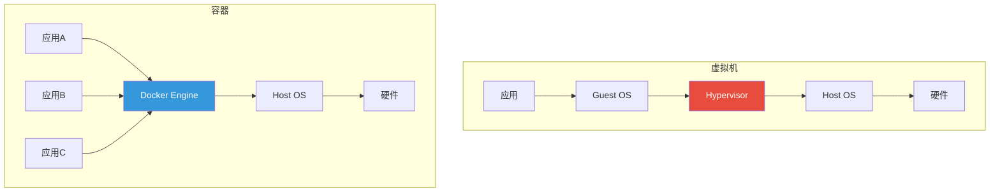
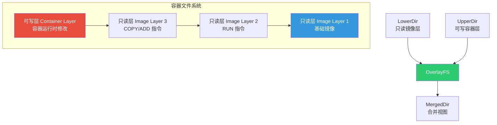
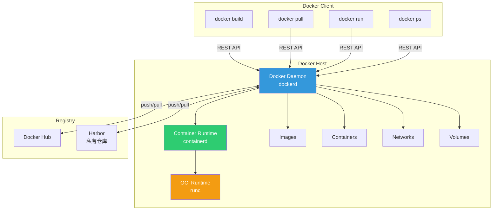
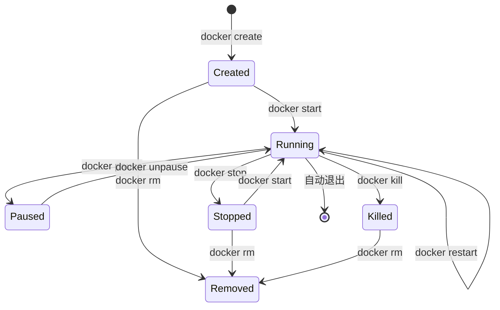
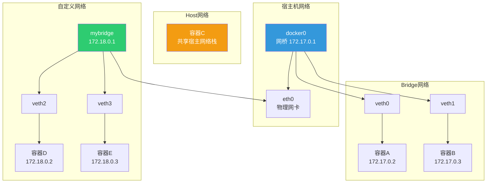
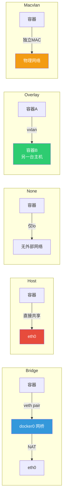
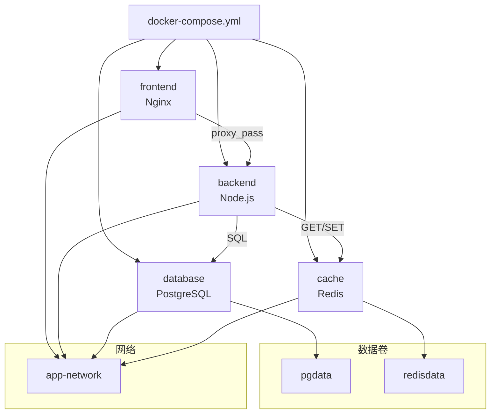
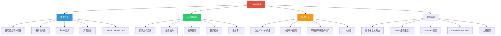

# 容器化与 Docker

::: important 核心要点
容器技术的本质是 Linux 内核的 namespace（隔离）+ cgroup（限制）+ unionfs（分层文件系统）三大机制的组合运用。Docker 在此基础上提供了标准化的镜像格式、简洁的 CLI 和完善的生态，让容器技术走向大众。理解底层原理是掌握容器化的关键。
:::

## 1. 容器原理

### 1.1 容器 vs 虚拟机



| 特性 | 虚拟机 | 容器 |
|------|--------|------|
| 隔离级别 | 硬件级（独立内核） | 进程级（共享内核） |
| 启动速度 | 分钟级 | 秒级/毫秒级 |
| 资源开销 | 大（需要完整 Guest OS） | 小（共享 Host 内核） |
| 镜像大小 | GB 级 | MB 级 |
| 性能 | 有虚拟化损耗 | 接近原生 |
| 安全性 | 强隔离 | 共享内核，隔离较弱 |
| 密度 | 低 | 高 |

### 1.2 Namespace - 资源隔离

Namespace 是 Linux 内核提供的资源隔离机制，容器通过 namespace 实现进程组的资源隔离：

| Namespace | 隔离内容 | 系统调用 | 内核版本 |
|-----------|----------|----------|----------|
| **PID** | 进程 ID | `CLONE_NEWPID` | 2.6.24 |
| **Network** | 网络栈 | `CLONE_NEWNET` | 2.6.29 |
| **Mount** | 文件系统挂载点 | `CLONE_NEWNS` | 2.4.19 |
| **UTS** | 主机名和域名 | `CLONE_NEWUTS` | 2.6.19 |
| **IPC** | 进程间通信 | `CLONE_NEWIPC` | 2.6.19 |
| **User** | 用户和组 ID | `CLONE_NEWUSER` | 3.8 |
| **Cgroup** | cgroup 根目录 | `CLONE_NEWCGROUP` | 4.6 |

```bash
# 查看进程的 namespace
ls -la /proc/$$/ns/
# lrwxrwxrwx 1 user user 0 cgroup -> 'cgroup:[4026531835]'
# lrwxrwxrwx 1 user user 0 ipc    -> 'ipc:[4026531839]'
# lrwxrwxrwx 1 user user 0 mnt    -> 'mnt:[4026531840]'
# lrwxrwxrwx 1 user user 0 net    -> 'net:[4026531969]'
# lrwxrwxrwx 1 user user 0 pid    -> 'pid:[4026531836]'
# lrwxrwxrwx 1 user user 0 user   -> 'user:[4026531837]'
# lrwxrwxrwx 1 user user 0 uts    -> 'uts:[4026531838]'

# 查看容器的 namespace
docker inspect --format '{{.State.Pid}}' mycontainer
PID=$(docker inspect --format '{{.State.Pid}}' mycontainer)
ls -la /proc/$PID/ns/

# 使用 unshare 创建新的 namespace
sudo unshare --pid --mount --fork /bin/bash
# 在新的 PID namespace 中，当前进程 PID 为 1

# 使用 nsenter 进入容器的 namespace
sudo nsenter -t $PID -n -m -p /bin/bash
```

#### PID Namespace 详解

```bash
# PID namespace 实现进程 ID 隔离
# 容器内的进程 PID 从 1 开始
# 容器内看不到宿主机的其他进程

# 在容器内
docker exec mycontainer ps aux
# PID   USER     COMMAND
# 1     root     /app/main
# 15    root     /app/worker
# 23    root     ps aux

# 在宿主机上
ps aux | grep mycontainer
# user  12345  ...  /app/main       # 容器内 PID 1 = 宿主 PID 12345
# user  12567  ...  /app/worker     # 容器内 PID 15 = 宿主 PID 12567
```

#### Network Namespace 详解

```bash
# Network namespace 隔离网络栈
# 每个 namespace 有独立的：网卡、路由表、iptables、端口号空间

# 创建 network namespace
sudo ip netns add ns1
sudo ip netns add ns2

# 查看
ip netns list

# 在 namespace 中执行命令
sudo ip netns exec ns1 ip addr
# 1: lo: <LOOPBACK> mtu 65536 ...
#     inet 127.0.0.1/8 scope host lo

# 创建 veth pair 连接两个 namespace
sudo ip link add veth1 type veth peer name veth2
sudo ip link set veth1 netns ns1
sudo ip link set veth2 netns ns2

# 配置 IP 地址
sudo ip netns exec ns1 ip addr add 10.0.0.1/24 dev veth1
sudo ip netns exec ns1 ip link set veth1 up
sudo ip netns exec ns1 ip link set lo up

sudo ip netns exec ns2 ip addr add 10.0.0.2/24 dev veth2
sudo ip netns exec ns2 ip link set veth2 up
sudo ip netns exec ns2 ip link set lo up

# 测试连通性
sudo ip netns exec ns1 ping 10.0.0.2
```

### 1.3 Cgroup - 资源限制

Cgroup（Control Group）对进程组进行资源限制、优先级分配和计量：

```bash
# 查看进程的 cgroup
cat /proc/$$/cgroup
# 0::/user.slice/user-1000.slice/session-1.scope

# 查看容器的 cgroup
docker inspect --format '{{.HostConfig.CgroupParent}}' mycontainer

# cgroup v2 目录结构
ls /sys/fs/cgroup/
# cgroup.controllers  cgroup.stat  cpu.max  cpu.weight  memory.max  ...

# 查看容器的资源限制
docker inspect mycontainer | jq '.[0].HostConfig.Memory'
docker inspect mycontainer | jq '.[0].HostConfig.CpuQuota'
docker inspect mycontainer | jq '.[0].HostConfig.CpuPeriod'
```

#### Cgroup 资源控制示例

```bash
# 创建 cgroup
sudo mkdir /sys/fs/cgroup/myapp

# 设置内存限制
echo "512M" | sudo tee /sys/fs/cgroup/myapp/memory.max

# 设置 CPU 限制
echo "50000 100000" | sudo tee /sys/fs/cgroup/myapp/cpu.max
# 50000/100000 = 50% CPU

# 将进程加入 cgroup
echo $$ | sudo tee /sys/fs/cgroup/myapp/cgroup.procs

# 查看资源使用
cat /sys/fs/cgroup/myapp/memory.current
cat /sys/fs/cgroup/myapp/cpu.stat
```

### 1.4 UnionFS - 分层文件系统

UnionFS（联合文件系统）是容器镜像分层的基础：



```bash
# 查看容器的 OverlayFS 挂载
docker inspect mycontainer | jq '.[0].GraphDriver'

# 输出示例：
# {
#   "Data": {
#     "LowerDir": "/var/lib/docker/overlay2/xxx/init-id:/var/lib/docker/overlay2/yyy/merged",
#     "MergedDir": "/var/lib/docker/overlay2/zzz/merged",
#     "UpperDir": "/var/lib/docker/overlay2/zzz/diff",
#     "WorkDir": "/var/lib/docker/overlay2/zzz/work"
#   },
#   "Name": "overlay2"
# }

# 查看镜像分层
docker history nginx:latest

# 输出示例：
# IMAGE          CREATED       CREATED BY                                      SIZE
# abc123def456   2 weeks ago   /bin/sh -c #(nop)  CMD ["nginx" "-g" "daemon…   0B
# 789012def345   2 weeks ago   /bin/sh -c #(nop)  STOPSIGNAL SIGQUIT           0B
# 345678abc901   2 weeks ago   /bin/sh -c #(nop)  EXPOSE 80                    0B
# def123456789   2 weeks ago   /bin/sh -c #(nop) COPY file:xxx in /           4.61kB
# 0123456789ab   2 weeks ago   /bin/sh -c apt-get update && apt-get install…   31.2MB
# cdef01234567   2 weeks ago   /bin/sh -c #(nop) ADD file:xxx in /            77.8MB
```

::: tip 镜像分层的关键特性
1. **只读层共享**：多个容器可以共享相同的基础镜像层，节省磁盘空间
2. **写时复制（CoW）**：修改文件时，从只读层复制到可写层再修改
3. **分层构建**：每条 Dockerfile 指令创建一个新层
4. **缓存复用**：构建时如果某层未变化，可以复用缓存
:::

## 2. Docker 架构

### 2.1 Docker 整体架构



| 组件 | 说明 |
|------|------|
| **Docker Client** | 命令行工具，与 Daemon 通信 |
| **Docker Daemon** | 后台服务，管理镜像、容器、网络、卷 |
| **containerd** | 容器运行时，管理容器生命周期 |
| **runc** | OCI 兼容的底层运行时，创建和运行容器 |
| **Registry** | 镜像仓库，存储和分发镜像 |

### 2.2 Docker 版本与安装

```bash
# ===== Ubuntu/Debian 安装 =====
# 卸载旧版本
sudo apt-get remove docker docker-engine docker.io containerd runc

# 安装依赖
sudo apt-get update
sudo apt-get install ca-certificates curl gnupg

# 添加 Docker 官方 GPG 密钥
sudo install -m 0755 -d /etc/apt/keyrings
curl -fsSL https://download.docker.com/linux/ubuntu/gpg | sudo gpg --dearmor -o /etc/apt/keyrings/docker.gpg
sudo chmod a+r /etc/apt/keyrings/docker.gpg

# 添加仓库
echo "deb [arch=$(dpkg --print-architecture) signed-by=/etc/apt/keyrings/docker.gpg] https://download.docker.com/linux/ubuntu $(. /etc/os-release && echo $VERSION_CODENAME) stable" | sudo tee /etc/apt/sources.list.d/docker.list > /dev/null

# 安装
sudo apt-get update
sudo apt-get install docker-ce docker-ce-cli containerd.io docker-buildx-plugin docker-compose-plugin

# ===== RHEL/CentOS/Fedora 安装 =====
sudo dnf install -y dnf-utils
sudo dnf config-manager --add-repo https://download.docker.com/linux/centos/docker-ce.repo
sudo dnf install docker-ce docker-ce-cli containerd.io docker-buildx-plugin docker-compose-plugin

# ===== 启动并启用 =====
sudo systemctl enable --now docker

# ===== 验证安装 =====
docker --version
docker compose version
sudo docker run hello-world
```

### 2.3 非 root 用户使用 Docker

```bash
# 创建 docker 组
sudo groupadd docker

# 将当前用户加入 docker 组
sudo usermod -aG docker $USER

# 刷新组权限（或重新登录）
newgrp docker

# 验证（不需要 sudo）
docker run hello-world
```

::: warning 安全提醒
将用户加入 docker 组等同于赋予 root 权限，因为 docker 组的用户可以通过挂载 `/etc/shadow` 等方式获取主机 root 权限。生产环境建议使用 sudo 或配置 rootless Docker。
:::

## 3. 镜像管理

### 3.1 镜像基本操作

```bash
# ===== 搜索镜像 =====
docker search nginx
docker search --filter stars=1000 nginx
docker search --filter is-official=true nginx

# ===== 拉取镜像 =====
docker pull nginx                        # 默认 latest
docker pull nginx:1.25                   # 指定标签
docker pull nginx@sha256:abc123...       # 指定摘要（最精确）
docker pull --platform linux/arm64 nginx  # 指定平台

# ===== 列出镜像 =====
docker images
docker image ls
docker images --filter dangling=true     # 仅显示悬空镜像
docker images --format "table {{.Repository}}\t{{.Tag}}\t{{.Size}}"

# ===== 删除镜像 =====
docker rmi nginx:1.25
docker image prune                       # 删除悬空镜像
docker image prune -a                    # 删除所有未使用的镜像

# ===== 镜像详情 =====
docker inspect nginx:latest
docker history nginx:latest              # 查看分层历史

# ===== 镜像标签 =====
docker tag nginx:latest myregistry/nginx:v1.0

# ===== 镜像导出/导入 =====
docker save nginx:latest -o nginx.tar
docker load -i nginx.tar

# ===== 镜像推送 =====
docker push myregistry/nginx:v1.0
```

### 3.2 Dockerfile 详解

```dockerfile
# ===== Dockerfile 指令完整参考 =====

# 基础镜像（必须是第一条非注释指令）
FROM ubuntu:22.04

# 构建参数（仅构建时可用，不保留在镜像中）
ARG VERSION=1.0.0
ARG BUILD_DATE

# 维护者信息（已弃用，改用 LABEL）
LABEL maintainer="admin@example.com"
LABEL version="${VERSION}"
LABEL description="My Application"
LABEL build-date="${BUILD_DATE}"

# 设置环境变量（保留在镜像和容器中）
ENV APP_HOME=/opt/myapp
ENV NODE_ENV=production
ENV PATH="${APP_HOME}/bin:${PATH}"

# 设置工作目录
WORKDIR ${APP_HOME}

# 复制文件（推荐使用 COPY）
COPY package.json package-lock.json ./
COPY src/ ./src/
COPY --chown=appuser:appgroup config/ ./config/

# ADD 的特殊功能（自动解压 tar、支持 URL）
ADD https://example.com/app.tar.gz /opt/
ADD archive.tar.gz /opt/

# 运行命令（每条 RUN 创建一个新层）
# 使用 && 合并命令减少层数
RUN apt-get update && \
    apt-get install -y --no-install-recommends \
        curl \
        ca-certificates \
        gnupg && \
    curl -fsSL https://deb.nodesource.com/setup_20.x | bash - && \
    apt-get install -y nodejs && \
    apt-get clean && \
    rm -rf /var/lib/apt/lists/*

# 安装依赖（利用缓存，package.json 不变时跳过）
RUN npm ci --only=production

# 创建用户和组
RUN groupadd -r appuser && \
    useradd -r -g appuser -d ${APP_HOME} -s /sbin/nologin appuser && \
    chown -R appuser:appuser ${APP_HOME}

# 暴露端口（仅声明，不实际映射）
EXPOSE 3000
EXPOSE 8080/udp

# 挂载点（声明数据卷）
VOLUME ["/data", "/var/log/myapp"]

# 健康检查
HEALTHCHECK --interval=30s --timeout=5s --start-period=10s --retries=3 \
    CMD curl -f http://localhost:3000/health || exit 1

# 切换用户（后续指令和容器运行都使用此用户）
USER appuser

# 入口点（容器启动时执行的命令）
ENTRYPOINT ["node", "server.js"]

# 默认参数（可被 docker run 的参数覆盖）
CMD ["--port", "3000"]
```

#### ENTRYPOINT 与 CMD 的区别

| 组合 | Dockerfile | docker run 参数 | 实际执行 |
|------|-----------|----------------|----------|
| ENTRYPOINT + CMD | `ENTRYPOINT ["node"]` `CMD ["server.js"]` | 无 | `node server.js` |
| ENTRYPOINT + CMD | `ENTRYPOINT ["node"]` `CMD ["server.js"]` | `--inspect` | `node --inspect` |
| 仅 CMD | `CMD ["node", "server.js"]` | 无 | `node server.js` |
| 仅 CMD | `CMD ["node", "server.js"]` | `--inspect` | `--inspect`（覆盖 CMD） |

::: important ENTRYPOINT vs CMD
- **ENTRYPOINT**：定义容器的"可执行程序"，不易被覆盖（需 `--entrypoint`）
- **CMD**：定义默认参数，被 `docker run` 的命令行参数完全覆盖
- **最佳实践**：ENTRYPOINT 定义主程序，CMD 定义默认参数
- **exec 格式**（JSON 数组）：推荐，直接执行，信号正确传递
- **shell 格式**（字符串）：以 `/bin/sh -c` 执行，信号不会传递到应用
:::

### 3.3 多阶段构建

多阶段构建显著减小最终镜像大小：

```dockerfile
# ===== Node.js 多阶段构建 =====

# 阶段 1: 构建
FROM node:20-alpine AS builder

WORKDIR /app
COPY package*.json ./
RUN npm ci
COPY . .
RUN npm run build

# 阶段 2: 生产镜像
FROM node:20-alpine AS production

WORKDIR /app
COPY package*.json ./
RUN npm ci --only=production && \
    npm cache clean --force
COPY --from=builder /app/dist ./dist

USER node
EXPOSE 3000
HEALTHCHECK --interval=30s --timeout=3s \
    CMD wget --no-verbose --tries=1 --spider http://localhost:3000/health || exit 1

ENTRYPOINT ["node", "dist/server.js"]
```

```dockerfile
# ===== Go 多阶段构建 =====

# 阶段 1: 编译
FROM golang:1.22-alpine AS builder

RUN apk add --no-cache git
WORKDIR /app
COPY go.mod go.sum ./
RUN go mod download
COPY . .
RUN CGO_ENABLED=0 GOOS=linux go build -ldflags="-s -w" -o /app/myapp .

# 阶段 2: 最终镜像（scratch 空镜像）
FROM scratch AS production

COPY --from=builder /etc/ssl/certs/ca-certificates.crt /etc/ssl/certs/
COPY --from=builder /app/myapp /myapp

EXPOSE 8080
ENTRYPOINT ["/myapp"]
```

```dockerfile
# ===== Java 多阶段构建 =====

# 阶段 1: 构建
FROM eclipse-temurin:21-jdk AS builder

WORKDIR /app
COPY gradle/ gradle/
COPY gradlew build.gradle settings.gradle ./
RUN ./gradlew dependencies --no-daemon
COPY src/ src/
RUN ./gradlew bootJar --no-daemon

# 阶段 2: 运行
FROM eclipse-temurin:21-jre AS production

WORKDIR /app
COPY --from=builder /app/build/libs/*.jar app.jar

RUN groupadd -r spring && useradd -r -g spring spring
USER spring

EXPOSE 8080
HEALTHCHECK --interval=30s --timeout=3s \
    CMD curl -f http://localhost:8080/actuator/health || exit 1

ENTRYPOINT ["java", "-jar", "app.jar"]
```

### 3.4 镜像瘦身策略

| 策略 | 说明 | 效果 |
|------|------|------|
| 使用 Alpine 基础镜像 | 基于 musl libc，~5MB | 大幅减小 |
| 多阶段构建 | 仅复制构建产物 | 去除构建工具 |
| 合并 RUN 指令 | 减少镜像层数 | 减小层大小 |
| 清理缓存 | apt/yum cache, npm cache | 去除临时文件 |
| 使用 .dockerignore | 排除不需要的文件 | 减小构建上下文 |
| 使用 scratch 镜像 | 空基础镜像（Go/Rust） | 最小镜像 |
| 使用 distroless | 仅包含应用运行时 | 去除 shell 和包管理器 |

```dockerfile
# ===== .dockerignore =====
# 排除不需要的文件，减小构建上下文
.git
.github
node_modules
npm-debug.log
Dockerfile
docker-compose*.yml
.env
.env.*
*.md
.vscode
.idea
coverage
dist
tmp
```

```dockerfile
# ===== 使用 distroless =====
# 阶段 1: 构建
FROM node:20 AS builder
WORKDIR /app
COPY package*.json ./
RUN npm ci
COPY . .
RUN npm run build

# 阶段 2: distroless 运行
FROM gcr.io/distroless/nodejs20-debian12
COPY --from=builder /app/dist /app/dist
COPY --from=builder /app/node_modules /app/node_modules
WORKDIR /app
EXPOSE 3000
CMD ["dist/server.js"]
# 注意：distroless 没有 shell，只能使用 exec 格式
```

### 3.5 镜像构建最佳实践

```dockerfile
# ===== 生产级 Dockerfile 模板 =====

# 1. 使用特定版本的基础镜像（不要用 latest）
FROM node:20.11.1-alpine3.19

# 2. 设置构建参数
ARG NODE_ENV=production

# 3. 安装系统依赖（合并 RUN，清理缓存）
RUN apk add --no-cache \
    curl \
    tini && \
    rm -rf /var/cache/apk/*

# 4. 先复制依赖文件（利用缓存）
WORKDIR /app
COPY package*.json ./
RUN npm ci --only=production && \
    npm cache clean --force

# 5. 再复制应用代码
COPY . .

# 6. 创建非 root 用户
RUN addgroup -S appgroup && \
    adduser -S appuser -G appgroup && \
    chown -R appuser:appgroup /app

# 7. 设置环境变量
ENV NODE_ENV=${NODE_ENV} \
    PORT=3000

# 8. 声明端口
EXPOSE 3000

# 9. 声明数据卷
VOLUME ["/app/data", "/app/logs"]

# 10. 健康检查
HEALTHCHECK --interval=30s --timeout=5s --start-period=15s --retries=3 \
    CMD curl -f http://localhost:3000/health || exit 1

# 11. 切换用户
USER appuser

# 12. 使用 tini 作为 init 进程（处理僵尸进程和信号）
ENTRYPOINT ["tini", "--"]
CMD ["node", "server.js"]
```

::: tip tini 作为 init 进程
Linux 容器中 PID 1 进程有特殊职责：回收僵尸进程、转发信号。Node.js、Java 等运行时不是好的 PID 1。tini 是一个轻量级 init，正确处理这些职责：
- 回收僵尸进程
- 正确转发 SIGTERM 信号
- Docker 1.13+ 可以使用 `--init` 参数自动使用 tini
:::

## 4. 容器生命周期

### 4.1 容器生命周期管理



```bash
# ===== 创建与启动 =====
# 创建容器（不启动）
docker create --name myapp nginx:latest

# 启动已创建的容器
docker start myapp

# 创建并启动（最常用）
docker run --name myapp -d nginx:latest

# ===== 常用 run 参数 =====
docker run \
    --name myapp \                    # 容器名
    -d \                              # 后台运行
    --restart unless-stopped \        # 重启策略
    -p 8080:80 \                      # 端口映射 (host:container)
    -v /data:/app/data \              # 数据卷挂载
    -e NODE_ENV=production \          # 环境变量
    -e DB_HOST=${DB_HOST} \           # 引用宿主变量
    --env-file /opt/.env \            # 环境变量文件
    --network mynet \                 # 网络
    --memory 512m \                   # 内存限制
    --cpus 1.5 \                      # CPU 限制
    --health-cmd "curl -f http://localhost/health" \
    --health-interval 30s \
    --health-timeout 5s \
    --health-retries 3 \
    --init \                          # 使用 tini
    --read-only \                     # 只读文件系统
    --tmpfs /tmp:size=100m \          # 临时文件系统
    --log-driver json-file \          # 日志驱动
    --log-opt max-size=10m \          # 日志最大大小
    --log-opt max-file=3 \            # 日志文件数
    --security-opt no-new-privileges \ # 安全选项
    --cap-drop ALL \                  # 删除所有能力
    --cap-add NET_BIND_SERVICE \      # 添加需要的能力
    nginx:latest

# ===== 停止与删除 =====
docker stop myapp                     # 优雅停止（SIGTERM -> 10s后SIGKILL）
docker stop -t 30 myapp               # 30秒超时
docker kill myapp                     # 立即停止（SIGKILL）
docker rm myapp                       # 删除已停止的容器
docker rm -f myapp                    # 强制删除（包括运行中）
docker rm -v myapp                    # 同时删除关联的卷

# ===== 暂停与恢复 =====
docker pause myapp                    # 冻结容器进程（使用 SIGSTOP）
docker unpause myapp                  # 恢复

# ===== 重启 =====
docker restart myapp                  # 重启
docker restart -t 30 myapp            # 30秒停止超时

# ===== 重启策略 =====
# no           - 不自动重启（默认）
# on-failure   - 非零退出码时重启
# always       - 总是重启（包括 daemon 重启后）
# unless-stopped - 类似 always，但手动停止后不重启

docker run --restart unless-stopped -d nginx
docker run --restart on-failure:5 -d myapp     # 最多重启5次
```

### 4.2 容器状态查询

```bash
# ===== 列出容器 =====
docker ps                             # 运行中的容器
docker ps -a                          # 所有容器
docker ps -q                          # 仅容器 ID
docker ps --filter status=running     # 按状态过滤
docker ps --filter name=myapp         # 按名称过滤
docker ps --format "table {{.Names}}\t{{.Status}}\t{{.Ports}}"

# ===== 容器详情 =====
docker inspect myapp                  # 完整 JSON 详情
docker inspect --format '{{.State.Status}}' myapp
docker inspect --format '{{.NetworkSettings.IPAddress}}' myapp
docker inspect --format '{{.LogPath}}' myapp

# ===== 容器日志 =====
docker logs myapp                     # 所有日志
docker logs -f myapp                  # 实时跟踪
docker logs --tail 100 myapp          # 最后100行
docker logs --since 1h myapp          # 最近1小时
docker logs -t myapp                  # 显示时间戳

# ===== 容器资源使用 =====
docker stats                          # 所有容器实时统计
docker stats myapp                    # 指定容器
docker stats --no-stream              # 仅一次
docker stats --format "table {{.Name}}\t{{.CPUPerc}}\t{{.MemUsage}}"

# ===== 容器进程 =====
docker top myapp                      # 容器内进程
docker top myapp aux                  # ps aux 格式

# ===== 端口映射 =====
docker port myapp                     # 查看端口映射
```

### 4.3 容器内操作

```bash
# 在运行中的容器内执行命令
docker exec -it myapp /bin/bash       # 交互式 shell
docker exec -it myapp /bin/sh         # Alpine 无 bash
docker exec myapp ls -la /app         # 非交互执行
docker exec -u root myapp vi /etc/config.yml  # 以 root 执行
docker exec -e DEBUG=1 myapp /app/debug.sh    # 传递环境变量

# 从容器复制文件
docker cp myapp:/app/config.yml ./config.yml       # 容器到主机
docker cp ./config.yml myapp:/app/config.yml       # 主机到容器

# 查看容器文件系统变更
docker diff myapp
# A /app/newfile        # Added
# C /app/config.yml     # Changed
# D /app/oldfile        # Deleted

# 导出容器为 tar
docker export myapp -o myapp.tar

# 从 tar 导入为镜像
docker import myapp.tar myapp:backup

# 提交容器变更为新镜像
docker commit -m "Add custom config" -a "admin" myapp myapp:v2

# 查看容器内文件系统（挂载点）
docker inspect --format '{{json .Mounts}}' myapp | jq
```

## 5. 网络模式

### 5.1 Docker 网络架构



### 5.2 网络模式详解

| 模式 | 说明 | 使用场景 |
|------|------|----------|
| **bridge** | 默认模式，通过 docker0 网桥通信 | 大多数容器 |
| **host** | 共享宿主机网络栈，无网络隔离 | 需要最高网络性能 |
| **none** | 无网络 | 安全隔离、离线处理 |
| **overlay** | 跨主机容器通信 | Swarm/Kubernetes 集群 |
| **macvlan** | 容器拥有独立 MAC 地址 | 网络设备仿真 |

#### Bridge 网络（默认）

```bash
# 默认 bridge 网络
docker run -d --name app1 nginx
docker run -d --name app2 nginx

# 容器间通过 IP 通信（不推荐，IP 会变）
docker exec app1 ping 172.17.0.3

# 默认 bridge 不支持 DNS 名称解析！
# docker exec app1 ping app2  → 失败

# 创建自定义 bridge 网络（推荐）
docker network create mynet
docker network create --subnet 172.20.0.0/16 --gateway 172.20.0.1 mynet2

docker run -d --name app1 --network mynet nginx
docker run -d --name app2 --network mynet nginx

# 自定义 bridge 支持 DNS 名称解析
docker exec app1 ping app2  # 成功！

# 连接容器到多个网络
docker network connect mynet2 app1
docker network disconnect bridge app1

# 查看网络详情
docker network inspect mynet

# 列出网络
docker network ls
```

#### Host 网络

```bash
# 容器直接使用宿主机网络
docker run -d --network host nginx

# 注意：
# - 不需要端口映射（-p 无效）
# - 容器监听的端口直接在宿主机上
# - 没有网络隔离，安全性较低
# - 性能最好，无 NAT 开销

# 适用场景：
# - 网络性能敏感的应用
# - 需要监听大量端口
# - 网络调试工具
```

#### Overlay 网络

```bash
# 创建 overlay 网络（跨主机通信）
docker network create -d overlay myoverlay

# 创建带加密的 overlay 网络
docker network create -d overlay --opt encrypted myoverlay-secure

# 使用服务发现
docker service create --name myapp --network myoverlay nginx

# overlay 网络支持：
# - 跨主机容器通信
# - 内置 DNS 服务发现
# - VXLAN 封装
# - 可选加密
```

#### Macvlan 网络

```bash
# 创建 macvlan 网络
docker network create -d macvlan \
    --subnet 192.168.1.0/24 \
    --gateway 192.168.1.1 \
    -o parent=eth0 \
    mymacvlan

# 运行容器
docker run -d --network mymacvlan --ip 192.168.1.100 nginx

# 注意：
# - 容器拥有独立的 MAC 地址
# - 容器直接出现在物理网络中
# - 宿主机和容器间不能直接通信
# - 需要网络设备支持混杂模式
```

### 5.3 端口映射

```bash
# 映射指定端口
docker run -d -p 8080:80 nginx           # host:container
docker run -d -p 127.0.0.1:8080:80 nginx # 绑定地址
docker run -d -p 8080:80/udp nginx       # UDP 协议
docker run -d -p 8080-8090:80 nginx      # 端口范围
docker run -d -P nginx                   # 映射所有 EXPOSE 端口到随机端口

# 查看端口映射
docker port myapp
docker ps --format "table {{.Names}}\t{{.Ports}}"
```

### 5.4 容器网络模式对比图



## 6. 数据卷

### 6.1 数据卷类型

| 类型 | 说明 | 生命周期 | 使用场景 |
|------|------|----------|----------|
| **Volume** | Docker 管理的数据卷 | 独立于容器 | 推荐，持久化数据 |
| **Bind Mount** | 绑定挂载宿主目录 | 独立于容器 | 开发环境、配置文件 |
| **tmpfs** | 内存文件系统 | 随容器消失 | 临时数据、敏感信息 |

### 6.2 Volume 管理

```bash
# ===== 创建和管理 =====
docker volume create mydata
docker volume ls
docker volume inspect mydata
docker volume rm mydata
docker volume prune                    # 删除未使用的卷

# ===== 使用 Volume =====
# 命名卷
docker run -d -v mydata:/app/data nginx

# 匿名卷
docker run -d -v /app/data nginx

# 只读卷
docker run -d -v mydata:/app/data:ro nginx

# 多个卷
docker run -d \
    -v mydata:/app/data \
    -v mylogs:/var/log/nginx \
    nginx

# ===== 使用 Bind Mount =====
# 绑定挂载（开发环境常用）
docker run -d -v /host/path:/container/path nginx
docker run -d -v $(pwd)/src:/app/src nginx

# 只读绑定
docker run -d -v /host/config:/app/config:ro nginx

# ===== 使用 tmpfs =====
docker run -d --tmpfs /app/tmp:size=100m,mode=1777 nginx

# ===== 使用 --mount 语法（更明确） =====
docker run -d --mount type=volume,source=mydata,target=/app/data nginx
docker run -d --mount type=bind,source=/host/path,target=/container/path nginx
docker run -d --mount type=tmpfs,target=/app/tmp,tmpfs-size=104857600 nginx
```

### 6.3 数据卷备份与恢复

```bash
# ===== 备份 =====
# 使用临时容器备份卷
docker run --rm -v mydata:/source -v $(pwd):/backup alpine \
    tar czf /backup/mydata-backup-$(date +%Y%m%d).tar.gz -C /source .

# ===== 恢复 =====
# 创建新卷并恢复
docker volume create mydata-restored
docker run --rm -v mydata-restored:/target -v $(pwd):/backup alpine \
    tar xzf /backup/mydata-backup-20240101.tar.gz -C /target

# ===== 迁移 =====
# 从旧容器迁移数据到新容器
docker run --rm -v old-data:/source -v new-data:/target alpine \
    cp -a /source/. /target/
```

### 6.4 数据卷最佳实践

::: tip 数据卷选型指南
1. **生产环境**：使用命名 Volume（`-v mydata:/app/data`），由 Docker 管理
2. **开发环境**：使用 Bind Mount（`-v ./src:/app/src`），方便实时编辑
3. **敏感数据**：使用 tmpfs 或 Docker Secrets
4. **配置文件**：使用 Bind Mount 只读（`-v ./config:/app/config:ro`）
5. **数据库**：使用命名 Volume，定期备份
:::

## 7. Docker Compose

### 7.1 Docker Compose 概述

Docker Compose 定义和管理多容器应用，使用 YAML 文件声明式配置：



### 7.2 Docker Compose 文件详解

```yaml
# docker-compose.yml
# 版本声明（Compose V2 不再必需，但保留兼容性）

services:
  # ===== 前端 - Nginx =====
  frontend:
    build:
      context: ./frontend
      dockerfile: Dockerfile
      args:
        NODE_ENV: production
      target: production          # 多阶段构建目标
    image: myapp-frontend:latest  # 构建后的镜像名
    container_name: myapp-frontend
    restart: unless-stopped
    ports:
      - "80:80"
      - "443:443"
    volumes:
      - ./nginx/nginx.conf:/etc/nginx/nginx.conf:ro
      - ./nginx/ssl:/etc/nginx/ssl:ro
      - frontend-static:/usr/share/nginx/html
    depends_on:
      backend:
        condition: service_healthy
    networks:
      - frontend
    healthcheck:
      test: ["CMD", "curl", "-f", "http://localhost/health"]
      interval: 30s
      timeout: 5s
      retries: 3
      start_period: 10s
    deploy:
      resources:
        limits:
          cpus: '0.5'
          memory: 256M
        reservations:
          cpus: '0.1'
          memory: 64M
    logging:
      driver: json-file
      options:
        max-size: "10m"
        max-file: "3"

  # ===== 后端 - Node.js =====
  backend:
    build:
      context: ./backend
      dockerfile: Dockerfile
      args:
        NODE_ENV: production
    image: myapp-backend:latest
    container_name: myapp-backend
    restart: unless-stopped
    ports:
      - "3000:3000"
    environment:
      NODE_ENV: production
      DB_HOST: database
      DB_PORT: 5432
      DB_NAME: ${DB_NAME:-myapp}
      DB_USER: ${DB_USER:-myapp}
      DB_PASSWORD: ${DB_PASSWORD:?Database password required}
      REDIS_URL: redis://cache:6379
      JWT_SECRET: ${JWT_SECRET:?JWT secret required}
    env_file:
      - .env.production
    volumes:
      - backend-uploads:/app/uploads
      - backend-logs:/app/logs
    depends_on:
      database:
        condition: service_healthy
      cache:
        condition: service_started
    networks:
      - frontend
      - backend
    healthcheck:
      test: ["CMD", "curl", "-f", "http://localhost:3000/health"]
      interval: 30s
      timeout: 5s
      retries: 3
      start_period: 30s
    deploy:
      resources:
        limits:
          cpus: '1.0'
          memory: 512M

  # ===== 数据库 - PostgreSQL =====
  database:
    image: postgres:16-alpine
    container_name: myapp-database
    restart: unless-stopped
    environment:
      POSTGRES_DB: ${DB_NAME:-myapp}
      POSTGRES_USER: ${DB_USER:-myapp}
      POSTGRES_PASSWORD: ${DB_PASSWORD:?Database password required}
      PGDATA: /var/lib/postgresql/data/pgdata
    volumes:
      - pgdata:/var/lib/postgresql/data
    networks:
      - backend
    healthcheck:
      test: ["CMD-SHELL", "pg_isready -U ${DB_USER:-myapp}"]
      interval: 10s
      timeout: 5s
      retries: 5
      start_period: 30s
    deploy:
      resources:
        limits:
          cpus: '2.0'
          memory: 1G

  # ===== 缓存 - Redis =====
  cache:
    image: redis:7-alpine
    container_name: myapp-cache
    restart: unless-stopped
    command: redis-server --requirepass ${REDIS_PASSWORD:-redis123} --maxmemory 256mb --maxmemory-policy allkeys-lru
    volumes:
      - redisdata:/data
    networks:
      - backend
    healthcheck:
      test: ["CMD", "redis-cli", "-a", "${REDIS_PASSWORD:-redis123}", "ping"]
      interval: 10s
      timeout: 3s
      retries: 3
    deploy:
      resources:
        limits:
          cpus: '0.5'
          memory: 512M

# ===== 网络定义 =====
networks:
  frontend:
    driver: bridge
  backend:
    driver: bridge
    internal: true      # 内部网络，无法访问外网

# ===== 数据卷定义 =====
volumes:
  pgdata:
    driver: local
  redisdata:
    driver: local
  frontend-static:
  backend-uploads:
  backend-logs:
```

### 7.3 Docker Compose 命令

```bash
# ===== 基本操作 =====
# 启动所有服务
docker compose up -d

# 启动并重新构建
docker compose up -d --build

# 启动指定服务
docker compose up -d backend database

# 停止所有服务
docker compose down

# 停止并删除卷
docker compose down -v

# 停止并删除镜像
docker compose down --rmi all

# ===== 状态查询 =====
docker compose ps                     # 服务状态
docker compose ps -a                  # 包含已停止的
docker compose logs                   # 所有服务日志
docker compose logs -f backend        # 跟踪指定服务日志
docker compose logs --tail 100 backend
docker compose top                    # 容器内进程

# ===== 服务管理 =====
docker compose start                  # 启动已停止的服务
docker compose stop                   # 停止服务
docker compose restart backend        # 重启指定服务
docker compose pause backend          # 暂停
docker compose unpause backend        # 恢复

# ===== 单次执行 =====
docker compose run --rm backend npm test        # 运行测试
docker compose run --rm database psql -h database -U myapp  # 连接数据库

# ===== 扩缩容 =====
docker compose up -d --scale backend=3           # 扩展到3个实例
# 注意：需要移除 container_name 和固定端口映射

# ===== 配置验证 =====
docker compose config                  # 验证并显示配置
docker compose config --services       # 仅显示服务名
docker compose config --volumes        # 仅显示卷名

# ===== 构建管理 =====
docker compose build                   # 构建所有服务
docker compose build --no-cache backend # 无缓存构建
docker compose pull                    # 拉取所有镜像
```

### 7.4 多环境 Compose 配置

```yaml
# docker-compose.yml（基础配置）
services:
  backend:
    build: ./backend
    environment:
      NODE_ENV: ${NODE_ENV:-development}
    volumes:
      - ./backend:/app
    ports:
      - "3000:3000"

# docker-compose.override.yml（开发环境，自动加载）
services:
  backend:
    environment:
      DEBUG: "true"
    volumes:
      - ./backend:/app          # 源码挂载，支持热重载
    command: npm run dev         # 开发模式启动
```

```yaml
# docker-compose.prod.yml（生产环境）
services:
  backend:
    environment:
      NODE_ENV: production
    volumes: []                  # 不挂载源码
    command: node server.js      # 生产模式启动
    deploy:
      resources:
        limits:
          memory: 512M
    restart: unless-stopped
```

```bash
# 开发环境（自动加载 override）
docker compose up -d

# 生产环境
docker compose -f docker-compose.yml -f docker-compose.prod.yml up -d
```

## 8. 镜像仓库（Harbor）

### 8.1 Harbor 概述

Harbor 是 VMware 开源的企业级 Docker Registry，提供以下功能：

- **基于角色的访问控制**（RBAC）
- **镜像漏洞扫描**（Trivy/Clair）
- **镜像签名验证**（Notary/ cosign）
- **镜像复制**（跨区域同步）
- **审计日志**
- **垃圾回收**

### 8.2 Harbor 安装

```bash
# 1. 下载 Harbor 安装包
wget https://github.com/goharbor/harbor/releases/download/v2.10.0/harbor-offline-installer-v2.10.0.tgz
tar xzf harbor-offline-installer-v2.10.0.tgz
cd harbor

# 2. 配置
cp harbor.yml.tmpl harbor.yml
vim harbor.yml
```

```yaml
# harbor.yml
hostname: harbor.example.com
http:
  port: 80
https:
  port: 443
  certificate: /etc/harbor/ssl/harbor.crt
  private_key: /etc/harbor/ssl/harbor.key
harbor_admin_password: Harbor12345    # 初始密码
database:
  password: root123
  max_idle_conns: 100
  max_open_conns: 900
data_volume: /data/harbor
trivy:
  ignore_unfixed: true
  skip_update: false
  offline_scan: false
jobservice:
  max_job_workers: 10
notification:
  webhook_job_max_retry: 10
log:
  level: info
  local:
    rotate_count: 50
    rotate_size: 200M
    location: /var/log/harbor
```

```bash
# 3. 安装
sudo ./install.sh --with-trivy --with-notary

# 4. 启动/停止
docker compose start
docker compose stop
docker compose restart
```

### 8.3 使用 Harbor

```bash
# ===== 登录私有仓库 =====
docker login harbor.example.com
# Username: admin
# Password: Harbor12345

# ===== 推送镜像 =====
# 标记镜像
docker tag nginx:latest harbor.example.com/library/nginx:latest
docker tag myapp:1.0 harbor.example.com/project/myapp:1.0

# 推送
docker push harbor.example.com/library/nginx:latest
docker push harbor.example.com/project/myapp:1.0

# ===== 拉取镜像 =====
docker pull harbor.example.com/library/nginx:latest
docker pull harbor.example.com/project/myapp:1.0

# ===== 配置 Docker 信任私有仓库 =====
# /etc/docker/daemon.json
{
    "registry-mirrors": ["https://mirror.example.com"],
    "insecure-registries": ["harbor.example.com"],
    "max-concurrent-downloads": 10,
    "log-driver": "json-file",
    "log-opts": {
        "max-size": "10m",
        "max-file": "3"
    }
}

sudo systemctl reload docker
```

### 8.4 Harbor 项目与权限

| 角色 | 权限 |
|------|------|
| **项目管理员** | 所有操作，包括删除项目、管理成员 |
| **维护者** | 推送/拉取镜像、删除镜像、配置扫描 |
| **开发者** | 推送/拉取镜像 |
| **访客** | 仅拉取镜像 |
| **受限访客** | 仅拉取镜像（看不到标签列表） |

## 9. 安全最佳实践

### 9.1 镜像安全

```bash
# ===== 镜像漏洞扫描 =====
# 使用 Trivy 扫描
docker run --rm \
    -v /var/run/docker.sock:/var/run/docker.sock \
    -v trivy-cache:/root/.cache \
    aquasec/trivy image nginx:latest

# 扫描本地镜像
docker run --rm \
    -v /var/run/docker.sock:/var/run/docker.sock \
    aquasec/trivy image --severity HIGH,CRITICAL myapp:latest

# CI/CD 中使用
docker run --rm \
    aquasec/trivy image --exit-code 1 --severity CRITICAL myapp:latest

# ===== 使用 Docker Scout =====
docker scout cves myapp:latest
docker scout recommendations myapp:latest
```

### 9.2 运行时安全

```bash
# ===== 最小权限运行 =====
docker run -d \
    --read-only \                      # 只读文件系统
    --tmpfs /tmp:size=100m \           # 临时目录
    --tmpfs /run \                     # 运行时目录
    --cap-drop ALL \                   # 删除所有能力
    --cap-add NET_BIND_SERVICE \       # 仅添加必要能力
    --security-opt no-new-privileges \ # 禁止提权
    --pids-limit 100 \                 # 限制进程数
    --memory 512m \                    # 内存限制
    --cpus 1.0 \                       # CPU 限制
    --user 1000:1000 \                 # 非 root 用户
    --health-cmd "curl -f http://localhost/health" \
    myapp:latest

# ===== 查看容器能力 =====
docker inspect --format '{{.HostConfig.CapAdd}}' myapp
docker inspect --format '{{.HostConfig.CapDrop}}' myapp

# ===== 使用 Docker Bench for Security =====
docker run --rm --net host --pid host \
    --userns host --cap-drop audit_control \
    -e DOCKER_CONTENT_TRUST=$DOCKER_CONTENT_TRUST \
    -v /etc:/etc:ro \
    -v /lib/systemd/system:/lib/systemd/system:ro \
    -v /usr/bin/containerd:/usr/bin/containerd:ro \
    -v /usr/bin/runc:/usr/bin/runc:ro \
    -v /usr/lib/systemd:/usr/lib/systemd:ro \
    -v /var/lib:/var/lib:ro \
    -v /var/run/docker.sock:/var/run/docker.sock:ro \
    docker/docker-bench-security
```

### 9.3 安全加固检查清单



### 9.4 Docker Content Trust

```bash
# 启用 Docker Content Trust（镜像签名验证）
export DOCKER_CONTENT_TRUST=1

# 推送签名镜像
docker push myregistry/myapp:1.0
# 会提示设置签名密钥的密码

# 拉取时自动验证签名
docker pull myregistry/myapp:1.0
# 如果签名验证失败，拒绝拉取

# 管理签名密钥
docker trust key generate myname
docker trust key add myname.key --repository myregistry/myapp
docker trust signer add myname myregistry/myapp
docker trust inspect myregistry/myapp:1.0
```

### 9.5 Docker Seccomp 配置

```bash
# 查看默认 Seccomp 配置
docker info | grep -i seccomp

# 导出默认配置
docker run --rm docker/seaCcmp-profiles default > default.json

# 使用自定义 Seccomp 配置
docker run --rm --security-opt seccomp=custom.json myapp

# 禁用 Seccomp（不推荐）
docker run --rm --security-opt seccomp=unconfined myapp
```

## 10. Docker 常见问题与故障排查

### 10.1 容器启动失败

```bash
# 查看退出码
docker inspect --format '{{.State.ExitCode}}' myapp

# 常见退出码：
# 0    - 正常退出
# 1    - 应用错误
# 125  - Docker 守护进程错误
# 126  - 命令不可执行
# 127  - 命令未找到
# 137  - OOM Killed（内存不足）
# 139  - 段错误（SIGSEGV）
# 143  - 正常终止（SIGTERM）

# 查看日志
docker logs myapp
docker logs --tail 100 myapp

# 进入容器调试
docker run -it --entrypoint /bin/sh myapp:latest

# 查看容器详情
docker inspect myapp
```

### 10.2 网络问题排查

```bash
# 容器无法访问外网
docker exec myapp ping 8.8.8.8
docker exec myapp nslookup google.com

# 检查 NAT 规则
sudo iptables -t nat -L -n

# 检查 docker0 网桥
ip addr show docker0
brctl show docker0

# DNS 问题
docker run --dns 8.8.8.8 myapp
# 或在 daemon.json 中配置 DNS
# {"dns": ["8.8.8.8", "8.8.4.4"]}

# 端口映射问题
docker port myapp
sudo ss -tlnp | grep 8080
```

### 10.3 磁盘空间问题

```bash
# 查看 Docker 磁盘使用
docker system df
docker system df -v

# 清理资源
docker system prune              # 清理停止的容器、悬空镜像、未用网络
docker system prune -a           # 还清理未使用的镜像
docker system prune --volumes    # 还清理未使用的卷
docker system prune -a --volumes # 全部清理

# 清理特定资源
docker container prune           # 清理停止的容器
docker image prune -a            # 清理未使用的镜像
docker volume prune              # 清理未使用的卷
docker network prune             # 清理未使用的网络
docker builder prune             # 清理构建缓存

# 日志清理（手动）
truncate -s 0 $(docker inspect --format '{{.LogPath}}' myapp)

# 配置日志轮转
# /etc/docker/daemon.json
{
    "log-driver": "json-file",
    "log-opts": {
        "max-size": "10m",
        "max-file": "3"
    }
}
```

### 10.4 性能问题排查

```bash
# 容器性能统计
docker stats --no-stream

# 容器内 top
docker exec myapp top

# 容器进程树
docker top myapp

# 容器资源限制
docker inspect --format '{{.HostConfig.Memory}}' myapp
docker inspect --format '{{.HostConfig.NanoCpus}}' myapp

# 更新运行时资源限制
docker update --memory 1g --cpus 2 myapp
```

## 参考资源

- [Docker 官方文档](https://docs.docker.com/)
- [Dockerfile 最佳实践](https://docs.docker.com/develop/develop-images/dockerfile_best-practices/)
- [Docker Security](https://docs.docker.com/engine/security/)
- [Harbor 官方文档](https://goharbor.io/docs/)
- [OCI Runtime Spec](https://github.com/opencontainers/runtime-spec)
- [containerd 文档](https://containerd.io/)
- [Trivy 漏洞扫描](https://trivy.dev/)
- [Docker Bench for Security](https://github.com/docker/docker-bench-security)
- [Namespace 手册页](https://man7.org/linux/man-pages/man7/namespaces.7.html)
- [Cgroup v2 文档](https://www.kernel.org/doc/Documentation/admin-guide/cgroup-v2.rst)
