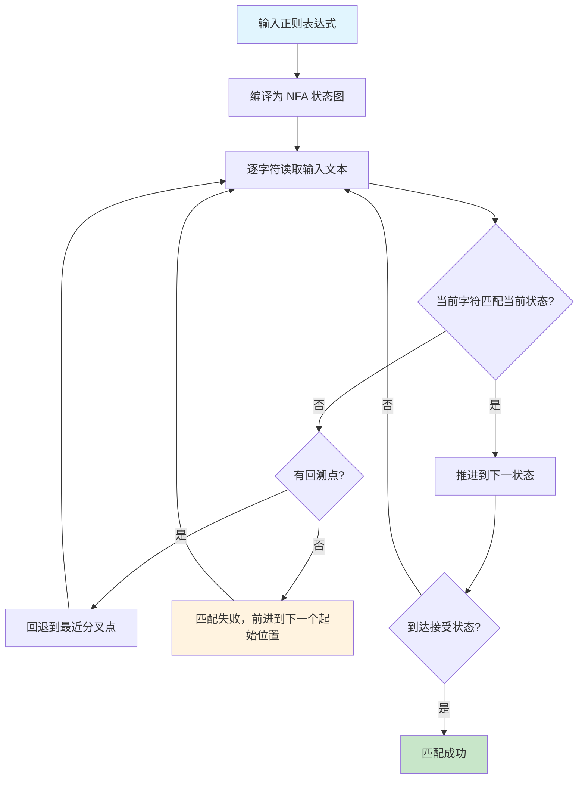
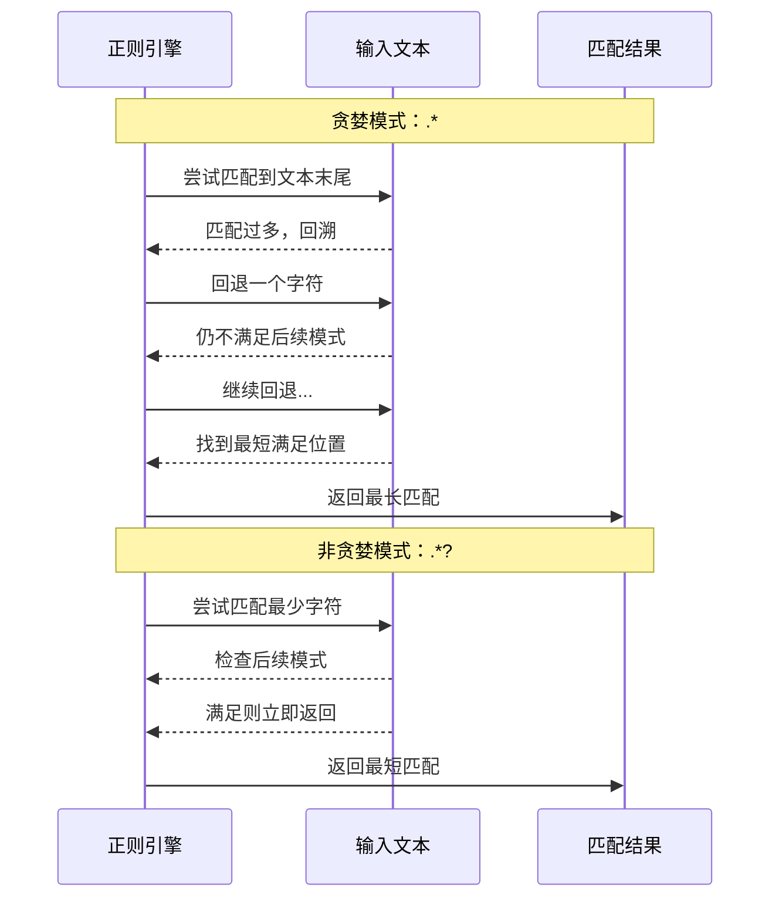
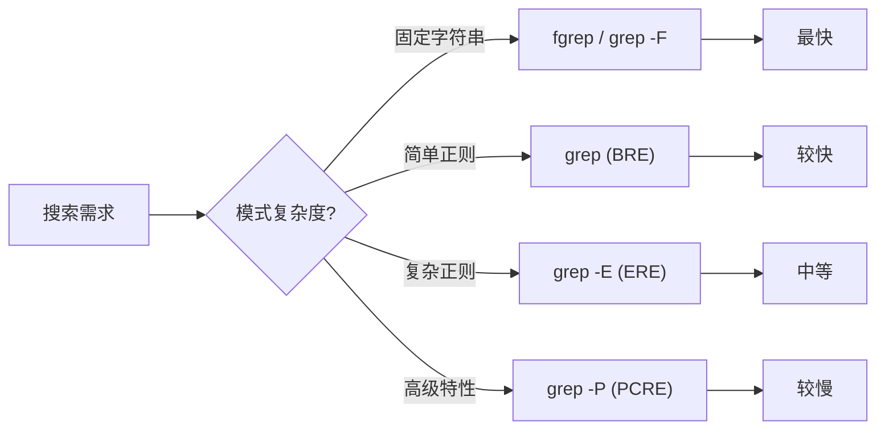

# grep 与正则表达式

正则表达式是文本处理的灵魂，grep 是 Linux 下最常用的正则匹配工具。掌握这两者，你就拥有了在海量文本中精准定位信息的能力。本文从 grep 家族出发，深入 BRE/ERE/PCRE 三套正则体系，最终落脚到日志分析、配置审计等生产实战。

## 1. grep 家族三兄弟

### 1.1 三者区别一览

| 命令 | 全称 | 正则引擎 | 速度 | 适用场景 |
|------|------|----------|------|----------|
| `grep` | Global Regular Expression Print | BRE（基本正则） | 最快 | 简单模式匹配、日常搜索 |
| `egrep` | Extended grep | ERE（扩展正则） | 较快 | 复杂模式（+?\|()等） |
| `fgrep` | Fixed-string grep | 无（固定字符串） | 最快 | 精确字符串匹配、无转义烦恼 |

::: tip 历史演变
POSIX 标准已将 `egrep` 和 `fgrep` 标记为过时（deprecated），推荐使用 `grep -E` 和 `grep -F`。但大多数系统仍保留这两个命令以兼容旧脚本。
:::

```bash
# 三者等价写法
grep 'pattern' file          # BRE 模式
grep -E 'pattern' file       # ERE 模式（等同 egrep）
grep -F 'pattern' file       # 固定字符串模式（等同 fgrep）
```

### 1.2 为什么 fgrep 最快

fgrep 将搜索模式视为纯字面字符串，跳过了正则引擎的编译和回溯过程，对于精确匹配场景（如在日志中搜索固定 IP、错误码），速度可以比 grep 快 3-5 倍。

```bash
# 在 1GB 日志中搜索固定错误码
time fgrep 'ERROR_CODE_5023' huge_app.log        # ~2s
time grep  'ERROR_CODE_5023' huge_app.log        # ~6s（走正则引擎）
time grep -F 'ERROR_CODE_5023' huge_app.log      # ~2s
```

### 1.3 grep 版本与特性

```bash
# 查看 grep 版本和编译选项
grep --version
# grep (GNU grep) 3.11
# Copyright (C) 2023 Free Software Foundation, Inc.

# 检查是否支持 PCRE
grep --help | grep -i pcre
# -P, --perl-regexp         PATTERNS are Perl regular expressions
```

::: warning PCRE 支持不保证
部分精简系统（如 Alpine 的 musl 版 grep、某些容器镜像）编译时未链接 libpcre，`grep -P` 会报错 `support for the -P option is not compiled into this version of grep`。可改用 `perl -ne 'print if /pattern/'` 或安装 `pcre2-tools` 包。
:::

## 2. BRE 基本正则表达式

### 2.1 BRE 元字符速查

BRE 是 POSIX 定义的最基础正则语法，也是 `grep` 默认使用的引擎。

| 元字符 | 含义 | 示例 | 匹配 |
|--------|------|------|------|
| `.` | 匹配任意单个字符（除换行） | `a.c` | abc, a1c, a c |
| `^` | 锚定行首 | `^root` | 以 root 开头的行 |
| `$` | 锚定行尾 | `bash$` | 以 bash 结尾的行 |
| `*` | 前一个字符出现 0 次或多次 | `ab*c` | ac, abc, abbc |
| `[...]` | 字符类，匹配其中任一字符 | `[aeiou]` | a, e, i, o, u |
| `[^...]` | 取反字符类 | `[^0-9]` | 非数字字符 |
| `\{m,n\}` | 前一个字符出现 m 到 n 次 | `a\{2,4\}` | aa, aaa, aaaa |
| `\(...\)` | 分组（需转义） | `\(ab\)*` | 空串, ab, abab |
| `\1` | 反向引用第 n 个分组 | `\(a\)\1` | aa |
| `\\` | 转义特殊字符 | `a\.b` | a.b |

::: important BRE 的"反直觉"规则
在 BRE 中，`(`、`)`、`{`、`}`、`+`、`?`、`|` 都是**字面字符**，要当作元字符使用必须加反斜杠转义：`\(`、`\)`、`\{`、`\}`。而 `\+`、`\?`、`\|` 是 GNU 扩展，不属于标准 BRE——这是 BRE 和 ERE 最易混淆的地方。
:::

### 2.2 字符类详解

```bash
# POSIX 预定义字符类（在 [] 中使用）
[[:alpha:]]   # 字母 [a-zA-Z]
[[:digit:]]   # 数字 [0-9]
[[:alnum:]]   # 字母和数字 [a-zA-Z0-9]
[[:space:]]   # 空白字符（空格、Tab、换行等）
[[:punct:]]   # 标点符号
[[:upper:]]   # 大写字母 [A-Z]
[[:lower:]]   # 小写字母 [a-z]
[[:blank:]]   # 空格和 Tab

# 实例：匹配大写字母开头的行
grep '^[[:upper:]]' /etc/passwd

# 实例：匹配包含标点符号的行
grep '[[:punct:]]' data.txt
```

### 2.3 锚点的精确使用

```bash
# ^ 锚定行首——必须出现在模式最左端
grep '^root' /etc/passwd           # root 开头的行
grep '^#' config.conf              # 注释行
grep '^[[:space:]]*$' file        # 空行或全空格行

# $ 锚定行尾——必须出现在模式最右端
grep 'bash$' /etc/passwd           # bash 结尾的行
grep ';$' script.sh                # 分号结尾的行
grep '\.$' text.txt                # 句号结尾的行（.需转义）

# ^$ 组合——精确匹配空行
grep '^$' file                     # 严格空行（无任何字符）
grep -c '^$' file                  # 统计空行数

# \b 词边界（GNU 扩展）
grep '\broot\b' /etc/passwd        # 独立单词 root，不匹配 rootkit
grep '\b[0-9]\{1,3\}\b' file       # 1-3位独立数字
```

::: warning 锚点位置陷阱
`^` 只在模式开头当锚点，否则是字面字符；`$` 只在模式结尾当锚点。例如 `a^b` 匹配字面字符串 "a^b"，`a$b` 匹配字面字符串 "a$b"。
:::

### 2.4 量词与重复

```bash
# * ——0 次或多次（BRE 标准）
grep 'ab*c' file        # ac, abc, abbc, abbbc...

# \{m\} ——恰好 m 次
grep 'a\{3\}' file      # aaa（恰好3个a）

# \{m,\} ——至少 m 次
grep 'a\{2,\}' file     # aa, aaa, aaaa...

# \{m,n\} ——m 到 n 次
grep '[0-9]\{3,5\}' file  # 3到5位连续数字

# 实例：匹配 3 位以上连续数字（排除1-2位）
grep '[0-9]\{3,\}' data.txt
```

### 2.5 反向引用

反向引用可以匹配前面分组捕获的**完全相同**的文本，是实现"重复检测"的利器。

```bash
# 匹配连续重复单词
grep '\b\([a-z]\+\)\b.*\b\1\b' text.txt
# 如：the the, is is

# 匹配回文模式（如 abba）
grep '\(.\)\(.\)\2\1' file

# 匹配 HTML 开始和结束标签一致
grep '<\([a-z]\+\)>.*</\1>' html.txt
# 如：<div>content</div> 匹配，<div>content</span> 不匹配

# 实例：找出 /etc/passwd 中用户名和注释名相同的行
grep '^\([^:]\+\):[^:]*:\1' /etc/passwd
```

## 3. ERE 扩展正则表达式

### 3.1 ERE vs BRE 核心差异

| 特性 | BRE 写法 | ERE 写法 | 说明 |
|------|----------|----------|------|
| 分组 | `\(...\)` | `(...)` | ERE 不需转义 |
| 量词 `{m,n}` | `a\{2,4\}` | `a{2,4}` | ERE 不需转义 |
| 一次或多次 | `\+`（GNU扩展） | `+` | ERE 原生支持 |
| 零次或一次 | `\?`（GNU扩展） | `?` | ERE 原生支持 |
| 或运算 | `\|`（GNU扩展） | `\|` | ERE 原生支持 |

```bash
# 使用 ERE（grep -E 或 egrep）
grep -E 'a{2,4}' file       # 比 BRE 的 a\{2,4\} 清晰得多
grep -E '(ab)+' file         # 匹配 ab, abab, ababab...
grep -E 'cat|dog' file       # 匹配 cat 或 dog
grep -E 'https?' file        # 匹配 http 或 https
```

::: tip 何时选择 ERE
当你的模式包含 `+`、`?`、`|`、`()`、`{}` 时，强烈建议使用 `grep -E`。ERE 语法更接近现代编程语言的正则，可读性远优于满篇反斜杠的 BRE。
:::

### 3.2 ERE 新增元字符

#### `+` ——一次或多次

```bash
# 匹配一个或多个数字
grep -E '[0-9]+' file

# 匹配非空行（至少一个非换行字符）
grep -E '.+' file

# 匹配连续相同字母（如 aa, bbb）
grep -E '([a-z])\1+' file
```

#### `?` ——零次或一次

```bash
# 匹配 color 或 colour
grep -E 'colou?r' file

# 匹配 http 或 https
grep -E 'https?' file

# 可选的负号
grep -E '-?[0-9]+' file     # 匹配 123 或 -123
```

#### `|` ——或运算

```bash
# 匹配多种错误级别
grep -E 'ERROR|FATAL|CRITICAL' app.log

# 匹配多种文件扩展名
grep -E '\.(js|ts|jsx|tsx)$' filelist.txt

# 分组 + 或运算
grep -E '(Jan|Feb|Mar)[[:space:]]+[0-9]{1,2}' log.txt
```

### 3.3 ERE 实战示例

```bash
# 提取 IPv4 地址
grep -Eo '[0-9]{1,3}\.[0-9]{1,3}\.[0-9]{1,3}\.[0-9]{1,3}' access.log

# 匹配有效的 Linux 用户名（小写字母开头，可含数字和下划线，3-16位）
grep -E '^[a-z][a-z0-9_]{2,15}$' /etc/passwd

# 匹配 email 地址（简化版）
grep -Eo '[a-zA-Z0-9._%+-]+@[a-zA-Z0-9.-]+\.[a-zA-Z]{2,}' emails.txt

# 匹配手机号（中国大陆）
grep -Eo '1[3-9][0-9]{9}' contacts.txt

# 匹配日期格式 YYYY-MM-DD
grep -E '[0-9]{4}-(0[1-9]|1[0-2])-(0[1-9]|[12][0-9]|3[01])' log.txt
```

## 4. PCRE Perl 兼容正则

### 4.1 PCRE 独有特性

`grep -P` 启用 PCRE 引擎，支持更强大的正则特性：

| 特性 | 语法 | 说明 |
|------|------|------|
| 非贪婪量词 | `*?`、`+?`、`??` | 尽可能少匹配 |
| 零宽断言（前瞻） | `(?=...)`、`(?!...)` | 向右断言不消费字符 |
| 零宽断言（后顾） | `(?<=...)`、`(?<!...)` | 向左断言不消费字符 |
| 命名捕获 | `(?P<name>...)` | 给分组命名 |
| 非捕获分组 | `(?:...)` | 分组但不捕获 |
| 原子分组 | `(?>...)` | 防止回溯 |
| Unicode 属性 | `\p{L}`、`\p{N}` | Unicode 类别匹配 |

### 4.2 非贪婪匹配

```bash
# 贪婪 vs 非贪婪
echo '<div>hello</div><div>world</div>' | grep -Po '<div>.*</div>'
# 贪婪匹配：<div>hello</div><div>world</div>（一整块）

echo '<div>hello</div><div>world</div>' | grep -Po '<div>.*?</div>'
# 非贪婪：<div>hello</div> 和 <div>world</div>（分别匹配）

# 提取 HTML 标签内容
echo '<title>My Page</title>' | grep -Po '(?<=<title>).*?(?=</title>)'
# 输出：My Page
```

### 4.3 零宽断言详解

零宽断言（lookaround）是正则中最精巧的特性之一——它判断某个位置的前后内容，但**不消费字符**，即匹配结果中不包含断言部分。

```mermaid
flowchart LR
    A["正则引擎"] --> B["当前匹配位置"]
    B --> C{"前瞻断言"}
    C -->|肯定 (?=...) | D["右侧文本满足条件"]
    C -->|否定 (?!...) | E["右侧文本不满足条件"]
    B --> F{"后顾断言"}
    F -->|肯定 (?<=...) | G["左侧文本满足条件"]
    F -->|否定 (?<!...) | H["左侧文本不满足条件"]
    D --> I["匹配继续，位置不动"]
    E --> I
    G --> I
    H --> I
```

```bash
# 肯定前瞻 (?=...) ——后面必须跟着...
# 匹配后面跟着 bar 的 foo
echo 'foobar foobaz' | grep -Po 'foo(?=bar)'
# 匹配：foo（仅 foobar 中的 foo）

# 否定前瞻 (?!...) ——后面不能跟着...
# 匹配后面不跟着 bar 的 foo
echo 'foobar foobaz' | grep -Po 'foo(?!bar)'
# 匹配：foo（仅 foobaz 中的 foo）

# 肯定后顾 (?<=...) ——前面必须跟着...
# 匹配前面是 $ 的数字
echo 'price: $100, count: 200' | grep -Po '(?<=\$)\d+'
# 匹配：100

# 否定后顾 (?<!...) ——前面不能跟着...
# 匹配前面不是 $ 的数字
echo 'price: $100, count: 200' | grep -Po '(?<!\$)\b\d+'
# 匹配：200
```

::: important 零宽断言实战场景
1. **密码复杂度校验**：`(?=.*[A-Z])(?=.*[a-z])(?=.*\d).{8,}`
2. **提取引号内内容**：`(?<=").+?(?=")`
3. **排除特定路径**：`/api/(?!internal/)\S+`
4. **金额提取**：`(?<=\$|￥)\d+\.?\d*`
:::

### 4.4 PCRE 高级技巧

```bash
# 命名捕获
echo '2024-01-15' | grep -P '(?P<year>\d{4})-(?P<month>\d{2})-(?P<day>\d{2})'

# 非捕获分组（提升性能，避免不必要的捕获）
grep -P '(?:https?://)?\w+\.\w+' urls.txt

# Unicode 属性匹配
grep -P '\p{Han}' file              # 匹配中文字符
grep -P '^\p{Lu}' file              # 匹配大写字母开头
grep -P '\p{P}' file                # 匹配标点符号

# 递归匹配（PCRE 独有，匹配嵌套结构）
grep -P '\((?:[^()]++|(?R))*\)' nested.txt   # 匹配括号嵌套
```

::: warning 递归正则的风险
PCRE 递归匹配非常强大，但也极易导致灾难性回溯。对深层嵌套文本（如 XML），建议使用专用解析器（xmllint、jq）而非正则。
:::

## 5. 正则引擎匹配流程

### 5.1 NFA 引擎工作原理

grep 使用的正则引擎属于 NFA（非确定性有限自动机）类型，其核心特征是**回溯**——尝试一条路径失败后回退到分叉点再试另一条路径。



### 5.2 回溯与灾难性回溯

```bash
# 正常回溯：模式 a(b|bc)d 对文本 abcd
# 尝试 b → 匹配 b → 尝试 d 对 c → 失败 → 回溯 → 尝试 bc → 匹配 → 成功

# 灾难性回溯示例（指数级复杂度）
# 模式 (a+)+b 对文本 aaaaaaaaaaaaaaaaaaaaac（20个a+c）
# 没有 b，引擎尝试所有 a 的分组可能，复杂度 O(2^n)

# 测试灾难性回溯
echo 'aaaaaaaaaaaaaaaaaaaaac' | timeout 5 grep -E '(a+)+b'
# 超时！引擎陷入指数级回溯

# 修复：使用原子分组或更精确的模式
echo 'aaaaaaaaaaaaaaaaaaaaac' | timeout 5 grep -P '(?>a+)+b'
# 立即返回（原子分组阻止回溯）
```

::: warning 防范灾难性回溯
1. 避免嵌套量词：`(a+)+`、`(.*)*`
2. 使用原子分组：`(?>...)` 阻止已匹配部分回溯
3. 使用更精确的字符类：用 `[^"]*` 代替 `.*` 匹配引号内内容
4. 设置超时：`timeout 5 grep ...`
:::

### 5.3 贪婪与非贪婪匹配机制



```bash
# 贪婪匹配的行为
echo 'a1b2c3d' | grep -Po 'a.*\d'
# 匹配 a1b2c3d（尽可能长，最后一个数字前的所有内容）

echo 'a1b2c3d' | grep -Po 'a.*?\d'
# 匹配 a1（尽可能短，第一个数字即停）

# 贪婪 vs 非贪婪：提取日志中的键值对
echo 'key1=val1;key2=val2;key3=val3' | grep -Po 'key1=.*;'     # 贪婪：key1=val1;key2=val2;
echo 'key1=val1;key2=val2;key3=val3' | grep -Po 'key1=.*?;'    # 非贪婪：key1=val1;
```

## 6. grep 常用选项详解

### 6.1 搜索模式选项

| 选项 | 含义 | 示例 |
|------|------|------|
| `-E` | 使用 ERE | `grep -E 'a\|b'` |
| `-F` | 固定字符串 | `grep -F 'error'` |
| `-P` | 使用 PCRE | `grep -P '\d{4}'` |
| `-e PAT` | 指定多个模式 | `grep -e 'error' -e 'fatal'` |
| `-f FILE` | 从文件读取模式 | `grep -f patterns.txt` |
| `-i` | 忽略大小写 | `grep -i 'error'` |
| `-w` | 全词匹配 | `grep -w 'root'` |
| `-x` | 整行匹配 | `grep -x 'exact line'` |

```bash
# -e 多模式搜索（OR 语义）
grep -e 'ERROR' -e 'FATAL' -e 'CRITICAL' app.log

# -f 从文件读取模式列表
cat > /tmp/patterns.txt << 'EOF'
ERROR
FATAL
CRITICAL
WARN.*timeout
EOF
grep -f /tmp/patterns.txt app.log

# -i 忽略大小写
grep -i 'error' app.log    # 匹配 error, Error, ERROR, ErrOr...

# -w 全词匹配
grep -w 'log' file         # 匹配 log，不匹配 login, catalog, dialog

# -x 精确整行匹配
grep -x 'root:x:0:0:root:/root:/bin/bash' /etc/passwd
```

### 6.2 输出控制选项

| 选项 | 含义 | 示例 |
|------|------|------|
| `-c` | 统计匹配行数 | `grep -c 'pattern' file` |
| `-l` | 只输出匹配的文件名 | `grep -rl 'pattern' dir/` |
| `-L` | 只输出不匹配的文件名 | `grep -L 'pattern' *.txt` |
| `-n` | 显示行号 | `grep -n 'pattern' file` |
| `-o` | 只输出匹配部分 | `grep -o '[0-9]\+' file` |
| `-q` | 静默模式（只返回退出码） | `grep -q 'pattern' && echo found` |
| `-v` | 反向匹配（不匹配的行） | `grep -v '^#' config` |
| `--color` | 彩色高亮 | `grep --color=auto 'pattern'` |
| `-m N` | 最多输出 N 个匹配 | `grep -m 10 'pattern'` |

```bash
# -c 统计各文件匹配行数
grep -c 'ERROR' *.log
# app.log:142
# web.log:38
# api.log:7

# -l 找出包含关键字的文件
grep -rl 'TODO' src/         # 递归搜索，只列文件名
grep -rl --include='*.py' 'import os' .

# -v 过滤空行和注释行
grep -v -e '^#' -e '^$' /etc/ssh/sshd_config

# -o 提取匹配内容（配合 -E 使用更强大）
grep -Eo '[0-9]{1,3}\.[0-9]{1,3}\.[0-9]{1,3}\.[0-9]{1,3}' access.log | sort | uniq -c | sort -rn | head
#   5287 192.168.1.100
#   3201 10.0.0.1
#   1543 172.16.0.50

# -q 在脚本中判断
if grep -q 'root' /etc/passwd; then
    echo "root 用户存在"
fi
```

### 6.3 上下文控制选项

| 选项 | 含义 | 示例 |
|------|------|------|
| `-A N` | 显示匹配行后 N 行 | `grep -A 5 'ERROR'` |
| `-B N` | 显示匹配行前 N 行 | `grep -B 3 'ERROR'` |
| `-C N` | 显示匹配行前后各 N 行 | `grep -C 2 'ERROR'` |
| `--group-separator` | 多匹配间分隔符 | `grep --group-separator='---'` |

```bash
# 查看错误日志上下文
grep -n -A 5 'NullPointerException' app.log
# 102:java.lang.NullPointerException
# 103-    at com.example.Service.process(Service.java:45)
# 104-    at com.example.Handler.handle(Handler.java:23)
# 105-    at sun.reflect.NativeMethodAccessorImpl.invoke0(Native)
# 106-    at sun.reflect.NativeMethodAccessorImpl.invoke(Native)
# 107-    at java.lang.reflect.Method.invoke(Method.java:498)

# 查看配置项上下文
grep -B 2 -A 2 'ServerName' /etc/apache2/sites-enabled/*

# 查看函数定义及其下几行
grep -A 10 'def process_data' src/main.py
```

### 6.4 递归搜索选项

| 选项 | 含义 | 示例 |
|------|------|------|
| `-r` | 递归搜索目录 | `grep -r 'pattern' dir/` |
| `-R` | 递归搜索（跟随符号链接） | `grep -R 'pattern' dir/` |
| `--include` | 只搜索匹配的文件 | `--include='*.py'` |
| `--exclude` | 排除匹配的文件 | `--exclude='*.min.js'` |
| `--exclude-dir` | 排除目录 | `--exclude-dir='.git'` |

```bash
# 递归搜索 Python 文件中的 TODO
grep -rn --include='*.py' 'TODO' src/

# 排除 .git 和 node_modules
grep -rn --exclude-dir='.git' --exclude-dir='node_modules' 'import' .

# 只搜索代码文件
grep -rn --include='*.{py,js,ts,java,go}' 'FIXME' .

# 搜索所有非二进制文件中的 IP
grep -rn -I '[0-9]\{1,3\}\.[0-9]\{1,3\}\.[0-9]\{1,3\}\.[0-9]\{1,3\}' /var/log/
```

## 7. 常用正则模式集合

### 7.1 网络相关

```bash
# IPv4 地址
grep -Eo '([0-9]{1,3}\.){3}[0-9]{1,3}' file

# IPv4 地址（更精确，每段0-255）
grep -Po '(25[0-5]|2[0-4]\d|1\d{2}|[1-9]?\d)(\.(25[0-5]|2[0-4]\d|1\d{2}|[1-9]?\d)){3}' file

# MAC 地址
grep -Eo '([0-9A-Fa-f]{2}:){5}[0-9A-Fa-f]{2}' file

# URL
grep -Po 'https?://[^\s<>"()]+' file

# Email 地址
grep -Eo '[a-zA-Z0-9._%+-]+@[a-zA-Z0-9.-]+\.[a-zA-Z]{2,}' file

# 域名
grep -Eo '[a-zA-Z0-9][-a-zA-Z0-9]*\.[a-zA-Z]{2,}(\.[a-zA-Z]{2,})?' file
```

### 7.2 系统运维相关

```bash
# 文件路径（Linux）
grep -Eo '/?([a-zA-Z0-9_.-]+/)+[a-zA-Z0-9_.-]+' file

# PID
grep -Eo '\b[0-9]{1,7}\b' file

# 端口号
grep -Eo '\b([0-9]{1,4}|[1-5][0-9]{4}|6[0-4][0-9]{3}|65[0-4][0-9]{2}|655[0-2][0-9]|6553[0-5])\b' file

# 时间戳（YYYY-MM-DD HH:MM:SS）
grep -Eo '[0-9]{4}-[0-9]{2}-[0-9]{2} [0-9]{2}:[0-9]{2}:[0-9]{2}' file

# 日志级别
grep -Eo '\b(DEBUG|INFO|WARN|ERROR|FATAL)\b' file

# Shell 变量
grep -Eo '\$[a-zA-Z_][a-zA-Z0-9_]*' script.sh

# 进程内存（KB/MB/GB）
grep -Eo '[0-9]+[KMGT]?' /proc/meminfo
```

### 7.3 编程相关

```bash
# IPv6 地址（简化版）
grep -Eo '([0-9a-fA-F]{0,4}:){2,7}[0-9a-fA-F]{0,4}' file

# JSON 字符串值
grep -Po '"[^"]*"\s*:\s*"[^"]*"' file

# 十六进制颜色值
grep -Eo '#[0-9a-fA-F]{3,8}' file

# UUID
grep -Eo '[0-9a-f]{8}-[0-9a-f]{4}-[0-9a-f]{4}-[0-9a-f]{4}-[0-9a-f]{12}' file

# Base64 字符串
grep -Eo '[A-Za-z0-9+/]{40,}={0,2}' file
```

## 8. 实战案例

### 8.1 日志过滤

```bash
# 案例1：提取错误日志并统计
grep -E 'ERROR|FATAL' app.log | \
  grep -oE '[0-9]{4}-[0-9]{2}-[0-9]{2}' | \
  sort | uniq -c | sort -rn

# 案例2：提取指定时间段的日志
grep -E '2024-01-15 (09|10|11):' app.log

# 案例3：提取异常堆栈（错误行 + 后续 at 开头的行）
grep -E 'Exception|^[[:space:]]+at ' app.log

# 案例4：查找 OOM 相关日志
grep -i -A 10 'out of memory\|oom\|kill' /var/log/messages

# 案例5：统计各 HTTP 状态码出现次数
grep -oE ' [0-9]{3} ' access.log | sort | uniq -c | sort -rn
```

### 8.2 配置文件检查

```bash
# 案例1：检查 SSH 安全配置
grep -E '^(PermitRootLogin|PasswordAuthentication|Port|ListenAddress)' /etc/ssh/sshd_config

# 案例2：找出所有未注释的有效配置
grep -v -e '^#' -e '^$' /etc/my.cnf

# 案例3：检查是否有空密码账户
grep '^[^:]*::' /etc/shadow

# 案例4：找出所有 cron 任务
grep -v -e '^#' -e '^$' /var/spool/cron/root 2>/dev/null

# 案例5：检查 Nginx 虚拟主机配置
grep -r -n 'server_name\|listen\|root\|proxy_pass' /etc/nginx/conf.d/
```

### 8.3 IP 地址提取与分析

```bash
# 案例1：从访问日志提取所有唯一 IP
grep -oE '[0-9]{1,3}(\.[0-9]{1,3}){3}' access.log | sort -u

# 案例2：统计各 IP 访问频次（Top 20）
grep -oE '[0-9]{1,3}(\.[0-9]{1,3}){3}' access.log | \
  sort | uniq -c | sort -rn | head -20

# 案例3：找出访问次数超过 1000 的 IP（疑似攻击）
grep -oE '[0-9]{1,3}(\.[0-9]{1,3}){3}' access.log | \
  sort | uniq -c | sort -rn | awk '$1 > 1000'

# 案例4：提取内网 IP（10.x.x.x, 172.16-31.x.x, 192.168.x.x）
grep -Eo '(10\.[0-9]{1,3}\.[0-9]{1,3}\.[0-9]{1,3}|172\.(1[6-9]|2[0-9]|3[01])\.[0-9]{1,3}\.[0-9]{1,3}|192\.168\.[0-9]{1,3}\.[0-9]{1,3})' access.log

# 案例5：提取并验证合法 IPv4
grep -Po '(25[0-5]|2[0-4]\d|1\d{2}|[1-9]?\d)(\.(25[0-5]|2[0-4]\d|1\d{2}|[1-9]?\d)){3}' access.log | sort -u
```

### 8.4 代码审查辅助

```bash
# 案例1：查找代码中的硬编码密码
grep -rn -i --include='*.{py,js,java,go,yml,yaml,conf}' \
  -e 'password\s*=\s*["\'][^"\']+["\']' \
  -e 'secret\s*=\s*["\'][^"\']+["\']' \
  src/

# 案例2：查找 TODO 和 FIXME
grep -rn --include='*.{py,js,ts,java,go}' -E 'TODO|FIXME|HACK|XXX' src/

# 案例3：查找过时的 API 调用
grep -rn 'mysql_query\|ereg\|split(' --include='*.php' src/

# 案例4：检查未使用的变量声明
grep -n 'var [a-zA-Z_][a-zA-Z0-9_]*' script.js | \
  while read line; do
    var=$(echo "$line" | grep -oP 'var \K[a-zA-Z_][a-zA-Z0-9_]*')
    count=$(grep -c "$var" script.js)
    if [ "$count" -le 1 ]; then
      echo "未使用变量: $var (行: $line)"
    fi
  done
```

### 8.5 安全审计

```bash
# 案例1：检查 sudo 权限配置
grep -E '^[^#].*NOPASSWD' /etc/sudoers /etc/sudoers.d/* 2>/dev/null

# 案例2：查找 SUID 文件（潜在提权风险）
find / -perm -4000 -type f 2>/dev/null | grep -v -E '^/(usr/bin/(sudo|passwd|chsh|chfn|newgrp|gchsh|gchfn)|usr/lib/openssh/ssh-keysign|usr/lib/dbus-1.0/dbus-daemon-launch-helper)'

# 案例3：检查开放端口
ss -tlnp | grep -E 'LISTEN'

# 案例4：检查最近失败的登录
grep 'Failed password' /var/log/auth.log | \
  grep -oE '[0-9]{1,3}(\.[0-9]{1,3}){3}' | sort | uniq -c | sort -rn | head

# 案例5：检查可疑 crontab
grep -v -e '^#' -e '^$' /var/spool/cron/* 2>/dev/null | grep -v -E '/usr/bin/(apt|yum|dnf)'
```

## 9. grep 性能优化

### 9.1 性能对比



### 9.2 优化技巧

```bash
# 1. 优先使用 grep -F 匹配固定字符串
grep -F 'exact_error_code' huge.log    # 比正则快数倍

# 2. 使用 LC_ALL=C 加速（按字节比较，跳过 locale 处理）
LC_ALL=C grep 'pattern' large_file     # 可提速 2-10x

# 3. 先过滤再搜索（管道优化）
# 慢：全文搜索
grep 'ERROR' 10GB.log

# 快：先按时间范围过滤
grep '2024-01-15 09:' 10GB.log | grep 'ERROR'

# 4. 使用 -m 限制匹配数（找到即停）
grep -m 1 'pattern' file    # 只找第一个匹配

# 5. 并行搜索大文件
# 使用 split 分割 + 后台 grep
split -l 1000000 huge.log chunk_
for f in chunk_*; do
  grep 'pattern' "$f" >> results.txt &
done
wait

# 6. 使用 ripgrep 替代（如果可用）
rg 'pattern' dir/    # Rust 实现，自动忽略 .git，并行搜索
```

::: tip 性能排序
从快到慢：`grep -F` > `grep (BRE)` > `grep -E (ERE)` > `grep -P (PCRE)` > `grep -i`（忽略大小写需要额外开销）

关键原则：**能用简单就不用复杂，能用固定字符串就不用正则**。
:::

### 9.3 大文件搜索策略

```bash
# 案例：在 50GB 日志中搜索
# 策略1：先定位大致范围
ls -lh /var/log/app/           # 找到目标日期的日志文件
grep -F 'ERROR' app-2024-01-15.log   # 在单天日志中搜索

# 策略2：使用 zgrep 搜索压缩日志
zgrep 'ERROR' app-2024-01-*.log.gz

# 策略3：使用 xargs 并行搜索
find /var/log/app/ -name '*.log' -print0 | \
  xargs -0 -P 4 -I {} grep -l 'ERROR' {}

# 策略4：索引加速（对频繁搜索的日志）
# 先建立时间索引
grep -n '^2024-01-15' app.log | head -1 | cut -d: -f1
# 然后用 tail 从指定行开始搜索
tail -n +12345 app.log | grep -m 100 'ERROR'
```

## 10. 正则表达式速查表

### 10.1 元字符完整对照

| 元字符 | BRE | ERE | PCRE | 含义 |
|--------|-----|-----|------|------|
| `.` | ✓ | ✓ | ✓ | 任意字符（除换行） |
| `^` | ✓ | ✓ | ✓ | 行首锚点 |
| `$` | ✓ | ✓ | ✓ | 行尾锚点 |
| `*` | ✓ | ✓ | ✓ | 0 次或多次 |
| `+` | ✗ | ✓ | ✓ | 1 次或多次 |
| `?` | ✗ | ✓ | ✓ | 0 次或 1 次 |
| `{m,n}` | `\{m,n\}` | ✓ | ✓ | m 到 n 次 |
| `(...)` | `\(...\)` | ✓ | ✓ | 分组 |
| `a\|b` | `a\|b` | ✓ | ✓ | 或运算 |
| `\1` | ✓ | ✗ | ✓ | 反向引用 |
| `\b` | ✓ | ✓ | ✓ | 词边界 |
| `(?=...)` | ✗ | ✗ | ✓ | 肯定前瞻 |
| `(?!...)` | ✗ | ✗ | ✓ | 否定前瞻 |
| `(?<=...)` | ✗ | ✗ | ✓ | 肯定后顾 |
| `(?<!...)` | ✗ | ✗ | ✓ | 否定后顾 |
| `(?:...)` | ✗ | ✗ | ✓ | 非捕获分组 |
| `*?` | ✗ | ✗ | ✓ | 非贪婪 |

### 10.2 常用模式速查

```bash
# 数字
[0-9]            # 单个数字
[0-9]+           # 一个或多个数字
\d+              # 同上（PCRE）
-?\d+\.?\d*     # 可选负号+可选小数（PCRE）

# 字符
[a-z]            # 小写字母
[A-Z]            # 大写字母
[a-zA-Z]         # 所有字母
\w+              # 单词字符（字母+数字+下划线）（PCRE）
\W+              # 非单词字符（PCRE）

# 空白
\s               # 空白字符（PCRE）
\S               # 非空白字符（PCRE）
[[:space:]]      # 空白字符（POSIX）

# 量词组合
.{3,5}           # 3到5个任意字符
\d{4}-\d{2}-\d{2}  # 日期格式
[1-9]\d{4,}      # 5位以上数字（邮政编码等）
```

## 11. 常见陷阱与避坑

### 11.1 BRE/ERE 混淆

```bash
# 陷阱：在 BRE 中使用 + 和 ?
grep 'a+' file     # 匹配字面字符串 "a+"，不是"一个或多个a"
grep 'a\+' file    # GNU 扩展 BRE，匹配一个或多个a
grep -E 'a+' file  # ERE，匹配一个或多个a（推荐）

# 陷阱：在 BRE 中使用 | 和 ()
grep 'cat|dog' file      # 匹配字面字符串 "cat|dog"
grep 'cat\|dog' file     # GNU 扩展 BRE，匹配 cat 或 dog
grep -E 'cat|dog' file   # ERE，匹配 cat 或 dog（推荐）

# 陷阱：BRE 分组
grep '(abc)+' file       # 匹配字面字符串 "(abc)+"
grep '\(abc\)\+' file    # GNU 扩展 BRE，匹配 abc 的重复
grep -E '(abc)+' file    # ERE，匹配 abc 的重复（推荐）
```

### 11.2 引号与转义

```bash
# 陷阱：不加引号，Shell 先解释特殊字符
grep *.txt file          # Shell 展开通配符！
grep '*.txt' file        # 正确：单引号保护
grep "*.txt" file        # 正确：双引号也可以（无 $ ` \ 时）

# 陷阱：单引号内无法使用单引号
grep 'it's' file         # 语法错误！
grep "it's" file         # 正确：用双引号
grep 'it'\''s' file      # 正确：用 '\'' 插入单引号

# 陷阱：反斜杠数量
grep '\\d' file          # BRE 中匹配字面 \d
grep -P '\d' file        # PCRE 中匹配数字
echo 'a\d' | grep '\\\\d'  # Shell吃两层，grep见 \\d，匹配 \d
```

::: important 引号最佳实践
1. 正则模式**始终用单引号**包裹，避免 Shell 解释 `*`、`$`、`?` 等
2. 需要在模式中嵌入 Shell 变量时用双引号：`grep "$VAR" file`
3. 复杂转义优先用 `grep -E` 或 `grep -P` 减少反斜杠
:::

### 11.3 Unicode 与编码

```bash
# 陷阱：多字节字符匹配
echo '中文测试' | grep '[a-z]'     # 可能意外匹配（locale 相关）
echo '中文测试' | LC_ALL=C grep '[a-z]'  # 纯 ASCII 匹配

# 正确：使用 PCRE Unicode 属性
echo '中文test' | grep -P '\p{Han}+'    # 匹配中文
echo '中文test' | grep -P '\p{Latin}+'  # 匹配拉丁字母

# 陷阱：grep 二进制文件
grep 'pattern' binary_file    # 可能输出乱码
grep -a 'pattern' binary_file # 强制按文本处理
grep -I 'pattern' dir/        # 跳过二进制文件（递归搜索时推荐）
```

## 12. grep 与其他工具配合

### 12.1 grep + sort + uniq 统计

```bash
# 统计日志中各错误类型频次
grep -oE 'ERROR_\w+' app.log | sort | uniq -c | sort -rn

# 统计访问量 Top 10 URL
grep -oE 'GET [^ ]+' access.log | sort | uniq -c | sort -rn | head -10

# 统计各状态码占比
grep -oE ' [0-9]{3} ' access.log | sort | uniq -c | sort -rn
```

### 12.2 grep + find 文件搜索

```bash
# 在特定类型文件中搜索
find . -name '*.java' -exec grep -l 'TODO' {} +

# 更高效的写法
find . -name '*.java' -print0 | xargs -0 grep -l 'TODO'

# 结合 grep 自身的递归
grep -rn --include='*.java' 'TODO' .
```

### 12.3 grep + awk 精确提取

```bash
# grep 筛选行，awk 提取字段
grep 'ERROR' app.log | awk '{print $1, $2, $NF}'

# 统计错误日志中各 IP 的错误次数
grep 'ERROR' access.log | awk '{print $1}' | sort | uniq -c | sort -rn
```

## 小结

```mermaid
mindmap
  root((grep 与正则))
    grep 家族
      grep BRE
      grep -E ERE
      grep -F 固定字符串
      grep -P PCRE
    正则体系
      BRE 基本正则
        . ^ $ * []
        \\( \\) \\{ \\}
      ERE 扩展正则
        + ? | () {}
      PCRE
        非贪婪 *? +?
        零宽断言
        命名捕获
        Unicode
    核心选项
      搜索 -E/-F/-P/-i/-w
      输出 -c/-l/-n/-o/-v
      上下文 -A/-B/-C
      递归 -r/--include
    实战场景
      日志过滤
      配置检查
      IP 提取
      安全审计
      代码审查
```

> **参考书目**
> - 《sed & awk 101 Hacks》—— Ramesh Natarajan
> - 《AWK程序设计语言》—— Alfred V. Aho, Brian W. Kernighan, Peter J. Weinberger
> - 《Linux命令行与Shell脚本编程大全》（第4版）—— Richard Blum, Christine Bresnahan
> - POSIX.1-2017 正则表达式规范
> - PCRE2 官方文档：https://www.pcre.org/
