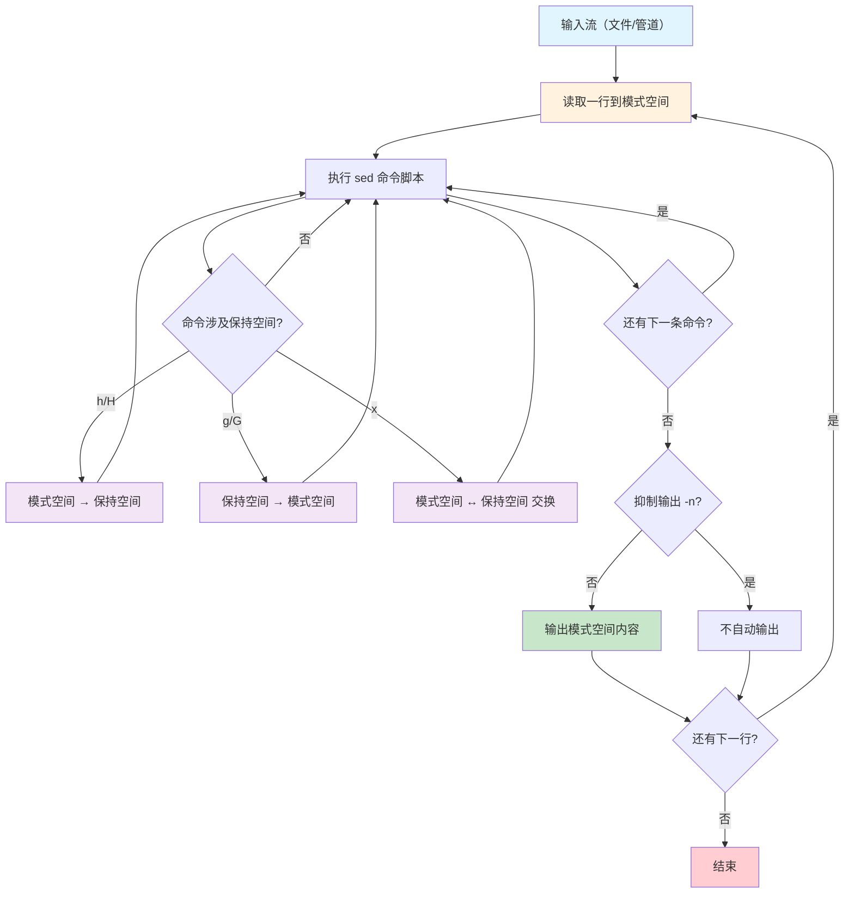
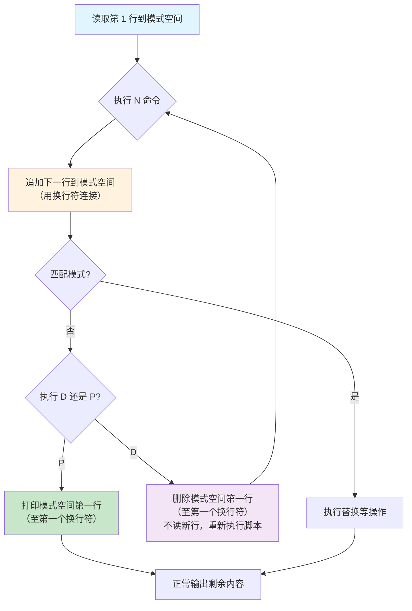
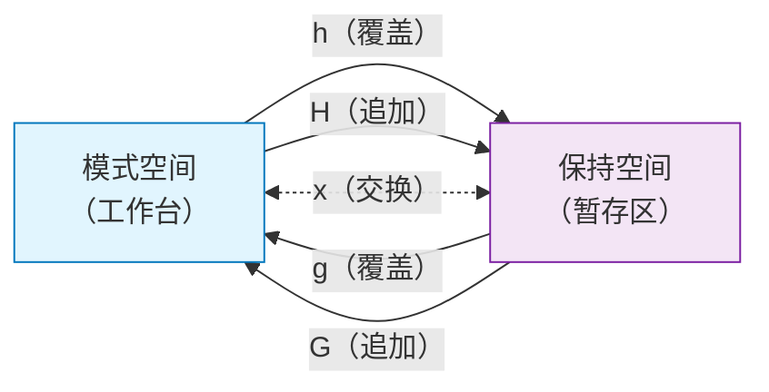

# sed 流编辑器

sed（Stream Editor）是 Unix 世界最经典的流编辑器，它逐行读取输入，在模式空间中对每行执行编辑命令，然后输出结果。与交互式编辑器不同，sed 天生适合批量文本变换——配置修改、数据清洗、日志格式化，一行命令即可处理百万行文本。

## 1. sed 工作原理

### 1.1 核心概念：两个缓冲区

sed 有两个关键缓冲区，理解它们是掌握 sed 的前提：

| 缓冲区 | 名称 | 作用 | 类比 |
|--------|------|------|------|
| **Pattern Space** | 模式空间 | 当前处理的行的工作台 | 手术台 |
| **Hold Space** | 保持空间 | 临时存储的暂存区 | 储物柜 |



### 1.2 sed 执行流程详解

```bash
# sed 的完整执行流程：
# 1. 读取输入的一行到模式空间（覆盖之前内容）
# 2. 按顺序对所有匹配的地址执行命令
# 3. 除非用了 -n 选项，否则输出模式空间内容
# 4. 回到步骤1，处理下一行
# 5. 所有行处理完毕后退出

# 最简单的 sed——相当于 cat
sed '' file                    # 每行读入，无操作，自动输出
sed -n 'p' file               # 每行读入，显式打印，效果同上
```

### 1.3 命令行语法

```bash
# 基本语法
sed [选项] '命令' 文件

# 多条命令（三种写法）
sed 's/old/new/; s/foo/bar/' file              # 分号分隔
sed -e 's/old/new/' -e 's/foo/bar/' file       # 多个 -e
sed 's/old/new/
s/foo/bar/' file                                # 换行分隔（Shell中不常用）

# 从脚本文件读取
sed -f script.sed file

# 就地修改（最常用的运维操作）
sed -i 's/old/new/' file                        # 直接修改文件
sed -i.bak 's/old/new/' file                    # 修改并备份原文件为 file.bak
```

::: warning -i 的安全隐患
`sed -i` 会直接覆盖原文件，没有确认步骤。建议：
1. 先不加 `-i` 测试输出是否正确
2. 使用 `sed -i.bak` 自动备份
3. 对重要文件先 `cp file file.bak` 再操作
:::

## 2. 地址定址

sed 命令可以指定在哪些行上执行——这就是"地址定址"。没有地址的命令作用于所有行。

### 2.1 地址类型一览

| 地址类型 | 语法 | 示例 | 含义 |
|----------|------|------|------|
| 无地址 | `cmd` | `p` | 所有行 |
| 单行号 | `Ncmd` | `3p` | 第 3 行 |
| 最后一行 | `$cmd` | `$p` | 最后一行 |
| 正则匹配 | `/pat/cmd` | `/error/p` | 匹配 pattern 的行 |
| 行号范围 | `N,Mcmd` | `5,10p` | 第 5 到 10 行 |
| 正则范围 | `/pat1/,/pat2/cmd` | `/start/,/end/p` | 从匹配 pat1 到匹配 pat2 |
| 步长 | `N~Mcmd` | `1~2p` | 从第 N 行开始每隔 M 行 |
| 取反 | `addr!cmd` | `5!p` | 不匹配地址的行 |

### 2.2 行号定址

```bash
# 打印第 5 行
sed -n '5p' file

# 打印第 5 到 10 行
sed -n '5,10p' file

# 打印最后一行
sed -n '$p' file

# 打印第 1 到最后一行（即全部）
sed -n '1,$p' file

# 删除第 3 行
sed '3d' file

# 删除第 10 到最后一行
sed '10,$d' file

# 步长：打印奇数行
sed -n '1~2p' file

# 步长：打印偶数行
sed -n '0~2p' file           # GNU sed
sed -n '2~2p' file           # 更通用
```

### 2.3 正则定址

```bash
# 打印包含 error 的行
sed -n '/error/p' file

# 删除空行
sed '/^$/d' file

# 删除注释行（# 开头）
sed '/^#/d' file

# 删除空行和注释行
sed '/^$/d; /^#/d' file
sed -e '/^$/d' -e '/^#/d' file

# 打印从 START 到 END 之间的行
sed -n '/START/,/END/p' file

# 修改从 <VirtualHost> 到 </VirtualHost> 之间的内容
sed '/<VirtualHost/,/<\/VirtualHost/ s/80/8080/' httpd.conf

# 正则定址中的正则修饰符
sed -n '/error/Ip' file       # I 标志：忽略大小写
```

::: important 正则范围的特殊行为
当第一个模式匹配后，sed 会一直匹配到第二个模式为止。如果文件结束仍未匹配第二个模式，则从第一个模式匹配行到文件末尾都会被选中。如果再次出现第一个模式，会开始新的范围。
:::

### 2.4 取反定址

```bash
# 删除除第 5 行外的所有行（即只保留第 5 行）
sed '5!d' file                # 等同于 sed -n '5p'

# 删除不包含 error 的行（即只保留包含 error 的行）
sed '/error/!d' file          # 等同于 sed -n '/error/p' 或 grep 'error'

# 对非注释行执行替换
sed '/^#/!s/old/new/' file

# 对非空行添加行号
sed '/^$/!=' file
```

## 3. 常用命令详解

### 3.1 命令速查表

| 命令 | 全称 | 作用 | 模式空间影响 |
|------|------|------|-------------|
| `s` | substitute | 替换 | 修改内容 |
| `d` | delete | 删除行 | 清空模式空间 |
| `p` | print | 打印行 | 不变 |
| `a` | append | 在行后追加 | 不变（追加到输出） |
| `i` | insert | 在行前插入 | 不变（插入到输出） |
| `c` | change | 替换整行 | 替换内容 |
| `n` | next | 读取下一行 | 覆盖模式空间 |
| `N` | Next | 追加下一行 | 追加到模式空间 |
| `D` | Delete | 删除模式空间第一行 | 删除至第一个换行符 |
| `P` | Print | 打印模式空间第一行 | 不变 |
| `h` | hold | 覆盖保持空间 | 不变 |
| `H` | Hold | 追加到保持空间 | 不变 |
| `g` | get | 从保持空间覆盖 | 被覆盖 |
| `G` | Get | 从保持空间追加 | 追加换行+内容 |
| `x` | exchange | 交换两个空间 | 互换 |
| `=` | line number | 打印行号 | 不变 |
| `q` | quit | 退出 sed | 不变 |
| `r` | read | 读取文件内容追加 | 不变 |
| `w` | write | 写入文件 | 不变 |
| `y` | transliterate | 字符转换（类似 tr） | 修改内容 |
| `l` | look | 不可见字符可视化 | 不变 |

### 3.2 替换命令 s——最核心的命令

```bash
# 基本语法：s/模式/替换/标志

# 基本替换
sed 's/old/new/' file                  # 每行替换第一个
sed 's/old/new/g' file                 # 替换所有（global）
sed 's/old/new/2' file                 # 只替换每行第 2 个
sed 's/old/new/2g' file                # 从第 2 个开始替换所有

# 替换标志
# g  - 全局替换
# i/I - 忽略大小写
# p  - 打印替换后的行（常配合 -n 使用）
# w file - 将替换结果写入文件

# 只打印发生替换的行
sed -n 's/error/ERROR/p' file

# 替换并写入新文件
sed 's/old/new/gw output.txt' file

# 忽略大小写替换
sed 's/error/ERROR/gi' file
```

#### 替换中的特殊字符

```bash
# & ——代表整个匹配内容
sed 's/[0-9]\+/[&]/' file              # 给数字加方括号
# 123 → [123]
echo 'hello world' | sed 's/\w\+/[&]/g'
# [hello] [world]

# \1, \2... ——反向引用分组
sed 's/\([a-z]\+\) \([a-z]\+\)/\2 \1/' file    # 交换两个单词
echo 'hello world' | sed 's/\(hello\) \(world\)/\2 \1/'
# world hello

# 使用 ERE 减少反斜杠
sed -E 's/([a-z]+) ([a-z]+)/\2 \1/' file        # 同上，更清晰

# 替换分隔符可以更换（处理路径时极有用）
# 用 / 作分隔符——噩梦
sed 's/\/usr\/local\/bin/\/opt\/bin/' file

# 用 # 或 | 作分隔符——清晰
sed 's#/usr/local/bin#/opt/bin#' file
sed 's|/usr/local/bin|/opt/bin|' file

# 部分删除（替换为空）
sed 's/[[:space:]]*$//' file           # 删除行尾空格
sed 's/^[[:space:]]*//' file           # 删除行首空格
sed 's/<[^>]*>//g' html.txt            # 删除 HTML 标签
```

::: tip 分隔符选择原则
1. 默认用 `/`
2. 当模式或替换中包含 `/` 时，换用 `#`、`|`、`@`、`!` 等
3. 选择模式中最不常出现的字符作为分隔符
:::

### 3.3 追加、插入、修改

```bash
# a（append）——在匹配行后追加
sed '/error/a\=== ERROR FOUND ===' file
# error line
# === ERROR FOUND ===

# 追加多行
sed '/error/a\=== ERROR FOUND ===\
Please check the log' file

# i（insert）——在匹配行前插入
sed '/ServerName/i\# Added by admin' httpd.conf
# # Added by admin
# ServerName example.com

# c（change）——替换整行
sed '/^Port/c\Port 2222' sshd_config
# 将 Port 开头的行替换为 Port 2222

# 在文件开头添加内容
sed '1i\#!/bin/bash\n# Auto-generated script' script.sh

# 在文件末尾追加
sed '$a\# End of configuration' config.conf
```

### 3.4 删除命令

```bash
# 删除空行
sed '/^$/d' file

# 删除行首空格（不删除行）
sed 's/^[[:space:]]*//' file

# 删除行尾空格
sed 's/[[:space:]]*$//' file

# 删除注释行
sed '/^#/d' file

# 删除 C 风格注释 /* ... */（单行）
sed '/\/\*.*\*\//d' file

# 删除 HTML 标签
sed 's/<[^>]*>//g' file

# 删除第 1 到 5 行
sed '1,5d' file

# 删除从 pattern 到文件末尾
sed '/pattern/,$d' file
```

### 3.5 打印与行号

```bash
# p 命令——打印（通常配合 -n 使用，否则会输出两遍）
sed -n '5,10p' file              # 打印第 5-10 行（等同于 head -10 | tail -6）
sed -n '/error/p' file           # 打印包含 error 的行（等同于 grep）

# 等号命令——打印行号
sed -n '/error/=' file           # 只打印行号
sed -n '/error/{=;p}' file       # 打印行号和内容

# 巧妙实现 cat -n（加行号）
sed '=' file | sed 'N;s/\n/\t/'

# 只打印匹配行的行号和内容
sed -n '/pattern/{=;p}' file | sed 'N;s/\n/: /'
```

### 3.6 退出与读取

```bash
# q——读取到指定行后退出
sed '5q' file                    # 等同于 head -5
sed '/^EOF$/q' file              # 读到 EOF 行后停止

# 打印文件前 10 行（比 head 高效——不会继续读取）
sed '10q' file

# r——读取文件内容追加到匹配行后
sed '/<body>/r header.html' page.html    # 在 <body> 后插入 header.html

# 合并文件
sed '$r file2.txt' file1.txt     # 在 file1 末尾追加 file2 的内容

# w——将匹配行写入文件
sed -n '/error/w errors.txt' app.log     # 将错误行写入 errors.txt
sed '/^#/w comments.txt' config.conf     # 注释行写入单独文件
```

### 3.7 字符转换 y

```bash
# y 命令——逐字符转换（类似 tr）
echo 'Hello World' | sed 'y/abcdefghijklmnopqrstuvwxyz/ABCDEFGHIJKLMNOPQRSTUVWXYZ/'
# HELLO WORLD

# 更实用的场景——大小写转换
echo 'hello' | sed 'y/a-z/A-Z/'         # GNU sed 扩展
# 实际上这个不工作！y 命令不支持范围，必须列出每个字符

# 正确做法
echo 'hello' | sed 'y/abcdefghijklmnopqrstuvwxyz/ABCDEFGHIJKLMNOPQRSTUVWXYZ/'

# 或者用更简单的方法
echo 'hello' | sed 's/.*/\U&/'          # GNU sed 扩展
```

## 4. 多行处理

多行处理是 sed 最强大也最复杂的部分，它打破了"逐行处理"的局限。

### 4.1 N/D/P 命令详解



```bash
# N 命令——追加下一行到模式空间
# 场景：合并被换行拆分的行（如 "abc\\\n" 续行）
sed '/\\$/{N;s/\\\n//;}' file
# 输入：
#   first line\
#   second line
# 输出：
#   first linesecond line

# D 命令——删除模式空间第一行
# 场景：删除连续的空行，只保留一个
sed '/^$/{N;/^\n$/d;}' file

# P 命令——打印模式空间第一行
# 场景：只打印多行模式空间的第一行
sed -n 'N;P' file
```

### 4.2 合并相邻行

```bash
# 将每两行合并为一行
sed 'N;s/\n/ /' file
# 输入：
#   line1
#   line2
#   line3
#   line4
# 输出：
#   line1 line2
#   line3 line4

# 将所有行合并为一行
sed ':a;N;$!ba;s/\n/ /g' file
# 解释：
# :a       设置标签 a
# N        追加下一行
# $!ba     如果不是最后一行，跳转到标签 a
# s/\n/ /g 替换所有换行为空格

# 合并以特定字符结尾的行（如反斜杠续行）
sed ':a;/\\$/{N;ba;}' file | sed 's/\\\n//g'
# 输入：
#   CFLAGS=-O2 \
#   -Wall \
#   -Werror
# 输出：
#   CFLAGS=-O2 -Wall -Werror
```

### 4.3 删除连续空行

```bash
# 删除连续空行，只保留一个空行
sed '/^$/N;/^\n$/d' file
# 工作原理：
# 1. 遇到空行
# 2. N 追加下一行
# 3. 如果下一行也是空（^\n$），删除整个模式空间
# 4. 否则正常输出

# 删除所有空行
sed '/^$/d' file

# 删除开头空行
sed '/./,$!d' file

# 删除结尾空行
sed -e :a -e '/^\n*$/{$d;N;ba;}'
```

### 4.4 反转行序

```bash
# 反转文件所有行（类似 tac）
sed '1!G;h;$!d' file
# 工作原理：
# 第1行：1!G 不执行 → h 存入保持空间 → $!d 删除模式空间（不输出）
# 第2行：1!G 将保持空间(第1行)追加到模式空间(第2行) → h 存入保持空间 → $!d 删除
# 第3行：1!G 追加(第1行\n第2行) → h → 最后一行！不删除，输出
# 输出：第3行\n第2行\n第1行

# 更易理解的写法
sed -n '1!G;h;$p' file
```

::: important 理解 1!G;h;$!d
这是 sed 最经典的"黑魔法"之一，拆解如下：
1. `1!G` ——非第1行时，将保持空间追加到模式空间
2. `h` ——将模式空间覆盖到保持空间（不断累积反转后的内容）
3. `$!d` ——非最后一行时，删除模式空间（不输出）
4. 到最后一行时，`$!d` 不执行，模式空间（已反转）自动输出
:::

## 5. 保持空间操作

### 5.1 保持空间命令交互图



### 5.2 保持空间实战

```bash
# 案例1：将匹配行移到文件末尾
sed '/pattern/{H;d;};$G' file
# H 追加到保持空间 → d 删除该行 → $G 在末尾追加保持空间内容

# 案例2：将匹配行移到文件开头
sed '/pattern/{h;d;};G' file
# h 存入保持空间 → d 删除 → G 追加到每行之后
# 注意：这会在每行后追加，不太对。正确写法：

sed -e '/pattern/{H;d;}' -e '${x;G;}' file
# H 收集所有匹配行到保持空间 → d 删除 → 最后一行时 x 取出保持空间 → G 追加

# 案例3：双行合一（将下一行内容追加到当前行末尾）
sed 'N;s/\n/ /' file

# 案例4：行列转换（每行一个单词 → 一行逗号分隔）
sed ':a;N;$!ba;s/\n/,/g' file
# word1
# word2
# word3 → word1,word2,word3

# 案例5：给文件添加标题行
sed '1h;1d;2{x;G;}' file
# 不太对，正确写法：
sed '1{i\
# Title Header
}' file

# 案例6：交换相邻行
sed '{N;s/\(.*\)\n\(.*\)/\2\n\1/}' file
# line1      line2
# line2  →   line1
# line3      line4
# line4      line3
```

### 5.3 模式空间与保持空间协作流程

```mermaid
sequenceDiagram
    participant Input as 输入流
    participant PS as 模式空间
    participant HS as 保持空间
    participant Output as 输出流

    Note over Input,Output: 命令：1!G;h;$!d（反转行序）

    Input->>PS: 第1行 "Hello"
    PS->>HS: h（覆盖）: "Hello"
    PS->>Output: $!d 删除，不输出

    Input->>PS: 第2行 "World"
    HS->>PS: 1!G（追加）: "World\nHello"
    PS->>HS: h（覆盖）: "World\nHello"
    PS->>Output: $!d 删除，不输出

    Input->>PS: 第3行 "!"
    HS->>PS: 1!G（追加）: "!\nWorld\nHello"
    PS->>HS: h（覆盖）: "!\nWorld\nHello"
    Note over PS: 最后一行，$!d 不执行
    PS->>Output: 输出 "!\nWorld\nHello"
```

## 6. 分支与测试

### 6.1 标签与跳转

| 命令 | 语法 | 作用 |
|------|------|------|
| `:label` | `:a` | 定义标签 |
| `b label` | `b a` | 无条件跳转到标签 |
| `t label` | `t a` | 如果最近一次替换成功，跳转到标签 |

```bash
# b 命令——无条件跳转

# 删除所有前导空格（循环替换）
sed ':a;s/^[[:space:]]//;ta' file
# :a       定义标签 a
# s/^...// 替换行首空格
# ta       如果替换成功，跳回标签 a（循环直到没有前导空格）

# 给数字加千分位分隔符
echo '1234567890' | sed ':a;s/\B[0-9]\{3\}\>/,&/;ta'
# 1,234,567,890
# 工作原理：从右向左，每3位数字前加逗号
# \B 非词边界（确保不是开头）
# ta 替换成功则循环

# 使用 ERE 更清晰
echo '1234567890' | sed -E ':a;s/([0-9])([0-9]{3})($|[^0-9])/\1,\2\3/;ta'
```

### 6.2 条件分支 t

```bash
# t 命令——替换成功则跳转

# 去除嵌套引号
echo '""hello""' | sed ':a;s/""/"/;ta'
# "hello"
# 每次替换一对引号，成功则循环

# 递归替换
echo 'aabbcc' | sed ':a;s/\([a-z]\)\1/\1/;ta'
# abc
# 将连续重复字母合并为一个

# 只在替换成功时执行额外操作
sed 's/error/ERROR/;t;s/warn/WARN/' file
# 如果 error→ERROR 成功，跳过 warn→WARN
# 如果 error→ERROR 失败，尝试 warn→WARN
```

### 6.3 分支与保持空间组合

```bash
# 将所有匹配行收集到文件末尾
sed -n '/pattern/{H;d;};p;${x;p;}' file
# /pattern/ 匹配行 → H 追加到保持空间 → d 删除不输出
# 非匹配行 → p 正常输出
# 最后一行 → x 取出保持空间 → p 输出

# 交替合并两个文件的内容
# file1: a, b, c
# file2: 1, 2, 3
# 结果: a, 1, b, 2, c, 3
paste -d'\n' file1 file2

# 用 sed 实现类似的合并
sed 'R file2' file1
# R 命令在每行后读取 file2 的下一行追加
```

## 7. sed 脚本文件

### 7.1 编写脚本文件

当 sed 命令变得复杂时，写成脚本文件更易于维护。

```bash
# script.sed —— 配置文件标准化脚本
#!/usr/bin/sed -f

# 删除空行和注释行
/^$/d
/^#/d

# 删除行尾空格
s/[[:space:]]*$//

# 统一缩进为 4 个空格
s/^\t/    /g

# 替换旧域名
s/old\.example\.com/new.example.com/g

# 在 ServerName 前添加注释
/ServerName/i\# Updated by automation

# 在文件末尾追加配置
$a\
# Added by automation\
Timeout 300\
KeepAlive On
```

```bash
# 使用脚本文件
chmod +x script.sed
sed -f script.sed config.conf

# 或者直接执行
./script.sed config.conf
```

### 7.2 模块化脚本

```bash
# clean_log.sed —— 日志清洗脚本
#!/usr/bin/sed -f

# 阶段1：去除 ANSI 颜色码
s/\x1b\[[0-9;]*[mGKH]//g

# 阶段2：统一时间格式
s/[0-9]\{4\}\/[0-9]\{2\}\/[0-9]\{2\}/&/g

# 阶段3：去除行号前缀
s/^[[:space:]]*[0-9]\+[[:space:]]*//g

# 阶段4：删除空行
/^$/d

# 阶段5：高亮错误
s/ERROR/*** ERROR ***/g
s/FATAL/*** FATAL ***/g
```

## 8. 实战案例

### 8.1 配置文件修改

```bash
# 案例1：修改 SSH 端口
sed -i 's/^Port .*/Port 2222/' /etc/ssh/sshd_config

# 案例2：启用 Nginx gzip
sed -i 's/# gzip/gzip/' /etc/nginx/nginx.conf

# 案例3：修改 MySQL 绑定地址
sed -i 's/^bind-address.*/bind-address = 0.0.0.0/' /etc/my.cnf

# 案例4：添加新配置项（如果不存在）
grep -q 'MaxKeepAliveRequests' httpd.conf || \
  sed -i '$a\MaxKeepAliveRequests 1000' httpd.conf

# 案例5：修改指定段落的配置
# 在 [mysqld] 段下添加配置
sed -i '/\[mysqld\]/a\max_connections = 500' /etc/my.cnf

# 案例6：批量替换多个配置文件
sed -i 's/server\.old\.com/server.new.com/g' /etc/nginx/sites-enabled/*

# 案例7：注释掉指定行
sed -i 's/^PermitRootLogin.*/#&/' /etc/ssh/sshd_config
# PermitRootLogin yes → #PermitRootLogin yes

# 案例8：取消注释
sed -i 's/^#\(ServerName\)/\1/' /etc/apache2/httpd.conf
```

::: important 配置修改的安全生产流程
1. **先备份**：`cp config.conf config.conf.bak` 或 `sed -i.bak`
2. **先测试**：不加 `-i` 先看输出
3. **用 -i.bak**：自动备份原文件
4. **验证语法**：修改后用工具检查（如 `nginx -t`、`apachectl configtest`）
5. **重启服务**：修改生效
:::

### 8.2 数据清洗

```bash
# 案例1：CSV 数据清洗
# 去除字段前后空格
sed 's/ *,/,/g; s/, */,/g' data.csv

# 案例2：统一日期格式 MM/DD/YYYY → YYYY-MM-DD
sed -E 's/([0-9]{2})\/([0-9]{2})\/([0-9]{4})/\3-\1-\2/g' data.txt

# 案例3：去除 HTML 标签
sed 's/<[^>]*>//g' page.html

# 案例4：去除 Windows 换行符 \r
sed 's/\r$//' file.txt                   # 删除 \r
sed -i 's/\r$//' file.txt                # 就地修改

# 案例5：去除 ANSI 颜色码
sed 's/\x1b\[[0-9;]*[mGKH]//g' colored_log.txt

# 案例6：去除行号
sed 's/^[[:space:]]*[0-9]\+[[:space:]]*//' numbered.txt

# 案例7：标准化空格（多个空格变一个）
sed 's/[[:space:]]\+/ /g' file

# 案例8：数字格式化（千分位）
echo '1234567.89' | sed ':a;s/\B[0-9]\{3\}\>/,&/;ta'
# 1,234,567.89
```

### 8.3 批量替换

```bash
# 案例1：全项目替换函数名
find . -name '*.py' -exec sed -i 's/old_function/new_function/g' {} +

# 案例2：批量替换（带备份）
find . -name '*.conf' -exec sed -i.bak 's/old_host/new_host/g' {} +

# 案例3：只替换特定目录下的文件
sed -i 's/debug=True/debug=False/' src/**/*.py

# 案例4：替换但排除 .git 目录
find . -name '*.js' -not -path './.git/*' | \
  xargs sed -i 's/console\.log/console.debug/g'

# 案例5：替换并显示修改了哪些文件
grep -rl 'old_text' . | while read f; do
  sed -i 's/old_text/new_text/g' "$f"
  echo "Modified: $f"
done

# 案例6：条件替换——只替换包含特定上下文的行
sed '/ServerName example/s/80/8080/' vhost.conf
# 只在包含 "ServerName example" 的行替换端口
```

### 8.4 文本格式化

```bash
# 案例1：给代码添加行号
sed '=' code.py | sed 'N;s/\n/\t/'

# 案例2：将 Tab 转为空格
sed 's/\t/    /g' file          # 每个 Tab 替换为 4 空格

# 案例3：将空格转为 Tab
sed 's/    /\t/g' file          # 4 空格替换为 Tab

# 案例4：文本居中（假设 80 列宽）
sed -e ':a' -e 's/^.\{1,78\}$/ &/;ta' file
# 不断在行首加空格，直到行宽达到 79

# 案例5：段落格式化——双换行分段
sed '/^$/{N;s/\n\n/\n\n/;}' file   # 确保段落间只有一个空行

# 案例6：每行前加时间戳
sed "s/^/$(date '+%Y-%m-%d %H:%M:%S') /" file

# 案例7：截断过长行
sed 's/\(.\{80\}\).*/\1/' file      # 截断超过 80 字符的行
```

### 8.5 日志处理

```bash
# 案例1：提取指定时间段日志
sed -n '/2024-01-15 09:00/,/2024-01-15 17:00/p' app.log

# 案例2：去除日志中的调试信息
sed '/DEBUG/d' app.log

# 案例3：格式化日志时间戳
sed -E 's/([0-9]{4})([0-9]{2})([0-9]{2})/\1-\2-\3/g' app.log
# 20240115 → 2024-01-15

# 案例4：在异常信息后添加分隔线
sed '/Exception/a\================================' app.log

# 案例5：压缩多行堆栈为单行
sed ':a;/Exception/{N;s/\n/ | /;ba;}' app.log

# 案例6：日志脱敏（隐藏手机号中间4位）
sed -E 's/(1[3-9][0-9])[0-9]{4}([0-9]{4})/\1****\2/g' user.log
# 13812345678 → 138****5678
```

## 9. GNU sed 扩展特性

### 9.1 扩展正则 -E

```bash
# 使用扩展正则（减少反斜杠）
sed -E 's/([0-9]{1,3}\.){3}[0-9]{1,3}/[IP REDACTED]/g' access.log

# 不用 -E 的等价写法（满眼反斜杠）
sed 's/\([0-9]\{1,3\}\.\)\{3\}[0-9]\{1,3\}/[IP REDACTED]/g' access.log
```

### 9.2 特殊转义序列

```bash
# \L \U \l \u ——大小写转换
echo 'hello WORLD' | sed 's/.*/\U&/'          # HELLO WORLD
echo 'hello WORLD' | sed 's/.*/\L&/'          # hello world
echo 'hello world' | sed 's/\w\+/\u&/'        # Hello world（首单词首字母大写）
echo 'hello world' | sed 's/\b\w/\u&/g'       # Hello World（每个单词首字母大写）

# \n ——换行符
echo 'abc' | sed 's/b/\n/'                     # a\nc（在替换中插入换行）

# \t ——制表符
echo 'a,b,c' | sed 's/,/\t/g'                 # a	b	c
```

### 9.3 特殊地址

```bash
# 0,addr ——从文件开头匹配（GNU 扩展）
# 标准 sed 中 1,/pat/ 不会匹配第1行本身就包含 pat 的情况
# 0,/pat/ 可以正确处理
sed -n '0,/^START/p' file       # 从开头到第一个 START

# +N ——匹配地址后 N 行
sed -n '/pattern/,+3p' file     # 匹配行及其后 3 行

# ~N ——步长
sed -n '1~3p' file              # 第1、4、7、10...行
```

## 10. sed 性能与技巧

### 10.1 性能优化

```bash
# 1. 用 q 提前退出（找到即停）
sed '/pattern/{p;q;}' file      # 找到第一个匹配即退出

# 2. 用地址范围减少处理行数
sed -n '1000,2000s/old/new/p' file   # 只处理 1000-2000 行

# 3. 多个替换合并
# 慢：多次调用
sed 's/a/A/g' file | sed 's/b/B/g' | sed 's/c/C/g'

# 快：一次调用
sed 's/a/A/g; s/b/B/g; s/c/C/g' file

# 4. LC_ALL=C 加速
LC_ALL=C sed 's/pattern/replacement/g' large_file
```

### 10.2 调试技巧

```bash
# 使用 l 命令查看模式空间（不可见字符可视化）
echo -e 'hello\tworld' | sed -n 'l'
# hello\tworld$    （Tab 和行尾 $ 可见）

# 使用 = 查看行号
sed -n '=;p' file | sed 'N;s/\n/: /'

# 逐步调试（打印每步处理后的模式空间）
sed 's/a/A/;l;s/b/B/;l' file
```

### 10.3 常见错误

```bash
# 错误1：忘记 -n 导致输出翻倍
sed 'p' file          # 每行打印两遍（自动输出 + p 打印）
sed -n 'p' file       # 正确

# 错误2：-i 和管道冲突
cat file | sed -i 's/old/new/'    # 错误！-i 只能用于文件
sed 's/old/new/' file > output    # 正确

# 错误3：macOS sed 和 GNU sed 差异
# macOS sed 不支持 -i 不带参数
sed -i 's/old/new/' file          # macOS 报错
sed -i '' 's/old/new/' file       # macOS 写法
# 建议安装 gsed
brew install gnu-sed
gsed -i 's/old/new/' file         # GNU sed 写法
```

::: warning macOS sed 兼容性
macOS 自带的 sed 是 BSD 版本，与 GNU sed 有多处不兼容：
1. `-i` 必须带参数（空字符串 `''` 表示无备份）
2. 不支持 `-E` 以外的 GNU 扩展
3. 转义序列行为不同（`\t`、`\n` 等）
4. 建议在 macOS 上安装 `gnu-sed`：`brew install gnu-sed`
:::

## 11. sed 与其他工具对比

### 11.1 sed vs tr

```bash
# 简单字符转换 → 用 tr
echo 'hello' | tr 'a-z' 'A-Z'        # HELLO（更快更简洁）
echo 'hello' | sed 's/.*/\U&/'       # HELLO（大材小用）

# 删除字符 → 用 tr
echo 'hello 123' | tr -d '0-9'       # hello
echo 'hello 123' | sed 's/[0-9]//g'  # hello

# 压缩重复字符 → 用 tr
echo 'heeellooo' | tr -s 'elo'       # helo
```

### 11.2 sed vs awk

```bash
# 简单替换 → 用 sed
sed 's/old/new/g' file               # 更简洁

# 涉及字段计算 → 用 awk
awk '{sum += $3} END {print sum}'    # sed 无法做算术

# 条件替换 → 视复杂度选择
sed '/pattern/s/old/new/' file       # 简单条件用 sed
awk '/pattern/{gsub(/old/, "new"); print}' file  # 复杂条件用 awk
```

### 11.3 适用场景总结

| 场景 | 推荐工具 | 原因 |
|------|----------|------|
| 简单替换 | sed | 语法简洁，速度快 |
| 字符转换 | tr | 专为此设计 |
| 字段处理 | awk | 原生字段分割 |
| 配置修改 | sed | `-i` 就地修改 |
| 删除/过滤行 | sed/grep | 两者皆可 |
| 计算统计 | awk | 支持算术运算 |
| 格式转换 | sed | 灵活的正则替换 |

## 小结


> **参考书目**
> - 《sed & awk 101 Hacks》—— Ramesh Natarajan
> - 《AWK程序设计语言》—— Alfred V. Aho, Brian W. Kernighan, Peter J. Weinberger
> - 《Linux命令行与Shell脚本编程大全》（第4版）—— Richard Blum, Christine Bresnahan
> - GNU sed 官方手册：https://www.gnu.org/software/sed/manual/
